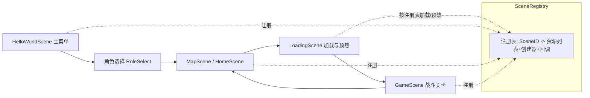
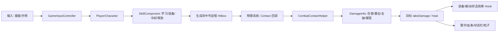

# Adventure‑King《冒险王之神兵传奇》项目介绍（对外展示版）

> 本文面向**不了解我们项目**、也**不熟悉 Cocos2d‑x/C++ 游戏开发**的读者：  
> 你不需要读代码，也能理解这款游戏“做了什么”“怎么玩”“有什么亮点”；  
> 如果你对实现好奇，文末提供了清晰的代码入口，方便进一步深挖。

---

## 0. 一句话概括

我们用 **Cocos2d‑x** 开发了一款**横版动作冒险**游戏原型，核心体验是：  
**选职业 → 进关卡 → 战斗与成长（技能/装备/状态效果）→ Boss 机制（击破）→ 存档（本地/云端演示）**。

---

## 1. 这是一个什么项目？

- **项目名称**：Adventure‑King《冒险王之神兵传奇》
- **类型**：2D 横版动作冒险（带轻 RPG 成长）
- **定位**：可运行、可扩展的游戏工程原型（玩法闭环 + 系统框架 + 工程规范）
- **开发目标**：用工程化方式把“角色成长 + 战斗反馈 + 关卡加载 + 存档与同步”串成一个稳定的闭环。

我们希望它不仅能“跑起来”，还要做到：
- **系统可扩展**：加新怪物/新技能/新装备尽量不改核心逻辑；
- **体验可验证**：有 Debug 场景、训练木桩、明确的日志与 UI；
- **性能可控**：预加载与资源缓存，避免“第一次出现卡一下”；
- **存档可靠**：本地存档升级为 SQLite‑KV（跨平台），并预留云同步接口（演示版后端）。

---

## 2. 我该怎么玩？（从零到上手）

### 2.1 主菜单与角色选择

你进入游戏后会看到主菜单（`HelloWorldScene`）。典型流程：
1. 点击开始游戏
2. 进入**角色选择**（法师 / 战士 / 刺客）
3. 进入地图/关卡入口（Home 或关卡选择）

### 2.2 关卡进入：加载中 + 进度条

关卡进入前会显示 **LoadingScene**，底部有进度条。  
它的作用不是“装饰”，而是承载以下能力：
- **预加载贴图/粒子/音频**，减少进入关卡瞬间卡顿；
- **粒子预热**：避免首帧粒子“停一拍”；
- 如果目标场景已预载完成，则会**跳过 LoadingScene** 直接进入。

### 2.3 游戏中：战斗、技能、掉落、暂停与死亡

关卡中你会体验到：
- **技能栏/状态栏**：HP/MP/技能冷却/状态效果提示；
- **打击反馈**：受击粒子、状态特效（燃烧/中毒/回血等）、飘字；
- **掉落物**：怪物死亡有概率掉血瓶/蓝瓶，路过自动拾取（漂浮 + 淡出）；
- **暂停**：暂停会冻结战斗（人物/怪物/投掷物/坡面滑动等）；
- **死亡菜单**：角色死亡后会暂停，并弹出选择：
  - 重新挑战本关
  - 返回地图页面

---

## 3. 我们做了哪些“可见的东西”？

下面用“玩家视角”列出主干功能（以 `main` 分支为准）：

### 3.1 两张关卡地图（TMX）

- **起源之菇**（Origin_Mushroom）
- **神秘之森**（Mystery_Forest）

地图以 TMX 为主，包含：
- 碰撞层（collisions）：自动生成物理碰撞体
- 出生点（born）
- 传送门（gate）
- 刷怪点（enemy_g）：按配置生成怪物

### 3.2 三种职业 + 技能体系

职业定位（偏“玩法体验”描述）：
- **法师（Klee）**：远程投掷/爆炸，擅长范围输出与 DOT（燃烧）
- **战士（Warrior）**：近战硬朗，擅长稳定输出与范围火焰技能
- **刺客（Assassin）**：近战快节奏，主打连段斩击与高风险强化状态

技能与被动统一由 SkillComponent 管理：  
“学习/装备/冷却/消耗/击破值”等都可以通过配置驱动。

### 3.3 状态效果（燃烧/中毒/回血/反伤/增伤…）

我们把“数值变化”和“视觉表现”分开：
- 数值结算：StatusEffect（可叠层、可 tick、可回调）
- 视觉表现：StatusEffectVfxComponent（粒子跟随、按物理体匹配尺寸）

这让我们可以“改效果不动表现 / 改表现不动效果”，降低耦合度。

### 3.4 Boss 机制：击破条

以 Goblu 为例：
- 普攻/技能对 Boss 造成的**击破值**不同（由技能配置决定）
- 击破值累积到阈值后触发**击破倒地**（播放倒地/起身动画）
- UI 在 Boss 血条下方显示**击破条**

### 3.5 背包系统：装备 + 主动技能 + 被动技能 + 属性

背包页分为多个子页面（概念上类似很多 ARPG）：
- 装备：选择并装备，已装备高亮提示
- 主动技能：未学习/已学习/可装备，显示技能名称与详情
- 被动技能：学习后可装备/卸下（不做槽位限制）
- 属性：使用属性点提升单项属性，点数不足会提示

装备不只提供数值，也支持**特效/机制**（例如吸血、命中附加效果等）。  
特效触发点来自统一的“伤害结算钩子”，而不是散落在各处战斗代码里。

---

## 4. 这些“看起来简单”的体验，我们是怎么做出来的？（非程序员也能理解）

下面把核心机制翻译成“容易懂”的逻辑：

### 4.1 命中判定：为什么会有“判定框”？

2D 动作游戏里，伤害不是靠“图片碰到”决定的，而是靠一块看不见的区域：
- 攻击时在前方生成一个“命中判定框”（hitbox）
- 敌人/玩家有自己的“受击框”（hurtbox / body）
- 两者在物理系统里检测碰撞，一旦接触，就结算伤害/击破/状态效果

我们把这套逻辑做成了可复用的工具函数，并用 PhysicsCategory 统一管理碰撞类别，避免到处写 bitmask。

### 4.2 受击与粒子：为什么之前“看不到 hurt 粒子”？

粒子“看不到”通常来自三类原因：
- 粒子数量/寿命太短（肉眼难捕捉）
- 纹理/资源没加载成功（create 返回空）
- 层级/位置不对（被遮挡或在屏幕外）

我们把受击粒子参数做成可集中调参（HurtVfxParams），并保证粒子资源在合适时机预载。

### 4.3 “燃烧特效太宽”：为什么要按物理体呈现？

如果仅按“图片大小”去放粒子，Boss 这种缩放怪物会出现：
看起来“火焰在空气中”或者“火焰覆盖到身外很远”。

所以我们改为：
- 优先读取 PhysicsBody 的 shape 尺寸（更接近真实碰撞范围）
- 粒子在该尺寸范围内分布

这样“视觉表现”会更贴近“实际判定范围”，手感更可信。

### 4.4 预加载与 Loading：为什么进入地图会卡一下？

卡顿常见原因：
1) 第一次进入关卡才读贴图/粒子/音频（IO 与解码开销集中爆发）  
2) 第一次生成怪物才把动画帧读入缓存  

我们做了：
- SceneRegistry 统一登记：每个场景需要哪些资源（imagePaths）
- LoadingScene 统一加载 + 进度条反馈
- 关键粒子“预热”，避免首次播放停顿

---

## 5. 工程结构（想看源码的人从这里开始）

这部分写给对实现感兴趣的读者：你不需要懂所有 C++，但可以快速定位各系统入口。

### 5.0 系统架构图（可选阅读）

下面两张图用“产品视角”解释代码是怎么组织的（GitHub 支持 Mermaid 渲染）。

**(1) 场景流转：从主菜单到战斗**



**(2) 战斗结算：从按键到扣血**



### 5.1 目录概览（最重要的几层）

```
fansqim/
  Adventure-King/
    Classes/                    # 游戏核心代码（C++）
      Character/                # 玩家/怪物/组件/状态效果
      Scenes/                   # 场景：主菜单、加载、关卡、调试
      UI/                       # UI 控件：血条、技能栏、背包等
      Managers/                 # 场景注册/转场/音乐等
      Save/                     # 存档：本地DB + 云同步客户端
    Resources/                  # 资源：贴图、粒子、TMX 地图、音频等
    proj.win32/                 # Windows 工程（VS）
  tools/
    cloud_save_server/          # 云存演示后端（C++ HTTP + 管理页）
```

### 5.2 场景与转场：从菜单到关卡

关键文件：
- `Adventure-King/Classes/Scenes/HelloWorldScene.cpp`：主菜单、登录/游客、角色选择入口
- `Adventure-King/Classes/Scenes/LoadingScene.cpp`：加载中 + 进度条 + 预热
- `Adventure-King/Classes/Scenes/GameScene.cpp`：核心战斗场景（地图、角色、怪物、碰撞、UI）
- `Adventure-King/Classes/Managers/SceneRegistry.*`：场景注册表（资源列表 + 创建器 + 回调）

可以把它理解为：
> SceneRegistry 像“场景说明书”，LoadingScene 按说明书去准备资源，准备完才进入 GameScene。

### 5.3 角色架构：基类 + 组件

入口文件：
- `Adventure-King/Classes/Character/Base/CharacterBase.*`
- `Adventure-King/Classes/Character/Player/PlayerCharacter.*`
- `Adventure-King/Classes/Character/Monster/MonsterBase.*`

我们采用“**角色本体 + 组件**”方式组织：
- AttributeComponent：属性/加成/触发钩子
- SkillComponent：主动/被动技能（学习/装备/冷却/消耗/击破）
- StateMachineComponent：状态切换与动画播放
- StatusEffectVfxComponent：状态特效粒子（按物理体匹配）

### 5.4 战斗结算：DamageInfo + 钩子

核心数据结构：`DamageInfo`（在 `CharacterBase.h`）
- amount：基础伤害
- isCritical / critMultiplier：暴击信息
- causesHitStun：是否造成硬直（DOT 关闭，避免锁操作）
- breakDamage：击破值（用于 Boss 击破条）

核心思想：
> 伤害结算要有“统一入口”，装备/被动的触发才能被统一管理，而不是散落在各个 if-else。

因此我们提供了结算后的回调：
- `CharacterBase::onDealDamage / onReceiveDamage`
- `StatusEffect::onAfterDealDamage / onAfterReceiveDamage`
- AttributeComponent 内部统一管理 hooks

### 5.5 存档：本地数据库 + 云同步接口

本地存档（客户端）：
- `Adventure-King/Classes/Save/SaveManager.*`
- 采用 `cocos2d::localStorage`（底层 sqlite3）作为主存储
- 同时保留 JSON 备份，支持从旧存档迁移/恢复

云同步（客户端）：
- `Adventure-King/Classes/Save/Cloud/CloudSyncService.*`
- 不写死服务器地址/IP，通过环境变量或主菜单登录配置

云存服务（后端演示）：
- `tools/cloud_save_server/`（详见该目录 `README.md`）
- 提供注册/登录/上传/拉取/同步 API
- 提供 `/admin` 简易管理页（删除用户 / 回滚历史）

---

## 6. 我们的工程化取舍（对外解释）

很多“写得更快”的做法我们刻意没做，而是选择更稳的方式：

1) **资源加载不散落在各处**  
   - 统一登记到 SceneRegistry，LoadingScene 统一加载

2) **战斗触发不写死在角色类里**  
   - 通过结算钩子把装备/被动的“触发点”统一起来

3) **表现与结算分离**  
   - StatusEffect 只管数值与生命周期  
   - VfxComponent 只管粒子与视觉匹配

4) **存档从 JSON 升级到 SQLite‑KV**  
   - 兼顾可扩展性与跨平台，并保留 JSON 备份做容灾

5) **云端存档先做“可本地跑的演示系统”**  
   - 先把接口、协议、管理能力跑通，再决定是否接入真正云平台

---

## 7. 如何快速验证“核心能力”

如果你想快速验证我们做到了什么，可以按以下顺序体验：

1) **选职业进入关卡**：观察技能栏与状态栏是否正确  
2) **战斗打击感**：受击粒子/飘字/状态特效是否稳定可见  
3) **Boss 击破**：击破条是否会累积并触发倒地与起身  
4) **掉落与拾取**：怪物死亡掉血/蓝，路过自动拾取（漂浮淡出）  
5) **暂停与死亡菜单**：暂停是否真正冻结；死亡是否能选“重开/返回”  
6) **存档**：保存/读取后，等级/经验/技能/装备/地图位置是否能恢复  
7) **云存（演示）**：WSL 启动服务端 → 游戏登录 → 上传/同步 → /admin 回滚

---

## 8. 团队与署名

- **作者**：元梓浩、李胤龙

---

## 9. 进一步阅读（入口索引）

- 项目总览：`README.md`
- 云存后端：`tools/cloud_save_server/README.md`
- 代码入口：
  - `Adventure-King/Classes/Scenes/GameScene.cpp`
  - `Adventure-King/Classes/Character/Player/PlayerCharacter.cpp`
  - `Adventure-King/Classes/Save/SaveManager.cpp`
  - `Adventure-King/Classes/Save/Cloud/CloudSyncService.cpp`
