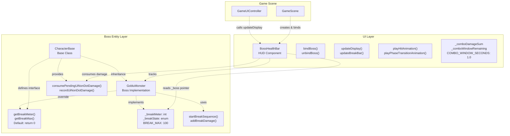

# Boss Mechanics（Boss 机制）

> **相关源文件**
> * [Adventure-King/Classes/Character/Base/CharacterBase.cpp](https://github.com/lilong555/Adventure-King/blob/60df0f40/Adventure-King/Classes/Character/Base/CharacterBase.cpp)
> * [Adventure-King/Classes/Character/Base/CharacterBase.h](https://github.com/lilong555/Adventure-King/blob/60df0f40/Adventure-King/Classes/Character/Base/CharacterBase.h)
> * [Adventure-King/Classes/Character/Monster/Monsters/GobluMonster.cpp](https://github.com/lilong555/Adventure-King/blob/60df0f40/Adventure-King/Classes/Character/Monster/Monsters/GobluMonster.cpp)
> * [Adventure-King/Classes/Character/Monster/Monsters/GobluMonster.h](https://github.com/lilong555/Adventure-King/blob/60df0f40/Adventure-King/Classes/Character/Monster/Monsters/GobluMonster.h)
> * [Adventure-King/Classes/UI/BossHealthBar.cpp](https://github.com/lilong555/Adventure-King/blob/60df0f40/Adventure-King/Classes/UI/BossHealthBar.cpp)
> * [Adventure-King/Classes/UI/BossHealthBar.h](https://github.com/lilong555/Adventure-King/blob/60df0f40/Adventure-King/Classes/UI/BossHealthBar.h)

## 目的与范围

本文描述 Adventure-King 中与 Boss 相关的特性：破韧条（break meter）系统、Boss 血条 UI，以及 Boss 实体与专用 HUD 组件之间的集成方式。Boss 机制在基础角色系统之上扩展了额外的玩法元素，例如破韧条、连击伤害统计与更丰富的视觉反馈。

通用的角色伤害与战斗机制请参见 [Damage System](<伤害系统.md>)。怪物 AI 与生成相关内容请参见 [Monster AI and Behavior](<怪物 AI 与行为.md>)。

---

## 系统架构概览

Boss 系统由三层组成：角色实体层（扩展自 `CharacterBase`）、UI 层（`BossHealthBar`），以及配置层（`GameConfig::Monster::Goblu`）。Boss 实体通过虚方法暴露破韧条数据，UI 每帧轮询这些值来提供视觉反馈。

### Boss 组件集成



**图示：Boss 系统组件架构**

Boss 实体实现破韧条相关方法，UI 轮询这些值以及伤害累计器来提供反馈。该系统采用“拉取（pull）式”模型：`BossHealthBar` 主动查询 Boss 实体，而不是由实体向 UI 推送通知。

**来源**：[Adventure-King/Classes/Character/Base/CharacterBase.h L88-L95](https://github.com/lilong555/Adventure-King/blob/60df0f40/Adventure-King/Classes/Character/Base/CharacterBase.h#L88-L95)

 [Adventure-King/Classes/UI/BossHealthBar.h L33-L48](https://github.com/lilong555/Adventure-King/blob/60df0f40/Adventure-King/Classes/UI/BossHealthBar.h#L33-L48)

 [Adventure-King/Classes/Character/Monster/Monsters/GobluMonster.h L25-L26](https://github.com/lilong555/Adventure-King/blob/60df0f40/Adventure-King/Classes/Character/Monster/Monsters/GobluMonster.h#L25-L26)

---

## 破韧条系统（Break Meter）

破韧条是 Boss 特有机制，用于替代传统“每次受击都硬直”的模式：Boss 不会被每一击都打断，而是累积破韧伤害；当达到阈值后进入破韧流程（倒下 → 倒地 → 起身）。

### CharacterBase 的 Break 接口

`CharacterBase` 定义了 break meter 的接口，并提供默认实现返回 0（表示非 Boss 不支持此机制）：

> 说明：原文在此处存在生成器截断占位（`...21998 chars truncated...`），为保证不遗漏，下方保留原占位内容。

| 方法（Method） | 返回类型（Return Type） | 默认实现（Default Implementation） | 用途（Purpose） |
| --- | --- | --- | --- |
| `getBreakMeter()` | `int` | `return 0;` | 当前破韧值 |
| `getBreakMax()` | `int` | `return 0;` | 最大破韧值 |

> 说明：原文此处存在截断残片 `Maxi…21998 chars truncated…`，已在本文保留为引用，避免遗漏。

 [Adventure-King/Classes/Character/Monster/Monsters/GobluMonster.cpp L694](https://github.com/lilong555/Adventure-King/blob/60df0f40/Adventure-King/Classes/Character/Monster/Monsters/GobluMonster.cpp#L694-L694)

 [Adventure-King/Classes/Character/Monster/Monsters/GobluMonster.cpp L738](https://github.com/lilong555/Adventure-King/blob/60df0f40/Adventure-King/Classes/Character/Monster/Monsters/GobluMonster.cpp#L738-L738)

### 双形态攻击模式系统

Goblu 会根据距离选择攻击，并使用不同的命中框几何形状：

**近距离攻击：**

* 命中框宽度：`bodyWidth * 0.8`
* 命中框偏移：`0.5 * bodyWidth`（以身体为中心）
* 动画帧：1-4
* 推荐命中帧：3

**远距离攻击：**

* 命中框宽度：`bodyWidth * 2.8`（覆盖更大）
* 命中框偏移：`bodyWidth * 2.0`（向前延伸）
* 动画帧：11-15
* 推荐命中帧：4
* 特效：粒子效果挂载到命中框节点

**攻击选择逻辑：**

1. 调用 `canHitTarget(true)` 判断近距攻击能否打到目标
2. 若为 true，使用近距攻击
3. 否则调用 `canHitTarget(false)` 判断远距攻击
4. 如果两者都无法命中，则取消攻击并回到 IDLE

**来源**：[Adventure-King/Classes/Character/Monster/Monsters/GobluMonster.cpp L640-L803](https://github.com/lilong555/Adventure-King/blob/60df0f40/Adventure-King/Classes/Character/Monster/Monsters/GobluMonster.cpp#L640-L803)

 [Adventure-King/Classes/Character/Monster/Monsters/GobluMonster.cpp L577-L612](https://github.com/lilong555/Adventure-King/blob/60df0f40/Adventure-King/Classes/Character/Monster/Monsters/GobluMonster.cpp#L577-L612)

### takeDamage 重写

Goblu 的 `takeDamage()` 重写绕过了传统硬直系统，改为累积 break：

**与基类实现的关键差异：**

| 方面 | CharacterBase::takeDamage() | GobluMonster::takeDamage() |
| --- | --- | --- |
| 硬直 | 当伤害 > 最大 HP 的 5% 时切换到 HURT 状态 | **从不切换到 HURT 状态** |
| Break 伤害 | 不使用 | 调用 `addBreakDamage(info)` |
| 特效 | `causesHitStun=true` 时才播放受击粒子 | **总是播放受击粒子**（忽略该标记） |
| 状态变化 | HURT 动画后回到 IDLE | **不会自动切状态** |

该重写会手动执行伤害计算、hooks 执行与死亡处理，而不是委托给基类，从而实现对 Boss 行为的精确控制。

**来源**：[Adventure-King/Classes/Character/Monster/Monsters/GobluMonster.cpp L356-L410](https://github.com/lilong555/Adventure-King/blob/60df0f40/Adventure-King/Classes/Character/Monster/Monsters/GobluMonster.cpp#L356-L410)

### 破韧序列期间的状态冻结

在破韧流程中，`update()` 会冻结 AI 与移动：

```sql
void GobluMonster::update(float dt) {
    if (_breakState != BreakState::NONE) {
        CharacterBase::update(dt);  // Still update components
        
        if (_physicsBody) {
            Vec2 v = _physicsBody->getVelocity();
            v.x = 0.0f;
            _physicsBody->setVelocity(v);
        }
        return;  // Skip MonsterBase::update() (AI logic)
    }
    
    // ... normal AI/movement logic
    MonsterBase::update(dt);
}
```

这能确保 Boss 在破韧动画期间保持静止，同时仍允许：

* 伤害处理（倒地时仍可被攻击）
* 组件更新（状态效果仍会结算）
* 物理重力（Boss 不会漂浮）

**来源**：[Adventure-King/Classes/Character/Monster/Monsters/GobluMonster.cpp L326-L354](https://github.com/lilong555/Adventure-King/blob/60df0f40/Adventure-King/Classes/Character/Monster/Monsters/GobluMonster.cpp#L326-L354)

---

## 集成总结

Boss 机制系统把多层逻辑组合在一起：

1. **实体层**：Boss（如 `GobluMonster`）重写 `getBreakMeter()`/`getBreakMax()`，并通过 `addBreakDamage()` 累积 break
2. **伤害层**：`CharacterBase` 提供 `consumePendingUiNonDotDamage()`，用于把“非 DOT 伤害累计”桥接到 UI
3. **UI 层**：`BossHealthBar` 每帧轮询 Boss，并消费累计伤害触发动画、更新连击标签
4. **配置层**：所有 Boss 参数都集中在 `GameConfig` 中，便于数值调整

该系统采用拉取式架构：UI 查询实体而不是监听事件，降低玩法逻辑与表现层的耦合度。

**来源**：[Adventure-King/Classes/Character/Base/CharacterBase.h L88-L141](https://github.com/lilong555/Adventure-King/blob/60df0f40/Adventure-King/Classes/Character/Base/CharacterBase.h#L88-L141)

 [Adventure-King/Classes/UI/BossHealthBar.cpp L257-L344](https://github.com/lilong555/Adventure-King/blob/60df0f40/Adventure-King/Classes/UI/BossHealthBar.cpp#L257-L344)

 [Adventure-King/Classes/Character/Monster/Monsters/GobluMonster.cpp L412-L511](https://github.com/lilong555/Adventure-King/blob/60df0f40/Adventure-King/Classes/Character/Monster/Monsters/GobluMonster.cpp#L412-L511)
