# CloudSyncService Client（CloudSyncService 客户端）

> **相关源文件（Relevant source files）**
> * [Adventure-King/Classes/Save/Cloud/CloudSyncService.cpp](https://github.com/lilong555/Adventure-King/blob/60df0f40/Adventure-King/Classes/Save/Cloud/CloudSyncService.cpp)
> * [Adventure-King/Classes/Save/Cloud/CloudSyncService.h](https://github.com/lilong555/Adventure-King/blob/60df0f40/Adventure-King/Classes/Save/Cloud/CloudSyncService.h)
> * [Adventure-King/Classes/Save/SaveManager.h](https://github.com/lilong555/Adventure-King/blob/60df0f40/Adventure-King/Classes/Save/SaveManager.h)
> * [Adventure-King/Classes/Scenes/HelloWorldScene.cpp](https://github.com/lilong555/Adventure-King/blob/60df0f40/Adventure-King/Classes/Scenes/HelloWorldScene.cpp)
> * [Adventure-King/Classes/Scenes/HelloWorldScene.h](https://github.com/lilong555/Adventure-King/blob/60df0f40/Adventure-King/Classes/Scenes/HelloWorldScene.h)
> * [Adventure-King/Classes/Scenes/Layers/CloudAuthLayer.cpp](https://github.com/lilong555/Adventure-King/blob/60df0f40/Adventure-King/Classes/Scenes/Layers/CloudAuthLayer.cpp)
> * [Adventure-King/Classes/Scenes/Layers/CloudAuthLayer.h](https://github.com/lilong555/Adventure-King/blob/60df0f40/Adventure-King/Classes/Scenes/Layers/CloudAuthLayer.h)
> * [Adventure-King/Classes/Scenes/Layers/SaveMenuLayer.cpp](https://github.com/lilong555/Adventure-King/blob/60df0f40/Adventure-King/Classes/Scenes/Layers/SaveMenuLayer.cpp)
> * [Adventure-King/Classes/Scenes/Layers/SaveMenuLayer.h](https://github.com/lilong555/Adventure-King/blob/60df0f40/Adventure-King/Classes/Scenes/Layers/SaveMenuLayer.h)
> * [README.md](https://github.com/lilong555/Adventure-King/blob/60df0f40/README.md)
> * [docs/PROJECT_SHOWCASE.md](https://github.com/lilong555/Adventure-King/blob/60df0f40/docs/PROJECT_SHOWCASE.md)
> * [tools/cloud_save_server/README.md](https://github.com/lilong555/Adventure-King/blob/60df0f40/tools/cloud_save_server/README.md)
> * [tools/cloud_save_server/src/main.cpp](https://github.com/lilong555/Adventure-King/blob/60df0f40/tools/cloud_save_server/src/main.cpp)
> * [tools/cloud_save_server/web/admin.html](https://github.com/lilong555/Adventure-King/blob/60df0f40/tools/cloud_save_server/web/admin.html)

## 目的与范围

本页记录云存档同步系统的客户端实现，重点是 `CloudSyncService` 类。该服务为游戏存档提供基于 HTTP 的云存储集成，包括账号管理、认证，以及带冲突合并策略的双向同步。

关于后端服务器实现请参见 [Cloud Save Server](云存档服务器.md)。关于呈现登录/注册对话框的 UI 层请参见 [Cloud Authentication](云端认证.md)。关于 CloudSyncService 集成的本地存档系统请参见 [SaveManager](存档管理器（SaveManager）.md)。

**来源：** [Adventure-King/Classes/Save/Cloud/CloudSyncService.h L1-L111](https://github.com/lilong555/Adventure-King/blob/60df0f40/Adventure-King/Classes/Save/Cloud/CloudSyncService.h#L1-L111)

 [Adventure-King/Classes/Save/Cloud/CloudSyncService.cpp L1-L894](https://github.com/lilong555/Adventure-King/blob/60df0f40/Adventure-King/Classes/Save/Cloud/CloudSyncService.cpp#L1-L894)

---

## 架构概览

`CloudSyncService` 是单例，用于在本地 `SaveManager` 与远端 HTTP 后端之间充当桥梁。它不会直接读写存档文件；而是把存储操作委托给 `SaveManager`，自身只关注网络通信与合并逻辑。

### 高层组件关系

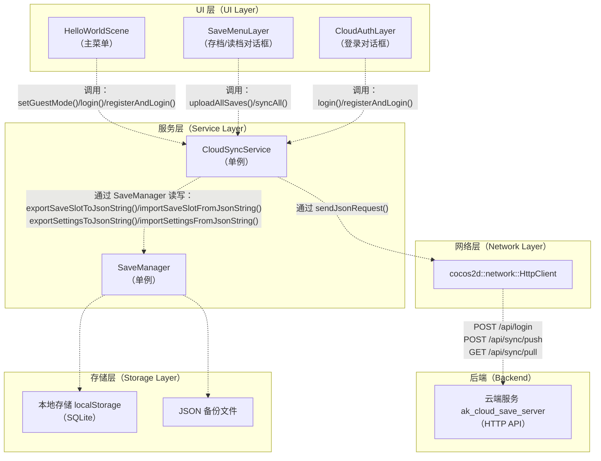

**来源：** [Adventure-King/Classes/Save/Cloud/CloudSyncService.h L1-L111](https://github.com/lilong555/Adventure-King/blob/60df0f40/Adventure-King/Classes/Save/Cloud/CloudSyncService.h#L1-L111)

 [Adventure-King/Classes/Scenes/HelloWorldScene.cpp L346-L363](https://github.com/lilong555/Adventure-King/blob/60df0f40/Adventure-King/Classes/Scenes/HelloWorldScene.cpp#L346-L363)

 [Adventure-King/Classes/Scenes/Layers/SaveMenuLayer.cpp L237-L280](https://github.com/lilong555/Adventure-King/blob/60df0f40/Adventure-King/Classes/Scenes/Layers/SaveMenuLayer.cpp#L237-L280)

---

## 配置系统

CloudSyncService 支持三种互斥的配置模式，并按优先级顺序依次检查：

1. **游客模式（Guest Mode）**（最高优先级）：完全禁用云端功能
2. **运行时账号（Runtime Account）**（会话级）：通过 UI 登录设置，仅保存在内存中
3. **环境变量（Environment Variables）**（兜底）：从进程环境读取

### 配置结构

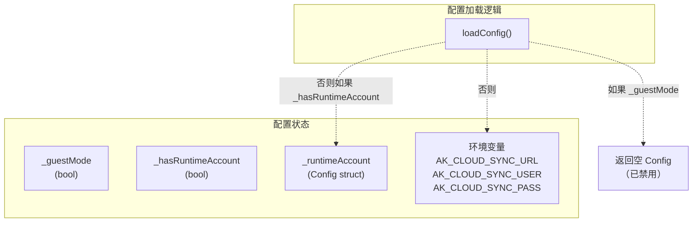

### 配置方法

| 方法（Method） | 用途（Purpose） | 效果（Effect） |
| --- | --- | --- |
| `setGuestMode(true)` | 禁用云端功能 | 清空运行时账号与 token |
| `setRuntimeAccount(url, user, pass)` | 设置会话级凭据 | 关闭游客模式并清空旧 token |
| `clearRuntimeAccount()` | 回退到环境变量配置 | 清空运行时账号与 token |
| `isConfigured(outHint)` | 检查云同步是否可用 | 若游客模式或缺少凭据则返回 false |

**来源：** [Adventure-King/Classes/Save/Cloud/CloudSyncService.cpp L189-L314](https://github.com/lilong555/Adventure-King/blob/60df0f40/Adventure-King/Classes/Save/Cloud/CloudSyncService.cpp#L189-L314)

 [Adventure-King/Classes/Save/Cloud/CloudSyncService.h L29-L48](https://github.com/lilong555/Adventure-King/blob/60df0f40/Adventure-King/Classes/Save/Cloud/CloudSyncService.h#L29-L48)

---

## 认证流程

CloudSyncService 维护了一个简单的内存 token 缓存，用于避免重复发起登录请求。token 的作用域为进程生命周期，并在服务器定义的时长后过期（默认 3600 秒）。

### 登录时序

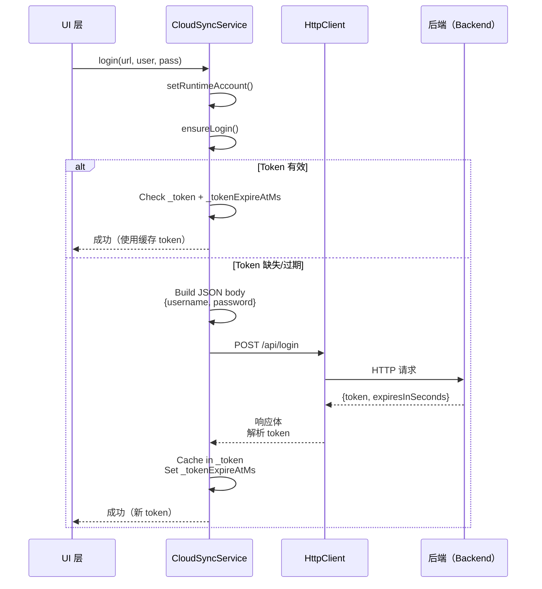

### 注册流程

注册成功后会自动触发登录：

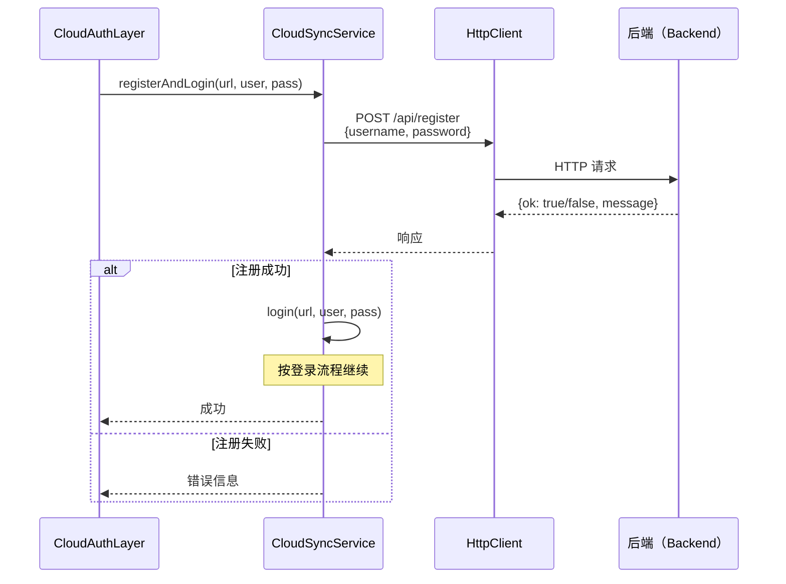

### Token 过期与重试逻辑

`sendAuthedJsonRequestWithRetry` 会优雅地处理 token 过期情况：

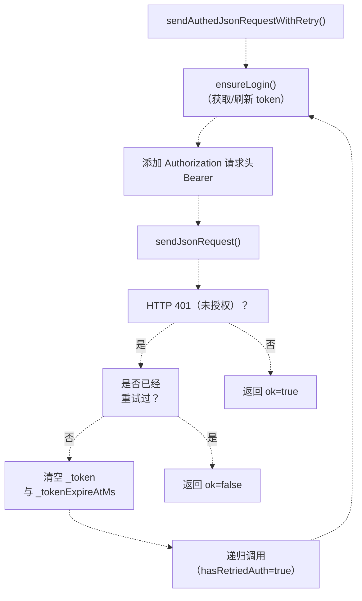

**来源：** [Adventure-King/Classes/Save/Cloud/CloudSyncService.cpp L509-L611](https://github.com/lilong555/Adventure-King/blob/60df0f40/Adventure-King/Classes/Save/Cloud/CloudSyncService.cpp#L509-L611)

 [Adventure-King/Classes/Save/Cloud/CloudSyncService.cpp L316-L423](https://github.com/lilong555/Adventure-King/blob/60df0f40/Adventure-King/Classes/Save/Cloud/CloudSyncService.cpp#L316-L423)

---

## 云端操作

CloudSyncService 提供两类核心操作：**上传（upload）**（单向 push）与 **同步（sync）**（双向合并）。

### 上传操作（uploadAllSaves）

上传完整的本地状态（全部存档槽位 + 设置）到服务器，并覆盖云端已有数据。

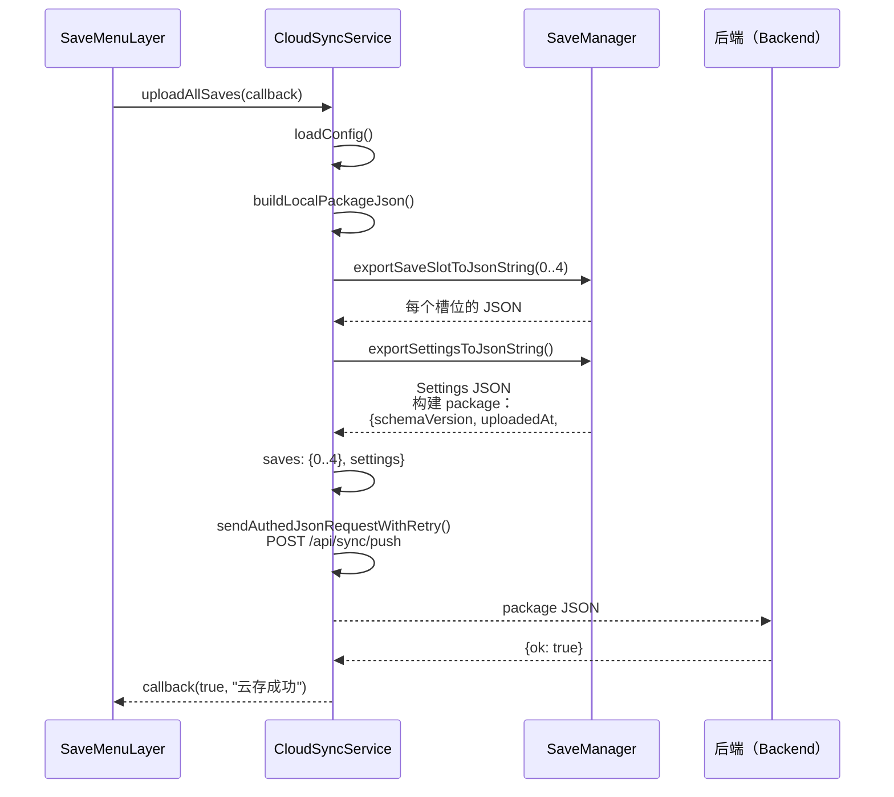

**来源：** [Adventure-King/Classes/Save/Cloud/CloudSyncService.cpp L797-L830](https://github.com/lilong555/Adventure-King/blob/60df0f40/Adventure-King/Classes/Save/Cloud/CloudSyncService.cpp#L797-L830)

 [Adventure-King/Classes/Save/Cloud/CloudSyncService.cpp L613-L686](https://github.com/lilong555/Adventure-King/blob/60df0f40/Adventure-King/Classes/Save/Cloud/CloudSyncService.cpp#L613-L686)

### 同步操作（syncAll）

同步分为三个阶段：

1. **拉取（Pull）**：获取云端 package
2. **合并（Merge）**：比较时间戳，按槽位保留最新数据
3. **推送（Push）**：把合并结果回传到云端

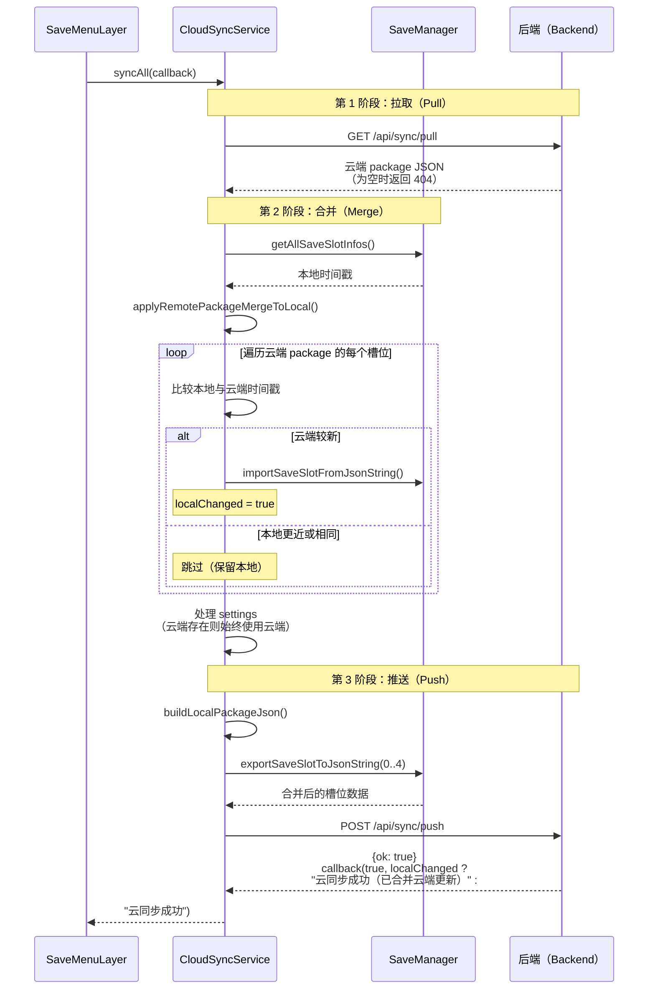

**来源：** [Adventure-King/Classes/Save/Cloud/CloudSyncService.cpp L832-L893](https://github.com/lilong555/Adventure-King/blob/60df0f40/Adventure-King/Classes/Save/Cloud/CloudSyncService.cpp#L832-L893)

 [Adventure-King/Classes/Save/Cloud/CloudSyncService.cpp L688-L795](https://github.com/lilong555/Adventure-King/blob/60df0f40/Adventure-King/Classes/Save/Cloud/CloudSyncService.cpp#L688-L795)

---

## 合并策略

合并策略在槽位粒度上基于 `saveTimestamp` 采用 **最后写入者获胜（last-write-wins）**。设置项若云端存在则始终使用云端版本（不做时间戳比较）。

### 时间戳提取与比较

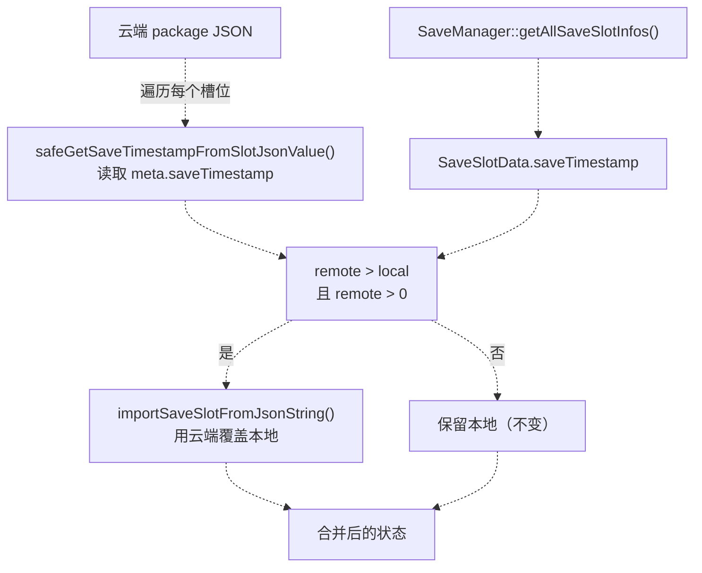

### 已处理的边界情况

| 场景（Scenario） | 行为（Behavior） |
| --- | --- |
| 云端没有 package（404） | 视为云端为空，直接把本地上传上去 |
| 云端时间戳为 0 | 跳过该槽位（无效） |
| 本地时间戳为 0 且云端 > 0 | 导入云端（本地槽位为空） |
| 两边时间戳相等 | 保留本地（不覆盖） |
| settings 没有时间戳 | 若云端存在则始终使用云端 |

**来源：** [Adventure-King/Classes/Save/Cloud/CloudSyncService.cpp L688-L795](https://github.com/lilong555/Adventure-King/blob/60df0f40/Adventure-King/Classes/Save/Cloud/CloudSyncService.cpp#L688-L795)

 [Adventure-King/Classes/Save/Cloud/CloudSyncService.cpp L133-L153](https://github.com/lilong555/Adventure-King/blob/60df0f40/Adventure-King/Classes/Save/Cloud/CloudSyncService.cpp#L133-L153)

---

## HTTP 请求层

CloudSyncService 使用 `cocos2d::network::HttpClient` 承担全部网络 I/O；请求层提供两层抽象：

### 基础请求：sendJsonRequest

```javascript
void sendJsonRequest(
    const std::string &method,        // "GET" 或 "POST"
    const std::string &url,           // 完整 URL
    const std::string &body,          // JSON body（GET 为空）
    const std::vector<std::string> &headers,
    const std::function<void(bool ok, long httpCode, 
                             const std::string &respBody, 
                             const std::string &err)> &cb
)
```

关键实现细节：

* 自动添加 `Content-Type: application/json; charset=utf-8`
* 将 HTTP 状态码 < 200 或 >= 300 视为失败（对 401/404 处理很关键）
* 响应回调在 Cocos2d 主线程执行

**来源：** [Adventure-King/Classes/Save/Cloud/CloudSyncService.cpp L425-L507](https://github.com/lilong555/Adventure-King/blob/60df0f40/Adventure-King/Classes/Save/Cloud/CloudSyncService.cpp#L425-L507)

### 认证请求：sendAuthedJsonRequestWithRetry

在 `sendJsonRequest` 之上封装自动刷新 token：

* 调用 `ensureLogin()` 获取/刷新 token
* 添加 `Authorization: Bearer <token>` 请求头
* 收到 401 响应时：清空 token 并重试一次
* 使用 `hasRetriedAuth` 标志避免无限重试循环

**来源：** [Adventure-King/Classes/Save/Cloud/CloudSyncService.cpp L581-L611](https://github.com/lilong555/Adventure-King/blob/60df0f40/Adventure-King/Classes/Save/Cloud/CloudSyncService.cpp#L581-L611)

---

## Package 格式

云端 package 是一个 JSON 对象，用于打包并传输全部本地存档数据。

### 结构

```
{
  "schemaVersion": 1,
  "uploadedAt": 1704067200000,
  "client": "Adventure-King",
  "saves": {
    "0": { "meta": {...}, "playerData": {...}, "progressData": {...} },
    "1": { "meta": {...}, "playerData": {...}, "progressData": {...} },
    "2": null,
    "3": null,
    "4": { "meta": {...}, "playerData": {...}, "progressData": {...} }
  },
  "settings": {
    "musicVolume": 0.8,
    "soundVolume": 1.0,
    ...
  }
}
```

### 构建 Package（buildLocalPackageJson）

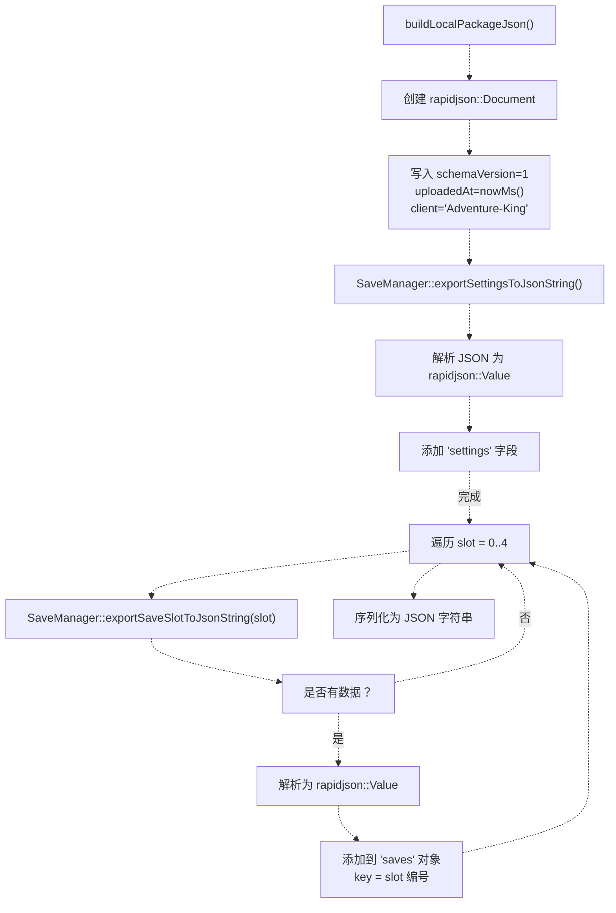

**来源：** [Adventure-King/Classes/Save/Cloud/CloudSyncService.cpp L613-L686](https://github.com/lilong555/Adventure-King/blob/60df0f40/Adventure-King/Classes/Save/Cloud/CloudSyncService.cpp#L613-L686)

### 应用远端 Package（applyRemotePackageMergeToLocal）

该方法负责按槽位逐个进行合并：

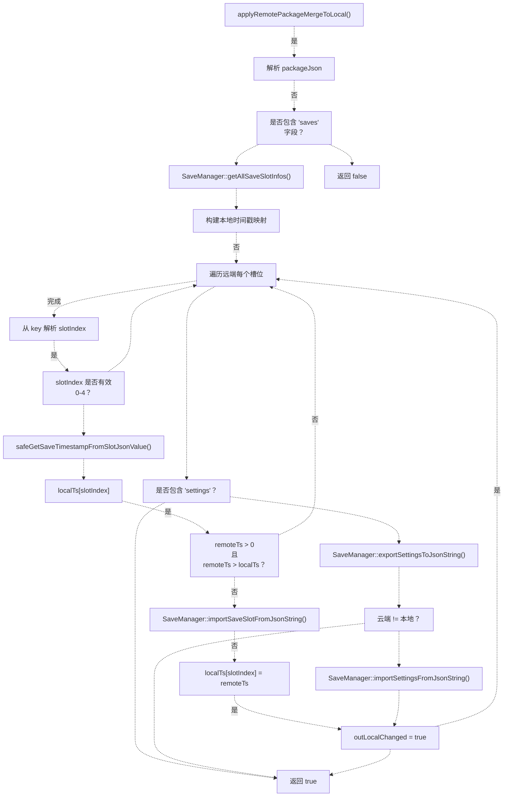

**来源：** [Adventure-King/Classes/Save/Cloud/CloudSyncService.cpp L688-L795](https://github.com/lilong555/Adventure-King/blob/60df0f40/Adventure-King/Classes/Save/Cloud/CloudSyncService.cpp#L688-L795)

---

## 集成点

CloudSyncService 主要从三个 UI 入口被调用：

### HelloWorldScene（主菜单）

提供账号管理 UI：

* **游客登录按钮（Guest Login Button）**：调用 `setGuestMode(true)`，禁用云端功能
* **登录/注册按钮（Login/Register Button）**：打开 `CloudAuthLayer`，由其调用 `login()` 或 `registerAndLogin()`
* **账号状态标签（Account Status Label）**：通过 `isGuestMode()`、`isConfigured()`、`getActiveUsername()` 显示当前模式（游客/已登录/未配置）

**来源：** [Adventure-King/Classes/Scenes/HelloWorldScene.cpp L331-L418](https://github.com/lilong555/Adventure-King/blob/60df0f40/Adventure-King/Classes/Scenes/HelloWorldScene.cpp#L331-L418)

### SaveMenuLayer（存/读档对话框）

提供云端存取档操作：

* **云存按钮（Cloud Save Button）**（按槽位）：先把槽位保存到本地，然后调用 `uploadAllSaves()`
* **云读按钮（Cloud Load Button）**（按槽位）：调用 `syncAll()`，再从本地加载该槽位
* **云同步按钮（Cloud Sync Button）**（全局）：调用 `syncAll()`，不自动加载
* **云存全部按钮（Cloud Save All Button）**：不先保存某个槽位，直接调用 `uploadAllSaves()`

所有按钮在执行前都会检查 `isConfigured()`，并通过 `_cloudStatusLabel` 展示状态。

**来源：** [Adventure-King/Classes/Scenes/Layers/SaveMenuLayer.cpp L141-L280](https://github.com/lilong555/Adventure-King/blob/60df0f40/Adventure-King/Classes/Scenes/Layers/SaveMenuLayer.cpp#L141-L280)

 [Adventure-King/Classes/Scenes/Layers/SaveMenuLayer.cpp L560-L680](https://github.com/lilong555/Adventure-King/blob/60df0f40/Adventure-King/Classes/Scenes/Layers/SaveMenuLayer.cpp#L560-L680)

### CloudAuthLayer（登录/注册对话框）

用于输入账号信息的模态对话框：

* 三个输入框：URL、用户名、密码
* **登录按钮（Login Button）**：调用 `CloudSyncService::login()`
* **注册按钮（Register Button）**：调用 `CloudSyncService::registerAndLogin()`
* 成功后：触发 `DoneCallback`，进而调用 `HelloWorldScene::updateCloudAccountLabel()`

**来源：** [Adventure-King/Classes/Scenes/Layers/CloudAuthLayer.cpp L1-L377](https://github.com/lilong555/Adventure-King/blob/60df0f40/Adventure-King/Classes/Scenes/Layers/CloudAuthLayer.cpp#L1-L377)

 [Adventure-King/Classes/Scenes/Layers/CloudAuthLayer.h L1-L54](https://github.com/lilong555/Adventure-King/blob/60df0f40/Adventure-King/Classes/Scenes/Layers/CloudAuthLayer.h#L1-L54)

---

## 错误处理

CloudSyncService 在各类操作中采用一致的错误处理模式：

### 错误流程

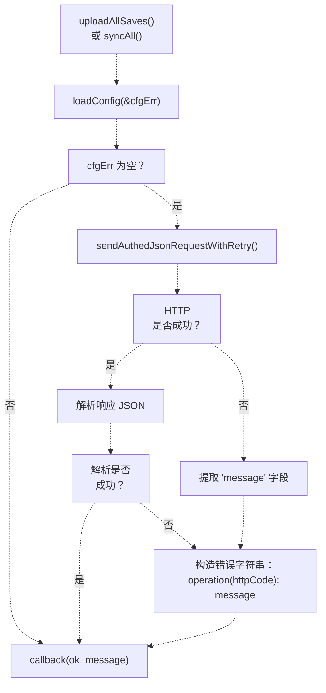

### 常见错误信息

| 错误类型（Error Type） | 格式（Format） | 示例（Example） |
| --- | --- | --- |
| 配置（Configuration） | 直接字符串 | `"未配置 AK_CLOUD_SYNC_URL"` |
| HTTP 失败（HTTP failure） | `"操作失败(httpCode): message"` | `"云存失败(401): token 已过期"` |
| JSON 解析（JSON parse） | `"JSON 解析失败"` | 当服务端响应格式错误时返回 |
| 合并失败（Merge failure） | `"导入云端槽位失败: slotIndex"` | 来自 `applyRemotePackageMergeToLocal()` 的返回 |

**来源：** [Adventure-King/Classes/Save/Cloud/CloudSyncService.cpp L797-L893](https://github.com/lilong555/Adventure-King/blob/60df0f40/Adventure-King/Classes/Save/Cloud/CloudSyncService.cpp#L797-L893)

---

## 类成员索引

### 私有成员

| 成员（Member） | 类型（Type） | 用途（Purpose） |
| --- | --- | --- |
| `_instance` | `static CloudSyncService*` | 单例实例指针 |
| `_token` | `std::string` | 缓存的 bearer token |
| `_tokenExpireAtMs` | `int64_t` | token 过期时间戳（毫秒） |
| `_guestMode` | `bool` | 为 true 时禁用云端功能 |
| `_hasRuntimeAccount` | `bool` | 为 true 时使用 `_runtimeAccount` 而非环境变量 |
| `_runtimeAccount` | `Config` | 会话级账号凭据（不持久化） |

### 配置结构体

```cpp
struct Config {
    std::string baseUrl;  // e.g. "http://127.0.0.1:5174"
    std::string user;
    std::string pass;
};
```

**来源：** [Adventure-King/Classes/Save/Cloud/CloudSyncService.h L66-L110](https://github.com/lilong555/Adventure-King/blob/60df0f40/Adventure-King/Classes/Save/Cloud/CloudSyncService.h#L66-L110)

---

## 线程安全

CloudSyncService **不是线程安全的**，只能在 Cocos2d 主线程访问。所有 HTTP 回调都会由 `cocos2d::network::HttpClient` 自动派发到主线程，从而保证对 UI 组件与 SaveManager 的访问安全。

**来源：** [Adventure-King/Classes/Save/Cloud/CloudSyncService.cpp L466-L503](https://github.com/lilong555/Adventure-King/blob/60df0f40/Adventure-King/Classes/Save/Cloud/CloudSyncService.cpp#L466-L503)
