# GameScene（核心玩法场景）

> **相关源文件**
> * [Adventure-King/Classes/Scenes/DebugScene.cpp](https://github.com/lilong555/Adventure-King/blob/60df0f40/Adventure-King/Classes/Scenes/DebugScene.cpp)
> * [Adventure-King/Classes/Scenes/DebugScene.h](https://github.com/lilong555/Adventure-King/blob/60df0f40/Adventure-King/Classes/Scenes/DebugScene.h)
> * [Adventure-King/Classes/Scenes/GameScene.cpp](https://github.com/lilong555/Adventure-King/blob/60df0f40/Adventure-King/Classes/Scenes/GameScene.cpp)
> * [Adventure-King/Classes/Scenes/GameScene.h](https://github.com/lilong555/Adventure-King/blob/60df0f40/Adventure-King/Classes/Scenes/GameScene.h)
> * [Adventure-King/proj.win32/Adventure-King.vcxproj](https://github.com/lilong555/Adventure-King/blob/60df0f40/Adventure-King/proj.win32/Adventure-King.vcxproj)
> * [Adventure-King/proj.win32/Adventure-King.vcxproj.filters](https://github.com/lilong555/Adventure-King/blob/60df0f40/Adventure-King/proj.win32/Adventure-King.vcxproj.filters)

**GameScene** 是核心玩法编排场景：在关卡运行期间负责协调所有实时玩法系统。它是中心枢纽，用于初始化并管理玩家角色、敌人生成、物理模拟、战斗结算、UI 渲染，以及存/读档集成。

关于场景切换与 LoadingScene 流水线，请参阅 [场景切换](<场景切换.md>)。关于具体关卡实现（MysteryForestScene、OriginMushroomScene），请参阅关卡系统下的子章节。关于测试与调试玩法机制，请参阅 [DebugScene](<调试场景（DebugScene）.md>)。

---

## 目的与架构

GameScene 作为玩法的 **组合根（composition root）** 与 **编排层（orchestration layer）**。它本身不承载具体玩法规则——而是负责初始化并协调各子系统：

* **LevelMap**：TMX 世界加载、碰撞体、刷怪点、竞技场触发器
* **PlayerCharacter**：玩家实体（属性、背包、技能、状态机等组件）
* **MonsterBase 实例**：动态创建并管理的敌人
* **GameInputController**：键盘输入处理（移动、跳跃、攻击、技能）
* **GameUIController**：UI 状态机（暂停菜单、背包、HUD 等）
* **CombatContactHelper**：物理接触事件处理（用于伤害计算等）
* **SaveManager 集成**：自动存档/手动存档编排、运行时状态缓存

GameScene 是一个 **抽象基类**。具体关卡场景（例如 `MysteryForestScene`、`OriginMushroomScene`）继承它，并通过 `getLevelName()` 与 `getLevelConfig()` 提供关卡级配置。

**来源：** [Adventure-King/Classes/Scenes/GameScene.h L39-L242](https://github.com/lilong555/Adventure-King/blob/60df0f40/Adventure-King/Classes/Scenes/GameScene.h#L39-L242)

 [Adventure-King/Classes/Scenes/GameScene.cpp L1-L10](https://github.com/lilong555/Adventure-King/blob/60df0f40/Adventure-King/Classes/Scenes/GameScene.cpp#L1-L10)

---

## 类结构与关键成员

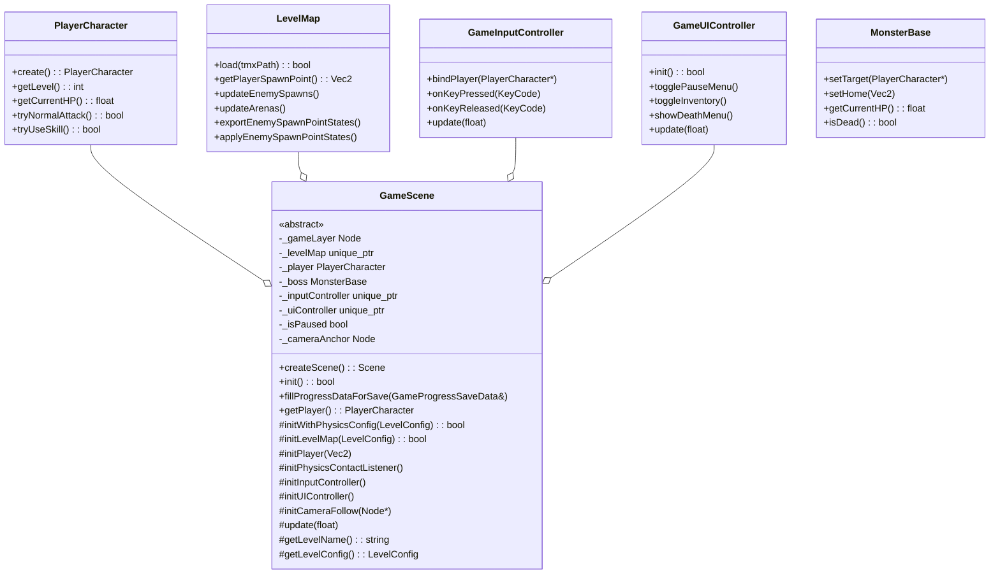

**来源：** [Adventure-King/Classes/Scenes/GameScene.h L86-L121](https://github.com/lilong555/Adventure-King/blob/60df0f40/Adventure-King/Classes/Scenes/GameScene.h#L86-L121)

 [Adventure-King/Classes/Scenes/GameScene.cpp L80-L92](https://github.com/lilong555/Adventure-King/blob/60df0f40/Adventure-King/Classes/Scenes/GameScene.cpp#L80-L92)

---

## 初始化流水线

### 概览：initWithPhysicsConfig 顺序

初始化按严格顺序执行，以确保依赖满足：

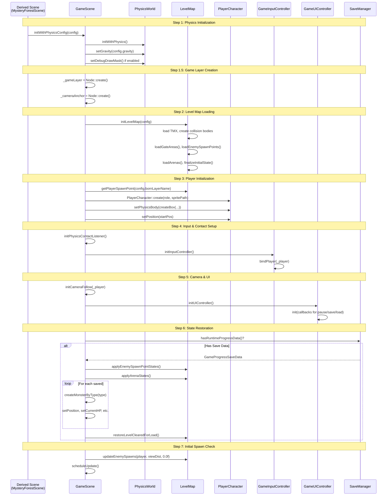

**来源：** [Adventure-King/Classes/Scenes/GameScene.cpp L130-L326](https://github.com/lilong555/Adventure-King/blob/60df0f40/Adventure-King/Classes/Scenes/GameScene.cpp#L130-L326)

---

### 步骤 1：物理世界设置

物理初始化会创建 Cocos2d-x 的物理世界，并设置重力与可选的调试绘制：

```
// Lines 131-147
if (!Scene::initWithPhysics()) {
    return false;
}
auto physicsWorld = getPhysicsWorld();
physicsWorld->setGravity(Vec2(0, config.gravity));
if (config.enablePhysicsDebug) {
    physicsWorld->setDebugDrawMask(PhysicsWorld::DEBUGDRAW_ALL);
}
```

`LevelConfig` 结构体（定义于 [GameSceneConfig.h](https://github.com/lilong555/Adventure-King/blob/60df0f40/GameSceneConfig.h)

）提供关卡级配置：

* `gravity`：垂直重力常量（通常 -980.0f）
* `enablePhysicsDebug`：是否绘制碰撞形状（开发用）

**来源：** [Adventure-King/Classes/Scenes/GameScene.cpp L131-L147](https://github.com/lilong555/Adventure-King/blob/60df0f40/Adventure-King/Classes/Scenes/GameScene.cpp#L131-L147)

---

### 步骤 1.5：游戏层创建

`_gameLayer` 作为世界内容容器（玩家、怪物、物品等）。这种分层带来：

1. **相机跟随**：`Follow` action 以 `_gameLayer` 位置为目标
2. **暂停隔离**：暂停时只暂停 `_gameLayer` 动作，UI 仍可交互
3. **竞技场相机锁定**：竞技场战斗期间可独立调整 `_gameLayer` 的位置

```sql
// Lines 150-159
_gameLayer = Node::create();
addChild(_gameLayer, 0);

if (!_cameraAnchor) {
    _cameraAnchor = cocos2d::Node::create();
    _cameraAnchor->retain();
    _gameLayer->addChild(_cameraAnchor);
}
```

**来源：** [Adventure-King/Classes/Scenes/GameScene.cpp L150-L159](https://github.com/lilong555/Adventure-King/blob/60df0f40/Adventure-King/Classes/Scenes/GameScene.cpp#L150-L159)

---

### 步骤 2：关卡地图加载

`initLevelMap` 会把工作委托给 `LevelMap`，完成：

1. 加载 TMX tilemap 并提取元数据
2. 从对象层创建物理碰撞体
3. 解析刷怪点与竞技场触发区域
4. 设置背景层（静态或视差）

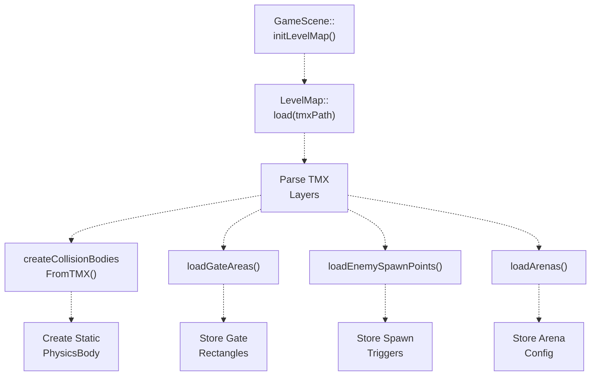

**来源：** [Adventure-King/Classes/Scenes/GameScene.cpp L391-L423](https://github.com/lilong555/Adventure-King/blob/60df0f40/Adventure-King/Classes/Scenes/GameScene.cpp#L391-L423)

---

### 步骤 3：玩家初始化

玩家创建包含：

1. **确定职业**：检查 SaveManager 的运行时数据（读档）或 session 选择（新档）
2. **创建精灵**：`PlayerCharacter::create(role, spritePath)`
3. **设置物理体**：创建盒形碰撞体并设置分类掩码
4. **状态恢复**：读档时应用 `PlayerSaveData`（HP、MP、等级、装备等）

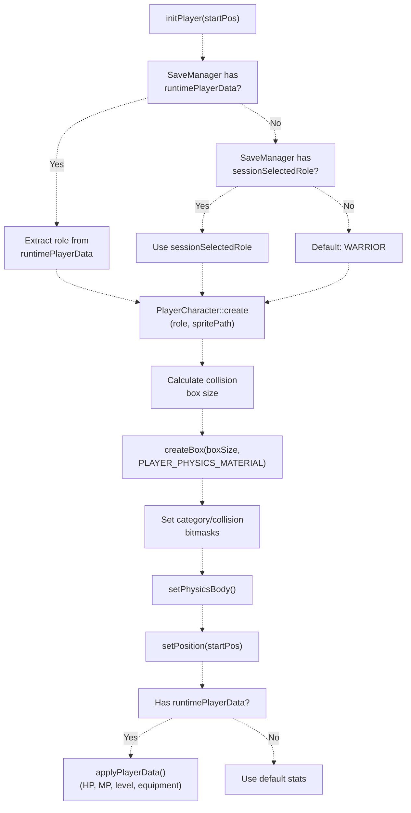

**关键物理配置：**

| 属性 | 值 | 用途 |
| --- | --- | --- |
| Category | `PLAYER` | 用于接触测试识别玩家 |
| Collision Mask | `PLATFORM \| COLLISION \| MONSTER_ATTACK \| ITEM` | 玩家可发生实体碰撞的对象 |
| Contact Test Mask | 与 collision mask 相同 | 触发 `onContactBegin` 的对象 |
| Dynamic | `true` | 受重力与力影响 |
| Rotation Enabled | `false` | 防止玩家翻倒 |

**来源：** [Adventure-King/Classes/Scenes/GameScene.cpp L425-L522](https://github.com/lilong555/Adventure-King/blob/60df0f40/Adventure-King/Classes/Scenes/GameScene.cpp#L425-L522)

---

### 步骤 4：物理接触与输入设置

**物理接触监听：**

接触监听将所有碰撞逻辑委托给 `CombatContactHelper` 的静态方法：

```sql
// Lines 524-535
auto contactListener = EventListenerPhysicsContact::create();
contactListener->onContactBegin = CC_CALLBACK_1(GameScene::onContactBegin, this);
contactListener->onContactPreSolve = CombatContactHelper::handleContactPreSolve;
contactListener->onContactSeparate = CC_CALLBACK_1(GameScene::onContactSeparate, this);
_eventDispatcher->addEventListenerWithSceneGraphPriority(contactListener, this);
```

`CombatContactHelper::handleContactBegin` 负责：

* 从物理体 tag 提取伤害/暴击信息
* 安排延迟伤害应用（下一帧）
* 用于跳跃启用/禁用的落地接触检测

**输入控制器设置：**

`GameInputController` 封装所有键盘输入逻辑：

```cpp
// Lines 537-583
_inputController = std::make_unique<GameInputController>();
_inputController->bindPlayer(_player);
_inputController->setPauseToggle(<FileRef file-url="https://github.com/lilong555/Adventure-King/blob/60df0f40/this" undefined  file-path="this">Hii</FileRef> { togglePauseMenu(); });
_inputController->setInventoryToggle(<FileRef file-url="https://github.com/lilong555/Adventure-King/blob/60df0f40/this" undefined  file-path="this">Hii</FileRef> { _uiController->toggleInventory(); });
_inputController->setIsPausedGetter(<FileRef file-url="https://github.com/lilong555/Adventure-King/blob/60df0f40/this" undefined  file-path="this">Hii</FileRef> { return _isPaused; });
_inputController->setGateQuery(<FileRef file-url="https://github.com/lilong555/Adventure-King/blob/60df0f40/this" undefined  file-path="this">Hii</FileRef> { 
    return _levelMap && _player && _levelMap->isPointAtGate(_player->getPosition()); 
});
_inputController->setGateEnter(<FileRef file-url="https://github.com/lilong555/Adventure-King/blob/60df0f40/this" undefined  file-path="this">Hii</FileRef> { returnToMapScene(); });
```

这种基于回调的设计使输入处理与场景逻辑解耦：控制器可以查询状态并触发动作，而无需直接依赖场景内部细节。

**来源：** [Adventure-King/Classes/Scenes/GameScene.cpp L524-L583](https://github.com/lilong555/Adventure-King/blob/60df0f40/Adventure-King/Classes/Scenes/GameScene.cpp#L524-L583)

---

### 步骤 5：相机跟随与 UI 初始化

**相机跟随：**

```sql
// Lines 648-664
void GameScene::initCameraFollow(cocos2d::Node* target) {
    _gameLayer->stopActionByTag(837);
    Size mapSize = _levelMap ? _levelMap->getMapSizeInPixels() 
                             : Director::getInstance()->getVisibleSize();
    Rect worldBound(0, 0, mapSize.width, mapSize.height);
    auto followAction = Follow::create(target, worldBound);
    followAction->setTag(837);
    _gameLayer->runAction(followAction);
}
```

`Follow` action 会自动更新 `_gameLayer` 的位置，让玩家保持居中，并限制在世界边界内。

**UI 控制器初始化：**

`GameUIController` 管理 UI 状态机（暂停菜单、背包、死亡菜单），并持有 UI 元素（PlayerStatusBar、SkillBar、BossHealthBar）。初始化时会传入多个回调，包括：

1. **返回地图**：`returnToMapScene()`
2. **暂停状态变化**：`setGamePaused(bool)`
3. **手动存档**：`saveToActiveSlotInternal()`
4. **读取存档**：设置 SaveManager 的运行时数据并通过 LoadingScene 切换

```javascript
// Lines 585-646 (simplified)
_uiController = std::make_unique<GameUIController>();
_uiController->init(
    this,
    _player,
    getLevelName(),
    <FileRef file-url="https://github.com/lilong555/Adventure-King/blob/60df0f40/this" undefined  file-path="this">Hii</FileRef> { returnToMapScene(); },
    <FileRef file-url="https://github.com/lilong555/Adventure-King/blob/60df0f40/this" undefined  file-path="this">Hii</FileRef> { setGamePaused(paused); },
    <FileRef file-url="https://github.com/lilong555/Adventure-King/blob/60df0f40/this" undefined  file-path="this">Hii</FileRef> -> bool {
        return this->saveToActiveSlotInternal("保存", "", outMessage);
    },
    <FileRef file-url="https://github.com/lilong555/Adventure-King/blob/60df0f40/this" undefined  file-path="this">Hii</FileRef> { return _levelMap && _player && _levelMap->isPointAtGate(...); },
    [](const SaveSlotData& saveData) { /* Load game lambda */ }
);
```

**来源：** [Adventure-King/Classes/Scenes/GameScene.cpp L585-L664](https://github.com/lilong555/Adventure-King/blob/60df0f40/Adventure-King/Classes/Scenes/GameScene.cpp#L585-L664)

---

### 步骤 6：从存档恢复状态

如果 `SaveManager::hasRuntimeProgressData()` 为 true，则场景会恢复玩家上次离开关卡时保存的世界状态：

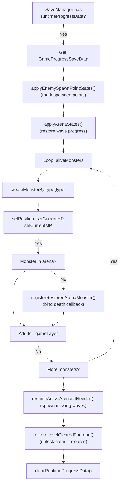

**关键恢复逻辑：**

1. **刷怪点状态**：标记哪些刷怪点已触发，避免重复刷怪
2. **竞技场状态**：恢复已完成波次、当前波次索引、闸门锁定状态
3. **怪物快照**：重建存档时仍存活的怪物，包括： * 当前 HP/MP（Boss 可能是残血） * 破防条（如 Goblu） * 竞技场归属（通过怪物 name 里的 `arenaID`）
4. **关卡通关状态**：决定出口闸门是否解锁

**关键细节：** 怪物通过 `createMonsterByType()` 创建，而不是直接 new/构造。这样才能保证正确初始化（例如按玩家等级进行 HP 缩放、Boss UI 绑定等）。

**来源：** [Adventure-King/Classes/Scenes/GameScene.cpp L196-L306](https://github.com/lilong555/Adventure-King/blob/60df0f40/Adventure-King/Classes/Scenes/GameScene.cpp#L196-L306)

---

### 步骤 7：初始刷怪检查并启用更新

初始化结束后，场景会立即做一次刷怪检查，以处理“玩家出生点就在刷怪点视野内”的情况：

```xml
// Lines 308-318
if (_levelMap && _player) {
    _levelMap->updateEnemySpawns(
        _player,
        _gameLayer,
        <FileRef file-url="https://github.com/lilong555/Adventure-King/blob/60df0f40/this" undefined  file-path="this">Hii</FileRef> { return this->createMonsterByType(type); },
        getEnemySpawnViewDistance(),
        0.0f  // dt=0 for immediate check
    );
}
```

最后，`scheduleUpdate()` 启用逐帧的 `update(float dt)` 回调。

**来源：** [Adventure-King/Classes/Scenes/GameScene.cpp L308-L326](https://github.com/lilong555/Adventure-King/blob/60df0f40/Adventure-King/Classes/Scenes/GameScene.cpp#L308-L326)

---

## 更新循环与运行时逻辑

### 更新流程概览

`update(float dt)` 以优先级顺序编排逐帧逻辑：

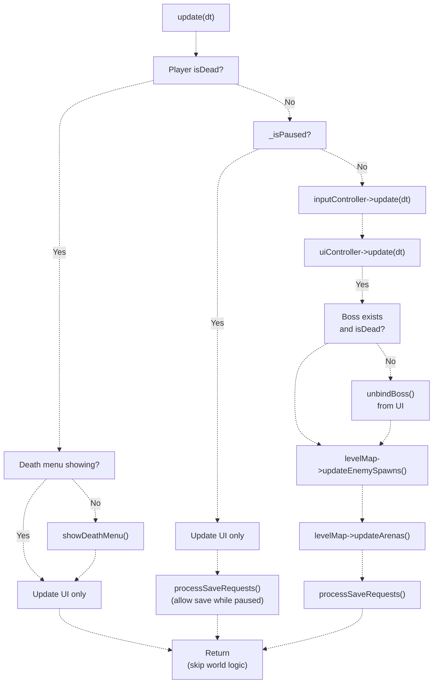

**来源：** [Adventure-King/Classes/Scenes/GameScene.cpp L864-L935](https://github.com/lilong555/Adventure-King/blob/60df0f40/Adventure-King/Classes/Scenes/GameScene.cpp#L864-L935)

---

### 死亡处理

当玩家死亡（`_player->isDead()` 为 true）时，场景：

1. 通过 `_uiController->isDeathMenuShowing()` 检查死亡菜单是否已显示
2. 未显示则调用 `_uiController->showDeathMenu()` 展示选项（重开、返回地图）
3. 跳过所有世界逻辑更新（物理、刷怪、输入）
4. 只更新 UI（用于菜单交互）

死亡菜单由 `PlayerDeathMenu`（隶属于 `GameUIController`）渲染，并提供回调：

* **重开关卡**：通过 LoadingScene 重新加载当前场景
* **返回地图**：切换到 MapScene

**来源：** [Adventure-King/Classes/Scenes/GameScene.cpp L866-L881](https://github.com/lilong555/Adventure-King/blob/60df0f40/Adventure-King/Classes/Scenes/GameScene.cpp#L866-L881)

---

### 暂停处理

当 `_isPaused` 为 true：

1. **世界冻结**：不处理输入、不刷怪、不更新物理速度
2. **UI 仍可用**：UI 控制器正常更新（暂停菜单/背包）
3. **允许存档**：`processSaveRequests()` 仍执行，可在暂停期间手动存档或等待自动存档

暂停机制由 `GamePauseHelper::setWorldPaused()` 实现，它会：

* 暂停 `_gameLayer` 上的所有动作（动画、计时器）
* `PhysicsWorld::setAutoStep(false)` 冻结物理模拟
* `PhysicsWorld::setSpeed(0)` 作为兜底

**来源：** [Adventure-King/Classes/Scenes/GameScene.cpp L883-L892](https://github.com/lilong555/Adventure-King/blob/60df0f40/Adventure-King/Classes/Scenes/GameScene.cpp#L883-L892)

 [Adventure-King/Classes/Scenes/GameScene.cpp L778-L787](https://github.com/lilong555/Adventure-King/blob/60df0f40/Adventure-King/Classes/Scenes/GameScene.cpp#L778-L787)

---

### 输入与 UI 更新

```sql
// Lines 894-902
if (_inputController) {
    _inputController->update(dt);
}
if (_uiController) {
    _uiController->update(dt);
}
```

* **InputController update**：处理按键持续按下的移动、动作锁定计时器、落地状态等
* **UIController update**：刷新 HUD（HP/MP、技能冷却），处理 toast 动画

**来源：** [Adventure-King/Classes/Scenes/GameScene.cpp L894-L902](https://github.com/lilong555/Adventure-King/blob/60df0f40/Adventure-King/Classes/Scenes/GameScene.cpp#L894-L902)

---

### Boss 清理

Boss 死亡后需要从 UI 移除血条：

```
// Lines 904-914
if (_boss && _boss->isDead()) {
    if (_uiController) {
        if (auto ui = _uiController->getGameUI()) {
            ui->unbindBoss();
        }
    }
    _boss = nullptr;
}
```

这样可以避免 `BossHealthBar` 去读取已被销毁或正在死亡流程中的怪物数据。

**来源：** [Adventure-King/Classes/Scenes/GameScene.cpp L904-L914](https://github.com/lilong555/Adventure-King/blob/60df0f40/Adventure-King/Classes/Scenes/GameScene.cpp#L904-L914)

---

### 刷怪与竞技场更新

**刷怪系统：**

```xml
// Lines 916-924
if (_levelMap && _player) {
    _levelMap->updateEnemySpawns(
        _player,
        _gameLayer,
        <FileRef file-url="https://github.com/lilong555/Adventure-King/blob/60df0f40/this" undefined  file-path="this">Hii</FileRef> { return this->createMonsterByType(type); },
        getEnemySpawnViewDistance(),
        dt
    );
}
```

`LevelMap::updateEnemySpawns()` 会遍历刷怪点并：

1. 计算玩家的水平距离
2. 若距离 < `viewDistance` 且该点未触发： * 通过工厂回调创建怪物 * 设置怪物 target 为玩家 * 设置 home（用于 AI 拉回） * 标记为已触发
3. 施加生成延迟（避免同一帧生成过多）

**竞技场系统：**

```xml
// Lines 927-931
_levelMap->updateArenas(
    _player,
    _gameLayer,
    <FileRef file-url="https://github.com/lilong555/Adventure-King/blob/60df0f40/this" undefined  file-path="this">Hii</FileRef> { return this->createMonsterByType(type); }
);
```

`LevelMap::updateArenas()` 会检查竞技场触发并：

1. 检测玩家进入竞技场矩形
2. 通过 `onArenaCameraRequest` 回调锁定相机
3. 关闭闸门
4. 生成第一波怪物
5. 监测波次是否完成（怪物全灭）
6. 继续生成后续波次或在全部清空后解锁闸门

竞技场细节参见 [竞技场战斗系统](<竞技场战斗系统.md>)。

**来源：** [Adventure-King/Classes/Scenes/GameScene.cpp L916-L932](https://github.com/lilong555/Adventure-King/blob/60df0f40/Adventure-King/Classes/Scenes/GameScene.cpp#L916-L932)

---

### 自动存档处理

```
// Lines 934
processSaveRequests(dt);
```

`processSaveRequests()` 处理两种存档：

| 存档类型 | 触发 | 优先级 |
| --- | --- | --- |
| **即时存档请求** | 升级、换装、解锁技能 | 高（优先处理） |
| **定时自动存档** | 60 秒间隔（可配置） | 低（若无即时请求再处理） |

**即时存档请求流程：**

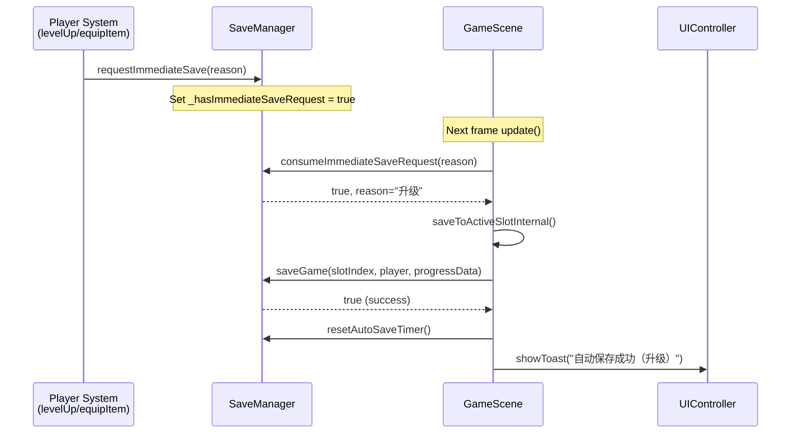

**定时自动存档流程：**

```javascript
// Lines 1001-1010
if (saveManager->tickAutoSave(dt)) {
    std::string toast;
    const bool ok = saveToActiveSlotInternal("自动保存", "", toast);
    if (_uiController && !toast.empty()) {
        _uiController->showToast(toast, ok ? Color3B(200,255,200) : Color3B(255,180,180));
    }
}
```

`SaveManager::tickAutoSave(dt)` 累积 dt，并每 60 秒返回一次 true（由 SaveManager 配置）。

**来源：** [Adventure-King/Classes/Scenes/GameScene.cpp L975-L1011](https://github.com/lilong555/Adventure-King/blob/60df0f40/Adventure-King/Classes/Scenes/GameScene.cpp#L975-L1011)

---

## 物理与战斗接触

### 接触事件流

GameScene 将所有物理接触处理委托给 `CombatContactHelper` 的静态方法：

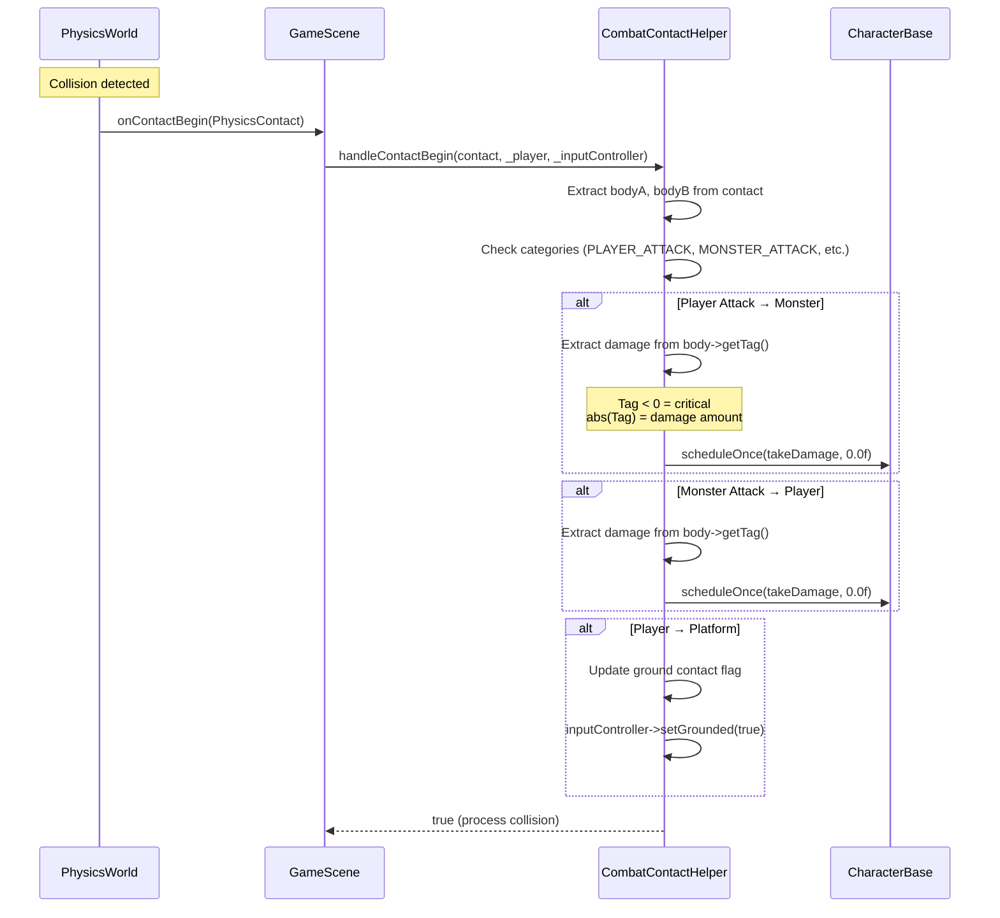

**关键设计：延迟伤害应用**

伤害通过 `scheduleOnce`（下一帧）应用，而不是在接触回调内立即执行，这能避免：

* 在 physics step 期间修改场景图（崩溃/未定义行为）
* 递归销毁物理体
* 接触监听重入问题

**来源：** [Adventure-King/Classes/Scenes/GameScene.cpp L854-L862](https://github.com/lilong555/Adventure-King/blob/60df0f40/Adventure-King/Classes/Scenes/GameScene.cpp#L854-L862)

---

### Contact PreSolve：速度/碰撞响应控制

```
contactListener->onContactPreSolve = CombatContactHelper::handleContactPreSolve;
```

`handleContactPreSolve` 在物理冲量求解 **之前** 调用，它会：

1. 识别命中框（`PLAYER_ATTACK` 或 `MONSTER_ATTACK`）
2. 通过 `contact->setEnabled(false)` 禁用冲量/实体碰撞响应
3. 允许命中框穿过目标但仍触发事件

这使得“幽灵命中框”成为可能：触发伤害事件但不会把实体推来推去。

**来源：** [Adventure-King/Classes/Scenes/GameScene.cpp L529](https://github.com/lilong555/Adventure-King/blob/60df0f40/Adventure-King/Classes/Scenes/GameScene.cpp#L529-L529)

---

### Contact Separate：落地状态

```
void GameScene::onContactSeparate(PhysicsContact& contact) {
    CombatContactHelper::handleContactSeparate(contact, _inputController.get());
}
```

当玩家离开平台，`handleContactSeparate`：

1. 递减落地接触计数
2. 计数归零后设置 `inputController->setGrounded(false)`
3. 禁用跳跃，直到再次落地

**来源：** [Adventure-King/Classes/Scenes/GameScene.cpp L859-L862](https://github.com/lilong555/Adventure-King/blob/60df0f40/Adventure-King/Classes/Scenes/GameScene.cpp#L859-L862)

---

## 支撑系统

### 怪物工厂

`createMonsterByType()` 是一个工厂方法，用于把字符串标识映射到具体怪物类：

```javascript
// Lines 795-852 (simplified)
MonsterBase* GameScene::createMonsterByType(const std::string& monsterType) {
    std::string key = toLower(monsterType);
    
    if (key == "goblin" || key == "goblinmonster") {
        auto goblin = GoblinMonster::create();
        if (goblin && _player) {
            goblin->applyHpScalingForPlayerLevel(_player->getLevel(), false);
        }
        return goblin;
    }
    
    if (key == "goblu" || key == "gobluboss") {
        auto goblu = GobluMonster::create();
        if (goblu) {
            goblu->setAutoRemoveOnDeath(false);
            if (_player) {
                goblu->applyHpScalingForPlayerLevel(_player->getLevel(), true);
            }
            if (_uiController) {
                if (auto ui = _uiController->getGameUI()) {
                    ui->bindBoss(goblu, "Goblu", 1);
                }
                _boss = goblu;
            }
        }
        return goblu;
    }
    // ... other monster types
}
```

**关键特性：**

1. **HP 缩放**：怪物 HP 随玩家等级缩放（公式在 `GameConfig::Monster::LevelScaling`）
2. **Boss 绑定**：Boss 会自动绑定到 UI 的 `BossHealthBar`
3. **死亡移除控制**：Boss 设置 `autoRemoveOnDeath=false`，以便播放死亡动画

**来源：** [Adventure-King/Classes/Scenes/GameScene.cpp L795-L852](https://github.com/lilong555/Adventure-King/blob/60df0f40/Adventure-King/Classes/Scenes/GameScene.cpp#L795-L852)

---

### 相机控制

**标准跟随：**

```sql
void GameScene::initCameraFollow(Node* target) {
    _gameLayer->stopActionByTag(837);
    Size mapSize = _levelMap->getMapSizeInPixels();
    Rect worldBound(0, 0, mapSize.width, mapSize.height);
    auto followAction = Follow::create(target, worldBound);
    followAction->setTag(837);
    _gameLayer->runAction(followAction);
}
```

**竞技场相机锁定：**

玩家进入竞技场后，相机会锁定到竞技场中心并缩放：

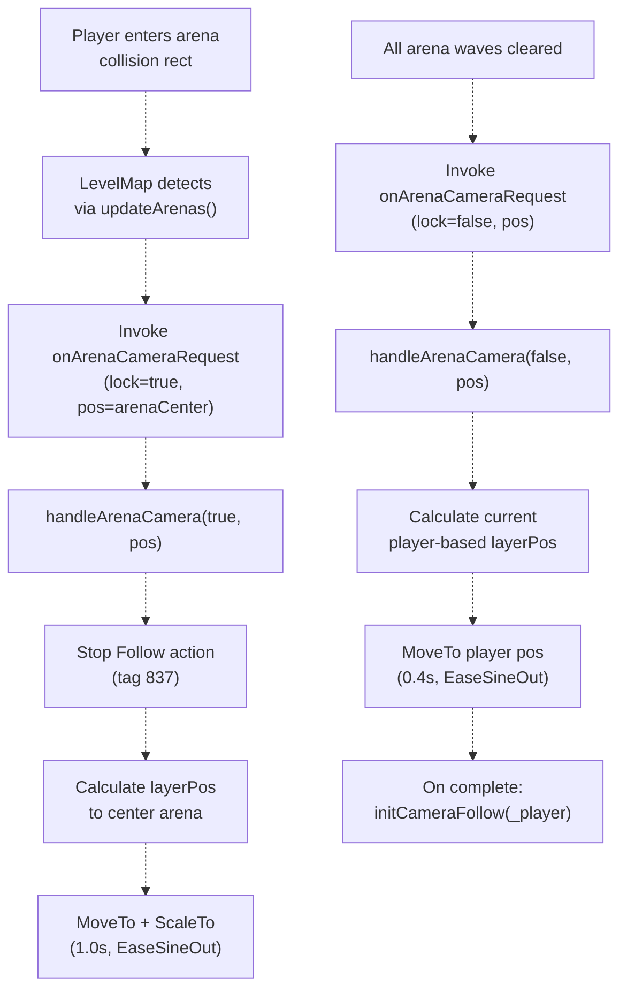

锁定/解锁机制使用 action tag（锁定动画 1001、跟随 837）来避免冲突。

**来源：** [Adventure-King/Classes/Scenes/GameScene.cpp L648-L743](https://github.com/lilong555/Adventure-King/blob/60df0f40/Adventure-King/Classes/Scenes/GameScene.cpp#L648-L743)

---

### 存/读档集成

**存档流程：**

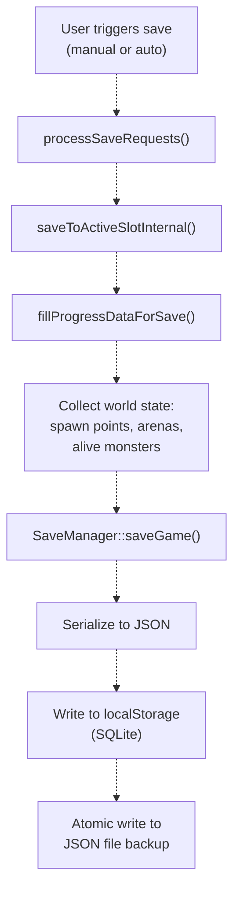

**读档流程：**

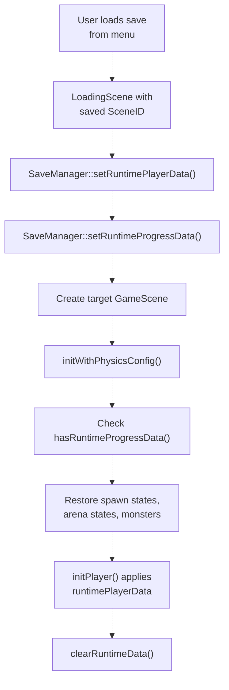

**运行时缓存用途：**

SaveManager 的 runtime cache 有两种用途：

1. **读档**：场景切换期间暂存数据，在初始化期间消费
2. **场景往返**：离开关卡时缓存玩家数据，再次进入时恢复（例如 MapScene → GameScene → MapScene → GameScene）

**来源：** [Adventure-King/Classes/Scenes/GameScene.cpp L328-L389](https://github.com/lilong555/Adventure-King/blob/60df0f40/Adventure-King/Classes/Scenes/GameScene.cpp#L328-L389)

 [Adventure-King/Classes/Scenes/GameScene.cpp L937-L973](https://github.com/lilong555/Adventure-King/blob/60df0f40/Adventure-King/Classes/Scenes/GameScene.cpp#L937-L973)

---

### 切换回地图场景

```sql
void GameScene::returnToMapScene() {
    // Cache player progress to avoid reset on re-entry
    if (_player) {
        if (auto saveManager = SaveManager::getInstance()) {
            saveManager->cacheRuntimePlayerData(_player);
        }
    }
    
    auto mapScene = MapScene::createScene();
    auto transition = TransitionFade::create(SCENE_TRANSITION_DURATION, mapScene, Color3B::BLACK);
    Director::getInstance()->replaceScene(transition);
}
```

缓存玩家数据可以保证返回关卡时保留：

* 当前等级、经验、属性点
* 已装备物品与已学习技能
* HP/MP 百分比

但 **世界状态不会保留**（刷怪点、竞技场进度、存活怪物会重置）。这是刻意设计：玩家需要在一次进入关卡的会话内完成关卡。

**来源：** [Adventure-King/Classes/Scenes/GameScene.cpp L745-L767](https://github.com/lilong555/Adventure-King/blob/60df0f40/Adventure-King/Classes/Scenes/GameScene.cpp#L745-L767)

---

## 生命周期与入口点

### onEnter() 与 onExit()

```xml
void GameScene::onEnter() {
    Scene::onEnter();
    ImeHelper::pushDisableIme();
    
    // Apply saved player position (deferred one frame)
    if (_player && SaveManager::hasRuntimePlayerPosition()) {
        Vec2 savedPos = SaveManager::getRuntimePlayerPosition();
        SaveManager::clearRuntimePlayerPosition();
        scheduleOnce(<FileRef file-url="https://github.com/lilong555/Adventure-King/blob/60df0f40/this, savedPos" undefined  file-path="this, savedPos">Hii</FileRef> {
            if (this->_player) {
                this->_player->setPosition(savedPos);
            }
        }, 0.0f, "ApplyRuntimePlayerPosition");
    }
}

void GameScene::onExit() {
    ImeHelper::popDisableIme();
    Scene::onExit();
}
```

**ImeHelper** 在玩法期间禁用输入法（IME），以防止：

* 误触系统输入弹窗（中文/日文输入）
* 输入焦点丢失
* 按键事件被系统输入法拦截

**延迟位置应用：** 玩家位置在 `onEnter` 后延迟一帧恢复，以确保派生类（例如 HomeScene）已完成其自定义初始化（例如 `_gameLayer` 缩放）。

**来源：** [Adventure-King/Classes/Scenes/GameScene.cpp L94-L128](https://github.com/lilong555/Adventure-King/blob/60df0f40/Adventure-King/Classes/Scenes/GameScene.cpp#L94-L128)

---

## 抽象方法与继承

具体关卡场景必须实现：

```javascript
virtual std::string getLevelName() const = 0;
```

示例：

| 类 | 关卡名 | TMX 路径 |
| --- | --- | --- |
| `MysteryForestScene` | "神秘之森" | "maps/mystery_forest.tmx" |
| `OriginMushroomScene` | "起源之菇" | "maps/origin_mushroom.tmx" |
| `HomeScene` | "家" | "maps/home.tmx" |

关卡名用于：

* 存档中的场景标识
* LoadingScene 的 SceneRegistry 查找
* UI 展示（暂停菜单、存档菜单等）

**可选重写：**

```javascript
virtual LevelConfig getLevelConfig() const { return LevelConfig(); }
```

用于关卡级定制重力、刷怪距离、物理调试模式等。

**来源：** [Adventure-King/Classes/Scenes/GameScene.h L241-L247](https://github.com/lilong555/Adventure-King/blob/60df0f40/Adventure-King/Classes/Scenes/GameScene.h#L241-L247)

---

## 总结

GameScene 提供了一个稳健的编排层，用于：

1. **按依赖顺序初始化全部玩法系统**（物理 → 世界 → 玩家 → 输入 → UI → 状态恢复）
2. **按优先级协调逐帧更新**（死亡 > 暂停 > 输入 > 刷怪 > 自动存档）
3. **将职责委托给专用子系统**（世界用 LevelMap、输入用 InputController、菜单用 UIController）
4. **通过 runtime cache 集成存/读档**，并以延迟方式恢复世界状态
5. **通过抽象方法支持继承**，便于关卡级定制

这种明确的关注点分离与基于回调的组合方式，让 GameScene 更像是关卡实现的 **模板**，而不是一个臃肿的“上帝对象”。

**来源：** [Adventure-King/Classes/Scenes/GameScene.cpp L1-L1028](https://github.com/lilong555/Adventure-King/blob/60df0f40/Adventure-King/Classes/Scenes/GameScene.cpp#L1-L1028)

 [Adventure-King/Classes/Scenes/GameScene.h L1-L276](https://github.com/lilong555/Adventure-King/blob/60df0f40/Adventure-King/Classes/Scenes/GameScene.h#L1-L276)
