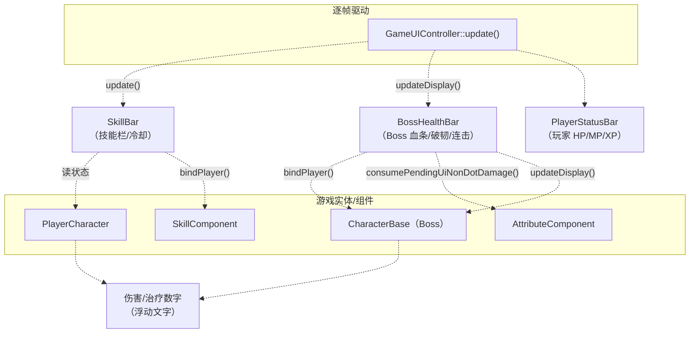
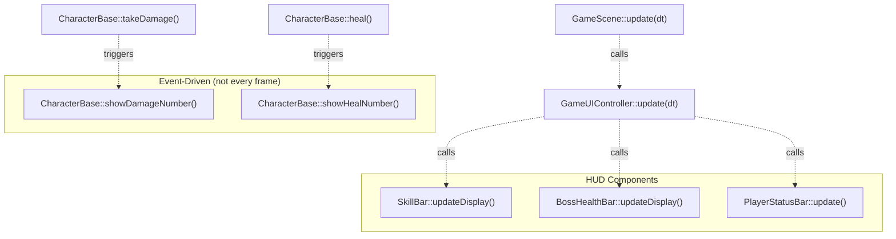

# HUD Elements（HUD 元素）

> **相关源文件**
> * [Adventure-King/Classes/Character/Base/CharacterBase.cpp](https://github.com/lilong555/Adventure-King/blob/60df0f40/Adventure-King/Classes/Character/Base/CharacterBase.cpp)
> * [Adventure-King/Classes/Character/Base/CharacterBase.h](https://github.com/lilong555/Adventure-King/blob/60df0f40/Adventure-King/Classes/Character/Base/CharacterBase.h)
> * [Adventure-King/Classes/Character/Monster/Monsters/GobluMonster.cpp](https://github.com/lilong555/Adventure-King/blob/60df0f40/Adventure-King/Classes/Character/Monster/Monsters/GobluMonster.cpp)
> * [Adventure-King/Classes/Character/Monster/Monsters/GobluMonster.h](https://github.com/lilong555/Adventure-King/blob/60df0f40/Adventure-King/Classes/Character/Monster/Monsters/GobluMonster.h)
> * [Adventure-King/Classes/Character/Player/PlayerCharacter.cpp](https://github.com/lilong555/Adventure-King/blob/60df0f40/Adventure-King/Classes/Character/Player/PlayerCharacter.cpp)
> * [Adventure-King/Classes/Character/Player/PlayerCharacter.h](https://github.com/lilong555/Adventure-King/blob/60df0f40/Adventure-King/Classes/Character/Player/PlayerCharacter.h)
> * [Adventure-King/Classes/UI/BossHealthBar.cpp](https://github.com/lilong555/Adventure-King/blob/60df0f40/Adventure-King/Classes/UI/BossHealthBar.cpp)
> * [Adventure-King/Classes/UI/BossHealthBar.h](https://github.com/lilong555/Adventure-King/blob/60df0f40/Adventure-King/Classes/UI/BossHealthBar.h)
> * [Adventure-King/Classes/UI/InventoryLayer.cpp](https://github.com/lilong555/Adventure-King/blob/60df0f40/Adventure-King/Classes/UI/InventoryLayer.cpp)
> * [Adventure-King/Classes/UI/InventoryLayer.h](https://github.com/lilong555/Adventure-King/blob/60df0f40/Adventure-King/Classes/UI/InventoryLayer.h)
> * [Adventure-King/Classes/UI/SkillBar.cpp](https://github.com/lilong555/Adventure-King/blob/60df0f40/Adventure-King/Classes/UI/SkillBar.cpp)

## 目的与范围

本页记录在玩法过程中为玩家提供实时反馈的 HUD（heads-up display）组件。这些 UI 元素会随时间更新，用于展示技能冷却、Boss 血条、伤害数字与玩家状态等关键信息。

关于模态 UI（背包、暂停菜单）请参见 [InventoryLayer](<背包层（InventoryLayer）.md>)。关于触发 UI 更新的输入处理请参见 [GameInputController](<游戏输入控制器（GameInputController）.md>)。关于整体 UI 状态管理请参见 [GameUIController](<游戏 UI 控制器（GameUIController）.md>)。

---

## HUD 组件概览

HUD 系统由多个相互独立的组件组成：它们从游戏实体读取数据，并展示实时信息：

| 组件 | 用途 | 更新频率 | 关键依赖 |
| --- | --- | --- | --- |
| `SkillBar` | 展示主动技能槽位及冷却遮罩 | 每帧 | `SkillComponent`、`PlayerCharacter` |
| `BossHealthBar` | 展示 Boss HP、破韧条、连击伤害统计 | 每帧 | `CharacterBase`、`AttributeComponent` |
| 伤害数字 | 伤害/治疗数值的浮动文字 | 伤害事件触发 | `CharacterBase::showDamageNumber()` |
| `PlayerStatusBar` | 玩家 HP/MP/XP 条（不在本页提供的文件列表中） | 每帧 | `PlayerCharacter`、`AttributeComponent` |
| 交互提示 | 传送门/NPC 提示（在架构中被引用） | 上下文敏感 | `GameUIController` |

**来源**：[Adventure-King/Classes/UI/SkillBar.h L1-L412](https://github.com/lilong555/Adventure-King/blob/60df0f40/Adventure-King/Classes/UI/SkillBar.h#L1-L412)

 [Adventure-King/Classes/UI/BossHealthBar.h L1-L131](https://github.com/lilong555/Adventure-King/blob/60df0f40/Adventure-King/Classes/UI/BossHealthBar.h#L1-L131)

 [Adventure-King/Classes/Character/Base/CharacterBase.cpp L378-L429](https://github.com/lilong555/Adventure-King/blob/60df0f40/Adventure-King/Classes/Character/Base/CharacterBase.cpp#L378-L429)

---

## 架构：HUD 组件关系



> 说明：原文在该图后半段出现生成器截断与混入的非 flowchart 内容，会导致 Mermaid 渲染报错；已清理为可渲染版本。

**字体加载优化：**

```cpp
// Source: CharacterBase.cpp:394-396
std::call_once(s_damageFontCheckOnce, []() {
    s_damageFontExists = FileUtils::getInstance()->isFileExist(DEFAULT_DAMAGE_FONT_PATH);
});
```

字体是否存在的检查使用 `std::call_once`，避免每次产生伤害时都进行重复 I/O。对于战斗中高频受击的场景，这对性能非常关键。

**来源**：[Adventure-King/Classes/Character/Base/CharacterBase.cpp L378-L458](https://github.com/lilong555/Adventure-King/blob/60df0f40/Adventure-King/Classes/Character/Base/CharacterBase.cpp#L378-L458)

---

### 视觉参数

**伤害数字：**

* **颜色：** 暴击：`Color3B(255, 50, 50)`（亮红），普通：`Color3B(255, 200, 50)`（黄）
* **字体大小：** 暴击 28，普通 22
* **描边：** 黑色，2px
* **位置：** 角色包围盒 `getMidX()`、`getMaxY()`，叠加随机偏移：水平 `[-15, +15]`，垂直 `[20, 30]`
* **动画：** 0.8s 上移 60px + 0.5s 淡出（同时进行）
* **Z 序：** 9999（总在最前）

**治疗数字：**

* **颜色：** `Color3B(50, 255, 50)`（绿）
* **字体大小：** 22
* **格式：** `"+%.0f"`
* **动画：** 0.8s 上移 40px + 0.4s 淡出

**来源**：[Adventure-King/Classes/Character/Base/CharacterBase.cpp L378-L458](https://github.com/lilong555/Adventure-King/blob/60df0f40/Adventure-King/Classes/Character/Base/CharacterBase.cpp#L378-L458)

---

## PlayerStatusBar（玩家状态条）

**注意：** `PlayerStatusBar` 未包含在本页提供的文件列表中，但在架构图中被引用。根据其他 HUD 组件的模式推测，它可能：

1. 通过 `bindPlayer()` 绑定 `PlayerCharacter`
2. 通过 `getCurrentHP()`、`getCurrentMP()` 读取 HP/MP
3. 通过 `getExperience()`、`getLevel()` 读取 XP/等级
4. 使用类似 `BossHealthBar` 的分层条渲染
5. 由 `GameUIController::update()` 每帧驱动更新

具体实现请以实际 `PlayerStatusBar` 源码文件为准。

---

## 交互提示

交互提示（传送门/NPC 提示）在高层架构中被提及，但在本页提供的文件中没有展开。根据上下文推测：

* 由 `GameUIController` 管理
* 上下文敏感显示（当 `isAtGate` 或 `isAtNpc` 为 true 时显示）
* 由 `GameUIController::update()` 读取临近标记并更新

具体实现请查看 `GameUIController` 源码文件。

---

## HUD 更新流程汇总



**要点：**

* **SkillBar** 每帧更新以跟踪冷却进度
* **BossHealthBar** 每帧更新，但仅在伤害事件时触发动画
* **伤害/治疗数字** 在事件发生时立刻生成，不依赖逐帧更新
* 所有 HUD 组件都采用从实体**拉取读取**（pull-based）的方式，而不是推送回调

**来源**：[Adventure-King/Classes/UI/SkillBar.cpp L147-L210](https://github.com/lilong555/Adventure-King/blob/60df0f40/Adventure-King/Classes/UI/SkillBar.cpp#L147-L210)

 [Adventure-King/Classes/UI/BossHealthBar.cpp L257-L344](https://github.com/lilong555/Adventure-King/blob/60df0f40/Adventure-King/Classes/UI/BossHealthBar.cpp#L257-L344)

 [Adventure-King/Classes/Character/Base/CharacterBase.cpp L148-L248](https://github.com/lilong555/Adventure-King/blob/60df0f40/Adventure-King/Classes/Character/Base/CharacterBase.cpp#L148-L248)
