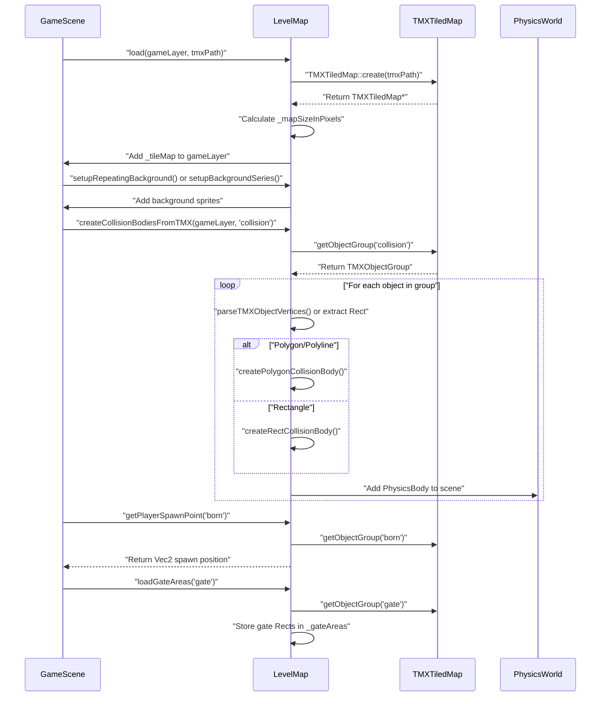
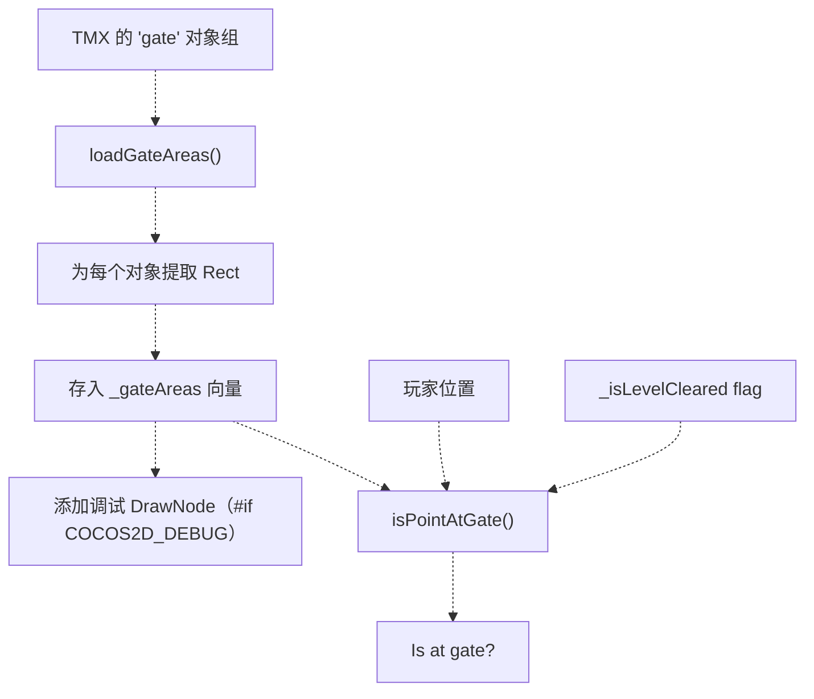
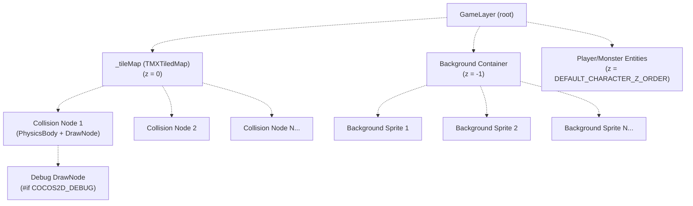

# TMX Loading and Collision（TMX 加载与碰撞）

> **相关源文件**
> * [Adventure-King/Classes/Save/JsonSerializer.cpp](https://github.com/lilong555/Adventure-King/blob/60df0f40/Adventure-King/Classes/Save/JsonSerializer.cpp)
> * [Adventure-King/Classes/Save/SaveData.h](https://github.com/lilong555/Adventure-King/blob/60df0f40/Adventure-King/Classes/Save/SaveData.h)
> * [Adventure-King/Classes/Save/SaveManager.cpp](https://github.com/lilong555/Adventure-King/blob/60df0f40/Adventure-King/Classes/Save/SaveManager.cpp)
> * [Adventure-King/Classes/Scenes/LevelMap.cpp](https://github.com/lilong555/Adventure-King/blob/60df0f40/Adventure-King/Classes/Scenes/LevelMap.cpp)
> * [Adventure-King/Classes/Scenes/LevelMap.h](https://github.com/lilong555/Adventure-King/blob/60df0f40/Adventure-King/Classes/Scenes/LevelMap.h)

## 目的与范围

本页记录 `LevelMap` 如何加载并解析 Tiled 的 TMX 地图文件来构建游戏世界，内容包括：

* 使用 Cocos2d 的 `TMXTiledMap` 加载 TMX 文件
* 从 TMX 对象组生成碰撞体
* 背景精灵的设置（循环/序列）
* 提取特殊对象（玩家出生点、传送门区域）
* 物理材质与碰撞掩码配置

敌人生成点管理请参见 [4.1.2](敌人生成系统.md)。竞技场战斗系统集成请参见 [4.1.3](竞技场战斗系统.md)。关卡完成与传送门激活逻辑请参见 [4.2](关卡进度.md)。

---

## TMX 加载概览

TMX 加载管线会把 Tiled 的 `.tmx` 文件转换为可游玩的游戏世界：包含碰撞物理、背景、以及必要的元数据提取。`LevelMap` 通过 GameScene 发起的一系列初始化调用来编排该流程。

**典型初始化顺序：**



**来源**：[Classes/Scenes/LevelMap.cpp L39-L70](https://github.com/lilong555/Adventure-King/blob/60df0f40/Classes/Scenes/LevelMap.cpp#L39-L70)

 [Classes/Scenes/LevelMap.h L41-L68](https://github.com/lilong555/Adventure-King/blob/60df0f40/Classes/Scenes/LevelMap.h#L41-L68)

---

## TMX 地图加载

### 核心加载函数

`load()` 是 TMX 初始化的入口：使用 Cocos2d 内置解析器创建 `TMXTiledMap` 实例，计算像素尺寸，并把 tile map 加到游戏层。

| 步骤 | 操作 | 关键变量 |
| --- | --- | --- |
| 1 | 创建 `TMXTiledMap` | `_tileMap = TMXTiledMap::create(tmxPath)` |
| 2 | 读取瓦片尺寸 | `mapTileSize = _tileMap->getMapSize()``tileSize = _tileMap->getTileSize()` |
| 3 | 计算像素大小 | `_mapSizeInPixels = Size(mapTileSize.width * tileSize.width, mapTileSize.height * tileSize.height)` |
| 4 | 定位并加入场景 | `_tileMap->setPosition(origin)`, `gameLayer->addChild(_tileMap, 0)` |

**实现细节：**

[Classes/Scenes/LevelMap.cpp L39-L70](https://github.com/lilong555/Adventure-King/blob/60df0f40/Classes/Scenes/LevelMap.cpp#L39-L70)

```javascript
bool LevelMap::load(Node *gameLayer, const std::string &tmxPath)
{
    // Creates TMXTiledMap from file
    _tileMap = TMXTiledMap::create(tmxPath);
    
    // Calculates total map size in pixels
    Size mapTileSize = _tileMap->getMapSize();
    Size tileSize = _tileMap->getTileSize();
    _mapSizeInPixels = Size(mapTileSize.width * tileSize.width,
                            mapTileSize.height * tileSize.height);
    
    // 锚点设为左下角，并加入到场景
    _tileMap->setAnchorPoint(Vec2(0, 0));
    _tileMap->setPosition(Vec2(origin.x, origin.y));
    gameLayer->addChild(_tileMap, 0);
}
```

**来源**：[Classes/Scenes/LevelMap.cpp L39-L70](https://github.com/lilong555/Adventure-King/blob/60df0f40/Classes/Scenes/LevelMap.cpp#L39-L70)

 [Classes/Scenes/LevelMap.h L42-L46]（原文此处截断：`http…12572 chars truncated…`）把传送门对象提取为矩形并存入 `_gateAreas`；在调试模式下，会渲染蓝色覆盖矩形用于可视化。

**数据流：**



**实现：**

[Classes/Scenes/LevelMap.cpp L362-L389](https://github.com/lilong555/Adventure-King/blob/60df0f40/Classes/Scenes/LevelMap.cpp#L362-L389)

```javascript
void LevelMap::loadGateAreas(const std::string& gateGroupName)
{
    _gateAreas.clear();
    auto gateGroup = _tileMap->getObjectGroup(gateGroupName);
    if (!gateGroup) return;
    
    for (const auto& obj : gateGroup->getObjects()) {
        auto dict = obj.asValueMap();
        Rect gateRect(dict["x"].asFloat(), dict["y"].asFloat(),
                      dict["width"].asFloat(), dict["height"].asFloat());
        _gateAreas.push_back(gateRect);
        
#if COCOS2D_DEBUG > 0
        auto debugDraw = DrawNode::create();
        debugDraw->drawSolidRect(
            Vec2(x, y), Vec2(x + w, y + h),
            Color4F(0, 0, 1, 0.3f)  // Blue semi-transparent
        );
        _tileMap->addChild(debugDraw, 10);
#endif
    }
}
```

**传送门交互检测：**

[Classes/Scenes/LevelMap.cpp L391-L404](https://github.com/lilong555/Adventure-King/blob/60df0f40/Classes/Scenes/LevelMap.cpp#L391-L404)

```javascript
bool LevelMap::isPointAtGate(const Vec2 &worldPos) const
{
    if (!_isLevelCleared) return false;  // Gates locked until level clear
    
    for (const auto &gateRect : _gateAreas) {
        if (gateRect.containsPoint(worldPos)) return true;
    }
    return false;
}
```

**来源**：[Classes/Scenes/LevelMap.cpp L362-L404](https://github.com/lilong555/Adventure-King/blob/60df0f40/Classes/Scenes/LevelMap.cpp#L362-L404)

---

## 对象层级与存储

TMX 解析系统会创建一套挂载到 tile map 上的节点层级，以确保坐标变换与相机跟随的正确性。

**场景树结构：**



**关键设计决定**：所有碰撞节点都作为 `_tileMap` 的子节点（而不是 `gameLayer`）添加（见行 [Classes/Scenes/LevelMap.cpp L299](https://github.com/lilong555/Adventure-King/blob/60df0f40/Classes/Scenes/LevelMap.cpp#L299-L299)

 [Classes/Scenes/LevelMap.cpp L333](https://github.com/lilong555/Adventure-King/blob/60df0f40/Classes/Scenes/LevelMap.cpp#L333-L333)

），这样当相机滚动导致 tile map 位移时，碰撞体也会随之移动。

**来源**：[Classes/Scenes/LevelMap.cpp L63](https://github.com/lilong555/Adventure-King/blob/60df0f40/Classes/Scenes/LevelMap.cpp#L63-L63)

 [Classes/Scenes/LevelMap.cpp L119](https://github.com/lilong555/Adventure-King/blob/60df0f40/Classes/Scenes/LevelMap.cpp#L119-L119)

 [Classes/Scenes/LevelMap.cpp L161](https://github.com/lilong555/Adventure-King/blob/60df0f40/Classes/Scenes/LevelMap.cpp#L161-L161)

 [Classes/Scenes/LevelMap.cpp L299](https://github.com/lilong555/Adventure-King/blob/60df0f40/Classes/Scenes/LevelMap.cpp#L299-L299)

 [Classes/Scenes/LevelMap.cpp L333](https://github.com/lilong555/Adventure-King/blob/60df0f40/Classes/Scenes/LevelMap.cpp#L333-L333)

---

## 与存档系统的集成

TMX 加载与碰撞系统本身不会直接参与存/读档操作，但它提供了一些会被存档系统捕获的世界状态元数据：

* 玩家出生点位置（当存档位置无效时用于兜底）
* 传送门区域（`isPointAtGate()` 会检查以启用场景切换）
* 关卡已清理标记（`_isLevelCleared`）会影响传送门是否可交互

关于世界状态（生成点、竞技场、存活怪物）如何保存与恢复，请参见 [6.1.3](存取档流程.md)。

**来源**：[Classes/Scenes/LevelMap.cpp L338-L360](https://github.com/lilong555/Adventure-King/blob/60df0f40/Classes/Scenes/LevelMap.cpp#L338-L360)

 [Classes/Scenes/LevelMap.cpp L391-L404](https://github.com/lilong555/Adventure-King/blob/60df0f40/Classes/Scenes/LevelMap.cpp#L391-L404)
