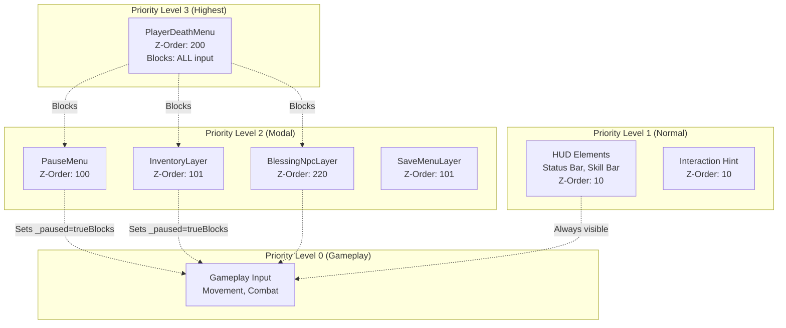
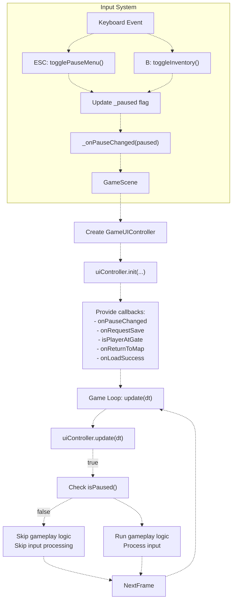

# UI 状态管理

> **相关源文件**
> * [Adventure-King/Classes/Configs/GameSceneConfig.h](https://github.com/lilong555/Adventure-King/blob/60df0f40/Adventure-King/Classes/Configs/GameSceneConfig.h)
> * [Adventure-King/Classes/GameUI.cpp](https://github.com/lilong555/Adventure-King/blob/60df0f40/Adventure-King/Classes/GameUI.cpp)
> * [Adventure-King/Classes/GameUI.h](https://github.com/lilong555/Adventure-King/blob/60df0f40/Adventure-King/Classes/GameUI.h)
> * [Adventure-King/Classes/Scenes/GameInputController.cpp](https://github.com/lilong555/Adventure-King/blob/60df0f40/Adventure-King/Classes/Scenes/GameInputController.cpp)
> * [Adventure-King/Classes/Scenes/GameInputController.h](https://github.com/lilong555/Adventure-King/blob/60df0f40/Adventure-King/Classes/Scenes/GameInputController.h)
> * [Adventure-King/Classes/Scenes/GameUIController.cpp](https://github.com/lilong555/Adventure-King/blob/60df0f40/Adventure-King/Classes/Scenes/GameUIController.cpp)
> * [Adventure-King/Classes/Scenes/GameUIController.h](https://github.com/lilong555/Adventure-King/blob/60df0f40/Adventure-King/Classes/Scenes/GameUIController.h)
> * [Adventure-King/Resources/Scene/UI/bag.png](https://github.com/lilong555/Adventure-King/blob/60df0f40/Adventure-King/Resources/Scene/UI/bag.png)
> * [Adventure-King/Resources/Scene/UI/bagSelected.png](https://github.com/lilong555/Adventure-King/blob/60df0f40/Adventure-King/Resources/Scene/UI/bagSelected.png)

## 目的与范围

本文描述由 `GameUIController` 实现的 UI 状态管理系统：它负责编排 `GameScene` 中所有模态 UI 的显示与交互逻辑。系统会在暂停菜单、背包界面、死亡菜单与交互提示之间进行状态切换，并通过优先级层级避免冲突 UI 状态。

关于具体 UI 组件（HUD、菜单、背包）请参见 [Player UI Components](<玩家 UI 组件.md>)。关于触发状态变化的输入处理请参见 [GameInputController](<游戏输入控制器（GameInputController）.md>)。

**来源**：[Adventure-King/Classes/Scenes/GameUIController.h L1-L84](https://github.com/lilong555/Adventure-King/blob/60df0f40/Adventure-King/Classes/Scenes/GameUIController.h#L1-L84)

 [Adventure-King/Classes/Scenes/GameUIController.cpp L1-L538](https://github.com/lilong555/Adventure-King/blob/60df0f40/Adventure-King/Classes/Scenes/GameUIController.cpp#L1-L538)

---

## 状态标记与变量

`GameUIController` 维护多个状态标记，用于追踪当前 UI 模式与上下文：

| 状态变量 | 类型 | 用途 |
| --- | --- | --- |
| `_paused` | `bool` | 表示当前玩法是否暂停（阻断游戏输入） |
| `_inventoryReturnToPauseOnClose` | `bool` | 上下文标记：若为 `true`，关闭背包返回暂停菜单；若为 `false`，返回玩法 |
| `_deathMenuShowing` | 通过 `GameUI` 查询 | 死亡菜单是否正在显示（最高优先级，阻断全部输入） |
| `_hintSource` | `InteractionHintSource` enum | 当前显示的交互提示来源（NONE、GATE、BLESSING_NPC） |

`InteractionHintSource` 枚举定义了提示优先级：

```cpp
enum class InteractionHintSource
{
    NONE = 0,
    GATE = 1,
    BLESSING_NPC = 2,  // Higher priority than GATE
};
```

**来源**：[Adventure-King/Classes/Scenes/GameUIController.h L63-L73](https://github.com/lilong555/Adventure-King/blob/60df0f40/Adventure-King/Classes/Scenes/GameUIController.h#L63-L73)

 [Adventure-King/Classes/Scenes/GameUIController.cpp L67-L73](https://github.com/lilong555/Adventure-King/blob/60df0f40/Adventure-King/Classes/Scenes/GameUIController.cpp#L67-L73)

---

## UI 优先级层级

UI 系统实现了严格的优先级层级：高优先级 UI 会阻断低优先级 UI 的交互：



### 输入阻断与关键回调

UI 的“阻断/恢复”主要通过三类回调完成：

1. **暂停菜单 Resume：恢复游戏**

```cpp
pauseMenu->setResumeCallback([this]()
                             {
                                 _paused = false;
                                 if (_onPauseChanged)
                                 {
                                     _onPauseChanged(false);
                                 }
                             });
```

2. **背包 Close：根据上下文返回**

```cpp
inventory->setCloseCallback([this]()
                            {
                                if (!_gameUI)
                                    return;
                                applyPostInventoryCloseState();
                            });
```

3. **死亡菜单 Restart：复活并重载当前关卡**

死亡菜单的“重开”会在转场前把玩家恢复到满血满蓝，避免把 `HP=0` 缓存进运行时数据导致“重进即死亡”，随后通过 `LoadingScene` 重载当前关卡场景。

**来源**：[Adventure-King/Classes/Scenes/GameUIController.cpp L32-L316](https://github.com/lilong555/Adventure-King/blob/60df0f40/Adventure-King/Classes/Scenes/GameUIController.cpp#L32-L316)

 [Adventure-King/Classes/Scenes/GameUIController.h L19-L29](https://github.com/lilong555/Adventure-King/blob/60df0f40/Adventure-King/Classes/Scenes/GameUIController.h#L19-L29)

---

## 与 GameScene 的集成

`GameUIController` 由 `GameScene` 创建并管理：



**关键集成点：**

1. **暂停状态传播**：当 `GameUIController` 变更 `_paused` 时会调用 `_onPauseChanged(bool)`，`GameScene` 用它来决定是否跳过更新
2. **存档操作**：暂停菜单的保存按钮触发 `_onRequestSave()`，由 `GameScene` 实现并调用 `SaveManager`
3. **场景切换**：死亡菜单与返回地图按钮触发 `_onReturnToMap()` 执行切场景
4. **临近查询**：`GameUIController` 每帧轮询 `_isPlayerAtGate()` 与 `_isPlayerAtNpc()` 以决定提示显示

**来源**：[Adventure-King/Classes/Scenes/GameUIController.cpp L32-L84](https://github.com/lilong555/Adventure-King/blob/60df0f40/Adventure-King/Classes/Scenes/GameUIController.cpp#L32-L84)

 [Adventure-King/Classes/Scenes/GameUIController.h L18-L83](https://github.com/lilong555/Adventure-King/blob/60df0f40/Adventure-King/Classes/Scenes/GameUIController.h#L18-L83)

---

## 总结

`GameUIController` 实现了一套分层状态机 UI 管理系统，主要特性包括：

| 特性 | 实现 |
| --- | --- |
| **优先级系统** | 死亡菜单 > 模态 UI（暂停/背包/祝福）> HUD |
| **上下文感知行为** | 背包关闭后的返回行为取决于进入背包的入口 |
| **状态标记** | `_paused`、`_inventoryReturnToPauseOnClose`、死亡菜单查询 |
| **输入阻断** | 高优先级 UI 阻断低优先级输入 |
| **提示管理** | 基于优先级的交互提示（NPC > Gate） |
| **节流** | UI 更新限制为 20 Hz 以提升性能 |
| **Toast 系统** | 带自动清理的短暂通知 |

该系统保证任一时刻只有一个模态 UI 处于活跃状态，同时维持正确的暂停状态，并提供直观的菜单导航体验。

**来源**：[Adventure-King/Classes/Scenes/GameUIController.cpp L1-L538](https://github.com/lilong555/Adventure-King/blob/60df0f40/Adventure-King/Classes/Scenes/GameUIController.cpp#L1-L538)

 [Adventure-King/Classes/Scenes/GameUIController.h L1-L84](https://github.com/lilong555/Adventure-King/blob/60df0f40/Adventure-King/Classes/Scenes/GameUIController.h#L1-L84)

 [Adventure-King/Classes/GameUI.cpp L1-L449](https://github.com/lilong555/Adventure-King/blob/60df0f40/Adventure-King/Classes/GameUI.cpp#L1-L449)
