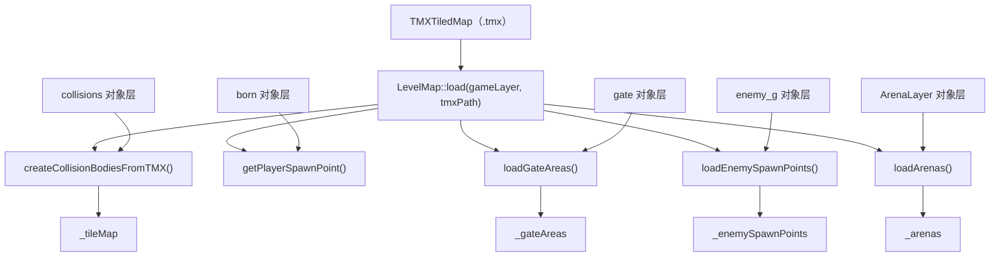

# 世界与关卡系统

> **相关源文件**
> * [Adventure-King/Classes/Save/JsonSerializer.cpp](https://github.com/lilong555/Adventure-King/blob/60df0f40/Adventure-King/Classes/Save/JsonSerializer.cpp)
> * [Adventure-King/Classes/Save/SaveData.h](https://github.com/lilong555/Adventure-King/blob/60df0f40/Adventure-King/Classes/Save/SaveData.h)
> * [Adventure-King/Classes/Save/SaveManager.cpp](https://github.com/lilong555/Adventure-King/blob/60df0f40/Adventure-King/Classes/Save/SaveManager.cpp)
> * [Adventure-King/Classes/Scenes/LevelMap.cpp](https://github.com/lilong555/Adventure-King/blob/60df0f40/Adventure-King/Classes/Scenes/LevelMap.cpp)
> * [Adventure-King/Classes/Scenes/LevelMap.h](https://github.com/lilong555/Adventure-King/blob/60df0f40/Adventure-King/Classes/Scenes/LevelMap.h)

## 目的与范围

世界与关卡系统负责管理游戏的空间环境，包括地形加载、碰撞体设置、敌人生成、竞技场遭遇战、以及关卡完成状态的跟踪。本页从整体角度介绍关卡在运行时如何被组织、加载与管理。

关于 `LevelMap` 类与 TMX 解析逻辑的详细说明，请参见 [LevelMap](<关卡地图（LevelMap）.md>)。关于关卡推进、传送门激活与胜利条件，请参见 [Level Progression](<关卡进度.md>)。关于玩家出生点与角色放置，请参见 [GameScene Initialization](<初始化流程.md>)。关于怪物生命周期与 AI，请参见 [MonsterBase](<怪物基类（MonsterBase）.md>)。关于世界状态的存/读档，请参见 [Save and Load Flow](<存取档流程.md>)。

---

## 系统架构概览

世界系统围绕 `LevelMap` 类构建，它封装了单个关卡的全部空间数据与状态。关卡在 Tiled 地图编辑器中以 TMX 文件制作，通过对象层定义碰撞、出生点、传送门与竞技场触发器等。

### 核心组件

| 组件 | 文件 | 职责 |
| --- | --- | --- |
| **LevelMap** | `Classes/Scenes/LevelMap.h` | TMX 加载、碰撞体设置、生成点管理、竞技场协调 |
| **GameScene** | `Classes/Scenes/GameScene.cpp` | 关卡实例化、怪物工厂、相机跟随 |
| **SaveManager** | `Classes/Save/SaveManager.h` | 持久化/恢复世界状态（生成点、竞技场、怪物快照） |
| **GameProgressSaveData** | `Classes/Save/SaveData.h:108-168` | 敌人生成状态、竞技场状态、存活怪物等数据结构 |
| **ArenaConfig** | `Classes/Configs/ArenaConfig.h` | 竞技场遭遇战的波次配置 |

来源：[Adventure-King/Classes/Scenes/LevelMap.h L1-L196](https://github.com/lilong555/Adventure-King/blob/60df0f40/Adventure-King/Classes/Scenes/LevelMap.h#L1-L196)

 [Adventure-King/Classes/Save/SaveData.h L108-L168](https://github.com/lilong555/Adventure-King/blob/60df0f40/Adventure-King/Classes/Save/SaveData.h#L108-L168)

---

## LevelMap 生命周期

```

```

**图示：LevelMap 状态生命周期**

`LevelMap` 会经历多个阶段：TMX 加载与解析、（可选）从存档数据恢复、以及运行时的生成点/竞技场管理。关卡完成状态会通过 `_currentActiveMonsters` 与 `checkAllClear()` 进行跟踪与汇总，其中包含生成点、竞技场以及存活怪物的聚合判断。

来源：[Adventure-King/Classes/Scenes/LevelMap.cpp L39-L82](https://github.com/lilong555/Adventure-King/blob/60df0f40/Adventure-King/Classes/Scenes/LevelMap.cpp#L39-L82)

 [Adventure-King/Classes/Scenes/LevelMap.cpp L449-L507](https://github.com/lilong555/Adventure-King/blob/60df0f40/Adventure-King/Classes/Scenes/LevelMap.cpp#L449-L507)

---

## TMX 对象层映射

Tiled 导出的 TMX 文件包含多个对象层；`LevelMap` 会读取特定命名的层来构建玩法世界：



**图示：加载世界状态的顺序**

加载分为三个阶段：

1. **恢复生成点/竞技场状态**：应用存档中的 `hasSpawned` 标记与竞技场波次索引
2. **恢复存活怪物**：从快照重建怪物实例，并通过 `arenaID` 区分竞技场怪物
3. **继续未完成的竞技场**：如果竞技场处于进行中、但没有保存怪物（例如玩家刚清完一波就存档），则生成当前波次

**关键恢复逻辑**：

竞技场怪物通过 `registerRestoredArenaMonster()` 注册，该函数会：

* 设置 `monster->setName("arena:" + arenaID)` 标记竞技场归属
* 绑定死亡回调：`activeMonstersCount` 递减，归零则推进下一波
* `activeMonstersCount` 自增，用于追踪当前存活的竞技场怪物数量

```javascript
// LevelMap.cpp:866-923
void LevelMap::registerRestoredArenaMonster(const std::string &arenaID, MonsterBase *monster, ...) {
    auto *arena = _arenas[arenaID];
    arena->isActivated = true;
    arena->isFinished = false;

    // Close gates
    for (auto gate : arena->gates) {
        gate->setVisible(true);
        gate->getPhysicsBody()->setEnabled(true);
    }

    monster->setName("arena:" + arenaID);

    // Restore death callback
    monster->setOnDeathCallback([this, arena, player, gameLayer, createMonsterByType](CharacterBase *)
                                {
                                    arena->activeMonstersCount--;
                                    if (arena->activeMonstersCount <= 0)
                                    {
                                        arena->currentWaveIndex++;

                                        auto delay = DelayTime::create(1.5f);
                                        auto next = CallFunc::create([this, arena, player, gameLayer, createMonsterByType]()
                                                                     {
                                                                         this->spawnNextWave(arena, player, gameLayer, createMonsterByType);
                                                                     });
                                        gameLayer->runAction(Sequence::create(delay, next, nullptr));
                                    }
                                });

    arena->activeMonstersCount++;
}
```

如果某个竞技场已激活但没有保存的怪物（例如玩家在清完一波后立刻存档），`resumeActiveArenasIfNeeded()` 会生成当前波次：

```
// LevelMap.cpp:925-955
void LevelMap::resumeActiveArenasIfNeeded(...) {
    for (auto &pair : _arenas) {
        auto *arena = pair.second;
        if (!arena->isActivated || arena->isFinished) continue;
        if (arena->activeMonstersCount > 0) continue;  // Monsters already restored

        // No saved monsters for this wave - spawn current wave
        spawnNextWave(arena, player, gameLayer, createMonsterByType);
    }
}
```

来源：[Adventure-King/Classes/Scenes/LevelMap.cpp L709-L747](https://github.com/lilong555/Adventure-King/blob/60df0f40/Adventure-King/Classes/Scenes/LevelMap.cpp#L709-L747)

 [Adventure-King/Classes/Scenes/LevelMap.cpp L773-L864](https://github.com/lilong555/Adventure-King/blob/60df0f40/Adventure-King/Classes/Scenes/LevelMap.cpp#L773-L864)

 [Adventure-King/Classes/Scenes/LevelMap.cpp L866-L923](https://github.com/lilong555/Adventure-King/blob/60df0f40/Adventure-King/Classes/Scenes/LevelMap.cpp#L866-L923)

 [Adventure-King/Classes/Scenes/LevelMap.cpp L925-L955](https://github.com/lilong555/Adventure-King/blob/60df0f40/Adventure-King/Classes/Scenes/LevelMap.cpp#L925-L955)

---

## 配置常量

与关卡相关的常量定义在 `GameConfig::LevelMap` 中：

| 常量 | 值 | 用途 |
| --- | --- | --- |
| `DEFAULT_SPAWN_POINT` | `Vec2(100, 200)` | 当 TMX 缺少 `PlayerSpawn` 时的兜底出生点 |
| `DEFAULT_GATE_INTERACT_DISTANCE` | `100.0f` | 触发“可交互提示”的最小距离 |
| `SPAWN_SPACING_X` | `100.0f` | 多怪生成时的水平间距 |
| `SPAWN_INTERVAL_SECONDS` | `0.3f` | 连续生成怪物之间的延迟 |
| `ENEMY_SPAWN_CHECK_INTERVAL_SECONDS` | `0.2f` | 临近检测的节流间隔 |
| `DEFAULT_CHARACTER_Z_ORDER` | `10` | 角色精灵的 Z 序 |
| `COLLISION_PHYSICS_MATERIAL` | `PhysicsMaterial(1.0f, 0.0f, 0.5f)` | 碰撞体的密度/弹性/摩擦 |

来源：[Adventure-King/Classes/Scenes/LevelMap.cpp L26-L36](https://github.com/lilong555/Adventure-King/blob/60df0f40/Adventure-King/Classes/Scenes/LevelMap.cpp#L26-L36)

---

## 总结

世界与关卡系统实现了一套由 TMX 驱动的关卡架构，核心特点包括：

* **TMX 解析**：从 Tiled 对象层加载碰撞、生成点、竞技场与传送门
* **临近生成**：拉取式的临近检测（带节流）、排序与分批生成
* **竞技场遭遇战**：多波战斗，包含关门锁定、镜头控制与完成度追踪
* **关卡完成判定**：对生成点、竞技场与存活怪物进行聚合检查
* **状态持久化**：导出/导入生成标记、竞技场进度与怪物快照以支持存/读档

该系统把关卡设计（TMX 文件）与运行时玩法（物理、AI、战斗）连接起来，并保持完整的存/读档支持。
