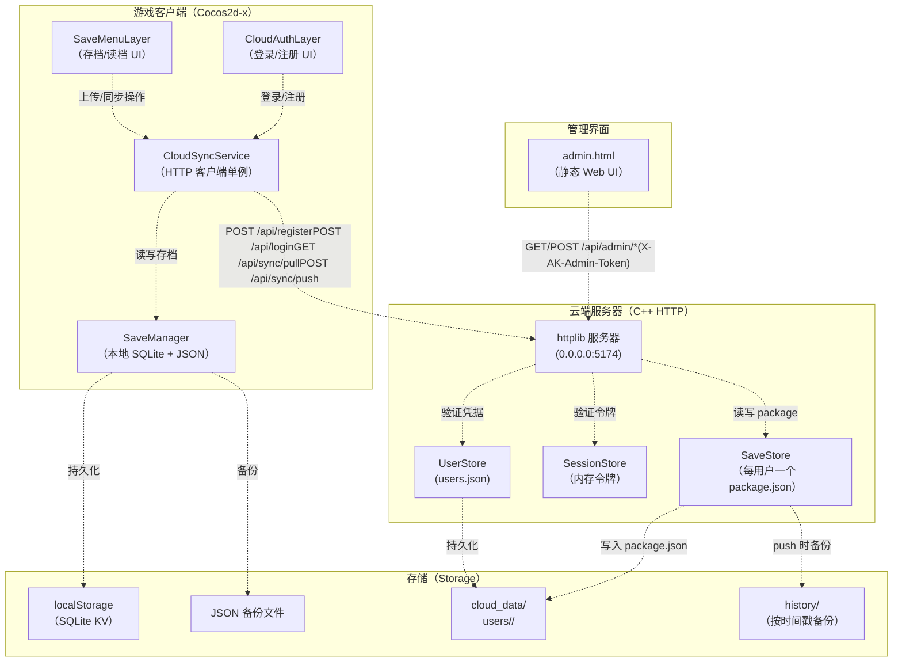
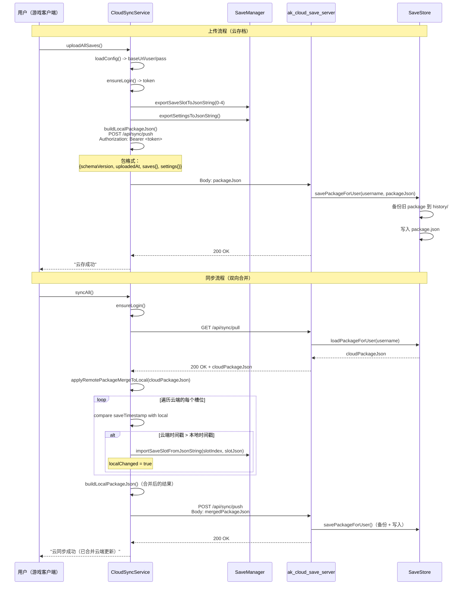
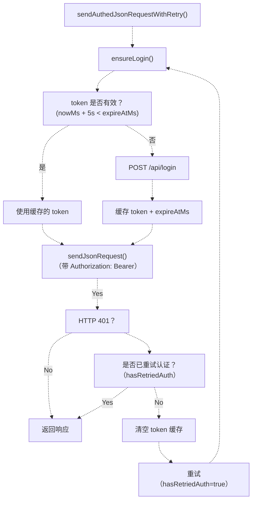
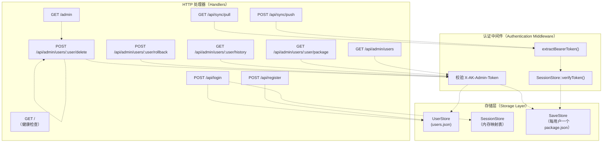
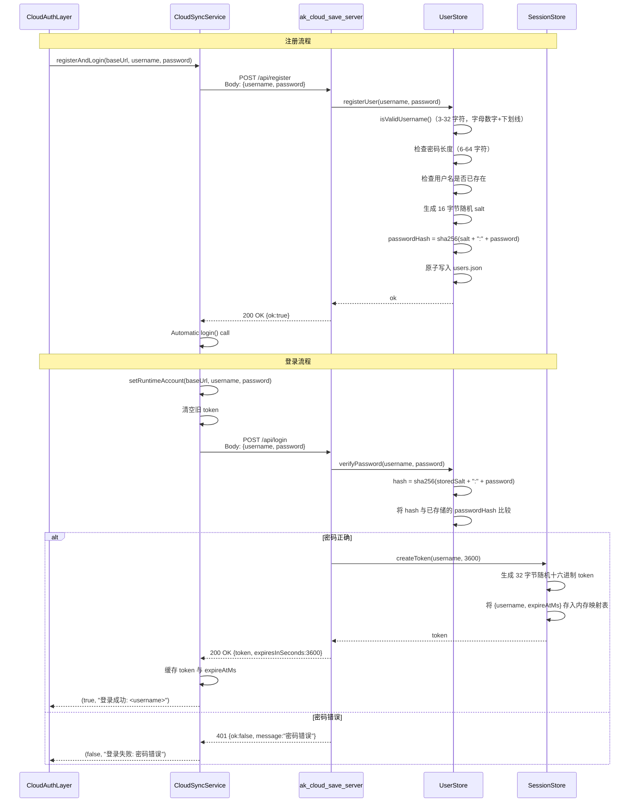
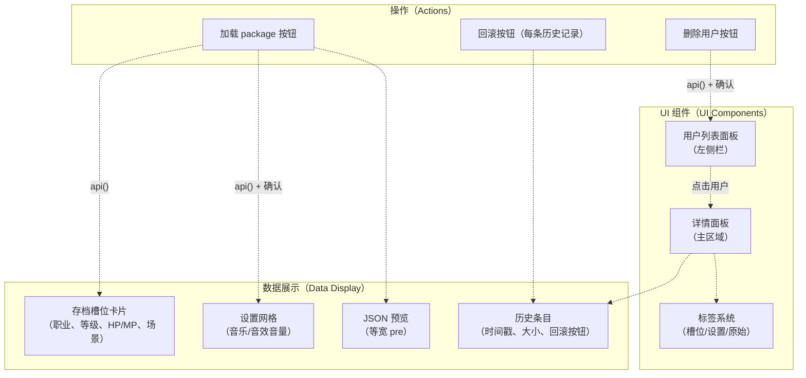
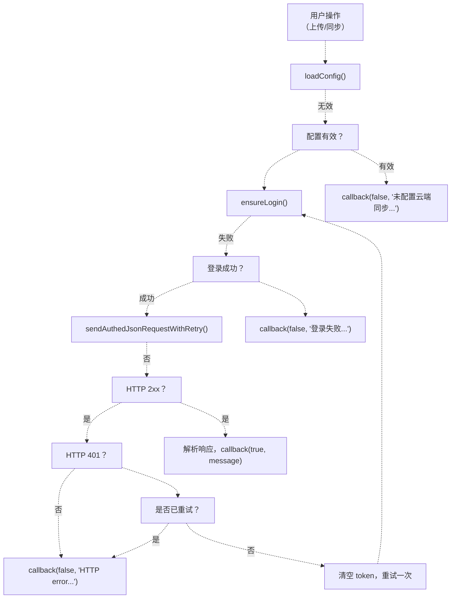

# Cloud Save Service（云存档服务）

> **相关源文件（Relevant source files）**
> * [Adventure-King/Classes/Save/Cloud/CloudSyncService.cpp](https://github.com/lilong555/Adventure-King/blob/60df0f40/Adventure-King/Classes/Save/Cloud/CloudSyncService.cpp)
> * [Adventure-King/Classes/Save/Cloud/CloudSyncService.h](https://github.com/lilong555/Adventure-King/blob/60df0f40/Adventure-King/Classes/Save/Cloud/CloudSyncService.h)
> * [Adventure-King/Classes/Scenes/Layers/CloudAuthLayer.cpp](https://github.com/lilong555/Adventure-King/blob/60df0f40/Adventure-King/Classes/Scenes/Layers/CloudAuthLayer.cpp)
> * [Adventure-King/Classes/Scenes/Layers/CloudAuthLayer.h](https://github.com/lilong555/Adventure-King/blob/60df0f40/Adventure-King/Classes/Scenes/Layers/CloudAuthLayer.h)
> * [README.md](https://github.com/lilong555/Adventure-King/blob/60df0f40/README.md)
> * [docs/PROJECT_SHOWCASE.md](https://github.com/lilong555/Adventure-King/blob/60df0f40/docs/PROJECT_SHOWCASE.md)
> * [tools/cloud_save_server/README.md](https://github.com/lilong555/Adventure-King/blob/60df0f40/tools/cloud_save_server/README.md)
> * [tools/cloud_save_server/src/main.cpp](https://github.com/lilong555/Adventure-King/blob/60df0f40/tools/cloud_save_server/src/main.cpp)
> * [tools/cloud_save_server/web/admin.html](https://github.com/lilong555/Adventure-King/blob/60df0f40/tools/cloud_save_server/web/admin.html)

## 目的与范围

云存档服务通过基于 HTTP 的客户端-服务器架构，为 Adventure-King 提供云端存档同步能力。本文覆盖系统整体设计、数据流、认证机制，以及客户端与服务器组件的集成方式。

本地存档操作与数据结构请参见 [SaveManager](<存档管理器（SaveManager）.md>)。客户端实现细节请参见 [CloudSyncService Client](<CloudSyncService 客户端.md>)。服务器实现细节请参见 [Cloud Save Server](<云存档服务器.md>)。认证 UI 请参见 [Cloud Authentication](<云端认证.md>)。

该系统以开发/演示为目标，配置通过环境变量提供，以避免在仓库中硬编码服务器地址。

---

## 系统架构

云存档系统由三个主要组件组成：游戏客户端（`CloudSyncService`）、HTTP 后端服务器（`ak_cloud_save_server`）以及基于 Web 的管理界面。客户端与 `SaveManager` 集成，将本地存档打包为 JSON，并通过“基于时间戳的合并策略”与云端进行同步。

### 高层组件图



**来源：**

* [Adventure-King/Classes/Save/Cloud/CloudSyncService.h L1-L111](https://github.com/lilong555/Adventure-King/blob/60df0f40/Adventure-King/Classes/Save/Cloud/CloudSyncService.h#L1-L111)
* [Adventure-King/Classes/Save/Cloud/CloudSyncService.cpp L1-L894](https://github.com/lilong555/Adventure-King/blob/60df0f40/Adventure-King/Classes/Save/Cloud/CloudSyncService.cpp#L1-L894)
* [tools/cloud_save_server/src/main.cpp L1-L1652](https://github.com/lilong555/Adventure-King/blob/60df0f40/tools/cloud_save_server/src/main.cpp#L1-L1652)
* [tools/cloud_save_server/README.md L1-L183](https://github.com/lilong555/Adventure-King/blob/60df0f40/tools/cloud_save_server/README.md#L1-L183)

---

## 数据流与同步

云存档系统采用“以包（package）为单位”的同步模型：把所有本地存档与设置项打包为一个 JSON package。同步操作会在槽位级别根据时间戳进行比较并执行双向合并。

### 同步流程时序



**来源：**

* [Adventure-King/Classes/Save/Cloud/CloudSyncService.cpp L797-L830](https://github.com/lilong555/Adventure-King/blob/60df0f40/Adventure-King/Classes/Save/Cloud/CloudSyncService.cpp#L797-L830)（uploadAllSaves：上传全部存档）
* [Adventure-King/Classes/Save/Cloud/CloudSyncService.cpp L832-L893](https://github.com/lilong555/Adventure-King/blob/60df0f40/Adventure-King/Classes/Save/Cloud/CloudSyncService.cpp#L832-L893)（syncAll：全量同步）
* [Adventure-King/Classes/Save/Cloud/CloudSyncService.cpp L688-L795](https://github.com/lilong555/Adventure-King/blob/60df0f40/Adventure-King/Classes/Save/Cloud/CloudSyncService.cpp#L688-L795)（applyRemotePackageMergeToLocal：将云端包合并到本地）
* [Adventure-King/Classes/Save/Cloud/CloudSyncService.cpp L613-L686](https://github.com/lilong555/Adventure-King/blob/60df0f40/Adventure-King/Classes/Save/Cloud/CloudSyncService.cpp#L613-L686)（buildLocalPackageJson：构建本地 package JSON）

---

## Package JSON 格式

云存档 package 是一个结构化的 JSON 文档，封装了所有存档槽位与设置项。该格式在客户端与服务器之间保持一致。

### Package 结构

| 字段（Field） | 类型（Type） | 说明（Description） |
| --- | --- | --- |
| `schemaVersion` | `int` | 固定为 1，用于后续兼容扩展 |
| `uploadedAt` | `int64` | 上传时间戳（毫秒） |
| `client` | `string` | 固定为 `"Adventure-King"` |
| `settings` | `object` | `SettingsSaveData` JSON（音乐/音效音量及开关） |
| `saves` | `object` | 槽位索引（字符串）到 `SaveSlotData` JSON 的映射 |

### 槽位存档结构

`saves` 中的每个槽位包含：

| 字段（Field） | 类型（Type） | 说明（Description） |
| --- | --- | --- |
| `meta.slotIndex` | `int` | 槽位编号（0-4） |
| `meta.saveTimestamp` | `int64` | 保存时间（毫秒，用于合并比较） |
| `player` | `object` | `PlayerSaveData`（等级、HP、装备、技能等） |
| `progress` | `object` | `GameProgressSaveData`（场景、游玩时间、生成点状态等） |

基于时间戳的合并策略在槽位级别工作：如果 `cloudSlot.meta.saveTimestamp > localSlot.meta.saveTimestamp`，则用云端版本覆盖本地版本。

**来源：**

* [Adventure-King/Classes/Save/Cloud/CloudSyncService.cpp L613-L686](https://github.com/lilong555/Adventure-King/blob/60df0f40/Adventure-King/Classes/Save/Cloud/CloudSyncService.cpp#L613-L686)（buildLocalPackageJson：构建本地 package JSON）
* [Adventure-King/Classes/Save/Cloud/CloudSyncService.cpp L133-L153](https://github.com/lilong555/Adventure-King/blob/60df0f40/Adventure-King/Classes/Save/Cloud/CloudSyncService.cpp#L133-L153)（safeGetSaveTimestampFromSlotJsonValue：安全读取槽位时间戳）
* [Adventure-King/Classes/Save/Cloud/CloudSyncService.cpp L742-L764](https://github.com/lilong555/Adventure-King/blob/60df0f40/Adventure-King/Classes/Save/Cloud/CloudSyncService.cpp#L742-L764)（时间戳比较逻辑）

---

## 客户端组件

### CloudSyncService 单例

`CloudSyncService` 是云端操作的客户端主接口，负责管理认证状态、Token 缓存，以及向服务器发送 HTTP 请求。

#### 关键职责（Key Responsibilities）

| 方法（Method） | 用途（Purpose） |
| --- | --- |
| `login()` | 使用 baseUrl/username/password 进行认证，并缓存 token |
| `registerAndLogin()` | 注册新用户，然后自动登录 |
| `uploadAllSaves()` | 打包所有本地存档并上传到云端（覆盖） |
| `syncAll()` | 拉取云端存档，与本地按时间戳合并后，再推送合并结果 |
| `setGuestMode(bool)` | 启用游客模式时禁用云功能 |
| `setRuntimeAccount()` | 设置会话级凭据（来自 UI 登录） |
| `isConfigured()` | 检查 URL/username/password 是否已设置（环境变量或运行时账号） |

#### 配置来源（Configuration Sources）

服务会从两个来源加载配置（优先级：运行时账号 > 环境变量/默认值）：

1. **运行时账号（Runtime Account）**（由 `CloudAuthLayer` 登录设置）：* `_hasRuntimeAccount` 标志 * `_runtimeAccount` 结构体（baseUrl, user, pass）
2. **环境变量（Environment Variables）**：* `AK_CLOUD_SYNC_URL`（例如 `http://127.0.0.1:5174`）* `AK_CLOUD_SYNC_USER` * `AK_CLOUD_SYNC_PASS`

该设计避免在仓库中硬编码服务器地址，同时允许 UI 登录在会话期间覆盖环境变量配置。

**来源：**

* [Adventure-King/Classes/Save/Cloud/CloudSyncService.h L21-L110](https://github.com/lilong555/Adventure-King/blob/60df0f40/Adventure-King/Classes/Save/Cloud/CloudSyncService.h#L21-L110)
* [Adventure-King/Classes/Save/Cloud/CloudSyncService.cpp L189-L232](https://github.com/lilong555/Adventure-King/blob/60df0f40/Adventure-King/Classes/Save/Cloud/CloudSyncService.cpp#L189-L232)（loadConfig：加载配置）
* [Adventure-King/Classes/Save/Cloud/CloudSyncService.cpp L251-L264](https://github.com/lilong555/Adventure-King/blob/60df0f40/Adventure-King/Classes/Save/Cloud/CloudSyncService.cpp#L251-L264)（setRuntimeAccount：设置运行时账号）

#### Token 管理与自动重试（Auto-Retry）

服务实现了 token 缓存，并在遇到 `401` 时自动重新认证：



这样即使服务器重启（内存会话丢失），客户端也会在不打扰用户的情况下自动重新认证一次。

**来源：**

* [Adventure-King/Classes/Save/Cloud/CloudSyncService.cpp L509-L579](https://github.com/lilong555/Adventure-King/blob/60df0f40/Adventure-King/Classes/Save/Cloud/CloudSyncService.cpp#L509-L579)（ensureLogin：确保已登录）
* [Adventure-King/Classes/Save/Cloud/CloudSyncService.cpp L581-L611](https://github.com/lilong555/Adventure-King/blob/60df0f40/Adventure-King/Classes/Save/Cloud/CloudSyncService.cpp#L581-L611)（sendAuthedJsonRequestWithRetry：发送带认证的请求并可重试）
* [Adventure-King/Classes/Save/Cloud/CloudSyncService.cpp L599-L606](https://github.com/lilong555/Adventure-King/blob/60df0f40/Adventure-King/Classes/Save/Cloud/CloudSyncService.cpp#L599-L606)（401 重试逻辑）

### 与 SaveManager 的集成

`CloudSyncService` 不会直接操作存档文件，而是把所有本地存档 I/O 交给 `SaveManager` 处理：

| CloudSyncService 方法 | 调用的 SaveManager 方法 | 用途 |
| --- | --- | --- |
| `buildLocalPackageJson()` | `exportSaveSlotToJsonString(slot)` | 读取每个槽位为 JSON 字符串 |
| `buildLocalPackageJson()` | `exportSettingsToJsonString()` | 读取设置为 JSON 字符串 |
| `applyRemotePackageMergeToLocal()` | `importSaveSlotFromJsonString(slot, json)` | 将云端槽位写入本地 |
| `applyRemotePackageMergeToLocal()` | `importSettingsFromJsonString(json)` | 将云端设置写入本地 |
| `applyRemotePackageMergeToLocal()` | `getAllSaveSlotInfos()` | 获取本地时间戳用于比较 |

这种职责分离保证云同步逻辑独立于底层存储实现（SQLite vs JSON）。

**来源：**

* [Adventure-King/Classes/Save/Cloud/CloudSyncService.cpp L613-L686](https://github.com/lilong555/Adventure-King/blob/60df0f40/Adventure-King/Classes/Save/Cloud/CloudSyncService.cpp#L613-L686)（buildLocalPackageJson：构建本地 package JSON）
* [Adventure-King/Classes/Save/Cloud/CloudSyncService.cpp L688-L795](https://github.com/lilong555/Adventure-King/blob/60df0f40/Adventure-King/Classes/Save/Cloud/CloudSyncService.cpp#L688-L795)（applyRemotePackageMergeToLocal：将云端包合并到本地）

---

## 服务端组件

服务器是一个使用 `httplib` 的单线程 C++ HTTP 应用，提供用户管理、会话管理与存档存储服务。

### 核心服务器架构



**来源：**

* [tools/cloud_save_server/src/main.cpp L949-L1652](https://github.com/lilong555/Adventure-King/blob/60df0f40/tools/cloud_save_server/src/main.cpp#L949-L1652)（main 函数与路由注册）

### UserStore：账号管理

`UserStore` 通过“带盐的 SHA-256 密码哈希”来管理用户账号（仅用于演示级安全性，不适合直接用于生产环境）。

| 方法（Method） | 文件格式（File Format） | 用途（Purpose） |
| --- | --- | --- |
| `registerUser(username, password)` | 追加写入 `users.json` | 生成 salt 并创建新账号 |
| `verifyPassword(username, password)` | 读取 `users.json` | 通过比较 `sha256(salt:password)` 完成认证 |
| `listUsers()` | 读取 `users.json` | 为管理界面返回所有用户 |
| `deleteUser(username)` | 更新 `users.json` | 从账号数据库移除用户 |

#### 用户记录结构（User Record Structure）

```json
{
  "schemaVersion": 1,
  "users": [
    {
      "username": "user_01",
      "salt": "1a2b3c4d...",
      "passwordHash": "sha256(salt:password)",
      "createdAtMs": 1234567890123
    }
  ]
}
```

**来源：**

* [tools/cloud_save_server/src/main.cpp L353-L525](https://github.com/lilong555/Adventure-King/blob/60df0f40/tools/cloud_save_server/src/main.cpp#L353-L525)（UserStore 类）
* [tools/cloud_save_server/src/main.cpp L346-L351](https://github.com/lilong555/Adventure-King/blob/60df0f40/tools/cloud_save_server/src/main.cpp#L346-L351)（hashPassword 函数）

### SessionStore：基于 Token 的会话

`SessionStore` 在内存中维护会话，并自动清理过期会话；Token 为 32 字节随机十六进制字符串。

| 方法（Method） | 用途（Purpose） |
| --- | --- |
| `createToken(username, expiresSec)` | 生成随机 token，并存储带过期时间的会话 |
| `verifyToken(token) -> username` | 校验 token 并返回关联的 username |
| `revokeUser(username)` | 删除某用户的所有会话（用于删号场景） |
| `maybeCleanupLocked()` | 定期清理过期会话（每 60s 或累计 1024 个会话触发） |

**关键设计决策：** 会话存储在内存中，服务器重启会丢失。对演示系统来说可以接受，但会要求客户端在重启后重新认证（`CloudSyncService` 会通过 401 重试自动处理）。

**来源：**

* [tools/cloud_save_server/src/main.cpp L533-L620](https://github.com/lilong555/Adventure-King/blob/60df0f40/tools/cloud_save_server/src/main.cpp#L533-L620)（SessionStore 类）
* [tools/cloud_save_server/src/main.cpp L536-L548](https://github.com/lilong555/Adventure-King/blob/60df0f40/tools/cloud_save_server/src/main.cpp#L536-L548)（createToken：创建 token）
* [tools/cloud_save_server/src/main.cpp L550-L568](https://github.com/lilong555/Adventure-King/blob/60df0f40/tools/cloud_save_server/src/main.cpp#L550-L568)（verifyToken：校验 token）

### SaveStore：Package 存储与历史

`SaveStore` 负责按用户存储存档 package，并自动做历史备份。

#### 文件布局（File Layout）

```
cloud_data/
  users/
    <username>/
          package.json          （当前存档 package）
      settings.json         （为方便展示而抽取出来的 settings）
      saves/
        save_0.json         （抽取出来的单独槽位）
        save_1.json
        ...
      history/
        package_1234567890123.json  （每次 push 时备份）
        package_1234567890456.json
```

#### 方法（Methods）

| 方法（Method） | 用途（Purpose） | 原子写（Atomic Write） | 备份（Backup） |
| --- | --- | --- | --- |
| `savePackageForUser()` | 写入新 package | ✓（tmp → rename） | ✓（old → history） |
| `loadPackageForUser()` | 读取当前 package | N/A | N/A |
| `listUserHistory()` | 按时间戳列出所有历史文件 | N/A | N/A |
| `rollbackUserToHistory(timestamp)` | 将历史快照恢复为当前版本 | ✓ | ✓（current → history） |
| `deleteUserData()` | 删除整个用户目录 | ✓（原子目录删除） | N/A |

原子写机制用于防止因崩溃或并发写入导致的数据损坏：

1. 将内容写入 `package.json.tmp`
2. 将现有 `package.json` 重命名为 `package.json.bak`（若存在）
3. 将 `package.json.tmp` 重命名为 `package.json`
4. 成功则删除 `package.json.bak`，失败则回滚

**来源：**

* [tools/cloud_save_server/src/main.cpp L622-L854](https://github.com/lilong555/Adventure-King/blob/60df0f40/tools/cloud_save_server/src/main.cpp#L622-L854)（SaveStore 类）
* [tools/cloud_save_server/src/main.cpp L630-L709](https://github.com/lilong555/Adventure-King/blob/60df0f40/tools/cloud_save_server/src/main.cpp#L630-L709)（savePackageForUser：保存用户 package）
* [tools/cloud_save_server/src/main.cpp L75-L145](https://github.com/lilong555/Adventure-King/blob/60df0f40/tools/cloud_save_server/src/main.cpp#L75-L145)（writeTextFileAtomic：原子写入文本）

---

## 认证流程

### 注册与登录时序



**来源：**

* [Adventure-King/Classes/Save/Cloud/CloudSyncService.cpp L316-L355](https://github.com/lilong555/Adventure-King/blob/60df0f40/Adventure-King/Classes/Save/Cloud/CloudSyncService.cpp#L316-L355)（login：登录）
* [Adventure-King/Classes/Save/Cloud/CloudSyncService.cpp L357-L423](https://github.com/lilong555/Adventure-King/blob/60df0f40/Adventure-King/Classes/Save/Cloud/CloudSyncService.cpp#L357-L423)（registerAndLogin：注册并登录）
* [tools/cloud_save_server/src/main.cpp L1100-L1146](https://github.com/lilong555/Adventure-King/blob/60df0f40/tools/cloud_save_server/src/main.cpp#L1100-L1146)（POST /api/register 处理器）
* [tools/cloud_save_server/src/main.cpp L1148-L1192](https://github.com/lilong555/Adventure-King/blob/60df0f40/tools/cloud_save_server/src/main.cpp#L1148-L1192)（POST /api/login 处理器）
* [tools/cloud_save_server/src/main.cpp L362-L392](https://github.com/lilong555/Adventure-King/blob/60df0f40/tools/cloud_save_server/src/main.cpp#L362-L392)（UserStore::registerUser：注册用户）

### 游客模式

游客模式会绕过配置加载，从而禁用所有云端功能，让玩家在不使用云同步的情况下也能正常游玩。

当调用 `setGuestMode(true)` 时：

* `_guestMode = true`
* `_hasRuntimeAccount = false`
* 清空 `_runtimeAccount`
* 清空 `_token`
* `loadConfig()` returns empty config with error "游客模式：云端功能已禁用"

主菜单会在存档菜单中显示“云端：游客模式”，并禁用云相关按钮。

**来源：**

* [Adventure-King/Classes/Save/Cloud/CloudSyncService.cpp L234-L244](https://github.com/lilong555/Adventure-King/blob/60df0f40/Adventure-King/Classes/Save/Cloud/CloudSyncService.cpp#L234-L244)（setGuestMode：设置游客模式）
* [Adventure-King/Classes/Save/Cloud/CloudSyncService.cpp L193-L201](https://github.com/lilong555/Adventure-King/blob/60df0f40/Adventure-King/Classes/Save/Cloud/CloudSyncService.cpp#L193-L201)（loadConfig 的游客模式检查）

---

## API 端点

### 面向用户的端点

| 端点（Endpoint） | 方法（Method） | 认证（Auth） | 请求体（Request Body） | 响应（Response） | 用途（Purpose） |
| --- | --- | --- | --- | --- | --- |
| `/` | GET | 无 | N/A | `{"ok":true,"message":"Adventure-King Cloud Save Server"}` | 健康检查 |
| `/api/register` | POST | 无 | `{username, password}` | `{ok, message}` | 创建账号 |
| `/api/login` | POST | 无 | `{username, password}` | `{ok, token, expiresInSeconds}` | 登录认证 |
| `/api/sync/push` | POST | Bearer Token | Package JSON | `{ok, message}` | 上传存档（覆盖） |
| `/api/sync/pull` | GET | Bearer Token | N/A | Package JSON | 下载存档 |

### 管理端端点

所有管理端端点都要求携带 `X-AK-Admin-Token` 请求头（在服务器启动时打印到控制台）。

| 端点（Endpoint） | 方法（Method） | 请求（Request） | 响应（Response） | 用途（Purpose） |
| --- | --- | --- | --- | --- |
| `/api/admin/users` | GET | N/A | `{users: [{username, createdAtMs, lastUploadAtMs}]}` | 列出所有用户 |
| `/api/admin/users/:user/package` | GET | N/A | `{package: {...}}` | 获取当前存档 package |
| `/api/admin/users/:user/history` | GET | N/A | `{history: [{timestampMs, filename, sizeBytes}]}` | 列出历史快照 |
| `/api/admin/users/:user/rollback` | POST | `{timestampMs}` | `{ok, message}` | 回滚到历史版本 |
| `/api/admin/users/:user/delete` | POST | `{}` | `{ok, message}` | 删除用户及其所有数据 |
| `/admin` | GET | N/A | HTML | 提供管理界面 |

**来源：**

* [tools/cloud_save_server/src/main.cpp L1078-L1652](https://github.com/lilong555/Adventure-King/blob/60df0f40/tools/cloud_save_server/src/main.cpp#L1078-L1652)（全部路由处理器）
* [tools/cloud_save_server/README.md L116-L122](https://github.com/lilong555/Adventure-King/blob/60df0f40/tools/cloud_save_server/README.md#L116-L122)（API 概览）

---

## 配置与部署

### 服务器配置

服务器支持命令行参数：

```
./ak_cloud_save_server --root ./cloud_data --host 0.0.0.0 --port 5174
```

| 参数（Argument） | 默认值（Default） | 用途（Purpose） |
| --- | --- | --- |
| `--root` | `cloud_data` | 用户数据的根目录 |
| `--host` | `0.0.0.0` | 绑定地址（`0.0.0.0` 允许 WSL→Windows 访问） |
| `--port` | `5174` | HTTP 端口（5173 常与 Vite 冲突） |

#### 环境变量（服务器端）

* `AK_CLOUD_SERVER_ROOT`：覆盖 `--root`
* `AK_CLOUD_SERVER_PORT`：覆盖 `--port`

示例（WSL）：

```javascript
export AK_CLOUD_SERVER_ROOT="$HOME/mnt/ecs/adventure-king-cloud"
export AK_CLOUD_SERVER_PORT=5174
./run_wsl.sh
```

**来源：**

* [tools/cloud_save_server/README.md L13-L70](https://github.com/lilong555/Adventure-King/blob/60df0f40/tools/cloud_save_server/README.md#L13-L70)（构建与运行说明）
* [tools/cloud_save_server/src/main.cpp L935-L995](https://github.com/lilong555/Adventure-King/blob/60df0f40/tools/cloud_save_server/src/main.cpp#L935-L995)（parseArgs 函数）
* [tools/cloud_save_server/src/main.cpp L1003-L1028](https://github.com/lilong555/Adventure-King/blob/60df0f40/tools/cloud_save_server/src/main.cpp#L1003-L1028)（main 中的环境变量处理）

### 客户端配置

客户端从环境变量或运行时账号（由 UI 设置）加载配置：

```javascript
# Windows (PowerShell)
$env:AK_CLOUD_SYNC_URL="http://127.0.0.1:5174"
$env:AK_CLOUD_SYNC_USER="user_01"
$env:AK_CLOUD_SYNC_PASS="123456"

# WSL/Linux (bash)
export AK_CLOUD_SYNC_URL="http://127.0.0.1:5174"
export AK_CLOUD_SYNC_USER="user_01"
export AK_CLOUD_SYNC_PASS="123456"
```

**重要说明：** 出于安全考虑，环境变量仅用于本地开发；在生产环境中应使用 UI 登录（`CloudAuthLayer`），其凭据只会在会话期间存放于内存中。

**来源：**

* [Adventure-King/Classes/Save/Cloud/CloudSyncService.cpp L18-L20](https://github.com/lilong555/Adventure-King/blob/60df0f40/Adventure-King/Classes/Save/Cloud/CloudSyncService.cpp#L18-L20)（环境变量名）
* [Adventure-King/Classes/Save/Cloud/CloudSyncService.cpp L31-L39](https://github.com/lilong555/Adventure-King/blob/60df0f40/Adventure-King/Classes/Save/Cloud/CloudSyncService.cpp#L31-L39)（getEnvOrEmpty 辅助函数）
* [README.md L165-L175](https://github.com/lilong555/Adventure-King/blob/60df0f40/README.md#L165-L175)（环境变量文档）

### Windows 客户端的 WSL 配置

推荐的开发环境配置：

1. 在 WSL 中运行服务器：`./run_wsl.sh`（自动构建并启动）
2. Windows 客户端连接到 `http://127.0.0.1:5174`（WSL 端口转发）

如果 `localhost` 转发失效，可以先获取 WSL 的 IP：

```markdown
hostname -I  # in WSL
```

然后在客户端使用 `http://<wsl-ip>:5174`。

**来源：**

* [README.md L22-L80](https://github.com/lilong555/Adventure-King/blob/60df0f40/README.md#L22-L80)（云存档配置说明）
* [tools/cloud_save_server/README.md L37-L47](https://github.com/lilong555/Adventure-King/blob/60df0f40/tools/cloud_save_server/README.md#L37-L47)（WSL↔Windows 访问说明）

---

## 管理界面

管理界面是一个单文件 HTML 应用，通过 `/admin` 提供服务，支持用户管理、历史查看与回滚等能力。

### 功能

| 功能（Feature） | 实现（Implementation） | 使用的 API（API Used） |
| --- | --- | --- |
| 用户列表（User List） | 展示用户名、创建时间、最近上传时间 | `GET /api/admin/users` |
| 存档预览（Save Package Preview） | 展示当前 package JSON | `GET /api/admin/users/:user/package` |
| 槽位详情（Slot Details） | 抽取并展示单个槽位数据（职业、等级、HP/MP） | 在前端解析 package |
| 设置展示（Settings Display） | 展示音乐/音效音量及开关 | 在前端解析 package |
| 历史列表（History List） | 展示所有带时间戳的备份快照 | `GET /api/admin/users/:user/history` |
| 回滚（Rollback） | 恢复到上一版本（会先把当前版本再备份一次） | `POST /api/admin/users/:user/rollback` |
| 删除用户（Delete User） | 永久删除账号及其所有数据 | `POST /api/admin/users/:user/delete` |

### 管理员 Token

服务器启动时会生成一个随机 16 字节的管理员 Token，并打印到控制台：

```
Admin token (X-AK-Admin-Token): 1a2b3c4d5e6f7890abcdef0123456789
```

该 Token 必须在管理界面中输入后才能访问全部功能；为了方便本次会话使用，它会被存入 `localStorage`。

**来源：**

* [tools/cloud_save_server/web/admin.html L1-L853](https://github.com/lilong555/Adventure-King/blob/60df0f40/tools/cloud_save_server/web/admin.html#L1-L853)
* [tools/cloud_save_server/src/main.cpp L1043-L1047](https://github.com/lilong555/Adventure-King/blob/60df0f40/tools/cloud_save_server/src/main.cpp#L1043-L1047)（管理员 Token 生成）
* [tools/cloud_save_server/README.md L123-L150](https://github.com/lilong555/Adventure-King/blob/60df0f40/tools/cloud_save_server/README.md#L123-L150)（管理界面文档）

### 管理 UI 架构

管理界面使用原生 JavaScript + Fetch API，不依赖任何前端框架。



**来源：**

* [tools/cloud_save_server/web/admin.html L585-L850](https://github.com/lilong555/Adventure-King/blob/60df0f40/tools/cloud_save_server/web/admin.html#L585-L850)（JavaScript 实现）
* [tools/cloud_save_server/web/admin.html L713-L772](https://github.com/lilong555/Adventure-King/blob/60df0f40/tools/cloud_save_server/web/admin.html#L713-L772)（renderSaveSlots 函数）

---

## 安全性注意事项

当前实现面向**演示与本地开发**，包含若干安全限制，若用于生产环境需要补齐：

| 方面（Aspect） | 当前实现（Current Implementation） | 生产建议（Production Recommendation） |
| --- | --- | --- |
| 传输（Transport） | HTTP（明文） | 使用 HTTPS + 有效的 TLS 证书 |
| 密码哈希（Password Hashing） | 带盐 SHA-256（速度快，易被暴力破解） | Argon2id 或 bcrypt（更慢，更抗暴力破解） |
| Token 存储（Token Storage） | 内存（重启即丢失） | 带过期的持久化会话存储 |
| 管理员 Token（Admin Token） | 随机十六进制，启动时打印 | 安全的密钥管理系统 |
| 限流（Rate Limiting） | 无 | 对 login/register 做按 IP 的限流 |
| CORS | 未配置 | 生产环境限制允许的来源 |
| 输入校验（Input Validation） | 基础校验（长度、字母数字） | 更全面的校验与清洗 |
| 文件权限（File Permissions） | 使用操作系统默认权限 | 将 cloud_data/ 目录限制为服务器进程用户可访问 |

**来源：**

* [tools/cloud_save_server/README.md L176-L183](https://github.com/lilong555/Adventure-King/blob/60df0f40/tools/cloud_save_server/README.md#L176-L183)（安全免责声明）
* [README.md L91-L98](https://github.com/lilong555/Adventure-King/blob/60df0f40/README.md#L91-L98)（安全提示）
* [tools/cloud_save_server/src/main.cpp L166-L312](https://github.com/lilong555/Adventure-King/blob/60df0f40/tools/cloud_save_server/src/main.cpp#L166-L312)（SHA-256 实现注释）

---

## 错误处理

系统实现了多层错误处理，并提供较友好的用户提示信息。

### 客户端错误流程



**来源：**

* [Adventure-King/Classes/Save/Cloud/CloudSyncService.cpp L289-L314](https://github.com/lilong555/Adventure-King/blob/60df0f40/Adventure-King/Classes/Save/Cloud/CloudSyncService.cpp#L289-L314)（isConfigured 的错误信息）
* [Adventure-King/Classes/Save/Cloud/CloudSyncService.cpp L581-L611](https://github.com/lilong555/Adventure-King/blob/60df0f40/Adventure-King/Classes/Save/Cloud/CloudSyncService.cpp#L581-L611)（sendAuthedJsonRequestWithRetry 的 401 处理）

### 服务端错误响应

所有服务端错误都会返回包含 `ok: false` 与 `message` 字段的 JSON：

```json
{
  "ok": false,
  "message": "用户名已存在"
}
```

常见 HTTP 状态码：

| 状态码（Code） | 含义（Meaning） | 常见原因（Example Cause） |
| --- | --- | --- |
| 200 | 成功 | 正常操作 |
| 400 | 请求错误 | JSON 无效、缺少必填字段 |
| 401 | 未授权 | 凭据无效、token 过期 |
| 404 | 未找到 | 用户不存在、没有存档 package |
| 500 | 服务器内部错误 | 写入失败、未预期异常 |

客户端会从错误响应中提取 `message` 字段，并把内容展示给用户。

**来源：**

* [tools/cloud_save_server/src/main.cpp L865-L873](https://github.com/lilong555/Adventure-King/blob/60df0f40/tools/cloud_save_server/src/main.cpp#L865-L873)（makeErrorJson 辅助函数）
* [tools/cloud_save_server/src/main.cpp L875-L883](https://github.com/lilong555/Adventure-King/blob/60df0f40/tools/cloud_save_server/src/main.cpp#L875-L883)（makeOkJson 辅助函数）
* [Adventure-King/Classes/Save/Cloud/CloudSyncService.cpp L536-L546](https://github.com/lilong555/Adventure-King/blob/60df0f40/Adventure-King/Classes/Save/Cloud/CloudSyncService.cpp#L536-L546)（错误 message 提取）
