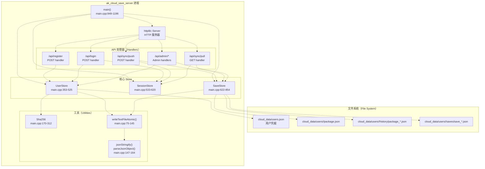
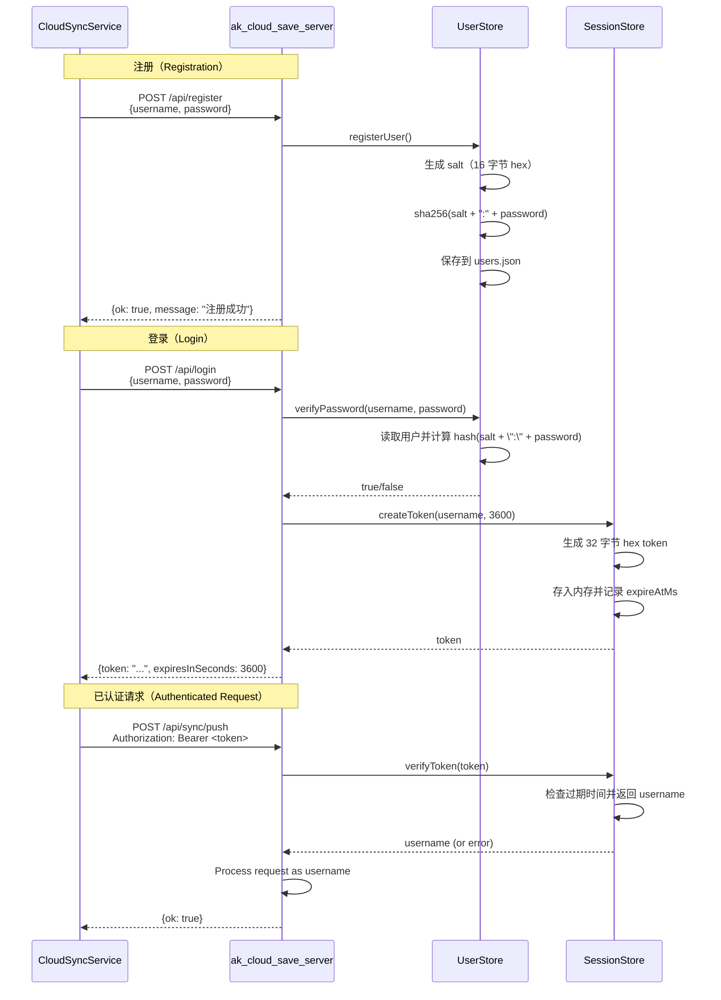
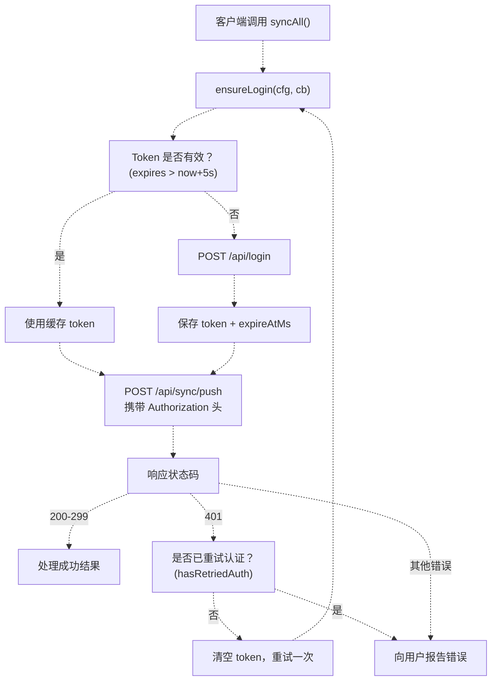
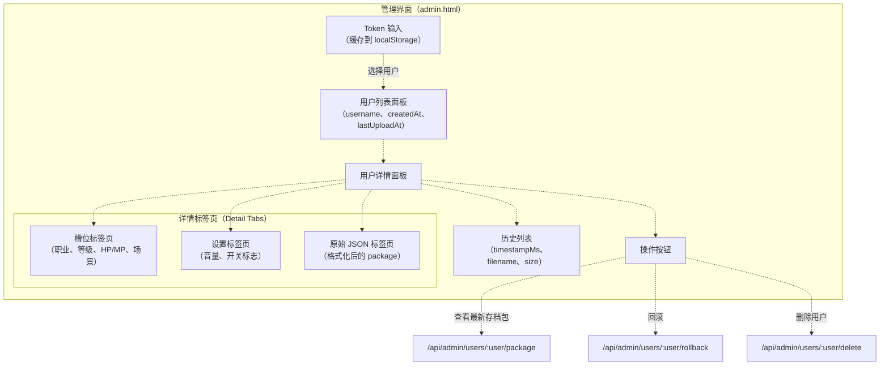
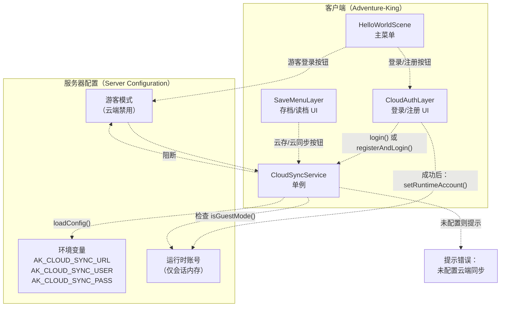
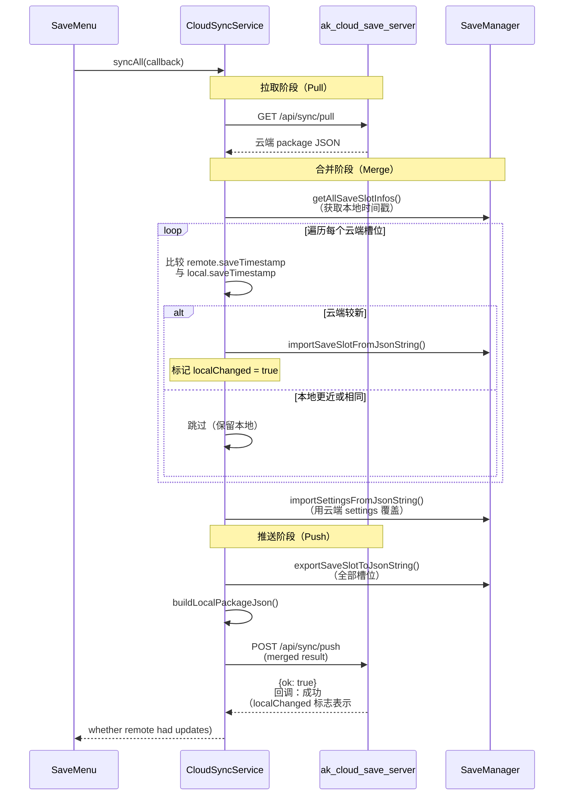

# Cloud Save Server（云存档服务器）

> **相关源文件（Relevant source files）**
> * [Adventure-King/Classes/Save/Cloud/CloudSyncService.cpp](https://github.com/lilong555/Adventure-King/blob/60df0f40/Adventure-King/Classes/Save/Cloud/CloudSyncService.cpp)
> * [Adventure-King/Classes/Save/Cloud/CloudSyncService.h](https://github.com/lilong555/Adventure-King/blob/60df0f40/Adventure-King/Classes/Save/Cloud/CloudSyncService.h)
> * [Adventure-King/Classes/Scenes/Layers/CloudAuthLayer.cpp](https://github.com/lilong555/Adventure-King/blob/60df0f40/Adventure-King/Classes/Scenes/Layers/CloudAuthLayer.cpp)
> * [Adventure-King/Classes/Scenes/Layers/CloudAuthLayer.h](https://github.com/lilong555/Adventure-King/blob/60df0f40/Adventure-King/Classes/Scenes/Layers/CloudAuthLayer.h)
> * [README.md](https://github.com/lilong555/Adventure-King/blob/60df0f40/README.md)
> * [docs/PROJECT_SHOWCASE.md](https://github.com/lilong555/Adventure-King/blob/60df0f40/docs/PROJECT_SHOWCASE.md)
> * [tools/cloud_save_server/README.md](https://github.com/lilong555/Adventure-King/blob/60df0f40/tools/cloud_save_server/README.md)
> * [tools/cloud_save_server/src/main.cpp](https://github.com/lilong555/Adventure-King/blob/60df0f40/tools/cloud_save_server/src/main.cpp)
> * [tools/cloud_save_server/web/admin.html](https://github.com/lilong555/Adventure-King/blob/60df0f40/tools/cloud_save_server/web/admin.html)

## 目的与范围

本页记录后端 **ak_cloud_save_server**：这是一个独立的 C++ HTTP 服务器，为 Adventure-King 提供云存档能力。服务器通过 HTTP API 处理用户注册、认证以及存档包同步。它被设计为本地运行（通常在 WSL 中），用于开发与演示。

关于客户端如何对接该服务器，请参见 [CloudSyncService Client](CloudSyncService 客户端.md)。关于面向用户的认证 UI，请参见 [Cloud Authentication](云端认证.md)。

**来源：** [tools/cloud_save_server/README.md L1-L183](https://github.com/lilong555/Adventure-King/blob/60df0f40/tools/cloud_save_server/README.md#L1-L183)

 [tools/cloud_save_server/src/main.cpp L1-L50](https://github.com/lilong555/Adventure-King/blob/60df0f40/tools/cloud_save_server/src/main.cpp#L1-L50)

---

## 概览

云存档服务器是一个自包含的 C++ 应用，基于 [cpp-httplib](https://github.com/lilong555/Adventure-King/blob/60df0f40/cpp-httplib)

 与 RapidJSON 构建，提供：

* **用户管理：** 用户名/密码注册，Bearer token 认证
* **存档包存储：** 按用户保存完整存档包（全部槽位 + 设置）
* **基于时间戳合并：** 使用 `saveTimestamp` 进行冲突解决（最后写入者获胜：last-write-wins）
* **历史追踪：** 每次上传自动备份旧版本
* **管理界面：** Web UI 用于查看、删除与回滚用户数据

该服务器不依赖游戏引擎，可独立编译（例如使用 `g++` 或 CMake）。

**关键设计原则：**

* **不硬编码 IP/URL：** 服务器地址通过命令行参数或环境变量在运行时配置
* **无状态 Token：** Bearer token 保存在内存中，服务器重启即失效
* **原子写：** 使用临时文件并在成功时 rename，防止损坏
* **最小依赖：** 标准库 + cpp-httplib（header-only）+ RapidJSON

**来源：** [tools/cloud_save_server/README.md L6-L12](https://github.com/lilong555/Adventure-King/blob/60df0f40/tools/cloud_save_server/README.md#L6-L12)

 [tools/cloud_save_server/src/main.cpp L1-L60](https://github.com/lilong555/Adventure-King/blob/60df0f40/tools/cloud_save_server/src/main.cpp#L1-L60)

---

## 架构

### 组件图



**来源：** [tools/cloud_save_server/src/main.cpp L353-L854](https://github.com/lilong555/Adventure-King/blob/60df0f40/tools/cloud_save_server/src/main.cpp#L353-L854)

 [tools/cloud_save_server/src/main.cpp L949-L1196](https://github.com/lilong555/Adventure-King/blob/60df0f40/tools/cloud_save_server/src/main.cpp#L949-L1196)

### 核心 Store 类

| 类（Class） | 职责（Responsibilities） | 关键方法（Key Methods） | 线程安全（Thread Safety） |
| --- | --- | --- | --- |
| `UserStore` | 用户凭据管理、密码哈希 | `registerUser()`, `verifyPassword()`, `deleteUser()`, `listUsers()` | 互斥锁保护 |
| `SessionStore` | Bearer token 生命周期、过期追踪 | `createToken()`, `verifyToken()`, `revokeUser()` | 互斥锁保护 + 定期清理 |
| `SaveStore` | 存档 package 持久化、历史备份 | `savePackageForUser()`, `loadPackageForUser()`, `listUserHistory()`, `rollbackUserToHistory()` | 互斥锁保护 |

**来源：** [tools/cloud_save_server/src/main.cpp L353-L525](https://github.com/lilong555/Adventure-King/blob/60df0f40/tools/cloud_save_server/src/main.cpp#L353-L525)

 [tools/cloud_save_server/src/main.cpp L533-L620](https://github.com/lilong555/Adventure-King/blob/60df0f40/tools/cloud_save_server/src/main.cpp#L533-L620)

 [tools/cloud_save_server/src/main.cpp L622-L854](https://github.com/lilong555/Adventure-King/blob/60df0f40/tools/cloud_save_server/src/main.cpp#L622-L854)

---

## 存储结构

### 目录布局

```python
cloud_data/                              # 根目录（可通过 --root 配置）
├── users.json                           # 用户凭据（salt + passwordHash）
└── users/
    └── <username>/
        ├── package.json                 # 最新的完整存档 package
        ├── history/
        │   ├── package_1234567890000.json    # 按时间戳备份
        │   └── package_9876543210000.json
        ├── saves/                       # 抽取后的槽位 JSON（便于管理界面展示）
        │   ├── save_0.json
        │   ├── save_1.json
        │   └── ...
        └── settings.json                # 抽取后的 settings（便于管理界面展示）
```

**来源：** [tools/cloud_save_server/README.md L101-L114](https://github.com/lilong555/Adventure-King/blob/60df0f40/tools/cloud_save_server/README.md#L101-L114)

### `users.json` 格式

```json
{
  "schemaVersion": 1,
  "users": [
    {
      "username": "user_01",
      "salt": "32-char-hex-string",
      "passwordHash": "64-char-sha256-hex",
      "createdAtMs": 1234567890000
    }
  ]
}
```

密码哈希使用 `sha256(salt + \":\" + password)`。这属于演示实现；生产部署应改用 `bcrypt` 或 `argon2` 等更安全的方案。

**来源：** [tools/cloud_save_server/src/main.cpp L495-L517](https://github.com/lilong555/Adventure-King/blob/60df0f40/tools/cloud_save_server/src/main.cpp#L495-L517)

 [tools/cloud_save_server/src/main.cpp L347-L351](https://github.com/lilong555/Adventure-King/blob/60df0f40/tools/cloud_save_server/src/main.cpp#L347-L351)

### `package.json` 格式

客户端上传的存档包 JSON 包含：

```
{
  "schemaVersion": 1,
  "uploadedAt": 1234567890000,
  "client": "Adventure-King",
  "settings": { /* SettingsSaveData */ },
  "saves": {
    "0": { /* SaveSlotData for slot 0 */ },
    "1": { /* SaveSlotData for slot 1 */ }
  }
}
```

`uploadedAt` 时间戳由客户端在构建 package 时设置（[CloudSyncService.cpp L622](https://github.com/lilong555/Adventure-King/blob/60df0f40/CloudSyncService.cpp#L622-L622)

）。单个存档槽位包含 `meta.saveTimestamp`，用于合并时的冲突解决。

**来源：** [tools/cloud_save_server/src/main.cpp L630-L709](https://github.com/lilong555/Adventure-King/blob/60df0f40/tools/cloud_save_server/src/main.cpp#L630-L709)

 [Adventure-King/Classes/Save/Cloud/CloudSyncService.cpp L613-L686](https://github.com/lilong555/Adventure-King/blob/60df0f40/Adventure-King/Classes/Save/Cloud/CloudSyncService.cpp#L613-L686)

---

## API 端点

### 认证流程



**来源：** [tools/cloud_save_server/src/main.cpp L362-L438](https://github.com/lilong555/Adventure-King/blob/60df0f40/tools/cloud_save_server/src/main.cpp#L362-L438)

 [tools/cloud_save_server/src/main.cpp L536-L568](https://github.com/lilong555/Adventure-King/blob/60df0f40/tools/cloud_save_server/src/main.cpp#L536-L568)

### 端点参考

| 端点（Endpoint） | 方法（Method） | 认证（Auth） | 用途（Purpose） | 请求体（Request Body） | 响应（Response） |
| --- | --- | --- | --- | --- | --- |
| `/api/register` | POST | 无 | 创建用户 | `{username, password}` | `{ok, message}` |
| `/api/login` | POST | 无 | 获取 bearer token | `{username, password}` | `{token, expiresInSeconds}` |
| `/api/sync/push` | POST | Bearer | 上传存档 package | 完整 package JSON | `{ok, message}` |
| `/api/sync/pull` | GET | Bearer | 下载存档 package | 无 | package JSON |
| `/` | GET | 无 | 健康检查 | 无 | `{ok, message: \"...\"}` |
| `/admin` | GET | 无（提供 HTML） | 管理界面 | 无 | HTML 页面 |
| `/api/admin/users` | GET | Admin-Token | 列出所有用户 | 无 | `{users: [...]}` |
| `/api/admin/users/:user/package` | GET | Admin-Token | 获取用户 package | 无 | `{package: {...}}` |
| `/api/admin/users/:user/history` | GET | Admin-Token | 列出历史版本 | 无 | `{history: [...]}` |
| `/api/admin/users/:user/rollback` | POST | Admin-Token | 回滚到历史版本 | `{timestampMs}` | `{ok, message}` |
| `/api/admin/users/:user/delete` | POST | Admin-Token | 删除用户及数据 | `{}` | `{ok, message}` |

**来源：** [tools/cloud_save_server/README.md L116-L122](https://github.com/lilong555/Adventure-King/blob/60df0f40/tools/cloud_save_server/README.md#L116-L122)

 [tools/cloud_save_server/src/main.cpp L1014-L1196](https://github.com/lilong555/Adventure-King/blob/60df0f40/tools/cloud_save_server/src/main.cpp#L1014-L1196)

### Token 重试逻辑（客户端侧）

客户端在遇到 `401` 时会自动刷新/重试 token：



**来源：** [Adventure-King/Classes/Save/Cloud/CloudSyncService.cpp L509-L611](https://github.com/lilong555/Adventure-King/blob/60df0f40/Adventure-King/Classes/Save/Cloud/CloudSyncService.cpp#L509-L611)

 [Adventure-King/Classes/Save/Cloud/CloudSyncService.cpp L581-L611](https://github.com/lilong555/Adventure-King/blob/60df0f40/Adventure-King/Classes/Save/Cloud/CloudSyncService.cpp#L581-L611)

---

## 管理 Web 界面

### 概览

服务器在 `/admin` 提供单页管理 UI（[tools/cloud_save_server/web/admin.html](https://github.com/lilong555/Adventure-King/blob/60df0f40/tools/cloud_save_server/web/admin.html)

）。该界面允许开发者：

* 查看所有已注册用户及其上传时间戳
* 检查存档 package（槽位数据、设置、原始 JSON）
* 回滚到之前的历史版本
* 删除用户及其云端数据

**认证：** 管理操作需要 `X-AK-Admin-Token` 请求头。管理员 Token 会在服务器启动时生成并打印到控制台：

```
Admin token (X-AK-Admin-Token): <64-char-hex-token>
```

**来源：** [tools/cloud_save_server/README.md L123-L150](https://github.com/lilong555/Adventure-King/blob/60df0f40/tools/cloud_save_server/README.md#L123-L150)

 [tools/cloud_save_server/src/main.cpp L1184-L1185](https://github.com/lilong555/Adventure-King/blob/60df0f40/tools/cloud_save_server/src/main.cpp#L1184-L1185)

### UI 功能



**来源：** [tools/cloud_save_server/web/admin.html L510-L851](https://github.com/lilong555/Adventure-King/blob/60df0f40/tools/cloud_save_server/web/admin.html#L510-L851)

### 常见管理 UI 问题

**问题（Problem）：** 打开 `/admin` 成功，但用户列表出现“刷新失败：HTTP 404”。

**根因（Root cause）：** 浏览器访问到了同一端口上的其他服务（例如端口冲突、代理配置错误）。

**排查（Diagnosis）：**

1. 打开 `http://127.0.0.1:5174/`，确认响应包含 `{\"ok\":true,\"message\":\"Adventure-King Cloud Save Server\"}`
2. 检查响应头 `X-AK-Server` 是否等于 `ak_cloud_save_server`
3. 若不满足，说明该端口被其他进程占用

**来源：** [tools/cloud_save_server/README.md L142-L150](https://github.com/lilong555/Adventure-King/blob/60df0f40/tools/cloud_save_server/README.md#L142-L150)

 [tools/cloud_save_server/src/main.cpp L860-L862](https://github.com/lilong555/Adventure-King/blob/60df0f40/tools/cloud_save_server/src/main.cpp#L860-L862)

---

## 部署

### 构建

**直接编译（无需 CMake）：**

WSL/Linux：

```
cd tools/cloud_save_server
g++ -std=c++17 -O2 -pthread \
    -I third_party/cpp-httplib \
    -I third_party/rapidjson/include \
    src/main.cpp \
    -o ak_cloud_save_server
```

Windows（提供 PowerShell 脚本）：

```
cd tools/cloud_save_server
powershell -ExecutionPolicy Bypass -File .\build_win.ps1
```

**CMake（可选）：**

```
mkdir -p build
cmake -S . -B build
cmake --build build -j
```

**来源：** [tools/cloud_save_server/README.md L13-L69](https://github.com/lilong555/Adventure-King/blob/60df0f40/tools/cloud_save_server/README.md#L13-L69)

### 运行

**快速启动脚本（WSL）：**

```
cd tools/cloud_save_server
./run_wsl.sh
```

该脚本会按默认参数自动编译并运行服务器：监听 `0.0.0.0:5174`，数据目录为 `./cloud_data/`。

**自定义参数的手动启动：**

```
./ak_cloud_save_server \
    --root /path/to/cloud_data \
    --host 0.0.0.0 \
    --port 5174
```

**命令行参数：**

| 参数（Argument） | 默认值（Default） | 说明（Description） |
| --- | --- | --- |
| `--root <path>` | `cloud_data` | 用户数据存储根目录 |
| `--host <address>` | `0.0.0.0` | 绑定地址（WSL 场景下建议用 `0.0.0.0` 以便 Windows 访问） |
| `--port <number>` | `5174` | HTTP 监听端口 |

**来源：** [tools/cloud_save_server/README.md L17-L48](https://github.com/lilong555/Adventure-King/blob/60df0f40/tools/cloud_save_server/README.md#L17-L48)

 [tools/cloud_save_server/src/main.cpp L935-L982](https://github.com/lilong555/Adventure-King/blob/60df0f40/tools/cloud_save_server/src/main.cpp#L935-L982)

### 环境变量覆盖（WSL）

`run_wsl.sh` 脚本会读取并使用这些环境变量：

```javascript
export AK_CLOUD_SERVER_ROOT="$HOME/mnt/ecs/adventure-king-cloud"
export AK_CLOUD_SERVER_PORT=5174
./run_wsl.sh
```

这样可以把服务器数据目录指向远程挂载目录（例如 ECS 卷），以实现更贴近“云端”的演示效果。

**来源：** [tools/cloud_save_server/README.md L30-L36](https://github.com/lilong555/Adventure-King/blob/60df0f40/tools/cloud_save_server/README.md#L30-L36)

### WSL ↔ Windows 网络

Windows 通常可以通过 `http://127.0.0.1:<port>` 访问 WSL 服务；如果失败：

1. 在 WSL 内查询 WSL IP：`hostname -I`
2. 在游戏的 CloudAuthLayer URL 输入框中使用 `http://<wsl-ip>:5174`

**重要说明：** 不要在仓库中硬编码任何 IP 地址。客户端应通过登录 UI 或环境变量在运行时配置服务器 URL。

**来源：** [tools/cloud_save_server/README.md L38-L60](https://github.com/lilong555/Adventure-King/blob/60df0f40/tools/cloud_save_server/README.md#L38-L60)

 [README.md L49-L60](https://github.com/lilong555/Adventure-King/blob/60df0f40/README.md#L49-L60)

---

## 安全性注意事项

### 当前实现（开发/演示）

该服务器面向**本地开发与演示**环境，存在以下限制：

| 方面（Aspect） | 当前实现（Current Implementation） | 生产建议（Production Recommendation） |
| --- | --- | --- |
| **传输（Transport）** | HTTP（明文） | HTTPS + TLS 1.3 |
| **密码哈希（Password hashing）** | `sha256(salt + ":" + password)` | `bcrypt`、`argon2id` 或 `scrypt` |
| **Token 存储（Token storage）** | 内存（重启即失效） | Redis/数据库 + 持久化会话 |
| **Token 撤销（Token revocation）** | 仅支持按用户名整体清空 | 按 token 撤销 + 黑名单 |
| **限流（Rate limiting）** | 无 | 请求节流、登录尝试次数限制 |
| **审计日志（Audit logging）** | 仅控制台输出 | 持久化日志（可包含 IP 追踪） |
| **数据加密（Data encryption）** | 无（仅依赖文件系统 ACL） | 对存档 package 做静态加密（at rest） |

**来源：** [tools/cloud_save_server/README.md L176-L183](https://github.com/lilong555/Adventure-King/blob/60df0f40/tools/cloud_save_server/README.md#L176-L183)

 [README.md L91-L98](https://github.com/lilong555/Adventure-King/blob/60df0f40/README.md#L91-L98)

### 密码哈希实现

```javascript
	// 当前做法（仅演示）：
// tools/cloud_save_server/src/main.cpp:347-351
static std::string hashPassword(const std::string &salt, const std::string &password)
{
    return Sha256::hexDigest(salt + ":" + password);
}
```

salt 的生成使用 `std::random_device` 与 seed 序列（[main.cpp L42-L60](https://github.com/lilong555/Adventure-King/blob/60df0f40/main.cpp#L42-L60)

):

```cpp
static std::string randomHex(size_t numBytes)
{
    static thread_local std::mt19937 gen([] {
        std::random_device rd;
        std::seed_seq seq{rd(), rd(), rd(), rd(), rd(), rd(), rd(), rd()};
        return std::mt19937(seq);
    }());
	    // ... 生成随机字节 ...
}
```

**为什么这不适合直接用于生产：**

* SHA-256 太快：如果 `users.json` 泄露，暴力破解更可行
* 没有“工作因子”调参能力（bcrypt/argon2 支持可配置迭代次数）
* salt 只有 16 字节（可接受），但哈希速度过快才是主要弱点

**来源：** [tools/cloud_save_server/src/main.cpp L42-L60](https://github.com/lilong555/Adventure-King/blob/60df0f40/tools/cloud_save_server/src/main.cpp#L42-L60)

 [tools/cloud_save_server/src/main.cpp L347-L351](https://github.com/lilong555/Adventure-King/blob/60df0f40/tools/cloud_save_server/src/main.cpp#L347-L351)

 [tools/cloud_save_server/src/main.cpp L170-L312](https://github.com/lilong555/Adventure-King/blob/60df0f40/tools/cloud_save_server/src/main.cpp#L170-L312)

### Token 过期

会话默认在 3600 秒（1 小时）后过期；`SessionStore` 会定期清理过期 token：

```
// tools/cloud_save_server/src/main.cpp:588-615
void maybeCleanupLocked(int64_t now)
{
    constexpr int64_t kCleanupIntervalMs = 60 * 1000;
    constexpr size_t kSizeThreshold = 1024;
    
    if (now - _lastCleanupAtMs < kCleanupIntervalMs && _sessions.size() < kSizeThreshold)
        return;
    
    for (auto it = _sessions.begin(); it != _sessions.end();)
    {
        if (now >= it->second.expireAtMs)
            it = _sessions.erase(it);
        else
            ++it;
    }
    _lastCleanupAtMs = now;
}
```

**来源：** [tools/cloud_save_server/src/main.cpp L536-L620](https://github.com/lilong555/Adventure-King/blob/60df0f40/tools/cloud_save_server/src/main.cpp#L536-L620)

### 文件写入完整性

服务器使用“临时文件 + 原子写”防止在磁盘满/崩溃等场景下造成文件损坏：

```javascript
// tools/cloud_save_server/src/main.cpp:75-145
bool writeTextFileAtomic(const fs::path &path, const std::string &content, std::string &outErr)
{
    const fs::path tmp = path.string() + ".tmp";
    const fs::path bak = path.string() + ".bak";
    
    // 写入 .tmp
    // 将现有文件重命名为 .bak（若存在）
    // 将 .tmp 重命名为目标文件
    // 成功时删除 .bak
    // 失败时回滚到 .bak
}
```

**来源：** [tools/cloud_save_server/src/main.cpp L75-L145](https://github.com/lilong555/Adventure-King/blob/60df0f40/tools/cloud_save_server/src/main.cpp#L75-L145)

---

## 与客户端的集成

### 客户端配置流程



**来源：** [Adventure-King/Classes/Save/Cloud/CloudSyncService.cpp L189-L314](https://github.com/lilong555/Adventure-King/blob/60df0f40/Adventure-King/Classes/Save/Cloud/CloudSyncService.cpp#L189-L314)

 [Adventure-King/Classes/Scenes/Layers/CloudAuthLayer.cpp L316-L376](https://github.com/lilong555/Adventure-King/blob/60df0f40/Adventure-King/Classes/Scenes/Layers/CloudAuthLayer.cpp#L316-L376)

### 存档包构建与上传

当客户端调用 `CloudSyncService::uploadAllSaves()` 时：

1. **构建 package：** `buildLocalPackageJson()` 从 `SaveManager` 获取所有槽位与 settings（[CloudSyncService.cpp L613-L686](https://github.com/lilong555/Adventure-King/blob/60df0f40/CloudSyncService.cpp#L613-L686)）
2. **添加元数据：** 写入 `uploadedAt` 时间戳与 `schemaVersion: 1`
3. **序列化：** 使用 RapidJSON 转为 JSON 字符串
4. **认证：** 调用 `ensureLogin()` 获取/刷新 bearer token
5. **上传：** `POST /api/sync/push` 并携带 `Authorization: Bearer <token>` 请求头
6. **服务器保存：** 将当前 `package.json` 备份到 `history/`，并以原子方式写入新 package

**来源：** [Adventure-King/Classes/Save/Cloud/CloudSyncService.cpp L797-L830](https://github.com/lilong555/Adventure-King/blob/60df0f40/Adventure-King/Classes/Save/Cloud/CloudSyncService.cpp#L797-L830)

### 合并策略（同步操作）



**来源：** [Adventure-King/Classes/Save/Cloud/CloudSyncService.cpp L832-L893](https://github.com/lilong555/Adventure-King/blob/60df0f40/Adventure-King/Classes/Save/Cloud/CloudSyncService.cpp#L832-L893)

 [Adventure-King/Classes/Save/Cloud/CloudSyncService.cpp L688-L795](https://github.com/lilong555/Adventure-King/blob/60df0f40/Adventure-King/Classes/Save/Cloud/CloudSyncService.cpp#L688-L795)

---

## 故障排查

### 端口冲突

**现象（Symptom）：** 服务器启动失败，提示 “Address already in use”。

**排查（Diagnosis）：**

```markdown
# Linux/WSL（在 WSL 内执行）
lsof -i :5174
netstat -tuln | grep 5174

# Windows（在 Windows 侧执行）
netstat -ano | findstr :5174
```

**处理（Resolution）：**

1. 结束占用端口的冲突进程，或
2. 换一个端口：`./ak_cloud_save_server --port 5175`

**来源：** [tools/cloud_save_server/README.md L142-L150](https://github.com/lilong555/Adventure-King/blob/60df0f40/tools/cloud_save_server/README.md#L142-L150)

### 管理员 Token 不生效

**现象（Symptom）：** 管理界面显示“Token 已保存”，但 API 请求返回 401。

**原因（Cause）：** 服务器重启导致 token 失效（token 仅存于内存）。

**处理（Resolution）：**

1. 重启服务器，并从控制台输出中复制新的管理员 token
2. 粘贴到管理界面的 token 输入框并点击“保存”

**来源：** [tools/cloud_save_server/src/main.cpp L1183-L1187](https://github.com/lilong555/Adventure-King/blob/60df0f40/tools/cloud_save_server/src/main.cpp#L1183-L1187)

### 找不到存档包（404）

**现象（Symptom）：** 客户端在同步时收到 `{\"message\": \"云端暂无存档包\"}`。

**原因（Cause）：** 用户从未上传过存档 package，或其数据目录已被删除。

**预期行为（Expected behavior）：** 这对新用户是正常情况。客户端应将其视为“云端为空”，继续走纯本地流程或进行首次上传。

**来源：** [tools/cloud_save_server/src/main.cpp L711-L722](https://github.com/lilong555/Adventure-King/blob/60df0f40/tools/cloud_save_server/src/main.cpp#L711-L722)

 [Adventure-King/Classes/Save/Cloud/CloudSyncService.cpp L111-L131](https://github.com/lilong555/Adventure-King/blob/60df0f40/Adventure-King/Classes/Save/Cloud/CloudSyncService.cpp#L111-L131)

 [Adventure-King/Classes/Save/Cloud/CloudSyncService.cpp L854-L865](https://github.com/lilong555/Adventure-King/blob/60df0f40/Adventure-King/Classes/Save/Cloud/CloudSyncService.cpp#L854-L865)
