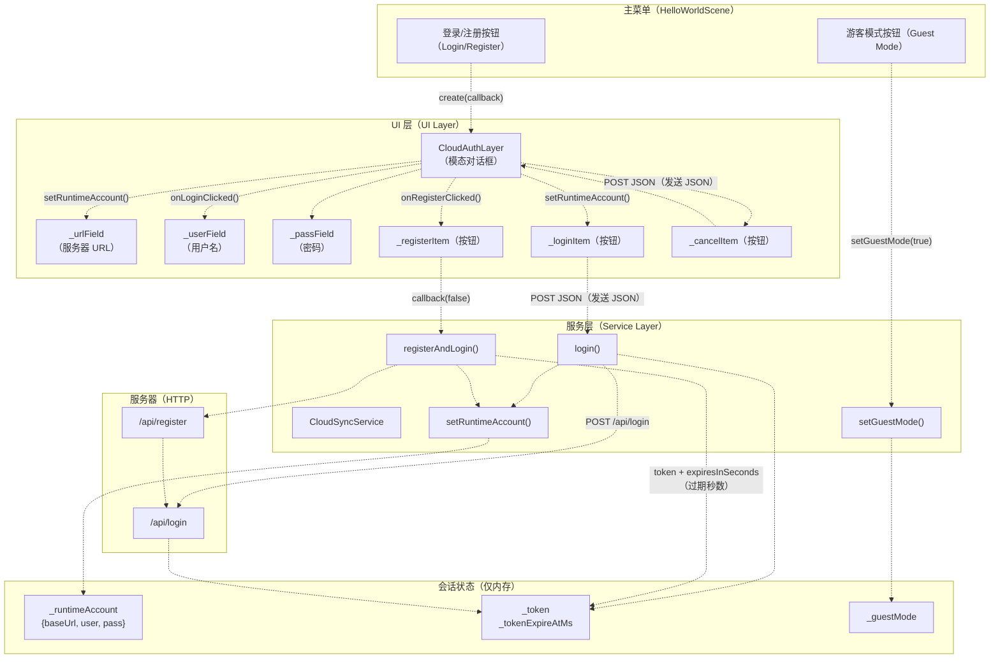
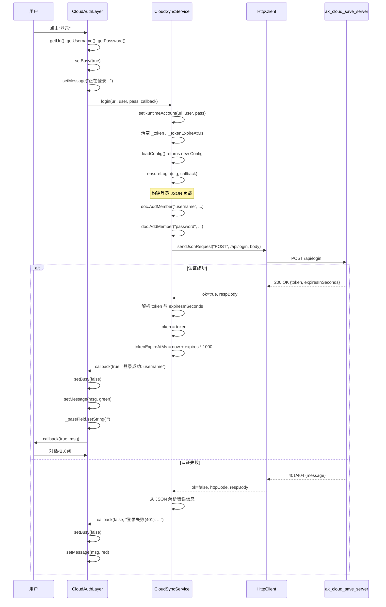
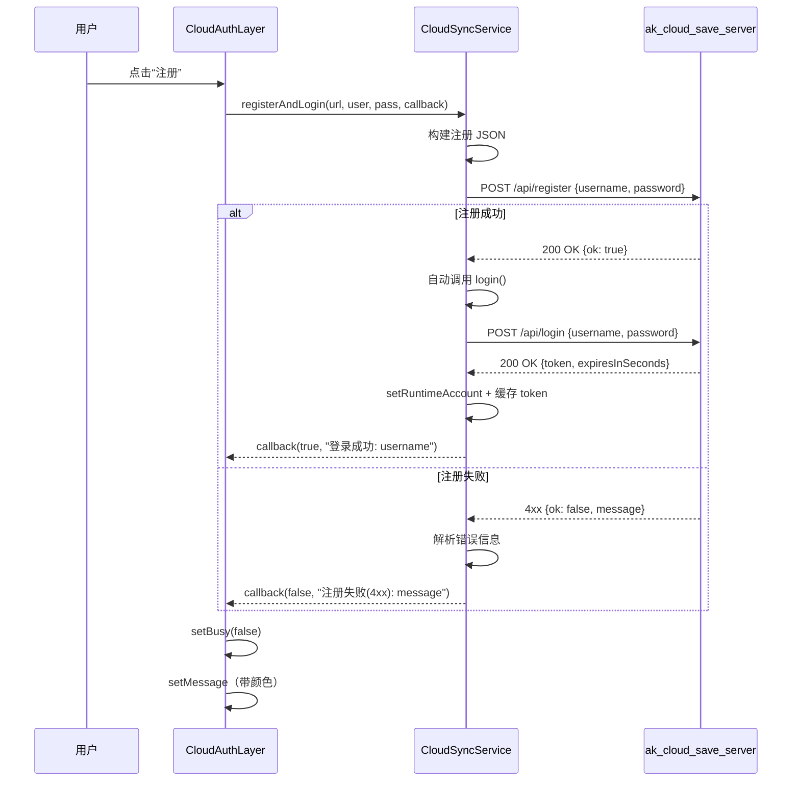

# Cloud Authentication（云端认证）

> **相关源文件（Relevant source files）**
> * [Adventure-King/Classes/Save/Cloud/CloudSyncService.cpp](https://github.com/lilong555/Adventure-King/blob/60df0f40/Adventure-King/Classes/Save/Cloud/CloudSyncService.cpp)
> * [Adventure-King/Classes/Save/Cloud/CloudSyncService.h](https://github.com/lilong555/Adventure-King/blob/60df0f40/Adventure-King/Classes/Save/Cloud/CloudSyncService.h)
> * [Adventure-King/Classes/Scenes/Layers/CloudAuthLayer.cpp](https://github.com/lilong555/Adventure-King/blob/60df0f40/Adventure-King/Classes/Scenes/Layers/CloudAuthLayer.cpp)
> * [Adventure-King/Classes/Scenes/Layers/CloudAuthLayer.h](https://github.com/lilong555/Adventure-King/blob/60df0f40/Adventure-King/Classes/Scenes/Layers/CloudAuthLayer.h)
> * [README.md](https://github.com/lilong555/Adventure-King/blob/60df0f40/README.md)
> * [docs/PROJECT_SHOWCASE.md](https://github.com/lilong555/Adventure-King/blob/60df0f40/docs/PROJECT_SHOWCASE.md)
> * [tools/cloud_save_server/README.md](https://github.com/lilong555/Adventure-King/blob/60df0f40/tools/cloud_save_server/README.md)
> * [tools/cloud_save_server/src/main.cpp](https://github.com/lilong555/Adventure-King/blob/60df0f40/tools/cloud_save_server/src/main.cpp)
> * [tools/cloud_save_server/web/admin.html](https://github.com/lilong555/Adventure-King/blob/60df0f40/tools/cloud_save_server/web/admin.html)

本文描述云存档系统的“云端认证”UI 层与认证流程：包括 `CloudAuthLayer` UI 组件、认证模式（游客/登录），以及 UI 与 `CloudSyncService` 的集成方式。

关于底层云同步服务与 API 方法，请参见 [CloudSyncService Client](<CloudSyncService 客户端.md>)。关于服务端认证实现细节，请参见 [Cloud Save Server](<云存档服务器.md>)。

---

## 概览

云端认证系统提供面向用户的登录/注册对话框，允许玩家在主菜单中与云存档服务器完成认证。系统支持两种模式：

* **已登录模式**：用户提供服务器 URL、用户名与密码以启用云存档功能
* **游客模式**：用户显式关闭云功能，以不登录的方式游玩

认证 UI 是模态且基于会话：凭据只保存在内存中，退出游戏时会被清空。

**来源：** [Adventure-King/Classes/Scenes/Layers/CloudAuthLayer.h L1-L54](https://github.com/lilong555/Adventure-King/blob/60df0f40/Adventure-King/Classes/Scenes/Layers/CloudAuthLayer.h#L1-L54)

 [Adventure-King/Classes/Save/Cloud/CloudSyncService.h L29-L58](https://github.com/lilong555/Adventure-King/blob/60df0f40/Adventure-King/Classes/Save/Cloud/CloudSyncService.h#L29-L58)

---

## 系统架构

认证层位于主菜单 UI 与云同步服务之间，把用户输入转换为服务调用。



**来源：** [Adventure-King/Classes/Scenes/Layers/CloudAuthLayer.cpp L1-L377](https://github.com/lilong555/Adventure-King/blob/60df0f40/Adventure-King/Classes/Scenes/Layers/CloudAuthLayer.cpp#L1-L377)

 [Adventure-King/Classes/Save/Cloud/CloudSyncService.cpp L234-L423](https://github.com/lilong555/Adventure-King/blob/60df0f40/Adventure-King/Classes/Save/Cloud/CloudSyncService.cpp#L234-L423)

---

## CloudAuthLayer UI 组件

`CloudAuthLayer` 类实现了用于认证的模态对话框：以半透明遮罩覆盖屏幕，并在中央显示面板。

### 类结构

| 成员（Member） | 类型（Type） | 用途（Purpose） |
| --- | --- | --- |
| `_urlField` | `ui::TextField*` | 服务器 URL 输入框（默认：`http://127.0.0.1:5174`） |
| `_userField` | `ui::TextField*` | 用户名输入框（3-32 字符） |
| `_passField` | `ui::TextField*` | 密码输入框（6-64 字符，掩码显示） |
| `_loginItem` | `MenuItemLabel*` | 登录按钮 |
| `_registerItem` | `MenuItemLabel*` | 注册按钮 |
| `_cancelItem` | `MenuItemLabel*` | 取消按钮 |
| `_messageLabel` | `Label*` | 反馈信息显示 |
| `_busy` | `bool` | 请求进行中标志 |
| `_ctrlDown` | `bool` | Ctrl 键状态（用于剪贴板操作） |
| `_doneCallback` | `DoneCallback` | 完成回调（成功/失败） |

**来源：** [Adventure-King/Classes/Scenes/Layers/CloudAuthLayer.h L15-L53](https://github.com/lilong555/Adventure-King/blob/60df0f40/Adventure-King/Classes/Scenes/Layers/CloudAuthLayer.h#L15-L53)

### UI 布局

对话框在屏幕中央显示：背景为深色半透明遮罩（`Color4B(0, 0, 0, 160)`），中间为面板（`Color4B(35, 35, 35, 230)`）。布局使用固定坐标，并结合屏幕尺寸做自适应限制：

```
┌─────────────────────────────────────┐
│  登录 / 注册                          │
├─────────────────────────────────────┤
│  提示：游客模式将禁用云存功能...       │
├─────────────────────────────────────┤
│  服务地址: [http://127.0.0.1:5174]  │
│  用户名:   [3-32位字母/数字/下划线]   │
│  密码:     [******]                  │
├─────────────────────────────────────┤
│      [登录]  [注册]  [取消]          │
└─────────────────────────────────────┘
```

面板尺寸会限制在屏幕范围内：宽度 `min(700.0f, visibleSize.width * 0.9f)`，高度 `min(420.0f, visibleSize.height * 0.8f)`。

**来源：** [Adventure-King/Classes/Scenes/Layers/CloudAuthLayer.cpp L186-L277](https://github.com/lilong555/Adventure-King/blob/60df0f40/Adventure-King/Classes/Scenes/Layers/CloudAuthLayer.cpp#L186-L277)

### 输入框配置

所有输入框具有以下统一配置：

* **最大长度限制**：URL（200 字符）、用户名（32 字符）、密码（64 字符）
* **光标启用**：显示可见的 `|` 光标
* **配色方案**：文本 `Color4B(240, 240, 240, 255)`，占位符 `Color4B(160, 160, 160, 255)`
* **下划线**：每个输入框下方绘制 2px 的 `Color4B(90, 90, 90, 255)` 线条

密码输入框通过 `setPasswordEnabled(true)` 与 `setPasswordStyleText("*")` 进行掩码显示。

**来源：** [Adventure-King/Classes/Scenes/Layers/CloudAuthLayer.cpp L216-L251](https://github.com/lilong555/Adventure-King/blob/60df0f40/Adventure-King/Classes/Scenes/Layers/CloudAuthLayer.cpp#L216-L251)

---

## 认证模式

云同步服务支持两种互斥模式：

### 游客模式

启用游客模式时：

* `_guestMode = true` in `CloudSyncService`
* 完全禁用云端功能
* `isConfigured()` returns `false` with hint: "当前为游客模式，云端功能已禁用"
* Save menu displays "云端：游客模式"

游客模式由主菜单的独立按钮触发，而不是通过 `CloudAuthLayer`。

**来源：** [Adventure-King/Classes/Save/Cloud/CloudSyncService.cpp L234-L244](https://github.com/lilong555/Adventure-King/blob/60df0f40/Adventure-King/Classes/Save/Cloud/CloudSyncService.cpp#L234-L244)

 [Adventure-King/Classes/Save/Cloud/CloudSyncService.cpp L289-L314](https://github.com/lilong555/Adventure-King/blob/60df0f40/Adventure-King/Classes/Save/Cloud/CloudSyncService.cpp#L289-L314)

### 已登录模式

用户登录或注册时：

1. `CloudAuthLayer` 校验输入框均非空
2. Calls `CloudSyncService::login()` or `CloudSyncService::registerAndLogin()`
3. 服务调用 `setRuntimeAccount()` 把凭据存入内存
4. 服务执行 HTTP 认证并缓存 token
5. 成功后回调以 `ok=true` 返回，并出于安全清空密码输入框

运行时账号结构：

```cpp
struct Config {
    std::string baseUrl;  // e.g., "http://127.0.0.1:5174"
    std::string user;     // username
    std::string pass;     // password (plaintext, memory only)
};
```

该配置会存入 `_runtimeAccount`，并且优先级高于环境变量。

**来源：** [Adventure-King/Classes/Save/Cloud/CloudSyncService.cpp L251-L272](https://github.com/lilong555/Adventure-King/blob/60df0f40/Adventure-King/Classes/Save/Cloud/CloudSyncService.cpp#L251-L272)

 [Adventure-King/Classes/Scenes/Layers/CloudAuthLayer.cpp L326-L363](https://github.com/lilong555/Adventure-King/blob/60df0f40/Adventure-King/Classes/Scenes/Layers/CloudAuthLayer.cpp#L326-L363)

---

## 认证流程

### 登录时序



**来源：** [Adventure-King/Classes/Scenes/Layers/CloudAuthLayer.cpp L316-L363](https://github.com/lilong555/Adventure-King/blob/60df0f40/Adventure-King/Classes/Scenes/Layers/CloudAuthLayer.cpp#L316-L363)

 [Adventure-King/Classes/Save/Cloud/CloudSyncService.cpp L316-L355](https://github.com/lilong555/Adventure-King/blob/60df0f40/Adventure-King/Classes/Save/Cloud/CloudSyncService.cpp#L316-L355)

 [Adventure-King/Classes/Save/Cloud/CloudSyncService.cpp L509-L579](https://github.com/lilong555/Adventure-King/blob/60df0f40/Adventure-King/Classes/Save/Cloud/CloudSyncService.cpp#L509-L579)

### 注册时序

注册采用两步流程：



注册完成后的自动登录发生在 [CloudSyncService.cpp L421](https://github.com/lilong555/Adventure-King/blob/60df0f40/CloudSyncService.cpp#L421-L421)

: `login(baseUrl, username, password, cb);`

**来源：** [Adventure-King/Classes/Save/Cloud/CloudSyncService.cpp L357-L423](https://github.com/lilong555/Adventure-King/blob/60df0f40/Adventure-King/Classes/Save/Cloud/CloudSyncService.cpp#L357-L423)

---

## 会话管理

### Token 缓存

认证成功后，服务会把 token 缓存在内存中：

| 字段（Field） | 类型（Type） | 用途（Purpose） |
| --- | --- | --- |
| `_token` | `std::string` | 服务端返回的 JWT 或不透明 token |
| `_tokenExpireAtMs` | `int64_t` | 过期时间戳（自 epoch 起的毫秒数） |

在任何需要认证的 API 调用前，`ensureLogin()` 会检查：

```javascript
const int64_t now = nowMs();
if (!_token.empty() && now + 5000 < _tokenExpireAtMs) {
    // token 仍然有效（预留 5s 缓冲）
    cb(true, _token, "");
    return;
}
// 否则重新登录
```

这 5 秒缓冲可以避免 token 在请求过程中刚好过期导致的竞态问题。

**来源：** [Adventure-King/Classes/Save/Cloud/CloudSyncService.cpp L509-L517](https://github.com/lilong555/Adventure-King/blob/60df0f40/Adventure-King/Classes/Save/Cloud/CloudSyncService.cpp#L509-L517)

### Token 失效与重新认证

如果请求返回 `401 Unauthorized`，服务会自动重试一次：

1. 清空 `_token` 与 `_tokenExpireAtMs`
2. 调用 `ensureLogin()` 重新认证
3. 使用新 token 重试原请求

该逻辑实现于 `sendAuthedJsonRequestWithRetry()`，并用 `hasRetriedAuth` 标志防止无限循环。

**来源：** [Adventure-King/Classes/Save/Cloud/CloudSyncService.cpp L581-L611](https://github.com/lilong555/Adventure-King/blob/60df0f40/Adventure-King/Classes/Save/Cloud/CloudSyncService.cpp#L581-L611)

### 账号切换

切换账号时：

```
void setRuntimeAccount(baseUrl, username, password) {
    _guestMode = false;
    _hasRuntimeAccount = true;
    _runtimeAccount = {baseUrl, username, password};
    
    // 关键：清空旧 token，避免权限错误
    _token.clear();
    _tokenExpireAtMs = 0;
}
```

必须清空 token，因为旧 token 属于另一个用户，继续使用会导致授权失败。

**来源：** [Adventure-King/Classes/Save/Cloud/CloudSyncService.cpp L251-L264](https://github.com/lilong555/Adventure-King/blob/60df0f40/Adventure-King/Classes/Save/Cloud/CloudSyncService.cpp#L251-L264)

---

## 输入处理与用户体验

### 键盘快捷键

对话框实现了若干键盘增强体验：

| 按键（Key） | 动作（Action） |
| --- | --- |
| `Esc` | 关闭对话框（取消） |
| `Ctrl+V` | 从剪贴板粘贴到当前输入框 |
| `Ctrl+C` | 复制当前输入框内容到剪贴板 |

Ctrl 键状态通过 `_ctrlDown` 标记追踪：按下 `KEY_CTRL` 置 true，松开时清除。

**来源：** [Adventure-King/Classes/Scenes/Layers/CloudAuthLayer.cpp L116-L183](https://github.com/lilong555/Adventure-King/blob/60df0f40/Adventure-King/Classes/Scenes/Layers/CloudAuthLayer.cpp#L116-L183)

### 剪贴板集成

粘贴操作包含输入净化与“按 UTF-8 字符数”的截断：

```cpp
auto sanitizeClipboard = [](std::string s) {
    s.erase(std::remove(s.begin(), s.end(), '\r'), s.end());
    s.erase(std::remove(s.begin(), s.end(), '\n'), s.end());
    return s;
};
```

`utf8PrefixByChars()` 按“字符数”（而非字节数）截断，避免把多字节 UTF-8 序列截断在中间，从而防止无效 UTF-8 与渲染异常。

**来源：** [Adventure-King/Classes/Scenes/Layers/CloudAuthLayer.cpp L60-L114](https://github.com/lilong555/Adventure-King/blob/60df0f40/Adventure-King/Classes/Scenes/Layers/CloudAuthLayer.cpp#L60-L114)

### Busy 状态管理

当请求进行中时：

* `setBusy(true)` 会禁用所有按钮（`_loginItem`, `_registerItem`, `_cancelItem`）
* 消息标签以灰色显示“正在登录...”或“正在注册...”
* 完成后 `setBusy(false)` 重新启用按钮
* 消息颜色：绿色（成功）或红色（失败）

这可以防止重复提交，并提供清晰的视觉反馈。

**来源：** [Adventure-King/Classes/Scenes/Layers/CloudAuthLayer.cpp L280-L299](https://github.com/lilong555/Adventure-King/blob/60df0f40/Adventure-King/Classes/Scenes/Layers/CloudAuthLayer.cpp#L280-L299)

 [Adventure-King/Classes/Scenes/Layers/CloudAuthLayer.cpp L337-L343](https://github.com/lilong555/Adventure-King/blob/60df0f40/Adventure-King/Classes/Scenes/Layers/CloudAuthLayer.cpp#L337-L343)

### 吞噬触摸与键盘事件

对话框会阻止输入事件穿透到主菜单：

```sql
auto touchListener = EventListenerTouchOneByOne::create();
touchListener->setSwallowTouches(true);
touchListener->onTouchBegan = [](Touch *, Event *) { return true; };

auto keyListener = EventListenerKeyboard::create();
keyListener->onKeyPressed = [](KeyCode keyCode, Event *event) {
    if (event) {
        event->stopPropagation();  // 防止主菜单热键响应
    }
    // ... handle key
};
```

这保证对话框打开期间，主菜单不会响应输入。

**来源：** [Adventure-King/Classes/Scenes/Layers/CloudAuthLayer.cpp L34-L183](https://github.com/lilong555/Adventure-King/blob/60df0f40/Adventure-King/Classes/Scenes/Layers/CloudAuthLayer.cpp#L34-L183)

---

## 安全性注意事项

认证系统遵循以下安全实践：

1. **不做持久化存储（No Persistent Storage）**：凭据不会写入磁盘，仅在游戏会话期间存在于 `_runtimeAccount` 中。
2. **清空密码输入（Password Field Clearing）**：认证成功后清空密码输入框，避免旁观或截图泄露：`if (_passField) { _passField->setString(\"\"); }`
3. **建议使用 HTTPS（HTTPS Recommendation）**：默认 URL 为本地开发使用的 `http://127.0.0.1:5174`，但 README 已提示：> \"HTTP 明文（未启用 TLS，登录/同步数据可被窃听）\"。生产部署应使用 HTTPS。
4. **Token 过期（Token Expiration）**：token 有生命周期（默认 3600 秒/1 小时），由服务器强制，并在客户端按过期时间缓存。

**来源：** [Adventure-King/Classes/Scenes/Layers/CloudAuthLayer.cpp L346-L350](https://github.com/lilong555/Adventure-King/blob/60df0f40/Adventure-King/Classes/Scenes/Layers/CloudAuthLayer.cpp#L346-L350)

 [tools/cloud_save_server/README.md L176-L183](https://github.com/lilong555/Adventure-King/blob/60df0f40/tools/cloud_save_server/README.md#L176-L183)

 [Adventure-King/Classes/Save/Cloud/CloudSyncService.cpp L569-L576](https://github.com/lilong555/Adventure-King/blob/60df0f40/Adventure-King/Classes/Save/Cloud/CloudSyncService.cpp#L569-L576)

---

## 错误处理

### 客户端校验

发送请求前，UI 会做以下校验：

* URL 非空
* 用户名非空
* 密码非空

空字段会直接回调错误，不会发起网络请求：

```
if (baseUrl.empty()) {
    cb(false, "登录失败：URL 不能为空");
    return;
}
```

**来源：** [Adventure-King/Classes/Save/Cloud/CloudSyncService.cpp L321-L335](https://github.com/lilong555/Adventure-King/blob/60df0f40/Adventure-King/Classes/Save/Cloud/CloudSyncService.cpp#L321-L335)

### 服务端错误解析

当请求失败时，服务会尝试从 JSON 响应中提取更易读的提示信息：

```
rapidjson::Document errDoc;
if (parseJsonObject(respBody, errDoc, parseErr) &&
    errDoc.HasMember("message") && errDoc["message"].IsString()) {
    serverMsg = errDoc["message"].GetString();
}
```

如果解析失败，则回退为 HTTP 错误码或原始响应体（截断到 160 字符）。

**来源：** [Adventure-King/Classes/Save/Cloud/CloudSyncService.cpp L390-L397](https://github.com/lilong555/Adventure-King/blob/60df0f40/Adventure-King/Classes/Save/Cloud/CloudSyncService.cpp#L390-L397)

 [Adventure-King/Classes/Save/Cloud/CloudSyncService.cpp L536-L546](https://github.com/lilong555/Adventure-King/blob/60df0f40/Adventure-King/Classes/Save/Cloud/CloudSyncService.cpp#L536-L546)

### UI 反馈

错误信息会显示在 `_messageLabel` 中，并使用颜色区分：

* **成功（Success）**：`Color4B(120, 220, 120, 255)`（绿）
* **错误（Error）**：`Color4B(220, 120, 120, 255)`（红）
* **信息（Info）**：`Color4B(200, 200, 200, 255)`（灰）

示例：

* `"登录成功：username"` (green)
* `"注册失败(400): 用户名已存在"` (red)
* `"正在登录..."` (gray)

**来源：** [Adventure-King/Classes/Scenes/Layers/CloudAuthLayer.cpp L291-L299](https://github.com/lilong555/Adventure-King/blob/60df0f40/Adventure-King/Classes/Scenes/Layers/CloudAuthLayer.cpp#L291-L299)

 [Adventure-King/Classes/Scenes/Layers/CloudAuthLayer.cpp L343](https://github.com/lilong555/Adventure-King/blob/60df0f40/Adventure-King/Classes/Scenes/Layers/CloudAuthLayer.cpp#L343-L343)

---

## 与主菜单的集成

认证对话框通常由主菜单（`HelloWorldScene`）中的“登录/注册（Login/Register）”按钮唤起：

```javascript
auto loginButton = MenuItemLabel::create(
    Label::createWithTTF("登录/注册", fontPath, fontSize),
    [](Ref*) {
        auto authLayer = CloudAuthLayer::create([](bool ok, const std::string& msg) {
            if (ok) {
                // 刷新 UI 以显示已登录状态
                // 启用云存按钮
            }
        });
        Director::getInstance()->getRunningScene()->addChild(authLayer, 1000);
    }
);
```

对话框以较高的 Z 序（通常 1000）加入，以确保显示在所有 UI 元素之上。

认证成功后：

* 主菜单更新显示已登录的用户名
* 存档菜单启用云存/云同步按钮
* 游客模式按钮隐藏或禁用

**来源：** [README.md L62-L87](https://github.com/lilong555/Adventure-King/blob/60df0f40/README.md#L62-L87)

 [docs/PROJECT_SHOWCASE.md L77-L88](https://github.com/lilong555/Adventure-King/blob/60df0f40/docs/PROJECT_SHOWCASE.md#L77-L88)
