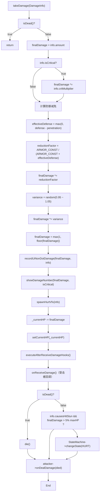
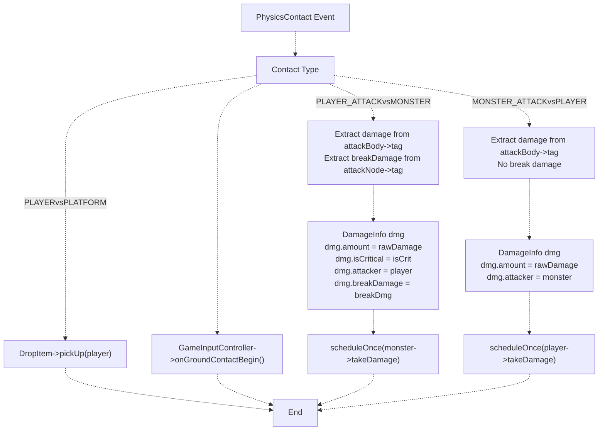

# 伤害系统

> **相关源文件**
> * [Adventure-King/Classes/Character/Base/CharacterBase.cpp](https://github.com/lilong555/Adventure-King/blob/60df0f40/Adventure-King/Classes/Character/Base/CharacterBase.cpp)
> * [Adventure-King/Classes/Character/Base/CharacterBase.h](https://github.com/lilong555/Adventure-King/blob/60df0f40/Adventure-King/Classes/Character/Base/CharacterBase.h)
> * [Adventure-King/Classes/Character/Monster/Monsters/GobluMonster.cpp](https://github.com/lilong555/Adventure-King/blob/60df0f40/Adventure-King/Classes/Character/Monster/Monsters/GobluMonster.cpp)
> * [Adventure-King/Classes/Character/Monster/Monsters/GobluMonster.h](https://github.com/lilong555/Adventure-King/blob/60df0f40/Adventure-King/Classes/Character/Monster/Monsters/GobluMonster.h)
> * [Adventure-King/Classes/Character/Player/SkillSets/AssassinSkillSet.cpp](https://github.com/lilong555/Adventure-King/blob/60df0f40/Adventure-King/Classes/Character/Player/SkillSets/AssassinSkillSet.cpp)
> * [Adventure-King/Classes/Character/Player/SkillSets/WarriorSkillSet.cpp](https://github.com/lilong555/Adventure-King/blob/60df0f40/Adventure-King/Classes/Character/Player/SkillSets/WarriorSkillSet.cpp)
> * [Adventure-King/Classes/Configs/GameConfig.h](https://github.com/lilong555/Adventure-King/blob/60df0f40/Adventure-King/Classes/Configs/GameConfig.h)
> * [Adventure-King/Classes/Scenes/CombatContactHelper.cpp](https://github.com/lilong555/Adventure-King/blob/60df0f40/Adventure-King/Classes/Scenes/CombatContactHelper.cpp)
> * [Adventure-King/Classes/UI/BossHealthBar.cpp](https://github.com/lilong555/Adventure-King/blob/60df0f40/Adventure-King/Classes/UI/BossHealthBar.cpp)
> * [Adventure-King/Classes/UI/BossHealthBar.h](https://github.com/lilong555/Adventure-King/blob/60df0f40/Adventure-King/Classes/UI/BossHealthBar.h)

## 目的与范围

伤害系统定义了 Adventure-King 中“伤害如何被计算、减免并应用到角色身上”。该系统主要在 `CharacterBase` 中实现，为所有造成伤害的交互提供统一管线，包含玩家攻击、怪物攻击、技能以及持续伤害（DOT）等。

本文档覆盖：

* 伤害计算流程（暴击、防御减免、随机波动）
* `DamageInfo` 结构体及字段含义
* 视觉反馈（伤害数字、受击特效）
* 装备特效与被动能力的回调 hook
* Boss 机制中的破韧/破甲（break damage）系统

角色属性与数值相关内容请参见 [AttributeComponent](<组件架构.md>)。Boss 特有的破韧机制实现请参见 [Boss Mechanics](<Boss 机制.md>)。基于物理的战斗交互层请参见 [Physics and Combat Contact](<物理与战斗接触回调.md>)。

**来源**：[Classes/Character/Base/CharacterBase.h L16-L28](https://github.com/lilong555/Adventure-King/blob/60df0f40/Classes/Character/Base/CharacterBase.h#L16-L28)

 [Classes/Character/Base/CharacterBase.cpp L147-L248](https://github.com/lilong555/Adventure-King/blob/60df0f40/Classes/Character/Base/CharacterBase.cpp#L147-L248)

---

## DamageInfo 结构体

`DamageInfo` 结构体封装了一次伤害结算所需的全部参数。其定义位于 [Classes/Character/Base/CharacterBase.h L16-L28](https://github.com/lilong555/Adventure-King/blob/60df0f40/Classes/Character/Base/CharacterBase.h#L16-L28)

，并作为 `takeDamage()` 方法的唯一输入。

| 字段 | 类型 | 用途 |
| --- | --- | --- |
| `amount` | `float` | 任意修改前的基础伤害值 |
| `penetration` | `float` | 护甲穿透（降低有效防御） |
| `isCritical` | `bool` | 本次伤害是否为暴击 |
| `critMultiplier` | `float` | 暴击伤害倍率（默认：1.5 倍） |
| `attacker` | `CharacterBase*` | 伤害来源（用于回调、吸血、仇恨等） |
| `hasHitWorldPos` | `bool` | `hitWorldPos` 是否有效 |
| `hitWorldPos` | `Vec2` | 命中点的世界坐标（用于按方向生成受击特效） |
| `causesHitStun` | `bool` | 是否触发受击硬直（DOT 通常为 false） |
| `breakDamage` | `int` | 对 Boss 破韧条的贡献（非 Boss 目标为 0） |

**设计说明**：

* `causesHitStun` 用于区分“直接伤害”（触发动画、UI 连击统计等）与“持续伤害”（静默结算、不打断）
* `breakDamage` 仅对实现了破韧机制的 Boss 有意义（例如 Goblu）
* 不会使用负的 `critMultiplier`；暴击状态由布尔值标记

**来源**：[Classes/Character/Base/CharacterBase.h L16-L28](https://github.com/lilong555/Adventure-King/blob/60df0f40/Classes/Character/Base/CharacterBase.h#L16-L28)

---

## 伤害计算管线

伤害计算发生在 `CharacterBase::takeDamage()` 中，并按严格顺序执行以确保所有来源的结果一致。

下图概括了 `CharacterBase::takeDamage()` 的主要计算步骤（暴击、防御减免、随机波动、显示与回调）：



**来源：** [Adventure-King/Classes/Character/Base/CharacterBase.cpp L147-L248](https://github.com/lilong555/Adventure-King/blob/60df0f40/Adventure-King/Classes/Character/Base/CharacterBase.cpp#L147-L248)

#### 从物理刚体提取伤害

伤害值与暴击标记被编码在 `PhysicsBody::tag` 中：

```javascript
float rawDamage = static_cast<float>(attackBody->getTag());
const bool isCrit = rawDamage < 0.0f;  // Negative = critical
rawDamage = std::fabs(rawDamage);
```

**编码规则**：

* tag 为正数：普通伤害数值
* tag 为负数：暴击伤害（取绝对值作为伤害数值）
* tag 为 0：忽略（不应用伤害）

#### 接触类型处理



**来源**：[Classes/Scenes/CombatContactHelper.cpp L163-L213](https://github.com/lilong555/Adventure-King/blob/60df0f40/Classes/Scenes/CombatContactHelper.cpp#L163-L213)

 [Classes/Scenes/CombatContactHelper.cpp L72-L123](https://github.com/lilong555/Adventure-King/blob/60df0f40/Classes/Scenes/CombatContactHelper.cpp#L72-L123)

---

## 伤害流程汇总表

| 步骤 | 位置 | 职责 |
| --- | --- | --- |
| **1. 伤害来源** | 技能/攻击实现 | 设置 `DamageInfo` 字段，计算暴击 |
| **2. 生成命中框** | `PlayerCharacter::spawnPlayerAttackHitbox()` | 在物理刚体 tag 中编码伤害，把 break damage 存到节点 tag |
| **3. 物理接触** | `CombatContactHelper::handleContactBegin()` | 从物理对象提取伤害/暴击/break，构建 `DamageInfo` |
| **4. 延迟应用** | `scheduleOnce()` 回调 | 下一帧执行 `takeDamage()`（避免在物理回调内修改场景树） |
| **5. 暴击计算** | `CharacterBase::takeDamage()` lines 156-161 | 若 `isCritical` 则应用暴击倍率 |
| **6. 防御减免** | `CharacterBase::takeDamage()` lines 167-177 | 使用 MOBA 类公式计算减伤系数 |
| **7. 随机波动** | `CharacterBase::takeDamage()` lines 183-186 | 应用 ±5% 的随机波动 |
| **8. 最小伤害** | `CharacterBase::takeDamage()` line 191 | 保证最低 1 点伤害 |
| **9. UI 记录** | `CharacterBase::recordUiNonDotDamage()` | 累积非 DOT 伤害用于 Boss 连击显示等 |
| **10. 视觉反馈** | `showDamageNumber()`, `spawnHurtVfx()` | 生成浮动文字与粒子效果 |
| **11. 扣减 HP** | `CharacterBase::takeDamage()` lines 199-201 | 扣减伤害并 clamp 到 `[0, maxHP]` |
| **12. 受击者 Hook** | `AttributeComponent::executeAfterReceiveDamageHooks()` | 反伤、紧急面罩等 |
| **13. 死亡检查** | `CharacterBase::takeDamage()` line 213 | 判断 HP 是否 `<= 0` |
| **14. 攻击者 Hook** | `AttributeComponent::executeAfterDealDamageHooks()` | 吸血、暴击回响、附加状态等 |
| **15. 破韧伤害** | `GobluMonster::addBreakDamage()` | 累积破韧条（仅 Boss） |
| **16. 死亡/动画** | `CharacterBase::die()` 或状态机 | 触发死亡流程或 HURT 动画 |

**来源**：[Classes/Character/Base/CharacterBase.cpp L147-L248](https://github.com/lilong555/Adventure-King/blob/60df0f40/Classes/Character/Base/CharacterBase.cpp#L147-L248)

 [Classes/Scenes/CombatContactHelper.cpp L163-L213](https://github.com/lilong555/Adventure-King/blob/60df0f40/Classes/Scenes/CombatContactHelper.cpp#L163-L213)
