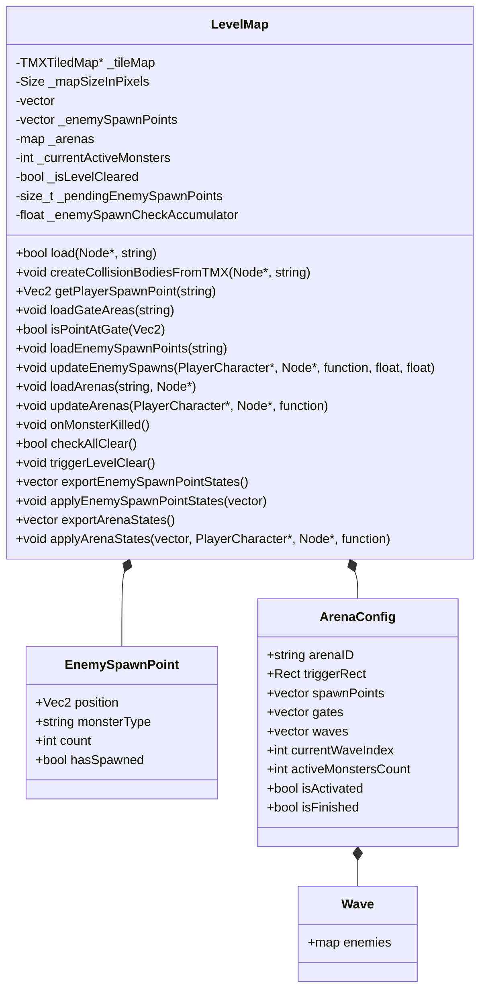

# LevelMap（关卡地图）

> **相关源文件**
> * [Adventure-King/Classes/Save/JsonSerializer.cpp](https://github.com/lilong555/Adventure-King/blob/60df0f40/Adventure-King/Classes/Save/JsonSerializer.cpp)
> * [Adventure-King/Classes/Save/SaveData.h](https://github.com/lilong555/Adventure-King/blob/60df0f40/Adventure-King/Classes/Save/SaveData.h)
> * [Adventure-King/Classes/Save/SaveManager.cpp](https://github.com/lilong555/Adventure-King/blob/60df0f40/Adventure-King/Classes/Save/SaveManager.cpp)
> * [Adventure-King/Classes/Scenes/LevelMap.cpp](https://github.com/lilong555/Adventure-King/blob/60df0f40/Adventure-King/Classes/Scenes/LevelMap.cpp)
> * [Adventure-King/Classes/Scenes/LevelMap.h](https://github.com/lilong555/Adventure-King/blob/60df0f40/Adventure-King/Classes/Scenes/LevelMap.h)

**用途**：本文档描述 `LevelMap` 类。它负责加载与管理 TMX 瓦片地图、创建碰撞几何、生成敌人、管理竞技场战斗遭遇，以及追踪关卡完成状态。`LevelMap` 充当玩法关卡的“世界状态管理器”。

**范围**：本页覆盖 LevelMap 的核心类结构、TMX 解析，以及生成/竞技场/传送门等系统的集成。关于 GameScene 中更细的初始化流程请参见 [2.1](GameScene（游戏场景）.md)。关于存/读档机制请参见 [6.1](存档管理器（SaveManager）.md)。

---

## 概览

`LevelMap` 类封装了基于 TMX 的游戏世界中所有“关卡特定”的数据与逻辑。它提供：

* **TMX 解析**：加载瓦片地图并提取碰撞、生成点、传送门、竞技场等对象组
* **碰撞生成**：把 TMX 中的 polygon/polyline/rect 对象转换为物理刚体
* **生成管理**：基于距离的敌人生成，并跟踪状态避免重复生成
* **竞技场系统**：多波战斗遭遇，包含相机锁定与关门控制
* **关卡推进**：胜利条件跟踪与传送门激活
* **状态持久化**：导出/导入生成点、竞技场进度与存活怪物以支持存/读档

**来源**：[Adventure-King/Classes/Scenes/LevelMap.h L1-L197](https://github.com/lilong555/Adventure-King/blob/60df0f40/Adventure-King/Classes/Scenes/LevelMap.h#L1-L197)

 [Adventure-King/Classes/Scenes/LevelMap.cpp L1-L70](https://github.com/lilong555/Adventure-King/blob/60df0f40/Adventure-King/Classes/Scenes/LevelMap.cpp#L1-L70)

---

## 核心架构

### 类结构



**来源**：[Adventure-King/Classes/Scenes/LevelMap.h L21-L196](https://github.com/lilong555/Adventure-King/blob/60df0f40/Adventure-King/Classes/Scenes/LevelMap.h#L21-L196)

 [Adventure-King/Classes/Configs/ArenaConfig.h L1-L30](https://github.com/lilong555/Adventure-King/blob/60df0f40/Adventure-King/Classes/Configs/ArenaConfig.h#L1-L30)

---

## TMX 地图加载

### 加载管线

`load()` 方法会初始化地图的核心结构：

| 步骤 | 方法 | 用途 |
| --- | --- | --- |
| 1 | `TMXTiledMap::create(tmxPath)` | 解析 TMX 文件并创建瓦片层 |
| 2 | 计算 `_mapSizeInPixels` | 存储世界边界（地图瓦片数 × 瓦片大小） |
| 3 | 加入场景树 | 把 `_tileMap` 作为子节点挂载，z-order 为 0 |

**来源**：原文此处存在生成器截断占位（`...21055 chars truncated...`），为保证不遗漏，保留如下残片：

**来源：** [Adventure-King/Classes/Scenes/LevelMap.cpp …21055 chars truncated…]（原文此处截断：`…21055 chars truncated…`）由竞技场生成的怪物会设置 `monster->setName("arena:" + arenaID)`。保存时，GameScene 从名称前缀中提取 arena ID 并写入 `MonsterState::arenaID`；加载时，`registerRestoredArenaMonster()` 使用该 ID 来恢复怪物的竞技场归属关系。

**来源：** [Adventure-King/Classes/Save/SaveData.h L146-L158](https://github.com/lilong555/Adventure-King/blob/60df0f40/Adventure-King/Classes/Save/SaveData.h#L146-L158)

 [Adventure-King/Classes/Scenes/LevelMap.cpp L866-L923](https://github.com/lilong555/Adventure-King/blob/60df0f40/Adventure-King/Classes/Scenes/LevelMap.cpp#L866-L923)

---

## 配置常量

LevelMap 的行为由 `GameConfig::LevelMap` 中的常量控制：

| 常量 | 默认值 | 用途 |
| --- | --- | --- |
| `DEFAULT_SPAWN_POINT` | `Vec2(100, 300)` | TMX 缺少出生点时的兜底玩家出生点 |
| `COLLISION_PHYSICS_MATERIAL` | `PhysicsMaterial(1.0f, 0.0f, 0.8f)` | 所有碰撞体使用的密度/弹性/摩擦 |
| `DEFAULT_GATE_INTERACT_DISTANCE` | `100.0f` | 未使用（传送门交互使用“矩形包含”判断） |
| `SPAWN_SPACING_X` | `60.0f` | 同一生成点生成多只怪时的水平间距 |
| `SPAWN_INTERVAL_SECONDS` | `0.3f` | 生成一组怪物时，逐只生成的间隔 |
| `DEFAULT_CHARACTER_Z_ORDER` | `10` | 生成怪物使用的 Z 序 |
| `ENEMY_SPAWN_CHECK_INTERVAL_SECONDS` | `0.2f` | 基于距离生成检查的节流间隔 |

**来源**：[Adventure-King/Classes/Scenes/LevelMap.cpp L25-L36](https://github.com/lilong555/Adventure-King/blob/60df0f40/Adventure-King/Classes/Scenes/LevelMap.cpp#L25-L36)

---

## 与其他系统的交互

### GameScene 集成

GameScene 以如下方式编排 LevelMap：

1. 初始化期间调用 `load()` 与 TMX 解析方法
2. 传入 `createMonsterByType` 工厂函数，用于动态创建怪物
3. 在主 update 循环中调用 `updateEnemySpawns()` 与 `updateArenas()`
4. 查询 `isPointAtGate()` 以支持关卡出口交互
5. 存档时通过 `exportEnemySpawnPointStates()` / `exportArenaStates()` 导出状态
6. 读档时通过 `applyEnemySpawnPointStates()` / `applyArenaStates()` 恢复状态

**来源**：GameScene 初始化管线详见 [2.1](GameScene（游戏场景）.md)。

### SaveManager 集成

SaveManager 会把 LevelMap 状态存入 `GameProgressSaveData`：

```
struct GameProgressSaveData {
    bool isLevelCleared;
    vector<EnemySpawnPointState> enemySpawnPoints;
    vector<ArenaState> arenas;
    vector<MonsterState> aliveMonsters;
    // ...
};
```

存/读档流程：

1. **存档**：GameScene 调用 `SaveManager::saveGame()` → `fillProgressDataForSave()` → `LevelMap::exportEnemySpawnPointStates()` / `exportArenaStates()`
2. **读档**：GameScene 调用 `SaveManager::loadGame()` → 应用玩家数据 → `LevelMap::applyEnemySpawnPointStates()` / `applyArenaStates()` → 恢复怪物 → `registerRestoredArenaMonster()` / `resumeActiveArenasIfNeeded()`

**来源**：[Adventure-King/Classes/Save/SaveData.h L109-L168](https://github.com/lilong555/Adventure-King/blob/60df0f40/Adventure-King/Classes/Save/SaveData.h#L109-L168)

 [Adventure-King/Classes/Save/SaveManager.cpp L315-L383](https://github.com/lilong555/Adventure-King/blob/60df0f40/Adventure-King/Classes/Save/SaveManager.cpp#L315-L383)

### 相机控制回调

在竞技场战斗期间，LevelMap 通过 `onArenaCameraRequest` 回调请求锁定相机：

```cpp
std::function<void(bool, Vec2)> onArenaCameraRequest;
```

* **签名**：`(bool lock, Vec2 center)`
* **设置者**：初始化时由 GameScene 设置
* **调用时机**：
  * 触发竞技场：`onArenaCameraRequest(true, triggerRect.center)`
  * 清理竞技场：`onArenaCameraRequest(false, Vec2::ZERO)`

**来源**：[Adventure-King/Classes/Scenes/LevelMap.h L144](https://github.com/lilong555/Adventure-King/blob/60df0f40/Adventure-King/Classes/Scenes/LevelMap.h#L144-L144)

 [Adventure-King/Classes/Scenes/LevelMap.cpp L1017-L1021](https://github.com/lilong555/Adventure-King/blob/60df0f40/Adventure-King/Classes/Scenes/LevelMap.cpp#L1017-L1021)

 [Adventure-King/Classes/Scenes/LevelMap.cpp L1056-L1058](https://github.com/lilong555/Adventure-King/blob/60df0f40/Adventure-King/Classes/Scenes/LevelMap.cpp#L1056-L1058)

---

## 调试可视化

在 Debug 构建（`COCOS2D_DEBUG > 0`）中，LevelMap 会绘制一些可视化覆盖层：

| 功能 | 视觉表现 | 颜色 | 用途 |
| --- | --- | --- | --- |
| 碰撞体 | 线框多边形 | 绿色 (0, 1, 0, 0.5) | 显示平台/墙体命中框 |
| 传送门区域 | 实心矩形 | 蓝色 (0, 0, 1, 0.3) | 显示传送门触发区 |

**来源**：[Adventure-King/Classes/Scenes/LevelMap.cpp L270-L276](https://github.com/lilong555/Adventure-King/blob/60df0f40/Adventure-King/Classes/Scenes/LevelMap.cpp#L270-L276)

 [Adventure-King/Classes/Scenes/LevelMap.cpp L382-L387](https://github.com/lilong555/Adventure-King/blob/60df0f40/Adventure-King/Classes/Scenes/LevelMap.cpp#L382-L387)
