# 关卡进度

> **相关源文件**
> * [Adventure-King/Classes/Save/JsonSerializer.cpp](https://github.com/lilong555/Adventure-King/blob/60df0f40/Adventure-King/Classes/Save/JsonSerializer.cpp)
> * [Adventure-King/Classes/Save/SaveData.h](https://github.com/lilong555/Adventure-King/blob/60df0f40/Adventure-King/Classes/Save/SaveData.h)
> * [Adventure-King/Classes/Save/SaveManager.cpp](https://github.com/lilong555/Adventure-King/blob/60df0f40/Adventure-King/Classes/Save/SaveManager.cpp)
> * [Adventure-King/Classes/Scenes/DebugScene.cpp](https://github.com/lilong555/Adventure-King/blob/60df0f40/Adventure-King/Classes/Scenes/DebugScene.cpp)
> * [Adventure-King/Classes/Scenes/DebugScene.h](https://github.com/lilong555/Adventure-King/blob/60df0f40/Adventure-King/Classes/Scenes/DebugScene.h)
> * [Adventure-King/Classes/Scenes/GameScene.cpp](https://github.com/lilong555/Adventure-King/blob/60df0f40/Adventure-King/Classes/Scenes/GameScene.cpp)
> * [Adventure-King/Classes/Scenes/GameScene.h](https://github.com/lilong555/Adventure-King/blob/60df0f40/Adventure-King/Classes/Scenes/GameScene.h)
> * [Adventure-King/Classes/Scenes/LevelMap.cpp](https://github.com/lilong555/Adventure-King/blob/60df0f40/Adventure-King/Classes/Scenes/LevelMap.cpp)
> * [Adventure-King/Classes/Scenes/LevelMap.h](https://github.com/lilong555/Adventure-King/blob/60df0f40/Adventure-King/Classes/Scenes/LevelMap.h)
> * [Adventure-King/proj.win32/Adventure-King.vcxproj](https://github.com/lilong555/Adventure-King/blob/60df0f40/Adventure-King/proj.win32/Adventure-King.vcxproj)
> * [Adventure-King/proj.win32/Adventure-King.vcxproj.filters](https://github.com/lilong555/Adventure-King/blob/60df0f40/Adventure-King/proj.win32/Adventure-King.vcxproj.filters)

本页记录关卡完成系统：包含清理条件、传送门激活以及胜利触发流程。关卡推进系统会跨普通生成点与竞技场追踪敌人清除情况，判断何时完成关卡，并管理“解锁状态”的切换（玩家可通过传送门离开关卡）。

敌人生成机制请参见 [敌人生成系统](<敌人生成系统.md>)。竞技场波次机制请参见 [竞技场战斗系统](<竞技场战斗系统.md>)。传送门触发区域与 TMX 加载请参见 [TMX 加载与碰撞](<TMX 加载与碰撞.md>)。

---

## 系统概览

关卡推进系统管理三种互斥状态：

1. **进行中（Active）**：战斗尚未结束；传送门锁定
2. **已清理（Cleared）**：所有目标完成；传送门解锁并播放特效
3. **离开（Exiting）**：玩家与传送门交互返回地图

该系统集中在 `LevelMap` 中实现，并由 `GameScene` 进行编排；完成状态通过 `GameProgressSaveData::isLevelCleared` 持久化。

**来源：** [Classes/Scenes/LevelMap.h L70-L83](https://github.com/lilong555/Adventure-King/blob/60df0f40/Classes/Scenes/LevelMap.h#L70-L83)

 [Classes/Scenes/LevelMap.cpp L71-L82](https://github.com/lilong555/Adventure-King/blob/60df0f40/Classes/Scenes/LevelMap.cpp#L71-L82)

 [Classes/Save/SaveData.h L119-L122](https://github.com/lilong555/Adventure-King/blob/60df0f40/Classes/Save/SaveData.h#L119-L122)

---

## 完成度追踪状态

### 状态变量

`LevelMap` 维护了三个计数/标记，它们共同决定关卡是否完成：

| 变量 | 类型 | 用途 |
| --- | --- | --- |
| `_currentActiveMonsters` | `int` | 存活怪物数量（生成时递增，死亡时递减） |
| `_pendingEnemySpawnPoints` | `size_t` | 尚未触发的 `enemy_g` 生成点数量 |
| `_isLevelCleared` | `bool` | 是否已触发“关卡清理完成” |

此外，`_arenas` 中的每个 `ArenaConfig` 会用 `isFinished` 表示该竞技场是否完成。

**来源：** [Classes/Scenes/LevelMap.h L194-L195](https://github.com/lilong555/Adventure-King/blob/60df0f40/Classes/Scenes/LevelMap.h#L194-L195)

 [Classes/Scenes/LevelMap.cpp L510-L514](https://github.com/lilong555/Adventure-King/blob/60df0f40/Classes/Scenes/LevelMap.cpp#L510-L514)

### 初始化逻辑

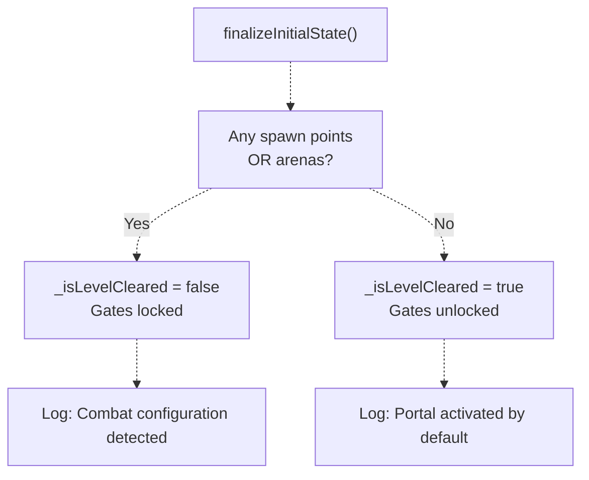

如果关卡没有任何战斗配置（既没有 `enemy_g` 生成点，也没有竞技场对象层），传送门会默认解锁。这让“Hub/对话类”关卡可以无需战斗也能正常运作。

**来源：** [Classes/Scenes/LevelMap.cpp L71-L82](https://github.com/lilong555/Adventure-King/blob/60df0f40/Classes/Scenes/LevelMap.cpp#L71-L82)

---

## 清理条件

### 条件评估

`checkAllClear()` 会评估三项条件，全部满足才算“关卡清理完成”：

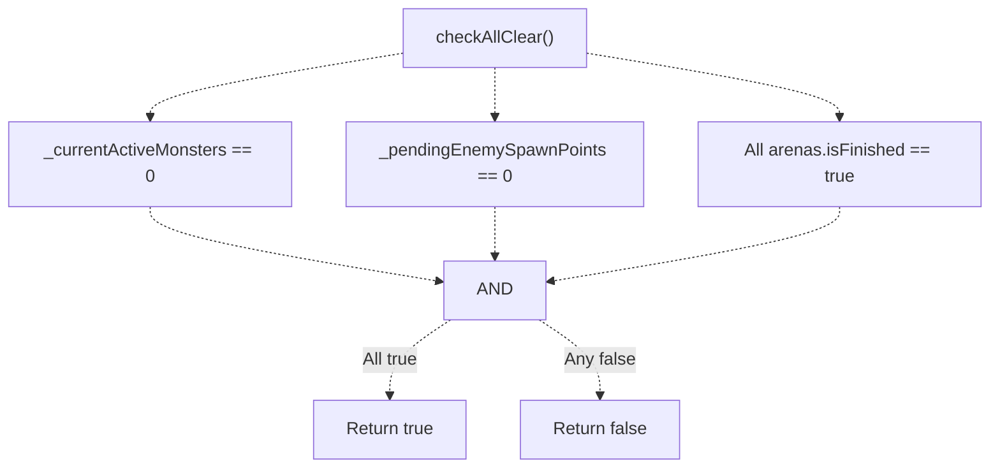

**来源：** [Classes/Scenes/LevelMap.cpp L458-L468](https://github.com/lilong555/Adventure-King/blob/60df0f40/Classes/Scenes/LevelMap.cpp#L458-L468)

### 条件说明

| 条件 | 描述 | 变化时机 |
| --- | --- | --- |
| `_currentActiveMonsters == 0` | 场景内没有存活怪物 | 刷怪时递增；怪物死亡回调里递减 |
| `_pendingEnemySpawnPoints == 0` | 所有 `enemy_g` 生成点都已触发 | 初始化为生成点数量；生成点触发后递减 |
| 所有竞技场完成 | `_arenas` 里每个竞技场都 `isFinished=true` | 最后一波清完后置位 |

### 击杀事件到清理检测

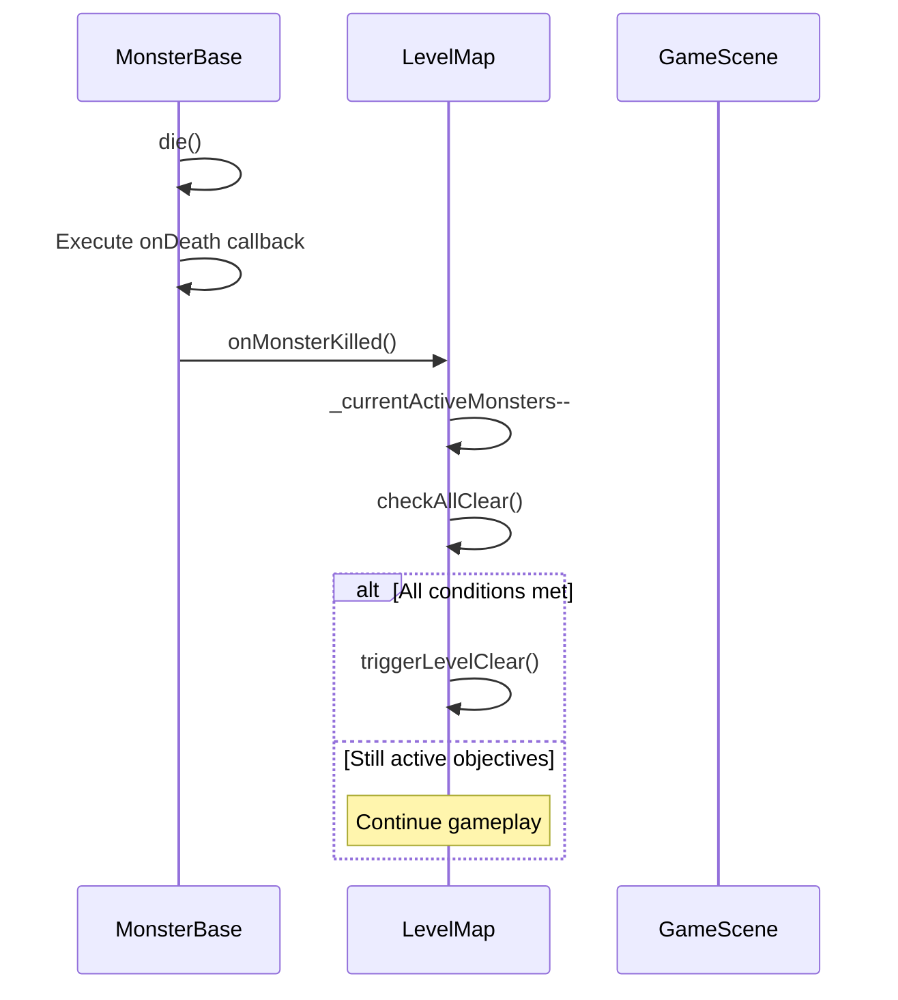

**来源：** [Classes/Scenes/LevelMap.cpp L449-L456](https://github.com/lilong555/Adventure-King/blob/60df0f40/Classes/Scenes/LevelMap.cpp#L449-L456)

 [Classes/Scenes/GameScene.cpp L236](https://github.com/lilong555/Adventure-King/blob/60df0f40/Classes/Scenes/GameScene.cpp#L236-L236)

 [Classes/Scenes/LevelMap.cpp L655-L670](https://github.com/lilong555/Adventure-King/blob/60df0f40/Classes/Scenes/LevelMap.cpp#L655-L670)

---

## 胜利序列

### 触发流程

当 `checkAllClear()` 返回 `true`，`triggerLevelClear()` 会执行胜利序列：

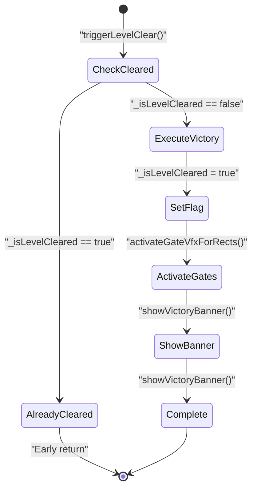

**来源：** [Classes/Scenes/LevelMap.cpp L471-L483](https://github.com/lilong555/Adventure-King/blob/60df0f40/Classes/Scenes/LevelMap.cpp#L471-L483)

### 传送门特效（Gate Activation）

每个 `_gateAreas` 的矩形中心都会生成一个常驻粒子效果，用于提示“已可交互”：

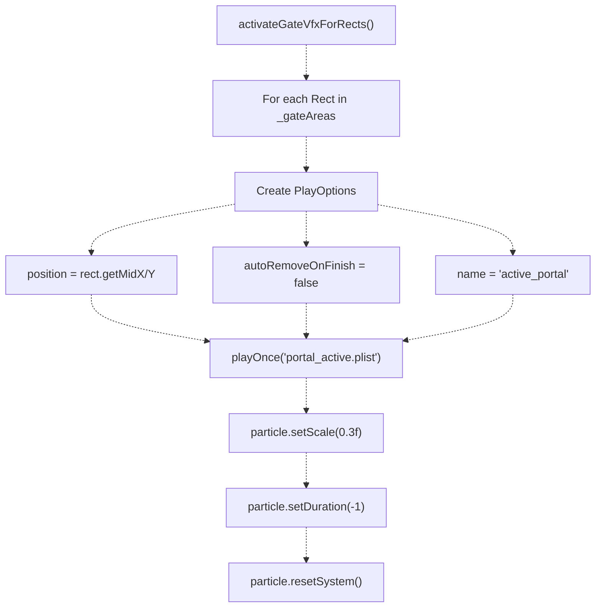

**来源：** [Classes/Scenes/LevelMap.cpp L408-L433](https://github.com/lilong555/Adventure-King/blob/60df0f40/Classes/Scenes/LevelMap.cpp#L408-L433)

### 胜利横幅（Victory Banner）

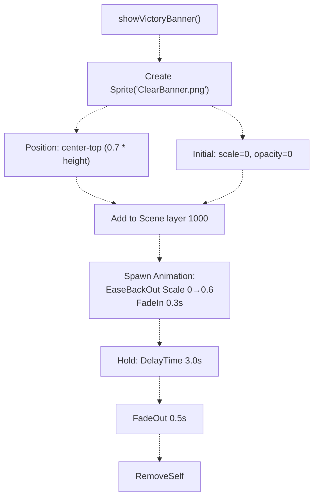

**来源：** [Classes/Scenes/LevelMap.cpp L484-L507](https://github.com/lilong555/Adventure-King/blob/60df0f40/Classes/Scenes/LevelMap.cpp#L484-L507)

---

## 传送门交互系统

### 交互判定

`isPointAtGate()` 会强制要求“关卡已清理”后传送门才可交互：

| 步骤 | 代码 | 行为 |
| --- | --- | --- |
| 1 | `if (!_isLevelCleared) return false;` | 未清理时禁止交互 |
| 2 | `if (_gateAreas.empty()) return false;` | 没有门区就不交互 |
| 3 | `for (const auto& gateRect : _gateAreas)` | 遍历门区矩形 |
| 4 | `if (gateRect.containsPoint(worldPos)) return true;` | 玩家进入门区则可交互 |

**来源：** [Classes/Scenes/LevelMap.cpp L391-L404](https://github.com/lilong555/Adventure-King/blob/60df0f40/Classes/Scenes/LevelMap.cpp#L391-L404)

### 输入绑定

`GameInputController` 通过 gateQuery 轮询门区状态，命中后执行 gateEnter：

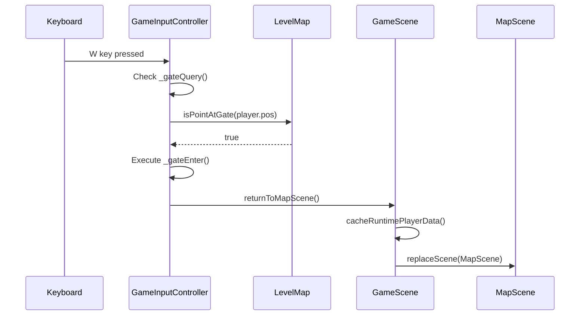

**来源：** [Classes/Scenes/GameInputController.cpp L267-L274](https://github.com/lilong555/Adventure-King/blob/60df0f40/Classes/Scenes/GameInputController.cpp#L267-L274)

 [Classes/Scenes/GameScene.cpp L552-L557](https://github.com/lilong555/Adventure-King/blob/60df0f40/Classes/Scenes/GameScene.cpp#L552-L557)

 [Classes/Scenes/GameScene.cpp L745-L767](https://github.com/lilong555/Adventure-King/blob/60df0f40/Classes/Scenes/GameScene.cpp#L745-L767)

---

## 存/读档集成

### 存档数据结构

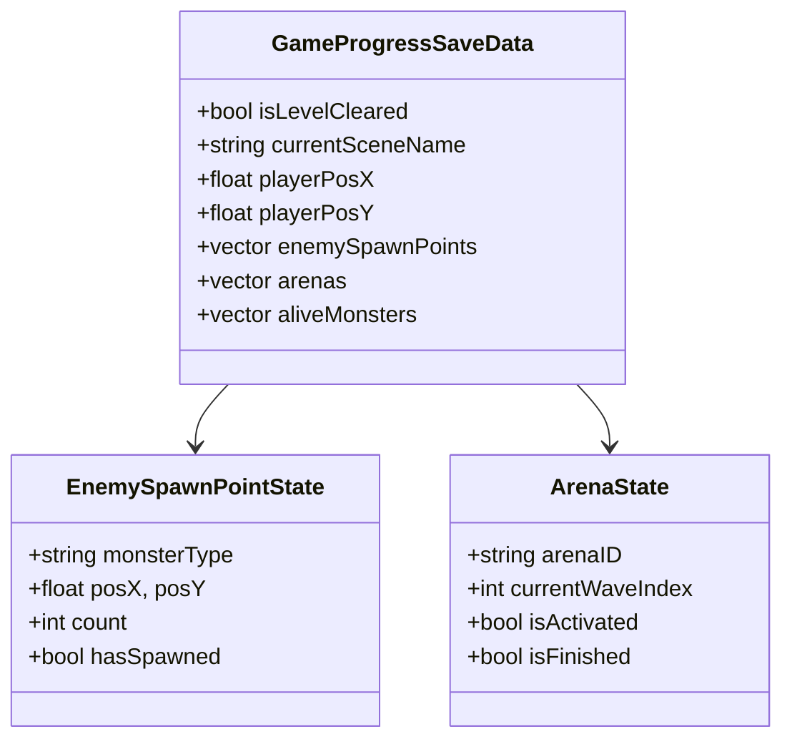

**来源：** [Classes/Save/SaveData.h L109-L168](https://github.com/lilong555/Adventure-King/blob/60df0f40/Classes/Save/SaveData.h#L109-L168)

### 存档写入

存档时，`GameScene::fillProgressDataForSave()` 会把清理状态写入 `GameProgressSaveData`：

```cpp
outProgress.isLevelCleared = (_levelMap != nullptr) ? _levelMap->isLevelCleared() : false;
```

**来源：** [Classes/Scenes/GameScene.cpp L328-L389](https://github.com/lilong555/Adventure-King/blob/60df0f40/Classes/Scenes/GameScene.cpp#L328-L389)

### 读档恢复

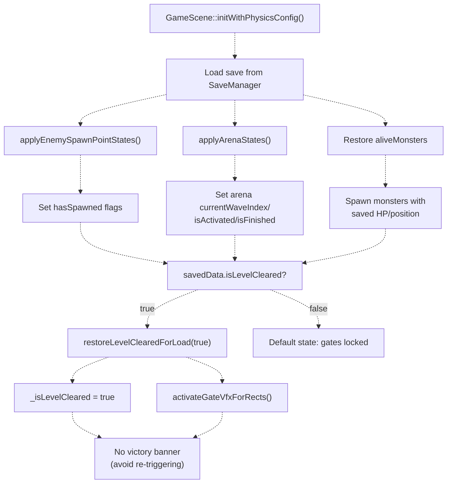

**来源：** [Classes/Scenes/GameScene.cpp L198-L306](https://github.com/lilong555/Adventure-King/blob/60df0f40/Classes/Scenes/GameScene.cpp#L198-L306)

 [Classes/Scenes/LevelMap.cpp L435-L447](https://github.com/lilong555/Adventure-King/blob/60df0f40/Classes/Scenes/LevelMap.cpp#L435-L447)

### 旧版存档兼容（字段缺失推断）

旧存档如果缺少 `isLevelCleared` 字段，系统会根据“当前世界状态”推断是否应视为已清理，避免出现“旧版本已通关但读档后门被锁住”的体验问题。

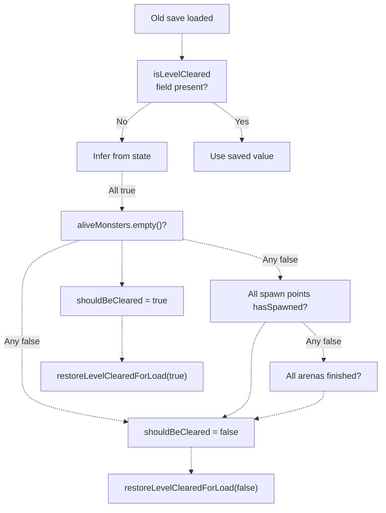

**来源：** [Classes/Scenes/GameScene.cpp L277-L303](https://github.com/lilong555/Adventure-King/blob/60df0f40/Classes/Scenes/GameScene.cpp#L277-L303)

---

## 与自动存档的集成

关卡清理状态会通过自动存档系统被持续写入：

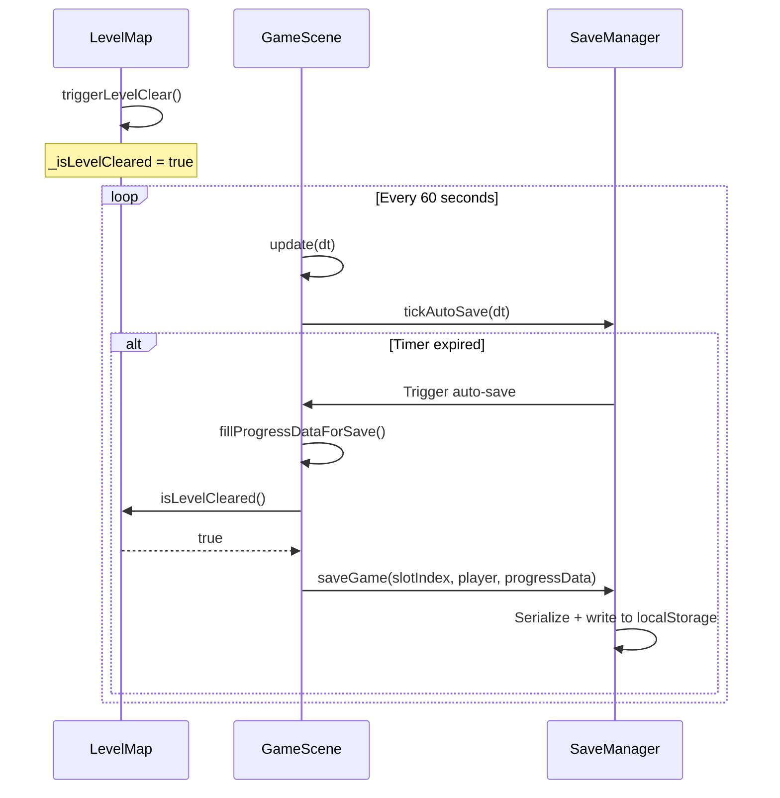

由于 `isLevelCleared` 会被写入每一次 `GameProgressSaveData`，清理状态会被手动存档与 60 秒自动存档一并捕获。这保证玩家清理完关卡后可以安全退出而不丢进度。

**来源：** [Classes/Scenes/GameScene.cpp L935-L1011](https://github.com/lilong555/Adventure-King/blob/60df0f40/Classes/Scenes/GameScene.cpp#L935-L1011)

 [Classes/Save/SaveManager.cpp L49-L80](https://github.com/lilong555/Adventure-King/blob/60df0f40/Classes/Save/SaveManager.cpp#L49-L80)

---

## 关键代码实体

### LevelMap 方法

| 方法 | 签名 | 用途 |
| --- | --- | --- |
| `finalizeInitialState()` | `void finalizeInitialState()` | 根据战斗配置决定初始是否清理完成 |
| `onMonsterKilled()` | `void onMonsterKilled()` | 递减存活计数并检查是否完成 |
| `checkAllClear()` | `bool checkAllClear()` | 评估是否满足全部清理条件 |
| `triggerLevelClear()` | `void triggerLevelClear()` | 执行胜利序列并解锁传送门 |
| `showVictoryBanner()` | `void showVictoryBanner()` | 播放胜利 UI 动画 |
| `isPointAtGate()` | `bool isPointAtGate(const Vec2&) const` | 判断某点是否在门区且关卡已清理 |
| `restoreLevelClearedForLoad()` | `void restoreLevelClearedForLoad(bool cleared)` | 读档恢复清理状态（不播放 banner） |

**来源：** [Classes/Scenes/LevelMap.h L78-L83](https://github.com/lilong555/Adventure-King/blob/60df0f40/Classes/Scenes/LevelMap.h#L78-L83)

 [Classes/Scenes/LevelMap.cpp L71-L507](https://github.com/lilong555/Adventure-King/blob/60df0f40/Classes/Scenes/LevelMap.cpp#L71-L507)

### GameScene 方法

| 方法 | 签名 | 用途 |
| --- | --- | --- |
| `fillProgressDataForSave()` | `void fillProgressDataForSave(GameProgressSaveData&) const` | 存档时提取清理状态 |
| `returnToMapScene()` | `void returnToMapScene()` | 缓存玩家数据并切换回地图 |

**来源：** [Classes/Scenes/GameScene.h L66-L69](https://github.com/lilong555/Adventure-King/blob/60df0f40/Classes/Scenes/GameScene.h#L66-L69)

 [Classes/Scenes/GameScene.cpp L328-L389](https://github.com/lilong555/Adventure-King/blob/60df0f40/Classes/Scenes/GameScene.cpp#L328-L389)

 [Classes/Scenes/GameScene.cpp L745-L767](https://github.com/lilong555/Adventure-King/blob/60df0f40/Classes/Scenes/GameScene.cpp#L745-L767)

### 存档字段

| 字段 | 类型 | 文件 |
| --- | --- | --- |
| `GameProgressSaveData::isLevelCleared` | `bool` | [Classes/Save/SaveData.h L122](https://github.com/lilong555/Adventure-King/blob/60df0f40/Classes/Save/SaveData.h#L122-L122) |
| `LevelMap::_isLevelCleared` | `bool` | [Classes/Scenes/LevelMap.h L195](https://github.com/lilong555/Adventure-King/blob/60df0f40/Classes/Scenes/LevelMap.h#L195-L195) |
| `LevelMap::_currentActiveMonsters` | `int` | [Classes/Scenes/LevelMap.h L194](https://github.com/lilong555/Adventure-King/blob/60df0f40/Classes/Scenes/LevelMap.h#L194-L194) |
| `LevelMap::_pendingEnemySpawnPoints` | `size_t` | [Classes/Scenes/LevelMap.h L191](https://github.com/lilong555/Adventure-King/blob/60df0f40/Classes/Scenes/LevelMap.h#L191-L191) |
