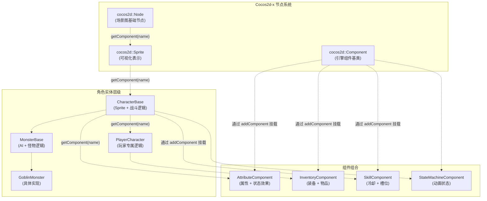
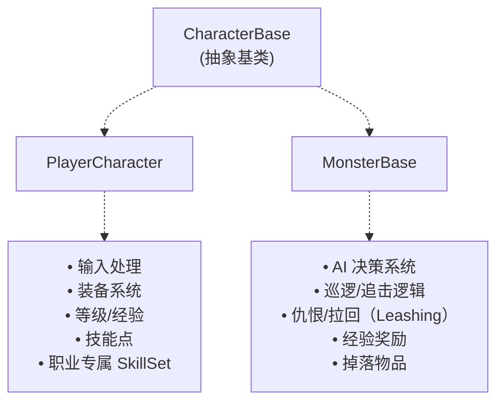
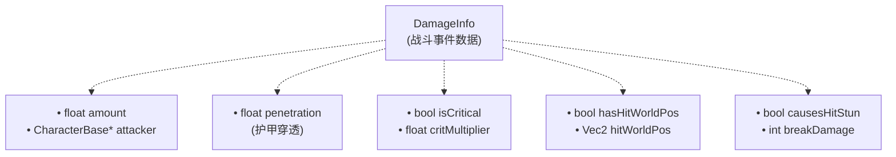
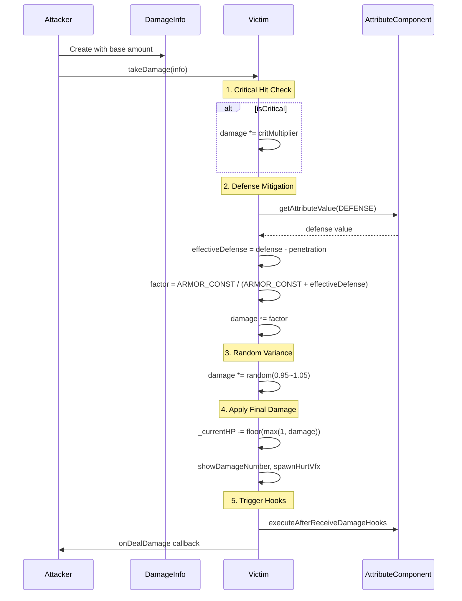
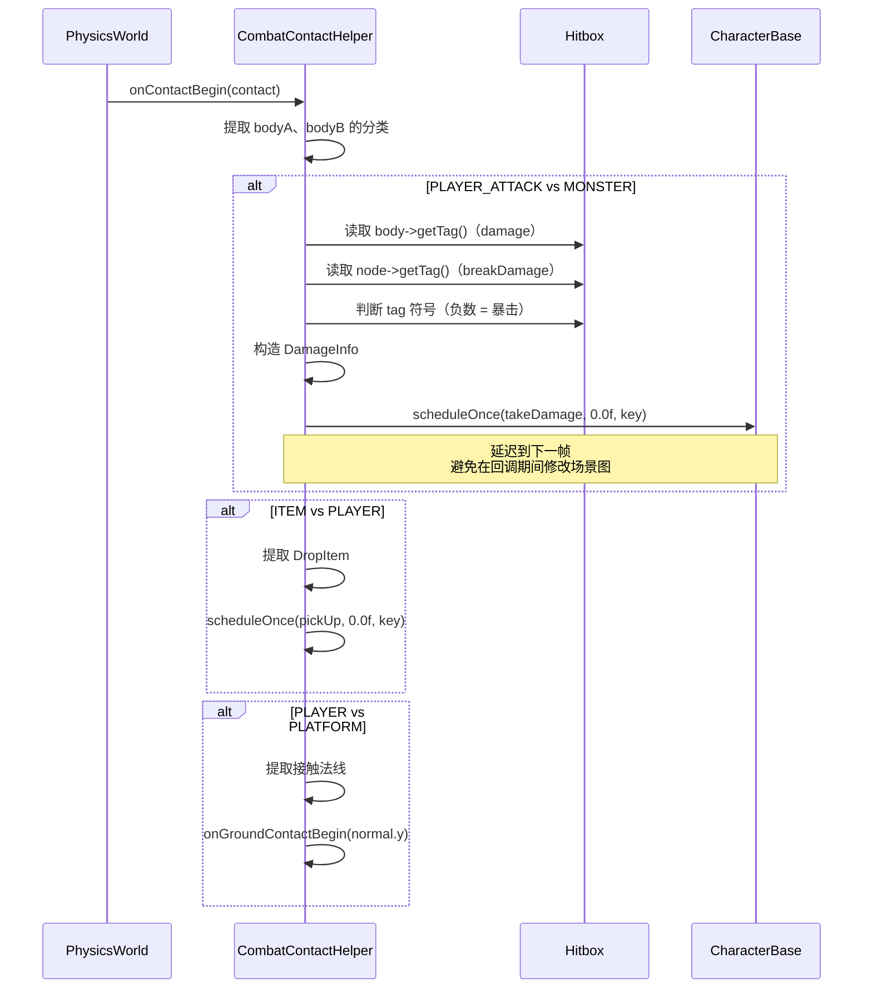
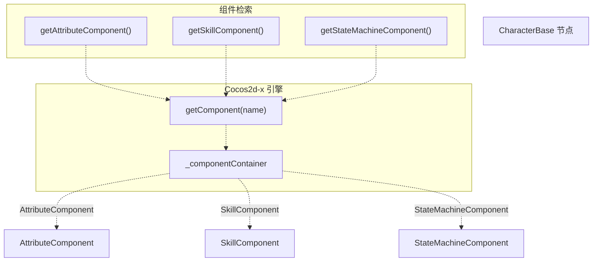
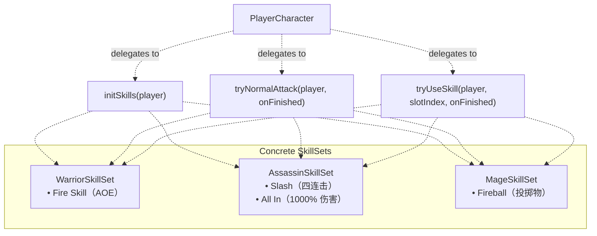
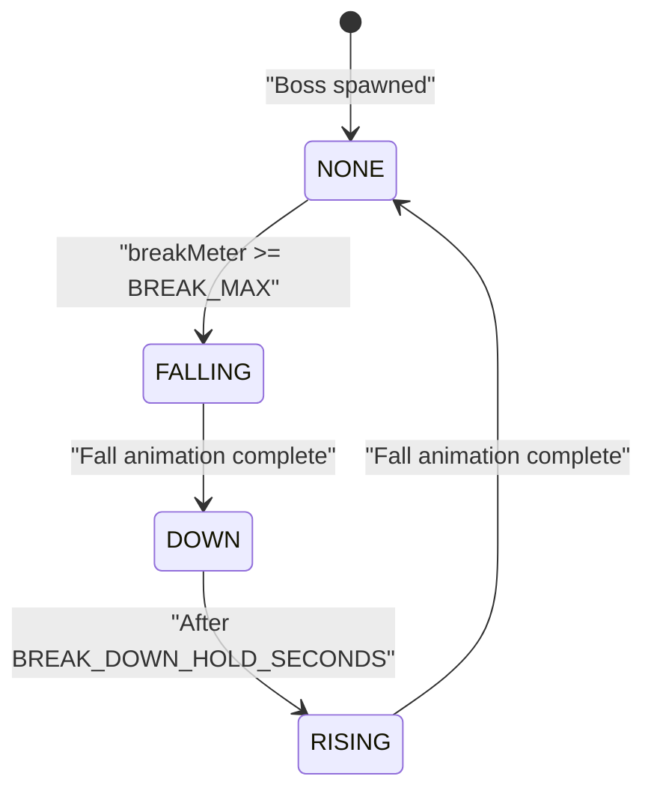
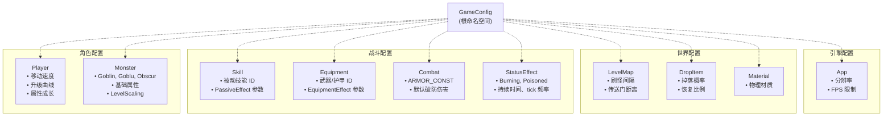
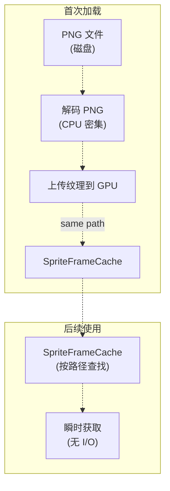

# 关键概念与术语

> **相关源文件**
> * [Adventure-King/Classes/Character/Base/CharacterBase.cpp](https://github.com/lilong555/Adventure-King/blob/60df0f40/Adventure-King/Classes/Character/Base/CharacterBase.cpp)
> * [Adventure-King/Classes/Character/Base/CharacterBase.h](https://github.com/lilong555/Adventure-King/blob/60df0f40/Adventure-King/Classes/Character/Base/CharacterBase.h)
> * [Adventure-King/Classes/Character/Monster/Monsters/GobluMonster.cpp](https://github.com/lilong555/Adventure-King/blob/60df0f40/Adventure-King/Classes/Character/Monster/Monsters/GobluMonster.cpp)
> * [Adventure-King/Classes/Character/Monster/Monsters/GobluMonster.h](https://github.com/lilong555/Adventure-King/blob/60df0f40/Adventure-King/Classes/Character/Monster/Monsters/GobluMonster.h)
> * [Adventure-King/Classes/Character/Player/SkillSets/AssassinSkillSet.cpp](https://github.com/lilong555/Adventure-King/blob/60df0f40/Adventure-King/Classes/Character/Player/SkillSets/AssassinSkillSet.cpp)
> * [Adventure-King/Classes/Character/Player/SkillSets/WarriorSkillSet.cpp](https://github.com/lilong555/Adventure-King/blob/60df0f40/Adventure-King/Classes/Character/Player/SkillSets/WarriorSkillSet.cpp)
> * [Adventure-King/Classes/Configs/GameConfig.h](https://github.com/lilong555/Adventure-King/blob/60df0f40/Adventure-King/Classes/Configs/GameConfig.h)
> * [Adventure-King/Classes/Scenes/CombatContactHelper.cpp](https://github.com/lilong555/Adventure-King/blob/60df0f40/Adventure-King/Classes/Scenes/CombatContactHelper.cpp)
> * [Adventure-King/Classes/UI/BossHealthBar.cpp](https://github.com/lilong555/Adventure-King/blob/60df0f40/Adventure-King/Classes/UI/BossHealthBar.cpp)
> * [Adventure-King/Classes/UI/BossHealthBar.h](https://github.com/lilong555/Adventure-King/blob/60df0f40/Adventure-King/Classes/UI/BossHealthBar.h)

## 目的与范围

本页定义 Adventure-King 代码库中贯穿全局的基础概念、类、设计模式与术语，用于帮助理解各系统如何互相连接，以及代码实体如何映射到玩法概念。若要查看特定系统的细节实现，请参阅对应页面：场景管理（[#2](https://github.com/lilong555/Adventure-King/blob/60df0f40/#2)

）、角色系统（[#3](https://github.com/lilong555/Adventure-King/blob/60df0f40/#3)

）、持久化（[#6](https://github.com/lilong555/Adventure-King/blob/60df0f40/#6)

）与配置（[#7](https://github.com/lilong555/Adventure-King/blob/60df0f40/#7)

）。

---

## 架构概览

Adventure-King 基于 Cocos2d-x 引擎，采用 **基于组件（component-based）** 的架构。游戏对角色实体使用“组合优于继承”，战斗基于物理接触事件驱动，并集中管理配置常量。

### 基于组件的实体系统



**来源：** [Adventure-King/Classes/Character/Base/CharacterBase.h L1-L201](https://github.com/lilong555/Adventure-King/blob/60df0f40/Adventure-King/Classes/Character/Base/CharacterBase.h#L1-L201)

 [Adventure-King/Classes/Character/Base/CharacterBase.cpp L28-L62](https://github.com/lilong555/Adventure-King/blob/60df0f40/Adventure-King/Classes/Character/Base/CharacterBase.cpp#L28-L62)

---

## 核心角色类

### CharacterBase（角色基类）

| 职责 | 相关接口/字段 |
| --- | --- |
| 生命/法力管理（Health/Mana） | `_currentHP`, `_currentMP`, `setCurrentHP()`, `setCurrentMP()` |
| 伤害处理（Damage Processing） | `takeDamage(DamageInfo)`, `heal(float)` |
| 死亡处理（Death Handling） | `die()`, `isDead()`, `_autoRemoveOnDeath` |
| 组件访问（Component Access） | `getAttributeComponent()`, `getSkillComponent()`, `getStateMachineComponent()` |
| 伤害回调（Damage Callbacks） | `onDealDamage()`, `onReceiveDamage()`（虚函数钩子） |
| 视觉反馈（Visual Feedback） | `showDamageNumber()`, `spawnHurtVfx()`, `_damageNumbersEnabled` |

**来源：** [Adventure-King/Classes/Character/Base/CharacterBase.h L30-L201](https://github.com/lilong555/Adventure-King/blob/60df0f40/Adventure-King/Classes/Character/Base/CharacterBase.h#L30-L201)

 [Adventure-King/Classes/Character/Base/CharacterBase.cpp L28-L558](https://github.com/lilong555/Adventure-King/blob/60df0f40/Adventure-King/Classes/Character/Base/CharacterBase.cpp#L28-L558)

### PlayerCharacter 与 MonsterBase 对比



**来源：** [Adventure-King/Classes/Character/Base/CharacterBase.h L30-L201](https://github.com/lilong555/Adventure-King/blob/60df0f40/Adventure-King/Classes/Character/Base/CharacterBase.h#L30-L201)

---

## 战斗系统数据结构

### DamageInfo 结构

`DamageInfo` 结构体封装了一次伤害事件的全部信息，用于从攻击者传递给受击者。



| 字段 | 类型 | 用途 |
| --- | --- | --- |
| `amount` | `float` | 减伤前的基础伤害 |
| `attacker` | `CharacterBase*` | 伤害来源（用于吸血、反伤等） |
| `penetration` | `float` | 护甲穿透（降低有效防御） |
| `isCritical` | `bool` | 是否暴击 |
| `critMultiplier` | `float` | 暴击倍率（默认 1.5x） |
| `hasHitWorldPos` | `bool` | 是否提供命中位置 |
| `hitWorldPos` | `Vec2` | 命中世界坐标（用于特效方向等） |
| `causesHitStun` | `bool` | 是否触发受击僵直动画（DOT 为 false） |
| `breakDamage` | `int` | 对 Boss 破防条（Break Meter）的贡献 |

**来源：** [Adventure-King/Classes/Character/Base/CharacterBase.h L16-L28](https://github.com/lilong555/Adventure-King/blob/60df0f40/Adventure-King/Classes/Character/Base/CharacterBase.h#L16-L28)

### 伤害计算流水线



**公式：** 防御减伤使用 `ARMOR_CONST / (ARMOR_CONST + effectiveDefense)`，其中 `ARMOR_CONST = 100.0f`（[GameConfig.h L661](https://github.com/lilong555/Adventure-King/blob/60df0f40/GameConfig.h#L661-L661)

）。

**来源：** [Adventure-King/Classes/Character/Base/CharacterBase.cpp L148-L248](https://github.com/lilong555/Adventure-King/blob/60df0f40/Adventure-King/Classes/Character/Base/CharacterBase.cpp#L148-L248)

 [Adventure-King/Classes/Configs/GameConfig.h L659-L665](https://github.com/lilong555/Adventure-King/blob/60df0f40/Adventure-King/Classes/Configs/GameConfig.h#L659-L665)

---

## 物理与接触系统

### GamePhysicsCategory（物理分类枚举）

物理分类（physics category）通过位掩码定义碰撞分组。系统使用 Cocos2d-x `PhysicsBody` 的 category/collision/contact 位掩码来做过滤。

| 分类 | 位掩码 | 用途 |
| --- | --- | --- |
| `PLAYER` | `1 << 0` | 玩家角色本体 |
| `MONSTER` | `1 << 1` | 怪物角色本体 |
| `PLATFORM` | `1 << 2` | 可行走地面/平台 |
| `COLLISION` | `1 << 3` | 墙体与障碍物 |
| `PLAYER_ATTACK` | `1 << 4` | 玩家命中框（近战/技能） |
| `MONSTER_ATTACK` | `1 << 5` | 怪物命中框 |
| `BOMB` | `1 << 6` | 投射物（炸弹、火球等） |
| `ITEM` | `1 << 7` | 可拾取物（血/蓝药等） |
| `GATE` | `1 << 8` | 关卡切换触发区 |

**辅助函数：** `ToMask(GamePhysicsCategory)` 将 enum 转为位掩码。

**来源：** [Adventure-King/Classes/Configs/GamePhysicsCategory.h](https://github.com/lilong555/Adventure-King/blob/60df0f40/Adventure-King/Classes/Configs/GamePhysicsCategory.h)

（在 [GobluMonster.cpp L204-L209](https://github.com/lilong555/Adventure-King/blob/60df0f40/GobluMonster.cpp#L204-L209)

 中被引用）

### 接触处理流程



**关键模式：** 所有会修改状态的逻辑（应用伤害、拾取物品、死亡等）都会使用 `scheduleOnce` **延迟到下一帧执行**，以避免在物理回调中修改场景图导致崩溃。

**来源：** [Adventure-King/Classes/Scenes/CombatContactHelper.cpp L27-L215](https://github.com/lilong555/Adventure-King/blob/60df0f40/Adventure-King/Classes/Scenes/CombatContactHelper.cpp#L27-L215)

---

## 组件系统细节

### 组件访问模式

组件通过 Cocos2d-x 组件系统挂到 `CharacterBase` 上，并通过名字字符串检索。



**示例：**

```
// Character/Base/CharacterBase.cpp:31-34
AttributeComponent* CharacterBase::getAttributeComponent()
{
    return static_cast<AttributeComponent*>(this->getComponent("AttributeComponent"));
}
```

**来源：** [Adventure-King/Classes/Character/Base/CharacterBase.cpp L31-L62](https://github.com/lilong555/Adventure-King/blob/60df0f40/Adventure-King/Classes/Character/Base/CharacterBase.cpp#L31-L62)

### AttributeComponent 职责

| 功能 | 说明 |
| --- | --- |
| **属性存储** | Base + Bonus + Equipment = Final attributes |
| **状态效果** | Burning、Poisoned、Excited（按 tick 结算的 DOT/buff） |
| **装备特效** | Thorns Armor（反伤）、Emergency Mask（低血回复） |
| **被动技能** | Bloodthirst（吸血）、Ember Mark（命中施加燃烧） |
| **钩子** | `afterReceiveDamage`、`afterDealDamage` 触发机制 |

**来源：** 由 [CharacterBase.cpp L202-L223](https://github.com/lilong555/Adventure-King/blob/60df0f40/CharacterBase.cpp#L202-L223)

 与 [GameConfig.h L28-L153](https://github.com/lilong555/Adventure-King/blob/60df0f40/GameConfig.h#L28-L153)

 推断

### SkillComponent 职责

| 功能 | 说明 |
| --- | --- |
| **技能存储** | `_learnedSkills`（已学习技能全集）、`_activeSlots`（装备到槽位的技能） |
| **冷却管理** | `currentCooldown` 倒计时，`useActiveSkill()` 做检查 |
| **技能类型** | `ActiveSkill`（手动施放）、`PassiveSkill`（常驻生效） |
| **槽位系统** | 固定槽位（0-3）映射到按键（E/K、Q/J 等） |

**来源：** 由 [WarriorSkillSet.cpp L263-L296](https://github.com/lilong555/Adventure-King/blob/60df0f40/WarriorSkillSet.cpp#L263-L296)

 [AssassinSkillSet.cpp L41-L85](https://github.com/lilong555/Adventure-King/blob/60df0f40/AssassinSkillSet.cpp#L41-L85)

 推断

---

## 技能系统架构

### SkillSet 模式

具体技能实现被隔离在按职业区分的 “SkillSet” 类中，这些类实现 `initSkills()`、`tryNormalAttack()` 与 `tryUseSkill()`。



**来源：** [Adventure-King/Classes/Character/Player/SkillSets/WarriorSkillSet.cpp L261-L468](https://github.com/lilong555/Adventure-King/blob/60df0f40/Adventure-King/Classes/Character/Player/SkillSets/WarriorSkillSet.cpp#L261-L468)

 [Adventure-King/Classes/Character/Player/SkillSets/AssassinSkillSet.cpp L41-L310](https://github.com/lilong555/Adventure-King/blob/60df0f40/Adventure-King/Classes/Character/Player/SkillSets/AssassinSkillSet.cpp#L41-L310)

### 主动技能 vs 被动技能

| 技能类型 | 存储位置 | 激活方式 | 示例 |
| --- | --- | --- | --- |
| **ActiveSkill** | `SkillComponent::_activeSlots` | 通过 `useActiveSkill(slotIndex)` 手动施放 | Fire Skill、Slash、All In |
| **PassiveSkill** | `SkillComponent::_learnedSkills` | 常驻生效、无冷却 | Bloodthirst（吸血）、Ember Mark（命中燃烧） |

**关键字段：**

* `int id` - 唯一标识（定义在 `GameConfig::Skill::Passive` 命名空间）
* `std::string name` - 显示名称
* `float manaCost` - 主动技能 MP 消耗
* `float cooldown` - 主动技能冷却时长
* `int breakDamage` - 对 Boss 破防条的贡献

**来源：** 由 [AssassinSkillSet.cpp L50-L84](https://github.com/lilong555/Adventure-King/blob/60df0f40/AssassinSkillSet.cpp#L50-L84)

 [GameConfig.h L34-L68](https://github.com/lilong555/Adventure-King/blob/60df0f40/GameConfig.h#L34-L68)

 推断

---

## Boss 机制

### 破防条（Break Meter）系统

像 `GobluMonster` 这样的 Boss 使用 **破防条（break meter）** 替代传统受击僵直（hitstun）。当破防条充满时，Boss 会进入 “fall → down → rise” 的流程。



**破防伤害来源：**

* 普攻：`GameConfig::Combat::BREAK_DAMAGE_NORMAL = 1`
* 技能：每个技能定义 `breakDamage`（例如 Fire Skill = 3，Slash 每段命中 = 1）
* 投射物：按技能配置（例如 Fireball = 3）

**来源：** [Adventure-King/Classes/Character/Monster/Monsters/GobluMonster.cpp L412-L511](https://github.com/lilong555/Adventure-King/blob/60df0f40/Adventure-King/Classes/Character/Monster/Monsters/GobluMonster.cpp#L412-L511)

 [Adventure-King/Classes/Character/Monster/Monsters/GobluMonster.h L54-L68](https://github.com/lilong555/Adventure-King/blob/60df0f40/Adventure-King/Classes/Character/Monster/Monsters/GobluMonster.h#L54-L68)

### BossHealthBar 集成

`BossHealthBar` 组件显示 Boss 的 HP、破防条，以及连击伤害统计。

| 功能 | 实现 |
| --- | --- |
| **HP 条** | 从 `AttributeComponent` 读取 `getCurrentHP()` 与 `MAX_HP` |
| **破防条** | 读取 `getBreakMeter()`、`getBreakMax()`（虚函数） |
| **连击伤害** | 消耗 `consumePendingUiNonDotDamage()`（1 秒窗口） |
| **命中动画** | 仅由非 DOT 伤害触发（`causesHitStun = true`） |

**DOT 排除：** Burning/Poisoned 等状态效果会设置 `causesHitStun = false`，以避免血条抖动/连击累计。

**来源：** [Adventure-King/Classes/UI/BossHealthBar.cpp L256-L344](https://github.com/lilong555/Adventure-King/blob/60df0f40/Adventure-King/Classes/UI/BossHealthBar.cpp#L256-L344)

 [Adventure-King/Classes/Character/Base/CharacterBase.cpp L250-L271](https://github.com/lilong555/Adventure-King/blob/60df0f40/Adventure-King/Classes/Character/Base/CharacterBase.cpp#L250-L271)

---

## 配置系统

### GameConfig 命名空间结构

所有游戏常量都集中在 `GameConfig.h` 中，以 C++ 命名空间组织。系统在运行时读取配置（不写入）。



**读取模式：**

```python
// 来自 GoblinMonster 初始化的示例
namespace Conf = GameConfig::Monster::Goblin;
base.set(AttributeType::STRENGTH, Conf::STRENGTH);
base.set(AttributeType::MOVE_SPEED, Conf::MOVE_SPEED);
```

**设计动机：** 集中管理带来：

* 单文件改平衡（无需在多个系统里找分散常量）
* 仅对 `GameConfig.h` 有编译期依赖
* 易检索（便于查“这个数值在哪里定义”）

**来源：** [Adventure-King/Classes/Configs/GameConfig.h L1-L717](https://github.com/lilong555/Adventure-King/blob/60df0f40/Adventure-King/Classes/Configs/GameConfig.h#L1-L717)

---

## 存档系统术语

### 运行时缓存 vs 持久化存储

存档系统采用 **双路径（dual-path）架构**：

| 存储层 | 范围 | 生命周期 | 用途 |
| --- | --- | --- | --- |
| **运行时缓存** | `SaveManager::runtimePlayerData` | 当前会话 | 场景切换零延迟 |
| **持久化存档槽** | `SaveManager::SaveSlotData[5]` | 永久 | 可持续存/读档 |
| **localStorage** | SQLite 键值存储 | 永久 | 主存储后端 |
| **JSON 文件** | 原子写入 | 永久 | 备份/旧格式 |

**场景切换流程：**

1. 离开场景 → 缓存运行时数据（不做磁盘 I/O）
2. 进入场景 → 消费缓存数据，然后清空缓存
3. 手动存档 → 将当前状态写入存档槽 + 存储后端

**来源：** 由示意图 5 与存档系统概览推断

### SaveSlotData 结构

每个存档槽包含：

| 字段 | 类型 | 内容 |
| --- | --- | --- |
| `playerData` | `PlayerSaveData` | 等级、XP、HP/MP、属性、装备、技能 |
| `progressData` | `GameProgressSaveData` | 刷怪状态、竞技场状态、当前场景 ID |
| `position` | `Vec2` | 玩家世界坐标 |
| `timestamp` | `long long` | 最近存档时间（用于云端合并） |

**来源：** 由示意图 5 与存档系统概览推断

---

## 动画系统

### 动画缓存策略

Adventure-King 使用 Cocos2d-x 的 `AnimationCache` 与 `SpriteFrameCache` 来避免重复解码/加载。



**辅助函数：** `SpriteFrameCacheHelper::getOrCreateSpriteFrame(path)`

* 先查缓存
* 若缺失且路径像文件，则加载并写入缓存
* 返回 `SpriteFrame*` 或 `nullptr`

**动画注册：**

```javascript
// 来自 GobluMonster.cpp:82-109 的示例
void ensureOneShotAnimationCached(const std::string& key,
                                  const std::string& formatStr,
                                  int frameCount,
                                  float delay)
{
    auto cache = AnimationCache::getInstance();
    if (cache->getAnimation(key)) return; // Already cached
    
    Vector<SpriteFrame*> frames;
    for (int i = 1; i <= frameCount; ++i)
    {
        std::string path = StringUtils::format(formatStr.c_str(), i);
        auto frame = SpriteFrameCacheHelper::getOrCreateSpriteFrame(path);
        if (frame) frames.pushBack(frame);
    }
    
    auto anim = Animation::createWithSpriteFrames(frames, delay);
    cache->addAnimation(anim, key);
}
```

**来源：** [Adventure-King/Classes/Character/Monster/Monsters/GobluMonster.cpp L79-L110](https://github.com/lilong555/Adventure-King/blob/60df0f40/Adventure-King/Classes/Character/Monster/Monsters/GobluMonster.cpp#L79-L110)

### 状态驱动动画

`StateMachineComponent` 将 `CharacterState` 枚举值映射到动画 key。

| CharacterState | 动画 Key 示例 | 循环行为 |
| --- | --- | --- |
| `IDLE` | `"goblu_idle"` | 单帧（静态姿势） |
| `WALKING` | `"goblu_walk"` | 循环（4 帧） |
| `ATTACKING` | （未注册） | 停止状态动画，允许一次性技能动画 |
| `HURT` | `"goblu_hurt"` | 单帧（闪烁效果） |
| `DEAD` | `"goblu_death"` | 一次性（6 帧，淡出） |

**自定义状态（Goblu）：**

* 破防倒地：`"goblu_break_fall"`（3 帧，停在 fall_3）
* 破防起身：`"goblu_break_rise"`（3 帧，返回 idle）

**来源：** [Adventure-King/Classes/Character/Monster/Monsters/GobluMonster.cpp L268-L300](https://github.com/lilong555/Adventure-King/blob/60df0f40/Adventure-King/Classes/Character/Monster/Monsters/GobluMonster.cpp#L268-L300)

---

## 关键设计模式

### 事件驱动战斗

战斗使用 **延迟执行（deferred execution）** 来避免在物理回调期间修改场景图：

```cpp
// 模式：带唯一 key 的 scheduleOnce
std::string key = StringUtils::format("defer_player_dmg_%p_%p",
                                      static_cast<void*>(attackBody),
                                      static_cast<void*>(monster));
if (!monster->isScheduled(key))
{
    monster->scheduleOnce(
        [monster, dmg](float)
        {
            if (!monster || monster->isDead())
            {
                return;
            }
            monster->takeDamage(dmg);
        },
        0.0f,
        key);
}
```

**原因：** Cocos2d-x 的物理回调发生在 `PhysicsWorld::step()` 期间；此时移除节点或修改物理体会导致崩溃。延迟到下一帧可确保物理处理结束后再修改状态。

**来源：** [Adventure-King/Classes/Scenes/CombatContactHelper.cpp L101-L121](https://github.com/lilong555/Adventure-King/blob/60df0f40/Adventure-King/Classes/Scenes/CombatContactHelper.cpp#L101-L121)

 [Adventure-King/Classes/Scenes/CombatContactHelper.cpp L196-L209](https://github.com/lilong555/Adventure-King/blob/60df0f40/Adventure-King/Classes/Scenes/CombatContactHelper.cpp#L196-L209)

### 组合优于继承

角色通过 **组件组合** 而不是深层继承树来组织能力：

* ✅ `CharacterBase` + `AttributeComponent` + `SkillComponent`
* ❌ `CharacterBase` → `AttributeCharacter` → `SkillableCharacter` → `PlayerCharacter`

**收益：**

* 新增特性（如 `StatusEffectVfxComponent`）无需修改基类
* 可替换实现（不同怪物类型可采用不同 AI 组件）
* 更易测试（可单独 mock 某个组件）

**来源：** [Adventure-King/Classes/Character/Base/CharacterBase.cpp L31-L62](https://github.com/lilong555/Adventure-King/blob/60df0f40/Adventure-King/Classes/Character/Base/CharacterBase.cpp#L31-L62)

### 集中式配置

所有平衡数值都放在 `GameConfig.h`：

* ✅ 单一事实来源，易定位、易修改
* ✅ 编译期常量（无运行时解析开销）
* ❌ 改动需要重新编译（可接受的权衡）

**来源：** [Adventure-King/Classes/Configs/GameConfig.h L1-L717](https://github.com/lilong555/Adventure-King/blob/60df0f40/Adventure-King/Classes/Configs/GameConfig.h#L1-L717)

---

## 术语速查

| 术语 | 定义 |
| --- | --- |
| **Hitbox（命中框）** | 用于伤害检测的临时物理体（生命周期约 0.1s） |
| **Break Meter（破防条）** | Boss 专属体力条；被命中时累积，满后触发倒地/硬直流程 |
| **DOT** | 持续伤害（Burning、Poisoned）；设置 `causesHitStun = false` |
| **Combat Layer** | 包含全部角色/投射物的父节点（用于坐标变换） |
| **Runtime Cache** | 场景切换用的内存态缓存（用后清空） |
| **SkillSet** | 职业专属的技能行为类（Warrior、Assassin、Mage） |
| **Component Hooks** | 伤害事件期间触发的回调（`afterReceiveDamage`、`afterDealDamage`） |
| **Physics Category** | 定义碰撞组的位掩码（PLAYER、MONSTER、PLATFORM 等） |
| **Active Slot** | 绑定到按键的技能槽（0-3 槽映射到 E/K、Q/J 等） |
| **属性类型（Attribute Type）** | 角色属性枚举（MAX_HP、STRENGTH、DEFENSE、MOVE_SPEED 等） |

**来源：** 汇总自上述各节
