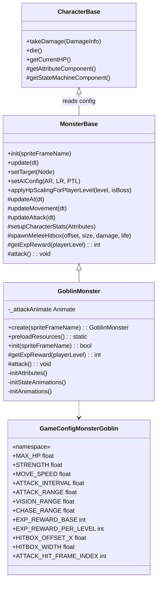
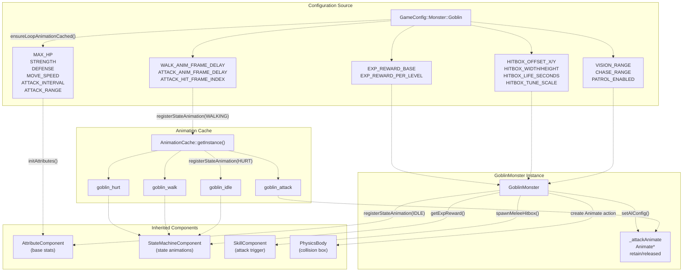
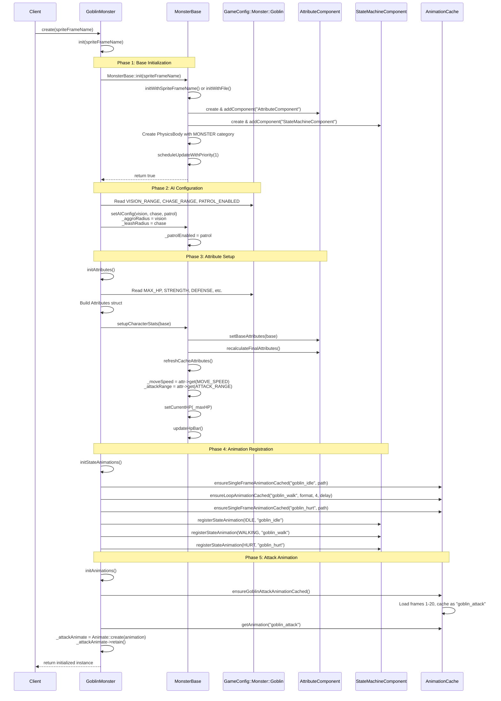
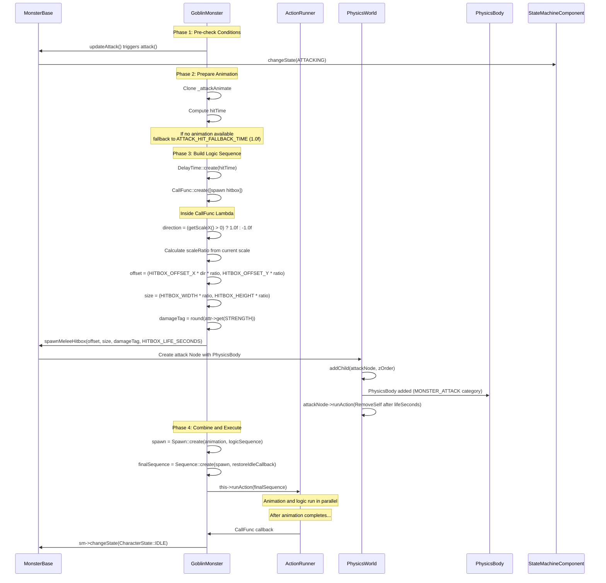

# 具体怪物类型

> **相关源文件**
> * [Adventure-King/Classes/Character/Base/CharacterData.h](https://github.com/lilong555/Adventure-King/blob/60df0f40/Adventure-King/Classes/Character/Base/CharacterData.h)
> * [Adventure-King/Classes/Character/Monster/MonsterBase.cpp](https://github.com/lilong555/Adventure-King/blob/60df0f40/Adventure-King/Classes/Character/Monster/MonsterBase.cpp)
> * [Adventure-King/Classes/Character/Monster/MonsterBase.h](https://github.com/lilong555/Adventure-King/blob/60df0f40/Adventure-King/Classes/Character/Monster/MonsterBase.h)
> * [Adventure-King/Classes/Character/Monster/Monsters/GoblinMonster.cpp](https://github.com/lilong555/Adventure-King/blob/60df0f40/Adventure-King/Classes/Character/Monster/Monsters/GoblinMonster.cpp)
> * [Adventure-King/Classes/Character/Monster/Monsters/GoblinMonster.h](https://github.com/lilong555/Adventure-King/blob/60df0f40/Adventure-King/Classes/Character/Monster/Monsters/GoblinMonster.h)

## 目的与范围

本页介绍继承 `MonsterBase` 的具体怪物实现：它们通过类型专属的行为、属性、动画与攻击模式来扩展基类能力。重点聚焦像 `GoblinMonster` 这样的单个怪物类型如何实现、如何配置、以及如何接入游戏流程。

关于基础怪物 AI 系统、仇恨机制与移动行为，请参见 [Monster AI and Behavior](<怪物 AI 与行为.md>)。关于共享战斗机制与伤害系统，请参见 [Monster Combat](<怪物战斗.md>)。

---

## 怪物类型系统概览

Adventure-King 中每种怪物类型都实现为 `MonsterBase` 的子类，通过覆写特定方法定义独特行为。整体系统组合了：

* **配置驱动属性**：来自 `GameConfig::Monster::<MonsterType>` 命名空间的数值
* **动画注册**：通过 `StateMachineComponent` 注册状态动画
* **攻击实现**：覆写 `attack()`，包含命中框生成逻辑
* **经验奖励**：通过 `getExpReward()` 按等级缩放经验

| 方面 | 基类责任 | 子类责任 |
| --- | --- | --- |
| AI 逻辑 | 仇恨、追击、牵引、巡逻 | 无（继承即可） |
| 移动 | 基于物理的移动 | 无（继承即可） |
| 属性初始化 | `setupCharacterStats()` 框架 | 传入配置构造的 `Attributes` |
| 动画 | 状态机切换 | 为每个状态注册动画 key |
| 攻击触发 | `updateAttack()` 定时与条件 | 实现 `attack()` 与命中框生成 |
| 死亡/掉落 | 禁用物理、掉落生成 | 无（继承即可）或 Boss 覆写 |

**图：怪物类型层级与职责**



来源： [Classes/Character/Monster/MonsterBase.h L10-L184](https://github.com/lilong555/Adventure-King/blob/60df0f40/Classes/Character/Monster/MonsterBase.h#L10-L184)

 [Classes/Character/Monster/Monsters/GoblinMonster.h L7-L39](https://github.com/lilong555/Adventure-King/blob/60df0f40/Classes/Character/Monster/Monsters/GoblinMonster.h#L7-L39)

---

## GoblinMonster 实现

`GoblinMonster` 是创建怪物类型的参考实现：展示了属性配置、多帧攻击动画，以及带方向偏移的命中框生成。

### 类结构

**图：GoblinMonster 组件与数据流**



来源： [Classes/Character/Monster/Monsters/GoblinMonster.h L1-L39](https://github.com/lilong555/Adventure-King/blob/60df0f40/Classes/Character/Monster/Monsters/GoblinMonster.h#L1-L39)

 [Classes/Character/Monster/Monsters/GoblinMonster.cpp L1-L357](https://github.com/lilong555/Adventure-King/blob/60df0f40/Classes/Character/Monster/Monsters/GoblinMonster.cpp#L1-L357)

---

### 初始化流水线

`GoblinMonster` 的初始化遵循多阶段模式：先调用 `MonsterBase::init()` 完成通用初始化，再添加类型专属配置。

**图：GoblinMonster::init() 执行流程**



来源： [Classes/Character/Monster/Monsters/GoblinMonster.cpp L139-L166](https://github.com/lilong555/Adventure-King/blob/60df0f40/Classes/Character/Monster/Monsters/GoblinMonster.cpp#L139-L166)

 [Classes/Character/Monster/MonsterBase.cpp L66-L181](https://github.com/lilong555/Adventure-King/blob/60df0f40/Classes/Character/Monster/MonsterBase.cpp#L66-L181)

---

### 属性配置

怪物属性从 `GameConfig::Monster::<MonsterType>` 命名空间读取，并转换为 `Attributes`。`initAttributes()` 是属性初始化的核心位置。

**实现模式：**

```csharp
// From GoblinMonster.cpp:182-207
void GoblinMonster::initAttributes()
{
    namespace Conf = GameConfig::Monster::Goblin;
    
    Attributes base;
    base.set(AttributeType::STRENGTH, Conf::STRENGTH);
    base.set(AttributeType::DEFENSE, Conf::DEFENSE);
    base.set(AttributeType::MOVE_SPEED, Conf::MOVE_SPEED);
    base.set(AttributeType::CRITICAL_RATE, Conf::CRITICAL_RATE);
    base.set(AttributeType::MAX_HP, Conf::MAX_HP);
    base.set(AttributeType::MAX_MP, Conf::MAX_MP);
    base.set(AttributeType::ATTACKINTERVAL, Conf::ATTACK_INTERVAL);
    base.set(AttributeType::ATTACK_RANGE, Conf::ATTACK_RANGE);
    
    setupCharacterStats(base);  // Delegates to MonsterBase
}
```

`setupCharacterStats()` 方法（[Classes/Character/Monster/MonsterBase.cpp L184-L205](https://github.com/lilong555/Adventure-King/blob/60df0f40/Classes/Character/Monster/MonsterBase.cpp#L184-L205)）会：

1. 把基础属性写入 `AttributeComponent`
2. 调用 `recalculateFinalAttributes()` 计算最终属性
3. 调用 `refreshCacheAttributes()` 同步 `_moveSpeed`、`_attackRange` 等成员缓存
4. 初始化血条

**配置映射表：**

| 配置常量 | Attribute 类型 | 默认值 | 作用 |
| --- | --- | --- | --- |
| `Goblin::MAX_HP` | `MAX_HP` | 100.0f | 基础生命上限 |
| `Goblin::STRENGTH` | `STRENGTH` | 10.0f | 基础攻击力 |
| `Goblin::DEFENSE` | `DEFENSE` | 5.0f | 伤害减免 |
| `Goblin::MOVE_SPEED` | `MOVE_SPEED` | 100.0f | 每秒像素速度 |
| `Goblin::ATTACK_INTERVAL` | `ATTACKINTERVAL` | 2.0f | 攻击间隔（秒） |
| `Goblin::ATTACK_RANGE` | `ATTACK_RANGE` | 60.0f | 触发攻击的水平距离 |
| `Goblin::CRITICAL_RATE` | `CRITICAL_RATE` | 0.05f | 暴击率（5%） |
| `Goblin::VISION_RANGE` | N/A（AI 参数） | 300.0f | 仇恨范围 |
| `Goblin::CHASE_RANGE` | N/A（AI 参数） | 400.0f | 牵引/追击范围 |

来源： [Classes/Character/Monster/Monsters/GoblinMonster.cpp L182-L207](https://github.com/lilong555/Adventure-King/blob/60df0f40/Classes/Character/Monster/Monsters/GoblinMonster.cpp#L182-L207)

 [Classes/Character/Monster/MonsterBase.cpp L184-L221](https://github.com/lilong555/Adventure-King/blob/60df0f40/Classes/Character/Monster/MonsterBase.cpp#L184-L221)

---

### 动画系统

怪物动画使用两层体系：

1. **状态动画**：注册到 `StateMachineComponent`，在状态切换时自动播放（IDLE、WALKING、HURT）
2. **攻击动画**：在 `attack()` 中手动通过 `runAction()` 触发

**状态动画注册：**

`initStateAnimations()`（[Classes/Character/Monster/Monsters/GoblinMonster.cpp L211-L228](https://github.com/lilong555/Adventure-King/blob/60df0f40/Classes/Character/Monster/Monsters/GoblinMonster.cpp#L211-L228)）会先把动画缓存到 `AnimationCache`，再注册到状态机：

```cpp
// Single-frame animations (IDLE, HURT)
ensureSingleFrameAnimationCached("goblin_idle", "Sprites/Enemies/Goblin/Goblin_idle.png");
ensureSingleFrameAnimationCached("goblin_hurt", "Sprites/Enemies/Goblin/Goblin_beattacked.png");

// Multi-frame walk animation
ensureLoopAnimationCached(
    "goblin_walk",                                      // 缓存 Key
    "Sprites/Enemies/Goblin/Goblin_walk_%d.png",         // 路径格式化字符串
    4,                                                  // 帧数
    GameConfig::Monster::Goblin::WALK_ANIM_FRAME_DELAY   // 帧间隔时间（越小跑得越快）
);

if (auto sm = getStateMachineComponent())
{
    sm->registerStateAnimation(CharacterState::IDLE, "goblin_idle");
    sm->registerStateAnimation(CharacterState::HURT, "goblin_hurt");
    sm->registerStateAnimation(CharacterState::WALKING, "goblin_walk");
}
```

---

## 攻击实现（Goblin）



来源： [Classes/Character/Monster/Monsters/GoblinMonster.cpp L254-L354](https://github.com/lilong555/Adventure-King/blob/60df0f40/Classes/Character/Monster/Monsters/GoblinMonster.cpp#L254-L354)

**关键实现细节：**

1. **命中帧时机**（[Classes/Character/Monster/Monsters/GoblinMonster.cpp L277-L287](https://github.com/lilong555/Adventure-King/blob/60df0f40/Classes/Character/Monster/Monsters/GoblinMonster.cpp#L277-L287)）：
   ``` 
   float hitTime = GameConfig::Monster::Goblin::ATTACK_HIT_FALLBACK_TIME;
   if (_attackAnimate) {
       int frameCount = _attackAnimate->getAnimation()->getFrames().size();
       if (frameCount > 0)
       {
           float frameTime = _attackAnimate->getDuration() / frameCount;
           float hitFrame = static_cast<float>(GameConfig::Monster::Goblin::ATTACK_HIT_FRAME_INDEX);
           hitTime = frameTime * hitFrame;
       }
   }
   ```
   该逻辑确保命中框生成时刻与攻击动画的“命中帧”对齐（通常总帧数 10–15，命中帧多在第 6–8 帧）。
2. **考虑面向的命中框偏移**（[Classes/Character/Monster/Monsters/GoblinMonster.cpp L297-L311](https://github.com/lilong555/Adventure-King/blob/60df0f40/Classes/Character/Monster/Monsters/GoblinMonster.cpp#L297-L311)）：
   ```cpp
   float direction = (this->getScaleX() > 0) ? 1.0f : -1.0f;
   float scaleRatio = 1.0f;
   if (GameConfig::Monster::Goblin::HITBOX_TUNE_SCALE > 0.0f) {
       scaleRatio = std::fabs(this->getScaleX()) / GameConfig::Monster::Goblin::HITBOX_TUNE_SCALE;
   }
   cocos2d::Vec2 offset(
       GameConfig::Monster::Goblin::HITBOX_OFFSET_X * direction * scaleRatio,
       GameConfig::Monster::Goblin::HITBOX_OFFSET_Y * scaleRatio
   );
   ```
   通过 `scaleX` 的符号决定偏移方向，使命中框始终生成在怪物前方。
3. **伤害 Tag 编码**（[Classes/Character/Monster/Monsters/GoblinMonster.cpp L313-L321](https://github.com/lilong555/Adventure-King/blob/60df0f40/Classes/Character/Monster/Monsters/GoblinMonster.cpp#L313-L321)）：
   ```cpp
   int damageTag = 1;
   if (auto attr = getAttributeComponent()) {
       float strength = attr->getAttributeValue(AttributeType::STRENGTH);
       if (strength > 0.0f)
       {
           damageTag = static_cast<int>(std::round(strength));
       }
   }
   ```
   伤害值编码在命中框 `PhysicsBody::tag` 中，由 `CombatContactHelper::onContactBegin()` 在碰撞时提取。
4. **命中框生命周期**（[Classes/Character/Monster/MonsterBase.cpp L986-L1028](https://github.com/lilong555/Adventure-King/blob/60df0f40/Classes/Character/Monster/MonsterBase.cpp#L986-L1028)）：
   ```sql
   auto attackNode = Node::create();
   attackNode->setPosition(centerPosInParentSpace);
   attackNode->setUserObject(this);  // Store attacker reference
   auto body = PhysicsBody::createBox(hitboxSize);
   body->setDynamic(false);
   body->setGravityEnable(false);
   body->setContactTestBitmask(ToMask(GamePhysicsCategory::PLAYER));
   body->setCategoryBitmask(ToMask(GamePhysicsCategory::MONSTER_ATTACK));
   body->setTag(damageTag);
   attackNode->setPhysicsBody(body);
   attackNode->runAction(Sequence::create(
       DelayTime::create(lifeSeconds),
       RemoveSelf::create(),
       nullptr ));
   ```

来源： [Classes/Character/Monster/Monsters/GoblinMonster.cpp L254-L354](https://github.com/lilong555/Adventure-King/blob/60df0f40/Classes/Character/Monster/Monsters/GoblinMonster.cpp#L254-L354)

 [Classes/Character/Monster/MonsterBase.cpp L986-L1028](https://github.com/lilong555/Adventure-King/blob/60df0f40/Classes/Character/Monster/MonsterBase.cpp#L986-L1028)

---

### 经验奖励

`getExpReward()` 用于计算击杀该怪物时按等级缩放的经验值。该方法在死亡处理期间由 `MonsterBase::grantKillExperience()` 调用：[Classes/Character/Monster/MonsterBase.cpp L16-L49](https://github.com/lilong555/Adventure-King/blob/60df0f40/Classes/Character/Monster/MonsterBase.cpp#L16-L49)。

**实现：**

```
// From GoblinMonster.cpp:116-125
int GoblinMonster::getExpReward(int playerLevel) const
{
    if (playerLevel < 1)
    {
        playerLevel = 1;
    }
    
    return GameConfig::Monster::Goblin::EXP_REWARD_BASE +
           (playerLevel - 1) * GameConfig::Monster::Goblin::EXP_REWARD_PER_LEVEL;
}
```

**经验缩放示例：**

| 玩家等级 | Base | 每级加成 | 总经验 |
| --- | --- | --- | --- |
| 1 | 10 | 0 × 2 | 10 |
| 5 | 10 | 4 × 2 | 18 |
| 10 | 10 | 9 × 2 | 28 |
| 20 | 10 | 19 × 2 | 48 |

该设计保证哥布林在多个等级区间依然能提供可用经验，同时避免低级刷怪收益过高。

来源： [Classes/Character/Monster/Monsters/GoblinMonster.cpp L116-L125](https://github.com/lilong555/Adventure-King/blob/60df0f40/Classes/Character/Monster/Monsters/GoblinMonster.cpp#L116-L125)

 [Classes/Character/Monster/MonsterBase.cpp L16-L49](https://github.com/lilong555/Adventure-King/blob/60df0f40/Classes/Character/Monster/MonsterBase.cpp#L16-L49)

---

## 创建新的怪物类型

要实现一个新的怪物类型（例如 `SkeletonMonster`），可按以下模式：

**步骤 1：定义配置常量**

在 `GameConfig.h` 中新增命名空间：

```csharp
namespace Skeleton
{
    constexpr float MAX_HP = 150.0f;
    constexpr float STRENGTH = 15.0f;
    constexpr float DEFENSE = 8.0f;
    constexpr float MOVE_SPEED = 80.0f;
    constexpr float ATTACK_INTERVAL = 2.5f;
    constexpr float ATTACK_RANGE = 80.0f;
    constexpr float VISION_RANGE = 350.0f;
    constexpr float CHASE_RANGE = 450.0f;
    constexpr bool PATROL_ENABLED = false;
    constexpr int EXP_REWARD_BASE = 15;
    constexpr int EXP_REWARD_PER_LEVEL = 3;
}
```

**步骤 2：创建头文件**（`SkeletonMonster.h`）

```javascript
#pragma once
#include "Character/Monster/MonsterBase.h"

class SkeletonMonster : public MonsterBase
{
public:
    SkeletonMonster();
    virtual ~SkeletonMonster();
    
    static SkeletonMonster* create(const std::string& spriteFrameName = "Sprites/Enemies/Skeleton/Skeleton_idle.png");
    static void preloadResources();
    
    virtual bool init(const std::string& spriteFrameName) override;
    virtual void attack() override;
    
protected:
    virtual int getExpReward(int playerLevel) const override;
    
    void initAnimations();
    void initStateAnimations();
    void initAttributes();
    
    cocos2d::Animate* _attackAnimate = nullptr;
};
```

**步骤 3：实现初始化**（`SkeletonMonster.cpp`）

```javascript
bool SkeletonMonster::init(const std::string& spriteFrameName)
{
    if (!MonsterBase::init(spriteFrameName))
        return false;
    
    // AI configuration
    setAIConfig(
        GameConfig::Monster::Skeleton::VISION_RANGE,
        GameConfig::Monster::Skeleton::CHASE_RANGE,
        GameConfig::Monster::Skeleton::PATROL_ENABLED
    );
    
    // Attributes
    initAttributes();
    
    // HP bar scale (optional)
    setHpBarScale(1.2f);
    
    // Initialize health
    setCurrentHP(_maxHP);
    _currentMP = 0;
    updateHpBar();
    
    // Animations
    initStateAnimations();
    initAnimations();
    
    return true;
}

void SkeletonMonster::initAttributes()
{
    namespace Conf = GameConfig::Monster::Skeleton;
    
    Attributes base;
    base.set(AttributeType::STRENGTH, Conf::STRENGTH);
    base.set(AttributeType::DEFENSE, Conf::DEFENSE);
    base.set(AttributeType::MOVE_SPEED, Conf::MOVE_SPEED);
    // ... (set all required attributes)
    
    setupCharacterStats(base);
}
```

**步骤 4：实现攻击**

```
void SkeletonMonster::attack()
{
    // Similar to GoblinMonster::attack()
    // but with skeleton-specific hitbox offsets and animation timing
}
```

**步骤 5：在工厂中注册**

在 `GameScene::createMonsterByType()` 或类似工厂函数中添加分支：

```sql
else if (monsterType == "skeleton")
{
    monster = SkeletonMonster::create();
}
```

**新增怪物类型检查清单：**

* 在 `GameConfig.h` 新增配置命名空间
* 头文件中覆写必要虚函数
* `initAttributes()` 设置所有必须的属性类型
* `initStateAnimations()` 注册 IDLE/WALKING/HURT
* `initAnimations()` 创建攻击动画
* `attack()` 实现命中框生成逻辑
* `getExpReward()` 返回按等级缩放的经验
* `preloadResources()` 静态方法做资源预热
* 在关卡刷怪系统/工厂函数中注册

来源： [Classes/Character/Monster/Monsters/GoblinMonster.cpp L1-L357](https://github.com/lilong555/Adventure-King/blob/60df0f40/Classes/Character/Monster/Monsters/GoblinMonster.cpp#L1-L357)

 [Classes/Character/Monster/Monsters/GoblinMonster.h L1-L39](https://github.com/lilong555/Adventure-King/blob/60df0f40/Classes/Character/Monster/Monsters/GoblinMonster.h#L1-L39)

---

## 总结

具体怪物类型通过以下方式扩展 `MonsterBase`：

1. **属性配置**：在 `initAttributes()` 中读取 `GameConfig` 常量并写入 `Attributes`
2. **动画注册**：注册状态动画与自定义攻击动画序列
3. **实现 `attack()`**：精确控制命中框时机与方向偏移
4. **经验缩放**：通过 `getExpReward()` 与玩家成长匹配

`GoblinMonster` 演示了必需模式：配置驱动初始化、按帧精确的命中检测、基于物理的命中框生成，以及状态机集成。新增怪物类型遵循相同结构，仅在贴图资源、数值配置与命中框参数上有所差异。
