# 初始化流程

> **相关源文件**
> * [Adventure-King/Classes/Save/JsonSerializer.cpp](https://github.com/lilong555/Adventure-King/blob/60df0f40/Adventure-King/Classes/Save/JsonSerializer.cpp)
> * [Adventure-King/Classes/Save/SaveData.h](https://github.com/lilong555/Adventure-King/blob/60df0f40/Adventure-King/Classes/Save/SaveData.h)
> * [Adventure-King/Classes/Save/SaveManager.cpp](https://github.com/lilong555/Adventure-King/blob/60df0f40/Adventure-King/Classes/Save/SaveManager.cpp)
> * [Adventure-King/Classes/Scenes/DebugScene.cpp](https://github.com/lilong555/Adventure-King/blob/60df0f40/Adventure-King/Classes/Scenes/DebugScene.cpp)
> * [Adventure-King/Classes/Scenes/DebugScene.h](https://github.com/lilong555/Adventure-King/blob/60df0f40/Adventure-King/Classes/Scenes/DebugScene.h)
> * [Adventure-King/Classes/Scenes/GameScene.cpp](https://github.com/lilong555/Adventure-King/blob/60df0f40/Adventure-King/Classes/Scenes/GameScene.cpp)
> * [Adventure-King/Classes/Scenes/GameScene.h](https://github.com/lilong555/Adventure-King/blob/60df0f40/Adventure-King/Classes/Scenes/GameScene.h)
> * [Adventure-King/Classes/Scenes/LevelMap.cpp](https://github.com/lilong555/Adventure-King/blob/60df0f40/Adventure-King/Classes/Scenes/LevelMap.cpp)
> * [Adventure-King/Classes/Scenes/LevelMap.h](https://github.com/lilong555/Adventure-King/blob/60df0f40/Adventure-King/Classes/Scenes/LevelMap.h)
> * [Adventure-King/proj.win32/Adventure-King.vcxproj](https://github.com/lilong555/Adventure-King/blob/60df0f40/Adventure-King/proj.win32/Adventure-King.vcxproj)
> * [Adventure-King/proj.win32/Adventure-King.vcxproj.filters](https://github.com/lilong555/Adventure-King/blob/60df0f40/Adventure-King/proj.win32/Adventure-King.vcxproj.filters)

## 目的与范围

本文描述加载玩法关卡时，`GameScene` 执行的初始化顺序。该流水线建立物理世界、关卡几何、玩家角色、输入系统、UI，并在可选情况下恢复存档的世界状态。它是 Adventure-King 所有玩法关卡的入口点。

关于场景切换与加载，请参阅 [场景切换](<场景切换.md>)。关于初始化完成后运行的更新循环，请参阅 [更新循环与运行时逻辑](<更新循环与运行时逻辑.md>)。

## 概览

`GameScene::initWithPhysicsConfig` 通过一系列有序步骤编排初始化流水线。每一步必须成功完成才能进入下一步，因为后续步骤依赖于前序步骤创建的资源。该流水线可归纳为三个阶段：

1. **基础搭建**：物理世界、场景图结构与关卡地图
2. **实体创建**：创建带物理体与组件的玩家角色
3. **系统绑定**：输入控制器、UI、相机，以及存档状态恢复

整个初始化在首帧 `update` 发生之前 **同步完成**。

**来源**： [Classes/Scenes/GameScene.cpp L130-L326](https://github.com/lilong555/Adventure-King/blob/60df0f40/Classes/Scenes/GameScene.cpp#L130-L326)

---

## 初始化顺序

下图展示了完整初始化顺序以及系统之间的依赖关系：

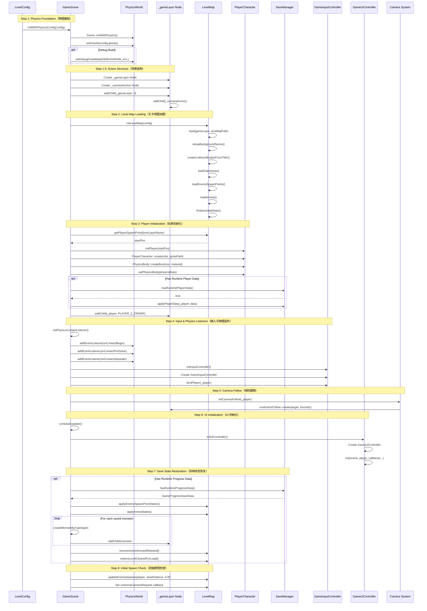

**来源**： [Classes/Scenes/GameScene.cpp L130-L326](https://github.com/lilong555/Adventure-King/blob/60df0f40/Classes/Scenes/GameScene.cpp#L130-L326)

 [Classes/Scenes/DebugScene.cpp L90-L144](https://github.com/lilong555/Adventure-King/blob/60df0f40/Classes/Scenes/DebugScene.cpp#L90-L144)

---

## 阶段 1：物理世界设置

### 物理引擎初始化

场景通过 Cocos2d-x 内置 `PhysicsWorld` 以物理模式初始化：

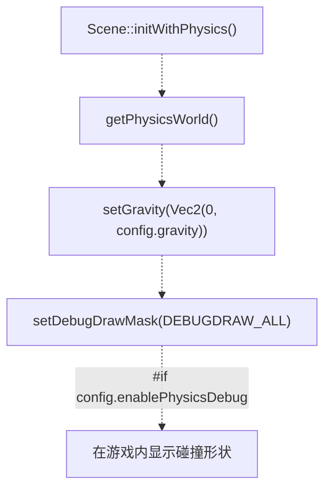

| 配置项 | 来源 | 默认值 |
| --- | --- | --- |
| 重力 | `LevelConfig::gravity` | `-980.0f`（像素/秒²） |
| 调试绘制 | `LevelConfig::enablePhysicsDebug` | `false`（正式环境） |

**实现细节**：

* **Line 135-138**：`Scene::initWithPhysics()` 创建 `PhysicsWorld` 并挂到场景
* **Line 141-142**：重力以 `Vec2(0, negative_value)` 的向下向量设置
* **Line 144-147**：按条件启用调试绘制（碰撞形状可视化）

**来源**： [Classes/Scenes/GameScene.cpp L133-L148](https://github.com/lilong555/Adventure-King/blob/60df0f40/Classes/Scenes/GameScene.cpp#L133-L148)

---

## 阶段 2：场景结构创建

### 游戏层架构

`GameScene` 使用分层的节点层级来将世界内容与 UI 分离，并支持暂停功能：

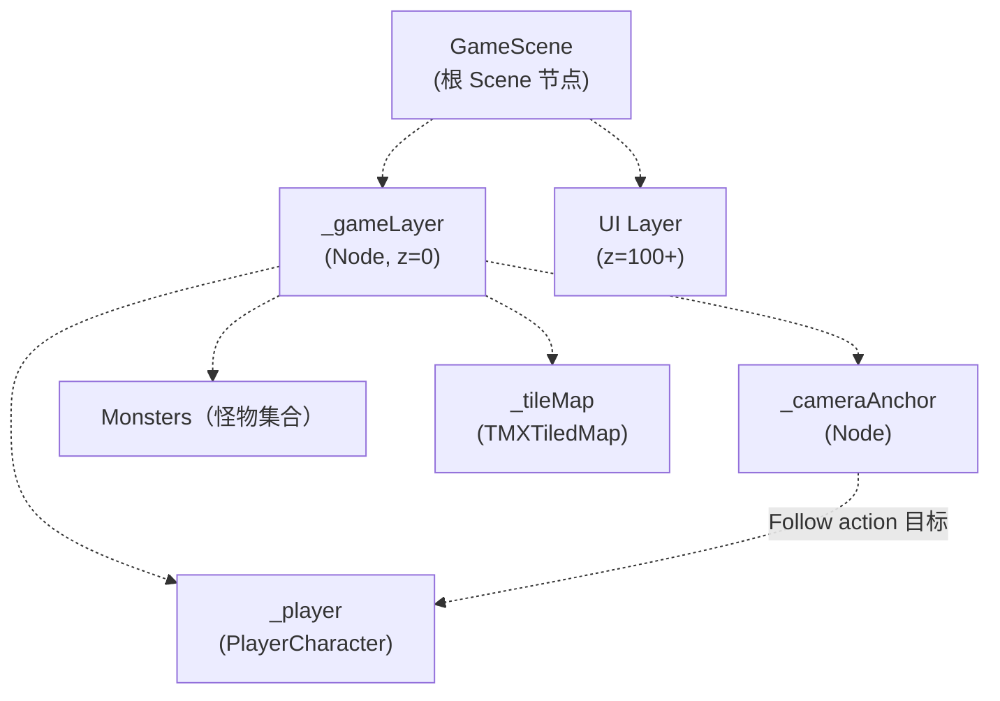

**`_gameLayer` 的用途**：

* **暂停支持**：暂停时冻结 `_gameLayer` 及其子节点，但 UI 仍可交互
* **相机目标**：`Follow` action 以 `_gameLayer` 为对象，带动所有子节点一起滚动
* **Z 序隔离**：玩法内容（z=0）与 UI 覆盖层（z=100+）分离

**`_cameraAnchor` 的用途**：

* **竞技场相机锁定**：进入竞技场时，可把相机锁到固定位置：临时把 `Follow` 从玩家切到 `_cameraAnchor`
* **平滑过渡**：在不同跟随模式之间平滑移动相机

**来源**： [Classes/Scenes/GameScene.cpp L150-L159](https://github.com/lilong555/Adventure-King/blob/60df0f40/Classes/Scenes/GameScene.cpp#L150-L159)

---

## 阶段 3：关卡地图加载

### TMX 地图初始化

`LevelMap` 类封装了所有 TMX 相关操作，初始化顺序为：

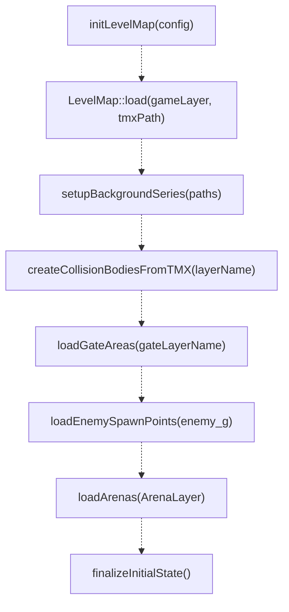

**调用的关键方法**：

| 方法 | 用途 | 对象组名 |
| --- | --- | --- |
| `load()` | 加载 TMX 文件并计算像素尺寸 | N/A |
| `setupBackgroundSeries()` | 横向拼接背景图 | N/A |
| `createCollisionBodiesFromTMX()` | 解析碰撞多边形/矩形并创建静态 `PhysicsBody` 节点 | `config.collisionLayerName`（默认：`"collision"`） |
| `loadGateAreas()` | 提取传送门/出口矩形 | `config.gateLayerName`（默认：`"gate"`） |
| `loadEnemySpawnPoints()` | 提取刷怪点坐标与怪物类型 | `"enemy_g"` |
| `loadArenas()` | 解析竞技场触发与波次配置 | `"ArenaLayer"` |
| `finalizeInitialState()` | 决定关卡是否应以“已清空”状态开局（无战斗配置时） | N/A |

### 碰撞体创建

碰撞体从 TMX 的对象层解析并实例化为静态物理体：

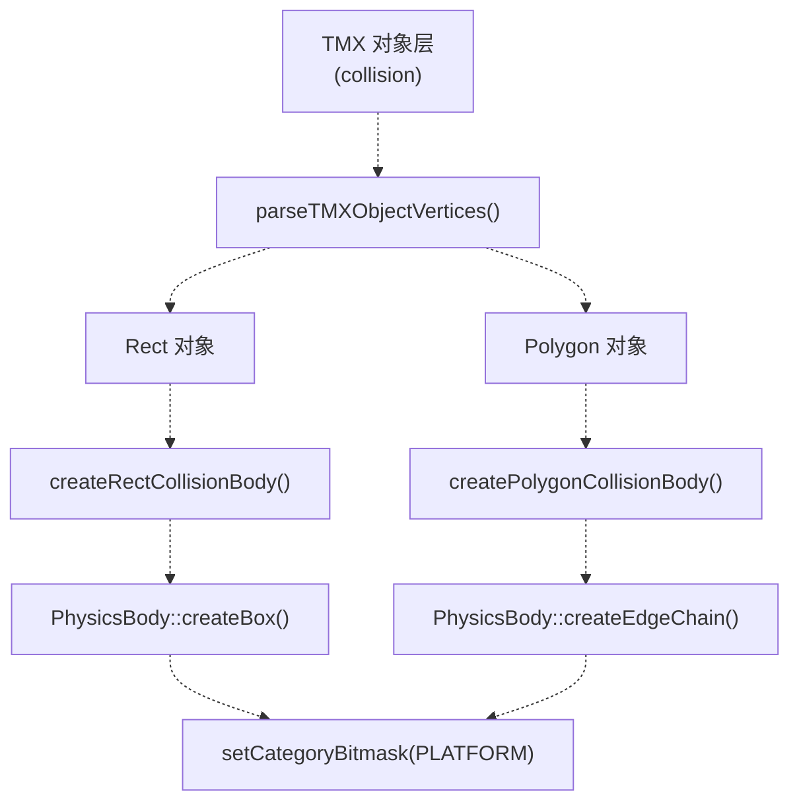

**物理分类配置**：

* **Category**：`GamePhysicsCategory::PLATFORM`
* **碰撞掩码（Collision Mask）**：`PLAYER | MONSTER | PLAYER_ATTACK | BOMB`
* **Contact Test Mask**：与 collision mask 相同

**来源**： [Classes/Scenes/GameScene.cpp L391-L423](https://github.com/lilong555/Adventure-King/blob/60df0f40/Classes/Scenes/GameScene.cpp#L391-L423)

 [Classes/Scenes/LevelMap.cpp L165-L209](https://github.com/lilong555/Adventure-King/blob/60df0f40/Classes/Scenes/LevelMap.cpp#L165-L209)

 [Classes/Scenes/LevelMap.cpp L211-L253](https://github.com/lilong555/Adventure-King/blob/60df0f40/Classes/Scenes/LevelMap.cpp#L211-L253)

 [Classes/Scenes/LevelMap.cpp L255-L303](https://github.com/lilong555/Adventure-King/blob/60df0f40/Classes/Scenes/LevelMap.cpp#L255-L303)

 [Classes/Scenes/LevelMap.cpp L305-L336](https://github.com/lilong555/Adventure-King/blob/60df0f40/Classes/Scenes/LevelMap.cpp#L305-L336)

---

## 阶段 4：玩家角色创建

### 玩家实例化流程

玩家创建包括职业选择、加载贴图、配置物理体，并在可选情况下恢复存档数据：

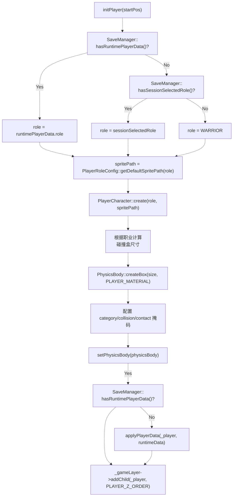

### 职业选择优先级

玩家职业按如下优先级决定：

1. **运行时玩家数据（最高优先级）**：若 `SaveManager::hasRuntimePlayerData()` 为 `true`，则从 `runtimePlayerData.role` 提取职业。发生在读档或“带角色的场景切换”。
2. **会话中选择的职业**：若没有运行时数据但 `SaveManager::hasSessionSelectedRole()` 为 `true`，则使用 session 的职业。发生在主菜单选职业后开始新游戏。
3. **默认职业**：以上都不存在时，默认为 `CharacterRole::WARRIOR`。

**来源**： [Classes/Scenes/GameScene.cpp L425-L445](https://github.com/lilong555/Adventure-King/blob/60df0f40/Classes/Scenes/GameScene.cpp#L425-L445)

### 物理体配置

碰撞盒尺寸与职业相关：

| 职业 | 碰撞盒宽度 | 碰撞盒高度 | 备注 |
| --- | --- | --- | --- |
| **WARRIOR, MAGE** | `contentSize.width * COLLISION_BOX_RATIO_W` | `contentSize.height * COLLISION_BOX_RATIO_H` | 与 sprite 尺寸成比例 |
| **ASSASSIN** | `GameConfig::Player::ASSASSIN_COLLISION_BOX_WIDTH` | `GameConfig::Player::ASSASSIN_COLLISION_BOX_HEIGHT` | 固定尺寸，用于补偿 sprite 空白区域 |

**物理属性**：

* **Material**：`GameConfig::Material::PLAYER`（摩擦、弹性、密度）
* **Dynamic**：`true`（受重力与力影响）
* **Rotation Enable**：`false`（防止角色翻倒）
* **Mass**：`1.0f`
* **Linear Damping**：`0.0f`（无空气阻力）

**分类掩码**：

```yaml
Category:      PLAYER
Collision:     PLATFORM | COLLISION | MONSTER_ATTACK | ITEM
Contact Test:  PLATFORM | COLLISION | MONSTER_ATTACK | ITEM
```

**来源**： [Classes/Scenes/GameScene.cpp L461-L496](https://github.com/lilong555/Adventure-King/blob/60df0f40/Classes/Scenes/GameScene.cpp#L461-L496)

 [Classes/Scenes/DebugScene.cpp L295-L373](https://github.com/lilong555/Adventure-King/blob/60df0f40/Classes/Scenes/DebugScene.cpp#L295-L373)

### 运行时数据恢复

如果 `SaveManager::hasRuntimePlayerData()` 为 `true`，会恢复玩家属性、装备、技能与背包：

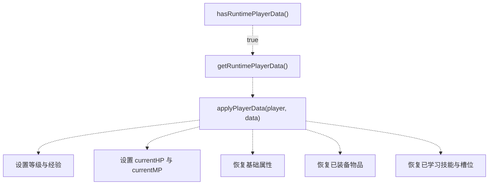

`applyPlayerData`（在 `SaveManager` 中定义）会应用：

* 等级、经验、技能点、属性点
* 当前 HP/MP
* 基础属性（力量、防御等）
* 已装备物品（武器、护甲、饰品）
* 已学习技能与主动/被动槽位

**来源**： [Classes/Scenes/GameScene.cpp L502-L509](https://github.com/lilong555/Adventure-King/blob/60df0f40/Classes/Scenes/GameScene.cpp#L502-L509)

 [Classes/Save/SaveManager.cpp L598-L720](https://github.com/lilong555/Adventure-King/blob/60df0f40/Classes/Save/SaveManager.cpp#L598-L720)

---

## 阶段 5：输入与物理监听

### 物理接触监听设置

接触监听把所有物理碰撞事件路由到 `CombatContactHelper`，由其实现伤害计算与战斗逻辑：

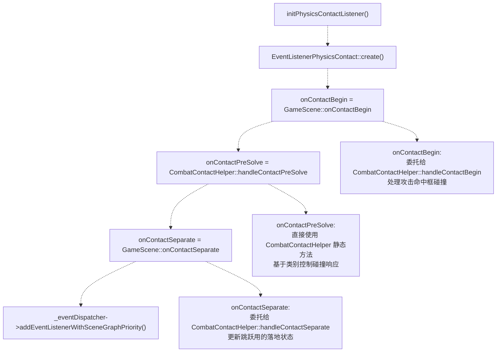

**事件流**：

* **`onContactBegin`**：两个物理体首次接触时触发；用于伤害应用与拾取物品。
* **`onContactPreSolve`**：物理求解器计算碰撞力之前触发；用于对某些类别对禁用碰撞力（例如攻击命中框应穿过平台/目标）。
* **`onContactSeparate`**：两个物理体停止接触时触发；用于追踪落地状态以支持跳跃逻辑。

**来源**： [Classes/Scenes/GameScene.cpp L524-L535](https://github.com/lilong555/Adventure-King/blob/60df0f40/Classes/Scenes/GameScene.cpp#L524-L535)

 [Classes/Scenes/GameScene.cpp L854-L862](https://github.com/lilong555/Adventure-King/blob/60df0f40/Classes/Scenes/GameScene.cpp#L854-L862)

### 输入控制器初始化

`GameInputController` 将键盘事件绑定到玩家动作与 UI 开关：

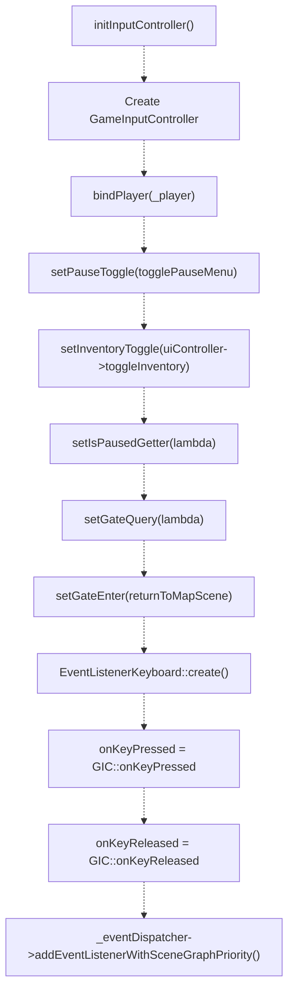

**回调绑定**：

| 回调 | 用途 | 实现 |
| --- | --- | --- |
| `bindPlayer` | 将控制器与玩家实体关联 | 直接保存指针 |
| `setPauseToggle` | ESC 键切换暂停菜单 | 调用 `GameScene::togglePauseMenu()` |
| `setInventoryToggle` | B 键切换背包 | 调用 `GameUIController::toggleInventory()` |
| `setIsPausedGetter` | 查询暂停状态以屏蔽游戏输入 | 返回 `GameScene::_isPaused` |
| `setGateQuery` | 判断玩家是否在传送门 | 调用 `LevelMap::isPointAtGate(playerPos)` |
| `setGateEnter` | 在传送门按 W 返回地图 | 调用 `GameScene::returnToMapScene()` |

**来源**： [Classes/Scenes/GameScene.cpp L537-L583](https://github.com/lilong555/Adventure-King/blob/60df0f40/Classes/Scenes/GameScene.cpp#L537-L583)

---

## 阶段 6：相机系统初始化

### 相机跟随设置

相机通过在 `_gameLayer` 上运行 `Follow` action 来跟随玩家：

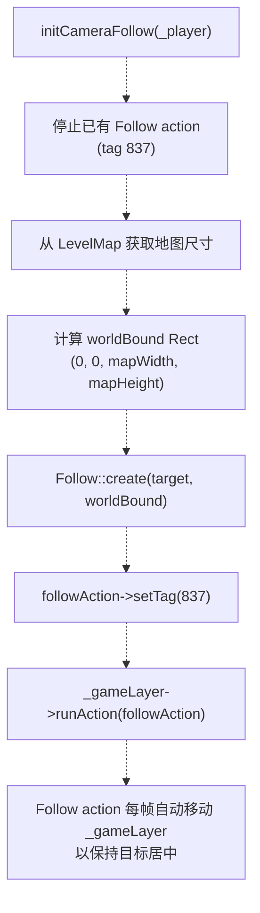

**世界边界限制（Clamping）**：

* `Follow` 使用 `Rect` 边界，防止相机看到地图以外区域。
* 若地图小于屏幕，相机会保持静止。
* 边界按 `Rect(0, 0, mapWidth, mapHeight)` 计算。

**Action Tag 837**：

* 用于在切换到竞技场锁定相机模式时识别并停止 follow action。
* 竞技场相机过渡会临时解除该 action，并改用手动 `MoveTo`。

**来源**： [Classes/Scenes/GameScene.cpp L648-L664](https://github.com/lilong555/Adventure-King/blob/60df0f40/Classes/Scenes/GameScene.cpp#L648-L664)

---

## 阶段 7：UI 初始化

### UI 控制器设置

`GameUIController` 负责管理所有 HUD 元素、暂停菜单、背包与技能栏：

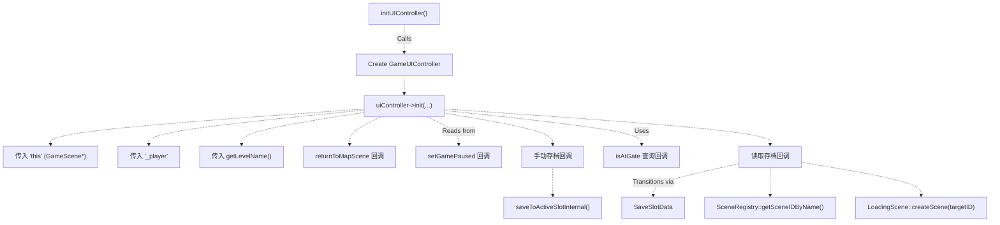

**回调实现**：

| 回调 | 签名 | 用途 |
| --- | --- | --- |
| `returnToMapScene` | `std::function<void()>` | 返回关卡选择界面 |
| `setGamePaused` | `std::function<void(bool)>` | 冻结/解冻 `_gameLayer` 与物理 |
| `Manual save` | `std::function<bool(std::string&)>` | 通过 `saveToActiveSlotInternal` 写入当前存档槽 |
| `isAtGate` | `std::function<bool()>` | 判断玩家是否可交互传送门 |
| `Load game` | `std::function<void(const SaveSlotData&)>` | 从暂停菜单读取指定存档槽 |

**读档流程**：

1. 从 `SaveSlotData::progressData.currentSceneName` 提取 `sceneName`
2. 调用 `SceneRegistry::getInstance()->getSceneIDByName(sceneName)` 得到 `SceneID`
3. 将玩家数据、位置与进度数据写入 `SaveManager` 的 runtime cache
4. 创建 `LoadingScene::createScene(targetID)`，并以淡出过渡切换
5. 新场景在自身初始化流水线中读取 runtime cache

**来源**： [Classes/Scenes/GameScene.cpp L585-L646](https://github.com/lilong555/Adventure-King/blob/60df0f40/Classes/Scenes/GameScene.cpp#L585-L646)

---

## 阶段 8：存档状态恢复

### 运行时进度数据恢复

如果场景由存档加载，则在所有系统初始化完成后恢复世界状态：

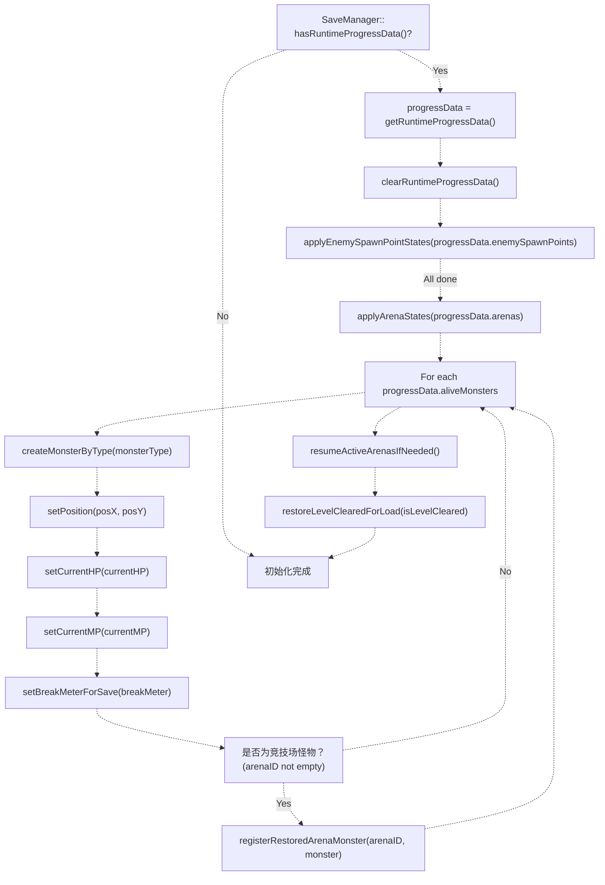

### 恢复内容

**刷怪点（`enemySpawnPoints`）**：

* 记录哪些刷怪点已触发（`hasSpawned = true`）
* 防止重复生成已被击败的敌人
* 通过 `LevelMap::applyEnemySpawnPointStates()` 应用

**竞技场状态（`arenas`）**：

* 恢复 `currentWaveIndex`、`isActivated`、`isFinished` 等标志
* 若竞技场已激活但未完成，将从保存的波次恢复继续
* 通过 `LevelMap::applyArenaStates()` 应用

**存活怪物（`aliveMonsters`）**：

* 每条记录包含 `monsterType`、位置、HP、MP，以及可选的 `breakMeter`
* 通过 `createMonsterByType()` 重建，并精确摆放到存档位置
* 竞技场怪物（`arenaID` 非空）会登记到竞技场系统，避免重复刷波次

**关卡清空状态（`isLevelCleared`）**：

* 若为 `true`，传送门/闸门解锁并展示特效
* 通过 `LevelMap::restoreLevelClearedForLoad()` 恢复
* 为兼容旧存档（缺少该字段），会从刷怪点/竞技场/存活怪物状态推断该标志

**来源**： [Classes/Scenes/GameScene.cpp L195-L306](https://github.com/lilong555/Adventure-King/blob/60df0f40/Classes/Scenes/GameScene.cpp#L195-L306)

---

## 初始化后：初始刷怪检查

系统初始化并恢复存档数据后，场景会进行一次立即刷怪检查：

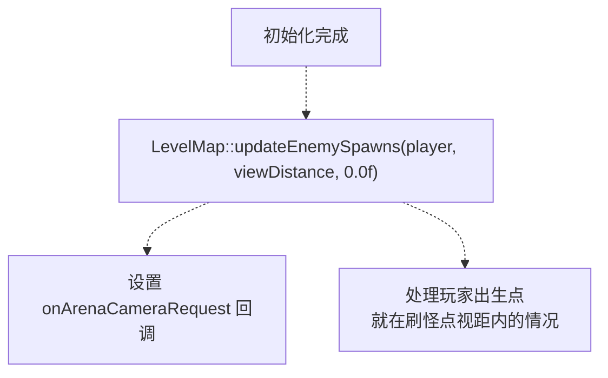

**目的**：

* 若玩家出生点靠近刷怪点，敌人应立即出现，而不是等到首帧 update。
* `dt = 0.0f` 表示这是初始化检查，而不是常规更新 tick。

**竞技场相机回调**：

* 将 `LevelMap::onArenaCameraRequest` 绑定到 `GameScene::handleArenaCamera()`。
* 当竞技场触发时，LevelMap 可请求相机锁到竞技场中心，并在竞技场结束后解锁。

**来源**： [Classes/Scenes/GameScene.cpp L308-L323](https://github.com/lilong555/Adventure-King/blob/60df0f40/Classes/Scenes/GameScene.cpp#L308-L323)

---

## 初始化依赖图

下图把自然语言中的系统名称映射到对应代码实体，便于定位与检索：

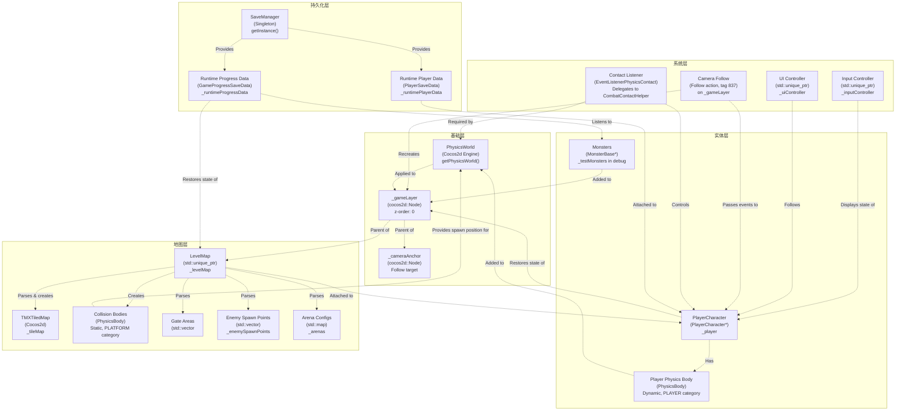

**来源**： [Classes/Scenes/GameScene.cpp L130-L326](https://github.com/lilong555/Adventure-King/blob/60df0f40/Classes/Scenes/GameScene.cpp#L130-L326)

 [Classes/Scenes/GameScene.h L83-L248](https://github.com/lilong555/Adventure-King/blob/60df0f40/Classes/Scenes/GameScene.h#L83-L248)

---

## 代码实体速查

下表将高层概念映射到具体代码实体，便于快速搜索：

| 概念 | 代码实体 | 文件 | 行 |
| --- | --- | --- | --- |
| 初始化入口 | `GameScene::initWithPhysicsConfig()` | GameScene.cpp | 130-326 |
| 物理设置 | `Scene::initWithPhysics()` | GameScene.cpp | 135-147 |
| 游戏层创建 | `_gameLayer = Node::create()` | GameScene.cpp | 152 |
| 相机锚点创建 | `_cameraAnchor = Node::create()` | GameScene.cpp | 155-159 |
| 关卡地图加载 | `GameScene::initLevelMap()` | GameScene.cpp | 391-423 |
| 玩家创建 | `GameScene::initPlayer()` | GameScene.cpp | 425-522 |
| 物理监听 | `GameScene::initPhysicsContactListener()` | GameScene.cpp | 524-535 |
| 输入绑定 | `GameScene::initInputController()` | GameScene.cpp | 537-583 |
| 相机跟随 | `GameScene::initCameraFollow()` | GameScene.cpp | 648-664 |
| UI 设置 | `GameScene::initUIController()` | GameScene.cpp | 585-646 |
| 存档恢复 | runtime cache 应用 | GameScene.cpp | 195-306 |
| 初始刷怪检查 | `LevelMap::updateEnemySpawns()` | GameScene.cpp | 308-318 |

**来源**： [Classes/Scenes/GameScene.cpp L1-L1028](https://github.com/lilong555/Adventure-King/blob/60df0f40/Classes/Scenes/GameScene.cpp#L1-L1028)
