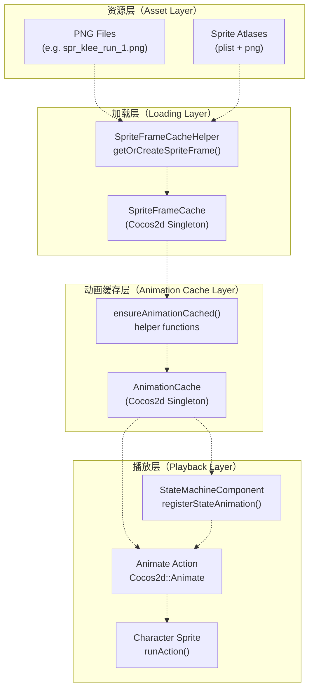
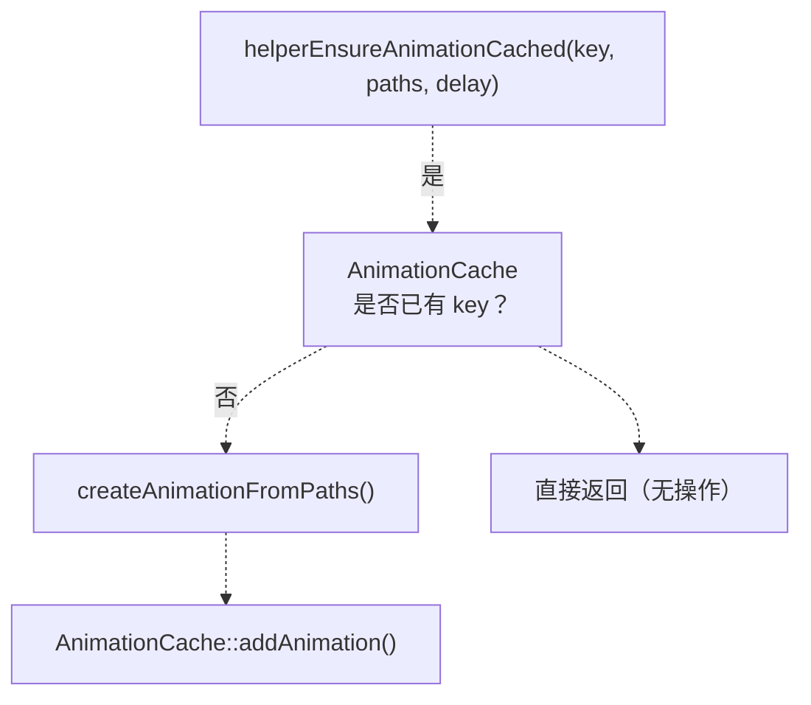
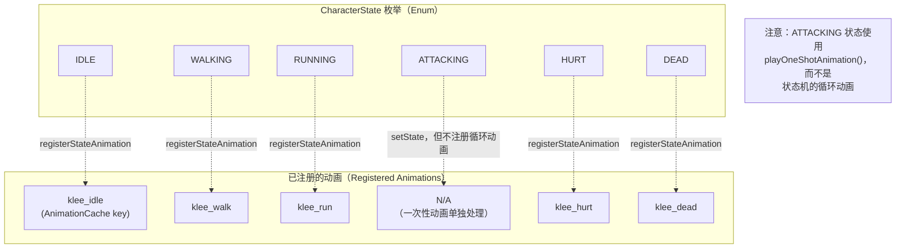
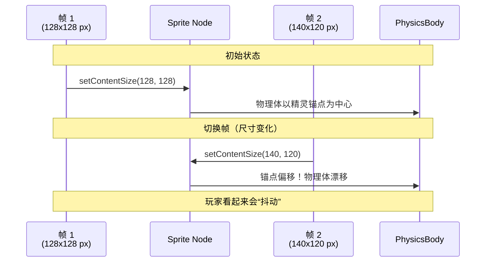
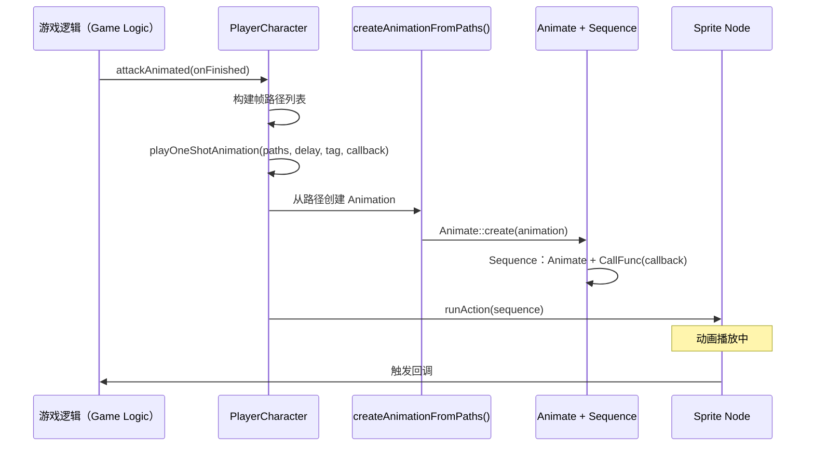
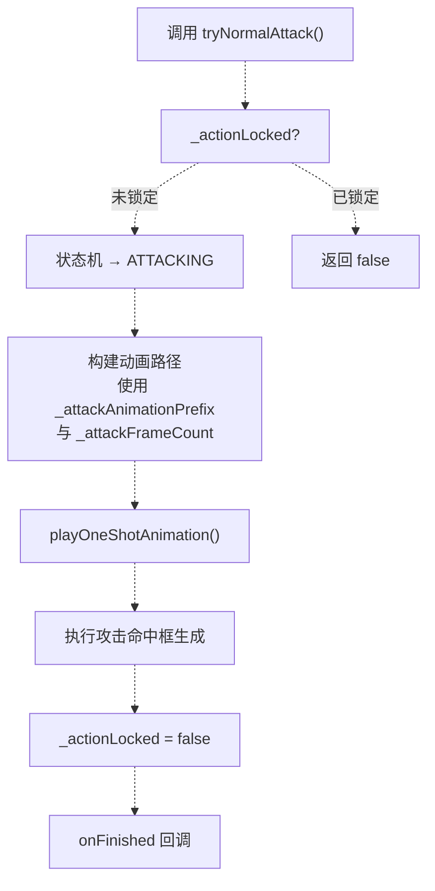
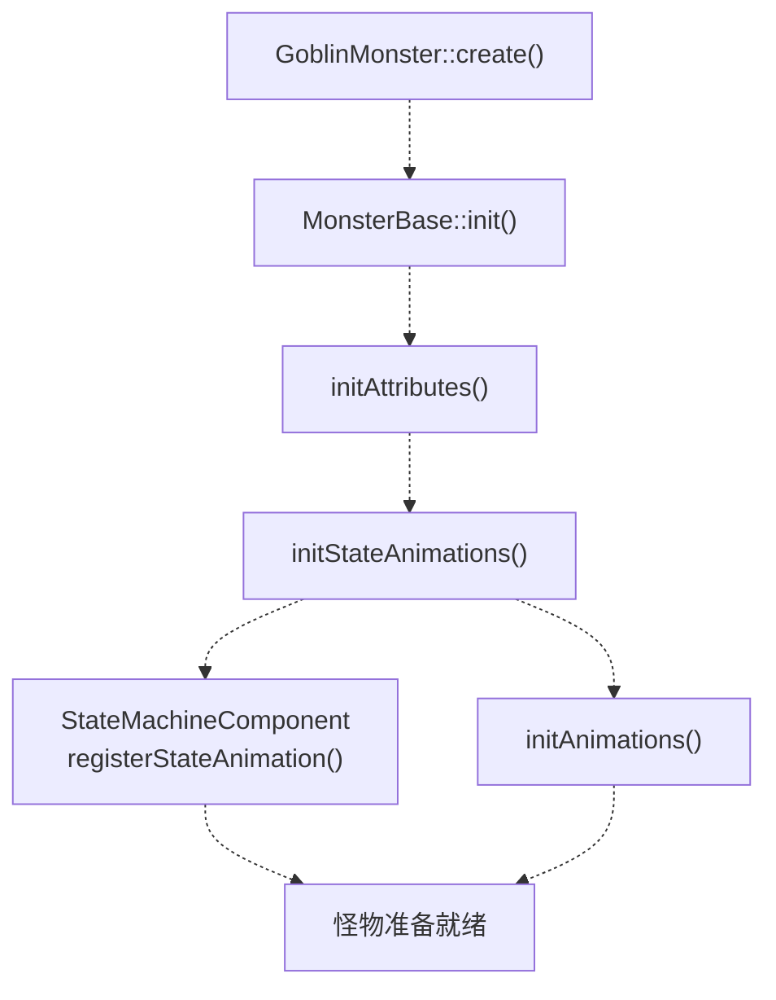
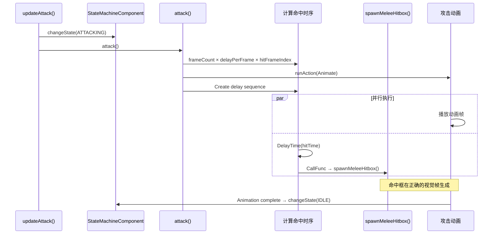
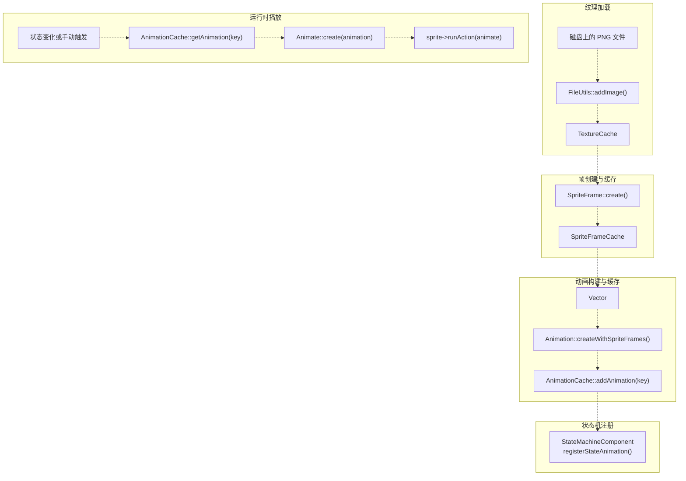

# 动画系统

> **相关源文件（Relevant source files）**
> * [Adventure-King/Classes/Character/Base/CharacterData.h](https://github.com/lilong555/Adventure-King/blob/60df0f40/Adventure-King/Classes/Character/Base/CharacterData.h)
> * [Adventure-King/Classes/Character/Monster/MonsterBase.cpp](https://github.com/lilong555/Adventure-King/blob/60df0f40/Adventure-King/Classes/Character/Monster/MonsterBase.cpp)
> * [Adventure-King/Classes/Character/Monster/MonsterBase.h](https://github.com/lilong555/Adventure-King/blob/60df0f40/Adventure-King/Classes/Character/Monster/MonsterBase.h)
> * [Adventure-King/Classes/Character/Monster/Monsters/GoblinMonster.cpp](https://github.com/lilong555/Adventure-King/blob/60df0f40/Adventure-King/Classes/Character/Monster/Monsters/GoblinMonster.cpp)
> * [Adventure-King/Classes/Character/Monster/Monsters/GoblinMonster.h](https://github.com/lilong555/Adventure-King/blob/60df0f40/Adventure-King/Classes/Character/Monster/Monsters/GoblinMonster.h)
> * [Adventure-King/Classes/Character/Player/PlayerCharacter.cpp](https://github.com/lilong555/Adventure-King/blob/60df0f40/Adventure-King/Classes/Character/Player/PlayerCharacter.cpp)
> * [Adventure-King/Classes/Character/Player/PlayerCharacter.h](https://github.com/lilong555/Adventure-King/blob/60df0f40/Adventure-King/Classes/Character/Player/PlayerCharacter.h)
> * [Adventure-King/Classes/UI/InventoryLayer.cpp](https://github.com/lilong555/Adventure-King/blob/60df0f40/Adventure-King/Classes/UI/InventoryLayer.cpp)
> * [Adventure-King/Classes/UI/InventoryLayer.h](https://github.com/lilong555/Adventure-King/blob/60df0f40/Adventure-King/Classes/UI/InventoryLayer.h)
> * [Adventure-King/Classes/UI/SkillBar.cpp](https://github.com/lilong555/Adventure-King/blob/60df0f40/Adventure-King/Classes/UI/SkillBar.cpp)

## 目的与范围

本文覆盖 Adventure-King 全局使用的动画系统：用于渲染角色动作与 UI 反馈。系统负责管理 SpriteFrame 序列、为性能做动画缓存，并与状态机集成以驱动角色表现。它同时处理循环动画（idle/walk/run）与一次性动画（attack/skill cast/hurt）。

驱动这些动画的角色状态管理请参见 [StateMachineComponent](<组件架构.md>)。关于技能视觉特效与投掷物，请参见 [Skill Set Implementations](<技能集实现.md>)。

---

## 架构概览

动画系统基于 Cocos2d 的动画框架构建，并在其之上做了若干项目级扩展：

| 组件（Component） | 用途（Purpose） | 关键类（Key Classes） |
| --- | --- | --- |
| **动画缓存（Animation Caching）** | 预加载并复用帧序列 | `cocos2d::AnimationCache`、辅助函数 |
| **状态机集成（State Machine Integration）** | 将角色状态映射到动画 | `StateMachineComponent` |
| **稳定帧系统（Stable Frame System）** | 避免 PNG 尺寸变化导致物理体漂移 | `PlayerCharacter::getStableSpriteFrame` |
| **帧加载（Frame Loading）** | 统一从文件/图集创建帧 | `SpriteFrameCacheHelper` |
| **一次性播放（One-Shot Playback）** | 支持回调的临时动画播放 | `playOneShotAnimation` 相关方法 |

**动画数据流（Animation Data Flow）：**



**来源：** [Adventure-King/Classes/Character/Player/PlayerCharacter.cpp L100-L139](https://github.com/lilong555/Adventure-King/blob/60df0f40/Adventure-King/Classes/Character/Player/PlayerCharacter.cpp#L100-L139)

 [Adventure-King/Classes/Character/Monster/Monsters/GoblinMonster.cpp L16-L66](https://github.com/lilong555/Adventure-King/blob/60df0f40/Adventure-King/Classes/Character/Monster/Monsters/GoblinMonster.cpp#L16-L66)

---

## 核心组件

### AnimationCache 单例

`cocos2d::AnimationCache` 是 Cocos2d 内置的单例，用字符串 key 存储 `Animation` 对象。一个 `Animation` 包含：

* `SpriteFrame*` 的向量（真实的图像帧）
* `delayPerUnit`（每帧时长，单位：秒）

缓存可以避免重复构建帧向量。一旦通过 `addAnimation(animation, key)` 缓存动画，后续调用 `getAnimation(key)` 会返回同一个实例。

**使用模式（Usage Pattern）：**

```sql
// Check if already cached
auto cache = AnimationCache::getInstance();
if (!cache->getAnimation("goblin_walk"))
{
    // Build frame vector
    Vector<SpriteFrame*> frames;
    for (int i = 1; i <= 4; ++i)
    {
        auto frame = SpriteFrameCache::getInstance()->getSpriteFrameByName(...);
        frames.pushBack(frame);
    }
    
    // Create and cache animation
    auto anim = Animation::createWithSpriteFrames(frames, 0.1f);
    cache->addAnimation(anim, "goblin_walk");
}

// Later: retrieve and play
auto anim = cache->getAnimation("goblin_walk");
auto animate = Animate::create(anim);
sprite->runAction(animate);
```

**来源：** [Adventure-King/Classes/Character/Player/PlayerCharacter.cpp L125-L139](https://github.com/lilong555/Adventure-King/blob/60df0f40/Adventure-King/Classes/Character/Player/PlayerCharacter.cpp#L125-L139)

 [Adventure-King/Classes/Character/Monster/Monsters/GoblinMonster.cpp L16-L36](https://github.com/lilong555/Adventure-King/blob/60df0f40/Adventure-King/Classes/Character/Monster/Monsters/GoblinMonster.cpp#L16-L36)

---

### 动画缓存辅助函数

为避免样板代码，项目定义了一些辅助函数来封装“检查缓存 → 加载帧 → 创建动画 → 写入缓存”的固定流程。

**PlayerCharacter 辅助函数（内部）：**



[Adventure-King/Classes/Character/Player/PlayerCharacter.cpp L125-L139](https://github.com/lilong555/Adventure-King/blob/60df0f40/Adventure-King/Classes/Character/Player/PlayerCharacter.cpp#L125-L139)

**GoblinMonster 辅助函数：**

* `ensureSingleFrameAnimationCached(key, framePath, delay)`：单帧动画（idle、hurt）
* `ensureLoopAnimationCached(key, formatStr, frameCount, delay)`：多帧循环动画（walk）
* `ensureGoblinAttackAnimationCached()`：可变长度攻击序列（遇到第一个缺失帧即停止）

[Adventure-King/Classes/Character/Monster/Monsters/GoblinMonster.cpp L16-L104](https://github.com/lilong555/Adventure-King/blob/60df0f40/Adventure-King/Classes/Character/Monster/Monsters/GoblinMonster.cpp#L16-L104)

**为什么要分不同 helper？** 不同动画类型需要不同加载策略：单帧动画很简单；循环动画遵循固定命名模式；攻击动画可能帧数不固定，需要在文件缺失时提前终止。

---

### StateMachineComponent 集成

`StateMachineComponent` 维护了从 `CharacterState` 枚举到动画缓存 key 的映射：

```
// In character init:
auto sm = getStateMachineComponent();
sm->registerStateAnimation(CharacterState::IDLE, "goblin_idle");
sm->registerStateAnimation(CharacterState::WALKING, "goblin_walk");
sm->registerStateAnimation(CharacterState::HURT, "goblin_hurt");

// During gameplay:
sm->changeState(CharacterState::WALKING);  // Automatically plays "goblin_walk"
```

状态机会负责：

1. 停止上一段动画
2. 从 `AnimationCache` 取出新动画
3. 创建 `Animate` 动作并执行
4. 设置循环策略（非死亡状态循环，HURT/DEAD 不循环）

**状态 → 动画映射（State → Animation Mapping）：**



**来源：** [Adventure-King/Classes/Character/Player/PlayerCharacter.cpp L254-L262](https://github.com/lilong555/Adventure-King/blob/60df0f40/Adventure-King/Classes/Character/Player/PlayerCharacter.cpp#L254-L262)

 [Adventure-King/Classes/Character/Monster/Monsters/GoblinMonster.cpp L210-L228](https://github.com/lilong555/Adventure-King/blob/60df0f40/Adventure-King/Classes/Character/Monster/Monsters/GoblinMonster.cpp#L210-L228)

---

## 玩家动画系统

### 稳定 SpriteFrame 系统

PlayerCharacter 解决了一个关键问题：**不同尺寸的 PNG 会导致物理体漂移**。当动画帧的 `contentSize` 不一致时，切换帧会让精灵锚点相对世界坐标发生变化，从而使物理体出现“跳动/滑移”。

**问题示意（Problem Illustration）：**



**解决方案：** 在初始化阶段记录一个“稳定的 original size”，并强制所有帧对外报告相同的 `originalSize`（不管实际 PNG 尺寸如何），从而保持精灵内容尺寸一致。

**实现（Implementation）：**

[Adventure-King/Classes/Character/Player/PlayerCharacter.cpp L213-L215](https://github.com/lilong555/Adventure-King/blob/60df0f40/Adventure-King/Classes/Character/Player/PlayerCharacter.cpp#L213-L215)

```
// 记录首帧尺寸作为稳定参考
_stableFrameOriginalSize = getContentSize();
```

[Adventure-King/Classes/Character/Player/PlayerCharacter.cpp L279-L298](https://github.com/lilong555/Adventure-King/blob/60df0f40/Adventure-King/Classes/Character/Player/PlayerCharacter.cpp#L279-L298)

```javascript
SpriteFrame* PlayerCharacter::getStableSpriteFrame(const std::string& framePath,
                                                    bool alignBottom,
                                                    bool alignLeft) const
{
    // 对图集帧：直接返回缓存帧（不能修改 originalSize）
    if (!SpriteFrameCacheHelper::isFilePath(framePath))
    {
        return SpriteFrameCache::getInstance()->getSpriteFrameByName(framePath);
    }

    // 对文件路径：用稳定的 originalSize 创建帧
    if (_stableFrameOriginalSize.width <= 0.0f || _stableFrameOriginalSize.height <= 0.0f)
    {
        return SpriteFrameCacheHelper::getOrCreateSpriteFrame(framePath);
    }

    // 强制所有帧使用统一 originalSize
    return SpriteFrameCacheHelper::getOrCreateSpriteFrameWithOriginalSize(
        framePath, _stableFrameOriginalSize, alignBottom, alignLeft);
}
```

所有玩家动画都必须通过 `getStableSpriteFrame()` 加载帧，以确保物理稳定性。

**来源：** [Adventure-King/Classes/Character/Player/PlayerCharacter.cpp L213-L215](https://github.com/lilong555/Adventure-King/blob/60df0f40/Adventure-King/Classes/Character/Player/PlayerCharacter.cpp#L213-L215)

 [Adventure-King/Classes/Character/Player/PlayerCharacter.cpp L279-L310](https://github.com/lilong555/Adventure-King/blob/60df0f40/Adventure-King/Classes/Character/Player/PlayerCharacter.cpp#L279-L310)

---

### 玩家动画缓存策略

PlayerCharacter 将动画缓存分为两类：

**1. 移动动画（Move Animations，状态机循环）：**

[Adventure-King/Classes/Character/Player/PlayerCharacter.cpp L1270-L1318](https://github.com/lilong555/Adventure-King/blob/60df0f40/Adventure-King/Classes/Character/Player/PlayerCharacter.cpp#L1270-L1318)

```cpp
void PlayerCharacter::ensureMoveAnimations()
{
    // Walk animation
    std::vector<std::string> walkPaths;
    for (int i = 1; i <= 4; ++i)
    {
        walkPaths.push_back(StringUtils::format(
            "%s/spr_%s_walk_%d.png", 
            _defaultSpriteDir.c_str(), 
            _characterKey.c_str(), 
            i));
    }
    helperEnsureAnimationCached(
        _animationKeyPrefix + "_walk", 
        walkPaths, 
        ANIM_DELAY_WALK, 
        [this](const std::string& path) {
            return getStableSpriteFrame(path, true, false);
        });

    // Idle/run/hurt similarly...
}
```

这些动画会注册到 `StateMachineComponent`，当对应状态处于激活时自动循环播放。

**2. 状态动画（State Animations，一次性动作）：**

[Adventure-King/Classes/Character/Player/PlayerCharacter.cpp L1320-L1337](https://github.com/lilong555/Adventure-King/blob/60df0f40/Adventure-King/Classes/Character/Player/PlayerCharacter.cpp#L1320-L1337)

部分状态动画（如 idle、hurt）也可能作为一次性动画的兜底。

**关键区别（Key Difference）：**

* **移动动画**：始终循环，由状态机管理
* **一次性动画**：播放一次并回调，常用于攻击/技能

**来源：** [Adventure-King/Classes/Character/Player/PlayerCharacter.cpp L1270-L1337](https://github.com/lilong555/Adventure-King/blob/60df0f40/Adventure-King/Classes/Character/Player/PlayerCharacter.cpp#L1270-L1337)

---

### 一次性动画播放

对攻击与技能，PlayerCharacter 使用 `playOneShotAnimation()` 播放一次帧序列，并在结束时触发回调：



[Adventure-King/Classes/Character/Player/PlayerCharacter.cpp L965-L992](https://github.com/lilong555/Adventure-King/blob/60df0f40/Adventure-King/Classes/Character/Player/PlayerCharacter.cpp#L965-L992)

```cpp
void PlayerCharacter::playOneShotAnimation(
    const std::vector<std::string>& paths, 
    float delayPerUnit, 
    int actionTag, 
    const std::function<void()>& onFinished)
{
    // 从帧创建动画
    auto animation = createAnimationFromPaths(paths, delayPerUnit, 
        [this](const std::string& path) {
            return getStableSpriteFrame(path, true, false);
        });
    
    if (!animation)
    {
        if (onFinished) onFinished();
        return;
    }

    // 停止同 tag 的上一段动画
    if (actionTag != 0) stopActionByTag(actionTag);

    // 构建序列：animate → callback
    auto animate = Animate::create(animation);
    auto callbackAction = CallFunc::create([onFinished]() {
        if (onFinished) onFinished();
    });

    auto sequence = Sequence::create(animate, callbackAction, nullptr);
    if (actionTag != 0) sequence->setTag(actionTag);

    runAction(sequence);
}
```

**动作 Tag（Action Tags）：** 用于防止动画重叠。例如 `ACTION_TAG_ATTACK_ANIM = 200` 可以确保同一时刻只会有一个攻击动画在播放。

**来源：** [Adventure-King/Classes/Character/Player/PlayerCharacter.cpp L965-L992](https://github.com/lilong555/Adventure-King/blob/60df0f40/Adventure-King/Classes/Character/Player/PlayerCharacter.cpp#L965-L992)

 [Adventure-King/Classes/Character/Player/PlayerCharacter.cpp L1018-L1050](https://github.com/lilong555/Adventure-King/blob/60df0f40/Adventure-King/Classes/Character/Player/PlayerCharacter.cpp#L1018-L1050)

---

### 玩家攻击动画流程

攻击动画会根据当前装备的武器动态构建：



[Adventure-King/Classes/Character/Player/PlayerCharacter.cpp L1018-L1050](https://github.com/lilong555/Adventure-King/blob/60df0f40/Adventure-King/Classes/Character/Player/PlayerCharacter.cpp#L1018-L1050)

```cpp
void PlayerCharacter::attackAnimated(const std::function<void()>& onFinished)
{
    // 切换到 ATTACKING 状态
    if (auto sm = getStateMachineComponent())
        sm->changeState(CharacterState::ATTACKING);

    // 根据武器计算动画速度
    float animSpeed = 0.15f;
    if (auto weapon = getEquippedWeapon())
    {
        if (weapon->attackSpeed > 0.0f) 
            animSpeed = 0.15f / weapon->attackSpeed;
    }

    // 构建帧路径
    std::string prefix = _attackAnimationPrefix.empty() 
        ? _defaultAttackAnimationPrefix 
        : _attackAnimationPrefix;
    int frameCount = (_attackFrameCount > 0) ? _attackFrameCount : 3;

    std::vector<std::string> paths;
    for (int i = 1; i <= frameCount; ++i)
    {
        paths.push_back(StringUtils::format(
            "%s/%s_%d.png", 
            _defaultSpriteDir.c_str(), 
            prefix.c_str(), 
            i));
    }

    playOneShotAnimation(paths, animSpeed, ACTION_TAG_ATTACK_ANIM, onFinished);
}
```

当装备武器时，`onWeaponChanged()` 会更新 `_attackAnimationPrefix` 与 `_attackFrameCount`，从而切换攻击动画资源集。

**来源：** [Adventure-King/Classes/Character/Player/PlayerCharacter.cpp L1018-L1050](https://github.com/lilong555/Adventure-King/blob/60df0f40/Adventure-King/Classes/Character/Player/PlayerCharacter.cpp#L1018-L1050)

 [Adventure-King/Classes/Character/Player/PlayerCharacter.cpp L887-L901](https://github.com/lilong555/Adventure-King/blob/60df0f40/Adventure-King/Classes/Character/Player/PlayerCharacter.cpp#L887-L901)

---

## 怪物动画系统

### 简化架构

MonsterBase 及其子类使用更简化的动画系统，不需要稳定帧（怪物通常不涉及复杂的“装备驱动动画切换”）。整体流程如下：

1. **预加载资源**：通过静态 `preloadResources()`（由场景在生成前调用）
2. **缓存动画**：在 `init()` 中用辅助函数构建并缓存
3. **注册到状态机**：用于自动循环播放
4. **攻击动画**：通过手动 `runAction()` 并结合时序计算

**怪物动画初始化（Monster Animation Initialization）：**



**来源：** [Adventure-King/Classes/Character/Monster/Monsters/GoblinMonster.cpp L139-L165](https://github.com/lilong555/Adventure-King/blob/60df0f40/Adventure-King/Classes/Character/Monster/Monsters/GoblinMonster.cpp#L139-L165)

 [Adventure-King/Classes/Character/Monster/Monsters/GoblinMonster.cpp L210-L248](https://github.com/lilong555/Adventure-King/blob/60df0f40/Adventure-King/Classes/Character/Monster/Monsters/GoblinMonster.cpp#L210-L248)

---

### 怪物攻击动画时序

怪物会在攻击动画的某一帧生成命中框，这就需要精确的时序计算：

**时序策略（Timing Strategy）：**



[Adventure-King/Classes/Character/Monster/Monsters/GoblinMonster.cpp L254-L354](https://github.com/lilong555/Adventure-King/blob/60df0f40/Adventure-King/Classes/Character/Monster/Monsters/GoblinMonster.cpp#L254-L354)

```cpp
void GoblinMonster::attack()
{
	    // 计算命中时序
    float hitTime = GameConfig::Monster::Goblin::ATTACK_HIT_FALLBACK_TIME;
    if (_attackAnimate)
    {
        int frameCount = _attackAnimate->getAnimation()->getFrames().size();
        if (frameCount > 0)
        {
            float frameTime = _attackAnimate->getDuration() / frameCount;
            float hitFrame = static_cast<float>(
                GameConfig::Monster::Goblin::ATTACK_HIT_FRAME_INDEX);
            hitTime = frameTime * hitFrame;
        }
    }

	    // 构建逻辑序列
    auto logicSequence = Sequence::create(
        DelayTime::create(hitTime),
        CallFunc::create([this]() {
		            // 根据朝向计算命中框偏移
            float direction = (this->getScaleX() > 0) ? 1.0f : -1.0f;
            Vec2 offset(HITBOX_OFFSET_X * direction, HITBOX_OFFSET_Y);
            Size hitboxSize(HITBOX_WIDTH, HITBOX_HEIGHT);
            
            spawnMeleeHitbox(offset, hitboxSize, damageTag, HITBOX_LIFE_SECONDS);
        }),
        nullptr);

	    // 并行运行动画与逻辑
    auto spawn = Spawn::create(animateAction, logicSequence, nullptr);

	    // 完成后恢复状态
    auto finalSequence = Sequence::create(
        spawn,
        CallFunc::create([this]() {
            if (auto sm = getStateMachineComponent())
            {
                if (sm->getCurrentState() != CharacterState::DEAD)
                    sm->changeState(CharacterState::IDLE);
            }
        }),
        nullptr);

    this->runAction(finalSequence);
}
```

**关键配置（Key Configuration）：**

* `ATTACK_HIT_FRAME_INDEX`：在第几帧生成命中框（例如 10 帧动画的第 5 帧）
* `ATTACK_ANIM_FRAME_DELAY`：每帧时长
* `ATTACK_HIT_FALLBACK_TIME`：无法获取帧数时的兜底命中时间

**来源：** [Adventure-King/Classes/Character/Monster/Monsters/GoblinMonster.cpp L254-L354](https://github.com/lilong555/Adventure-King/blob/60df0f40/Adventure-King/Classes/Character/Monster/Monsters/GoblinMonster.cpp#L254-L354)

---

## 动画生命周期

### 从帧加载到播放的管线



**初始化顺序（Initialization Sequence）：**

| 步骤（Step） | 时机（When） | 发生的事情（What Happens） |
| --- | --- | --- |
| 1. 预加载（Preload） | 场景初始化或首次生成 | 把纹理加载到 `TextureCache` |
| 2. 帧创建（Frame creation） | 角色初始化 | 创建 `SpriteFrame` 对象 |
| 3. 动画缓存（Animation caching） | 角色初始化 | 构建帧序列并存入 `AnimationCache` |
| 4. 注册（Registration） | 角色初始化 | 在 `StateMachineComponent` 中把状态映射到动画 key |
| 5. 播放（Playback） | 运行时 | 取出动画，创建 `Animate` 动作并在 sprite 上执行 |

**来源：** [Adventure-King/Classes/Character/Player/PlayerCharacter.cpp L249-L275](https://github.com/lilong555/Adventure-King/blob/60df0f40/Adventure-King/Classes/Character/Player/PlayerCharacter.cpp#L249-L275)

 [Adventure-King/Classes/Character/Monster/Monsters/GoblinMonster.cpp L168-L179](https://github.com/lilong555/Adventure-King/blob/60df0f40/Adventure-King/Classes/Character/Monster/Monsters/GoblinMonster.cpp#L168-L179)

---

## 性能注意事项

### 动画缓存收益

**不做缓存（Without caching）：**

```sql
	// 每次帧变化都重新创建动画
for (int frame = 0; frame < 100; ++frame)
{
	    Vector<SpriteFrame*> frames;  // 分配 vector
    for (int i = 1; i <= 4; ++i)
    {
	        frames.pushBack(loadFrame(i));  // 加载 4 帧
    }
	    auto anim = Animation::create(frames, 0.1f);  // 构建 Animation
    auto animate = Animate::create(anim);
    sprite->runAction(animate);
}
	// 结果：加载 400 帧，创建 100 个 Animation 对象
```

**使用缓存（With caching）：**

```sql
	// 初始化：缓存一次
AnimationCache::getInstance()->addAnimation(walkAnim, "walk");

	// 播放：复用缓存
for (int frame = 0; frame < 100; ++frame)
{
    auto anim = AnimationCache::getInstance()->getAnimation("walk");
	    auto animate = Animate::create(anim);  // 只需创建轻量的 Animate 动作
    sprite->runAction(animate);
}
	// 结果：加载 4 帧，创建 1 个 Animation 对象，创建 100 个轻量 Animate 动作
```

**内存权衡（Memory Trade-off）：**

* 缓存动画会在应用生命周期内常驻内存
* 对于动画集较少的游戏（如本项目），内存成本可以忽略
* 对于大型游戏，可考虑按需缓存或动画流式加载

**来源：** [Adventure-King/Classes/Character/Player/PlayerCharacter.cpp L125-L139](https://github.com/lilong555/Adventure-King/blob/60df0f40/Adventure-King/Classes/Character/Player/PlayerCharacter.cpp#L125-L139)

---

### 稳定帧系统的开销

稳定帧系统的运行时开销很低：

| 操作（Operation） | 开销（Cost） | 频率（Frequency） |
| --- | --- | --- |
| 记录初始尺寸 | O(1) | 每个角色初始化一次 |
| 创建强制尺寸的帧 | O(1) | 每个唯一帧一次（可缓存） |
| 动画播放 | O(1) | 每次帧切换（使用缓存帧） |

**何时使用稳定帧（When to use stable frames）：**

* 带物理体的角色（避免漂移）
* 动画帧 PNG 尺寸不一致的角色
* UI 精灵或静态装饰通常不需要

**来源：** [Adventure-King/Classes/Character/Player/PlayerCharacter.cpp L279-L310](https://github.com/lilong555/Adventure-King/blob/60df0f40/Adventure-King/Classes/Character/Player/PlayerCharacter.cpp#L279-L310)

---

### 预加载策略

项目使用两种预加载策略：

**1. 按需加载（On-demand，PlayerCharacter）：**

```
void PlayerCharacter::ensureMoveAnimations()
{
	    // 仅在未缓存时才创建并缓存
    if (!AnimationCache::getInstance()->getAnimation("klee_walk"))
    {
	        // 加载并缓存
    }
}
```

在角色初始化时调用。由于玩家角色创建频率较低（多发生于场景切换），该策略可接受。

**2. 批量预加载（Batch preload，怪物）：**

```
void GoblinMonster::preloadResources()
{
	    // 由 GameScene 在首次生成前调用一次
    ensureSingleFrameAnimationCached("goblin_idle", ...);
    ensureLoopAnimationCached("goblin_walk", ...);
    ensureGoblinAttackAnimationCached();
}
```

由 `GameScene` 在 `LoadingScene` 阶段调用，可避免首次刷出 10+ 哥布林时出现卡顿。

**建议（Recommendation）：**

* 对高频生成的实体：在加载界面做批量预加载
* 对单例/低频实体：在 init 期间按需缓存

**来源：** [Adventure-King/Classes/Character/Monster/Monsters/GoblinMonster.cpp L168-L179](https://github.com/lilong555/Adventure-King/blob/60df0f40/Adventure-King/Classes/Character/Monster/Monsters/GoblinMonster.cpp#L168-L179)

 [Adventure-King/Classes/Character/Player/PlayerCharacter.cpp L249-L275](https://github.com/lilong555/Adventure-King/blob/60df0f40/Adventure-King/Classes/Character/Player/PlayerCharacter.cpp#L249-L275)

---

## 代码实体索引

| 实体（Entity） | 类型（Type） | 文件（File） | 用途（Purpose） |
| --- | --- | --- | --- |
| `AnimationCache` | Cocos2d 单例 | N/A（引擎） | 全局动画存储 |
| `SpriteFrameCache` | Cocos2d 单例 | N/A（引擎） | 全局帧存储 |
| `SpriteFrameCacheHelper` | 静态工具 | [Utils/SpriteFrameCacheHelper.h](https://github.com/lilong555/Adventure-King/blob/60df0f40/Utils/SpriteFrameCacheHelper.h) | 帧创建封装 |
| `PlayerCharacter::getStableSpriteFrame()` | 成员函数 | [Classes/Character/Player/PlayerCharacter.cpp L279-L298](https://github.com/lilong555/Adventure-King/blob/60df0f40/Classes/Character/Player/PlayerCharacter.cpp#L279-L298) | 稳定帧加载器 |
| `PlayerCharacter::ensureMoveAnimations()` | 成员函数 | [Classes/Character/Player/PlayerCharacter.cpp L1270-L1318](https://github.com/lilong555/Adventure-King/blob/60df0f40/Classes/Character/Player/PlayerCharacter.cpp#L1270-L1318) | 缓存移动动画 |
| `PlayerCharacter::playOneShotAnimation()` | 成员函数 | [Classes/Character/Player/PlayerCharacter.cpp L965-L992](https://github.com/lilong555/Adventure-King/blob/60df0f40/Classes/Character/Player/PlayerCharacter.cpp#L965-L992) | 一次性播放 |
| `PlayerCharacter::attackAnimated()` | 成员函数 | [Classes/Character/Player/PlayerCharacter.cpp L1018-L1050](https://github.com/lilong555/Adventure-King/blob/60df0f40/Classes/Character/Player/PlayerCharacter.cpp#L1018-L1050) | 攻击动画驱动 |
| `GoblinMonster::preloadResources()` | 静态函数 | [Classes/Character/Monster/Monsters/GoblinMonster.cpp L168-L179](https://github.com/lilong555/Adventure-King/blob/60df0f40/Classes/Character/Monster/Monsters/GoblinMonster.cpp#L168-L179) | 批量预加载 |
| `GoblinMonster::initStateAnimations()` | 成员函数 | [Classes/Character/Monster/Monsters/GoblinMonster.cpp L210-L228](https://github.com/lilong555/Adventure-King/blob/60df0f40/Classes/Character/Monster/Monsters/GoblinMonster.cpp#L210-L228) | 注册状态动画 |
| `GoblinMonster::attack()` | 覆写 | [Classes/Character/Monster/Monsters/GoblinMonster.cpp L254-L354](https://github.com/lilong555/Adventure-King/blob/60df0f40/Classes/Character/Monster/Monsters/GoblinMonster.cpp#L254-L354) | 带时序的攻击实现 |
| `StateMachineComponent::registerStateAnimation()` | 成员函数 | [Classes/Character/components/StateMachineComponent.cpp](https://github.com/lilong555/Adventure-King/blob/60df0f40/Classes/Character/components/StateMachineComponent.cpp) | 状态→动画映射 |
| `ACTION_TAG_ATTACK_ANIM` | 常量 | [Classes/Character/Player/PlayerCharacter.h L158](https://github.com/lilong555/Adventure-King/blob/60df0f40/Classes/Character/Player/PlayerCharacter.h#L158-L158) | 攻击动作 tag |
| `ACTION_TAG_SKILL_ANIM` | 常量 | [Classes/Character/Player/PlayerCharacter.h L159](https://github.com/lilong555/Adventure-King/blob/60df0f40/Classes/Character/Player/PlayerCharacter.h#L159-L159) | 技能动作 tag |

---

## 常见模式

### 模式 1：缓存检查加载写入（Cache-Check-Load-Store）

```javascript
void ensureAnimationCached(const std::string& key, ...)
{
    auto cache = AnimationCache::getInstance();
    if (cache->getAnimation(key)) return;  // 已缓存
    
    // 加载帧
    Vector<SpriteFrame*> frames;
    // ... populate frames ...
    
    // 创建并写入缓存
    auto anim = Animation::createWithSpriteFrames(frames, delay);
    cache->addAnimation(anim, key);
}
```

**来源：** [Adventure-King/Classes/Character/Player/PlayerCharacter.cpp L125-L139](https://github.com/lilong555/Adventure-King/blob/60df0f40/Adventure-King/Classes/Character/Player/PlayerCharacter.cpp#L125-L139)

---

### 模式 2：状态机注册

```
void initCharacterAnimations()
{
    ensureAnimationCached("char_idle", ...);
    ensureAnimationCached("char_walk", ...);
    ensureAnimationCached("char_hurt", ...);
    
    auto sm = getStateMachineComponent();
    sm->registerStateAnimation(CharacterState::IDLE, "char_idle");
    sm->registerStateAnimation(CharacterState::WALKING, "char_walk");
    sm->registerStateAnimation(CharacterState::HURT, "char_hurt");
    
    sm->changeState(CharacterState::IDLE);  // Start in idle
}
```

**来源：** [Adventure-King/Classes/Character/Player/PlayerCharacter.cpp L254-L262](https://github.com/lilong555/Adventure-King/blob/60df0f40/Adventure-King/Classes/Character/Player/PlayerCharacter.cpp#L254-L262)

---

### 模式 3：按帧/按时机生成命中框

```cpp
void attack()
{
    // Calculate hit frame timing
    float hitTime = frameDuration * hitFrameIndex;
    
    // Parallel: animation + logic
    auto visualAction = Animate::create(attackAnimation);
    auto logicAction = Sequence::create(
        DelayTime::create(hitTime),
        CallFunc::create([this]() { spawnHitbox(); }),
        nullptr);
    
    auto parallel = Spawn::create(visualAction, logicAction, nullptr);
    
    // Restore state after
    auto full = Sequence::create(
        parallel,
        CallFunc::create([this]() { restoreIdleState(); }),
        nullptr);
    
    runAction(full);
}
```

**来源：** [Adventure-King/Classes/Character/Monster/Monsters/GoblinMonster.cpp L254-L354](https://github.com/lilong555/Adventure-King/blob/60df0f40/Adventure-King/Classes/Character/Monster/Monsters/GoblinMonster.cpp#L254-L354)

---

## 故障排查

### 问题：动画期间物理刚体漂移

**现象（Symptom）：** 角色在 walk/run 动画中看起来会“滑动/抖动”。

**原因（Cause）：** 动画帧 PNG 尺寸不一致，导致切帧时 `contentSize` 变化。

**解决（Solution）：** 对玩家使用稳定帧：

```
// 在 PlayerCharacter::init() 中
_stableFrameOriginalSize = getContentSize();

// 加载帧时
auto frame = getStableSpriteFrame(framePath, true, false);
```

**来源：** [Adventure-King/Classes/Character/Player/PlayerCharacter.cpp L213-L215](https://github.com/lilong555/Adventure-King/blob/60df0f40/Adventure-King/Classes/Character/Player/PlayerCharacter.cpp#L213-L215)

 [Adventure-King/Classes/Character/Player/PlayerCharacter.cpp L279-L298](https://github.com/lilong555/Adventure-King/blob/60df0f40/Adventure-King/Classes/Character/Player/PlayerCharacter.cpp#L279-L298)

---

### 问题：首次刷怪导致掉帧

**现象（Symptom）：** 首次出现敌人时游戏卡顿，但后续生成较顺滑。

**原因（Cause）：** 动画缓存延迟到 `init()` 才进行，导致同步加载文件引发卡顿。

**解决（Solution）：** 在 `LoadingScene` 预加载：

```
// 在 LoadingScene 或场景初始化阶段
GoblinMonster::preloadResources();
// 此时缓存已预热，生成会更顺滑
```

**来源：** [Adventure-King/Classes/Character/Monster/Monsters/GoblinMonster.cpp L168-L179](https://github.com/lilong555/Adventure-King/blob/60df0f40/Adventure-King/Classes/Character/Monster/Monsters/GoblinMonster.cpp#L168-L179)

---

### 问题：攻击命中框与视觉不匹配

**现象（Symptom）：** 命中框生成时机相对武器挥舞动画过早或过晚。

**原因（Cause）：** `ATTACK_HIT_FRAME_INDEX` 或 `ATTACK_ANIM_FRAME_DELAY` 配置不正确。

**解决（Solution）：** 调整配置参数：

```csharp
namespace GameConfig::Monster::Goblin {
    constexpr float ATTACK_ANIM_FRAME_DELAY = 0.1f;  // 每帧时间
    constexpr int ATTACK_HIT_FRAME_INDEX = 5;         // 在第几帧生成命中框
}
```

通过观察动画播放并记录正确帧，来调整 `ATTACK_HIT_FRAME_INDEX`。

**来源：** [Adventure-King/Classes/Character/Monster/Monsters/GoblinMonster.cpp L277-L287](https://github.com/lilong555/Adventure-King/blob/60df0f40/Adventure-King/Classes/Character/Monster/Monsters/GoblinMonster.cpp#L277-L287)
