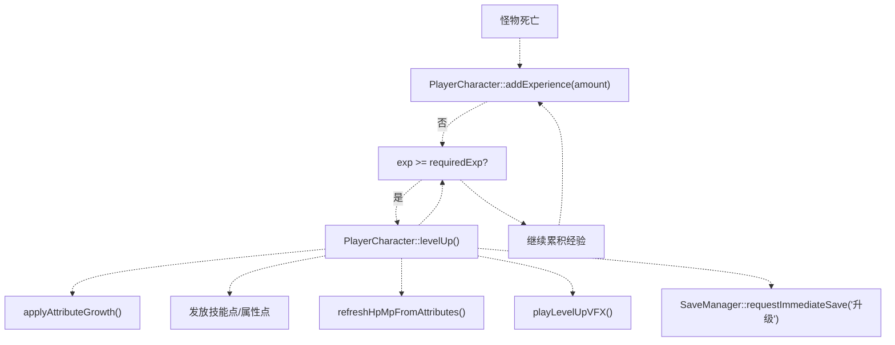
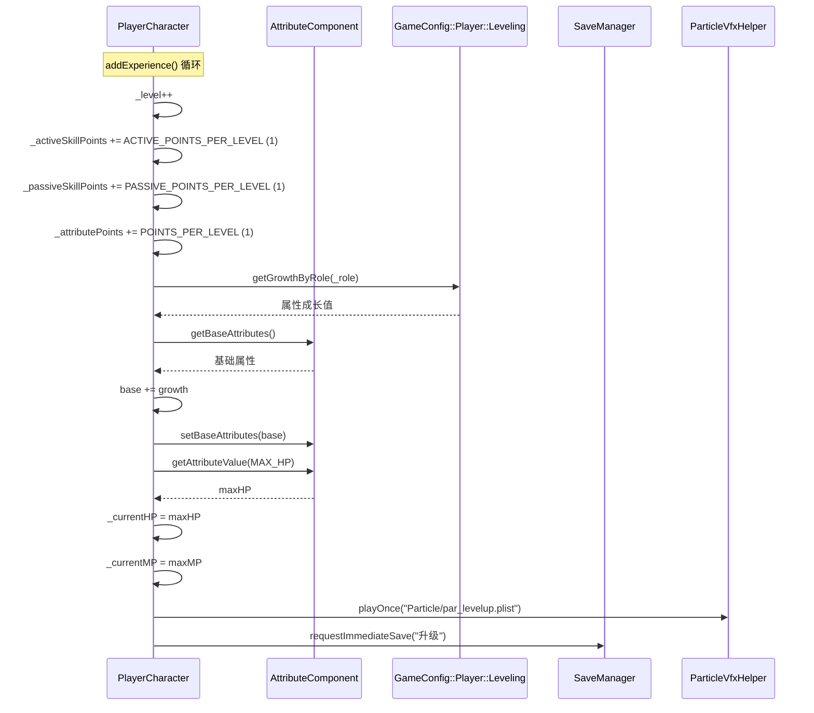
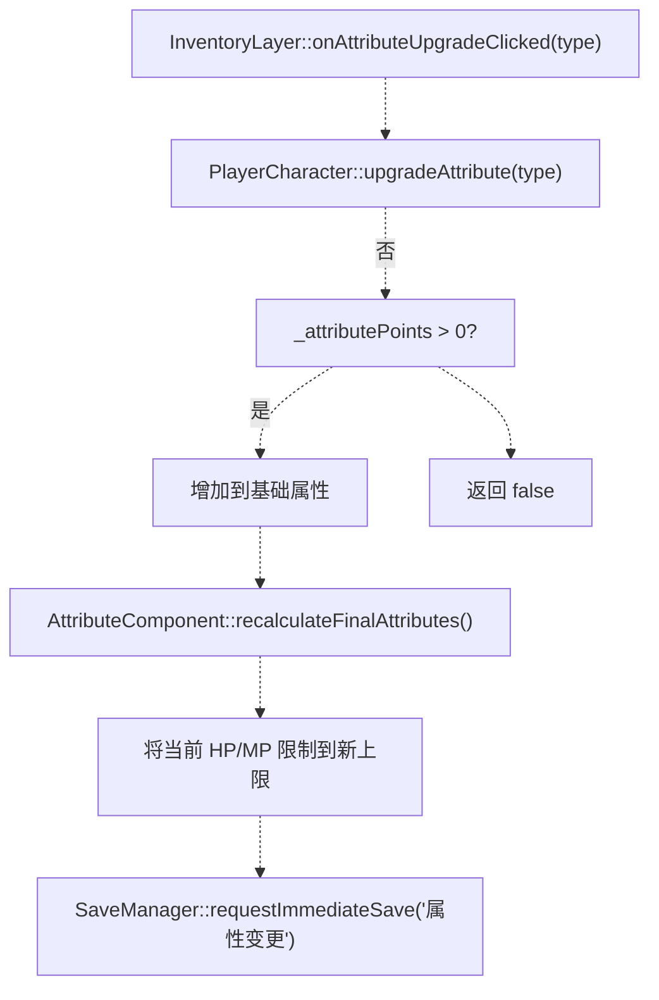
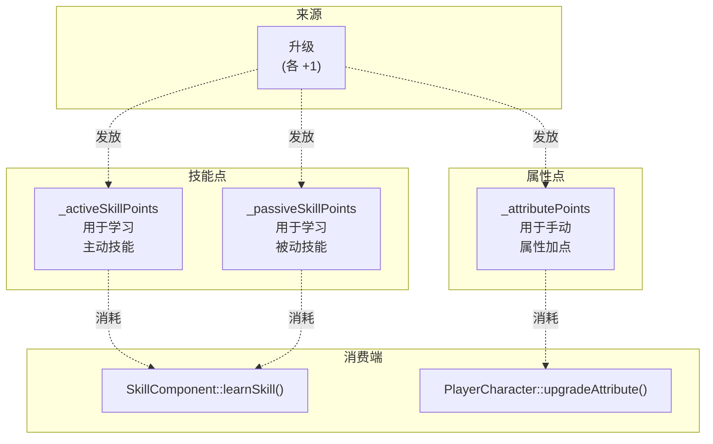
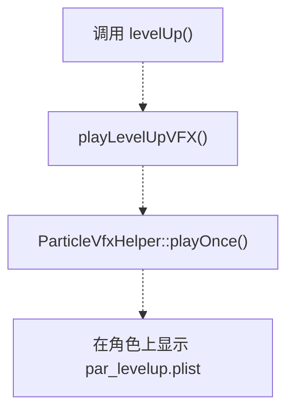
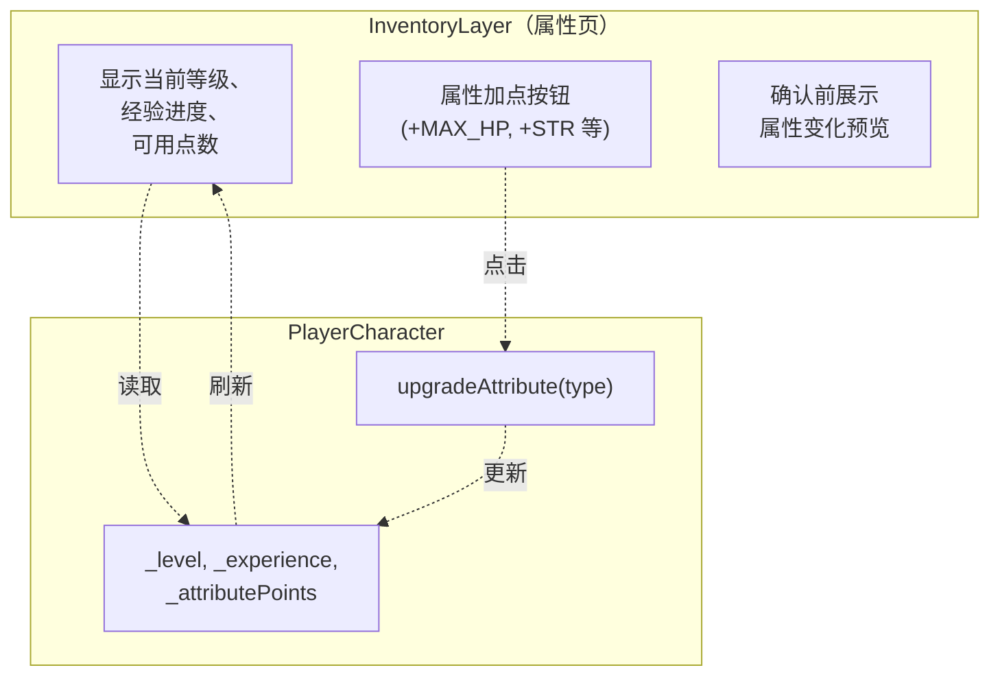
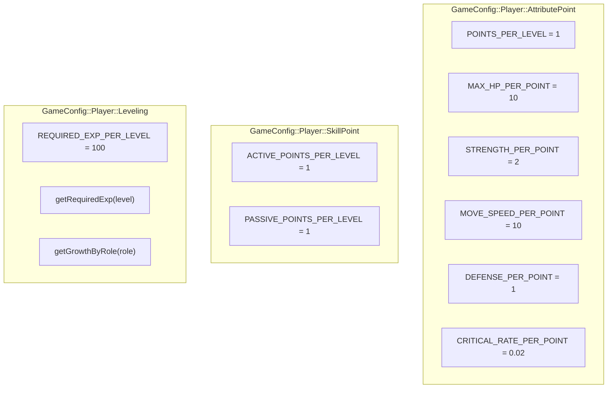

# 升级与成长（Leveling and Progression）

> **相关源文件**
> * [Adventure-King/Classes/Character/Player/PlayerCharacter.cpp](https://github.com/lilong555/Adventure-King/blob/60df0f40/Adventure-King/Classes/Character/Player/PlayerCharacter.cpp)
> * [Adventure-King/Classes/Character/Player/PlayerCharacter.h](https://github.com/lilong555/Adventure-King/blob/60df0f40/Adventure-King/Classes/Character/Player/PlayerCharacter.h)
> * [Adventure-King/Classes/Character/Player/SkillSets/AssassinSkillSet.cpp](https://github.com/lilong555/Adventure-King/blob/60df0f40/Adventure-King/Classes/Character/Player/SkillSets/AssassinSkillSet.cpp)
> * [Adventure-King/Classes/Character/Player/SkillSets/WarriorSkillSet.cpp](https://github.com/lilong555/Adventure-King/blob/60df0f40/Adventure-King/Classes/Character/Player/SkillSets/WarriorSkillSet.cpp)
> * [Adventure-King/Classes/Configs/GameConfig.h](https://github.com/lilong555/Adventure-King/blob/60df0f40/Adventure-King/Classes/Configs/GameConfig.h)
> * [Adventure-King/Classes/Scenes/CombatContactHelper.cpp](https://github.com/lilong555/Adventure-King/blob/60df0f40/Adventure-King/Classes/Scenes/CombatContactHelper.cpp)
> * [Adventure-King/Classes/UI/InventoryLayer.cpp](https://github.com/lilong555/Adventure-King/blob/60df0f40/Adventure-King/Classes/UI/InventoryLayer.cpp)
> * [Adventure-King/Classes/UI/InventoryLayer.h](https://github.com/lilong555/Adventure-King/blob/60df0f40/Adventure-King/Classes/UI/InventoryLayer.h)
> * [Adventure-King/Classes/UI/SkillBar.cpp](https://github.com/lilong555/Adventure-King/blob/60df0f40/Adventure-King/Classes/UI/SkillBar.cpp)

## 目的与范围

本页记录玩家角色的成长系统，包括经验获取、升级、属性成长与成长资源分配。内容覆盖玩家如何通过获取经验推进角色等级、消耗属性点强化属性，以及获得技能点用于解锁能力。

关于使用技能点学习与装备技能的说明，请参阅 [技能系统](<技能系统.md>)。关于装备带来的属性提升，请参阅 [装备与背包](<装备与背包.md>)。

---

## 核心数据模型

玩家角色维护如下与成长相关的状态：

| 字段 | 类型 | 说明 | 存储位置 |
| --- | --- | --- | --- |
| `_level` | `int` | 当前角色等级 | [PlayerCharacter.h L302](https://github.com/lilong555/Adventure-King/blob/60df0f40/PlayerCharacter.h#L302-L302) |
| `_experience` | `int` | 当前经验值 | 继承自 `CharacterBase` |
| `_activeSkillPoints` | `int` | 未消耗的主动技能点 | [PlayerCharacter.h L304](https://github.com/lilong555/Adventure-King/blob/60df0f40/PlayerCharacter.h#L304-L304) |
| `_passiveSkillPoints` | `int` | 未消耗的被动技能点 | [PlayerCharacter.h L305](https://github.com/lilong555/Adventure-King/blob/60df0f40/PlayerCharacter.h#L305-L305) |
| `_attributePoints` | `int` | 未消耗的属性点（用于手动加点） | [PlayerCharacter.h L306](https://github.com/lilong555/Adventure-King/blob/60df0f40/PlayerCharacter.h#L306-L306) |

**来源：** [PlayerCharacter.h L302-L306](https://github.com/lilong555/Adventure-King/blob/60df0f40/PlayerCharacter.h#L302-L306)

---

## 经验与升级流程



**经验计算：**

经验需求采用线性增长公式，定义在 `GameConfig::Player::Leveling::getRequiredExp(level)`：

```
requiredExp = level * REQUIRED_EXP_PER_LEVEL
```

其中 `REQUIRED_EXP_PER_LEVEL = 100`，即 1→2 级需要 100 XP，2→3 级需要 200 XP，以此类推。

**来源：** [PlayerCharacter.cpp L537-L578](https://github.com/lilong555/Adventure-King/blob/60df0f40/PlayerCharacter.cpp#L537-L578)

 [GameConfig.h L220-L233](https://github.com/lilong555/Adventure-King/blob/60df0f40/GameConfig.h#L220-L233)

---

## 升级流程

当玩家获取足够经验触发升级时，会按以下顺序执行操作：



**每级发放点数：**

| 资源 | 获得点数 | 配置常量 |
| --- | --- | --- |
| 主动技能点 | 1 | `GameConfig::Player::SkillPoint::ACTIVE_POINTS_PER_LEVEL` |
| 被动技能点 | 1 | `GameConfig::Player::SkillPoint::PASSIVE_POINTS_PER_LEVEL` |
| 属性点 | 1 | `GameConfig::Player::AttributePoint::POINTS_PER_LEVEL` |

**来源：** [PlayerCharacter.cpp L554-L578](https://github.com/lilong555/Adventure-King/blob/60df0f40/PlayerCharacter.cpp#L554-L578)

 [GameConfig.h L276-L281](https://github.com/lilong555/Adventure-King/blob/60df0f40/GameConfig.h#L276-L281)

 [GameConfig.h L263-L273](https://github.com/lilong555/Adventure-King/blob/60df0f40/GameConfig.h#L263-L273)

---

## 自动属性成长

角色每次升级时，其基础属性会根据职业自动增长。该成长通过 `applyAttributeGrowth()` 应用，并查询 `GameConfig::Player::Leveling::getGrowthByRole()` 得到成长值。

### 职业成长系数

| 职业 | MAX_HP | MAX_MP | STRENGTH | DEFENSE |
| --- | --- | --- | --- | --- |
| 战士（Warrior） | +15 | +2 | +3 | +1.5 |
| 法师（Mage） | +8 | +10 | +1 | +0.5 |
| 刺客（Assassin） | +10* | +2* | +2* | +1* |
| 坦克/其他（默认） | +10 | +0 | +2 | +0 |

*注：当前实现中 Assassin 走默认分支。

**实现细节：**

成长值会直接加到角色基础属性上，随后由 `AttributeComponent` 重新计算得到最终属性（基础 + 装备加成 + 状态效果）。

**来源：** [PlayerCharacter.cpp L583-L596](https://github.com/lilong555/Adventure-King/blob/60df0f40/PlayerCharacter.cpp#L583-L596)

 [GameConfig.h L235-L260](https://github.com/lilong555/Adventure-King/blob/60df0f40/GameConfig.h#L235-L260)

---

## 手动消耗属性点（加点）

玩家可以通过背包 UI 手动分配属性点，以自定义角色构筑。每个未消耗点数都可以投入到五项核心属性之一。



### 属性点换算比例

| 属性类型 | 每点提升数值 | 配置常量 |
| --- | --- | --- |
| MAX_HP | +10 | `MAX_HP_PER_POINT` |
| STRENGTH | +2 | `STRENGTH_PER_POINT` |
| MOVE_SPEED | +10 | `MOVE_SPEED_PER_POINT` |
| DEFENSE | +1 | `DEFENSE_PER_POINT` |
| `CRITICAL_RATE` | +0.02（+2%） | `CRITICAL_RATE_PER_POINT` |

**关键行为：**

1. **校验：** 在应用升级前检查点数是否足够 [PlayerCharacter.cpp L608-L611](https://github.com/lilong555/Adventure-King/blob/60df0f40/PlayerCharacter.cpp#L608-L611)
2. **不可退点：** 一旦消耗，属性点无法返还
3. **HP/MP 保留：** 当前 HP/MP 会被限制到新上限，但不会按比例缩放 [PlayerCharacter.cpp L653-L654](https://github.com/lilong555/Adventure-King/blob/60df0f40/PlayerCharacter.cpp#L653-L654)
4. **即时存档：** 属性变更会触发即时存档请求，避免进度丢失 [PlayerCharacter.cpp L657-L660](https://github.com/lilong555/Adventure-King/blob/60df0f40/PlayerCharacter.cpp#L657-L660)

**来源：** [PlayerCharacter.cpp L606-L662](https://github.com/lilong555/Adventure-King/blob/60df0f40/PlayerCharacter.cpp#L606-L662)

 [GameConfig.h L263-L273](https://github.com/lilong555/Adventure-King/blob/60df0f40/GameConfig.h#L263-L273)

---

## 成长资源管理



**消耗场景：**

* **主动技能点：** 学习新的主动能力时由 `SkillComponent::learnActiveSkill()` 消耗。详情参见 [技能系统](<技能系统.md>)。
* **被动技能点：** 学习新的被动能力时由 `SkillComponent::learnPassiveSkill()` 消耗。详情参见 [技能系统](<技能系统.md>)。
* **属性点：** 通过 `PlayerCharacter::upgradeAttribute()` 手动提升基础属性时消耗。

**来源：** [PlayerCharacter.h L51-L63](https://github.com/lilong555/Adventure-King/blob/60df0f40/PlayerCharacter.h#L51-L63)

 [PlayerCharacter.cpp L554-L560](https://github.com/lilong555/Adventure-King/blob/60df0f40/PlayerCharacter.cpp#L554-L560)

---

## 初始属性分配

当 `PlayerCharacter` 首次创建时，会通过 `initAttributesByRole()` 获得按职业区分的初始属性：

| 职业 | STRENGTH | DEFENSE | CRITICAL_RATE | MOVE_SPEED | MAX_HP | MAX_MP |
| --- | --- | --- | --- | --- | --- | --- |
| 战士（Warrior） | 10 | 5 | 0.10（10%） | 200 | 100 | 1000* |
| 法师（Mage） | 4 | 2 | 0.15（15%） | 180 | 70 | 80 |
| 刺客（Assassin） | 7 | 3 | 0.25（25%） | 240 | 80 | 40 |
| 坦克（Tank） | 6 | 8 | 0.05（5%） | 160 | 150 | 20 |

*战士的 MAX_MP 使用默认值 `GameConfig::Player::DEFAULT_MAX_MP = 1000.0f`

这些初始值对应 1 级角色（尚未应用自动成长或手动加点）。

**来源：** [PlayerCharacter.cpp L664-L707](https://github.com/lilong555/Adventure-King/blob/60df0f40/PlayerCharacter.cpp#L664-L707)

 [GameConfig.h L217](https://github.com/lilong555/Adventure-King/blob/60df0f40/GameConfig.h#L217-L217)

---

## 视觉反馈



当角色升级时，会播放粒子特效来提供视觉反馈：

* **粒子文件：** `"Particle/par_levelup.plist"`
* **挂载方式：** 直接在 `PlayerCharacter` 节点上播放
* **持续时间：** 一次性播放，结束后自动移除

**来源：** [PlayerCharacter.cpp L601-L604](https://github.com/lilong555/Adventure-King/blob/60df0f40/PlayerCharacter.cpp#L601-L604)

---

## 与存档系统的集成

所有成长相关状态都会通过存档系统持久化。一些关键操作会触发即时存档请求：

| 操作 | 存档触发 | 原因标签 |
| --- | --- | --- |
| 升级 | `SaveManager::requestImmediateSave("升级")` | [PlayerCharacter.cpp L574-L577](https://github.com/lilong555/Adventure-King/blob/60df0f40/PlayerCharacter.cpp#L574-L577) |
| 属性加点 | `SaveManager::requestImmediateSave("属性变更")` | [PlayerCharacter.cpp L657-L660](https://github.com/lilong555/Adventure-King/blob/60df0f40/PlayerCharacter.cpp#L657-L660) |

**保存字段：**

以下成长数据会被序列化到 `PlayerSaveData`（由 `SaveManager` 管理）：

* `level` - 当前角色等级
* `experience` - 当前等级内的经验值
* `activeSkillPoints` - 未消耗的主动技能点
* `passiveSkillPoints` - 未消耗的被动技能点
* `attributePoints` - 未消耗的属性点
* 基础属性（包含自动成长与手动加点后的最终基础值）

**读档流程：**

加载存档时：

1. `SaveManager::getRuntimePlayerData()` 获取缓存的存档数据
2. `GameScene` 将数据应用到玩家角色
3. 通过 `AttributeComponent::setBaseAttributes()` 恢复基础属性
4. 通过 setter 恢复点数：`setActiveSkillPoints()` 等
5. `refreshHpMpFromAttributes()` 确保 HP/MP 与属性值一致

**来源：** [PlayerCharacter.cpp L574-L660](https://github.com/lilong555/Adventure-King/blob/60df0f40/PlayerCharacter.cpp#L574-L660)

 [Save/SaveManager documentation](<存档管理器（SaveManager）.md>)

---

## UI 展示

成长系统通过 `InventoryLayer` 的属性页与玩家交互：



**关键 UI 函数：**

* `InventoryLayer::refreshAttributePage()` - 展示当前属性、可用点数与加点选项
* `InventoryLayer::onAttributeUpgradeClicked()` - 处理属性点消耗
* 进度条通过 `GameConfig::Player::Leveling::getRequiredExp()` 展示距离下一级的经验进度

**来源：** [InventoryLayer.cpp](https://github.com/lilong555/Adventure-King/blob/60df0f40/InventoryLayer.cpp#LNaN-LNaN)

 [InventoryLayer.h L48-L54](https://github.com/lilong555/Adventure-King/blob/60df0f40/InventoryLayer.h#L48-L54)

---

## 配置项速查

所有成长相关的可调参数都集中在 `GameConfig.h` 中，便于平衡调参：



**设计说明：**

* 线性经验增长（`level * 100`）让成长更可预测，但高等级可能会显得偏肝
* 所有职业每级获得的点数相同（1 主动、1 被动、1 属性）
* 差异主要来自职业专属的自动成长与初始属性
* 代码未强制等级上限；经验需求会无限增长

**来源：** [GameConfig.h L220-L273](https://github.com/lilong555/Adventure-King/blob/60df0f40/GameConfig.h#L220-L273)
