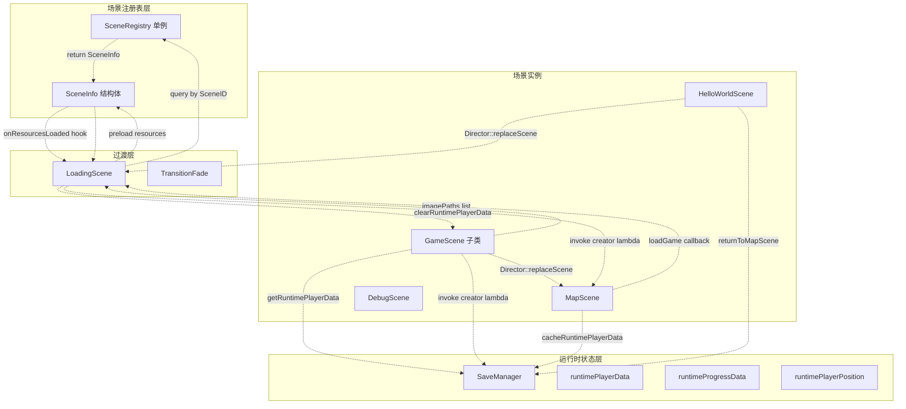
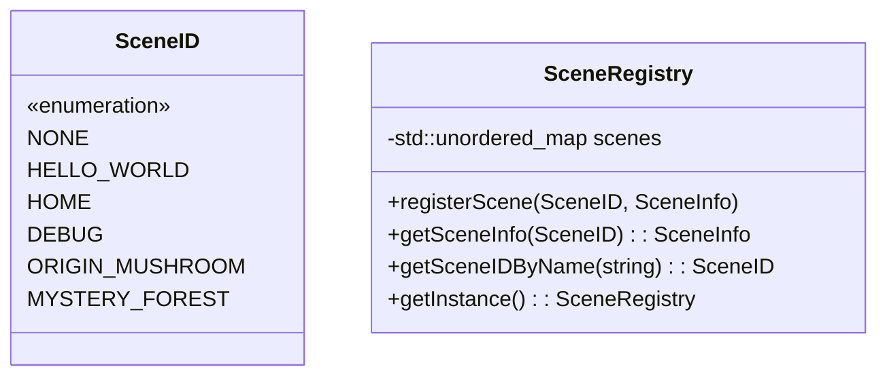
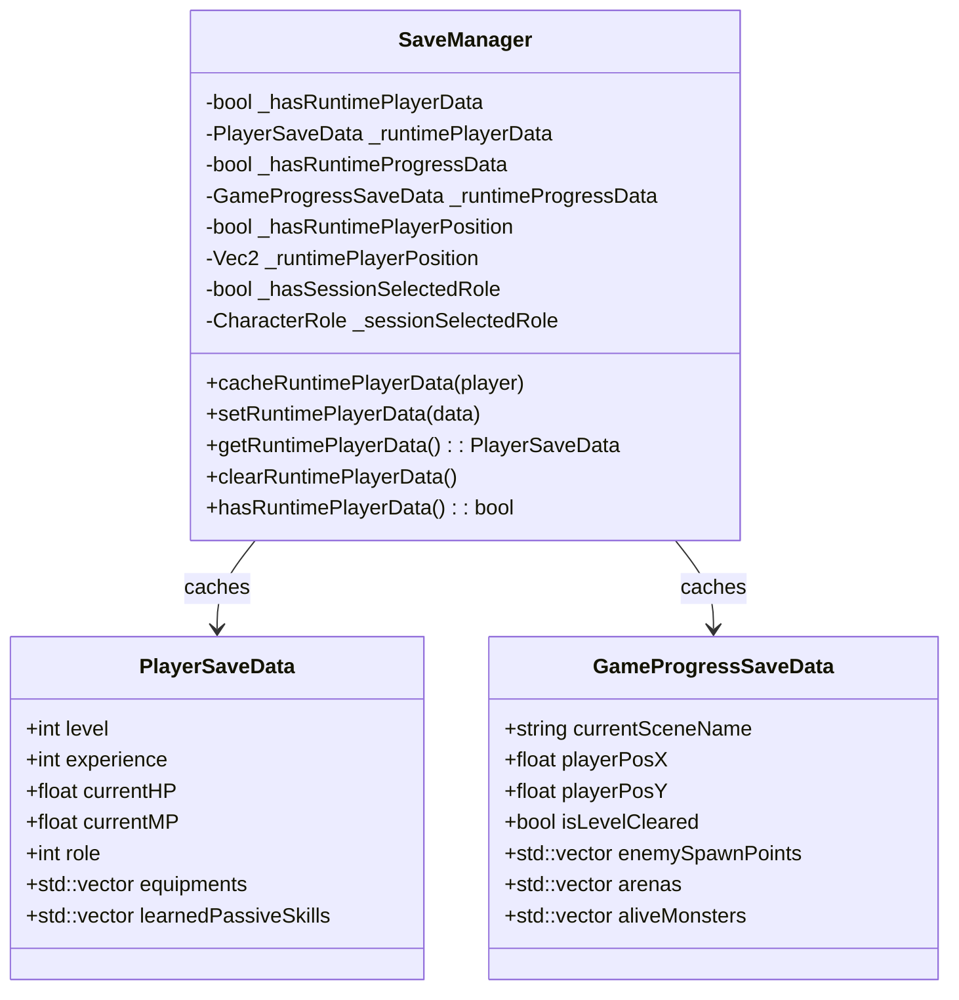
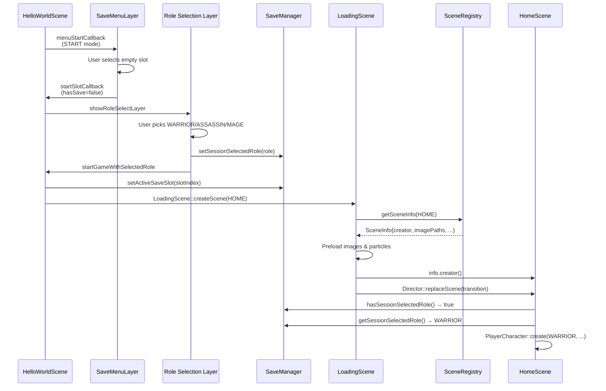
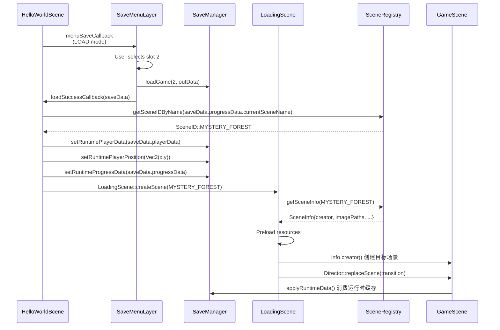
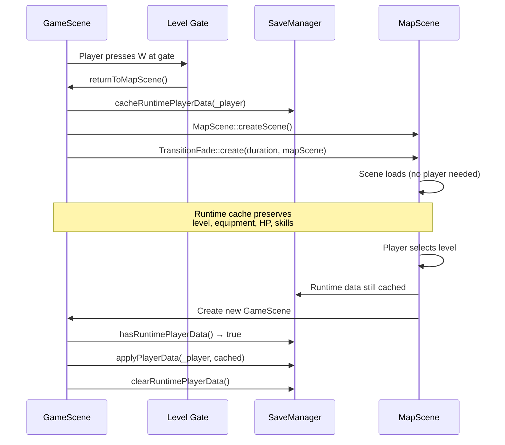

# 场景切换

> **相关源文件**
> * [Adventure-King/Classes/Save/SaveManager.h](https://github.com/lilong555/Adventure-King/blob/60df0f40/Adventure-King/Classes/Save/SaveManager.h)
> * [Adventure-King/Classes/Scenes/DebugScene.cpp](https://github.com/lilong555/Adventure-King/blob/60df0f40/Adventure-King/Classes/Scenes/DebugScene.cpp)
> * [Adventure-King/Classes/Scenes/DebugScene.h](https://github.com/lilong555/Adventure-King/blob/60df0f40/Adventure-King/Classes/Scenes/DebugScene.h)
> * [Adventure-King/Classes/Scenes/GameScene.cpp](https://github.com/lilong555/Adventure-King/blob/60df0f40/Adventure-King/Classes/Scenes/GameScene.cpp)
> * [Adventure-King/Classes/Scenes/GameScene.h](https://github.com/lilong555/Adventure-King/blob/60df0f40/Adventure-King/Classes/Scenes/GameScene.h)
> * [Adventure-King/Classes/Scenes/HelloWorldScene.cpp](https://github.com/lilong555/Adventure-King/blob/60df0f40/Adventure-King/Classes/Scenes/HelloWorldScene.cpp)
> * [Adventure-King/Classes/Scenes/HelloWorldScene.h](https://github.com/lilong555/Adventure-King/blob/60df0f40/Adventure-King/Classes/Scenes/HelloWorldScene.h)
> * [Adventure-King/Classes/Scenes/Layers/SaveMenuLayer.cpp](https://github.com/lilong555/Adventure-King/blob/60df0f40/Adventure-King/Classes/Scenes/Layers/SaveMenuLayer.cpp)
> * [Adventure-King/Classes/Scenes/Layers/SaveMenuLayer.h](https://github.com/lilong555/Adventure-King/blob/60df0f40/Adventure-King/Classes/Scenes/Layers/SaveMenuLayer.h)
> * [Adventure-King/proj.win32/Adventure-King.vcxproj](https://github.com/lilong555/Adventure-King/blob/60df0f40/Adventure-King/proj.win32/Adventure-King.vcxproj)
> * [Adventure-King/proj.win32/Adventure-King.vcxproj.filters](https://github.com/lilong555/Adventure-King/blob/60df0f40/Adventure-King/proj.win32/Adventure-King.vcxproj.filters)

本文描述 Adventure-King 的场景切换系统：它在不同游戏界面（主菜单、关卡选择、玩法关卡等）之间导航，同时管理资源加载与状态保留。

**范围**：本页覆盖场景切换的技术实现，包括 `SceneRegistry`、`LoadingScene` 与运行时数据缓存机制。关于各场景本身的实现（GameScene、MapScene 等），请参阅 [2.1](<GameScene（游戏场景）.md>)。关于触发切换的存/读档操作，请参阅 [6.1](<存档管理器（SaveManager）.md>)。

---

## 系统架构

场景切换系统采用三层架构，将“场景创建”与“导航逻辑”解耦：



**来源**： [Adventure-King/Classes/Managers/SceneRegistry.h](https://github.com/lilong555/Adventure-King/blob/60df0f40/Adventure-King/Classes/Managers/SceneRegistry.h)

 [Adventure-King/Classes/Scenes/LoadingScene.h](https://github.com/lilong555/Adventure-King/blob/60df0f40/Adventure-King/Classes/Scenes/LoadingScene.h)

 [Adventure-King/Classes/Save/SaveManager.h](https://github.com/lilong555/Adventure-King/blob/60df0f40/Adventure-King/Classes/Save/SaveManager.h)

 [Adventure-King/Classes/Scenes/GameScene.cpp L745-L767](https://github.com/lilong555/Adventure-King/blob/60df0f40/Adventure-King/Classes/Scenes/GameScene.cpp#L745-L767)

---

## SceneRegistry 系统

`SceneRegistry` 集中管理场景元数据，并通过强类型的 `SceneID` 枚举提供类型安全的场景创建。

### SceneID 枚举

游戏中每个场景都分配一个唯一标识：



### 注册模式

每个场景在应用启动期间通过静态 `setupRegistry()` 方法自注册：

**HelloWorldScene 注册示例**：

```markdown
// From HelloWorldScene.cpp:688-711
void HelloWorld::setupRegistry()
{
    SceneInfo info;
    info.creator = []() { return HelloWorld::createScene(); };
    info.imagePaths = HelloWorld::getPreloadResourcePaths();
    info.onResourcesLoaded = []() {
        ParticlePreloadHelper::preloadCommonParticles();
        cocos2d::experimental::AudioEngine::preload("...");
    };
    SceneRegistry::getInstance()->registerScene(SceneID::HELLO_WORLD, info);
}
```

**来源**： [Adventure-King/Classes/Scenes/HelloWorldScene.cpp L688-L711](https://github.com/lilong555/Adventure-King/blob/60df0f40/Adventure-King/Classes/Scenes/HelloWorldScene.cpp#L688-L711)

| 字段 | 用途 | 示例 |
| --- | --- | --- |
| `creator` | 创建场景实例的 lambda | `[]() { return OriginMushroomScene::create(); }` |
| `imagePaths` | 需要预加载的纹理列表 | `{"Scene/Backgrounds/startMenu.png", ...}` |
| `onResourcesLoaded` | 资源加载后的 hook（粒子/音频预热等） | `ParticlePreloadHelper::preloadCommonParticles()` |
| `sceneName` | UI 显示用的人类可读名称 | `"起源蘑菇林"` |

**来源**： [Adventure-King/Classes/Managers/SceneRegistry.h](https://github.com/lilong555/Adventure-King/blob/60df0f40/Adventure-King/Classes/Managers/SceneRegistry.h)

 [Adventure-King/Classes/Scenes/HelloWorldScene.cpp L659-L685](https://github.com/lilong555/Adventure-King/blob/60df0f40/Adventure-King/Classes/Scenes/HelloWorldScene.cpp#L659-L685)

---

## LoadingScene 模式

`LoadingScene` 作为中间层用于预加载资源并在场景之间进行平滑过渡，避免进入资源密集型玩法场景时的掉帧。

### LoadingScene 工作流

```

```

**来源**： [Adventure-King/Classes/Scenes/LoadingScene.cpp](https://github.com/lilong555/Adventure-King/blob/60df0f40/Adventure-King/Classes/Scenes/LoadingScene.cpp)

### 创建与调用

**从主菜单（HelloWorldScene）触发：**

```sql
// HelloWorldScene.cpp:630-633
auto loadingScene = LoadingScene::createScene(targetID);
auto transition = TransitionFade::create(duration, loadingScene, Color3B::BLACK);
Director::getInstance()->replaceScene(transition);
```

**LoadingScene 内部流程：**

1. 通过 `SceneID` 向 `SceneRegistry` 查询对应 `SceneInfo`
2. 同步预加载 `info.imagePaths` 中的所有纹理
3. 调用 `info.onResourcesLoaded()` hook（粒子预热、音频预加载）
4. 调用 `info.creator()` 创建目标场景实例
5. 使用 `TransitionFade` 切换到目标场景

**来源**： [Adventure-King/Classes/Scenes/HelloWorldScene.cpp L619-L633](https://github.com/lilong555/Adventure-King/blob/60df0f40/Adventure-King/Classes/Scenes/HelloWorldScene.cpp#L619-L633)

 [Adventure-King/Classes/Scenes/LoadingScene.cpp](https://github.com/lilong555/Adventure-King/blob/60df0f40/Adventure-King/Classes/Scenes/LoadingScene.cpp)

---

## 运行时数据保留

`SaveManager` 维护一份内存态运行时缓存（runtime cache），用于在场景切换时保留玩家状态而无需磁盘 I/O。这让玩家可以在“关卡 ↔ 地图”之间无缝往返而不丢进度。

### 运行时缓存结构



**来源**： [Adventure-King/Classes/Save/SaveManager.h L179-L273](https://github.com/lilong555/Adventure-King/blob/60df0f40/Adventure-King/Classes/Save/SaveManager.h#L179-L273)

 [Adventure-King/Classes/Save/SaveData.h](https://github.com/lilong555/Adventure-King/blob/60df0f40/Adventure-King/Classes/Save/SaveData.h)

### 缓存生命周期

**写入运行时数据（离开 GameScene）**：

```sql
// GameScene.cpp:745-756
void GameScene::returnToMapScene()
{
    if (_player)
    {
        if (auto saveManager = SaveManager::getInstance())
        {
            saveManager->cacheRuntimePlayerData(_player);
        }
    }
    auto mapScene = MapScene::createScene();
    auto transition = TransitionFade::create(duration, mapScene, Color3B::BLACK);
    Director::getInstance()->replaceScene(transition);
}
```

**读取运行时数据（进入 GameScene）**：

```javascript
// GameScene.cpp:502-509
void GameScene::initPlayer(const Vec2& startPos)
{
    // ... create player character ...
    if (auto saveManager = SaveManager::getInstance())
    {
        if (saveManager->hasRuntimePlayerData())
        {
            saveManager->applyPlayerData(_player, saveManager->getRuntimePlayerData());
        }
    }
}
```

**清理运行时数据（应用到新场景后）**：

```javascript
// GameScene.cpp:100-122 (onEnter)
if (saveManager->hasRuntimePlayerPosition())
{
    const Vec2 savedPos = saveManager->getRuntimePlayerPosition();
    saveManager->clearRuntimePlayerPosition();
    scheduleOnce([this, savedPos](float)
                 {
                     if (this->_player)
                     {
                         this->_player->setPosition(savedPos);
                     }
                 },
                 0.0f,
                 "ApplyRuntimePlayerPosition");
}
```

**来源**： [Adventure-King/Classes/Scenes/GameScene.cpp L745-L756](https://github.com/lilong555/Adventure-King/blob/60df0f40/Adventure-King/Classes/Scenes/GameScene.cpp#L745-L756)

 [Adventure-King/Classes/Scenes/GameScene.cpp L502-L509](https://github.com/lilong555/Adventure-King/blob/60df0f40/Adventure-King/Classes/Scenes/GameScene.cpp#L502-L509)

 [Adventure-King/Classes/Scenes/GameScene.cpp L100-L122](https://github.com/lilong555/Adventure-King/blob/60df0f40/Adventure-King/Classes/Scenes/GameScene.cpp#L100-L122)

| 缓存字段 | 用途 | 何时清理 |
| --- | --- | --- |
| `runtimePlayerData` | 等级、HP、装备、技能 | 应用到新的 `PlayerCharacter` 后 |
| `runtimeProgressData` | 刷怪点、竞技场、存活怪物 | 在 `GameScene::initWithPhysicsConfig` 恢复世界状态后 |
| `runtimePlayerPosition` | 精确 X/Y 坐标 | 在 `onEnter` 里 `scheduleOnce` 应用位置后 |
| `sessionSelectedRole` | 新游戏的职业选择 | 通过 `clearSessionSelectedRole()` 手动清理 |

**来源**： [Adventure-King/Classes/Save/SaveManager.h L179-L273](https://github.com/lilong555/Adventure-King/blob/60df0f40/Adventure-King/Classes/Save/SaveManager.h#L179-L273)

 [Adventure-King/Classes/Scenes/GameScene.cpp L198-L306](https://github.com/lilong555/Adventure-King/blob/60df0f40/Adventure-King/Classes/Scenes/GameScene.cpp#L198-L306)

---

## 场景切换流程模式

### 模式 1：主菜单开始新游戏



**来源**： [Adventure-King/Classes/Scenes/HelloWorldScene.cpp L463-L578](https://github.com/lilong555/Adventure-King/blob/60df0f40/Adventure-King/Classes/Scenes/HelloWorldScene.cpp#L463-L578)

 [Adventure-King/Classes/Scenes/HelloWorldScene.cpp L717-L839](https://github.com/lilong555/Adventure-King/blob/60df0f40/Adventure-King/Classes/Scenes/HelloWorldScene.cpp#L717-L839)

### 模式 2：从存档菜单读取游戏



### 模式 3：关卡 → 地图切换（无磁盘 I/O）



**来源**： [Adventure-King/Classes/Scenes/GameScene.cpp L745-L767](https://github.com/lilong555/Adventure-King/blob/60df0f40/Adventure-King/Classes/Scenes/GameScene.cpp#L745-L767)

 [Adventure-King/Classes/Scenes/MapScene.cpp](https://github.com/lilong555/Adventure-King/blob/60df0f40/Adventure-King/Classes/Scenes/MapScene.cpp)

---

## 关键实现细节

### 场景到场景的过渡时机

所有场景切换统一使用 `TransitionFade`，持续时间由 `GameSceneConfig` 定义：

```sql
// GameSceneConfig::Scene::TRANSITION_DURATION = 0.5f
auto transition = TransitionFade::create(0.5f, targetScene, Color3B::BLACK);
Director::getInstance()->replaceScene(transition);
```

**来源**： [Adventure-King/Classes/Scenes/GameScene.cpp L765](https://github.com/lilong555/Adventure-King/blob/60df0f40/Adventure-King/Classes/Scenes/GameScene.cpp#L765-L765)

 [Adventure-King/Classes/Configs/GameSceneConfig.h](https://github.com/lilong555/Adventure-King/blob/60df0f40/Adventure-King/Classes/Configs/GameSceneConfig.h)

### 活动存档槽绑定

开始游戏时必须选择一个存档槽；该槽会绑定到会话，用于后续所有存档：

```javascript
// HelloWorldScene.cpp:494-495 (START mode callback)
auto saveManager = SaveManager::getInstance();
saveManager->setActiveSaveSlot(slotIndex);

// GameScene.cpp:957-958 (auto-save and manual save)
const int slotIndex = saveManager->getActiveSaveSlot();
const bool ok = saveManager->saveGame(slotIndex, _player, progressData);
```

该设计避免误写入其他存档槽，并确保自动存档与手动存档一致。

**来源**： [Adventure-King/Classes/Scenes/HelloWorldScene.cpp L494](https://github.com/lilong555/Adventure-King/blob/60df0f40/Adventure-King/Classes/Scenes/HelloWorldScene.cpp#L494-L494)

 [Adventure-King/Classes/Scenes/GameScene.cpp L957-L958](https://github.com/lilong555/Adventure-King/blob/60df0f40/Adventure-King/Classes/Scenes/GameScene.cpp#L957-L958)

 [Adventure-King/Classes/Save/SaveManager.h L268-L272](https://github.com/lilong555/Adventure-King/blob/60df0f40/Adventure-King/Classes/Save/SaveManager.h#L268-L272)

### 场景名到 SceneID 的映射

注册表提供 sceneName（存档里存的字符串）与 `SceneID` enum 的双向查找：

```javascript
// HelloWorldScene.cpp:596-610 (load game callback)
const std::string& sceneName = saveData.progressData.currentSceneName;
auto registry = SceneRegistry::getInstance();
SceneID targetID = registry->getSceneIDByName(sceneName);

if (targetID == SceneID::NONE)
{
    CCLOG("读档失败：注册表中不存在场景 [%s]", sceneName.c_str());
    // Fallback to MapScene
}
```

这样存档系统可以使用人类可读的场景名，而切换系统使用类型安全的枚举。

**来源**： [Adventure-King/Classes/Scenes/HelloWorldScene.cpp L596-L610](https://github.com/lilong555/Adventure-King/blob/60df0f40/Adventure-King/Classes/Scenes/HelloWorldScene.cpp#L596-L610)

 [Adventure-King/Classes/Managers/SceneRegistry.h](https://github.com/lilong555/Adventure-King/blob/60df0f40/Adventure-King/Classes/Managers/SceneRegistry.h)

### 资源预加载策略

每个场景在 `getPreloadResourcePaths()` 中声明关键资源：

```cpp
// HelloWorldScene.cpp:659-685
std::vector<std::string> HelloWorld::getPreloadResourcePaths() {
    return {
        "Scene/Backgrounds/startMenu.png",
        "Scene/UI/StartItemNormal.png",
        "Sprites/Characters/Player/man/default/spr_man_run.png",
        // ...职业预览贴图
    };
}
```

`LoadingScene` 会在创建目标场景前同步加载这些资源，避免进入场景后的首帧卡顿。

**来源**： [Adventure-King/Classes/Scenes/HelloWorldScene.cpp L659-L685](https://github.com/lilong555/Adventure-King/blob/60df0f40/Adventure-King/Classes/Scenes/HelloWorldScene.cpp#L659-L685)

 [Adventure-King/Classes/Scenes/LoadingScene.cpp](https://github.com/lilong555/Adventure-King/blob/60df0f40/Adventure-King/Classes/Scenes/LoadingScene.cpp)

### 延迟应用玩家位置

玩家位置恢复会延迟一帧执行，以保证派生场景（如 `HomeScene`）先完成相机/缩放等自定义初始化：

```cpp
// GameScene.cpp:110-118
scheduleOnce([this, savedPos](float)
             {
                 if (this->_player)
                 {
                     this->_player->setPosition(savedPos);
                 }
             },
             0.0f,
             "ApplyRuntimePlayerPosition");
```

**来源**： [Adventure-King/Classes/Scenes/GameScene.cpp L110-L118](https://github.com/lilong555/Adventure-King/blob/60df0f40/Adventure-King/Classes/Scenes/GameScene.cpp#L110-L118)

---

## 总结表

| 组件 | 职责 | 关键方法 |
| --- | --- | --- |
| **SceneRegistry** | 集中管理场景元数据 | `registerScene()`、`getSceneInfo()`、`getSceneIDByName()` |
| **LoadingScene** | 预加载资源并平滑切换 | `createScene(SceneID)`、预加载 imagePaths、调用 creator lambda |
| **SaveManager** | 场景间的运行时状态缓存 | `cacheRuntimePlayerData()`、`setRuntimeProgressData()`、`clearRuntimePlayerData()` |
| **HelloWorldScene** | 主菜单与开局编排 | `menuStartCallback()`、`setSessionSelectedRole()`、`setActiveSaveSlot()` |
| **GameScene** | 玩法关卡到地图的切换 | `returnToMapScene()`、`fillProgressDataForSave()`、`initPlayer()` |
| **TransitionFade** | 场景切换淡入淡出效果 | `create(duration, scene, color)` |

**来源**： [Adventure-King/Classes/Managers/SceneRegistry.h](https://github.com/lilong555/Adventure-King/blob/60df0f40/Adventure-King/Classes/Managers/SceneRegistry.h)

 [Adventure-King/Classes/Scenes/LoadingScene.h](https://github.com/lilong555/Adventure-King/blob/60df0f40/Adventure-King/Classes/Scenes/LoadingScene.h)

 [Adventure-King/Classes/Save/SaveManager.h](https://github.com/lilong555/Adventure-King/blob/60df0f40/Adventure-King/Classes/Save/SaveManager.h)

 [Adventure-King/Classes/Scenes/HelloWorldScene.cpp](https://github.com/lilong555/Adventure-King/blob/60df0f40/Adventure-King/Classes/Scenes/HelloWorldScene.cpp)

 [Adventure-King/Classes/Scenes/GameScene.cpp](https://github.com/lilong555/Adventure-King/blob/60df0f40/Adventure-King/Classes/Scenes/GameScene.cpp)
