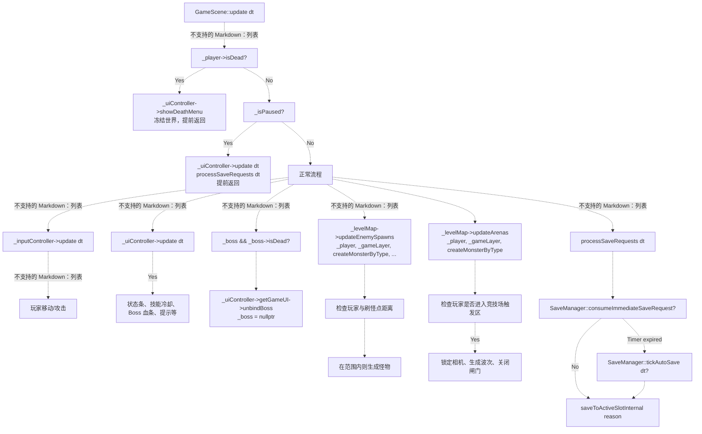

# 场景系统（Scene System）

> **相关源文件**
> * [Adventure-King/Classes/Scenes/DebugScene.cpp](https://github.com/lilong555/Adventure-King/blob/60df0f40/Adventure-King/Classes/Scenes/DebugScene.cpp)
> * [Adventure-King/Classes/Scenes/DebugScene.h](https://github.com/lilong555/Adventure-King/blob/60df0f40/Adventure-King/Classes/Scenes/DebugScene.h)
> * [Adventure-King/Classes/Scenes/GameScene.cpp](https://github.com/lilong555/Adventure-King/blob/60df0f40/Adventure-King/Classes/Scenes/GameScene.cpp)
> * [Adventure-King/Classes/Scenes/GameScene.h](https://github.com/lilong555/Adventure-King/blob/60df0f40/Adventure-King/Classes/Scenes/GameScene.h)
> * [Adventure-King/proj.win32/Adventure-King.vcxproj](https://github.com/lilong555/Adventure-King/blob/60df0f40/Adventure-King/proj.win32/Adventure-King.vcxproj)
> * [Adventure-King/proj.win32/Adventure-King.vcxproj.filters](https://github.com/lilong555/Adventure-King/blob/60df0f40/Adventure-King/proj.win32/Adventure-King.vcxproj.filters)

## 目的与范围

场景系统是 Adventure-King 游戏流程的中央编排者（central orchestrator），管理从主菜单到实际战斗的一切玩法上下文。其重要性评分为 128.91，是代码库中优先级最高的架构组件。该系统负责：

* 场景生命周期（创建、初始化、切换、销毁）
* 编排玩家、怪物、关卡、UI 与输入等系统
* 场景切换期间的资源预加载与状态恢复
* 物理世界初始化与更新循环管理

关于由场景编排的各子系统的详细信息，请参阅：

* 玩家实体管理：[PlayerCharacter](玩家角色（PlayerCharacter）.md)
* 怪物生成与 AI：[MonsterBase](怪物基类（MonsterBase）.md)
* 关卡几何与进度：[LevelMap](关卡地图（LevelMap）.md)
* UI 状态与输入处理：[GameUIController](游戏 UI 控制器（GameUIController）.md)
* 存/读档集成：[SaveManager](存档管理器（SaveManager）.md)

**子页面：**

* [GameScene](GameScene（游戏场景）.md)：核心玩法场景的实现与编排
* [场景切换](场景切换.md)：LoadingScene 与 SceneRegistry 机制
* [调试场景 DebugScene](调试场景（DebugScene）.md)：开发者测试环境

---

## 场景类型分类

代码库定义了一套场景类型层级，每类场景在游戏流程中承担不同职责：

| 场景类型 | 用途 | 基类 | 关键特性 |
| --- | --- | --- | --- |
| `HelloWorldScene` | 主菜单与职业选择 | `cocos2d::Scene` | 入口、存档槽选择、云端认证 |
| `LoadingScene` | 资源预加载与状态恢复 | `cocos2d::Scene` | 异步资源加载、运行时数据搬运 |
| `MapScene` | 关卡选择世界地图 | `cocos2d::Scene` | 进度追踪、关卡解锁 |
| `GameScene` | 所有玩法关卡的基类 | `cocos2d::Scene` | 物理、战斗、刷怪、UI 编排 |
| `HomeScene` | 枢纽/安全区关卡 | `GameScene` | 玩家安全探索 |
| 具体关卡场景 | 特定战斗关卡 | `GameScene` | TMX 地图、怪物波次、Boss 战 |
| `DebugScene` | 开发者测试沙盒 | `cocos2d::Scene` | 隔离测试功能 |

来源： [Classes/Scenes/GameScene.h L39](https://github.com/lilong555/Adventure-King/blob/60df0f40/Classes/Scenes/GameScene.h#L39-L39)

 [Classes/Scenes/DebugScene.h L79](https://github.com/lilong555/Adventure-King/blob/60df0f40/Classes/Scenes/DebugScene.h#L79-L79)

 图示 1（总体系统架构）

---

## 场景类层级结构

下图展示了场景类的继承结构与关键方法，并说明 `GameScene` 如何作为所有玩法上下文的抽象基类：

```mermaid
classDiagram
    class CocosdScene {
        +init() : bool
        +onEnter()
        +onExit()
        +update(dt)
    }
    class HelloWorldScene {
        Role selection UI
        Save slot management
        +createScene() : Scene
        +init() : bool
    }
    class LoadingScene {
        Query SceneRegistry
        Preload assets
        Restore runtime data
        +createScene(SceneID) : Scene
        +init() : bool
    }
    class MapScene {
        Level selection UI
        Progress tracking
        +createScene() : Scene
        +init() : bool
    }
    class GameScene {
        «abstract»
        -_player PlayerCharacter
        -_gameLayer Node
        -_levelMap unique_ptr<LevelMap>
        -_inputController unique_ptr<GameInputController>
        -_uiController unique_ptr<GameUIController>
        -_isPaused bool
        +createScene() : Scene
        +initWithPhysicsConfig(LevelConfig) : bool
        +fillProgressDataForSave(GameProgressSaveData&)
        +update(dt)
        #initLevelMap(LevelConfig) : bool
        #initPlayer(Vec2)
        #initPhysicsContactListener()
  …2057 chars truncated…ture)
```

---

## GameScene 初始化流水线

`GameScene::initWithPhysicsConfig()` 执行严格的初始化顺序。顺序非常关键，因为后续步骤依赖之前的准备：

```

```

**关键依赖：**

1. `_gameLayer` 必须先于 `LevelMap::load()` 存在（line 152-153）
2. 玩家物理体需要 TMX 的碰撞数据（line 174）
3. 相机跟随需要玩家位置（line 186）
4. UI 绑定需要玩家组件已就绪（line 192）
5. 状态恢复必须在出生点/竞技场设置完成之后、首次 `update()` 之前发生（line 198-318）

来源： [Classes/Scenes/GameScene.cpp L130-L326](https://github.com/lilong555/Adventure-King/blob/60df0f40/Classes/Scenes/GameScene.cpp#L130-L326)

 [Classes/Scenes/GameScene.h L141](https://github.com/lilong555/Adventure-King/blob/60df0f40/Classes/Scenes/GameScene.h#L141-L141)

 图示 4（战斗与怪物系统集成）

---

## 场景生命周期状态

每个场景都会在 `cocos2d::Director` 的管理下经历以下状态：

```

```

**生命周期方法职责：**

| 方法 | 调用者 | 用途 | GameScene 实现 |
| --- | --- | --- | --- |
| `init()` | `create()` 宏 | 资源分配、子系统初始化 | 调用 `initWithPhysicsConfig()` |
| `onEnter()` | `Director` | 场景切换后收尾设置 | 禁用 IME，从运行时缓存恢复玩家位置 |
| `update(dt)` | Scheduler | 逐帧逻辑 | 输入 → UI → 刷怪 → 存档（见 [更新循环](更新循环与运行时逻辑.md)） |
| `onExit()` | `Director` | 场景销毁前清理 | 重新启用 IME |

来源： [Classes/Scenes/GameScene.cpp L84-L128](https://github.com/lilong555/Adventure-King/blob/60df0f40/Classes/Scenes/GameScene.cpp#L84-L128)

 [Classes/Scenes/DebugScene.cpp L90-L161](https://github.com/lilong555/Adventure-King/blob/60df0f40/Classes/Scenes/DebugScene.cpp#L90-L161)

 图示 2（场景切换流程与生命周期）

---

## 场景切换机制

场景切换通过 `SceneRegistry`（用于玩法关卡）与直接调用 `Director::replaceScene()`（用于菜单场景）来实现。下方展示了关卡场景采用的 registry 模式：

```

```

**关键类与方法：**

* **`SceneRegistry`**（[Classes/Managers/SceneRegistry.h](https://github.com/lilong555/Adventure-King/blob/60df0f40/Classes/Managers/SceneRegistry.h)）：管理场景元数据的单例 * `registerScene(SceneID, SceneInfo)`：在 `AppDelegate::applicationDidFinishLaunching()` 期间由各场景的 `setupRegistry()` 静态方法调用 * `getSceneIDByName(string)`：读档时把场景名映射为 enum * `getSceneInfo(SceneID)`：返回包含 creator lambda 与资源列表的 `SceneInfo`
* **`LoadingScene`**（见 [场景切换](场景切换.md)）：异步资源加载器 * `createScene(SceneID)`：静态工厂，传入目标场景 enum * `init()`：查询 registry、预加载资源，并在下一帧调用 creator lambda
* **运行时数据缓存：** `SaveManager` 为“零延迟场景切换”提供的数据桥接 * `cacheRuntimePlayerData(PlayerCharacter*)`：`GameScene::returnToMapScene()` 退出前调用 * `getRuntimePlayerData()`：`GameScene::initPlayer()` 恢复属性等 * `setRuntimePlayerPosition(Vec2)`：由 load 回调设置，在 `GameScene::onEnter()` 消费

**切换示例（读档 → 进入关卡）：**

```python
1. 用户在 SaveMenuLayer 点击“读取存档”
2. 读取回调（GameScene.cpp:604-640）：
   - 从 SaveManager 读取 SaveSlotData
   - 调用 SceneRegistry::getSceneIDByName(saveData.progressData.currentSceneName)
   - 调用 SaveManager::setRuntimePlayerData(saveData.playerData)
   - 调用 SaveManager::setRuntimeProgressData(saveData.progressData)
   - 创建 LoadingScene::createScene(targetID)
3. LoadingScene::init()：
   - 查询 SceneRegistry::getSceneInfo(targetID)
   - 将 sceneInfo.imagePaths 预加载进 SpriteFrameCache
   - 安排调用 sceneInfo.creator()
4. LoadingScene 通过 Director::replaceScene() 切换到目标场景
5. 目标 GameScene::initWithPhysicsConfig()：
   - 检查 SaveManager::hasRuntimePlayerData() → 应用到玩家
   - 检查 SaveManager::hasRuntimeProgressData() → 恢复刷怪状态
6. 目标 GameScene::onEnter()：
   - 检查 SaveManager::hasRuntimePlayerPosition() → 重定位玩家
```

来源： [Classes/Scenes/GameScene.cpp L604-L640](https://github.com/lilong555/Adventure-King/blob/60df0f40/Classes/Scenes/GameScene.cpp#L604-L640)

 [Classes/Managers/SceneRegistry.h](https://github.com/lilong555/Adventure-King/blob/60df0f40/Classes/Managers/SceneRegistry.h)

 图示 2（场景切换流程与生命周期）、图示 5（存/读档数据流架构）

---

## 子系统编排

`GameScene` 作为多个子系统的“指挥”，按依赖顺序初始化它们，并通过 `update(dt)` 循环协调交互：



**更新循环优先级：**

1. **死亡覆盖**（line 869-881）：玩家死亡时只更新 UI 并显示死亡菜单，世界逻辑停止。
2. **暂停覆盖**（line 883-892）：暂停时只更新 UI 与存档系统；物理、输入、刷怪均冻结。
3. **输入 → UI → 战斗**（line 894-914）：正常流程先处理输入（更灵敏），再更新 UI，再做 Boss 清理。
4. **刷怪管理**（line 916-932）：LevelMap 检查距离，生成怪物或竞技场波次。
5. **持久化**（line 934）：处理即时存档请求（升级、换装等触发）与定时自动存档。

**子系统依赖：**

| 子系统 | 初始化 | 更新依赖 | 所有权 |
| --- | --- | --- | --- |
| `PlayerCharacter` | `initPlayer()` line 425 | 所有玩法逻辑都依赖 | `_player` 原始指针（由场景图持有） |
| `LevelMap` | `initLevelMap()` line 391 | 驱动刷怪与竞技场逻辑 | `_levelMap` unique_ptr |
| `GameInputController` | `initInputController()` line 537 | 键盘输入 → 玩家动作 | `_inputController` unique_ptr |
| `GameUIController` | `initUIController()` line 585 | 暂停、背包、状态条管理 | `_uiController` unique_ptr |
| `CombatContactHelper` | `initPhysicsContactListener()` line 524 | 命中框碰撞的静态处理 | 无状态（helper class） |
| `SaveManager` | 单例，无需 init | 轮询存档请求 | 全局单例 |

来源： [Classes/Scenes/GameScene.cpp L864-L935](https://github.com/lilong555/Adventure-King/blob/60df0f40/Classes/Scenes/GameScene.cpp#L864-L935)

 [Classes/Scenes/GameScene.h L216-L218](https://github.com/lilong555/Adventure-King/blob/60df0f40/Classes/Scenes/GameScene.h#L216-L218)

 图示 6（UI 与输入控制流）

---

## DebugScene：隔离测试环境

`DebugScene` 是用于开发/调试的专用场景：它复用 `GameScene` 的子系统（输入、UI、物理），但跳过关卡加载，从而提供可控的测试环境。它体现了：

* 不依赖 TMX 地图的手动物理搭建
* 直接实例化怪物用于战斗测试
* 用于实时检查属性的 Debug UI
* 与 `GameUIController`、`GameInputController` 的集成（与 `GameScene` 一致）

**与 GameScene 的关键差异：**

| 维度 | GameScene | DebugScene |
| --- | --- | --- |
| 基类 | `cocos2d::Scene` → 虚拟 `GameScene` | `cocos2d::Scene`（无继承） |
| 地图加载 | `LevelMap` 解析 TMX | `initPlatforms()` 创建静态盒体 |
| 玩家创建 | `initPlayer()` 使用 TMX 出生点 | `initPlayer()` 固定位置 |
| 怪物生成 | `LevelMap::updateEnemySpawns()` 基于距离 | `initTestMonsters()` 预放置 `TrainingDummyMonster` |
| UI | 完整 `GameUIController` | 相同 `GameUIController` + 调试面板 |
| 场景注册 | 通过 `setupRegistry()` 注册 | 可选注册（主要用于测试 LoadingScene） |

**架构模式：**

`DebugScene` 不继承 `GameScene`，而是 **组合** 复用相同子系统（`_inputController`、`_uiController`、`_gameLayer`）。这表明这些子系统是可复用组件，而不是与 `GameScene` 的继承体系强绑定。

来源： [Classes/Scenes/DebugScene.cpp L90-L144](https://github.com/lilong555/Adventure-King/blob/60df0f40/Classes/Scenes/DebugScene.cpp#L90-L144)

 [Classes/Scenes/DebugScene.h L79-L302](https://github.com/lilong555/Adventure-King/blob/60df0f40/Classes/Scenes/DebugScene.h#L79-L302)

 图示 1（总体系统架构）

---

## 与其他系统的集成点

场景系统是各大子系统的集成中枢。下面列出关键触点：

### 玩家系统

* **创建：** `GameScene::initPlayer()` 实例化 `PlayerCharacter`，应用职业缩放并配置物理体
* **状态恢复：** 若存在运行时缓存，则在 `initPlayer()` 中调用 `SaveManager::applyPlayerData()`
* **回调：** 玩家死亡在 `update()` 中触发 `GameUIController::showDeathMenu()`

组件细节参见 [PlayerCharacter](玩家角色（PlayerCharacter）.md)。

### 怪物系统

* **工厂方法：** `GameScene::createMonsterByType(string)`（line 795-852）将类型字符串映射到具体怪物类
* **刷怪编排：** `LevelMap::updateEnemySpawns()` 每帧调用，并传入 `createMonsterByType` lambda
* **Boss 绑定：** 创建 `GobluMonster` 时触发 `GameUI::bindBoss()` 用于显示血条

AI 与战斗细节参见 [MonsterBase](怪物基类（MonsterBase）.md)。

### 关卡系统

* **TMX 加载：** `LevelMap::load()` 解析 Tiled 地图，提取刷怪点、传送门区域与碰撞几何
* **竞技场管理：** `LevelMap::updateArenas()` 处理波次战斗、闸门锁定与相机控制
* **通关追踪：** `LevelMap::isLevelCleared()` 驱动传送门解锁与关卡切换

世界管理细节参见 [LevelMap](关卡地图（LevelMap）.md)。

### UI 系统

* **状态管理：** `GameUIController` 管理暂停菜单、背包层、死亡菜单优先级
* **输入路由：** `GameInputController` 在 ESC 键触发 `GameUIController::togglePauseMenu()`
* **数据绑定：** UI 组件通过 `GameUI::bindPlayer()` 与 `GameUI::bindBoss()` 读取实时数据

交互流程参见 [GameUIController](游戏 UI 控制器（GameUIController）.md) 与 [GameInputController](游戏输入控制器（GameInputController）.md)。

### 持久化系统

* **存档捕获：** `GameScene::fillProgressDataForSave()` 导出刷怪状态、存活怪物、竞技场进度
* **读档恢复：** `GameScene::initWithPhysicsConfig()` 消费 `SaveManager` 的运行时缓存
* **自动存档：** `GameScene::processSaveRequests()` 每帧轮询 `SaveManager::tickAutoSave()`

存档结构与流程参见 [SaveManager](存档管理器（SaveManager）.md)。

来源： [Classes/Scenes/GameScene.cpp L425-L522](https://github.com/lilong555/Adventure-King/blob/60df0f40/Classes/Scenes/GameScene.cpp#L425-L522)

 [Classes/Scenes/GameScene.cpp L795-L852](https://github.com/lilong555/Adventure-King/blob/60df0f40/Classes/Scenes/GameScene.cpp#L795-L852)

 [Classes/Scenes/GameScene.cpp L328-L389](https://github.com/lilong555/Adventure-King/blob/60df0f40/Classes/Scenes/GameScene.cpp#L328-L389)

 图示 4（战斗与怪物系统集成）、图示 5（存/读档数据流架构）
