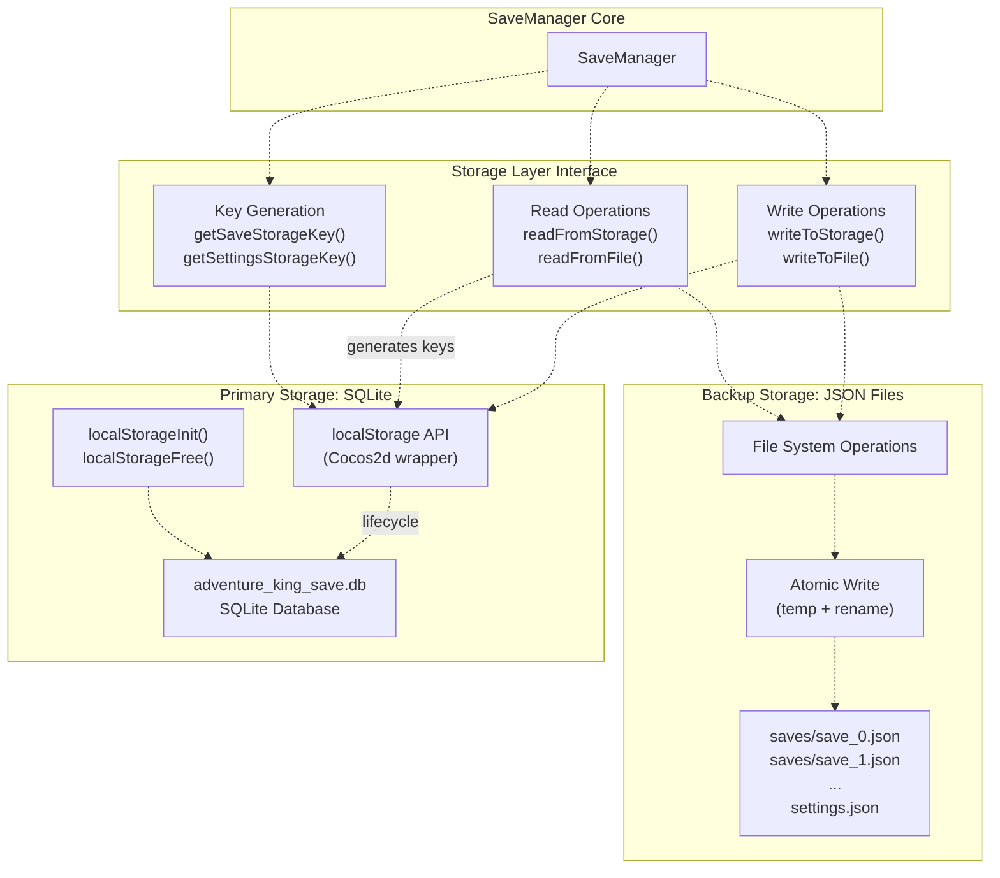
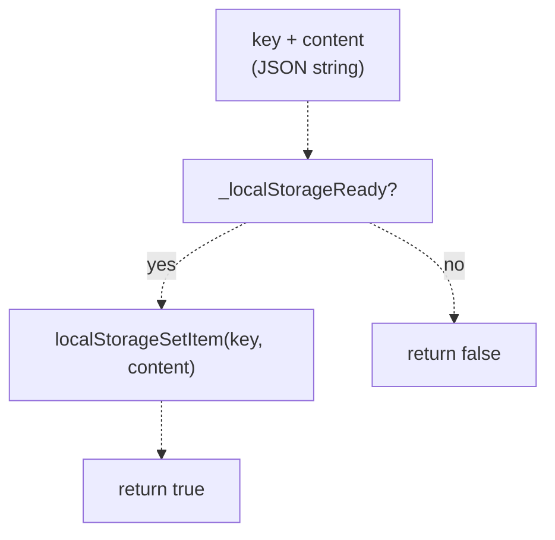
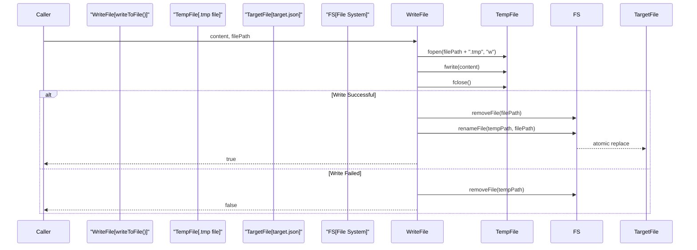
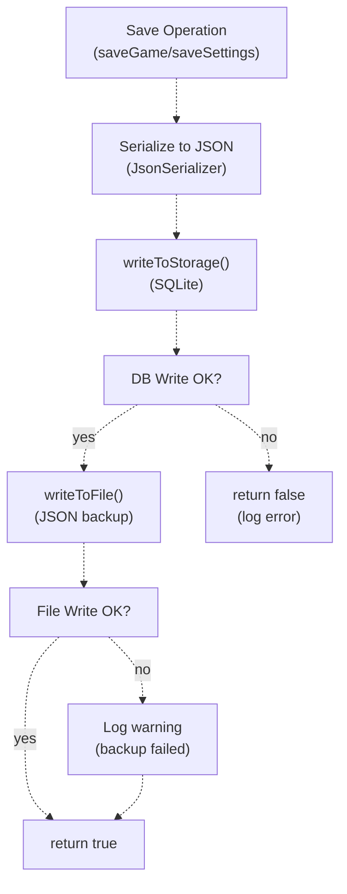
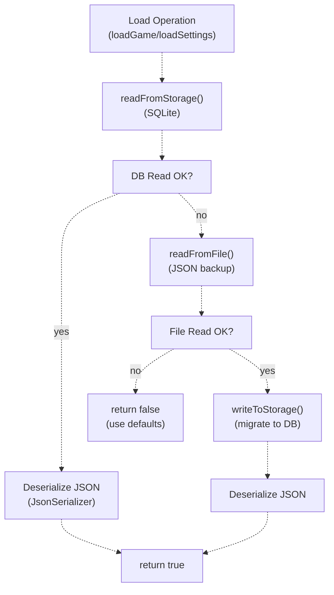
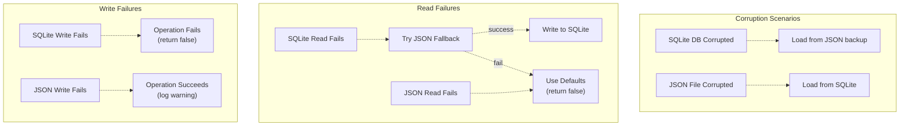

# Storage Layer（存储层）

> **相关源文件**
> * [Adventure-King/Classes/Save/JsonSerializer.cpp](https://github.com/lilong555/Adventure-King/blob/60df0f40/Adventure-King/Classes/Save/JsonSerializer.cpp)
> * [Adventure-King/Classes/Save/SaveData.h](https://github.com/lilong555/Adventure-King/blob/60df0f40/Adventure-King/Classes/Save/SaveData.h)
> * [Adventure-King/Classes/Save/SaveManager.cpp](https://github.com/lilong555/Adventure-King/blob/60df0f40/Adventure-King/Classes/Save/SaveManager.cpp)
> * [Adventure-King/Classes/Save/SaveManager.h](https://github.com/lilong555/Adventure-King/blob/60df0f40/Adventure-King/Classes/Save/SaveManager.h)
> * [Adventure-King/Classes/Scenes/HelloWorldScene.cpp](https://github.com/lilong555/Adventure-King/blob/60df0f40/Adventure-King/Classes/Scenes/HelloWorldScene.cpp)
> * [Adventure-King/Classes/Scenes/HelloWorldScene.h](https://github.com/lilong555/Adventure-King/blob/60df0f40/Adventure-King/Classes/Scenes/HelloWorldScene.h)
> * [Adventure-King/Classes/Scenes/Layers/SaveMenuLayer.cpp](https://github.com/lilong555/Adventure-King/blob/60df0f40/Adventure-King/Classes/Scenes/Layers/SaveMenuLayer.cpp)
> * [Adventure-King/Classes/Scenes/Layers/SaveMenuLayer.h](https://github.com/lilong555/Adventure-King/blob/60df0f40/Adventure-King/Classes/Scenes/Layers/SaveMenuLayer.h)
> * [Adventure-King/Classes/Scenes/LevelMap.cpp](https://github.com/lilong555/Adventure-King/blob/60df0f40/Adventure-King/Classes/Scenes/LevelMap.cpp)
> * [Adventure-King/Classes/Scenes/LevelMap.h](https://github.com/lilong555/Adventure-King/blob/60df0f40/Adventure-King/Classes/Scenes/LevelMap.h)

## 目的与范围

存储层为 SaveManager 系统提供底层持久化基础设施。它实现了“双通道”存储架构：以基于 SQLite 的 Key-Value 存储作为主存储，并以 JSON 文件作为备份（次存储），从而兼顾数据可靠性与跨平台兼容性。

本页记录存储后端、Key 结构、读写操作与原子写机制。关于高层存/读档工作流与数据结构，请参见 [Save and Load Flow](<存取档流程.md>)。关于建立在本地存储之上的云同步，请参见 [Cloud Save Service](<云存档服务.md>)。

---

## 架构概览



**来源**：[Adventure-King/Classes/Save/SaveManager.cpp L1-L80](https://github.com/lilong555/Adventure-King/blob/60df0f40/Adventure-King/Classes/Save/SaveManager.cpp#L1-L80)

 [Adventure-King/Classes/Save/SaveManager.h L321-L331](https://github.com/lilong555/Adventure-King/blob/60df0f40/Adventure-King/Classes/Save/SaveManager.h#L321-L331)

---

## 主存储：localStorage（SQLite）

### 初始化与生命周期

主存储使用 Cocos2d 的 `localStorage` API（对 SQLite 的 KV 封装）。初始化发生在 SaveManager 构造函数中：

| 操作 | 代码位置 | 说明 |
| --- | --- | --- |
| **初始化** | [SaveManager.cpp L48-L69](https://github.com/lilong555/Adventure-King/blob/60df0f40/SaveManager.cpp#L48-L69) | 创建 `saves/` 目录并调用 `localStorageInit()` |
| **数据库路径** | `savesDir + "adventure_king_save.db"` | 可写目录下 SQLite 文件位置 |
| **清理** | [SaveManager.cpp L74-L79](https://github.com/lilong555/Adventure-King/blob/60df0f40/SaveManager.cpp#L74-L79) | 析构时调用 `localStorageFree()` |

**关键初始化代码：**

```cpp
// Constructor initialization
std::string savesDir = FileUtils::getInstance()->getWritablePath() + "saves/";
_localStorageDbPath = savesDir + LOCAL_STORAGE_DB_FILENAME;
localStorageInit(_localStorageDbPath);
_localStorageReady = true;
```

`_localStorageReady` 标记用于避免在数据库尚未初始化时进行操作。

**来源**：[Adventure-King/Classes/Save/SaveManager.cpp L48-L79](https://github.com/lilong555/Adventure-King/blob/60df0f40/Adventure-King/Classes/Save/SaveManager.cpp#L48-L79)

 [Adventure-King/Classes/Save/SaveManager.h L323-L324](https://github.com/lilong555/Adventure-King/blob/60df0f40/Adventure-King/Classes/Save/SaveManager.h#L323-L324)

### Key 结构与命名

所有存储 key 都采用一致的“前缀 + 后缀”命名规范，以避免冲突：

| Key 类型 | 模式 | 构建方法 | 示例 |
| --- | --- | --- | --- |
| **存档槽位** | `"ak_save_slot_{index}"` | `getSaveStorageKey(int)` | `"ak_save_slot_0"` |
| **设置项** | `"ak_settings"` | `getSettingsStorageKey()` | `"ak_settings"` |

**Key 生成逻辑：**

```javascript
// Prefix constant
static const char* const STORAGE_KEY_PREFIX = "ak_";

// Save slot key: "ak_save_slot_0" through "ak_save_slot_4"
std::string SaveManager::getSaveStorageKey(int slotIndex) const {
    return buildStorageKey("save_slot_" + std::to_string(slotIndex));
}

// Settings key: "ak_settings"
std::string SaveManager::getSettingsStorageKey() const {
    return buildStorageKey("settings");
}
```

**来源**：[Adventure-King/Classes/Save/SaveManager.cpp L17-L26](https://github.com/lilong555/Adventure-King/blob/60df0f40/Adventure-King/Classes/Save/SaveManager.cpp#L17-L26)

 [Adventure-King/Classes/Save/SaveManager.cpp L193-L201](https://github.com/lilong555/Adventure-King/blob/60df0f40/Adventure-King/Classes/Save/SaveManager.cpp#L193-L201)

 [Adventure-King/Classes/Save/SaveManager.h L326-L327](https://github.com/lilong555/Adventure-King/blob/60df0f40/Adventure-King/Classes/Save/SaveManager.h#L326-L327)

### 存储操作

存储层在 SQLite 后端上提供 4 个核心操作：

#### 写入



**实现：**[SaveManager.cpp L203-L213](https://github.com/lilong555/Adventure-King/blob/60df0f40/SaveManager.cpp#L203-L213)

* **函数：** `bool writeToStorage(const string& key, const string& content)`
* **校验：** 操作前检查 `_localStorageReady`
* **API 调用：** `localStorageSetItem(key, content)`（Cocos2d 封装）

#### 读取

**实现：**[SaveManager.cpp L215-L224](https://github.com/lilong555/Adventure-King/blob/60df0f40/SaveManager.cpp#L215-L224)

* **函数：** `bool readFromStorage(const string& key, string& outContent)`
* **校验：** 操作前检查 `_localStorageReady`
* **API 调用：** `localStorageGetItem(key, &outContent)` 返回 bool
* **输出：** 写入 `outContent`，并返回成功状态

#### 删除

**实现：**[SaveManager.cpp L226-L236](https://github.com/lilong555/Adventure-King/blob/60df0f40/SaveManager.cpp#L226-L236)

* **函数：** `bool removeFromStorage(const string& key)`
* **API 调用：** `localStorageRemoveItem(key)`

#### 是否存在

**实现：**[SaveManager.cpp L238-L247](https://github.com/lilong555/Adventure-King/blob/60df0f40/SaveManager.cpp#L238-L247)

* **函数：** `bool hasStorageKey(const string& key)`
* **逻辑：** 尝试 `localStorageGetItem`，成功则返回 true

**来源**：[Adventure-King/Classes/Save/SaveManager.cpp L203-L247](https://github.com/lilong555/Adventure-King/blob/60df0f40/Adventure-King/Classes/Save/SaveManager.cpp#L203-L247)

 [Adventure-King/Classes/Save/SaveManager.h L328-L331](https://github.com/lilong555/Adventure-King/blob/60df0f40/Adventure-King/Classes/Save/SaveManager.h#L328-L331)

---

## 备份存储：JSON 文件

### 文件路径结构

JSON 文件用于提供可读性备份与兼容旧存档。路径生成是确定性的：

| 文件类型 | 路径模式 | 构建方法 |
| --- | --- | --- |
| **存档槽位** | `{writablePath}/saves/save_{index}.json` | `getSaveFilePath(int)` |
| **设置项** | `{writablePath}/settings.json` | `getSettingsFilePath()` |

**路径生成代码：**

```javascript
std::string SaveManager::getSaveFilePath(int slotIndex) const {
    return FileUtils::getInstance()->getWritablePath() + 
           "saves/save_" + std::to_string(slotIndex) + ".json";
}

std::string SaveManager::getSettingsFilePath() const {
    return FileUtils::getInstance()->getWritablePath() + "settings.json";
}
```

**来源**：[Adventure-King/Classes/Save/SaveManager.cpp L249-L257](https://github.com/lilong555/Adventure-King/blob/60df0f40/Adventure-King/Classes/Save/SaveManager.cpp#L249-L257)

 [Adventure-King/Classes/Save/SaveManager.h L313-L315](https://github.com/lilong555/Adventure-King/blob/60df0f40/Adventure-King/Classes/Save/SaveManager.h#L313-L315)

### 原子写机制

为防止写入过程中崩溃导致文件损坏，文件层采用“临时文件 + rename”的原子写方案：



**原子写实现步骤：**

1. 写入临时文件（`{filePath}.tmp`）
2. 校验写入字节数与内容长度一致
3. 删除旧目标文件（若存在）
4. 原子重命名：temp → target

**代码流：**[SaveManager.cpp L259-L291](https://github.com/lilong555/Adventure-King/blob/60df0f40/SaveManager.cpp#L259-L291)

```javascript
bool SaveManager::writeToFile(const std::string& filePath, const std::string& content) {
    std::string tempPath = filePath + ".tmp";
    
    FILE* file = fopen(tempPath.c_str(), "w");
    size_t written = fwrite(content.c_str(), 1, content.size(), file);
    fclose(file);
    
    if (written != content.size()) {
        FileUtils::getInstance()->removeFile(tempPath);
        return false;
    }
    
    // Atomic replace: delete old + rename temp
    FileUtils::getInstance()->removeFile(filePath);
    return FileUtils::getInstance()->renameFile(tempPath, filePath);
}
```

**崩溃安全性：** 如果进程在写入期间崩溃，临时文件会被遗留，但原文件仍保持完整；下一次成功写入会清理陈旧临时文件。

**来源**：[Adventure-King/Classes/Save/SaveManager.cpp L259-L291](https://github.com/lilong555/Adventure-King/blob/60df0f40/Adventure-King/Classes/Save/SaveManager.cpp#L259-L291)

### 读取

文件读取使用 Cocos2d 的 `FileUtils::getDataFromFile()`：

**实现：**[SaveManager.cpp L293-L311](https://github.com/lilong555/Adventure-King/blob/60df0f40/SaveManager.cpp#L293-L311)

* **存在性检查：** 读取前验证文件存在
* **读取方法：** `FileUtils::getInstance()->getDataFromFile(filePath)`
* **空值检查：** 若 `Data` 对象为空则返回 false
* **转换：** 将字节数组转换为 `std::string`

**来源**：[Adventure-King/Classes/Save/SaveManager.cpp L293-L311](https://github.com/lilong555/Adventure-King/blob/60df0f40/Adventure-King/Classes/Save/SaveManager.cpp#L293-L311)

---

## 双通道存储操作

### 写入流程（双写）

所有存档与设置项写入都会同时写入**两种**后端：



**关键点：**

* **主路径必须成功：** 如果 SQLite 写入失败，操作立即失败
* **备份路径尽力而为：** SQLite 成功后若 JSON 写入失败，仅记录 warning，仍返回成功
* **原因：** SQLite 是事实来源（source of truth），JSON 用于人工检查/恢复

**来自 saveGame 的示例：**

```
// Write to primary storage (SQLite)
if (!writeToStorage(storageKey, json)) {
    CCLOG("SaveManager::saveGame - 写入本地数据库失败");
    return false;  // Fatal error
}

// Write to backup (JSON file) - non-fatal
if (!writeToFile(filePath, json)) {
    CCLOG("SaveManager::saveGame - 备份 JSON 写入失败（不影响主存档）");
}
```

**来源**：[Adventure-King/Classes/Save/SaveManager.cpp L315-L383](https://github.com/lilong555/Adventure-King/blob/60df0f40/Adventure-King/Classes/Save/SaveManager.cpp#L315-L383)

 [Adventure-King/Classes/Save/SaveManager.cpp L587-L613](https://github.com/lilong555/Adventure-King/blob/60df0f40/Adventure-King/Classes/Save/SaveManager.cpp#L587-L613)

### 读取流程（回退策略）

读取优先使用 SQLite；失败时回退到 JSON：



**回退策略：**

1. **先尝试 SQLite**（主存储）
2. SQLite 读取失败时，**回退到 JSON 文件**
3. **回退成功则迁移：** JSON 读取成功后回写 SQLite（惰性迁移）
4. **两者都失败则使用默认值：** 返回 false，并由调用方决定使用默认或提示用户

**loadGame 的迁移示例：**

```
// Try primary storage
if (!readFromStorage(storageKey, json)) {
    // Fall back to legacy JSON file
    if (!readFromFile(filePath, json)) {
        return false;  // Both failed
    }
    
    // Migrate legacy file to database
    if (writeToStorage(storageKey, json)) {
        CCLOG("SaveManager::loadGame - 已从备份 JSON 恢复到本地数据库");
    }
}
```

**来源**：[Adventure-King/Classes/Save/SaveManager.cpp L385-L422](https://github.com/lilong555/Adventure-King/blob/60df0f40/Adventure-King/Classes/Save/SaveManager.cpp#L385-L422)

 [Adventure-King/Classes/Save/SaveManager.cpp L615-L648](https://github.com/lilong555/Adventure-King/blob/60df0f40/Adventure-King/Classes/Save/SaveManager.cpp#L615-L648)

---

## 错误处理与鲁棒性

### 安全机制

| 机制 | 实现 | 用途 |
| --- | --- | --- |
| **Ready Flag** | 所有 DB 操作前检查 `_localStorageReady` | 防止在未初始化存储上操作 |
| **原子文件写** | 临时文件 + rename | 防止崩溃导致文件半写/损坏 |
| **双写** | SQLite + JSON | 主存坏了也有备份可恢复 |
| **回退读取** | SQLite → JSON | 允许从 SQLite 损坏中恢复 |
| **惰性迁移** | JSON 回退成功后写回 SQLite | 渐进式迁移旧存档 |

**来源**：[Adventure-King/Classes/Save/SaveManager.cpp L204-L224](https://github.com/lilong555/Adventure-King/blob/60df0f40/Adventure-King/Classes/Save/SaveManager.cpp#L204-L224)

 [Adventure-King/Classes/Save/SaveManager.cpp L259-L291](https://github.com/lilong555/Adventure-King/blob/60df0f40/Adventure-King/Classes/Save/SaveManager.cpp#L259-L291)

### 故障模式与恢复



**恢复策略：**

* **SQLite 损坏：** 回退到 JSON 文件，然后回写 SQLite（惰性修复）
* **JSON 损坏：** 从 SQLite 读取（JSON 只是备份）
* **二者都损坏：** 返回 false，由调用方使用默认值或提示用户
* **部分写入（崩溃）：** 临时文件避免目标文件被破坏；下一次写入会清理

**来源**：[Adventure-King/Classes/Save/SaveManager.cpp L385-L422](https://github.com/lilong555/Adventure-King/blob/60df0f40/Adventure-King/Classes/Save/SaveManager.cpp#L385-L422)

 [Adventure-King/Classes/Save/SaveManager.cpp L615-L648](https://github.com/lilong555/Adventure-King/blob/60df0f40/Adventure-King/Classes/Save/SaveManager.cpp#L615-L648)

---

## 存储访问模式

### 为云同步提供的导入/导出

存储层暴露 JSON 导出/导入方法，供云同步使用，而无需直接访问内部存储细节：

| 操作 | 方法 | 存储来源优先级 |
| --- | --- | --- |
| **导出槽位** | `exportSaveSlotToJsonString(int, string&)` | SQLite → JSON 文件（回退） |
| **导入槽位** | `importSaveSlotFromJsonString(int, string, bool)` | 同时写入 SQLite + JSON |
| **导出设置** | `exportSettingsToJsonString(string&)` | SQLite → JSON 文件（回退） |
| **导入设置** | `importSettingsFromJsonString(string)` | 同时写入 SQLite + JSON |

**导出流程：**

```cpp
bool SaveManager::exportSaveSlotToJsonString(int slotIndex, std::string& outJson) {
    // Try SQLite first
    if (readFromStorage(storageKey, outJson)) {
        return true;
    }
    // Fall back to JSON file
    return readFromFile(filePath, outJson);
}
```

**带规范化（Normalization）的导入流程：**

```javascript
bool SaveManager::importSaveSlotFromJsonString(int slotIndex, const std::string& json, bool overwrite) {
    // Deserialize to validate + normalize slot index
    SaveSlotData data;
    JsonSerializer::deserialize(json, data);
    data.slotIndex = slotIndex;  // Force correct slot
    
    // Re-serialize and write to both storages
    std::string normalized = JsonSerializer::serialize(data);
    writeToStorage(storageKey, normalized);
    writeToFile(filePath, normalized);
}
```

**槽位索引规范化：** 导入操作会强制把 `slotIndex` 改为目标槽位，避免云存档带来的槽位 ID 不一致问题。

**来源**：[Adventure-King/Classes/Save/SaveManager.cpp L652-L768](https://github.com/lilong555/Adventure-King/blob/60df0f40/Adventure-King/Classes/Save/SaveManager.cpp#L652-L768)

 [Adventure-King/Classes/Save/SaveManager.h L139-L159](https://github.com/lilong555/Adventure-King/blob/60df0f40/Adventure-King/Classes/Save/SaveManager.h#L139-L159)

---

## 平台注意事项

### 可写目录差异

存储层使用 `FileUtils::getInstance()->getWritablePath()`，它在不同平台返回不同目录：

| 平台 | 典型可写路径 |
| --- | --- |
| **Windows** | `{exe_directory}/` |
| **macOS** | `~/Library/Application Support/{app_name}/` |
| **Linux** | `~/.local/share/{app_name}/` |
| **Android** | `/data/data/{package}/files/` |
| **iOS** | `{app_sandbox}/Documents/` |

SQLite 数据库与 JSON 文件都存放在该路径下的固定子目录结构（`saves/`）中。

**来源**：[Adventure-King/Classes/Save/SaveManager.cpp L56-L62](https://github.com/lilong555/Adventure-King/blob/60df0f40/Adventure-King/Classes/Save/SaveManager.cpp#L56-L62)

### 跨平台兼容性

双存储方案提供良好的跨平台兼容性：

* **SQLite：** 原生二进制格式，通过 Cocos2d 跨平台封装的 `localStorage` API 使用
* **JSON 文件：** 文本格式，便于人工阅读且平台无关
* **原子写：** 通过 Cocos2d `FileUtils` 使用平台相关的文件系统调用

**来源**：[Adventure-King/Classes/Save/SaveManager.cpp L48-L79](https://github.com/lilong555/Adventure-King/blob/60df0f40/Adventure-King/Classes/Save/SaveManager.cpp#L48-L79)
