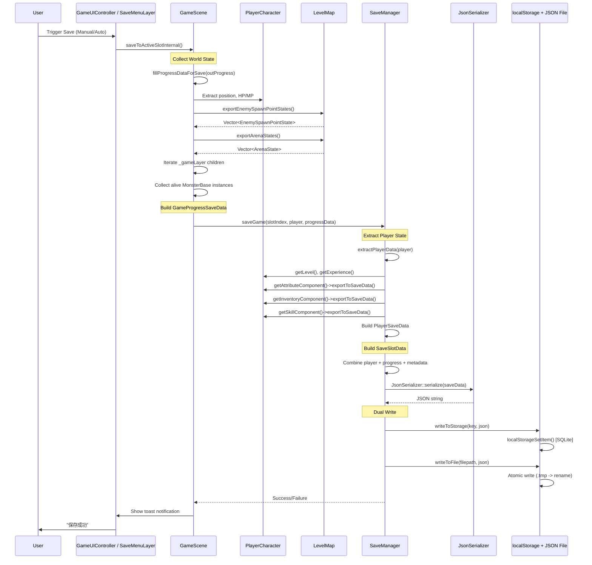
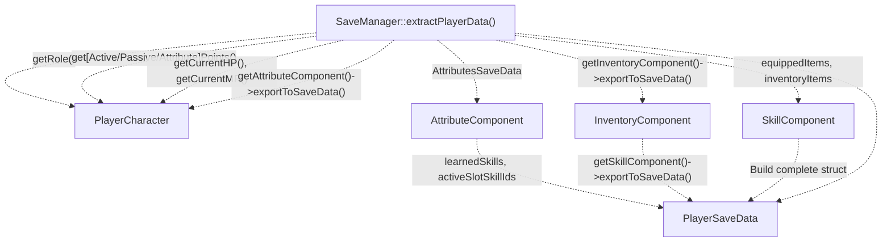
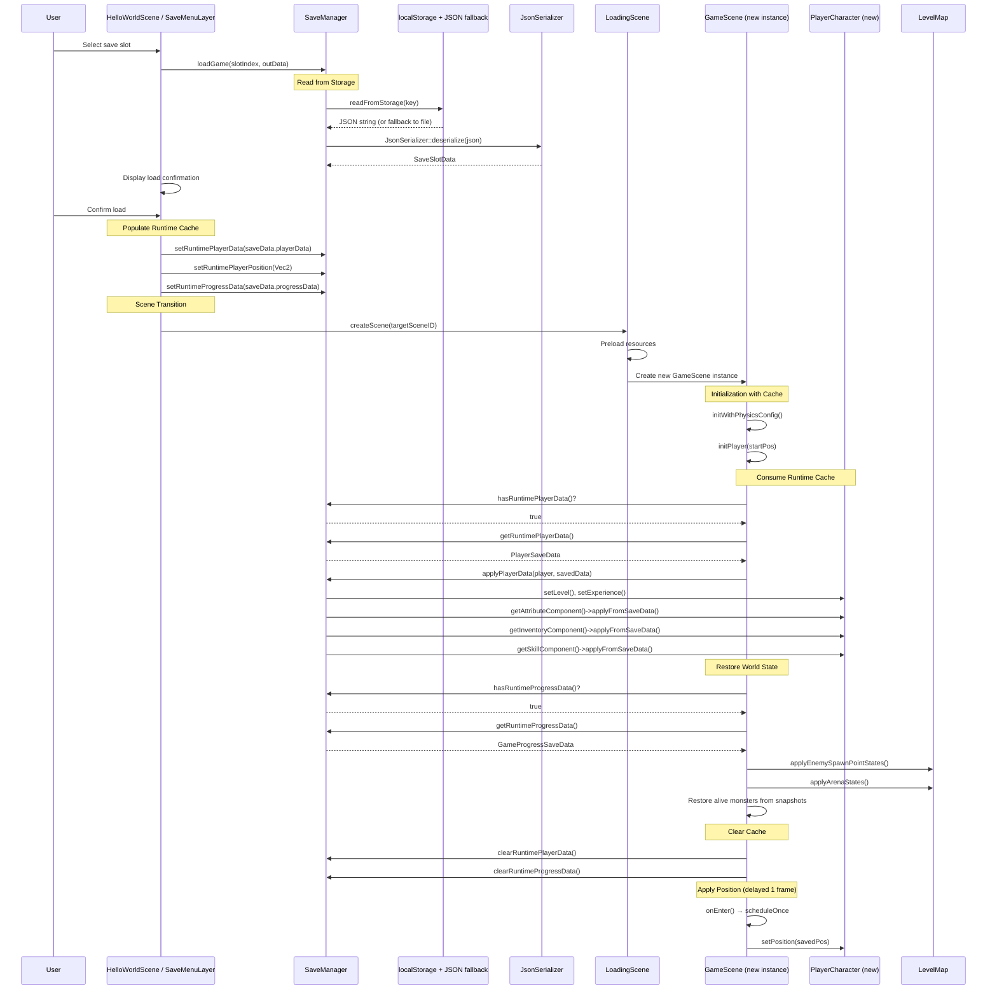
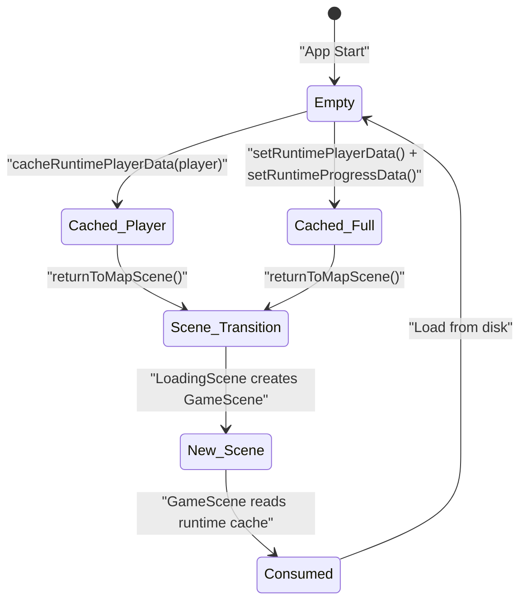
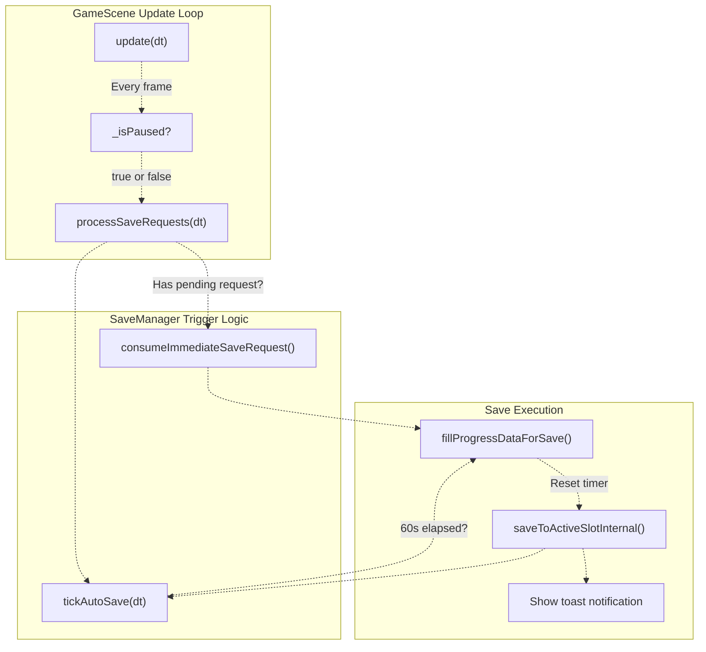
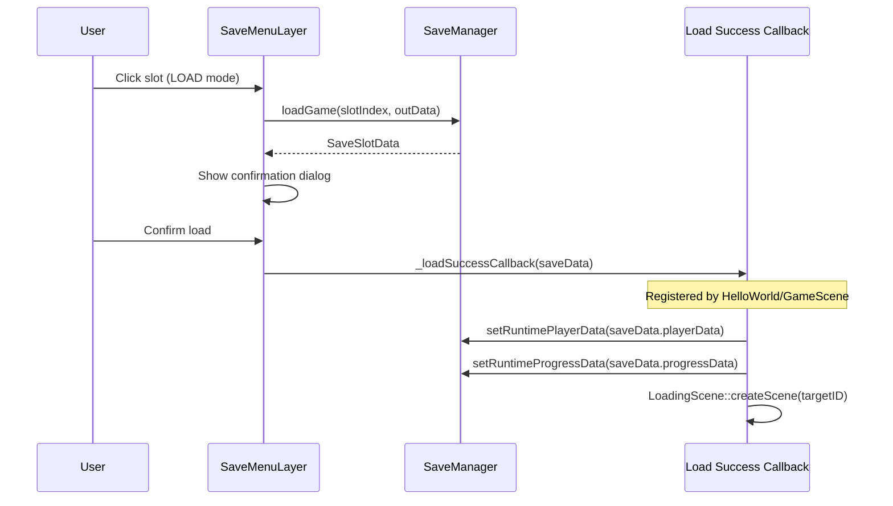

# 存取档流程

> **相关源文件（Relevant source files）**
> * [Adventure-King/Classes/Save/JsonSerializer.cpp](https://github.com/lilong555/Adventure-King/blob/60df0f40/Adventure-King/Classes/Save/JsonSerializer.cpp)
> * [Adventure-King/Classes/Save/SaveData.h](https://github.com/lilong555/Adventure-King/blob/60df0f40/Adventure-King/Classes/Save/SaveData.h)
> * [Adventure-King/Classes/Save/SaveManager.cpp](https://github.com/lilong555/Adventure-King/blob/60df0f40/Adventure-King/Classes/Save/SaveManager.cpp)
> * [Adventure-King/Classes/Save/SaveManager.h](https://github.com/lilong555/Adventure-King/blob/60df0f40/Adventure-King/Classes/Save/SaveManager.h)
> * [Adventure-King/Classes/Scenes/DebugScene.cpp](https://github.com/lilong555/Adventure-King/blob/60df0f40/Adventure-King/Classes/Scenes/DebugScene.cpp)
> * [Adventure-King/Classes/Scenes/DebugScene.h](https://github.com/lilong555/Adventure-King/blob/60df0f40/Adventure-King/Classes/Scenes/DebugScene.h)
> * [Adventure-King/Classes/Scenes/GameScene.cpp](https://github.com/lilong555/Adventure-King/blob/60df0f40/Adventure-King/Classes/Scenes/GameScene.cpp)
> * [Adventure-King/Classes/Scenes/GameScene.h](https://github.com/lilong555/Adventure-King/blob/60df0f40/Adventure-King/Classes/Scenes/GameScene.h)
> * [Adventure-King/Classes/Scenes/HelloWorldScene.cpp](https://github.com/lilong555/Adventure-King/blob/60df0f40/Adventure-King/Classes/Scenes/HelloWorldScene.cpp)
> * [Adventure-King/Classes/Scenes/HelloWorldScene.h](https://github.com/lilong555/Adventure-King/blob/60df0f40/Adventure-King/Classes/Scenes/HelloWorldScene.h)
> * [Adventure-King/Classes/Scenes/Layers/SaveMenuLayer.cpp](https://github.com/lilong555/Adventure-King/blob/60df0f40/Adventure-King/Classes/Scenes/Layers/SaveMenuLayer.cpp)
> * [Adventure-King/Classes/Scenes/Layers/SaveMenuLayer.h](https://github.com/lilong555/Adventure-King/blob/60df0f40/Adventure-King/Classes/Scenes/Layers/SaveMenuLayer.h)
> * [Adventure-King/Classes/Scenes/LevelMap.cpp](https://github.com/lilong555/Adventure-King/blob/60df0f40/Adventure-King/Classes/Scenes/LevelMap.cpp)
> * [Adventure-King/Classes/Scenes/LevelMap.h](https://github.com/lilong555/Adventure-King/blob/60df0f40/Adventure-King/Classes/Scenes/LevelMap.h)
> * [Adventure-King/proj.win32/Adventure-King.vcxproj](https://github.com/lilong555/Adventure-King/blob/60df0f40/Adventure-King/proj.win32/Adventure-King.vcxproj)
> * [Adventure-King/proj.win32/Adventure-King.vcxproj.filters](https://github.com/lilong555/Adventure-King/blob/60df0f40/Adventure-King/proj.win32/Adventure-King.vcxproj.filters)

本页记录 Adventure-King 完整的存/读档流程：包括游戏状态如何被采集、持久化、恢复，以及在场景切换期间如何被管理。底层数据结构请参见 [Save Data Structures](<存档数据结构.md>)。存储层实现细节（localStorage、JSON 文件、原子写）请参见 [Storage Layer](<存储层.md>)。

## 概览

存/读档系统采用 **双通道架构**：其一是用于“零延迟”场景切换的 **运行时缓存（runtime cache）**，其二是用于持久化存档的 **存储层（persistent storage layer）**。所有操作由 `SaveManager` 单例统一编排，在玩法代码（GameScene、PlayerCharacter）与存储后端之间进行协调。

**关键特性：**

* **非对称流程**：存档采集完整世界状态；读档先填充运行时缓存，再由场景消费
* **双存储**：localStorage（SQLite KV）为主 + JSON 文件备份
* **运行时缓存**：在内存中缓存玩家/进度数据，场景切换无需磁盘 I/O
* **自动存档**：周期性（60s）+ 触发式（升级、换装等）保存到当前活跃槽位

---

## 存档流程架构

### 存档高层流程



**来源：** [Adventure-King/Classes/Scenes/GameScene.cpp L937-L973](https://github.com/lilong555/Adventure-King/blob/60df0f40/Adventure-King/Classes/Scenes/GameScene.cpp#L937-L973)

 [Adventure-King/Classes/Scenes/GameScene.cpp L328-L389](https://github.com/lilong555/Adventure-King/blob/60df0f40/Adventure-King/Classes/Scenes/GameScene.cpp#L328-L389)

 [Adventure-King/Classes/Save/SaveManager.cpp L325-L376](https://github.com/lilong555/Adventure-King/blob/60df0f40/Adventure-King/Classes/Save/SaveManager.cpp#L325-L376)

---

### 存档数据采集阶段

存档流程从 `GameScene::fillProgressDataForSave()` 的 **世界状态采集** 开始：

| 数据来源 | 方法 | 输出结构 |
| --- | --- | --- |
| 玩家位置 | `_player->getPosition()` | `progressData.playerPosX/Y` |
| 关卡清理状态 | `_levelMap->isLevelCleared()` | `progressData.isLevelCleared` |
| 敌人生成点 | `_levelMap->exportEnemySpawnPointStates()` | `vector<EnemySpawnPointState>` |
| 竞技场战斗状态 | `_levelMap->exportArenaStates()` | `vector<ArenaState>` |
| 存活怪物 | 遍历 `_gameLayer` 子节点 | `vector<MonsterState>`（HP、MP、break meter、arenaID） |

**怪物快照逻辑**：[Adventure-King/Classes/Scenes/GameScene.cpp L349-L388](https://github.com/lilong555/Adventure-King/blob/60df0f40/Adventure-King/Classes/Scenes/GameScene.cpp#L349-L388)

* 只保存仍存活的 `MonsterBase` 实例
* 竞技场怪物会写入 `arenaID`，以避免读档后波次被重新刷出
* Boss 的 break meter 通过 `getBreakMeter()` 持久化

**来源：** [Adventure-King/Classes/Scenes/GameScene.cpp L328-L389](https://github.com/lilong555/Adventure-King/blob/60df0f40/Adventure-King/Classes/Scenes/GameScene.cpp#L328-L389)

 [Adventure-King/Classes/Scenes/LevelMap.cpp L570-L646](https://github.com/lilong555/Adventure-King/blob/60df0f40/Adventure-King/Classes/Scenes/LevelMap.cpp#L570-L646)

---

### 玩家数据提取

`SaveManager::extractPlayerData()` 会查询 `PlayerCharacter` 的各组件：[Adventure-King/Classes/Save/SaveManager.cpp L645-L736](https://github.com/lilong555/Adventure-King/blob/60df0f40/Adventure-King/Classes/Save/SaveManager.cpp#L645-L736)



**组件导出方法：**

* `AttributeComponent::exportToSaveData()`：基础属性 + 装备加成 + AI 祝福
* `InventoryComponent::exportToSaveData()`：已装备物品（按槽位）+ 背包列表
* `SkillComponent::exportToSaveData()`：已学习技能 + 主动/被动槽位 + 冷却

**来源：** [Adventure-King/Classes/Save/SaveManager.cpp L645-L736](https://github.com/lilong555/Adventure-King/blob/60df0f40/Adventure-King/Classes/Save/SaveManager.cpp#L645-L736)

---

### 序列化与存储

数据采集完成后，`SaveManager` 会执行 **双通道持久化**：[Adventure-King/Classes/Save/SaveManager.cpp L358-L376](https://github.com/lilong555/Adventure-King/blob/60df0f40/Adventure-King/Classes/Save/SaveManager.cpp#L358-L376)

1. **序列化为 JSON**：`JsonSerializer::serialize(saveSlotData)` → JSON 字符串
2. **写入 localStorage**：`localStorageSetItem(key, json)`（SQLite KV）
3. **写入 JSON 文件**：原子写模式（`.tmp` → rename）保证崩溃安全
4. **更新元信息**：时间戳、游玩时长、游戏版本

**两条存储路径的关键差异：**

* **localStorage**：随机访问快、跨平台（Android/iOS/桌面）
* **JSON 文件**：可读性备份，当 localStorage 损坏时用于回退恢复

**来源：** [Adventure-King/Classes/Save/SaveManager.cpp L325-L376](https://github.com/lilong555/Adventure-King/blob/60df0f40/Adventure-King/Classes/Save/SaveManager.cpp#L325-L376)

 [Adventure-King/Classes/Save/JsonSerializer.cpp L412-L604](https://github.com/lilong555/Adventure-King/blob/60df0f40/Adventure-King/Classes/Save/JsonSerializer.cpp#L412-L604)

---

## 读档流程架构

### 读档高层流程



**来源：** [Adventure-King/Classes/Scenes/HelloWorldScene.cpp L586-L634](https://github.com/lilong555/Adventure-King/blob/60df0f40/Adventure-King/Classes/Scenes/HelloWorldScene.cpp#L586-L634)

 [Adventure-King/Classes/Scenes/GameScene.cpp L94-L122](https://github.com/lilong555/Adventure-King/blob/60df0f40/Adventure-King/Classes/Scenes/GameScene.cpp#L94-L122)

 [Adventure-King/Classes/Scenes/GameScene.cpp L198-L306](https://github.com/lilong555/Adventure-King/blob/60df0f40/Adventure-King/Classes/Scenes/GameScene.cpp#L198-L306)

---

### 运行时缓存填充

**读档会触发“运行时缓存填充”**，而不是直接创建场景。这样可以让“新游戏”和“读档进入”复用**同一套初始化管线**：

**HelloWorldScene 加载回调（load callback）** [Adventure-King/Classes/Scenes/HelloWorldScene.cpp L604-L640](https://github.com/lilong555/Adventure-King/blob/60df0f40/Adventure-King/Classes/Scenes/HelloWorldScene.cpp#L604-L640)

:

```python
// Read save from disk
SaveSlotData saveData;
saveManager->loadGame(slotIndex, saveData);

// Populate runtime cache
saveManager->setRuntimePlayerData(saveData.playerData);
saveManager->setRuntimePlayerPosition(Vec2(saveData.progressData.playerPosX, ...));
saveManager->setRuntimeProgressData(saveData.progressData);

// Transition to LoadingScene → GameScene (will consume cache)
auto loadingScene = LoadingScene::createScene(targetSceneID);
Director::getInstance()->replaceScene(transition);
```

**为什么使用运行时缓存，而不是直接传递 SaveSlotData？**

* 统一初始化入口：`GameScene::initPlayer()` 总是先检查 `hasRuntimePlayerData()`
* 同时适用于读档与场景切换（HOME → Level → HOME）
* 将存/读档逻辑与场景生命周期解耦

**来源：** [Adventure-King/Classes/Scenes/HelloWorldScene.cpp L604-L640](https://github.com/lilong555/Adventure-King/blob/60df0f40/Adventure-King/Classes/Scenes/HelloWorldScene.cpp#L604-L640)

 [Adventure-King/Classes/Save/SaveManager.cpp L99-L165](https://github.com/lilong555/Adventure-King/blob/60df0f40/Adventure-King/Classes/Save/SaveManager.cpp#L99-L165)

---

### GameScene 中的运行时缓存消费

`GameScene::initWithPhysicsConfig()` 会按**优先级顺序**消费运行时缓存：[Adventure-King/Classes/Scenes/GameScene.cpp L425-L509](https://github.com/lilong555/Adventure-King/blob/60df0f40/Adventure-King/Classes/Scenes/GameScene.cpp#L425-L509)

**1. 创建玩家阶段**（读取缓存前）：

```sql
// Default initialization
CharacterRole role = CharacterRole::WARRIOR;
bool hasRuntimeData = saveManager->hasRuntimePlayerData();

// Priority: runtimePlayerData > sessionSelectedRole > default
if (hasRuntimeData) {
    role = static_cast<CharacterRole>(saveManager->getRuntimePlayerData().role);
} else if (saveManager->hasSessionSelectedRole()) {
    role = saveManager->getSessionSelectedRole();
}

auto playerSprite = PlayerCharacter::create(role, spritePath);
```

**2. 恢复玩家数据**（创建后）：

```
if (saveManager->hasRuntimePlayerData()) {
    saveManager->applyPlayerData(_player, saveManager->getRuntimePlayerData());
}
```

**3. 恢复世界状态**（玩家生成后）：[Adventure-King/Classes/Scenes/GameScene.cpp L198-L306](https://github.com/lilong555/Adventure-King/blob/60df0f40/Adventure-King/Classes/Scenes/GameScene.cpp#L198-L306)

```javascript
if (saveManager->hasRuntimeProgressData()) {
    GameProgressSaveData progress = saveManager->getRuntimeProgressData();
    saveManager->clearRuntimeProgressData();  // Clear immediately
    
    _levelMap->applyEnemySpawnPointStates(progress.enemySpawnPoints);
    _levelMap->applyArenaStates(progress.arenas, ...);
    
    // Restore alive monsters
    for (const auto& m : progress.aliveMonsters) {
        auto monster = createMonsterByType(m.monsterType);
        monster->setPosition(Vec2(m.posX, m.posY));
        monster->setCurrentHP(m.currentHP);
        // ... restore break meter, arena registration
    }
    
    _levelMap->restoreLevelClearedForLoad(progress.isLevelCleared);
}
```

**4. 恢复玩家位置**（延迟 1 帧）：[Adventure-King/Classes/Scenes/GameScene.cpp L94-L122](https://github.com/lilong555/Adventure-King/blob/60df0f40/Adventure-King/Classes/Scenes/GameScene.cpp#L94-L122)

```javascript
void GameScene::onEnter() {
    Scene::onEnter();
    
	    if (saveManager->hasRuntimePlayerPosition()) {
	        const Vec2 savedPos = saveManager->getRuntimePlayerPosition();
	        saveManager->clearRuntimePlayerPosition();
	        
	        scheduleOnce([this, savedPos](float)
	                     {
	                         if (this->_player)
	                         {
	                             this->_player->setPosition(savedPos);
	                         }
	                     },
	                     0.0f,
	                     "ApplyRuntimePlayerPosition");
	    }
	}
```

**为什么要延迟 1 帧设置位置？**
派生场景（例如 HomeScene）可能会在 `init()` 中对 `_gameLayer` 应用自定义缩放；因此必须在缩放完成**之后**再设置位置。

**来源：** [Adventure-King/Classes/Scenes/GameScene.cpp L94-L122](https://github.com/lilong555/Adventure-King/blob/60df0f40/Adventure-King/Classes/Scenes/GameScene.cpp#L94-L122)

 [Adventure-King/Classes/Scenes/GameScene.cpp L198-L306](https://github.com/lilong555/Adventure-King/blob/60df0f40/Adventure-King/Classes/Scenes/GameScene.cpp#L198-L306)

 [Adventure-King/Classes/Scenes/GameScene.cpp L425-L509](https://github.com/lilong555/Adventure-King/blob/60df0f40/Adventure-King/Classes/Scenes/GameScene.cpp#L425-L509)

---

### 组件数据应用

`SaveManager::applyPlayerData()` 会把存档状态写入 PlayerCharacter 的各组件：[Adventure-King/Classes/Save/SaveManager.cpp L738-L863](https://github.com/lilong555/Adventure-King/blob/60df0f40/Adventure-King/Classes/Save/SaveManager.cpp#L738-L863)

| 组件 | 方法 | 行为 |
| --- | --- | --- |
| **PlayerCharacter** | 直接 setter | `setLevel()`, `setExperience()`, `setCurrentHP/MP()`, `set[Active/Passive/Attribute]Points()` |
| **AttributeComponent** | `applyFromSaveData()` | 恢复基础属性 + AI 祝福加成 → `recalculateFinalAttributes()` |
| **InventoryComponent** | `applyFromSaveData()` | 清空槽位 → 重新装备全部物品 → 触发属性重算相关回调 |
| **SkillComponent** | `applyFromSaveData()` | 清空已学 → 重新学习技能 → 分配主动/被动槽位 → 恢复冷却 |

**关键顺序：** 必须先应用装备、再应用技能，因为某些技能效果依赖当前装备的武器类型。

**来源：** [Adventure-King/Classes/Save/SaveManager.cpp L738-L863](https://github.com/lilong555/Adventure-King/blob/60df0f40/Adventure-King/Classes/Save/SaveManager.cpp#L738-L863)

---

## 运行时缓存系统

**运行时缓存（runtime cache）** 会把临时的玩家/进度数据存放在 `SaveManager` 的内存中，用于实现**零延迟场景切换**（无需磁盘 I/O）。

### 运行时缓存生命周期



**来源：** [Adventure-King/Classes/Save/SaveManager.cpp L84-L165](https://github.com/lilong555/Adventure-King/blob/60df0f40/Adventure-King/Classes/Save/SaveManager.cpp#L84-L165)

---

### 缓存填充场景

**场景 1：场景切换（Level → Map → Level）**

当玩家通过传送门离开关卡时：[Adventure-King/Classes/Scenes/GameScene.cpp L745-L757](https://github.com/lilong555/Adventure-King/blob/60df0f40/Adventure-King/Classes/Scenes/GameScene.cpp#L745-L757)

```
void GameScene::returnToMapScene() {
    // Cache player state before scene destruction
    if (_player) {
        saveManager->cacheRuntimePlayerData(_player);
    }
    
    auto mapScene = MapScene::createScene();
    Director::getInstance()->replaceScene(transition);
}
```

当玩家从地图重新进入关卡时，`GameScene::initPlayer()` 会消费缓存：[Adventure-King/Classes/Scenes/GameScene.cpp L502-L509](https://github.com/lilong555/Adventure-King/blob/60df0f40/Adventure-King/Classes/Scenes/GameScene.cpp#L502-L509)

**场景 2：读档（Disk → Runtime Cache → Scene）**

读档流程会同时填充玩家数据与进度数据：[Adventure-King/Classes/Scenes/HelloWorldScene.cpp L612-L617](https://github.com/lilong555/Adventure-King/blob/60df0f40/Adventure-King/Classes/Scenes/HelloWorldScene.cpp#L612-L617)

```
saveManager->setRuntimePlayerData(saveData.playerData);
saveManager->setRuntimePlayerPosition(Vec2(saveData.progressData.playerPosX, ...));
saveManager->setRuntimeProgressData(saveData.progressData);
```

**场景 3：新游戏（带职业选择）**

主菜单职业选择会清理陈旧缓存：[Adventure-King/Classes/Save/SaveManager.cpp L133-L146](https://github.com/lilong555/Adventure-King/blob/60df0f40/Adventure-King/Classes/Save/SaveManager.cpp#L133-L146)

```
void SaveManager::setSessionSelectedRole(CharacterRole role) {
    _sessionSelectedRole = role;
    _hasSessionSelectedRole = true;
    
    // Clear runtime data to prevent "changed role but kept old stats"
    clearRuntimePlayerData();
    clearRuntimePlayerPosition();
    clearRuntimeProgressData();
}
```

**来源：** [Adventure-King/Classes/Scenes/GameScene.cpp L745-L767](https://github.com/lilong555/Adventure-King/blob/60df0f40/Adventure-King/Classes/Scenes/GameScene.cpp#L745-L767)

 [Adventure-King/Classes/Save/SaveManager.cpp L84-L165](https://github.com/lilong555/Adventure-King/blob/60df0f40/Adventure-King/Classes/Save/SaveManager.cpp#L84-L165)

---

### 缓存 vs. 活跃槽位

| 概念 | 用途 | 生命周期 | 清理时机 |
| --- | --- | --- | --- |
| **运行时缓存** | 零延迟场景切换 | 单次场景切换 | 被 GameScene 消费后 |
| **活跃存档槽位** | 记录自动存档应写入哪个槽位 | 整个游戏会话 | 应用重启或显式清理 |
| **会话职业选择** | 记录主菜单选中的职业 | 直到第一个场景创建 | 被 GameScene 消费后 |

开始游戏时，HelloWorldScene 会设置 **活跃存档槽位**：[Adventure-King/Classes/Scenes/HelloWorldScene.cpp L494-L501](https://github.com/lilong555/Adventure-King/blob/60df0f40/Adventure-King/Classes/Scenes/HelloWorldScene.cpp#L494-L501)

```sql
saveMenu->setStartSlotCallback([this, startMenuItem](int /*slotIndex*/, bool hasSave, const SaveSlotData &saveData)
                               {
    if (!hasSave)
    {
        // 新开局：进入职业选择（确认后进入 HOME）
        this->showRoleSelectLayer(startMenuItem);
        return;
    }

    // 读档：统一走 LoadingScene
    const std::string &sceneName = saveData.progressData.currentSceneName;
    auto registry = SceneRegistry::getInstance();
    SceneID targetID = registry ? registry->getSceneIDByName(sceneName) : SceneID::NONE;
    if (targetID == SceneID::NONE)
    {
        CCLOG("HelloWorld - 读档失败：注册表中不存在场景 [%s]", sceneName.c_str());
        return;
    }

    auto saveManager = SaveManager::getInstance();
    if (saveManager)
    {
        saveManager->setRuntimePlayerData(saveData.playerData);
        saveManager->setRuntimePlayerPosition(Vec2(saveData.progressData.playerPosX, saveData.progressData.playerPosY));
        saveManager->setRuntimeProgressData(saveData.progressData);
    }

    auto loadingScene = LoadingScene::createScene(targetID);
    if (loadingScene)
    {
        auto transition = TransitionFade::create(GameSceneConfig::Scene::TRANSITION_DURATION, loadingScene, Color3B::BLACK);
        Director::getInstance()->replaceScene(transition);
    }
});
```

**来源：** [Adventure-King/Classes/Save/SaveManager.cpp L168-L189](https://github.com/lilong555/Adventure-King/blob/60df0f40/Adventure-King/Classes/Save/SaveManager.cpp#L168-L189)

 [Adventure-King/Classes/Scenes/HelloWorldScene.cpp L494-L574](https://github.com/lilong555/Adventure-King/blob/60df0f40/Adventure-King/Classes/Scenes/HelloWorldScene.cpp#L494-L574)

---

## 自动存档机制

自动存档系统由**两类触发**驱动：周期定时器（60s）与立即请求（状态变化触发）。

### 自动存档流程



**来源：** [Adventure-King/Classes/Scenes/GameScene.cpp L864-L935](https://github.com/lilong555/Adventure-King/blob/60df0f40/Adventure-King/Classes/Scenes/GameScene.cpp#L864-L935)

 [Adventure-King/Classes/Scenes/GameScene.cpp L975-L1011](https://github.com/lilong555/Adventure-King/blob/60df0f40/Adventure-King/Classes/Scenes/GameScene.cpp#L975-L1011)

---

### 触发机制

**1. 立即存档请求（状态变化触发）**

由关键状态变化触发：[Adventure-King/Classes/Save/SaveManager.cpp L533-L547](https://github.com/lilong555/Adventure-King/blob/60df0f40/Adventure-King/Classes/Save/SaveManager.cpp#L533-L547)

* **Level up**: `PlayerCharacter::gainExperience()` → `requestImmediateSave("升级")`
* **学习技能（Skill learned）**：`SkillComponent::learnSkillFromData()` → `requestImmediateSave("学习技能")`
* **装备变更（Equipment changed）**：`InventoryComponent::equipItem()` → `requestImmediateSave("装备变更")`
* **属性提升（Attribute upgraded）**：`AttributeComponent::upgradeAttribute()` → `requestImmediateSave("属性提升")`

**实现：**

```javascript
void SaveManager::requestImmediateSave(const std::string& reason) {
    _immediateSaveRequested = true;
    _immediateSaveReason = reason;
}

bool SaveManager::consumeImmediateSaveRequest(std::string& outReason) {
    if (!_immediateSaveRequested) return false;
    
    _immediateSaveRequested = false;
    outReason = _immediateSaveReason;
    _immediateSaveReason.clear();
    return true;
}
```

**2. 周期定时器（60 秒）**

由 `tickAutoSave()` 控制：[Adventure-King/Classes/Save/SaveManager.cpp L500-L524](https://github.com/lilong555/Adventure-King/blob/60df0f40/Adventure-King/Classes/Save/SaveManager.cpp#L500-L524)

```
bool SaveManager::tickAutoSave(float dt) {
    if (!_autoSaveEnabled) return false;
    if (!_hasActiveSaveSlot) return false;
    
    _autoSaveTimer += dt;
    if (_autoSaveTimer >= _autoSaveInterval) {
        _autoSaveTimer = 0.0f;
        return true;  // Signal: should auto-save now
    }
    return false;
}
```

**任意成功存档后会重置计时器**，以避免短时间内重复存档：[Adventure-King/Classes/Scenes/GameScene.cpp L966-L970](https://github.com/lilong555/Adventure-King/blob/60df0f40/Adventure-King/Classes/Scenes/GameScene.cpp#L966-L970)

**来源：** [Adventure-King/Classes/Save/SaveManager.cpp L500-L547](https://github.com/lilong555/Adventure-King/blob/60df0f40/Adventure-King/Classes/Save/SaveManager.cpp#L500-L547)

 [Adventure-King/Classes/Scenes/GameScene.cpp L975-L1011](https://github.com/lilong555/Adventure-King/blob/60df0f40/Adventure-King/Classes/Scenes/GameScene.cpp#L975-L1011)

---

### GameScene 集成

`GameScene::processSaveRequests()` 负责编排自动存档的执行：[Adventure-King/Classes/Scenes/GameScene.cpp L975-L1011](https://github.com/lilong555/Adventure-King/blob/60df0f40/Adventure-King/Classes/Scenes/GameScene.cpp#L975-L1011)

```javascript
void GameScene::processSaveRequests(float dt) {
    auto saveManager = SaveManager::getInstance();
    if (!saveManager || !_player) return;
    if (!saveManager->hasActiveSaveSlot()) return;
    
    // Priority 1: Immediate requests (state changes)
    std::string reason;
    if (saveManager->consumeImmediateSaveRequest(reason)) {
        std::string toast;
        const bool ok = saveToActiveSlotInternal("自动保存", reason, toast);
        if (_uiController && !toast.empty()) {
            _uiController->showToast(toast, ok ? Color3B::GREEN : Color3B::RED);
        }
        return;
    }
    
    // Priority 2: Periodic timer (60s)
    if (saveManager->tickAutoSave(dt)) {
        std::string toast;
        const bool ok = saveToActiveSlotInternal("自动保存", "", toast);
        if (_uiController && !toast.empty()) {
            _uiController->showToast(toast, ok ? Color3B::GREEN : Color3B::RED);
        }
    }
}
```

**即使处于暂停状态也会调用**，以支持背包/技能菜单中的操作触发自动存档：[Adventure-King/Classes/Scenes/GameScene.cpp L883-L892](https://github.com/lilong555/Adventure-King/blob/60df0f40/Adventure-King/Classes/Scenes/GameScene.cpp#L883-L892)

**来源：** [Adventure-King/Classes/Scenes/GameScene.cpp L975-L1011](https://github.com/lilong555/Adventure-King/blob/60df0f40/Adventure-King/Classes/Scenes/GameScene.cpp#L975-L1011)

 [Adventure-King/Classes/Scenes/GameScene.cpp L864-L935](https://github.com/lilong555/Adventure-King/blob/60df0f40/Adventure-King/Classes/Scenes/GameScene.cpp#L864-L935)

---

## 场景集成点

### GameScene 存档入口

| 方法 | 触发方式 | 采集内容 | 目标槽位 |
| --- | --- | --- | --- |
| `saveToActiveSlotInternal()` | 手动存档（暂停菜单） | 完整世界状态 | `_activeSaveSlot` |
| `processSaveRequests()` | 自动存档（定时/状态变化） | 完整世界状态 | `_activeSaveSlot` |
| `returnToMapScene()` | 玩家通过传送门离开关卡 | 仅玩家数据（缓存） | 无（运行时缓存） |

**来源：** [Adventure-King/Classes/Scenes/GameScene.cpp L937-L973](https://github.com/lilong555/Adventure-King/blob/60df0f40/Adventure-King/Classes/Scenes/GameScene.cpp#L937-L973)

 [Adventure-King/Classes/Scenes/GameScene.cpp L975-L1011](https://github.com/lilong555/Adventure-King/blob/60df0f40/Adventure-King/Classes/Scenes/GameScene.cpp#L975-L1011)

 [Adventure-King/Classes/Scenes/GameScene.cpp L745-L767](https://github.com/lilong555/Adventure-King/blob/60df0f40/Adventure-King/Classes/Scenes/GameScene.cpp#L745-L767)

---

### GameUIController 存档回调

GameUIController 将保存回调传递给 PauseMenu [Adventure-King/Classes/Scenes/GameScene.cpp L586-L646](https://github.com/lilong555/Adventure-King/blob/60df0f40/Adventure-King/Classes/Scenes/GameScene.cpp#L586-L646)

:

```javascript
_uiController->init(
    this, _player, getLevelName(),
    [this]() { returnToMapScene(); },
    [this](bool paused) { setGamePaused(paused); },
    
    // Manual save callback
    [this](std::string &outMessage) -> bool
    {
        return this->saveToActiveSlotInternal("保存", "", outMessage);
    },
    
    [this]() {
        return _levelMap && _player && _levelMap->isPointAtGate(_player->getPosition());
    },
    
    // Load game callback
    [](const SaveSlotData& saveData) {
        auto registry = SceneRegistry::getInstance();
        SceneID targetID = registry->getSceneIDByName(saveData.progressData.currentSceneName);
        
        // Populate runtime cache
        auto saveManager = SaveManager::getInstance();
        saveManager->setRuntimePlayerData(saveData.playerData);
        saveManager->setRuntimePlayerPosition(Vec2(...));
        saveManager->setRuntimeProgressData(saveData.progressData);
        
        // Transition to LoadingScene
        auto loadingScene = LoadingScene::createScene(targetID);
        Director::getInstance()->replaceScene(transition);
    }
);
```

**注意：** 该 load 回调与 HelloWorldScene 的读档流程**完全一致**，说明所有入口点都使用统一的读档架构。

**来源：** [Adventure-King/Classes/Scenes/GameScene.cpp L586-L646](https://github.com/lilong555/Adventure-King/blob/60df0f40/Adventure-King/Classes/Scenes/GameScene.cpp#L586-L646)

---

### SaveMenuLayer 读档流程

SaveMenuLayer 会显示存档槽位并处理读档确认：[Adventure-King/Classes/Scenes/Layers/SaveMenuLayer.cpp L494-L565](https://github.com/lilong555/Adventure-King/blob/60df0f40/Adventure-King/Classes/Scenes/Layers/SaveMenuLayer.cpp#L494-L565)



**云同步集成：** SaveMenuLayer 也会通过 `CloudSyncService` 处理云端上传/下载：[Adventure-King/Classes/Scenes/Layers/SaveMenuLayer.cpp L633-L819](https://github.com/lilong555/Adventure-King/blob/60df0f40/Adventure-King/Classes/Scenes/Layers/SaveMenuLayer.cpp#L633-L819)

**来源：** [Adventure-King/Classes/Scenes/Layers/SaveMenuLayer.cpp L494-L565](https://github.com/lilong555/Adventure-King/blob/60df0f40/Adventure-King/Classes/Scenes/Layers/SaveMenuLayer.cpp#L494-L565)

 [Adventure-King/Classes/Scenes/Layers/SaveMenuLayer.cpp L633-L819](https://github.com/lilong555/Adventure-King/blob/60df0f40/Adventure-King/Classes/Scenes/Layers/SaveMenuLayer.cpp#L633-L819)

---

## 错误处理与回退

### 存储回退链

当 localStorage 读取失败时，SaveManager 会回退到 JSON 文件：[Adventure-King/Classes/Save/SaveManager.cpp L404-L444](https://github.com/lilong555/Adventure-King/blob/60df0f40/Adventure-King/Classes/Save/SaveManager.cpp#L404-L444)

```
1. Try readFromStorage(key) [localStorage]
   ↓ Failed?
2. Try readFromFile(filepath) [JSON backup]
   ↓ Failed?
3. Return false (no valid save)
```

### 读档校验

`JsonSerializer::deserialize()` 会执行结构校验（schema validation）：[Adventure-King/Classes/Save/JsonSerializer.cpp L606-L1034](https://github.com/lilong555/Adventure-King/blob/60df0f40/Adventure-King/Classes/Save/JsonSerializer.cpp#L606-L1034)

* 检查必需字段存在（`slotIndex`、`playerData`、`progressData`）
* 校验枚举取值（role、equipment slot、attribute type）
* 将数值 clamp 到合法范围（level ≥ 1，HP/MP ≥ 0）
* 对缺失的可选字段填充默认值（例如旧存档缺少 `isLevelCleared`）

**向后兼容：** 对缺少新字段（例如 `breakDamage`、`isLevelCleared`）的旧存档，会在反序列化阶段自动完成升级/补全。

**来源：** [Adventure-King/Classes/Save/SaveManager.cpp L404-L444](https://github.com/lilong555/Adventure-King/blob/60df0f40/Adventure-King/Classes/Save/SaveManager.cpp#L404-L444)

 [Adventure-King/Classes/Save/JsonSerializer.cpp L606-L1034](https://github.com/lilong555/Adventure-King/blob/60df0f40/Adventure-King/Classes/Save/JsonSerializer.cpp#L606-L1034)

---

## 汇总表：存档 vs 读档路径

| 方面 | 存档流程 | 读档流程 |
| --- | --- | --- |
| **入口点** | `GameScene::saveToActiveSlotInternal()` | `SaveMenuLayer` → load 回调 → 运行时缓存 |
| **数据采集** | `fillProgressDataForSave()` + `extractPlayerData()` | `JsonSerializer::deserialize()` |
| **存储读写** | 双写（localStorage + JSON 文件） | 双读（优先 localStorage，失败回退 JSON） |
| **场景切换** | 无（原地存档） | 运行时缓存 → LoadingScene → GameScene |
| **状态恢复** | N/A | `applyPlayerData()` + 世界状态恢复 |
| **缓存使用** | 无（直接写入磁盘） | 必需（场景创建前填充） |
| **时序** | 同步（阻塞到写入完成） | 异步（下一帧创建场景） |

**来源：** [Adventure-King/Classes/Scenes/GameScene.cpp L937-L973](https://github.com/lilong555/Adventure-King/blob/60df0f40/Adventure-King/Classes/Scenes/GameScene.cpp#L937-L973)

 [Adventure-King/Classes/Scenes/HelloWorldScene.cpp L586-L634](https://github.com/lilong555/Adventure-King/blob/60df0f40/Adventure-King/Classes/Scenes/HelloWorldScene.cpp#L586-L634)

 [Adventure-King/Classes/Scenes/GameScene.cpp L198-L306](https://github.com/lilong555/Adventure-King/blob/60df0f40/Adventure-King/Classes/Scenes/GameScene.cpp#L198-L306)
