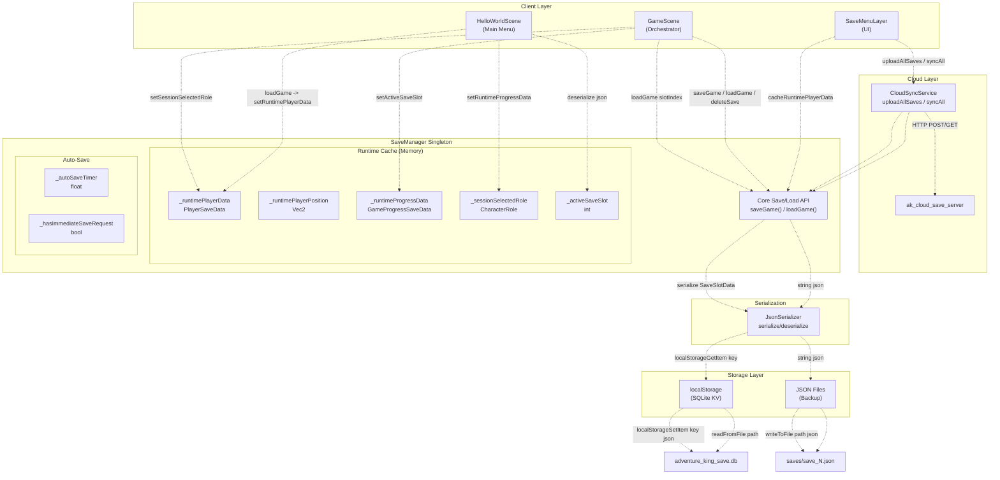
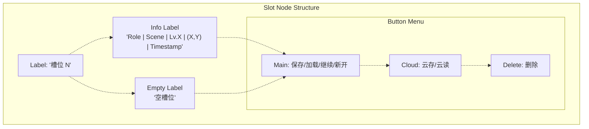
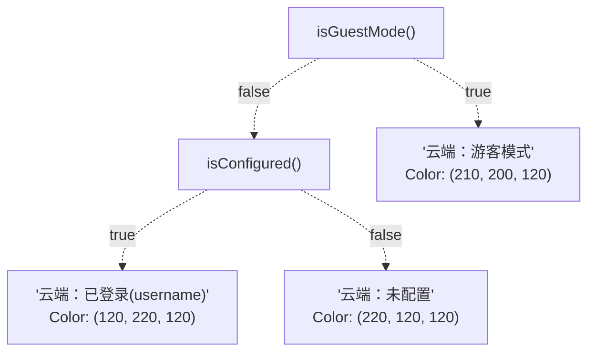

# Save and Persistence（存档与持久化）

> **相关源文件**
> * [Adventure-King/Classes/Save/JsonSerializer.cpp](https://github.com/lilong555/Adventure-King/blob/60df0f40/Adventure-King/Classes/Save/JsonSerializer.cpp)
> * [Adventure-King/Classes/Save/SaveData.h](https://github.com/lilong555/Adventure-King/blob/60df0f40/Adventure-King/Classes/Save/SaveData.h)
> * [Adventure-King/Classes/Save/SaveManager.cpp](https://github.com/lilong555/Adventure-King/blob/60df0f40/Adventure-King/Classes/Save/SaveManager.cpp)
> * [Adventure-King/Classes/Save/SaveManager.h](https://github.com/lilong555/Adventure-King/blob/60df0f40/Adventure-King/Classes/Save/SaveManager.h)
> * [Adventure-King/Classes/Scenes/HelloWorldScene.cpp](https://github.com/lilong555/Adventure-King/blob/60df0f40/Adventure-King/Classes/Scenes/HelloWorldScene.cpp)
> * [Adventure-King/Classes/Scenes/HelloWorldScene.h](https://github.com/lilong555/Adventure-King/blob/60df0f40/Adventure-King/Classes/Scenes/HelloWorldScene.h)
> * [Adventure-King/Classes/Scenes/Layers/SaveMenuLayer.cpp](https://github.com/lilong555/Adventure-King/blob/60df0f40/Adventure-King/Classes/Scenes/Layers/SaveMenuLayer.cpp)
> * [Adventure-King/Classes/Scenes/Layers/SaveMenuLayer.h](https://github.com/lilong555/Adventure-King/blob/60df0f40/Adventure-King/Classes/Scenes/Layers/SaveMenuLayer.h)
> * [Adventure-King/Classes/Scenes/LevelMap.cpp](https://github.com/lilong555/Adventure-King/blob/60df0f40/Adventure-King/Classes/Scenes/LevelMap.cpp)
> * [Adventure-King/Classes/Scenes/LevelMap.h](https://github.com/lilong555/Adventure-King/blob/60df0f40/Adventure-King/Classes/Scenes/LevelMap.h)

## 概览

存档与持久化系统管理所有需要长期保存的游戏状态：包括玩家成长、装备、技能、世界状态以及设置项。系统实现了“双存储”架构：以本地 SQLite 数据库作为主存储、JSON 文件作为备份，并结合内存中的运行时缓存，以实现零延迟的场景切换。云同步通过 `CloudSyncService` 集成提供支持。

关于 UI 层的存档菜单交互，请参见 [User Interface](用户界面.md)。关于会消费运行时缓存数据的场景切换机制，请参见 [Scene Transitions](场景切换.md)。

---

## 系统架构

持久化层采用三层架构：存储层、序列化层、运行时缓存层。



**架构：存档与持久化系统**

该系统把关注点拆分为明确的层：

* **客户端层（Client Layer）**：场景与 UI 通过 `SaveManager` 单例交互
* **运行时缓存（Runtime Cache）**：在内存中缓存玩家/世界/会话数据，供无缝切场景使用
* **序列化（Serialization）**：`JsonSerializer` 负责 JSON 双向序列化/反序列化
* **存储层（Storage Layer）**：主存为本地 SQLite KV（`localStorage`），JSON 文件作为备份
* **云层（Cloud Layer）**：`CloudSyncService` 上传/下载/同步所有槽位

> 说明：原文在本节后续存在生成器截断占位（`...35887 chars truncated...`），为保证不遗漏，下方保留原占位与残片内容。

```text
* **Runtim…35887 chars truncated… first)"]
CloudSyncButton["云同步 button<br>(all modes)"]

SAVE -.-> SaveButtons
SAVE -.-> CloudUpload
SAVE -.-> Delete
SAVE -.-> CloudSyncButton
LOAD -.-> LoadButtons
LOAD -.-> CloudDownload
LOAD -.-> CloudSyncButton
START -.-> StartButtons
START -.-> CloudStart
START -.-> CloudSyncButton

subgraph subGraph3 ["START Mode Features"]
    StartButtons
    CloudStart
end

subgraph subGraph2 ["LOAD Mode Features"]
    LoadButtons
    CloudDownload
end

subgraph subGraph1 ["SAVE Mode Features"]
    SaveButtons
    CloudUpload
    Delete
end

subgraph subGraph0 ["Mode Enum"]
    SAVE
    LOAD
    START
end
```

**架构：SaveMenuLayer 模式系统**

模式决定显示哪些按钮及其行为。所有模式都共享“云同步”按钮，用于手动进行双向同步。

### 槽位 UI 布局



**布局：单个槽位节点**

每个槽位展示来自 `SaveSlotData` 的元信息（空槽位则显示“空槽位”），并根据上下文显示对应的操作按钮。

### 回调集成

| 回调 | 设置者 | 触发时机 | 用途 |
| --- | --- | --- | --- |
| `LoadSuccessCallback` | 外部调用者 | 读档成功 | 把加载数据回传给调用方 |
| `StartSlotCallback` | 外部调用者 | START 模式选择槽位 | 开始新游戏或加载 |
| `CloseCallback` | 外部调用者 | 菜单关闭 | 在 `GameScene` 中恢复暂停状态 |

模式位于 [Adventure-King/Classes/Scenes/Layers/SaveMenuLayer.h L45-L57](https://github.com/lilong555/Adventure-King/blob/60df0f40/Adventure-King/Classes/Scenes/Layers/SaveMenuLayer.h#L45-L57)

### 云端状态显示



**逻辑：云端状态标签**

状态标签由 `refreshCloudStatusLabel()` 更新，该函数会查询 `CloudSyncService` 的状态。

来源：[Adventure-King/Classes/Scenes/Layers/SaveMenuLayer.cpp L1-L768](https://github.com/lilong555/Adventure-King/blob/60df0f40/Adventure-King/Classes/Scenes/Layers/SaveMenuLayer.cpp#L1-L768)

 [Adventure-King/Classes/Scenes/Layers/SaveMenuLayer.h L1-L122](https://github.com/lilong555/Adventure-King/blob/60df0f40/Adventure-King/Classes/Scenes/Layers/SaveMenuLayer.h#L1-L122)

---

## 汇总表

### 关键类

| 类 | 文件 | 主要职责 |
| --- | --- | --- |
| `SaveManager` | [SaveManager.h L20-L335](https://github.com/lilong555/Adventure-King/blob/60df0f40/SaveManager.h#L20-L335) | 负责统筹所有持久化的单例 |
| `JsonSerializer` | [JsonSerializer.h](https://github.com/lilong555/Adventure-King/blob/60df0f40/JsonSerializer.h) <br />  / [JsonSerializer.cpp](https://github.com/lilong555/Adventure-King/blob/60df0f40/JsonSerializer.cpp) | JSON 双向序列化 |
| `SaveMenuLayer` | [SaveMenuLayer.h L14-L122](https://github.com/lilong555/Adventure-King/blob/60df0f40/SaveMenuLayer.h#L14-L122) | 存/读档 UI 模态层 |
| `CloudSyncService` | [Cloud/CloudSyncService.h](https://github.com/lilong555/Adventure-King/blob/60df0f40/Cloud/CloudSyncService.h) | 云备份协调 |

### 存储位置

| 实体 | SQLite Key | JSON 文件 | 备注 |
| --- | --- | --- | --- |
| 存档槽位 N | `ak_save_slot_N` | `saves/save_N.json` | N ∈ [0, 4] |
| 设置项 | `ak_settings` | `settings.json` | 音频/控制配置 |
| 数据库 | N/A | `saves/adventure_king_save.db` | SQLite 文件 |

### 运行时缓存键

| 缓存 | 标记 | Getter | Setter | Clearer |
| --- | --- | --- | --- | --- |
| 玩家数据 | `_hasRuntimePlayerData` | `getRuntimePlayerData()` | `setRuntimePlayerData()` | `clearRuntimePlayerData()` |
| 玩家位置 | `_hasRuntimePlayerPosition` | `getRuntimePlayerPosition()` | `setRuntimePlayerPosition()` | `clearRuntimePlayerPosition()` |
| 进度数据 | `_hasRuntimeProgressData` | `getRuntimeProgressData()` | `setRuntimeProgressData()` | `clearRuntimeProgressData()` |
| 会话职业 | `_hasSessionSelectedRole` | `getSessionSelectedRole()` | `setSessionSelectedRole()` | `clearSessionSelectedRole()` |
| 活跃槽位 | `_hasActiveSaveSlot` | `getActiveSaveSlot()` | `setActiveSaveSlot()` | `clearActiveSaveSlot()` |
