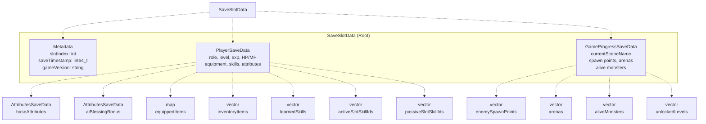
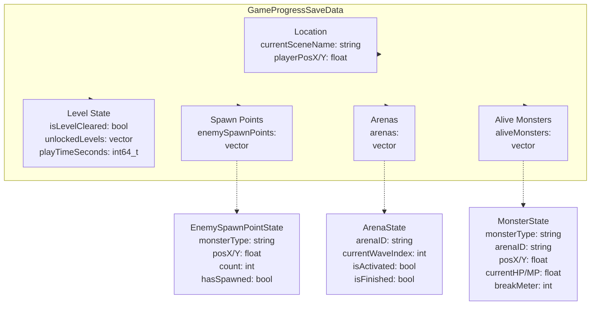
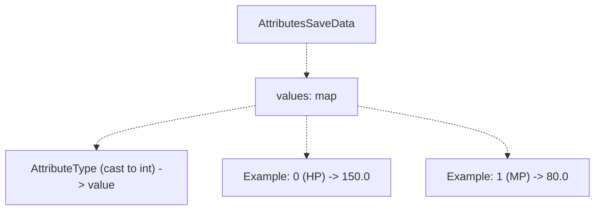
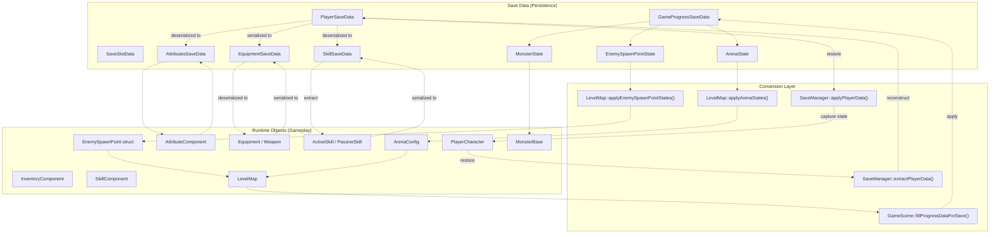
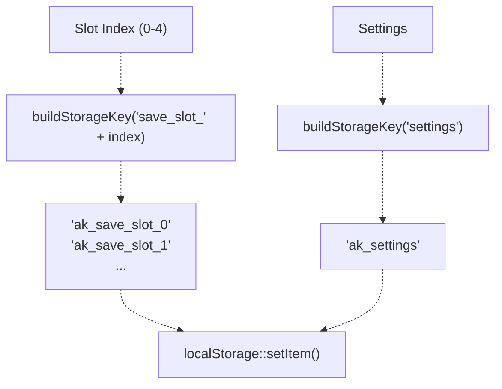

# Save Data Structures（存档数据结构）

> **相关源文件**
> * [Adventure-King/Classes/Save/JsonSerializer.cpp](https://github.com/lilong555/Adventure-King/blob/60df0f40/Adventure-King/Classes/Save/JsonSerializer.cpp)
> * [Adventure-King/Classes/Save/SaveData.h](https://github.com/lilong555/Adventure-King/blob/60df0f40/Adventure-King/Classes/Save/SaveData.h)
> * [Adventure-King/Classes/Save/SaveManager.cpp](https://github.com/lilong555/Adventure-King/blob/60df0f40/Adventure-King/Classes/Save/SaveManager.cpp)
> * [Adventure-King/Classes/Save/SaveManager.h](https://github.com/lilong555/Adventure-King/blob/60df0f40/Adventure-King/Classes/Save/SaveManager.h)
> * [Adventure-King/Classes/Scenes/HelloWorldScene.cpp](https://github.com/lilong555/Adventure-King/blob/60df0f40/Adventure-King/Classes/Scenes/HelloWorldScene.cpp)
> * [Adventure-King/Classes/Scenes/HelloWorldScene.h](https://github.com/lilong555/Adventure-King/blob/60df0f40/Adventure-King/Classes/Scenes/HelloWorldScene.h)
> * [Adventure-King/Classes/Scenes/Layers/SaveMenuLayer.cpp](https://github.com/lilong555/Adventure-King/blob/60df0f40/Adventure-King/Classes/Scenes/Layers/SaveMenuLayer.cpp)
> * [Adventure-King/Classes/Scenes/Layers/SaveMenuLayer.h](https://github.com/lilong555/Adventure-King/blob/60df0f40/Adventure-King/Classes/Scenes/Layers/SaveMenuLayer.h)
> * [Adventure-King/Classes/Scenes/LevelMap.cpp](https://github.com/lilong555/Adventure-King/blob/60df0f40/Adventure-King/Classes/Scenes/LevelMap.cpp)
> * [Adventure-King/Classes/Scenes/LevelMap.h](https://github.com/lilong555/Adventure-King/blob/60df0f40/Adventure-King/Classes/Scenes/LevelMap.h)

本页记录 Adventure-King 用于游戏持久化的各类数据结构。这些结构定义了可被序列化为 JSON 的完整状态快照，并可存储到本地数据库或同步到云端。

关于负责编排存/读档操作的 SaveManager 单例，请参见 [SaveManager](存档管理器（SaveManager）.md)。关于存储层实现细节，请参见 [Storage Layer](存储层.md)。关于存/读档流程与运行时缓存机制，请参见 [Save and Load Flow](存取档流程.md)。

## 概览

存档系统采用层级结构，其中 `SaveSlotData` 是根容器。所有数据结构都是用于 RapidJSON 序列化的纯 C++ struct：只包含 POD 类型、STL 容器与嵌套的存档结构——不包含指向游戏对象的指针，也不包含 Cocos2d 类型（唯一例外是 `Vec2`，它作为可序列化的坐标对使用）。

核心设计原则是 **持久化与运行时分离**：存档数据结构完全独立于 `PlayerCharacter`、`MonsterBase`、`LevelMap` 等玩法类。运行时对象与存档数据之间的转换发生在明确边界：`SaveManager::extractPlayerData()` 与 `SaveManager::applyPlayerData()`。

## 核心存档层级结构

### SaveSlotData 结构

`SaveSlotData` 是完整游戏状态快照的顶层容器。它按槽位（0-4）存储，包含元信息、玩家状态与世界进度。



**来源**：[Adventure-King/Classes/Save/SaveData.h L171-L186](https://github.com/lilong555/Adventure-King/blob/60df0f40/Adventure-King/Classes/Save/SaveData.h#L171-L186)

### 字段说明

| 字段 | 类型 | 说明 |
| --- | --- | --- |
| `slotIndex` | `int` | 槽位编号（0-4） |
| `saveTimestamp` | `int64_t` | Unix 时间戳（毫秒） |
| `gameVersion` | `string` | 用于兼容性检查的版本字符串 |
| `playerData` | `PlayerSaveData` | 玩家角色完整状态 |
| `progressData` | `GameProgressSaveData` | 世界进度数据（原文此处截断：`Wor…4002 chars truncated…`） |
| `breakMeter` | `int` | Boss 破韧条进度（非 Boss 为 0） |

> 说明：上表中的 `Wor…4002 chars truncated…` 为原文生成器截断占位，已按原样保留以避免遗漏。

---

## GameProgressSaveData 结构

`GameProgressSaveData` 捕获游戏世界状态：包括玩家位置、关卡完成状态、生成点状态、竞技场进度，以及所有存活怪物的快照。



**来源**：[Adventure-King/Classes/Save/SaveData.h L109-L168](https://github.com/lilong555/Adventure-King/blob/60df0f40/Adventure-King/Classes/Save/SaveData.h#L109-L168)

### 位置与关卡状态

| 字段 | 类型 | 说明 |
| --- | --- | --- |
| `currentSceneName` | `string` | 场景标识（例如 `"ORIGIN_MUSHROOM"`），由 `SceneRegistry` 使用 |
| `playerPosX`, `playerPosY` | `float` | 读档时玩家出生点的世界坐标 |
| `isLevelCleared` | `bool` | 当前关卡胜利条件是否已满足（传送门是否解锁） |
| `unlockedLevels` | `vector<string>` | 在地图选择中可访问的场景名列表 |
| `playTimeSeconds` | `int64_t` | 本次会话时长（秒）（从 `_sessionStartTime` 计算到存档时刻） |

`isLevelCleared` 用于避免一个问题：玩家胜利后存档，再读档时传送门会被重新锁住。对于旧存档如果缺少该字段，加载时会根据生成点/竞技场状态进行推断。

**来源**：[Adventure-King/Classes/Save/SaveData.h L112-L164](https://github.com/lilong555/Adventure-King/blob/60df0f40/Adventure-King/Classes/Save/SaveData.h#L112-L164)

 [Adventure-King/Classes/Scenes/LevelMap.cpp L435-L447](https://github.com/lilong555/Adventure-King/blob/60df0f40/Adventure-King/Classes/Scenes/LevelMap.cpp#L435-L447)

### EnemySpawnPointState（敌人生成点状态）

用于追踪 TMX 对象层 `enemy_g` 中定义的敌人生成点的激活状态。每个生成点包含：

| 字段 | 类型 | 说明 |
| --- | --- | --- |
| `monsterType` | `string` | 怪物类型标识（例如 `"goblin"`, `"goblu"`），由 `createMonsterByType()` 使用 |
| `posX`, `posY` | `float` | 生成点的世界坐标 |
| `count` | `int` | 该点要生成的怪物数量 |
| `hasSpawned` | `bool` | 该生成点是否已经触发过 |

当 `hasSpawned` 为 `true` 时，`LevelMap::updateEnemySpawns()` 在读档后会跳过该点，避免重复生成。生成点通过 `(monsterType, posX, posY, count)` 的组合键进行唯一识别。

**来源**：[Adventure-King/Classes/Save/SaveData.h L126-L133](https://github.com/lilong555/Adventure-King/blob/60df0f40/Adventure-King/Classes/Save/SaveData.h#L126-L133)

 [Adventure-King/Classes/Scenes/LevelMap.cpp L709-L735](https://github.com/lilong555/Adventure-King/blob/60df0f40/Adventure-King/Classes/Scenes/LevelMap.cpp#L709-L735)

### ArenaState（竞技场状态）

表示单个竞技场遭遇（按波次的锁房间战斗）的进度：

| 字段 | 类型 | 说明 |
| --- | --- | --- |
| `arenaID` | `string` | 来自 TMX 的唯一标识（例如 `"arena_01"`） |
| `currentWaveIndex` | `int` | 当前/下一波将要生成的波次索引（从 0 开始） |
| `isActivated` | `bool` | 玩家是否进入过竞技场触发区 |
| `isFinished` | `bool` | 是否已完成全部波次 |

当 `isActivated` 为 `true` 且 `isFinished` 为 `false` 时，竞技场门会关闭。系统使用 `currentWaveIndex` 决定下一波生成哪一波。如果当前波仍有怪存活，它们会通过 `MonsterState` 被恢复（见下文）。

**来源**：[Adventure-King/Classes/Save/SaveData.h L136-L143](https://github.com/lilong555/Adventure-King/blob/60df0f40/Adventure-King/Classes/Save/SaveData.h#L136-L143)

 [Adventure-King/Classes/Scenes/LevelMap.cpp L773-L863](https://github.com/lilong555/Adventure-King/blob/60df0f40/Adventure-King/Classes/Scenes/LevelMap.cpp#L773-L863)

### MonsterState（怪物状态）

保存时刻所有存活怪物的快照：包含 HP、位置与竞技场归属关系：

| 字段 | 类型 | 说明 |
| --- | --- | --- |
| `monsterType` | `string` | 类型标识（小写：`"goblin"`, `"goblu"`, `"obscur"`） |
| `arenaID` | `string` | 若为竞技场怪物则为 arenaID；世界怪物则为空字符串 |
| `posX`, `posY` | `float` | 世界坐标 |
| `currentHP`, `currentMP` | `float` | 当前生命与法力 |
| `breakMeter` | `int` | Boss 破韧条进度（非 Boss 为 0） |

`arenaID` 用于把怪物关联到对应竞技场：当非空时，会通过 `LevelMap::registerRestoredArenaMonster()` 恢复，并挂接死亡回调以推进波次；世界怪物 `arenaID` 为空，直接恢复到场景中。

**来源**：[Adventure-King/Classes/Save/SaveData.h L148-L158](https://github.com/lilong555/Adventure-King/blob/60df0f40/Adventure-King/Classes/Save/SaveData.h#L148-L158)

 [Adventure-King/Classes/Scenes/LevelMap.cpp L866-L923](https://github.com/lilong555/Adventure-King/blob/60df0f40/Adventure-King/Classes/Scenes/LevelMap.cpp#L866-L923)

## 嵌套数据结构

### AttributesSaveData（属性存档数据）

用于存储属性值的简单键值映射：



`AttributeType` 枚举会被 cast 成 `int` 以便 JSON 序列化；反序列化时会把整数 key 解析回 `AttributeType`。空 map 表示默认/零值。

**来源**：[Adventure-King/Classes/Save/SaveData.h L11-L17](https://github.com/lilong555/Adventure-King/blob/60df0f40/Adventure-King/Classes/Save/SaveData.h#L11-L17)

 [Adventure-King/Classes/Save/JsonSerializer.cpp L11-L46](https://github.com/lilong555/Adventure-King/blob/60df0f40/Adventure-King/Classes/Save/JsonSerializer.cpp#L11-L46)

### EquipmentSaveData（装备存档数据）

保存一个 `Equipment` 或 `Weapon` 对象的全部属性：

| 字段 | 类型 | 说明 |
| --- | --- | --- |
| `id` | `int` | 来自 `GameConfig::Equipment` 的装备 ID |
| `name`, `description` | `string` | 展示文本 |
| `slot` | `int` | `EquipmentSlot` 枚举 cast 成 int |
| `level` | `int` | 装备等级（独立于玩家等级） |
| `attributeBonus` | `AttributesSaveData` | 提供的属性加成 |
| `spritePath` | `string` | 图标 sprite 路径 |
| `isWeapon` | `bool` | 用于区分武器字段的判别标记 |

**武器特有字段（当 `isWeapon == true`）：**

| 字段 | 类型 | 说明 |
| --- | --- | --- |
| `weaponType` | `int` | `WeaponType` 枚举 cast 成 int |
| `attackDamage` | `float` | 基础武器伤害 |
| `attackRange` | `float` | 攻击距离 |
| `attackSpeed` | `float` | 攻速倍率 |
| `attackAnimationPrefix` | `string` | 攻击动画名前缀（例如 `"spr_man_attack_sword"`） |
| `attackFrameCount` | `int` | 攻击动画帧数 |

`isWeapon` 决定序列化时是否填充武器字段，以及反序列化时是否将装备 cast 为 `Weapon`。

**来源**：[Adventure-King/Classes/Save/SaveData.h L20-L41](https://github.com/lilong555/Adventure-King/blob/60df0f40/Adventure-King/Classes/Save/SaveData.h#L20-L41)

 [Adventure-King/Classes/Save/SaveManager.cpp L819-L855](https://github.com/lilong555/Adventure-King/blob/60df0f40/Adventure-King/Classes/Save/SaveManager.cpp#L819-L855)

 [Adventure-King/Classes/Save/JsonSerializer.cpp L50-L125](https://github.com/lilong555/Adventure-King/blob/60df0f40/Adventure-King/Classes/Save/JsonSerializer.cpp#L50-L125)

### SkillSaveData（技能存档数据）

捕获被动与主动技能状态：

| 字段 | 类型 | 说明 |
| --- | --- | --- |
| `id` | `int` | 来自 `GameConfig::Skill` 的技能 ID |
| `name`, `description` | `string` | 展示文本 |
| `isPassive` | `bool` | 用于区分技能类型的判别标记 |

**主动技能字段：**

| 字段 | 类型 | 说明 |
| --- | --- | --- |
| `cooldown` | `float` | 基础冷却（秒） |
| `manaCost` | `float` | 每次施放的 MP 消耗 |
| `breakDamage` | `int` | 对 Boss 破韧条的伤害（未知/旧存档为 -1） |
| `currentCooldown` | `float` | 存档时剩余冷却时间 |

**被动技能字段：**

| 字段 | 类型 | 说明 |
| --- | --- | --- |
| `attributeBonus` | `AttributesSaveData` | 装备时提供的属性加成 |

`breakDamage` 使用 `-1` 作为旧存档缺字段的哨兵值；加载时会从 `GameConfig::Skill::getBreakDamageForSkillId()` 回填缺失值。

**来源**：[Adventure-King/Classes/Save/SaveData.h L44-L65](https://github.com/lilong555/Adventure-King/blob/60df0f40/Adventure-King/Classes/Save/SaveData.h#L44-L65)

 [Adventure-King/Classes/Save/JsonSerializer.cpp L128-L187](https://github.com/lilong555/Adventure-King/blob/60df0f40/Adventure-King/Classes/Save/JsonSerializer.cpp#L128-L187)

## SettingsSaveData（设置数据）

该结构与槽位存档分离，用于保存用户偏好：

| 字段 | 类型 | 默认值 | 说明 |
| --- | --- | --- | --- |
| `musicVolume` | `float` | `1.0f` | 背景音乐音量（0.0-1.0） |
| `sfxVolume` | `float` | `1.0f` | 音效音量（0.0-1.0） |
| `musicEnabled` | `bool` | `true` | 音乐总开关 |
| `sfxEnabled` | `bool` | `true` | 音效总开关 |

设置项独立于槽位存档存储（key 为 `ak_settings`），对所有存档全局生效：启动时读取，设置菜单修改时保存。

**来源**：[Adventure-King/Classes/Save/SaveData.h L189-L198](https://github.com/lilong555/Adventure-King/blob/60df0f40/Adventure-King/Classes/Save/SaveData.h#L189-L198)

 [Adventure-King/Classes/Save/SaveManager.cpp L587-L648](https://github.com/lilong555/Adventure-King/blob/60df0f40/Adventure-King/Classes/Save/SaveM…1275 chars truncated…60df0f40/Adventure-King/Classes/Save/JsonSerializer.cpp#L190-L336)

 [Adventure-King/Classes/Save/JsonSerializer.cpp L358-L772](https://github.com/lilong555/Adventure-King/blob/60df0f40/Adventure-King/Classes/Save/JsonSerializer.cpp#L358-L772)

> 说明：上方 `SaveM…1275 chars truncated…` 为原文生成器截断占位，已按原样保留。

### Serialize（序列化）函数

`JsonSerializer::serialize(const SaveSlotData &data)` 会构建一个嵌套的 RapidJSON 文档结构：

1. **元信息块**（`meta`）：槽位、时间戳、版本
2. **玩家块**（`player`）：递归序列化全部 `PlayerSaveData` 字段
3. **进度块**（`progress`）：场景名、坐标、生成点/竞技场/怪物数组

每个嵌套结构（`AttributesSaveData`、`EquipmentSaveData`、`SkillSaveData`）都有对应 helper：

* `serializeAttributes()`：把 `map<int, float>` 转为以字符串为 key 的 JSON object
* `serializeEquipment()`：处理装备字段与武器判别字段
* `serializeSkill()`：处理技能字段与主动/被动判别字段

**来源**：[Adventure-King/Classes/Save/JsonSerializer.cpp L190-L336](https://github.com/lilong555/Adventure-King/blob/60df0f40/Adventure-King/Classes/Save/JsonSerializer.cpp#L190-L336)

### Deserialize（反序列化）函数

`JsonSerializer::deserialize(const std::string &json, SaveSlotData &outData)` 解析 JSON，并用 lambda helper 安全提取字段（带默认值）：

```javascript
auto getInt = [&](const rapidjson::Value &obj, const char *key, int def) -> int {
    return (obj.HasMember(key) && obj[key].IsInt()) ? obj[key].GetInt() : def;
};
```

该模式保障向后兼容：若字段缺失（旧格式存档），则使用默认值。诸如 `breakDamage`、`isLevelCleared` 这类新字段会使用哨兵默认值（`-1`、`false`），并在加载流程中触发回填逻辑。

**来源**：[Adventure-King/Classes/Save/JsonSerializer.cpp L358-L772](https://github.com/lilong555/Adventure-King/blob/60df0f40/Adventure-King/Classes/Save/JsonSerializer.cpp#L358-L772)

### 向后兼容策略

| 缺失字段 | 默认值 | 回填策略 |
| --- | --- | --- |
| `SkillSaveData` 中的 `breakDamage` | `-1` | 读档时从 `GameConfig::Skill` 查询回填（[SaveManager.cpp L919-L936](https://github.com/lilong555/Adventure-King/blob/60df0f40/SaveManager.cpp#L919-L936) <br />） |
| `isLevelCleared` | `false` | 由 `enemySpawnPoints.empty() && arenas.empty()` 或显式检测推断（[LevelMap.cpp L71-L82](https://github.com/lilong555/Adventure-King/blob/60df0f40/LevelMap.cpp#L71-L82) <br />） |
| `aiBlessingBonus` | 空 map | 视为“没有祝福生效” |
| `passiveSlotSkillIds` | 空 vector | 旧存档的 `-1` 占位会被过滤 |

**来源**：[Adventure-King/Classes/Save/JsonSerializer.cpp L180](https://github.com/lilong555/Adventure-King/blob/60df0f40/Adventure-King/Classes/Save/JsonSerializer.cpp#L180-L180)

 [Adventure-King/Classes/Save/SaveManager.cpp L919-L936](https://github.com/lilong555/Adventure-King/blob/60df0f40/Adventure-King/Classes/Save/SaveManager.cpp#L919-L936)

## 存档数据与运行时对象的映射

下图展示存档数据结构如何映射到对应的运行时游戏对象：



**来源**：[Adventure-King/Classes/Save/SaveManager.cpp L772-L1129](https://github.com/lilong555/Adventure-King/blob/60df0f40/Adventure-King/Classes/Save/SaveManager.cpp#L772-L1129)

 [Adventure-King/Classes/Scenes/GameScene.cpp L945-L1093](https://github.com/lilong555/Adventure-King/blob/60df0f40/Adventure-King/Classes/Scenes/GameScene.cpp#L945-L1093)

### 提取（运行时 → 存档数据）

`SaveManager::extractPlayerData(PlayerCharacter *player)` 会把玩家状态深拷贝到 `PlayerSaveData`：

1. **基础字段**：直接复制 `level`、`experience`、技能点等
2. **当前状态**：复制 `currentHP`、`currentMP`、伤害倍率等
3. **属性**：调用 `AttributeComponent::getBaseAttributes()` 并序列化为 `AttributesSaveData`
4. **装备**：遍历 `getEquippedItems()` 与 `getInventoryItems()`，把每个 `Equipment` 转成 `EquipmentSaveData`
5. **技能**：遍历 `getLearnedSkills()`，把每个 `Skill` 转成 `SkillSaveData`，并复制技能槽位数组

提取过程只做数据复制，不会保存任何运行时对象的指针或引用。

**来源**：[Adventure-King/Classes/Save/SaveManager.cpp L772-L1007](https://github.com/lilong555/Adventure-King/blob/60df0f40/Adventure-King/Classes/Save/SaveManager.cpp#L772-L1007)

### 应用（存档数据 → 运行时）

`SaveManager::applyPlayerData(PlayerCharacter *player, const PlayerSaveData &data)` 会从存档数据重建玩家状态：

1. **基础字段**：通过 setter 设置等级、经验与技能点
2. **当前状态**：直接设置 HP/MP
3. **属性**：对 map 中每条属性调用 `AttributeComponent::setBaseAttribute()`
4. **装备**：用工厂函数把 `EquipmentSaveData` 转为 `Equipment`/`Weapon`，并调用 `equipItem()` 或 `addItemToInventory()`
5. **技能**：用工厂函数把 `SkillSaveData` 转为 `ActiveSkill`/`PassiveSkill`，调用 `learnSkill()`，再恢复槽位分配

应用过程使用与玩法代码一致的 public API 来修改玩家，从而保证一致性与正确触发回调。

**来源**：[Adventure-King/Classes/Save/SaveManager.cpp L1009-L1129](https://github.com/lilong555/Adventure-King/blob/60df0f40/Adventure-King/Classes/Save/SaveManager.cpp#L1009-L1129)

### 世界状态提取

`GameScene::fillProgressDataForSave(GameProgressSaveData &outData)` 捕获世界状态：

1. **位置**：从 `SceneRegistry` 设置 `currentSceneName`，从玩家位置设置 `playerPosX/Y`
2. **关卡清理**：从 `LevelMap::isLevelCleared()` 设置 `isLevelCleared`
3. **生成点**：调用 `LevelMap::exportEnemySpawnPointStates()` 获取生成状态数组
4. **竞技场**：调用 `LevelMap::exportArenaStates()` 获取竞技场进度数组
5. **存活怪物**：遍历所有 `MonsterBase` 子节点，把类型/HP/位置/arenaID 写入 `MonsterState`

该函数在存档时（手动与自动）于暂停状态下调用，确保快照一致。

**来源**：[Adventure-King/Classes/Scenes/GameScene.cpp L945-L1093](https://github.com/lilong555/Adventure-King/blob/60df0f40/Adventure-King/Classes/Scenes/GameScene.cpp#L945-L1093)

### 世界状态恢复

读档时，`GameScene` 会按顺序调用：

1. **`LevelMap::applyEnemySpawnPointStates()`**：标记生成点为已触发，防止重复生成
2. **`LevelMap::applyArenaStates()`**：恢复竞技场波次索引与门禁状态
3. **怪物重建**：对每个 `MonsterState` 创建 `MonsterBase` 并设置 HP/位置
4. **`LevelMap::registerRestoredArenaMonster()`**：把竞技场怪物挂接到推进波次的死亡回调
5. **`LevelMap::resumeActiveArenasIfNeeded()`**：若竞技场处于激活且怪物数为 0，则生成当前波次

该多阶段恢复能确保竞技场不会重复生成已完成波次，并正确重建未完成波次。

**来源**：[Adventure-King/Classes/Scenes/LevelMap.cpp L709-L923](https://github.com/lilong555/Adventure-King/blob/60df0f40/Adventure-King/Classes/Scenes/LevelMap.cpp#L709-L923)

 [Adventure-King/Classes/Scenes/GameScene.cpp L666-L778](https://github.com/lilong555/Adventure-King/blob/60df0f40/Adventure-King/Classes/Scenes/GameScene.cpp#L666-L778)

## 存储 Key 生成

存档数据结构会存到 SQLite（通过 `cocos2d::localStorage`）与旧版 JSON 文件中。Key 生成统一在 `SaveManager` 中实现：



`ak_` 前缀命名空间用于避免与其它系统在同一数据库中产生 key 冲突。JSON 文件路径遵循相同模式：`saves/save_0.json`、`saves/save_1.json` 等。

**来源**：[Adventure-King/Classes/Save/SaveManager.cpp L16-L25](https://github.com/lilong555/Adventure-King/blob/60df0f40/Adventure-King/Classes/Save/SaveManager.cpp#L16-L25)

 [Adventure-King/Classes/Save/SaveManager.cpp L193-L201](https://github.com/lilong555/Adventure-King/blob/60df0f40/Adventure-King/Classes/Save/SaveManager.cpp#L193-L201)

 [Adventure-King/Classes/Save/SaveManager.cpp L249-L257](https://github.com/lilong555/Adventure-King/blob/60df0f40/Adventure-King/Classes/Save/SaveManager.cpp#L249-L257)

## 数据结构保证

所有存档数据结构遵循这些设计规则：

1. **无指针**：只使用值类型、字符串与容器
2. **可默认构造**：所有 struct 都有 `= default` 构造，便于初始化
3. **仅使用 STL 容器**：`vector`、`map`、`string` 以保证广泛兼容
4. **枚举转 int**：所有枚举都 cast 成 `int` 以便 JSON 序列化
5. **哨兵默认值**：缺失字段使用哨兵值（`-1`、空字符串等）触发回填逻辑

这些保证使得：

* **线程安全序列化**：不存在共享状态或指针
* **深拷贝简单**：整个存档状态可轻易复制
* **版本迁移友好**：缺字段用默认值而不是报错
* **云同步容易**：JSON 可以直接通过 HTTP 传输

**来源**：[Adventure-King/Classes/Save/SaveData.h L1-L199](https://github.com/lilong555/Adventure-King/blob/60df0f40/Adventure-King/Classes/Save/SaveData.h#L1-L199)
