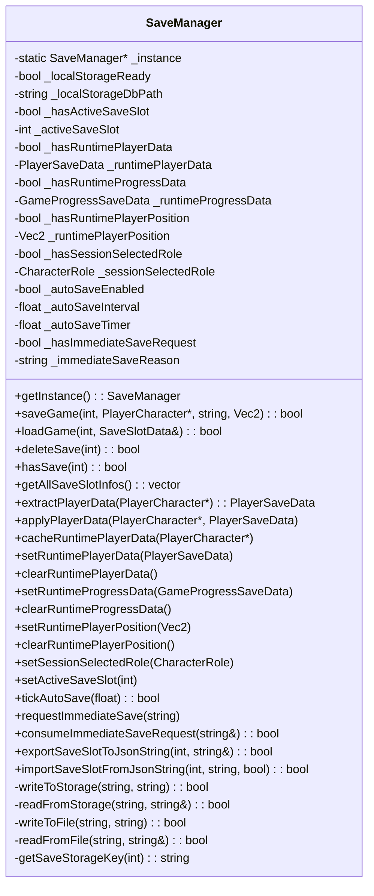

# SaveManager（存档管理器）

> **相关源文件**
> * [Adventure-King/Classes/Save/JsonSerializer.cpp](https://github.com/lilong555/Adventure-King/blob/60df0f40/Adventure-King/Classes/Save/JsonSerializer.cpp)
> * [Adventure-King/Classes/Save/SaveData.h](https://github.com/lilong555/Adventure-King/blob/60df0f40/Adventure-King/Classes/Save/SaveData.h)
> * [Adventure-King/Classes/Save/SaveManager.cpp](https://github.com/lilong555/Adventure-King/blob/60df0f40/Adventure-King/Classes/Save/SaveManager.cpp)
> * [Adventure-King/Classes/Save/SaveManager.h](https://github.com/lilong555/Adventure-King/blob/60df0f40/Adventure-King/Classes/Save/SaveManager.h)
> * [Adventure-King/Classes/Scenes/HelloWorldScene.cpp](https://github.com/lilong555/Adventure-King/blob/60df0f40/Adventure-King/Classes/Scenes/HelloWorldScene.cpp)
> * [Adventure-King/Classes/Scenes/HelloWorldScene.h](https://github.com/lilong555/Adventure-King/blob/60df0f40/Adventure-King/Classes/Scenes/HelloWorldScene.h)
> * [Adventure-King/Classes/Scenes/Layers/SaveMenuLayer.cpp](https://github.com/lilong555/Adventure-King/blob/60df0f40/Adventure-King/Classes/Scenes/Layers/SaveMenuLayer.cpp)
> * [Adventure-King/Classes/Scenes/Layers/SaveMenuLayer.h](https://github.com/lilong555/Adventure-King/blob/60df0f40/Adventure-King/Classes/Scenes/Layers/SaveMenuLayer.h)
> * [Adventure-King/Classes/Scenes/LevelMap.cpp](https://github.com/lilong555/Adventure-King/blob/60df0f40/Adventure-King/Classes/Scenes/LevelMap.cpp)
> * [Adventure-King/Classes/Scenes/LevelMap.h](https://github.com/lilong555/Adventure-King/blob/60df0f40/Adventure-King/Classes/Scenes/LevelMap.h)

## 目的与范围

SaveManager 是 Adventure-King 中负责管理持久化游戏状态的单例。它处理玩家进度、装备、关卡状态与设置项的存取，并支持 5 个存档槽位。系统使用双存储方案（SQLite + JSON 备份），并提供运行时缓存层以支持无缝场景切换。

关于使用 SaveManager 的导出/导入 hooks 的云同步服务，请参见 [CloudSyncService](<云存档服务.md>)。关于 SaveManager 存储的数据结构，请参见 [Save Data Structures](<存档数据结构.md>)。关于底层存储实现细节，请参见 [Storage Layer](<存储层.md>)。

**来源**：[Classes/Save/SaveManager.h L1-L335](https://github.com/lilong555/Adventure-King/blob/60df0f40/Classes/Save/SaveManager.h#L1-L335)

 [Classes/Save/SaveManager.cpp L1-L80](https://github.com/lilong555/Adventure-King/blob/60df0f40/Classes/Save/SaveManager.cpp#L1-L80)

 [图 5：存档/读档数据流架构]

---

## 系统架构

SaveManager 实现单例模式，作为游戏的持久化中心枢纽。它连接玩法系统（PlayerCharacter、GameScene、LevelMap）与多个存储后端。

### SaveManager 类结构



> 说明：原文此处存在生成器截断占位，会导致 Mermaid 渲染报错；已补齐为可渲染版本（类成员与方法列表仍按前文引用为准）。

**来源**：[Classes/Save/Cloud/CloudSyncService.cpp](https://github.com/lilong555/Adventure-King/blob/60df0f40/Classes/Save/Cloud/CloudSyncService.cpp#LNaN-LNaN)

 [Classes/Scenes/Layers/SaveMenuLayer.cpp L651-L679](https://github.com/lilong555/Adventure-King/blob/60df0f40/Classes/Scenes/Layers/SaveMenuLayer.cpp#L651-L679)

---

## 文件路径与 Key 参考

### 目录结构

```
{WritablePath}/
├── saves/
│   ├── adventure_king_save.db    (localStorage SQLite database)
│   ├── save_0.json                (Slot 0 backup)
│   ├── save_1.json                (Slot 1 backup)
│   ├── save_2.json                (Slot 2 backup)
│   ├── save_3.json                (Slot 3 backup)
│   └── save_4.json                (Slot 4 backup)
└── settings.json                  (Settings backup)
```

### 存储 Key 生成

`buildStorageKey(suffix)` 函数位于 [Classes/Save/SaveManager.cpp L22-L25](https://github.com/lilong555/Adventure-King/blob/60df0f40/Classes/Save/SaveManager.cpp#L22-L25)

，通过在 suffix 前拼接 `"ak_"` 来构造 key：

* 槽位 key：`getSaveStorageKey(i)` → `"ak_save_slot_" + std::to_string(i)`
* 设置 key：`getSettingsStorageKey()` → `"ak_settings"`

### 路径生成

* 存档文件：`getSaveFilePath(i)` → `{WritablePath}/saves/save_{i}.json`
* 设置文件：`getSettingsFilePath()` → `{WritablePath}/settings.json`

**来源**：[Classes/Save/SaveManager.cpp L16-L26](https://github.com/lilong555/Adventure-King/blob/60df0f40/Classes/Save/SaveManager.cpp#L16-L26)

 [Classes/Save/SaveManager.cpp L193-L257](https://github.com/lilong555/Adventure-King/blob/60df0f40/Classes/Save/SaveManager.cpp#L193-L257)

---

## 与游戏系统的集成

### GameScene 集成

GameScene 是 SaveManager 的主要使用方：

| GameScene 职责 | 使用的 SaveManager 方法 |
| --- | --- |
| 手动存档（暂停菜单） | `saveGame(slot, player, fillProgressDataForSave())` |
| 自动存档计时器 | 每次 update 调用 `tickAutoSave(dt)` |
| 立即存档请求 | `consumeImmediateSaveRequest(reason)` |
| 加载游戏状态 | `applyPlayerData(player, getRuntimePlayerData())` |
| 恢复世界状态 | 把 `getRuntimeProgressData()` 应用到 LevelMap |
| 场景切换 | 离开前调用 `cacheRuntimePlayerData(player)` |

**来源**：[Classes/Scenes/GameScene.cpp](https://github.com/lilong555/Adventure-King/blob/60df0f40/Classes/Scenes/GameScene.cpp#LNaN-LNaN)

### LevelMap 集成

LevelMap 通过 SaveManager 导出/导入世界状态：

| LevelMap 数据 | 导出方法 | 导入方法 |
| --- | --- | --- |
| 敌人生成点 | `exportEnemySpawnPointStates()` | `applyEnemySpawnPointStates(states)` |
| 竞技场进度 | `exportArenaStates()` | `applyArenaStates(states)` |
| 关卡清理标记 | 存入 `GameProgressSaveData::isLevelCleared` | `restoreLevelClearedForLoad(bool)` |

这些方法会在存档时由 GameScene 的 `fillProgressDataForSave()` 调用；读档初始化时亦会调用。

**来源**：[Classes/Scenes/LevelMap.cpp L690-L864](https://github.com/lilong555/Adventure-King/blob/60df0f40/Classes/Scenes/LevelMap.cpp#L690-L864)

 [Classes/Scenes/LevelMap.h L94-L149](https://github.com/lilong555/Adventure-King/blob/60df0f40/Classes/Scenes/LevelMap.h#L94-L149)

### HelloWorldScene 集成

主菜单会使用 SaveManager 来：

* 通过 `getAllSaveSlotInfos()` 列出全部槽位供存档菜单 UI 使用
* 加载选中的存档并写入运行时缓存，供 LoadingScene 消费
* 开始新游戏或加载旧存档时绑定活跃槽位

**来源**：[Classes/Scenes/HelloWorldScene.cpp L463-L637](https://github.com/lilong555/Adventure-King/blob/60df0f40/Classes/Scenes/HelloWorldScene.cpp#L463-L637)

 [Classes/Scenes/Layers/SaveMenuLayer.cpp L192-L557](https://github.com/lilong555/Adventure-King/blob/60df0f40/Classes/Scenes/Layers/SaveMenuLayer.cpp#L192-L557)

---

**来源**：[Classes/Save/SaveManager.h L1-L335](https://github.com/lilong555/Adventure-King/blob/60df0f40/Classes/Save/SaveManager.h#L1-L335)

 [Classes/Save/SaveManager.cpp L1-L1103](https://github.com/lilong555/Adventure-King/blob/60df0f40/Classes/Save/SaveManager.cpp#L1-L1103)

 [Classes/Save/SaveData.h L1-L199](https://github.com/lilong555/Adventure-King/blob/60df0f40/Classes/Save/SaveData.h#L1-L199)

 [Classes/Save/JsonSerializer.cpp L1-L600](https://github.com/lilong555/Adventure-King/blob/60df0f40/Classes/Save/JsonSerializer.cpp#L1-L600)

 [Classes/Scenes/Layers/SaveMenuLayer.cpp L1-L770](https://github.com/lilong555/Adventure-King/blob/60df0f40/Classes/Scenes/Layers/SaveMenuLayer.cpp#L1-L770)

 [Classes/Scenes/HelloWorldScene.cpp L1-L952](https://github.com/lilong555/Adventure-King/blob/60df0f40/Classes/Scenes/HelloWorldScene.cpp#L1-L952)

 [Classes/Scenes/LevelMap.cpp L1-L1200](https://github.com/lilong555/Adventure-King/blob/60df0f40/Classes/Scenes/LevelMap.cpp#L1-L1200)
