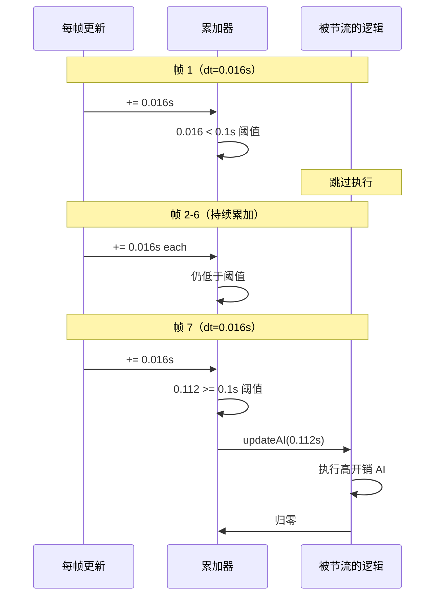
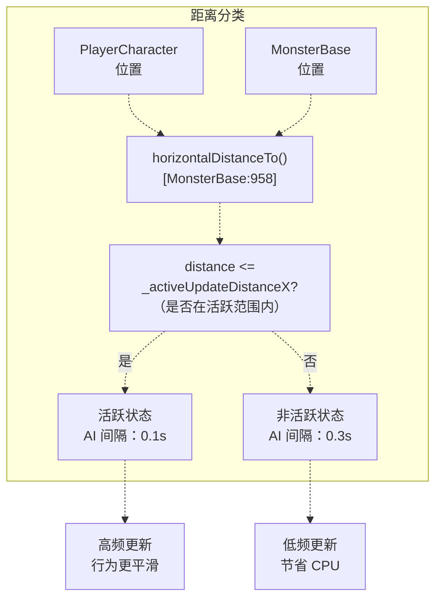
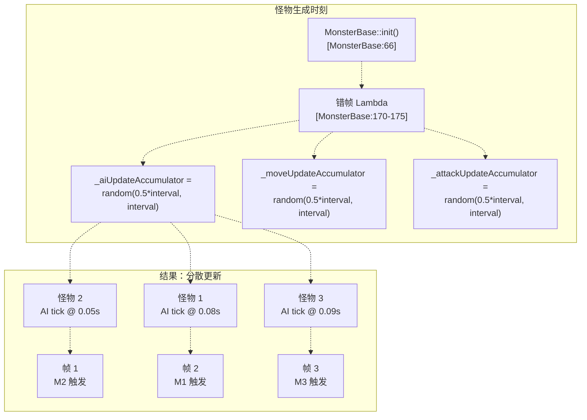
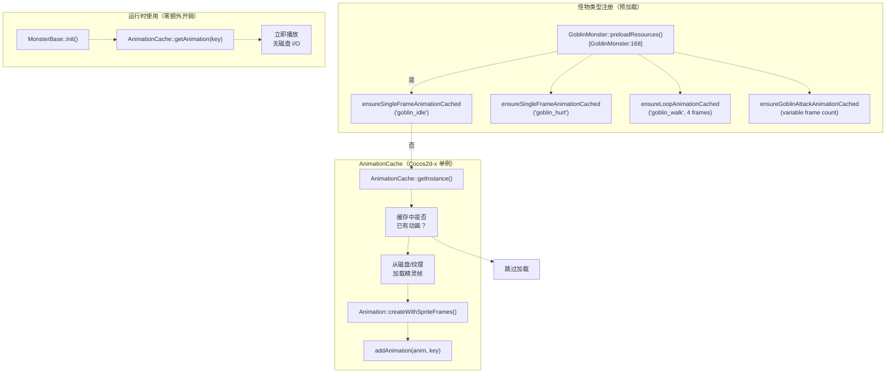

# 性能优化

> **相关源文件**
> * [Adventure-King/Classes/Character/Base/CharacterData.h](https://github.com/lilong555/Adventure-King/blob/60df0f40/Adventure-King/Classes/Character/Base/CharacterData.h)
> * [Adventure-King/Classes/Character/Monster/MonsterBase.cpp](https://github.com/lilong555/Adventure-King/blob/60df0f40/Adventure-King/Classes/Character/Monster/MonsterBase.cpp)
> * [Adventure-King/Classes/Character/Monster/MonsterBase.h](https://github.com/lilong555/Adventure-King/blob/60df0f40/Adventure-King/Classes/Character/Monster/MonsterBase.h)
> * [Adventure-King/Classes/Character/Monster/Monsters/GoblinMonster.cpp](https://github.com/lilong555/Adventure-King/blob/60df0f40/Adventure-King/Classes/Character/Monster/Monsters/GoblinMonster.cpp)
> * [Adventure-King/Classes/Character/Monster/Monsters/GoblinMonster.h](https://github.com/lilong555/Adventure-King/blob/60df0f40/Adventure-King/Classes/Character/Monster/Monsters/GoblinMonster.h)
> * [Adventure-King/Classes/Scenes/DebugScene.cpp](https://github.com/lilong555/Adventure-King/blob/60df0f40/Adventure-King/Classes/Scenes/DebugScene.cpp)
> * [Adventure-King/Classes/Scenes/DebugScene.h](https://github.com/lilong555/Adventure-King/blob/60df0f40/Adventure-King/Classes/Scenes/DebugScene.h)
> * [Adventure-King/Classes/Scenes/GameScene.cpp](https://github.com/lilong555/Adventure-King/blob/60df0f40/Adventure-King/Classes/Scenes/GameScene.cpp)
> * [Adventure-King/Classes/Scenes/GameScene.h](https://github.com/lilong555/Adventure-King/blob/60df0f40/Adventure-King/Classes/Scenes/GameScene.h)
> * [Adventure-King/proj.win32/Adventure-King.vcxproj](https://github.com/lilong555/Adventure-King/blob/60df0f40/Adventure-King/proj.win32/Adventure-King.vcxproj)
> * [Adventure-King/proj.win32/Adventure-King.vcxproj.filters](https://github.com/lilong555/Adventure-King/blob/60df0f40/Adventure-King/proj.win32/Adventure-King.vcxproj.filters)

## 目的与范围

本文记录 Adventure-King 中用于性能优化的技术手段：目标是在大量实体同时活跃时仍保持 60 FPS 的流畅体验。优化重点包括：通过更新节流降低 CPU 开销、基于距离的裁剪、资源预热与错帧更新。

关于物理系统配置请参见 [8.4](<物理分类系统.md>)。关于动画系统集成细节请参见 [8.2](<动画系统.md>)。

---

## 更新节流系统

Adventure-King 实现了一套较为完善的更新节流机制：在不牺牲操作与战斗响应的前提下，降低高开销逻辑的执行频率。该系统把 AI 决策、移动计算、攻击检测拆分为彼此独立的节流子系统，从而更细粒度地控制 CPU 开销。

### 节流架构

```mermaid
flowchart TD

AttackAccum["_attackUpdateAccumulator<br>+= dt"]
MainUpdate["update(dt)<br>[MonsterBase:281]"]
AIAccum["_aiUpdateAccumulator<br>+= dt"]
AICheck["累加值 >=<br>_aiUpdateInterval?"]
AIExecute["updateAI(accumulator)<br>[MonsterBase:454]"]
AIReset["累加值 = 0"]
MoveAccum["_moveUpdateAccumulator<br>+= dt"]
MoveCheck["累加值 >=<br>_moveUpdateInterval?"]
MoveExecute["updateMovement(accumulator)<br>[MonsterBase:566]"]
MoveReset["累加值 = 0"]
AttackCheck["累加值 >=<br>_attackUpdateInterval?"]
AttackExecute["updateAttack(accumulator)<br>[MonsterBase:644]"]
AttackReset["累加值 = 0"]

subgraph subGraph3 ["MonsterBase 更新循环"]
    MainUpdate
    MainUpdate -.->|"否"| AIAccum
    AICheck -.-> MoveAccum
    AIReset -.->|"是"| MoveAccum
    MoveCheck -.-> AttackAccum
    MoveReset -.-> AttackAccum
    AttackCheck -.-> MainUpdate

subgraph subGraph2 ["攻击子系统节流"]
    AttackAccum
    AttackCheck
    AttackExecute
    AttackReset
    AttackAccum -.->|"是"| AttackCheck
    AttackCheck -.-> AttackExecute
    AttackExecute -.-> AttackReset
end

subgraph subGraph1 ["移动子系统节流"]
    MoveAccum
    MoveCheck
    MoveExecute
    MoveReset
    MoveAccum -.-> MoveCheck
    MoveCheck -.-> MoveExecute
    MoveExecute -.-> MoveReset
end

subgraph subGraph0 ["AI 子系统节流"]
    AIAccum
    AICheck
    AIExecute
    AIReset
    AIAccum -.->|"是"| AICheck
    AICheck -.->|"否"| AIExecute
    AIExecute -.->|"否"| AIReset
end
end
```



**来源：** [Adventure-King/Classes/Character/Monster/MonsterBase.cpp L281-L414](https://github.com/lilong555/Adventure-King/blob/60df0f40/Adventure-King/Classes/Character/Monster/MonsterBase.cpp#L281-L414)

### 间隔配置

节流间隔可以按怪物类型进行配置，入口为 `setUpdateTickIntervals()` 方法：

| 子系统 | 默认间隔 | 用途 |
| --- | --- | --- |
| `_aiUpdateInterval` | 0.1s（10 Hz） | AI 决策、目标选择、状态切换 |
| `_moveUpdateInterval` | 0.033s（30 Hz） | 移动速度计算、寻路等 |
| `_attackUpdateInterval` | 0.05s（20 Hz） | 攻击范围检测、冷却判定 |

**来源：** [Adventure-King/Classes/Character/Monster/MonsterBase.cpp L152-L155](https://github.com/lilong555/Adventure-King/blob/60df0f40/Adventure-King/Classes/Character/Monster/MonsterBase.cpp#L152-L155)

 [Adventure-King/Classes/Character/Monster/MonsterBase.h L169-L173](https://github.com/lilong555/Adventure-King/blob/60df0f40/Adventure-King/Classes/Character/Monster/MonsterBase.h#L169-L173)

### 累加器（Accumulator）实现模式



**来源：** [Adventure-King/Classes/Character/Monster/MonsterBase.cpp L332-L341](https://github.com/lilong555/Adventure-King/blob/60df0f40/Adventure-King/Classes/Character/Monster/MonsterBase.cpp#L332-L341)

该模式会把累加后的 `dt` 传入对应的更新函数，从而使时间相关逻辑（例如计时器、冷却）在节流条件下仍能保持精度与一致性。

---

## 基于距离的活跃/非活跃更新

通过“二档更新”机制，远离玩家的怪物会以更低频率执行 AI 更新。当关卡很大、怪物数量很多、但实际靠近玩家的只有少数时，这个优化尤为关键。

### 活跃范围（Active Range）系统



**来源：** [Adventure-King/Classes/Character/Monster/MonsterBase.cpp L325-L341](https://github.com/lilong555/Adventure-King/blob/60df0f40/Adventure-King/Classes/Character/Monster/MonsterBase.cpp#L325-L341)

 [Adventure-King/Classes/Character/Monster/MonsterBase.h L139-L141](https://github.com/lilong555/Adventure-King/blob/60df0f40/Adventure-King/Classes/Character/Monster/MonsterBase.h#L139-L141)

### 实现细节

`isWithinActiveUpdateRange()` 用于判断怪物应使用“活跃”还是“非活跃”的更新间隔：

**活跃范围计算** [Adventure-King/Classes/Character/Monster/MonsterBase.cpp L443-L453](https://github.com/lilong555/Adventure-King/blob/60df0f40/Adventure-King/Classes/Character/Monster/MonsterBase.cpp#L443-L453)

:

```yaml
默认值：_activeUpdateDistanceX = visibleSize.width * 1.5
```

**间隔选择** [Adventure-King/Classes/Character/Monster/MonsterBase.cpp L325-L327](https://github.com/lilong555/Adventure-King/blob/60df0f40/Adventure-King/Classes/Character/Monster/MonsterBase.cpp#L325-L327)

:

```
aiInterval = withinActiveRange ? _aiUpdateInterval : _inactiveAiUpdateInterval
```

**非活跃状态优化** [Adventure-King/Classes/Character/Monster/MonsterBase.cpp L346-L361](https://github.com/lilong555/Adventure-King/blob/60df0f40/Adventure-King/Classes/Character/Monster/MonsterBase.cpp#L346-L361)

:

* 冻结水平速度（`v.x = 0`）
* 跳过移动与攻击相关计算
* 将攻击状态重置为 `IDLE`，避免攻击中途“卡住”

**来源：** [Adventure-King/Classes/Character/Monster/MonsterBase.cpp L325-L361](https://github.com/lilong555/Adventure-King/blob/60df0f40/Adventure-King/Classes/Character/Monster/MonsterBase.cpp#L325-L361)

### 性能影响表

| 场景 | 怪物总数 | 活跃 | 非活跃 | AI 更新/秒 |
| --- | --- | --- | --- | --- |
| 小型竞技场 | 10 | 10 | 0 | 100（10×10Hz） |
| 大型关卡 | 30 | 5 | 25 | 133（5×10Hz + 25×3.33Hz） |
| Boss + 小怪 | 15 | 8 | 7 | 103（8×10Hz + 7×3.33Hz） |

**来源：** [Adventure-King/Classes/Character/Monster/MonsterBase.cpp L152-L154](https://github.com/lilong555/Adventure-King/blob/60df0f40/Adventure-King/Classes/Character/Monster/MonsterBase.cpp#L152-L154)

 [Adventure-King/Classes/Character/Monster/MonsterBase.cpp L325-L327](https://github.com/lilong555/Adventure-King/blob/60df0f40/Adventure-King/Classes/Character/Monster/MonsterBase.cpp#L325-L327)

---

## 错帧更新（Frame Staggering）

当多个怪物在同一时刻生成（例如竞技场波次刷怪）时，如果只做“朴素的节流”，会导致所有怪物在同一帧集中执行高开销逻辑，从而产生周期性的帧时间尖刺。Adventure-King 通过“错帧初始化累加器”的方式来避免该问题。

### 错帧算法



**来源：** [Adventure-King/Classes/Character/Monster/MonsterBase.cpp L168-L179](https://github.com/lilong555/Adventure-King/blob/60df0f40/Adventure-King/Classes/Character/Monster/MonsterBase.cpp#L168-L179)

### 错帧实现

错帧 Lambda 会把各累加器初始化为“处于区间 50%～100% 之间的随机值”：

```
random(intervalSeconds * 0.5f, intervalSeconds)
```

这样可以保证：

1. **不会立即触发**：首次更新不会发生在生成当帧
2. **负载分散**：更新触发被分散到 `0.5×interval` 的时间窗内
3. **保持响应**：首次触发仍足够快（在 `0.5～1.0×interval` 内）

**示例**：当 `_aiUpdateInterval = 0.1s` 且三个怪物同时生成时，它们首次 AI tick 大致会发生在：

* 怪物 1：0.08s（约第 5 帧）
* 怪物 2：0.06s（约第 4 帧）
* 怪物 3：0.09s（约第 5～6 帧）

**来源：** [Adventure-King/Classes/Character/Monster/MonsterBase.cpp L168-L179](https://github.com/lilong555/Adventure-King/blob/60df0f40/Adventure-King/Classes/Character/Monster/MonsterBase.cpp#L168-L179)

---

## 资源预加载

Adventure-King 通过“两阶段资源预加载”来消除运行时加载卡顿：

1. **按怪物类型预热动画缓存**
2. **通过场景级资源注册表配合 LoadingScene**

### 动画缓存系统



**来源：** [Adventure-King/Classes/Character/Monster/Monsters/GoblinMonster.cpp L168-L179](https://github.com/lilong555/Adventure-King/blob/60df0f40/Adventure-King/Classes/Character/Monster/Monsters/GoblinMonster.cpp#L168-L179)

 [Adventure-King/Classes/Character/Monster/Monsters/GoblinMonster.cpp L13-L104](https://github.com/lilong555/Adventure-King/blob/60df0f40/Adventure-King/Classes/Character/Monster/Monsters/GoblinMonster.cpp#L13-L104)

### 预加载时机

`preloadResources()` 静态方法建议在以下时机调用：

1. **LoadingScene 初始化**（当 `SceneRegistry` 指定了资源清单时）
2. **应用启动阶段**（针对高频使用的怪物类型）
3. **地图/关卡初始化阶段**（针对该关卡独有的怪物）

**来源：** [Adventure-King/Classes/Character/Monster/Monsters/GoblinMonster.h L18-L19](https://github.com/lilong555/Adventure-King/blob/60df0f40/Adventure-King/Classes/Character/Monster/Monsters/GoblinMonster.h#L18-L19)

### 场景资源注册表

`SceneRegistry` 系统（在高层架构图中有引用）允许各个场景提前声明资源依赖：

| 场景 | 资源声明位置 | 预加载目标 |
| --- | --- | --- |
| GameScene 的不同变体 | 场景类中的 `setupRegistry()` | TMX 瓦片、怪物精灵、技能粒子 |
| DebugScene | [Adventure-King/Classes/Scenes/DebugScene.cpp L63-L75](https://github.com/lilong555/Adventure-King/blob/60df0f40/Adventure-King/Classes/Scenes/DebugScene.cpp#L63-L75) | 最小化（测试环境） |

**来源：** [Adventure-King/Classes/Scenes/DebugScene.cpp L63-L75](https://github.com/lilong555/Adventure-King/blob/60df0f40/Adventure-King/Classes/Scenes/DebugScene.cpp#L63-L75)

---

## 粒子与特效优化

虽然在本文列出的文件片段中未直接展示具体实现，但从工程结构与引用关系可以看出，粒子优化主要通过以下方式实现：

1. `ParticlePreloadHelper` 预热工具（文件列表中引用：[Adventure-King/Classes/Utils/ParticlePreloadHelper.h](https://github.com/lilong555/Adventure-King/blob/60df0f40/Adventure-King/Classes/Utils/ParticlePreloadHelper.h)）
2. `ParticleVfxHelper` 粒子复用/池化工具（文件列表中引用：[Adventure-King/Classes/Utils/ParticleVfxHelper.h](https://github.com/lilong555/Adventure-King/blob/60df0f40/Adventure-King/Classes/Utils/ParticleVfxHelper.h)）

这些工具通常会实现（或承载）如下优化点：

* **粒子文件预加载**：避免运行时解析 `.plist`
* **粒子系统池化**：对高频特效（受击、爆炸等）进行复用
* **一次性粒子的自动清理**：避免节点堆积与内存泄漏风险

**来源：** [Adventure-King/proj.win32/Adventure-King.vcxproj L300-L301](https://github.com/lilong555/Adventure-King/blob/60df0f40/Adventure-King/proj.win32/Adventure-King.vcxproj#L300-L301)

---

## 配置参考

### MonsterBase 节流默认值

以下常量用于控制各类更新的执行频率，定义于 [Adventure-King/Classes/Character/Monster/MonsterBase.cpp L152-L155](https://github.com/lilong555/Adventure-King/blob/60df0f40/Adventure-King/Classes/Character/Monster/MonsterBase.cpp#L152-L155)

:

```
_aiUpdateInterval = GameConfig::Monster::Base::AI_UPDATE_INTERVAL;
_inactiveAiUpdateInterval = GameConfig::Monster::Base::AI_INACTIVE_UPDATE_INTERVAL;
_moveUpdateInterval = GameConfig::Monster::Base::MOVE_UPDATE_INTERVAL;
_attackUpdateInterval = GameConfig::Monster::Base::ATTACK_UPDATE_INTERVAL;
```

### Active Range 计算

默认活跃范围 [Adventure-King/Classes/Character/Monster/MonsterBase.cpp L158-L166](https://github.com/lilong555/Adventure-King/blob/60df0f40/Adventure-King/Classes/Character/Monster/MonsterBase.cpp#L158-L166)

:

```
_activeUpdateDistanceX = visibleSize.width * 
    GameConfig::Monster::Base::ACTIVE_UPDATE_DISTANCE_MULTIPLIER;
```

**推荐倍率**：屏幕宽度的 1.5 倍（让刚离屏的怪物仍保持较好的响应）

### 按怪物定制

各怪物类型可以通过 `setUpdateTickIntervals()` 与 `setInactiveAiUpdateInterval()` 覆盖默认值：

| 怪物类型 | AI 间隔 | 移动间隔 | 攻击间隔 | 理由 |
| --- | --- | --- | --- | --- |
| Goblin | 0.1s | 0.033s | 0.05s | 默认值（较均衡） |
| Boss | 0.05s | 0.016s | 0.033s | 需要更高的响应性 |
| 训练木桩 | 1.0s | 1.0s | 1.0s | 固定不动的目标 |

**来源：** [Adventure-King/Classes/Character/Monster/MonsterBase.cpp L426-L431](https://github.com/lilong555/Adventure-King/blob/60df0f40/Adventure-King/Classes/Character/Monster/MonsterBase.cpp#L426-L431)

---

## 性能监控


### GameScene 更新循环

GameScene 的主更新循环展示了节流机制如何融入整体流程 [Adventure-King/Classes/Scenes/GameScene.cpp L864-L935](https://github.com/lilong555/Adventure-King/blob/60df0f40/Adventure-King/Classes/Scenes/GameScene.cpp#L864-L935)

:

1. 死亡菜单检查（会阻断世界更新）
2. 暂停检查（仅允许 UI 更新）
3. 输入控制器更新（内部也会节流）
4. UI 控制器更新（总是执行）
5. Boss 状态清理
6. **LevelMap 敌人生成**（创建怪物时会初始化错帧累加器）
7. **竞技场更新**（波次刷怪）
8. 存档请求处理

**来源：** [Adventure-King/Classes/Scenes/GameScene.cpp L864-L935](https://github.com/lilong555/Adventure-King/blob/60df0f40/Adventure-King/Classes/Scenes/GameScene.cpp#L864-L935)

---

## 优化权衡

### 收益

| 优化项 | CPU 降幅 | 对玩法影响 |
| --- | --- | --- |
| AI 节流（10Hz） | 相比 60Hz 约减少 83% | 几乎无感（决策延迟 ＜100ms） |
| 非活跃更新（3.3Hz） | 相比 60Hz 约减少 94% | 无（离屏怪物） |
| 错帧更新 | 消除 300%+ 的尖刺 | 帧时间更平滑 |
| 动画缓存 | 每次生成约节省 100ms | 消除卡顿 |

### 限制

1. **AI 响应性**：100ms 的节流意味着敌人可能最多需要 100ms 才“注意到”玩家  **缓解**：Boss/关键敌人使用 50ms 间隔
2. **移动精度**：33ms 的移动更新可能带来轻微的“踏步感”  **缓解**：物理仍以完整 60Hz 运行，视觉差异通常很小
3. **内存开销**：动画缓存会消耗纹理内存  **缓解**：只缓存会用到的动画，并在场景切换时按需卸载

**来源：** [Adventure-King/Classes/Character/Monster/MonsterBase.cpp L325-L414](https://github.com/lilong555/Adventure-King/blob/60df0f40/Adventure-King/Classes/Character/Monster/MonsterBase.cpp#L325-L414)

---
