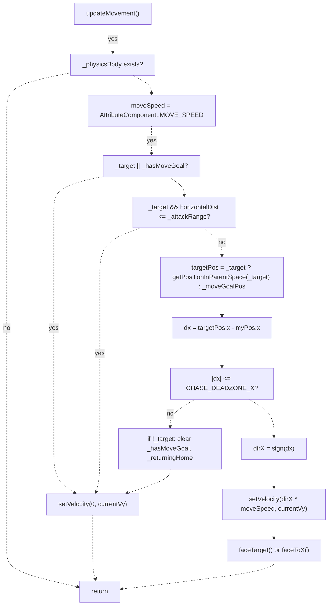
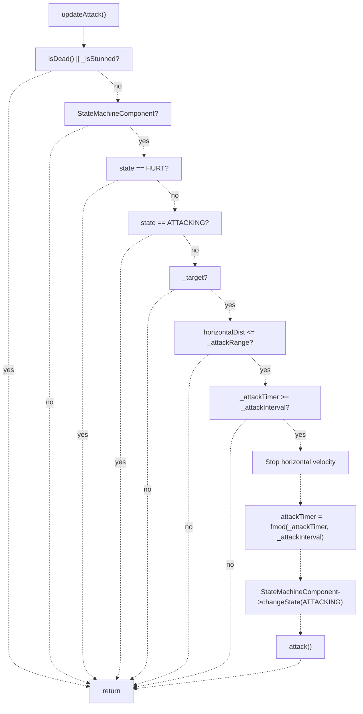
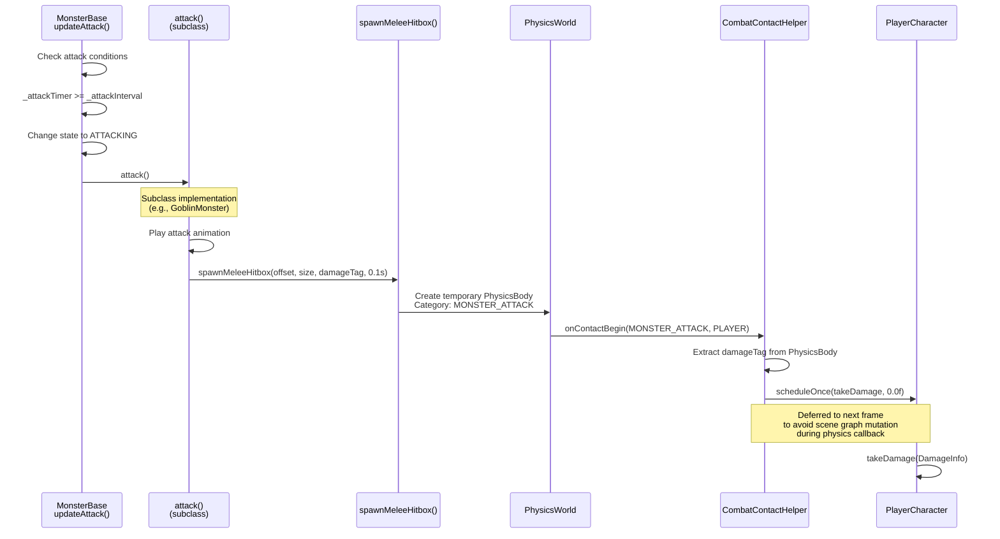
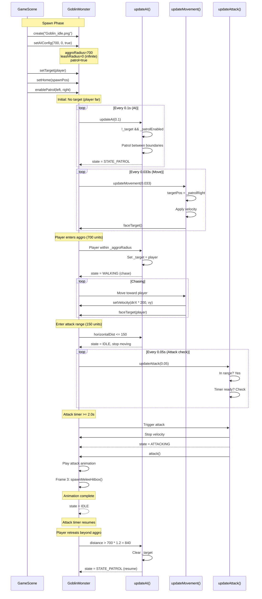

# 怪物 AI 与行为（Monster AI and Behavior）

> **相关源文件**
> * [Adventure-King/Classes/Character/Base/CharacterData.h](https://github.com/lilong555/Adventure-King/blob/60df0f40/Adventure-King/Classes/Character/Base/CharacterData.h)
> * [Adventure-King/Classes/Character/Monster/MonsterBase.cpp](https://github.com/lilong555/Adventure-King/blob/60df0f40/Adventure-King/Classes/Character/Monster/MonsterBase.cpp)
> * [Adventure-King/Classes/Character/Monster/MonsterBase.h](https://github.com/lilong555/Adventure-King/blob/60df0f40/Adventure-King/Classes/Character/Monster/MonsterBase.h)
> * [Adventure-King/Classes/Character/Monster/Monsters/GoblinMonster.cpp](https://github.com/lilong555/Adventure-King/blob/60df0f40/Adventure-King/Classes/Character/Monster/Monsters/GoblinMonster.cpp)
> * [Adventure-King/Classes/Character/Monster/Monsters/GoblinMonster.h](https://github.com/lilong555/Adventure-King/blob/60df0f40/Adventure-King/Classes/Character/Monster/Monsters/GoblinMonster.h)
> * [Adventure-King/Classes/Character/Player/SkillSets/AssassinSkillSet.cpp](https://github.com/lilong555/Adventure-King/blob/60df0f40/Adventure-King/Classes/Character/Player/SkillSets/AssassinSkillSet.cpp)
> * [Adventure-King/Classes/Character/Player/SkillSets/WarriorSkillSet.cpp](https://github.com/lilong555/Adventure-King/blob/60df0f40/Adventure-King/Classes/Character/Player/SkillSets/WarriorSkillSet.cpp)
> * [Adventure-King/Classes/Configs/GameConfig.h](https://github.com/lilong555/Adventure-King/blob/60df0f40/Adventure-King/Classes/Configs/GameConfig.h)
> * [Adventure-King/Classes/Scenes/CombatContactHelper.cpp](https://github.com/lilong555/Adventure-King/blob/60df0f40/Adventure-King/Classes/Scenes/CombatContactHelper.cpp)

## 目的与范围

本页介绍驱动 Adventure-King 怪物行为的 AI 决策系统，涵盖目标获取（aggro）、追击机制、牵引回家（leashing/home-return）、巡逻模式，以及当大量怪物同时活跃时用于优化性能的节流更新架构。

怪物战斗机制（攻击执行、命中框生成、伤害计算）请参见 [Monster Combat](怪物战斗.md)。具体怪物实现与示例请参见 [Specific Monster Types](具体怪物类型.md)。玩家与怪物共享的战斗逻辑请参见 [CharacterBase](角色基类（CharacterBase）.md)。

**来源：** [Adventure-King/Classes/Character/Monster/MonsterBase.cpp L1-L1111](https://github.com/lilong555/Adventure-King/blob/60df0f40/Adventure-King/Classes/Character/Monster/MonsterBase.cpp#L1-L1111)

 [Adventure-King/Classes/Character/Monster/MonsterBase.h L1-L184](https://github.com/lilong555/Adventure-King/blob/60df0f40/Adventure-King/Classes/Character/Monster/MonsterBase.h#L1-L184)

---

## 核心 AI 架构

AI 系统采用“按帧节流 + 基于状态的决策模型”：三个相互独立的子系统按可配置的时间间隔运行：

* **`updateAI()`**：评估环境条件，设置移动/攻击目标
* **`updateMovement()`**：基于当前目标施加物理速度
* **`updateAttack()`**：当条件满足时触发攻击执行

### AI 状态变量

| 成员变量 | 类型 | 作用 |
| --- | --- | --- |
| `_target` | `Node*` | 当前要追击/攻击的目标 |
| `_primaryTarget` | `Node*` | 丢失目标后的“重新仇恨”参考目标 |
| `_homePos` | `Vec2` | 牵引回家的出生点 |
| `_hasHome` | `bool` | 是否设置了 home 位置 |
| `_returningHome` | `bool` | 回家期间阻止重新仇恨 |
| `_moveGoalPos` | `Vec2` | 巡逻/回家使用的中间路点（父节点坐标） |
| `_hasMoveGoal` | `bool` | 是否存在中间路点 |
| `_isStunned` | `bool` | 强制中断标志（冻结全部 AI） |

```mermaid
flowchart TD

Target["_target<br>(Current Enemy)"]
Primary["_primaryTarget<br>(Re-Aggro Reference)"]
Home["_homePos + _hasHome<br>(Leash Anchor)"]
Goal["_moveGoalPos + _hasMoveGoal<br>(Patrol/Return Waypoint)"]
Flags["_returningHome<br>_isStunned"]
AI["updateAI()<br>Decision Logic"]
Move["updateMovement()<br>Physics Velocity"]
Attack["updateAttack()<br>Attack Trigger"]

AI -.->|"reads"| Target
AI -.->|"reads"| Primary
AI -.->|"reads"| Home
AI -.->|"writes"| Goal
AI -.->|"writes"| Flags
Move -.->|"reads"| Target
Move -.-> Goal
Attack -.->|"reads"| Target

subgraph subGraph1 ["Update Subsystems"]
    AI
    Move
    Attack
end

	subgraph subGraph0 ["MonsterBase AI State"]
	    Target
	    Primary
	    Home
	    Goal
	    Flags
	end

**来源：** [Adventure-King/Classes/Character/Monster/MonsterBase.h L142-L163](https://github.com/lilong555/Adventure-King/blob/60df0f40/Adventure-King/Classes/Character/Monster/MonsterBase.h#L142-L163)

---

## AI 配置参数

怪物通过三个核心距离参数来定义行为区域：

> 说明：本节原文在导出时被截断，以下截断片段按原样保留以避免遗漏。

| Parameter | Member Variable | Purpose |
| --- …1798 chars truncated… : "alive"
    CheckDead --> Dead : "state==ATTACKING"
    CheckDead --> CheckStunned : "alive"
    CheckStunned --> IdleStunned : "state==ATTACKING"
    CheckStunned --> CheckAttacking : "not stunned"
    CheckAttacking --> ReturnEarly : "_leashRadius > 0 && _hasHome"
    CheckAttacking --> CheckTarget : "state!=ATTACKING"
    CheckTarget --> ReAcquire : "!_target && !_returningHome && _primaryTarget"
    CheckTarget --> NoTarget : "distance > _aggroRadius"
    ReAcquire --> SetTarget : "distance <= _aggroRadius"
    ReAcquire --> NoTarget : "no leash constraint"
    SetTarget --> CheckLeash : "_target acquired"
    NoTarget --> CheckMoveGoal : "!_hasMoveGoal"
    NoTarget --> CheckPatrol : "!_hasMoveGoal"
    CheckMoveGoal --> Walking : "continue to waypoint"
    NoTarget --> CheckPatrol : "!_hasMoveGoal"
    CheckMoveGoal --> Walking : "continue to waypoint"
    CheckPatrol --> Patrol : "_patrolEnabled && boundaries set"
    CheckPatrol --> Idle : "no patrol"
    CheckLeash --> LeashCheck : "_leashRadius > 0 && _hasHome"
    CheckLeash --> CheckAggroLoss : "no leash constraint"
    LeashCheck --> ReturnHome : "distance from home > _leashRadius"
    LeashCheck --> CheckAggroLoss : "within leash"
    CheckAggroLoss --> LoseTarget : "distance > _aggroRadius * 1.2"
    CheckAggroLoss --> CheckAttackRange : "distance > _aggroRadius * 1.2"
    LoseTarget --> CheckPatrol : "in aggro"
    CheckAttackRange --> IdleInRange : "horizontalDist <= _attackRange"
    CheckAttackRange --> Chase : "horizontalDist > _attackRange"
    IdleInRange --> [*] : "IDLE state"
    Chase --> [*] : "IDLE state"
    Walking --> [*] : "STATE_PATROL"
    Patrol --> [*] : "WALKING state"
    Idle --> [*] : "WALKING state"
    ReturnHome --> [*] : "WALKING to home"
    IdleStunned --> [*] : "no change"
    ReturnEarly --> [*] : "WALKING to home"
    Dead --> [*] : "no change"
```

### 关键决策点

#### 1. 重新仇恨（Re-Aggro）检查（Lines 482-488）

当 `_target` 为空而 `_primaryTarget` 存在时：

* 仅在 **不处于回家中** 时检查（避免回家途中再次分心）
* 若距离 ≤ `_aggroRadius` 则重新锁定（或 `_aggroRadius <= 0` 表示无限）

#### 2. 牵引（Leash）检查（Lines 532-544）

若离 home 的距离超过 `_leashRadius`：

1. 清空 `_target`（放弃追击）
2. 设置 `_moveGoalPos = _homePos`
3. 设置 `_hasMoveGoal = true`、`_returningHome = true`
4. 切换到 WALKING 状态

#### 3. 带滞回的仇恨丢失（Lines 521-529）

当距离超过 `_aggroRadius * 1.2`（20% 缓冲）才清空目标：

* **获得目标：** `distance <= aggroRadius`
* **丢失目标：** `distance > aggroRadius * 1.2`

用于防止边界抖动。

#### 4. 攻击距离（Lines 547-553）

当 `horizontalDistanceTo(_target) <= _attackRange` 时停止移动并切换到 IDLE。

#### 5. 巡逻兜底（Lines 497-514）

当无目标且无 move goal 时，如果启用巡逻，就在 `_patrolLeft` 与 `_patrolRight` 间往返；当距离端点小于 `PATROL_REACH_EPSILON`（默认 8 像素）时翻转方向。

**来源：** [Adventure-King/Classes/Character/Monster/MonsterBase.cpp L454-L560](https://github.com/lilong555/Adventure-King/blob/60df0f40/Adventure-King/Classes/Character/Monster/MonsterBase.cpp#L454-L560)

 [Adventure-King/Classes/Configs/GameConfig.h L416-L417](https://github.com/lilong555/Adventure-King/blob/60df0f40/Adventure-King/Classes/Configs/GameConfig.h#L416-L417)

---

## 目标获取与仇恨（Aggro）

### 初始目标设置

目标通常在生成怪物时由外部设置：

```sql
// GameScene or LevelMap spawn logic
auto monster = GoblinMonster::create();
monster->setTarget(player);          // Sets _target and _primaryTarget
monster->setHome(spawnPosition);     // Sets _homePos for leashing
```

[Adventure-King/Classes/Character/Monster/MonsterBase.cpp L1074-L1084](https://github.com/lilong555/Adventure-King/blob/60df0f40/Adventure-King/Classes/Character/Monster/MonsterBase.cpp#L1074-L1084)

### 回家期间防止重新仇恨

`_returningHome` 会阻止怪物在回家途中重新锁定目标：

```
// In updateAI()
if (!_target && !_returningHome && _primaryTarget) {
    if (_aggroRadius <= 0.0f || distanceTo(_primaryTarget) <= _aggroRadius) {
        _target = _primaryTarget;  // Re-acquire
    }
}
```

保证怪物先完成回家，再响应玩家重新进入仇恨范围。

**来源：** [Adventure-King/Classes/Character/Monster/MonsterBase.cpp L482-L488](https://github.com/lilong555/Adventure-King/blob/60df0f40/Adventure-King/Classes/Character/Monster/MonsterBase.cpp#L482-L488)

### 滞回缓冲（Hysteresis Buffer）

为避免仇恨边界“闪烁”：

| 事件 | 阈值 |
| --- | --- |
| 获得目标 | `distance <= _aggroRadius` |
| 丢失目标 | `distance > _aggroRadius * 1.2` |

这会形成一个稳定的 20% 过渡区，怪物不会在边界快速切换仇恨状态。

**来源：** [Adventure-King/Classes/Character/Monster/MonsterBase.cpp L521-L529](https://github.com/lilong555/Adventure-King/blob/60df0f40/Adventure-King/Classes/Character/Monster/MonsterBase.cpp#L521-L529)

---

## 牵引与回家

### 牵引触发

当 `_leashRadius > 0` 且 `_hasHome` 为 true 时，每次 AI 更新会检查离 home 的距离：

```javascript
if (_leashRadius > 0.0f && _hasHome) {
    const float distFromHome = getPosition().distance(_homePos);
    if (distFromHome > _leashRadius) {
        _target = nullptr;
        _moveGoalPos = _homePos;
        _hasMoveGoal = true;
        _returningHome = true;
        sm->changeState(CharacterState::WALKING);
        return;
    }
}
```

**来源：** [Adventure-King/Classes/Character/Monster/MonsterBase.cpp L532-L544](https://github.com/lilong555/Adventure-King/blob/60df0f40/Adventure-King/Classes/Character/Monster/MonsterBase.cpp#L532-L544)

### 到家判定

移动逻辑使用 `CHASE_DEADZONE_X`（默认 8 像素）。当到 `_moveGoalPos` 的水平距离小于该阈值时：

```
float dx = targetPos.x - myPos.x;
if (fabs(dx) <= kChaseDeadzoneX) {
    _physicsBody->setVelocity(Vec2(0, currentVy));
    
    if (!_target && _hasMoveGoal) {
        _hasMoveGoal = false;
        _returningHome = false;  // Allow re-aggro
    }
    return;
}
```

此时怪物可继续巡逻，或在玩家重新进入仇恨范围时重新响应。

**来源：** [Adventure-King/Classes/Character/Monster/MonsterBase.cpp L602-L615](https://github.com/lilong555/Adventure-King/blob/60df0f40/Adventure-King/Classes/Character/Monster/MonsterBase.cpp#L602-L615)

 [Adventure-King/Classes/Configs/GameConfig.h L417](https://github.com/lilong555/Adventure-King/blob/60df0f40/Adventure-King/Classes/Configs/GameConfig.h#L417-L417)

### 牵引配置示例

```
// Infinite chase (Boss-style)
monster->setLeashRadius(0.0f);

// Short leash (patrol monster)
monster->setLeashRadius(400.0f);

// Goblin default: no leash
setAIConfig(700.0f,  // aggro radius
            0.0f,    // leash radius (infinite)
            true);   // patrol enabled
```

**来源：** [Adventure-King/Classes/Character/Monster/MonsterBase.cpp L1091-L1094](https://github.com/lilong555/Adventure-King/blob/60df0f40/Adventure-King/Classes/Character/Monster/MonsterBase.cpp#L1091-L1094)

 [Adventure-King/Classes/Configs/GameConfig.h L466](https://github.com/lilong555/Adventure-King/blob/60df0f40/Adventure-King/Classes/Configs/GameConfig.h#L466-L466)

---

## 巡逻行为

### 巡逻设置

```
monster->enablePatrol(Vec2(100, 200),   // _patrolLeft
                      Vec2(500, 200));  // _patrolRight
```

巡逻只有在以下条件满足时才会生效：

* `_patrolEnabled` 为 true
* `|_patrolRight.x - _patrolLeft.x| > 1.0f`（边界确实不同）
* 怪物既没有目标，也没有 move goal

**来源：** [Adventure-King/Classes/Character/Monster/MonsterBase.cpp L1096-L1102](https://github.com/lilong555/Adventure-King/blob/60df0f40/Adventure-King/Classes/Character/Monster/MonsterBase.cpp#L1096-L1102)

### 巡逻逻辑

简单的往返（ping-pong）模式：

```javascript
if (_patrolEnabled && std::fabs(_patrolRight.x - _patrolLeft.x) > 1.0f) {
    const float kPatrolReachEpsilon = GameConfig::Monster::Base::PATROL_REACH_EPSILON;
    float dx = (_patrolDir > 0 ? _patrolRight.x : _patrolLeft.x) - getPositionX();
    
    // Reached boundary? Flip direction
    if (std::fabs(dx) <= kPatrolReachEpsilon) {
        _patrolDir *= -1;
    }
    
    _moveGoalPos = (_patrolDir > 0) ? _patrolRight : _patrolLeft;
    _hasMoveGoal = true;
    sm->changeState(CharacterState::STATE_PATROL);
}
```

方向（`_patrolDir`）为 ±1，接近端点（8 像素阈值）时翻转方向。

**来源：** [Adventure-King/Classes/Character/Monster/MonsterBase.cpp L497-L510](https://github.com/lilong555/Adventure-King/blob/60df0f40/Adventure-King/Classes/Character/Monster/MonsterBase.cpp#L497-L510)

 [Adventure-King/Classes/Configs/GameConfig.h L416](https://github.com/lilong555/Adventure-King/blob/60df0f40/Adventure-King/Classes/Configs/GameConfig.h#L416-L416)

---

## 移动执行

`updateMovement()` 以节流间隔运行（默认 33ms ≈ 30 FPS），用于在保留垂直物理的前提下应用水平速度。

### 移动决策树



### 关键实现细节

#### 保持垂直速度

所有水平速度变更都会保留 `currentVy`，以保持重力/跳跃物理：

```
float currentVy = _physicsBody->getVelocity().y;
_physicsBody->setVelocity(Vec2(dirX * moveSpeed, currentVy));
```

[Adventure-King/Classes/Character/Monster/MonsterBase.cpp L595-L623](https://github.com/lilong555/Adventure-King/blob/60df0f40/Adventure-King/Classes/Character/Monster/MonsterBase.cpp#L595-L623)

#### 进入攻击范围即停

即使目标仍存在，只要进入攻击范围就停止移动：

```
if (_target && horizontalDistanceTo(_target) <= _attackRange) {
    float currentVy = _physicsBody->getVelocity().y;
    _physicsBody->setVelocity(Vec2(0, currentVy));
    return;
}
```

[Adventure-King/Classes/Character/Monster/MonsterBase.cpp L586-L592](https://github.com/lilong555/Adventure-King/blob/60df0f40/Adventure-King/Classes/Character/Monster/MonsterBase.cpp#L586-L592)

#### Deadzone（死区）

8 像素容差用于避免微小抖动：

```
float dx = targetPos.x - myPos.x;
if (fabs(dx) <= GameConfig::Monster::Base::CHASE_DEADZONE_X) {
    _physicsBody->setVelocity(Vec2(0, currentVy));
    // Clear goal if reached
    if (!_target && _hasMoveGoal) {
        _hasMoveGoal = false;
        _returningHome = false;
    }
    return;
}
```

[Adventure-King/Classes/Character/Monster/MonsterBase.cpp L602-L615](https://github.com/lilong555/Adventure-King/blob/60df0f40/Adventure-King/Classes/Character/Monster/MonsterBase.cpp#L602-L615)

 [Adventure-King/Classes/Configs/GameConfig.h L417](https://github.com/lilong555/Adventure-King/blob/60df0f40/Adventure-King/Classes/Configs/GameConfig.h#L417-L417)

---

## 攻击判定与执行

攻击逻辑在 `updateAttack()` 中以节流间隔运行（默认 50ms ≈ 20 FPS）。

### 攻击条件链



所有条件都必须满足才会触发攻击：

1. 未死亡、未眩晕
2. 存在 `StateMachineComponent`
3. 不处于 HURT
4. 不处于 ATTACKING
5. `_target` 有效
6. 水平距离在攻击范围内
7. 攻击冷却就绪

**来源：** [Adventure-King/Classes/Character/Monster/MonsterBase.cpp L644-L692](https://github.com/lilong555/Adventure-King/blob/60df0f40/Adventure-King/Classes/Character/Monster/MonsterBase.cpp#L644-L692)

### 攻击计时器管理

计时器每帧累加，但在 ATTACKING 状态期间不会累加：

```sql
// In update()
if (state != CharacterState::ATTACKING) {
    _attackTimer += dt;
}
```

触发攻击后，计时器通过取模保留溢出值：

```cpp
if (_attackInterval > 0.0f) {
    _attackTimer = std::fmod(_attackTimer, _attackInterval);
    if (_attackTimer < 0.0f) {
        _attackTimer += _attackInterval;
    }
} else {
    _attackTimer = 0.0f;
}
```

这让怪物在“略微错过冷却时间”时也能正常衔接攻击（相当于可排队）。

**来源：** [Adventure-King/Classes/Character/Monster/MonsterBase.cpp L364-L367](https://github.com/lilong555/Adventure-King/blob/60df0f40/Adventure-King/Classes/Character/Monster/MonsterBase.cpp#L364-L367)

 [Adventure-King/Classes/Character/Monster/MonsterBase.cpp L678-L689](https://github.com/lilong555/Adventure-King/blob/60df0f40/Adventure-King/Classes/Character/Monster/MonsterBase.cpp#L678-L689)

### 默认攻击实现

基类默认把攻击委托给技能系统：

```
void MonsterBase::attack() {
    if (auto skill = getSkillComponent())
        skill->useActiveSkill(0);  // Slot 0
}
```

子类通常会覆写以实现自定义行为（例如 `GoblinMonster::attack()`：播放多帧动画，并在特定帧生成命中框）。

**来源：** [Adventure-King/Classes/Character/Monster/MonsterBase.cpp L699-L704](https://github.com/lilong555/Adventure-King/blob/60df0f40/Adventure-King/Classes/Character/Monster/MonsterBase.cpp#L699-L704)

 [Adventure-King/Classes/Character/Monster/Monsters/GoblinMonster.cpp L254-L354](https://github.com/lilong555/Adventure-King/blob/60df0f40/Adventure-King/Classes/Character/Monster/Monsters/GoblinMonster.cpp#L254-L354)

---

## 性能优化：更新节流

为了支持大量怪物同时存在，AI/移动/攻击更新会分别节流。

### 节流配置

```python
// MonsterBase initialization defaults (from GameConfig)
_aiUpdateInterval = 0.1f;               // Active AI: 10 FPS
_inactiveAiUpdateInterval = 0.3f;       // Inactive AI: ~3 FPS
_moveUpdateInterval = 0.033f;           // Movement: ~30 FPS
_attackUpdateInterval = 0.05f;          // Attack checks: 20 FPS
```

**配置引用：**

| 常量 | 值 | 作用 |
| --- | --- | --- |
| `GameConfig::Monster::Base::AI_UPDATE_INTERVAL` | 0.1f | 活跃 AI 更新频率 |
| `GameConfig::Monster::Base::AI_INACTIVE_UPDATE_INTERVAL` | 0.3f | 非活跃 AI 更新频率 |
| `GameConfig::Monster::Base::MOVE_UPDATE_INTERVAL` | 0.033f | 移动更新频率 |
| `GameConfig::Monster::Base::ATTACK_UPDATE_INTERVAL` | 0.05f | 攻击判定频率 |

**来源：** [Adventure-King/Classes/Character/Monster/MonsterBase.cpp L152-L154](https://github.com/lilong555/Adventure-King/blob/60df0f40/Adventure-King/Classes/Character/Monster/MonsterBase.cpp#L152-L154)

 [Adventure-King/Classes/Configs/GameConfig.h L409-L412](https://github.com/lilong555/Adventure-King/blob/60df0f40/Adventure-King/Classes/Configs/GameConfig.h#L409-L412)

### Accumulator 模式

每个节流系统都使用 accumulator：

```
_aiUpdateAccumulator += dt;
if (_aiUpdateAccumulator >= aiInterval) {
    updateAI(_aiUpdateAccumulator);  // Pass accumulated time
    _aiUpdateAccumulator = 0.0f;
}
```

若 interval 为 0，则每帧更新：

```
if (aiInterval <= 0.0f) {
    updateAI(dt);
}
```

**来源：** [Adventure-King/Classes/Character/Monster/MonsterBase.cpp L328-L341](https://github.com/lilong555/Adventure-King/blob/60df0f40/Adventure-King/Classes/Character/Monster/MonsterBase.cpp#L328-L341)

### 生成错峰

为避免大量怪物同时生成导致帧尖峰（spike frames），accumulator 会预填充随机偏移：

```markdown
auto staggerAccumulator = [](float intervalSeconds) -> float {
    if (intervalSeconds <= 0.0f) return 0.0f;
    // Random value between [0.5*interval, interval]
    return cocos2d::random(intervalSeconds * 0.5f, intervalSeconds);
};

_aiUpdateAccumulator = staggerAccumulator(_aiUpdateInterval);
_moveUpdateAccumulator = staggerAccumulator(_moveUpdateInterval);
_attackUpdateAccumulator = staggerAccumulator(_attackUpdateInterval);
```

这会把第一次 tick 分散到多帧，平滑 CPU 负载。

**来源：** [Adventure-King/Classes/Character/Monster/MonsterBase.cpp L170-L179](https://github.com/lilong555/Adventure-King/blob/60df0f40/Adventure-King/Classes/Character/Monster/MonsterBase.cpp#L170-L179)

### 活跃更新范围

离玩家较远的怪物使用更慢的 AI interval，并冻结移动：

```javascript
const bool withinActiveRange = isWithinActiveUpdateRange();
const float aiInterval = withinActiveRange ? _aiUpdateInterval : _inactiveAiUpdateInterval;
```

活跃范围判定：

```javascript
bool MonsterBase::isWithinActiveUpdateRange() const {
    auto distanceTarget = _primaryTarget ? _primaryTarget : _target;
    if (!distanceTarget) return true;  // No target = always active
    if (_activeUpdateDistanceX <= 0.0f) return true;  // Disabled
    
    return horizontalDistanceTo(distanceTarget) <= _activeUpdateDistanceX;
}
```

默认范围为 `visibleSize.width * ACTIVE_UPDATE_DISTANCE_MULTIPLIER`（屏幕宽度的 1.5 倍）。

当不在活跃范围时，怪物会冻结水平速度，并在卡在 ATTACKING 时强制切到 IDLE：

```
if (!withinActiveRange) {
    if (_physicsBody) {
        Vec2 v = _physicsBody->getVelocity();
        v.x = 0;
        _physicsBody->setVelocity(v);
    }
    
    if (state == CharacterState::ATTACKING) {
        sm->changeState(CharacterState::IDLE);
    }
    return;  // Skip movement/attack updates
}
```

**来源：** [Adventure-King/Classes/Character/Monster/MonsterBase.cpp L325-L361](https://github.com/lilong555/Adventure-King/blob/60df0f40/Adventure-King/Classes/Character/Monster/MonsterBase.cpp#L325-L361)

 [Adventure-King/Classes/Character/Monster/MonsterBase.cpp L443-L453](https://github.com/lilong555/Adventure-King/blob/60df0f40/Adventure-King/Classes/Character/Monster/MonsterBase.cpp#L443-L453)

 [Adventure-King/Classes/Character/Monster/MonsterBase.cpp L158-L166](https://github.com/lilong555/Adventure-King/blob/60df0f40/Adventure-King/Classes/Character/Monster/MonsterBase.cpp#L158-L166)

 [Adventure-King/Classes/Configs/GameConfig.h L408](https://github.com/lilong555/Adventure-King/blob/60df0f40/Adventure-King/Classes/Configs/GameConfig.h#L408-L408)

---

## AI 中断：眩晕与受击

### 眩晕（Stun）状态

当 `_isStunned` 为 true（由状态效果或机制在外部设置）：

```
if (_isStunned) {
    sm->changeState(CharacterState::IDLE);
    _hasMoveGoal = false;
    if (_physicsBody) {
        Vec2 v = _physicsBody->getVelocity();
        v.x = 0;
        _physicsBody->setVelocity(v);
    }
    return;  // Skip all AI/movement/attack
}
```

此时 AI、移动与攻击逻辑都会被完全跳过。

**来源：** [Adventure-King/Classes/Character/Monster/MonsterBase.cpp L296-L307](https://github.com/lilong555/Adventure-King/blob/60df0f40/Adventure-King/Classes/Character/Monster/MonsterBase.cpp#L296-L307)

### 受击（Hurt）状态

当 `StateMachineComponent::getCurrentState() == CharacterState::HURT`：

```
if (state == CharacterState::HURT) {
    _hasMoveGoal = false;
    _returningHome = false;
    
    if (_physicsBody) {
        Vec2 v = _physicsBody->getVelocity();
        v.x = 0;
        _physicsBody->setVelocity(v);
    }
    return;  // Skip movement/attack
}
```

用于阻止怪物在受击动画期间移动或攻击。`StateMachineComponent` 会在受击动画结束后自动回到 IDLE。

**来源：** [Adventure-King/Classes/Character/Monster/MonsterBase.cpp L311-L323](https://github.com/lilong555/Adventure-King/blob/60df0f40/Adventure-King/Classes/Character/Monster/MonsterBase.cpp#L311-L323)

---

## 坐标系工具

怪物 AI 使用辅助函数处理不同父节点空间下的坐标转换（对相机跟随导致的嵌套场景树尤其重要）。

### 世界坐标（World Position）

```javascript
Vec2 MonsterBase::getWorldPosition(const Node *node) const {
    if (!node) return Vec2::ZERO;
    auto parent = node->getParent();
    return parent ? parent->convertToWorldSpace(node->getPosition()) 
                  : node->getPosition();
}
```

**来源：** [Adventure-King/Classes/Character/Monster/MonsterBase.cpp L933-L940](https://github.com/lilong555/Adventure-King/blob/60df0f40/Adventure-King/Classes/Character/Monster/MonsterBase.cpp#L933-L940)

### 父节点空间坐标（Parent Space Position）

当怪物与目标不在同一父节点下时使用：

```javascript
Vec2 MonsterBase::getPositionInParentSpace(const Node *node) const {
    if (!node) return Vec2::ZERO;
    
    auto myParent = getParent();
    auto nodeParent = node->getParent();
    if (myParent && nodeParent == myParent) {
        return node->getPosition();  // Fast path: same parent
    }
    
    // Convert via world space
    Vec2 worldPos = getWorldPosition(node);
    return myParent ? myParent->convertToNodeSpace(worldPos) : worldPos;
}
```

**来源：** [Adventure-King/Classes/Character/Monster/MonsterBase.cpp L942-L956](https://github.com/lilong555/Adventure-King/blob/60df0f40/Adventure-King/Classes/Character/Monster/MonsterBase.cpp#L942-L956)

### 距离计算

* **`horizontalDistanceTo()`**：返回绝对水平距离（忽略 Y），用于攻击范围判定
* **`distanceTo()`**：返回二维欧氏距离，用于仇恨/牵引判定

两者都会在父节点不同时自动处理坐标转换。

**来源：** [Adventure-King/Classes/Character/Monster/MonsterBase.cpp L958-L972](https://github.com/lilong555/Adventure-King/blob/60df0f40/Adventure-King/Classes/Character/Monster/MonsterBase.cpp#L958-L972)

 [Adventure-King/Classes/Character/Monster/MonsterBase.cpp L1053-L1067](https://github.com/lilong555/Adventure-King/blob/60df0f40/Adventure-King/Classes/Character/Monster/MonsterBase.cpp#L1053-L1067)

---

## 朝向（Facing Direction）

怪物通过 sprite 的 X 缩放翻转面向目标：

```javascript
void MonsterBase::faceTarget(Node* target) {
    if (!target) return;
    
    const float kFaceDeadzoneX = GameConfig::Monster::Base::FACE_DEADZONE_X;
    float dx = target->getPositionX() - getPositionX();
    if (std::fabs(dx) <= kFaceDeadzoneX) return;  // 8-pixel deadzone
    
    float sign = (dx < 0.0f) ? -1.0f : 1.0f;
    setScaleX(sign * std::fabs(_baseScaleX));
}
```

`FACE_DEADZONE_X`（8 像素）用于避免当目标几乎对齐时频繁左右翻转。

**来源：** [Adventure-King/Classes/Character/Monster/MonsterBase.cpp L1030-L1049](https://github.com/lilong555/Adventure-King/blob/60df0f40/Adventure-King/Classes/Character/Monster/MonsterBase.cpp#L1030-L1049)

 [Adventure-King/Classes/Configs/GameConfig.h L418](https://github.com/lilong555/Adventure-King/blob/60df0f40/Adventure-King/Classes/Configs/GameConfig.h#L418-L418)

---

## 与战斗系统的集成

AI 决策负责“什么时候攻击”，而伤害结算由物理接触系统完成：



AI 只决定 **何时** 攻击；而攻击的 **内容**（伤害值、命中框形状、命中时机）由具体怪物子类定义。

**来源：** [Adventure-King/Classes/Scenes/CombatContactHelper.cpp L72-L123](https://github.com/lilong555/Adventure-King/blob/60df0f40/Adventure-King/Classes/Scenes/CombatContactHelper.cpp#L72-L123)

 [Adventure-King/Classes/Character/Monster/MonsterBase.cpp L986-L1028](https://github.com/lilong555/Adventure-King/blob/60df0f40/Adventure-King/Classes/Character/Monster/MonsterBase.cpp#L986-L1028)

---

## 示例：Goblin 的 AI 流程

下面是一个典型 Goblin 行为的完整示例：



**配置值：**

| 参数 | 值 | 来源 |
| --- | --- | --- |
| 仇恨范围（Aggro Radius） | 700.0f | `GameConfig::Monster::Goblin::VISION_RANGE` |
| 攻击距离（Attack Range） | 150.0f | `GameConfig::Monster::Goblin::ATTACK_RANGE` |
| 攻击间隔（Attack Interval） | 2.0f | `GameConfig::Monster::Goblin::ATTACK_INTERVAL` |
| 移动速度（Move Speed） | 200.0f | `GameConfig::Monster::Goblin::MOVE_SPEED` |
| Leash Radius | 0.0f | 无限追击 |

**来源：** [Adventure-King/Classes/Character/Monster/Monsters/GoblinMonster.cpp L139-L166](https://github.com/lilong555/Adventure-King/blob/60df0f40/Adventure-King/Classes/Character/Monster/Monsters/GoblinMonster.cpp#L139-L166)

 [Adventure-King/Classes/Configs/GameConfig.h L445-L483](https://github.com/lilong555/Adventure-King/blob/60df0f40/Adventure-King/Classes/Configs/GameConfig.h#L445-L483)

---

## 总结

怪物 AI 系统通过以下机制提供稳定且可扩展的行为模型：

| 特性 | 实现 |
| --- | --- |
| **分区行为** | aggro/attack/leash 等半径形成不同的行为区域 |
| **状态优先级** | Dead → Stunned → Attacking → Pursuit → Patrol → Idle |
| **节流更新** | AI（10FPS）、移动（30FPS）、攻击判定（20FPS）分别节流 |
| **活跃范围系统** | 屏幕外怪物用更慢 AI（3FPS）并冻结移动 |
| **错峰时序** | accumulator 随机偏移避免大规模生成卡帧 |
| **滞回** | 仇恨丢失阈值（1.2x）高于获得阈值（1.0x），避免闪烁 |
| **坐标鲁棒性** | world/parent space 工具处理嵌套场景树 |
| **延迟战斗结算** | 攻击决策 → 生成命中框 → 物理接触 → 延迟施加伤害 |

所有 AI 逻辑集中在 `MonsterBase` 中，使具体怪物类型（Goblin、Goblu、Obscur 等）只需专注于攻击模式与数值配置。

**来源：** [Adventure-King/Classes/Character/Monster/MonsterBase.cpp L281-L414](https://github.com/lilong555/Adventure-King/blob/60df0f40/Adventure-King/Classes/Character/Monster/MonsterBase.cpp#L281-L414)

 [Adventure-King/Classes/Character/Monster/MonsterBase.h L1-L184](https://github.com/lilong555/Adventure-King/blob/60df0f40/Adventure-King/Classes/Character/Monster/MonsterBase.h#L1-L184)
