# 怪物基类（MonsterBase）

> **相关源文件**
> * [Adventure-King/Classes/Character/Base/CharacterData.h](https://github.com/lilong555/Adventure-King/blob/60df0f40/Adventure-King/Classes/Character/Base/CharacterData.h)
> * [Adventure-King/Classes/Character/Monster/MonsterBase.cpp](https://github.com/lilong555/Adventure-King/blob/60df0f40/Adventure-King/Classes/Character/Monster/MonsterBase.cpp)
> * [Adventure-King/Classes/Character/Monster/MonsterBase.h](https://github.com/lilong555/Adventure-King/blob/60df0f40/Adventure-King/Classes/Character/Monster/MonsterBase.h)
> * [Adventure-King/Classes/Character/Monster/Monsters/GoblinMonster.cpp](https://github.com/lilong555/Adventure-King/blob/60df0f40/Adventure-King/Classes/Character/Monster/Monsters/GoblinMonster.cpp)
> * [Adventure-King/Classes/Character/Monster/Monsters/GoblinMonster.h](https://github.com/lilong555/Adventure-King/blob/60df0f40/Adventure-King/Classes/Character/Monster/Monsters/GoblinMonster.h)

## 目的与范围

`MonsterBase` 是 Adventure-King 中所有敌对怪物的抽象基类。它提供一套完整的 AI 驱动战斗实体系统，包含仇恨/牵引（aggro/leash）机制、巡逻行为、攻击协调以及基于物理的移动。该类继承自 `CharacterBase`（[3.3](角色基类（CharacterBase）.md)），并在其基础上扩展怪物专属 AI 逻辑与生命周期管理。

玩家角色实现请参见 [PlayerCharacter](玩家角色（PlayerCharacter）.md)。AI 行为细节请参见 [Monster AI and Behavior](怪物 AI 与行为.md)。战斗机制请参见 [Monster Combat](怪物战斗.md)。

**来源：** [Classes/Character/Monster/MonsterBase.h L1-L184](https://github.com/lilong555/Adventure-King/blob/60df0f40/Classes/Character/Monster/MonsterBase.h#L1-L184)

 [Classes/Character/Monster/MonsterBase.cpp L1-L1111](https://github.com/lilong555/Adventure-King/blob/60df0f40/Classes/Character/Monster/MonsterBase.cpp#L1-L1111)

---

## 类架构与继承关系

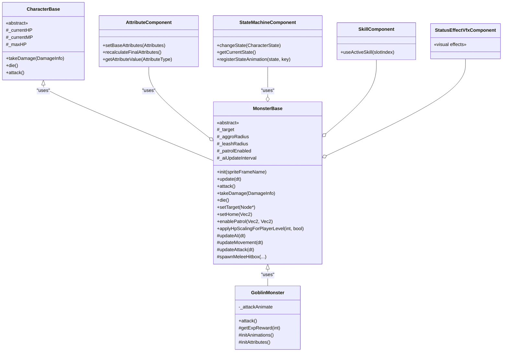

**来源：** [Classes/Character/Monster/MonsterBase.h L10-L184](https://github.com/lilong555/Adventure-King/blob/60df0f40/Classes/Character/Monster/MonsterBase.h#L10-L184)

 [Classes/Character/Monster/Monsters/GoblinMonster.h L7-L39](https://github.com/lilong555/Adventure-King/blob/60df0f40/Classes/Character/Monster/Monsters/GoblinMonster.h#L7-L39)

 [Classes/Character/Base/CharacterData.h L1-L247](https://github.com/lilong555/Adventure-King/blob/60df0f40/Classes/Character/Base/CharacterData.h#L1-L247)

---

## 初始化流水线

### 组件挂载与初始化

`init()` 会遵循严格的初始化顺序，确保所有组件在使用前已正确挂载：

| 步骤 | 动作 | 行号 |
| --- | --- | --- |
| 1 | 加载 sprite 贴图 | [MonsterBase.cpp L68-L78](https://github.com/lilong555/Adventure-King/blob/60df0f40/MonsterBase.cpp#L68-L78) |
| 2 | 挂载 `AttributeComponent` | [MonsterBase.cpp L84-L90](https://github.com/lilong555/Adventure-King/blob/60df0f40/MonsterBase.cpp#L84-L90) |
| 3 | 挂载 `StateMachineComponent` | [MonsterBase.cpp L93-L98](https://github.com/lilong555/Adventure-King/blob/60df0f40/MonsterBase.cpp#L93-L98) |
| 4 | 挂载 `SkillComponent` | [MonsterBase.cpp L101-L106](https://github.com/lilong555/Adventure-King/blob/60df0f40/MonsterBase.cpp#L101-L106) |
| （原文截断：`…2662 chars truncated…`） | 将更新间隔在 `[0.5*interval, interval]` 之间随机化，避免多个怪物同时生成时出现帧率尖峰 | [MonsterBase.cpp L170-L179](https://github.com/lilong555/Adventure-King/blob/60df0f40/MonsterBase.cpp#L170-L179) |

> 说明：上表中包含导出时生成的截断占位 `…2662 chars truncated…`，这里按原样保留以避免遗漏。

**来源：** [Classes/Character/Monster/MonsterBase.cpp L66-L181](https://github.com/lilong555/Adventure-King/blob/60df0f40/Classes/Character/Monster/MonsterBase.cpp#L66-L181)

 [Classes/Character/Monster/MonsterBase.h L18-L19](https://github.com/lilong555/Adventure-King/blob/60df0f40/Classes/Character/Monster/MonsterBase.h#L18-L19)

---

## 物理配置

### 分类与碰撞掩码

怪物的 physics body 会配置特定的 category 与 collision/contact 掩码，以实现与其它实体的正确交互：

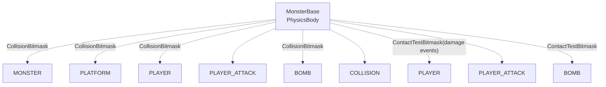

| 掩码类型 | 类别 | 作用 |
| --- | --- | --- |
| **CategoryBitmask** | `MONSTER` | 标识该 body 属于怪物 |
| **CollisionBitmask** | `PLATFORM \| PLAYER \| PLAYER_ATTACK \| BOMB \| COLLISION` | 参与物理碰撞解算（避免重叠/穿透） |
| **ContactTestBitmask** | `PLAYER \| PLAYER_ATTACK \| BOMB` | 触发接触回调，用于伤害处理 |

**来源：** [Classes/Character/Monster/MonsterBase.cpp L132-L150](https://github.com/lilong555/Adventure-King/blob/60df0f40/Classes/Character/Monster/MonsterBase.cpp#L132-L150)

 [Classes/Configs/GamePhysicsCategory.h](https://github.com/lilong555/Adventure-King/blob/60df0f40/Classes/Configs/GamePhysicsCategory.h)

---

## 更新循环与节流系统

### 多层更新架构

`MonsterBase::update()` 实现了一套较复杂的节流机制，用于在响应性与 CPU 效率之间取平衡：不同子系统按不同时间间隔更新，取决于重要性与性能需求。

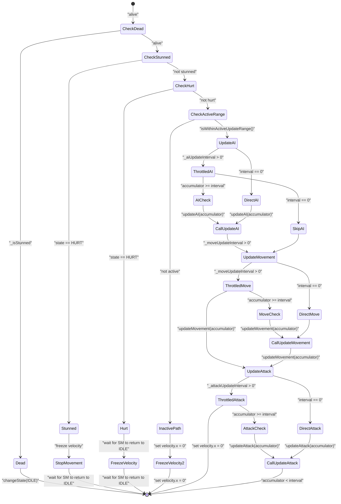

### 更新间隔配置

| 系统 | 成员变量 | 默认值 | 作用 |
| --- | --- | --- | --- |
| **AI 逻辑** | `_aiUpdateInterval` | 0.1s | 决策（仇恨、追击、巡逻等） |
| **非活跃 AI** | `_inactiveAiUpdateInterval` | 0.3s | 远离玩家时的 AI |
| **移动** | `_moveUpdateInterval` | 0.033s（约 30fps） | 速度更新 |
| **攻击** | `_attackUpdateInterval` | 0.05s（20fps） | 攻击触发逻辑 |
| **活跃范围** | `_activeUpdateDistanceX` | `screenWidth * 1.5` | 完整 AI 的距离阈值 |

**配置示例：**

```
// In derived monster class:
setUpdateTickIntervals(
    0.1f,  // AI every 100ms
    0.05f, // Movement every 50ms
    0.05f  // Attack checks every 50ms
);
setActiveUpdateDistanceX(800.0f); // Full AI within 800 pixels
```

**来源：** [Classes/Character/Monster/MonsterBase.cpp L281-L414](https://github.com/lilong555/Adventure-King/blob/60df0f40/Classes/Character/Monster/MonsterBase.cpp#L281-L414)

 [Classes/Character/Monster/MonsterBase.h L165-L173](https://github.com/lilong555/Adventure-King/blob/60df0f40/Classes/Character/Monster/MonsterBase.h#L165-L173)

---

## AI 决策系统

### 状态机与目标选择

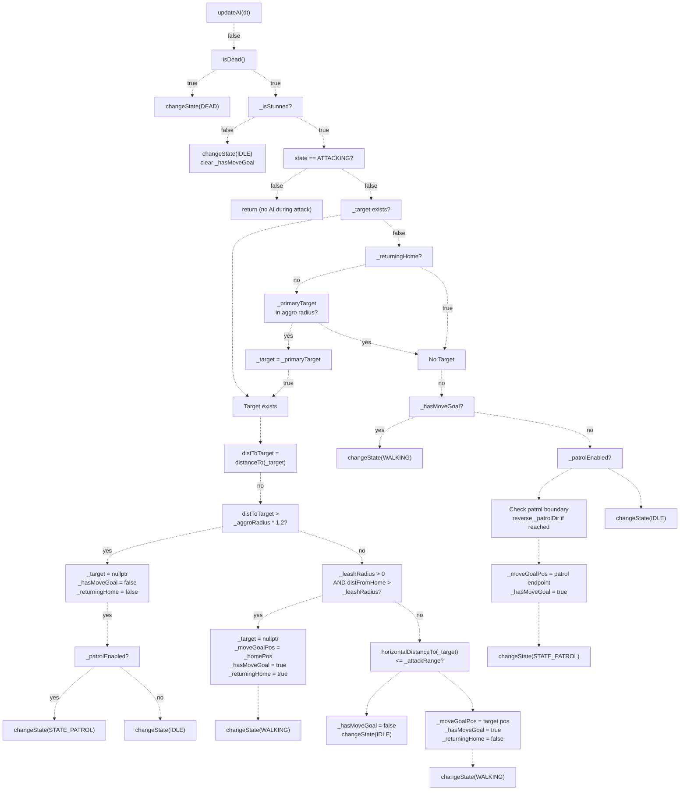

### AI 配置参数

| 参数 | 类型 | 作用 | 备注 |
| --- | --- | --- | --- |
| `_aggroRadius` | `float` | 发现/追击距离 | 若为 0，则对 `_primaryTarget` 总是仇恨 |
| `_leashRadius` | `float` | 离家追击最大距离 | 若为 0，则无牵引（可无限追击） |
| `_attackRange` | `float` | 开始攻击距离 | 一般应小于 `_aggroRadius` |
| `_patrolEnabled` | `bool` | 空闲时是否巡逻 | 需要 `_patrolLeft` 与 `_patrolRight` |
| `_primaryTarget` | `Node*` | 主目标引用（通常是玩家） | 通过 `setTarget()` 设置 |
| `_target` | `Node*` | 当前追击目标 | 仇恨丢失会自动清空 |
| `_returningHome` | `bool` | 是否正牵引回家 | 防止途中再次仇恨 |

**关键行为：**

1. **仇恨丢失滞回（Hysteresis）：** 在 `1.2 * _aggroRadius` 才判定丢失目标，避免边界抖动（[MonsterBase.cpp L521](https://github.com/lilong555/Adventure-King/blob/60df0f40/MonsterBase.cpp#L521-L521)）。
2. **回家期间禁止再仇恨：** `_returningHome == true` 时不会重新锁定目标，直到回到 home（[MonsterBase.cpp L482](https://github.com/lilong555/Adventure-King/blob/60df0f40/MonsterBase.cpp#L482-L482)）。
3. **巡逻边界死区：** 巡逻使用 `PATROL_REACH_EPSILON` 作为端点死区，避免端点来回震荡（[MonsterBase.cpp L500-L505](https://github.com/lilong555/Adventure-King/blob/60df0f40/MonsterBase.cpp#L500-L505)）。

**来源：** [Classes/Character/Monster/MonsterBase.cpp L454-L560](https://github.com/lilong555/Adventure-King/blob/60df0f40/Classes/Character/Monster/MonsterBase.cpp#L454-L560)

---

## 移动系统（追击/回家/巡逻）

> 说明：本节中包含导出时生成的截断占位 `MonsterBa…739 chars truncated…`，按原样保留以避免遗漏。

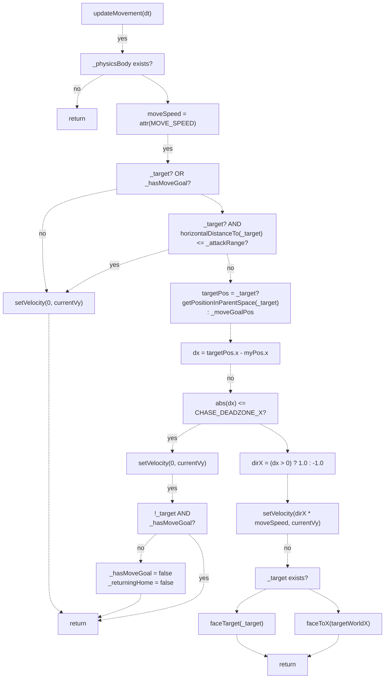

### 坐标系处理

移动系统会处理多个坐标空间：

| 函数 | 作用 | 返回类型 |
| --- | --- | --- |
| `getWorldPosition(node)` | 将节点位置转换为世界坐标 | `Vec2` |
| `getPositionInParentSpace(node)` | 将目标位置转换为怪物父节点坐标 | `Vec2` |
| `horizontalDistanceTo(node)` | 只计算 X 轴水平距离 | `float` |

**实现示例：**

```
// From MonsterBase.cpp:598-623
Vec2 targetPos = _target ? getPositionInParentSpace(_target) : _moveGoalPos;
Vec2 myPos = getPosition();
float dx = targetPos.x - myPos.x;

if (fabs(dx) <= kChaseDeadzoneX) {
    _physicsBody->setVelocity(Vec2(0, currentVy));
    return;
}

float dirX = (dx > 0.0f) ? 1.0f : -1.0f;
_physicsBody->setVelocity(Vec2(dirX * moveSpeed, currentVy));
```

**来源：** [Classes/Character/Monster/MonsterBase.cpp L566-L638](https://github.com/lilong555/Adventure-King/blob/60df0f40/Classes/Character/Monster/MonsterBase.cpp#L566-L638)

 [Classes/Character/Monster/MonsterBase.h L106-L137](https://github.com/lilong555/Adventure-King/blob/60df0f40/Classes/Character/Monster/MonsterBase.h#L106-L137)

---

## 战斗系统

### 攻击流程

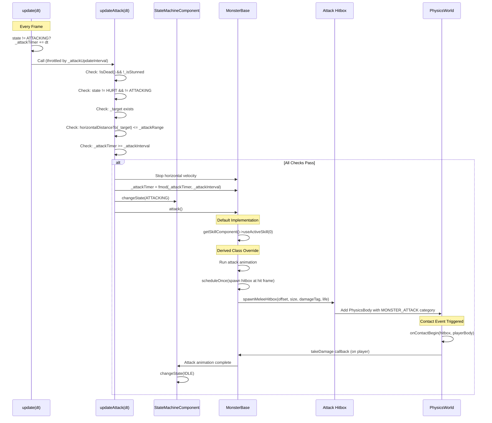

### 伤害处理

当调用 `takeDamage()` 时，会执行如下步骤：

| 步骤 | 动作 | 行号参考 |
| --- | --- | --- |
| 1 | 检查是否已死亡（防止重复死亡/重复结算） | [MonsterBase.cpp L709-L712](https://github.com/lilong555/Adventure-King/blob/60df0f40/MonsterBase.cpp#L709-L712) |
| 2 | 若为暴击则应用暴击倍率 | [MonsterBase.cpp L717-L720](https://github.com/lilong555/Adventure-King/blob/60df0f40/MonsterBase.cpp#L717-L720) |
| 3 | 计算最终 HP 变化 | [MonsterBase.cpp L722-L723](https://github.com/lilong555/Adventure-King/blob/60df0f40/MonsterBase.cpp#L722-L723) |
| 4 | 为 Boss UI 记录非 DOT 伤害 | [MonsterBase.cpp L726](https://github.com/lilong555/Adventure-King/blob/60df0f40/MonsterBase.cpp#L726-L726) |
| 5 | 显示伤害数字 | [MonsterBase.cpp L728](https://github.com/lilong555/Adventure-King/blob/60df0f40/MonsterBase.cpp#L728-L728) |
| 6 | 生成受击特效 | [MonsterBase.cpp L729](https://github.com/lilong555/Adventure-King/blob/60df0f40/MonsterBase.cpp#L729-L729) |
| 7 | 执行“受伤后”钩子（装备效果等） | [MonsterBase.cpp L736-L740](https://github.com/lilong555/Adventure-King/blob/60df0f40/MonsterBase.cpp#L736-L740) |
| 8 | 通知攻击者“造成伤害” | [MonsterBase.cpp L743-L750](https://github.com/lilong555/Adventure-King/blob/60df0f40/MonsterBase.cpp#L743-L750) |
| 9 | 更新血条 | [MonsterBase.cpp L752](https://github.com/lilong555/Adventure-King/blob/60df0f40/MonsterBase.cpp#L752-L752) |
| 10 | 若死亡：发放经验并调用 `die()` | [MonsterBase.cpp L754-L759](https://github.com/lilong555/Adventure-King/blob/60df0f40/MonsterBase.cpp#L754-L759) |
| 11 | 若存活：进入受击状态并停止移动 | [MonsterBase.cpp L762-L807](https://github.com/lilong555/Adventure-King/blob/60df0f40/MonsterBase.cpp#L762-L807) |

**暴击实现：**

```
// From MonsterBase.cpp:717-720
if (info.isCritical) {
    dmg *= info.critMultiplier; // Default 1.5x
}
```

**受击朝向逻辑：**
系统会把 `setFlippedX()` 当成额外的“镜像层”，叠加在 `scaleX` 之上，以保证受击贴图朝向攻击者方向（[MonsterBase.cpp L783-L801](https://github.com/lilong555/Adventure-King/blob/60df0f40/MonsterBase.cpp#L783-L801)）。

**来源：** [Classes/Character/Monster/MonsterBase.cpp L706-L808](https://github.com/lilong555/Adventure-King/blob/60df0f40/Classes/Character/Monster/MonsterBase.cpp#L706-L808)

 [Classes/Character/Monster/MonsterBase.h L29-L30](https://github.com/lilong555/Adventure-King/blob/60df0f40/Classes/Character/Monster/MonsterBase.h#L29-L30)

---

## 死亡与奖励

### 死亡流程

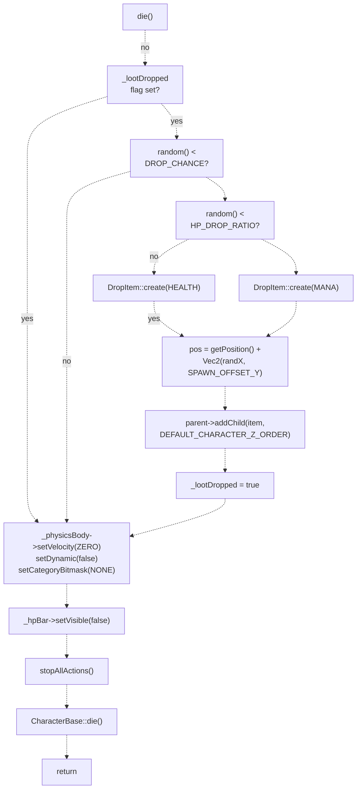

### 经验奖励系统

经验奖励由子类通过 `getExpReward(playerLevel)` 实现：

```javascript
// MonsterBase default implementation (returns 0)
int MonsterBase::getExpReward(int playerLevel) const {
    return 0;
}

// GoblinMonster override
int GoblinMonster::getExpReward(int playerLevel) const {
    return GameConfig::Monster::Goblin::EXP_REWARD_BASE +
           (playerLevel - 1) * GameConfig::Monster::Goblin::EXP_REWARD_PER_LEVEL;
}
```

`grantKillExperience()` 会按如下优先级解析玩家引用：

1. `info.attacker`（若其为 `PlayerCharacter*`）
2. `_primaryTarget`（兜底）
3. `_target`（最终兜底）

**来源：** [Classes/Character/Monster/MonsterBase.cpp L810-L853](https://github.com/lilong555/Adventure-King/blob/60df0f40/Classes/Character/Monster/MonsterBase.cpp#L810-L853)

 [Classes/Character/Monster/MonsterBase.cpp L11-L49](https://github.com/lilong555/Adventure-King/blob/60df0f40/Classes/Character/Monster/MonsterBase.cpp#L11-L49)

 [Classes/Character/Monster/Monsters/GoblinMonster.cpp L116-L125](https://github.com/lilong555/Adventure-King/blob/60df0f40/Classes/Character/Monster/Monsters/GoblinMonster.cpp#L116-L125)

---

## HP 缩放系统

### 基于等级的 HP 缩放

`applyHpScalingForPlayerLevel()` 会按玩家等级缩放怪物 HP，以保持不同等级区间的难度一致：

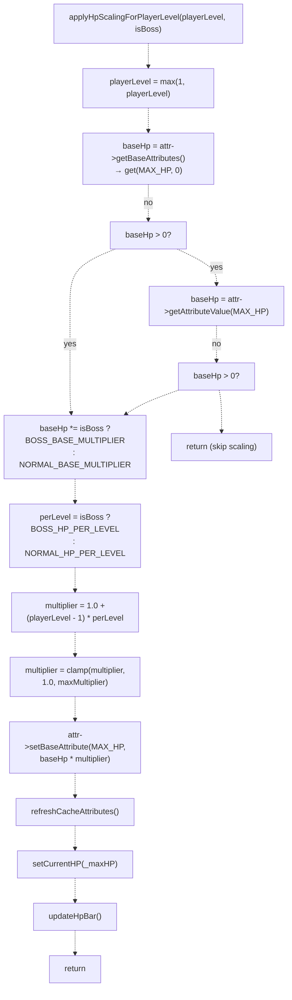

### 缩放公式表

| 怪物类型 | 基础倍率 | 每级 HP 系数 | 最大倍率 | 示例（10 级） |
| --- | --- | --- | --- | --- |
| **普通怪** | `NORMAL_BASE_MULTIPLIER` | `NORMAL_HP_PER_LEVEL` | `NORMAL_HP_MAX_MULTIPLIER` | `baseHP * baseMultiplier * (1 + 9 * perLevel)` |
| **Boss** | `BOSS_BASE_MULTIPLIER` | `BOSS_HP_PER_LEVEL` | `BOSS_HP_MAX_MULTIPLIER` | `baseHP * baseMultiplier * (1 + 9 * perLevel)` |

**配置常量**（来自 `GameConfig::Monster::LevelScaling`）：

* 定义位置：[Classes/Configs/GameConfig.h](https://github.com/lilong555/Adventure-King/blob/60df0f40/Classes/Configs/GameConfig.h)
* 应用位置：[Classes/Character/Monster/MonsterBase.cpp L225-L279](https://github.com/lilong555/Adventure-King/blob/60df0f40/Classes/Character/Monster/MonsterBase.cpp#L225-L279)

**用法模式：**

```sql
// In GameScene::createMonsterByType
auto monster = GoblinMonster::create("Sprites/Enemies/Goblin/Goblin_idle.png");
monster->applyHpScalingForPlayerLevel(playerLevel, false);
monster->setPosition(spawnPoint);
```

**来源：** [Classes/Character/Monster/MonsterBase.cpp L225-L279](https://github.com/lilong555/Adventure-King/blob/60df0f40/Classes/Character/Monster/MonsterBase.cpp#L225-L279)

 [Classes/Character/Monster/MonsterBase.h L39-L45](https://github.com/lilong555/Adventure-King/blob/60df0f40/Classes/Character/Monster/MonsterBase.h#L39-L45)

---

## 命中框生成工具

### 近战命中框（spawnMeleeHitbox）

`spawnMeleeHitbox()` 会在怪物位置的相对偏移处生成一个短生命周期的 physics hitbox：

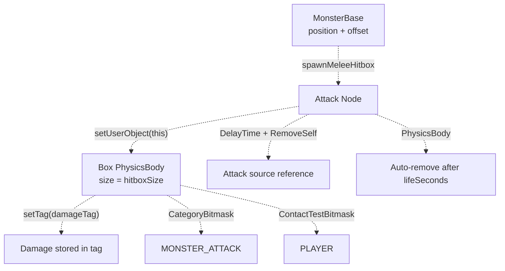

**方法签名：**

```javascript
Node* spawnMeleeHitbox(
    const Vec2 &offsetInParentSpace,
    const Size &hitboxSize,
    int damageTag,
    float lifeSeconds = 0.1f
);
```

**关键特性：**

* **伤害编码：** 伤害值存放在 `PhysicsBody::tag`（[MonsterBase.cpp L1019](https://github.com/lilong555/Adventure-King/blob/60df0f40/MonsterBase.cpp#L1019-L1019)）
* **攻击源引用：** `setUserObject(this)` 让受击者可判定命中方向（[MonsterBase.cpp L1010](https://github.com/lilong555/Adventure-King/blob/60df0f40/MonsterBase.cpp#L1010-L1010)）
* **自动清理：** 使用 `Sequence → DelayTime → RemoveSelf` 模式（[MonsterBase.cpp L1022-L1025](https://github.com/lilong555/Adventure-King/blob/60df0f40/MonsterBase.cpp#L1022-L1025)）
* **物理分类：** `MONSTER_ATTACK`，collision mask 为 `0`（不做物理阻挡，仅做 contact test）（[MonsterBase.cpp L1017-L1018](https://github.com/lilong555/Adventure-King/blob/60df0f40/MonsterBase.cpp#L1017-L1018)）

### 绝对位置命中框（spawnAttackHitboxAt）

`spawnAttackHitboxAt()` 在父节点坐标的绝对位置生成 hitbox（用于投掷物、AoE 等）：

**方法签名：**

```javascript
Node* spawnAttackHitboxAt(
    const Vec2 &centerPosInParentSpace,
    const Size &hitboxSize,
    int damageTag,
    float lifeSeconds = 0.1f,
    int localZOrder = 0
);
```

**与近战命中框的区别：**

* 位置为父节点坐标绝对值（不是相对怪物偏移）
* 多了 `localZOrder` 以便控制渲染层级
* 物理配置与自动清理逻辑相同

**来源：** [Classes/Character/Monster/MonsterBase.cpp L986-L1028](https://github.com/lilong555/Adventure-King/blob/60df0f40/Classes/Character/Monster/MonsterBase.cpp#L986-L1028)

 [Classes/Character/Monster/MonsterBase.h L116-L129](https://github.com/lilong555/Adventure-King/blob/60df0f40/Classes/Character/Monster/MonsterBase.h#L116-L129)

---

## 属性管理

### 初始化模式

`setupCharacterStats()` 为子类提供统一的属性初始化流程：

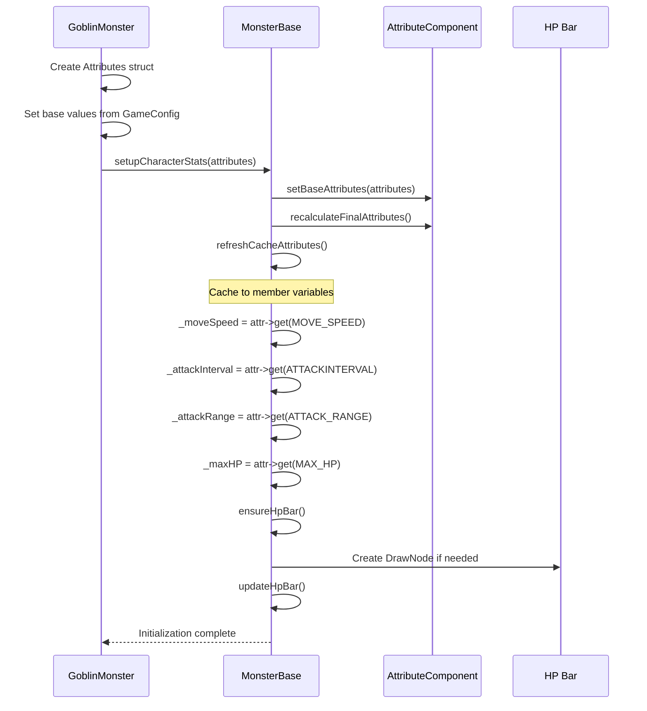

**实现示例：**

```
// From GoblinMonster::initAttributes
void GoblinMonster::initAttributes() {
    Attributes base;
    base.set(AttributeType::STRENGTH, Conf::STRENGTH);
    base.set(AttributeType::DEFENSE, Conf::DEFENSE);
    base.set(AttributeType::MOVE_SPEED, Conf::MOVE_SPEED);
    base.set(AttributeType::MAX_HP, Conf::MAX_HP);
    base.set(AttributeType::ATTACKINTERVAL, Conf::ATTACK_INTERVAL);
    base.set(AttributeType::ATTACK_RANGE, Conf::ATTACK_RANGE);
    
    setupCharacterStats(base); // Delegates to MonsterBase
}
```

**来源：** [Classes/Character/Monster/MonsterBase.cpp L184-L222](https://github.com/lilong555/Adventure-King/blob/60df0f40/Classes/Character/Monster/MonsterBase.cpp#L184-L222)

 [Classes/Character/Monster/Monsters/GoblinMonster.cpp L182-L207](https://github.com/lilong555/Adventure-King/blob/60df0f40/Classes/Character/Monster/Monsters/GoblinMonster.cpp#L182-L207)

---

## 血条渲染

### 基于 DrawNode 的血条

血条使用 `cocos2d::DrawNode` 绘制，并按血量比例动态改变颜色：

| HP 比例 | 颜色 | RGB |
| --- | --- | --- |
| > 50% | 绿色 | `(0.2, 0.8, 0.2)` |
| 25–50% | 黄色 | `(1.0, 0.8, 0.0)` |
| < 25% | 红色 | `(1.0, 0.2, 0.2)` |

**渲染算法：**

```
// From MonsterBase.cpp:873-928
void MonsterBase::updateHpBar() {
    _hpBar->clear();
    
    float hpRatio = clampf(getCurrentHP() / maxHp, 0.0f, 1.0f);
    float currentWidth = barWidth * hpRatio;
    
    // Background (dark gray)
    _hpBar->drawSolidRect(barPos, barPos + Vec2(barWidth, barHeight),
                          Color4F(0.2f, 0.2f, 0.2f, 1.0f));
    
    // Foreground (colored by HP ratio)
    _hpBar->drawSolidRect(barPos, barPos + Vec2(currentWidth, barHeight), hpColor);
    
    // Border (white outline)
    _hpBar->drawRect(barPos, barPos + Vec2(barWidth, barHeight), Color4F::WHITE);
}
```

**配置参数：**

* `HP_BAR_WIDTH`：基础宽度（会乘以 `_hpBarScale`）
* `HP_BAR_HEIGHT`：高度
* `HP_BAR_Y_OFFSET`：位于 sprite 上方的垂直偏移

**来源：** [Classes/Character/Monster/MonsterBase.cpp L861-L928](https://github.com/lilong555/Adventure-King/blob/60df0f40/Classes/Character/Monster/MonsterBase.cpp#L861-L928)

 [Classes/Character/Monster/MonsterBase.h L89-L93](https://github.com/lilong555/Adventure-King/blob/60df0f40/Classes/Character/Monster/MonsterBase.h#L89-L93)

---

## 坐标系工具

### 多父节点空间处理

坐标工具用于处理“怪物与目标不在同一父节点”的情况：

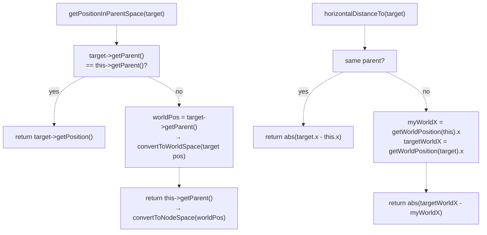

**实现对照表：**

| 函数 | 同父节点路径 | 不同父节点路径 |
| --- | --- | --- |
| `getWorldPosition()` | `parent->convertToWorldSpace(pos)` | 同上 |
| `getPositionInParentSpace()` | `target->getPosition()` | `parent->convertToNodeSpace(worldPos)` |
| `horizontalDistanceTo()` | `abs(target.x - this.x)` | `abs(worldX_target - worldX_this)` |
| `distanceTo()` | `pos.distance(target pos)` | `worldPos.distance(worldPos_target)` |

**来源：** [Classes/Character/Monster/MonsterBase.cpp L933-L1072](https://github.com/lilong555/Adventure-King/blob/60df0f40/Classes/Character/Monster/MonsterBase.cpp#L933-L1072)

 [Classes/Character/Monster/MonsterBase.h L106-L137](https://github.com/lilong555/Adventure-King/blob/60df0f40/Classes/Character/Monster/MonsterBase.h#L106-L137)

---

## 具体实现示例：GoblinMonster

### 类结构

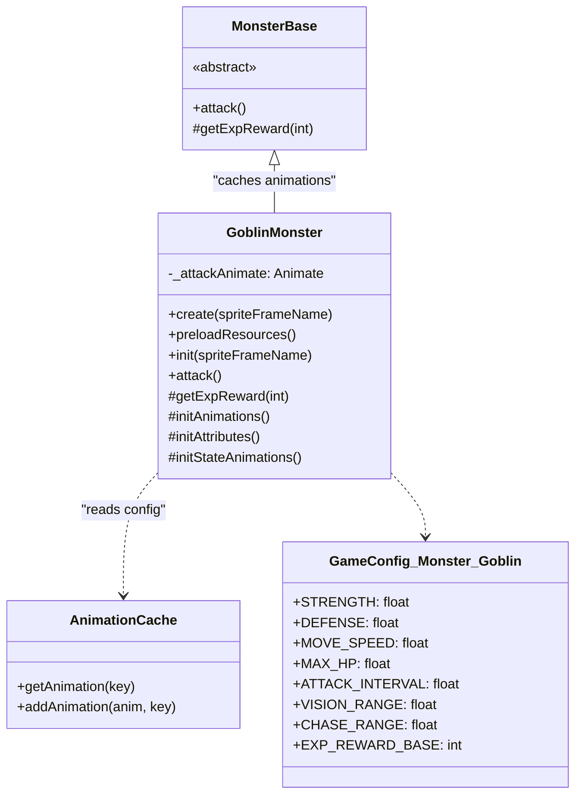

### 初始化顺序

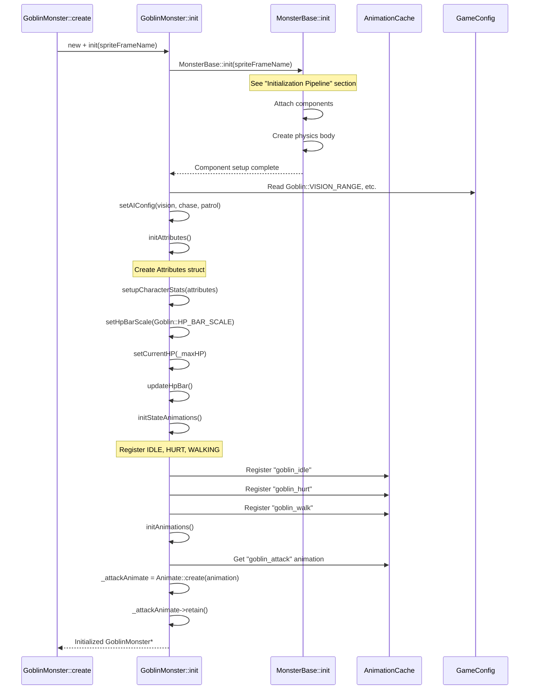

**来源：** [Classes/Character/Monster/Monsters/GoblinMonster.cpp L139-L166](https://github.com/lilong555/Adventure-King/blob/60df0f40/Classes/Character/Monster/Monsters/GoblinMonster.cpp#L139-L166)

 [Classes/Character/Monster/Monsters/GoblinMonster.h L7-L39](https://github.com/lilong555/Adventure-King/blob/60df0f40/Classes/Character/Monster/Monsters/GoblinMonster.h#L7-L39)

---

## 攻击实现示例

### Goblin 攻击流程

`GoblinMonster::attack()` 的 override 展示了怪物攻击实现的标准模式：

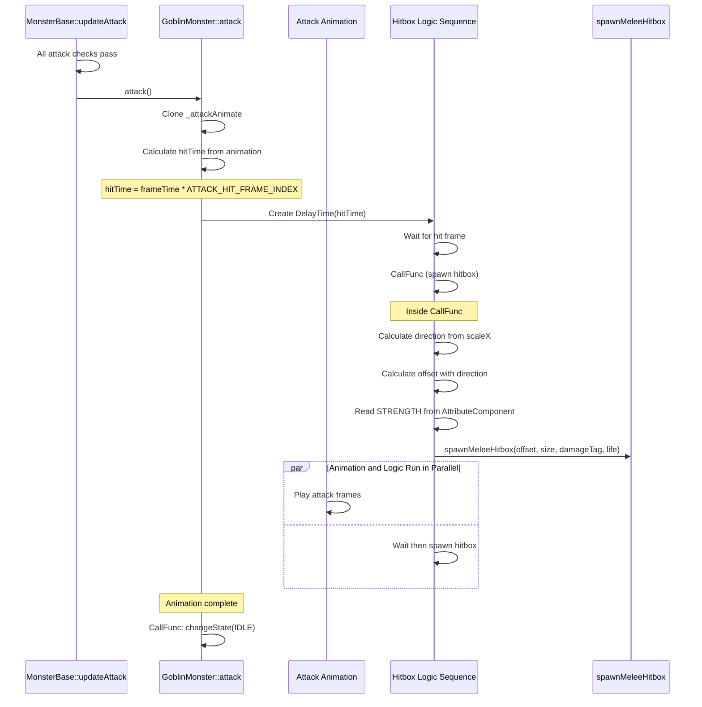

### 配置驱动的命中框

命中框完全由 `GameConfig::Monster::Goblin` 配置：

```sql
// From GoblinMonster.cpp:294-326
auto logicSequence = Sequence::create(
    DelayTime::create(hitTime),
    CallFunc::create(<FileRef file-url="https://github.com/lilong555/Adventure-King/blob/60df0f40/this" undefined  file-path="this">Hii</FileRef> {
        float direction = (this->getScaleX() > 0) ? 1.0f : -1.0f;
        
        // Scale adaptation
        float scaleRatio = fabs(this->getScaleX()) / 
                          GameConfig::Monster::Goblin::HITBOX_TUNE_SCALE;
        
        Vec2 offset(
            GameConfig::Monster::Goblin::HITBOX_OFFSET_X * direction * scaleRatio,
            GameConfig::Monster::Goblin::HITBOX_OFFSET_Y * scaleRatio
        );
        
        Size hitboxSize(
            GameConfig::Monster::Goblin::HITBOX_WIDTH * scaleRatio,
            GameConfig::Monster::Goblin::HITBOX_HEIGHT * scaleRatio
        );
        
        int damageTag = static_cast<int>(
            round(getAttributeComponent()->getAttributeValue(AttributeType::STRENGTH))
        );
        
        spawnMeleeHitbox(offset, hitboxSize, damageTag,
                        GameConfig::Monster::Goblin::HITBOX_LIFE_SECONDS);
    }),
    nullptr
);
```

**来源：** [Classes/Character/Monster/Monsters/GoblinMonster.cpp L254-L354](https://github.com/lilong555/Adventure-King/blob/60df0f40/Classes/Character/Monster/Monsters/GoblinMonster.cpp#L254-L354)

 [Classes/Character/Monster/Monsters/GoblinMonster.h L24-L25](https://github.com/lilong555/Adventure-King/blob/60df0f40/Classes/Character/Monster/Monsters/GoblinMonster.h#L24-L25)

---

## 资源预热

### 静态预加载模式

`GoblinMonster::preloadResources()` 展示了预加载模式，用于避免第一次生成怪物时卡顿：

```
// From GoblinMonster.cpp:168-179
void GoblinMonster::preloadResources() {
    ensureSingleFrameAnimationCached("goblin_idle", 
                                     "Sprites/Enemies/Goblin/Goblin_idle.png");
    ensureSingleFrameAnimationCached("goblin_hurt", 
                                     "Sprites/Enemies/Goblin/Goblin_beattacked.png");
    ensureLoopAnimationCached("goblin_walk",
                             "Sprites/Enemies/Goblin/Goblin_walk_%d.png",
                             4,
                             GameConfig::Monster::Goblin::WALK_ANIM_FRAME_DELAY);
    ensureGoblinAttackAnimationCached();
}
```

**用法模式：**

```
// In LoadingScene or GameScene initialization
GoblinMonster::preloadResources();
// Later spawns will use cached animations
```

**来源：** [Classes/Character/Monster/Monsters/GoblinMonster.cpp L168-L179](https://github.com/lilong555/Adventure-King/blob/60df0f40/Classes/Character/Monster/Monsters/GoblinMonster.cpp#L168-L179)

 [Classes/Character/Monster/Monsters/GoblinMonster.h L18-L19](https://github.com/lilong555/Adventure-King/blob/60df0f40/Classes/Character/Monster/Monsters/GoblinMonster.h#L18-L19)

---

## 性能注意事项

### 节流总结

| 系统 | 节流机制 | 收益 |
| --- | --- | --- |
| **AI** | `_aiUpdateAccumulator` | 降低寻路/决策开销 |
| **移动** | `_moveUpdateAccumulator` | 平滑速度变化，减少抖动 |
| **攻击** | `_attackUpdateAccumulator` | 避免过于频繁的攻击判定 |
| **非活跃 AI** | `_inactiveAiUpdateInterval` | 降低屏幕外怪物的 CPU 占用 |
| **活跃范围** | `_activeUpdateDistanceX` | 冻结很远的怪物以省 CPU |

### 错峰启动（Staggered Start）

为防止一次生成大量怪物导致同一帧峰值（frame spike），会把 accumulator 初始值随机化：

```markdown
// From MonsterBase.cpp:170-179
auto staggerAccumulator = [](float intervalSeconds) -> float {
    if (intervalSeconds <= 0.0f) return 0.0f;
    return cocos2d::random(intervalSeconds * 0.5f, intervalSeconds);
};

_aiUpdateAccumulator = staggerAccumulator(_aiUpdateInterval);
_moveUpdateAccumulator = staggerAccumulator(_moveUpdateInterval);
_attackUpdateAccumulator = staggerAccumulator(_attackUpdateInterval);
```

这样可让不同怪物在不同的子帧偏移上触发更新，把 CPU 压力分散到多帧。

**来源：** [Classes/Character/Monster/MonsterBase.cpp L152-L179](https://github.com/lilong555/Adventure-King/blob/60df0f40/Classes/Character/Monster/MonsterBase.cpp#L152-L179)

 [Classes/Character/Monster/MonsterBase.cpp L281-L414](https://github.com/lilong555/Adventure-King/blob/60df0f40/Classes/Character/Monster/MonsterBase.cpp#L281-L414)

---

## 与游戏系统的集成

### GameScene 生成流程

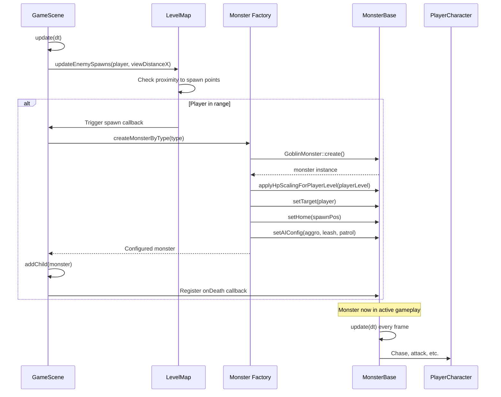

### 死亡回调链

当怪物死亡时，通常会触发如下回调链：

1. **Monster → LevelMap：** `_currentActiveMonsters` 计数 -1
2. **LevelMap → Arena：** 判断当前波次是否完成
3. **Arena → LevelMap：** 触发下一波/解锁闸门
4. **LevelMap → GameScene：** 判断关卡是否完成
5. **GameScene → UI：** 若全部敌人击败则展示胜利界面

**来源：** [Classes/Scene/GameScene.cpp](https://github.com/lilong555/Adventure-King/blob/60df0f40/Classes/Scene/GameScene.cpp)

 [Classes/Level/LevelMap.cpp](https://github.com/lilong555/Adventure-King/blob/60df0f40/Classes/Level/LevelMap.cpp)

---

## 关键方法汇总表

| 方法 | 作用 | 是否必须覆写？ |
| --- | --- | --- |
| `init(spriteFrameName)` | 初始化怪物（组件、物理、AI） | 通常（先调用基类） |
| `update(dt)` | 逐帧更新（含节流） | 很少 |
| `updateAI(dt)` | AI 决策逻辑 | 有时（自定义 AI） |
| `updateMovement(dt)` | 物理速度更新 | 很少 |
| `updateAttack(dt)` | 攻击触发逻辑 | 很少 |
| `attack()` | 执行攻击动作 | **是（总是）** |
| `takeDamage(DamageInfo)` | 接收伤害 | 有时（特殊机制） |
| `die()` | 死亡处理 | 有时（Boss 机制） |
| `getExpReward(int)` | 经验计算 | **是（若需要经验奖励）** |
| `setupCharacterStats(Attributes)` | 属性初始化工具方法 | 否 |
| `applyHpScalingForPlayerLevel(int, bool)` | 按玩家等级缩放 HP | 否（外部调用） |

**来源：** [Classes/Character/Monster/MonsterBase.h L18-L100](https://github.com/lilong555/Adventure-King/blob/60df0f40/Classes/Character/Monster/MonsterBase.h#L18-L100)

 [Classes/Character/Monster/MonsterBase.cpp L1-L1111](https://github.com/lilong555/Adventure-King/blob/60df0f40/Classes/Character/Monster/MonsterBase.cpp#L1-L1111)
