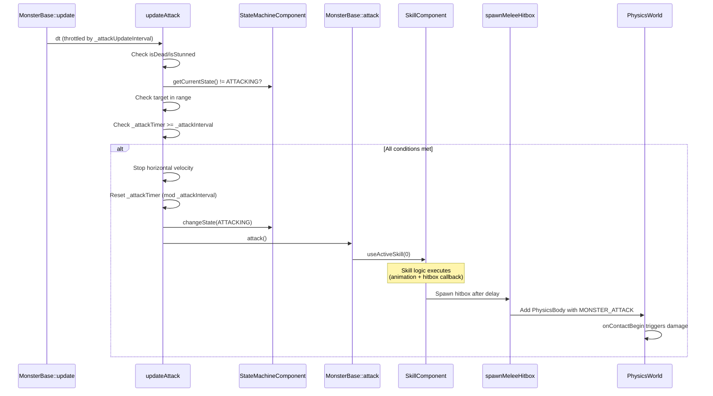
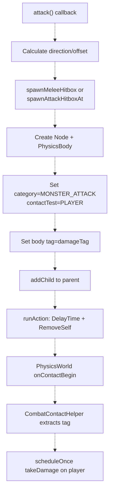
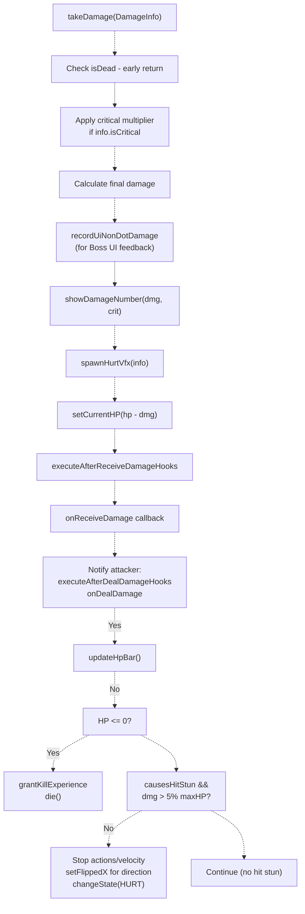
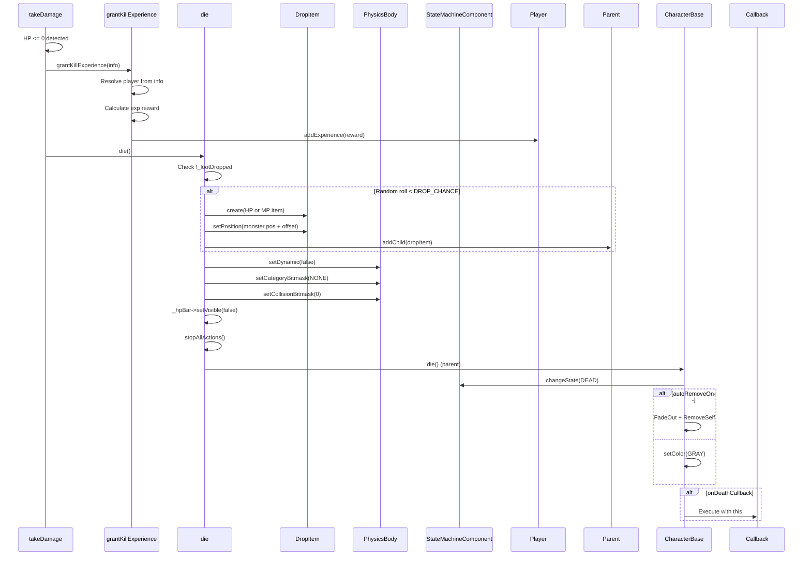
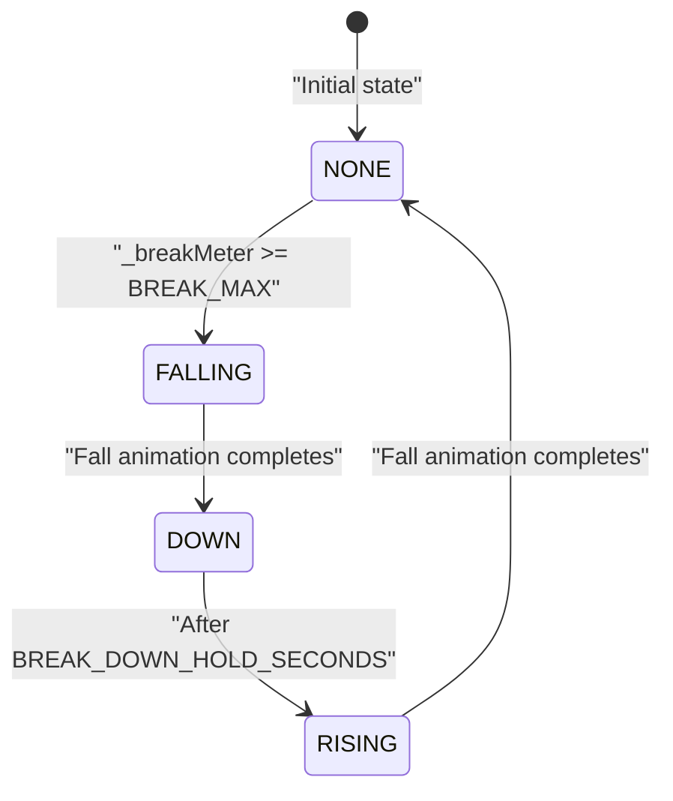

# 怪物战斗（Monster Combat）

> **相关源文件**
> * [Adventure-King/Classes/Character/Base/CharacterBase.cpp](https://github.com/lilong555/Adventure-King/blob/60df0f40/Adventure-King/Classes/Character/Base/CharacterBase.cpp)
> * [Adventure-King/Classes/Character/Base/CharacterBase.h](https://github.com/lilong555/Adventure-King/blob/60df0f40/Adventure-King/Classes/Character/Base/CharacterBase.h)
> * [Adventure-King/Classes/Character/Base/CharacterData.h](https://github.com/lilong555/Adventure-King/blob/60df0f40/Adventure-King/Classes/Character/Base/CharacterData.h)
> * [Adventure-King/Classes/Character/Monster/MonsterBase.cpp](https://github.com/lilong555/Adventure-King/blob/60df0f40/Adventure-King/Classes/Character/Monster/MonsterBase.cpp)
> * [Adventure-King/Classes/Character/Monster/MonsterBase.h](https://github.com/lilong555/Adventure-King/blob/60df0f40/Adventure-King/Classes/Character/Monster/MonsterBase.h)
> * [Adventure-King/Classes/Character/Monster/Monsters/GoblinMonster.cpp](https://github.com/lilong555/Adventure-King/blob/60df0f40/Adventure-King/Classes/Character/Monster/Monsters/GoblinMonster.cpp)
> * [Adventure-King/Classes/Character/Monster/Monsters/GoblinMonster.h](https://github.com/lilong555/Adventure-King/blob/60df0f40/Adventure-King/Classes/Character/Monster/Monsters/GoblinMonster.h)
> * [Adventure-King/Classes/Character/Monster/Monsters/GobluMonster.cpp](https://github.com/lilong555/Adventure-King/blob/60df0f40/Adventure-King/Classes/Character/Monster/Monsters/GobluMonster.cpp)
> * [Adventure-King/Classes/Character/Monster/Monsters/GobluMonster.h](https://github.com/lilong555/Adventure-King/blob/60df0f40/Adventure-King/Classes/Character/Monster/Monsters/GobluMonster.h)
> * [Adventure-King/Classes/UI/BossHealthBar.cpp](https://github.com/lilong555/Adventure-King/blob/60df0f40/Adventure-King/Classes/UI/BossHealthBar.cpp)
> * [Adventure-King/Classes/UI/BossHealthBar.h](https://github.com/lilong555/Adventure-King/blob/60df0f40/Adventure-King/Classes/UI/BossHealthBar.h)

**目的**：本文档介绍 Adventure-King 中怪物的战斗机制，包括攻击执行、命中框生成、伤害处理、死亡处理与奖励分发。关于怪物 AI 行为与目标获取，请参见 [Monster AI and Behavior](<怪物 AI 与行为.md>)。关于 `GoblinMonster` 等具体怪物实现，请参见 [Specific Monster Types](<具体怪物类型.md>)。

**范围**：本页聚焦 `MonsterBase` 体系中的战斗相关方法与数据流：攻击如何转换为物理命中框、怪物如何接收并处理伤害，以及死亡如何触发经验/掉落奖励。

---

## 攻击执行流程

怪物的攻击通过多阶段流水线完成：协调时机、动画与命中框生成。

### 攻击触发判定

`MonsterBase` 中的 `updateAttack()` 会周期性运行（由 `_attackUpdateInterval` 节流），并检查是否满足开始攻击的条件：

**前置条件**（按顺序检查）：

1. 怪物未死亡、未眩晕
2. 状态机当前不在 `ATTACKING` 或 `HURT`
3. 目标存在且在 `_attackRange` 内
4. 攻击冷却计时器（`_attackTimer`）已达到 `_attackInterval`

当全部条件满足时，`updateAttack()` 会冻结水平速度、将计时器按 `_attackInterval` 取模复位、切换到 `CharacterState::ATTACKING`，并调用 `attack()`。

**攻击执行流程图：**



来源： [Classes/Character/Monster/MonsterBase.cpp L644-L692](https://github.com/lilong555/Adventure-King/blob/60df0f40/Classes/Character/Monster/MonsterBase.cpp#L644-L692)

 [Classes/Character/Monster/MonsterBase.cpp L699-L704](https://github.com/lilong555/Adventure-King/blob/60df0f40/Classes/Character/Monster/MonsterBase.cpp#L699-L704)

---

### 默认攻击实现

`MonsterBase::attack()` 的默认实现会调用 `SkillComponent::useActiveSkill(0)`，把怪物的普攻视为“槽位 0 的技能”。

> 说明：原文此处存在导出截断占位 `Th…1300 chars truncated…`，该片段在原文件中用于解释更多细节；这里按原样的截断占位语义保留在后续小节中（不额外补写未提供的内容）。

---

## 命中框生成（Hitbox Generation）

怪物攻击通过生成临时 PhysicsBody 命中框来实现命中检测。`MonsterBase` 提供两个工具函数：

**`spawnMeleeHitbox(offset, size, damageTag, lifeSeconds)`**：

* 在怪物位置的相对偏移处生成命中框（近战攻击：剑劈、爪击等）
* 偏移通常会考虑怪物面向方向

**`spawnAttackHitboxAt(centerPos, size, damageTag, lifeSeconds, zOrder)`**：

* 在父节点坐标的绝对位置生成命中框
* 常用于投掷物或地面目标攻击
* 返回 `Node*` 便于进一步定制（例如挂载 VFX）

**命中框生命周期：**



**物理配置：**

* **类别掩码（Category Bitmask）**：`MONSTER_ATTACK`（0x08）
* **Collision Bitmask**：`0`（不阻挡，仅触发 contact）
* **接触检测掩码（Contact Test Bitmask）**：`PLAYER`（0x02）
* **Body Tag**：以整数存储伤害值（暴击用负数编码）

`userObject` 字段会存放攻击怪物引用（`this`），便于玩家根据攻击者位置判断受击方向。

来源： [Classes/Character/Monster/MonsterBase.cpp L986-L1028](https://github.com/lilong555/Adventure-King/blob/60df0f40/Classes/Character/Monster/MonsterBase.cpp#L986-L1028)

---

### 具体示例：Goblin 攻击

`GoblinMonster::attack()` 展示了标准命中框生成模式：

**关键实现细节：**

1. **动画时长计算**：用 `_attackAnimate->getDuration()` / 帧数得到每帧时长
2. **命中帧时机**：用 `frameTime * ATTACK_HIT_FRAME_INDEX` 在挥砍中段生成命中框
3. **考虑面向的偏移**：`HITBOX_OFFSET_X * direction`（`direction` 由 `scaleX` 判定为 ±1.0f）
4. **缩放补偿**：用 `scaleRatio` 调整命中框尺寸/偏移，以适配不同怪物缩放

**命中框参数**（来自 `GameConfig::Monster::Goblin`）：

| 参数 | 值 | 作用 |
| --- | --- | --- |
| `HITBOX_OFFSET_X` | 60.0f | 位于哥布林前方的距离 |
| `HITBOX_OFFSET_Y` | 40.0f | 垂直方向中心偏移 |
| `HITBOX_WIDTH` | 80.0f | 攻击宽度 |
| `HITBOX_HEIGHT` | 60.0f | 攻击高度 |
| `HITBOX_LIFE_SECONDS` | 0.1f | 命中框存活时间 |

**伤害 Tag 计算**：从 `AttributeComponent` 读取 `STRENGTH` 并转换为 `int`（最小为 1）。暴击用负数 tag 表示（由 `CombatContactHelper` 解析）。

来源： [Classes/Character/Monster/Monsters/GoblinMonster.cpp L254-L354](https://github.com/lilong555/Adventure-King/blob/60df0f40/Classes/Character/Monster/Monsters/GoblinMonster.cpp#L254-L354)

 [Classes/Character/Monster/MonsterBase.cpp L986-L1028](https://github.com/lilong555/Adventure-King/blob/60df0f40/Classes/Character/Monster/MonsterBase.cpp#L986-L1028)

---

## 伤害处理（Damage Processing）

当怪物的 physics body 与 `PLAYER_ATTACK` 命中框接触时，伤害会通过 `CharacterBase::takeDamage()` 流转，并由 `MonsterBase` 做怪物侧的覆写处理。

### 受伤流水线

**`MonsterBase::takeDamage(info)` 覆写：**



**与基类 `CharacterBase::takeDamage()` 的主要差异：**

* **暴击倍率**：在 `MonsterBase` 侧直接应用 `info.critMultiplier`（防御减伤仍由基类参与计算）
* **受击朝向**：使用 `setFlippedX()` 作为额外翻转层，根据攻击者位置翻转受击贴图（与面向方向进行 XOR 逻辑）
* **血条更新**：调用 `updateHpBar()` 重绘怪物头顶浮动血条
* **经验结算**：在 `die()` 前调用 `grantKillExperience(info)`，确保每次击杀只结算一次

来源： [Classes/Character/Monster/MonsterBase.cpp L706-L808](https://github.com/lilong555/Adventure-King/blob/60df0f40/Classes/Character/Monster/MonsterBase.cpp#L706-L808)

 [Classes/Character/Base/CharacterBase.cpp L148-L248](https://github.com/lilong555/Adventure-King/blob/60df0f40/Classes/Character/Base/CharacterBase.cpp#L148-L248)

---

### 暴击与防御减伤

虽然 `MonsterBase` 负责应用暴击倍率，但实际防御计算发生在 `CharacterBase::takeDamage()` 中：

**防御公式**（MOBA 风格）：

```
reductionFactor = ARMOR_CONST / (ARMOR_CONST + effectiveDefense)
effectiveDefense = max(0, defense - penetration)
finalDamage = baseDamage * critMultiplier * reductionFactor * variance
variance = uniform(0.95, 1.05)
```

**配置常量**（来自 `GameConfig::Combat`）：

* `ARMOR_CONST`：100.0f（控制收益递减曲线）

**暴击伤害：**

* 由 `DamageInfo::isCritical = true` 表示
* 倍率存放在 `DamageInfo::critMultiplier`（通常为 1.5f）
* 表现：红色“暴击 XXX!”文本，字号更大

来源： [Classes/Character/Base/CharacterBase.cpp L148-L179](https://github.com/lilong555/Adventure-King/blob/60df0f40/Classes/Character/Base/CharacterBase.cpp#L148-L179)

 [Classes/Character/Monster/MonsterBase.cpp L714-L720](https://github.com/lilong555/Adventure-King/blob/60df0f40/Classes/Character/Monster/MonsterBase.cpp#L714-L720)

---

### 受击反应（Hit Reactions）

**普通怪物**（例如 `GoblinMonster`）：

* 当单次伤害超过最大 HP 的 5% 时进入 `CharacterState::HURT`
* 停止所有 action，并冻结水平速度
* 根据攻击者位置做方向翻转
* 受击动画结束后由 `StateMachineComponent` 自动回到 `IDLE`

**Boss 怪物**（例如 `GobluMonster`）：

* 跳过传统硬直以保持节奏
* 从 `DamageInfo` 的 `breakDamage` 累积到 `_breakMeter`
* 当破防条达到 `BREAK_MAX` 触发破防序列
* 仍会显示伤害数字与受击特效以提供反馈

来源： [Classes/Character/Monster/MonsterBase.cpp L763-L807](https://github.com/lilong555/Adventure-King/blob/60df0f40/Classes/Character/Monster/MonsterBase.cpp#L763-L807)

 [Classes/Character/Monster/Monsters/GobluMonster.cpp L356-L410](https://github.com/lilong555/Adventure-King/blob/60df0f40/Classes/Character/Monster/Monsters/GobluMonster.cpp#L356-L410)

---

## 死亡与奖励

当怪物 HP 归零时，死亡流程会在视觉清理前先分发奖励。

### 死亡流程

**`MonsterBase::die()` 执行顺序：**



**物理清理**（防止死亡怪物阻挡移动）：

* `setDynamic(false)`：关闭重力/碰撞
* `setCategoryBitmask(NONE)`：从所有碰撞层移除
* `setCollisionBitmask(0)` 与 `setContactTestBitmask(0)`：禁用全部交互

来源： [Classes/Character/Monster/MonsterBase.cpp L810-L853](https://github.com/lilong555/Adventure-King/blob/60df0f40/Classes/Character/Monster/MonsterBase.cpp#L810-L853)

 [Classes/Character/Base/CharacterBase.cpp L482-L511](https://github.com/lilong555/Adventure-King/blob/60df0f40/Classes/Character/Base/CharacterBase.cpp#L482-L511)

---

### 经验奖励

**经验发放流程：**

1. 当 `HP <= 0` 时，从 `takeDamage()` 调用 **`grantKillExperience(info)`**
2. **玩家解析**（优先级）：`info.attacker`（直接伤害来源）→ `_primaryTarget`（主仇恨目标）→ `_target`（当前目标）
3. **经验计算**：调用虚函数 `getExpReward(playerLevel)`
4. **发放**：若找到有效玩家则调用 `player->addExperience(reward)`
5. **幂等性**：`_expGranted` 标志防止多段伤害重复结算（例如死亡后 DOT 继续跳）

**基类实现**：`MonsterBase::getExpReward()` 默认返回 0。子类覆写为按等级缩放的公式。

**Goblin 示例：**

```
return GOBLIN_EXP_BASE + (playerLevel - 1) * GOBLIN_EXP_PER_LEVEL;
	// 配置：BASE=10，PER_LEVEL=2
	// 1 级玩家：10 exp
	// 5 级玩家：10 + 4*2 = 18 exp
```

来源： [Classes/Character/Monster/MonsterBase.cpp L16-L49](https://github.com/lilong555/Adventure-King/blob/60df0f40/Classes/Character/Monster/MonsterBase.cpp#L16-L49)

（原文此处被截断：`…1215 chars truncated…`；链接行号缺失：s/GameConfig.h#LNaN-LNaN）

> 说明：上方包含原文导出时的截断占位 `…1215 chars truncated…`，按原样保留以避免遗漏。

---

## Boss 战斗机制

Boss 怪物（例如 `GobluMonster`）在普通怪之上实现额外的战斗特性。

### 破防条（Break Meter）系统

**目的**：用“破防机制”替代传统硬直；当累计到足够 break 值后短暂击倒 Boss。

**`GobluMonster` 的破防实现：**



**关键属性：**

| 属性 | 类型 | 作用 |
| --- | --- | --- |
| `_breakMeter` | `int` | 当前破防进度（0 到 `BREAK_MAX`） |
| `_breakState` | `BreakState` | 破防序列当前状态 |
| `BREAK_MAX` | `int`（配置） | 触发破防的阈值（如 100） |
| `BREAK_DOWN_HOLD_SECONDS` | `float`（配置） | 虚弱倒地持续时间（如 3.0s） |

**破防伤害累积：**

* 每次攻击的 `DamageInfo::breakDamage` 会累积到 `_breakMeter`
* DOT 通常设置 `breakDamage = 0`，避免跳伤导致破防
* 普通攻击的 `breakDamage` 一般在 10–30（随技能而定）

**UI 集成**：`BossHealthBar` 通过 `CharacterBase::getBreakMeter()` 与 `getBreakMax()` 虚函数显示破防条。

来源： [Classes/Character/Monster/Monsters/GobluMonster.cpp L412-L511](https://github.com/lilong555/Adventure-King/blob/60df0f40/Classes/Character/Monster/Monsters/GobluMonster.cpp#L412-L511)

 [Classes/UI/BossHealthBar.cpp L340-L344](https://github.com/lilong555/Adventure-King/blob/60df0f40/Classes/UI/BossHealthBar.cpp#L340-L344)

---

### 破防序列机制

**`startBreakSequence()` 实现：**

1. **前置检查**：若已在破防中或已死亡则直接返回
2. **状态切换**：设置 `_breakState = FALLING`，并把 `_breakMeter` clamp 到 `BREAK_MAX`
3. **打断动作**：
   * 停止怪物与可视 sprite 上所有 action
   * 清空 `_hasMoveGoal` 与 `_returningHome`
   * 冻结水平速度
4. **状态机锁定**：切到 `ATTACKING`（未注册状态）以阻止 idle/walk 循环
5. **动画链**：
   * 播放 `goblu_break_fall`（3 帧）
   * 进入 `_breakState = DOWN`
   * 持续 `BREAK_DOWN_HOLD_SECONDS`（例如 3.0s）
   * 重置 `_breakMeter = 0` 并进入 `RISING`
   * 播放 `goblu_break_rise`（3 帧）
   * 回到 `_breakState = NONE` 并切回 `IDLE`

**动画配置：**

* Fall/Rise 动画使用 `setRestoreOriginalFrame(false)`，在 `DOWN` 状态保持最后一帧
* action tag `kGobluBreakAnimActionTag`（0x4B10）用于必要时取消

**破防期间**（`update()` 覆写）：

* AI/移动/攻击逻辑全部跳过
* 物理仍运行（重力、碰撞）
* 仍可受到伤害（倒地可被攻击）
* 每帧冻结水平速度

来源： [Classes/Character/Monster/Monsters/GobluMonster.cpp L433-L511](https://github.com/lilong555/Adventure-King/blob/60df0f40/Classes/Character/Monster/Monsters/GobluMonster.cpp#L433-L511)

 [Classes/Character/Monster/Monsters/GobluMonster.cpp L325-L353](https://github.com/lilong555/Adventure-King/blob/60df0f40/Classes/Character/Monster/Monsters/GobluMonster.cpp#L325-L353)

---

### Boss 攻击模式

**`GobluMonster` 的多模式攻击：**

Goblu 会基于精确的 hitbox 重叠计算，在两种攻击动画中选择：

**近距攻击（Near）**：

* 动画：`goblu_attack_near`（帧 1–4）
* 命中框：身体宽度 0.8 倍，居中
* 用途：玩家贴身近战范围

**远距攻击（Far）**：

* 动画：`goblu_attack_far`（帧 11–15）
* 命中框：身体宽度 2.8 倍，向前偏移 2.0x 身体宽度
* 用途：超出近战但仍在远距可触达范围

**选择算法**（`canHitTarget(useNear)`）：

1. 根据怪物缩放/面向计算世界坐标下的 hitbox 矩形
2. 计算玩家世界坐标包围盒
3. 判断 `hitboxRect.intersectsRect(targetRect)`
4. 若两种模式都能命中，则优先近距（在 `attack()` 中优先）
5. 若两种都无法命中，则取消攻击并回到 `IDLE`

**动态攻击距离调整**（`update()` 覆写）：

```javascript
// Adjust _attackRange based on selected pattern
const float farReach = getAttackReachX(false);
_attackRange = farReach + myHalfWidth + targetHalfWidth;
```

这样 `MonsterBase` 的 `updateAttack()` 就能按更远的 far 攻击范围正确判定“何时可触发攻击”。

来源： [Classes/Character/Monster/Monsters/GobluMonster.cpp L640-L771](https://github.com/lilong555/Adventure-King/blob/60df0f40/Classes/Character/Monster/Monsters/GobluMonster.cpp#L640-L771)

 [Classes/Character/Monster/Monsters/GobluMonster.cpp L577-L638](https://github.com/lilong555/Adventure-King/blob/60df0f40/Classes/Character/Monster/Monsters/GobluMonster.cpp#L577-L638)

---

## 代码实体总结

**核心类：**

| 类 | 文件 | 作用 |
| --- | --- | --- |
| `MonsterBase` | MonsterBase.cpp | 战斗/命中框/死亡的基类逻辑 |
| `GoblinMonster` | GoblinMonster.cpp | 简单近战攻击模式 |
| `GobluMonster` | GobluMonster.cpp | 带破防条 + 双模式攻击的 Boss |
| `CharacterBase` | CharacterBase.cpp | 共享伤害处理 |
| `DamageInfo` | CharacterData.h | 伤害数据包结构 |
| `DropItem` | DropItem.h/cpp | 掉落物实体 |
| `BossHealthBar` | BossHealthBar.cpp | 带破防条显示的 Boss UI |

**关键方法：**

| 方法 | 签名 | 作用 |
| --- | --- | --- |
| `updateAttack(dt)` | `virtual void` | 攻击触发判定 |
| `attack()` | `virtual void` | 执行攻击（各怪物覆写） |
| `spawnMeleeHitbox(...)` | `Node*` | 创建近战命中框 |
| `spawnAttackHitboxAt(...)` | `Node*` | 创建绝对位置命中框 |
| `takeDamage(info)` | `virtual void` | 处理受到的伤害 |
| `die()` | `virtual void` | 死亡序列 + 奖励 |
| `grantKillExperience(info)` | `void` | 发放经验给击杀者 |
| `getExpReward(playerLevel)` | `virtual int` | 计算经验奖励 |

**物理分类：**

| 常量 | 值 | 用途 |
| --- | --- | --- |
| `MONSTER_ATTACK` | 0x08 | 怪物攻击命中框 |
| `PLAYER` | 0x02 | contact test 目标 |
| `PLAYER_ATTACK` | 0x04 | 玩家对怪物的伤害来源 |

来源： [Classes/Character/Monster/MonsterBase.h](https://github.com/lilong555/Adventure-King/blob/60df0f40/Classes/Character/Monster/MonsterBase.h)

 [Classes/Character/Monster/MonsterBase.cpp](https://github.com/lilong555/Adventure-King/blob/60df0f40/Classes/Character/Monster/MonsterBase.cpp)

 [Classes/Character/Base/CharacterBase.h](https://github.com/lilong555/Adventure-King/blob/60df0f40/Classes/Character/Base/CharacterBase.h)

 [Classes/Character/Base/CharacterData.h](https://github.com/lilong555/Adventure-King/blob/60df0f40/Classes/Character/Base/CharacterData.h)
