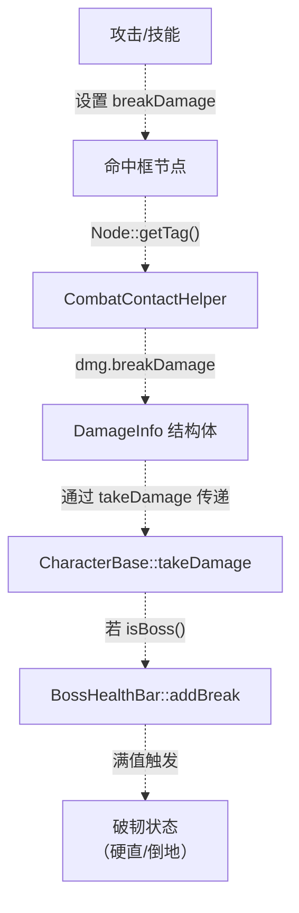
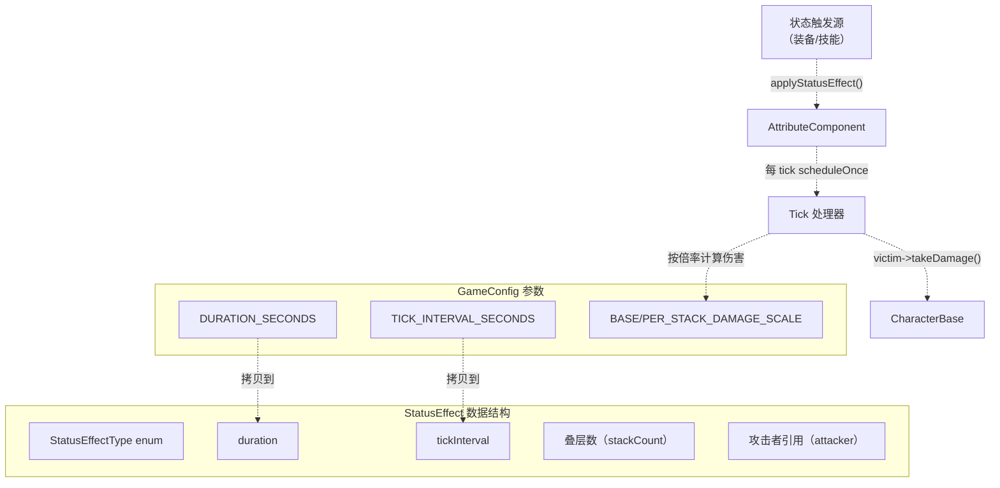
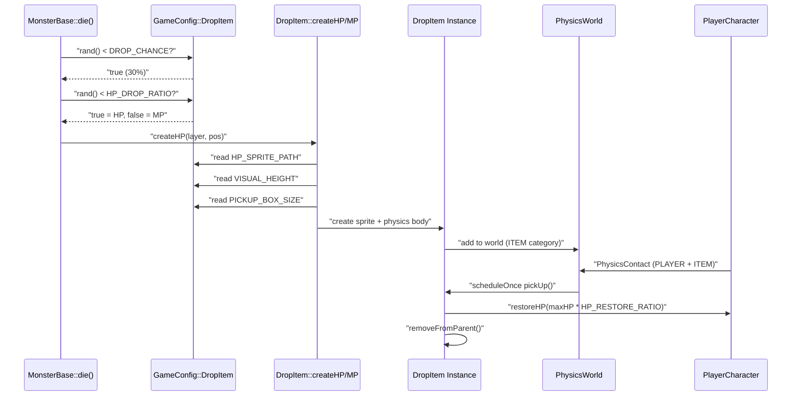
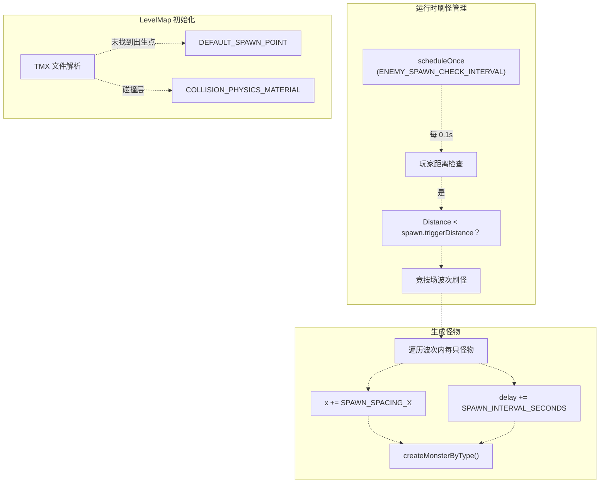
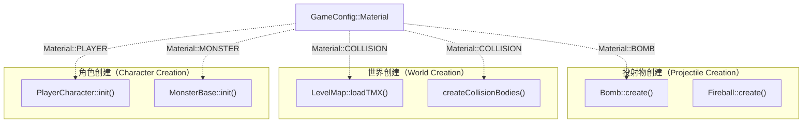
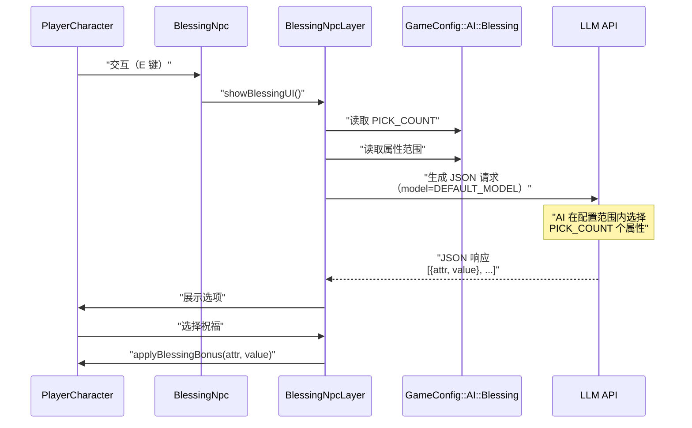
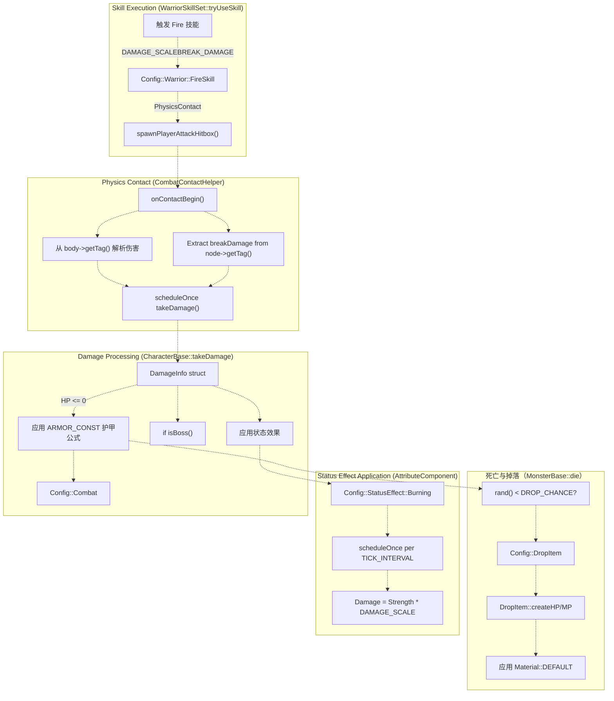

# 战斗与世界配置

> **相关源文件**
> * [Adventure-King/Classes/Character/Player/SkillSets/AssassinSkillSet.cpp](https://github.com/lilong555/Adventure-King/blob/60df0f40/Adventure-King/Classes/Character/Player/SkillSets/AssassinSkillSet.cpp)
> * [Adventure-King/Classes/Character/Player/SkillSets/WarriorSkillSet.cpp](https://github.com/lilong555/Adventure-King/blob/60df0f40/Adventure-King/Classes/Character/Player/SkillSets/WarriorSkillSet.cpp)
> * [Adventure-King/Classes/Configs/GameConfig.h](https://github.com/lilong555/Adventure-King/blob/60df0f40/Adventure-King/Classes/Configs/GameConfig.h)
> * [Adventure-King/Classes/Scenes/CombatContactHelper.cpp](https://github.com/lilong555/Adventure-King/blob/60df0f40/Adventure-King/Classes/Scenes/CombatContactHelper.cpp)

本页记录 `GameConfig.h` 中定义的战斗公式、状态效果、掉落物、关卡地图（LevelMap）设置与物理材质。这些配置控制游戏世界的机制与物理行为，包括伤害计算、环境效果、物品生成与碰撞属性等。

玩家与怪物属性配置请参见 [7.1](<玩家与怪物配置.md>)。技能与装备配置请参见 [7.2](<技能与装备配置.md>)。配置系统总体架构请参见 [7](<配置系统.md>)。

---

## 战斗系统配置

`GameConfig::Combat` 命名空间定义了战斗系统的基础机制：包括护甲/防御减伤公式，以及破韧伤害的默认数值等。

### 护甲与防御公式

护甲常量用于决定“防御力”如何削减受到的伤害：

```csharp
namespace Combat
{
    inline constexpr float ARMOR_CONST = 100.0f;
}
```

**用法：伤害计算中如何使用（Usage in Damage Calculation）**

护甲公式在 [Classes/Character/Base/CharacterBase.cpp L371-L382](https://github.com/lilong555/Adventure-King/blob/60df0f40/Classes/Character/Base/CharacterBase.cpp#L371-L382) 中被应用：

:

```
减伤比例 = 防御 / (防御 + ARMOR_CONST)
最终伤害 = 原始伤害 * (1 - 减伤比例)
```

当 `ARMOR_CONST = 100.0f` 时，防御力体现为“收益递减”：

* 防御 100 = 减伤 50%
* 防御 200 = 减伤 66.7%
* 防御 300 = 减伤 75%

该公式确保堆叠防御始终有收益，但永远无法达到 100% 减伤。

### 破韧伤害系统

破韧系统为 Boss 战提供了另一条“控制/进展”机制：攻击会累积“破韧伤害”，当累积到阈值时触发倒地/硬直等状态：

```csharp
namespace Combat
{
    inline constexpr int BREAK_DAMAGE_NORMAL = 1;
    inline constexpr int BREAK_DAMAGE_SKILL = 3;
}
```

* `BREAK_DAMAGE_NORMAL`：普通攻击的默认破韧伤害（每次命中 1）
* `BREAK_DAMAGE_SKILL`：技能的默认破韧伤害（每次使用 3）

具体技能可以通过自身的 `breakDamage` 字段覆盖这些默认值。例如：

* **Fireball**: `BREAK_DAMAGE = 3` [Classes/Configs/GameConfig.h L175](https://github.com/lilong555/Adventure-King/blob/60df0f40/Classes/Configs/GameConfig.h#L175-L175)
* **Fire**: `BREAK_DAMAGE = 3` [Classes/Configs/GameConfig.h L388](https://github.com/lilong555/Adventure-King/blob/60df0f40/Classes/Configs/GameConfig.h#L388-L388)
* **Slash**：`BREAK_DAMAGE_PER_HIT = 1`（总计 4 段命中 = 4 点破韧）[Classes/Configs/GameConfig.h L328](https://github.com/lilong555/Adventure-King/blob/60df0f40/Classes/Configs/GameConfig.h#L328-L328)

**破韧系统流程（Break System Flow）**



**来源：** [Classes/Configs/GameConfig.h L659-L665](https://github.com/lilong555/Adventure-King/blob/60df0f40/Classes/Configs/GameConfig.h#L659-L665)

 [Classes/Character/Base/CharacterBase.cpp L371-L424](https://github.com/lilong555/Adventure-King/blob/60df0f40/Classes/Character/Base/CharacterBase.cpp#L371-L424)

 [Classes/Scenes/CombatContactHelper.cpp L163-L212](https://github.com/lilong555/Adventure-King/blob/60df0f40/Classes/Scenes/CombatContactHelper.cpp#L163-L212)

---

## 状态效果配置

状态效果定义在 `GameConfig::StatusEffect` 中；其参数用于控制持续时间、结算间隔（tick）以及伤害/增益倍率等。

### 燃烧效果

燃烧会基于攻击者的力量（Strength）造成持续伤害（DOT）：

```csharp
namespace StatusEffect::Burning
{
    inline constexpr float DURATION_SECONDS = 5.0f;
    inline constexpr float TICK_INTERVAL_SECONDS = 0.5f;
    inline constexpr float BASE_DAMAGE_SCALE = 0.1f;
    inline constexpr float PER_STACK_DAMAGE_SCALE = 0.1f;
}
```

**伤害计算（Damage Calculation）**

```
Tick Damage = Attacker Strength * (BASE_DAMAGE_SCALE + Stacks * PER_STACK_DAMAGE_SCALE)
Total Ticks = DURATION_SECONDS / TICK_INTERVAL_SECONDS = 10 ticks
```

使用默认参数时：

* 1 层：每 tick 造成 Strength 的 10%（5 秒总计 100%）
* 2 层：每 tick 造成 Strength 的 20%（5 秒总计 200%）

### 中毒效果

中毒与燃烧类似，但持续更久、tick 更慢：

```csharp
namespace StatusEffect::Poisoned
{
    inline constexpr float DURATION_SECONDS = 6.0f;
    inline constexpr float TICK_INTERVAL_SECONDS = 1.0f;
    inline constexpr float BASE_DAMAGE_SCALE = 0.07f;
    inline constexpr float PER_STACK_DAMAGE_SCALE = 0.05f;
}
```

中毒每次 tick 的伤害更低，但持续更长：

* 1 层：每 tick 造成 Strength 的 7%（6 秒总计 42%）
* 2 层：每 tick 造成 Strength 的 12%（6 秒总计 72%）

### Excited（增益）效果

Excited 是一个提升移动速度的正向状态效果：

```csharp
namespace StatusEffect::Excited
{
    inline constexpr float DURATION_SECONDS = 2.0f;
    inline constexpr float MOVE_SPEED_BONUS = 60.0f;
}
```

该效果通常由装备效果（例如 Hunter Boots）施加 [Classes/Configs/GameConfig.h L127-L131](https://github.com/lilong555/Adventure-King/blob/60df0f40/Classes/Configs/GameConfig.h#L127-L131)。

### 状态效果数据流



**来源：** [Classes/Configs/GameConfig.h L594-L618](https://github.com/lilong555/Adventure-King/blob/60df0f40/Classes/Configs/GameConfig.h#L594-L618)

 [Classes/Character/components/AttributeComponent.h L63-L71](https://github.com/lilong555/Adventure-King/blob/60df0f40/Classes/Character/components/AttributeComponent.h#L63-L71)

 [Classes/Character/components/AttributeComponent.cpp L470-L535](https://github.com/lilong555/Adventure-King/blob/60df0f40/Classes/Character/components/AttributeComponent.cpp#L470-L535)

---

## 掉落物配置

`GameConfig::DropItem` 命名空间用于控制掉落物机制：包括掉落概率、恢复数值以及显示/物理相关参数。

### 掉落概率与比例

```csharp
namespace DropItem
{
    inline constexpr float DROP_CHANCE = 0.30f;
    inline constexpr float HP_DROP_RATIO = 0.50f;
}
```

| 参数 | 值 | 说明 |
| --- | --- | --- |
| `DROP_CHANCE` | 0.30 | 怪物死亡时有 30% 概率掉落物品 |
| `HP_DROP_RATIO` | 0.50 | 掉落中 50% 为 HP 药水，50% 为 MP 药水 |

### 回复数值

```csharp
namespace DropItem
{
    inline constexpr float HP_RESTORE_RATIO = 0.25f;
    inline constexpr float MP_RESTORE_RATIO = 0.25f;
}
```

恢复量采用百分比形式，以便随角色成长自动缩放：

* HP 药水：恢复最大 HP 的 25%
* MP 药水：恢复最大 MP 的 25%

### 物理与视觉设置

```javascript
namespace DropItem
{
    inline constexpr const char* HP_SPRITE_PATH = "Sprites/Item/Red.png";
    inline constexpr const char* MP_SPRITE_PATH = "Sprites/Item/Bule.png";
    
    inline constexpr float VISUAL_HEIGHT = 60.0f;
    inline constexpr float PICKUP_BOX_SIZE = 70.0f;
    
    inline constexpr float SPAWN_OFFSET_Y = 10.0f;
    inline constexpr float SPAWN_OFFSET_X_RANGE = 30.0f;
}
```

* `VISUAL_HEIGHT`：无论源图片大小如何，都把精灵缩放到固定高度
* `PICKUP_BOX_SIZE`：拾取检测用的物理体尺寸（略大于视觉尺寸，便于拾取）
* `SPAWN_OFFSET_Y/X_RANGE`：相对怪物死亡位置随机偏移生成坐标

### 掉落物生命周期



**来源：** [Classes/Configs/GameConfig.h L623-L646](https://github.com/lilong555/Adventure-King/blob/60df0f40/Classes/Configs/GameConfig.h#L623-L646)

 [Classes/Objects/Items/DropItem.h L13-L49](https://github.com/lilong555/Adventure-King/blob/60df0f40/Classes/Objects/Items/DropItem.h#L13-L49)

 [Classes/Objects/Items/DropItem.cpp L18-L137](https://github.com/lilong555/Adventure-King/blob/60df0f40/Classes/Objects/Items/DropItem.cpp#L18-L137)

---

## LevelMap 配置

`GameConfig::LevelMap` 命名空间定义了世界坐标相关参数：用于刷怪/生成管理、碰撞属性以及实体渲染顺序等。

### 生成系统设置

```javascript
namespace LevelMap
{
    const cocos2d::Vec2 DEFAULT_SPAWN_POINT(100.0f, 200.0f);
    inline constexpr float SPAWN_SPACING_X = 80.0f;
    inline constexpr float SPAWN_INTERVAL_SECONDS = 0.4f;
    inline constexpr float ENEMY_SPAWN_CHECK_INTERVAL_SECONDS = 0.1f;
}
```

| 参数 | 值 | 用途 |
| --- | --- | --- |
| `DEFAULT_SPAWN_POINT` | (100, 200) | 当 TMX 地图没有指定出生点时使用的兜底点 |
| `SPAWN_SPACING_X` | 80 px | 竞技场波次怪物的水平生成间距 |
| `SPAWN_INTERVAL_SECONDS` | 0.4 sec | 一波内每只怪物的生成间隔 |
| `ENEMY_SPAWN_CHECK_INTERVAL_SECONDS` | 0.1 sec | 检查玩家是否接近刷怪点的频率 |

**刷怪检查节流（Spawn Check Throttling）**

刷怪检查间隔用于避免每帧做大量“距离判定”计算：在 144 FPS 下若每帧检查，则会达到 144 次/秒；节流到 0.1 秒一次后，则降为 10 次/秒。

### 碰撞与传送门设置

```javascript
namespace LevelMap
{
    const cocos2d::PhysicsMaterial COLLISION_PHYSICS_MATERIAL(1.0f, 0.0f, 0.8f);
    inline constexpr float DEFAULT_GATE_INTERACT_DISTANCE = 100.0f;
}
```

* `COLLISION_PHYSICS_MATERIAL`：（density=1.0, restitution=0.0, friction=0.8）高摩擦防止在平台上滑动；零弹性避免反弹
* `DEFAULT_GATE_INTERACT_DISTANCE`：玩家需在 100 像素内才能看到传送门交互提示

### 角色层级（Z 序）

```csharp
namespace LevelMap
{
    inline constexpr int DEFAULT_CHARACTER_Z_ORDER = 5;
}
```

Z-order 用于决定渲染顺序：z=5 的角色会绘制在背景层之上、但在 UI 层之下。

### LevelMap 配置的使用



**来源：** [Classes/Configs/GameConfig.h L648-L657](https://github.com/lilong555/Adventure-King/blob/60df0f40/Classes/Configs/GameConfig.h#L648-L657)

 [Classes/Scenes/Levels/LevelMap.h L52-L97](https://github.com/lilong555/Adventure-King/blob/60df0f40/Classes/Scenes/Levels/LevelMap.h#L52-L97)

 [Classes/Scenes/Levels/LevelMap.cpp L88-L141](https://github.com/lilong555/Adventure-King/blob/60df0f40/Classes/Scenes/Levels/LevelMap.cpp#L88-L141)

 [Classes/Scenes/Levels/LevelMap.cpp L402-L468](https://github.com/lilong555/Adventure-King/blob/60df0f40/Classes/Scenes/Levels/LevelMap.cpp#L402-L468)

---

## 物理材质配置

`GameConfig::Material` 命名空间为不同实体类型定义了 `PhysicsMaterial` 预设。每个材质包含密度（density）、弹性（restitution/回弹）与摩擦（friction）等参数。

### 材质属性表

| 材质 | 密度 | 弹性 | 摩擦 | 用途 |
| --- | --- | --- | --- | --- |
| `DEFAULT` | 0.1 | 0.5 | 0.5 | 通用兜底材质 |
| `COLLISION` | 1.0 | 0.0 | 0.0 | 静态碰撞体（平台、墙体） |
| `PLAYER` | 1.0 | 0.0 | 0.0 | 玩家角色刚体 |
| `BOMB` | 0.5 | 0.3 | 0.2 | 投掷炸弹（略有回弹） |
| `MONSTER` | 1.0 | 0.0 | 0.0 | 怪物角色刚体 |
| `GOBLIN` | 1.0 | 0.0 | 0.0 | Goblin 专用（当前与 MONSTER 相同） |

```javascript
namespace Material
{
    const cocos2d::PhysicsMaterial DEFAULT(0.1f, 0.5f, 0.5f);
    const cocos2d::PhysicsMaterial COLLISION(1.0f, 0.0f, 0.0f);
    const cocos2d::PhysicsMaterial PLAYER(1.0f, 0.0f, 0.0f);
    const cocos2d::PhysicsMaterial BOMB(0.5f, 0.3f, 0.2f);
    const cocos2d::PhysicsMaterial MONSTER(1.0f, 0.0f, 0.0f);
    const cocos2d::PhysicsMaterial GOBLIN(1.0f, 0.0f, 0.0f);
}
```

### 材质设计理念

**角色使用零弹性（Zero Restitution for Characters）**

玩家与怪物材质使用 `restitution = 0.0`，以避免碰撞时发生弹跳。弹跳会干扰：

* 精确的跳跃/落地手感
* 战斗站位与击退控制
* 平台跳跃玩法

**角色使用零摩擦（Zero Friction for Characters）**

尽管 `COLLISION` 的摩擦设置为 0.8，角色依然使用 friction=0.0，以避免：

* 横向移动时“粘墙”
* 改变方向时速度衰减导致手感迟滞
* 战斗中操作不跟手

地面摩擦/阻尼由角色控制器的速度衰减逻辑处理，而不是依赖物理材质的 friction。

**炸弹材质调参（Bomb Material Tuning）**

炸弹使用更低密度（0.5）与中等弹性（0.3）来获得更“爽”的投掷与回弹体验；较低摩擦（0.2）让炸弹落地后可以略微滚动。

### 代码中的材质用法



**物理材质应用示例（Physics Material Application Example）**

[Classes/Character/Player/PlayerCharacter.cpp L110-L122](https://github.com/lilong555/Adventure-King/blob/60df0f40/Classes/Character/Player/PlayerCharacter.cpp#L110-L122)

:

```yaml
auto body = PhysicsBody::createBox(size, GameConfig::Material::PLAYER);
body->setCategoryBitmask(ToMask(GamePhysicsCategory::PLAYER));
body->setCollisionBitmask(ToMask(
    GamePhysicsCategory::PLATFORM |
    GamePhysicsCategory::COLLISION |
    GamePhysicsCategory::MONSTER |
    GamePhysicsCategory::MONSTER_ATTACK |
    GamePhysicsCategory::ITEM
));
body->setContactTestBitmask(ToMask(
    GamePhysicsCategory::PLATFORM |
    GamePhysicsCategory::COLLISION |
    // ... other categories
));
```

材质会与 category/collision mask 一起传入 `createBox()`，从而定义完整的物理行为。

**来源：** [Classes/Configs/GameConfig.h L707-L715](https://github.com/lilong555/Adventure-King/blob/60df0f40/Classes/Configs/GameConfig.h#L707-L715)

 [Classes/Character/Player/PlayerCharacter.cpp L110-L132](https://github.com/lilong555/Adventure-King/blob/60df0f40/Classes/Character/Player/PlayerCharacter.cpp#L110-L132)

 [Classes/Character/Monsters/MonsterBase.cpp L73-L98](https://github.com/lilong555/Adventure-King/blob/60df0f40/Classes/Character/Monsters/MonsterBase.cpp#L73-L98)

 [Classes/Scenes/Levels/LevelMap.cpp L208-L253](https://github.com/lilong555/Adventure-King/blob/60df0f40/Classes/Scenes/Levels/LevelMap.cpp#L208-L253)

---

## AI/NPC 配置

`GameConfig::AI::Blessing` 命名空间包含“AI 驱动祝福系统”的参数：一个 NPC 会提供由大模型（LLM）生成的属性加成选项。

### 祝福系统参数

```javascript
namespace AI::Blessing
{
    inline constexpr const char *DEFAULT_MODEL = "gemini-3-flash-preview";
    inline constexpr int PICK_COUNT = 2;
    
    // 供 AI 选择的属性范围
    inline constexpr float STRENGTH_MIN = 2.0f;
    inline constexpr float STRENGTH_MAX = 10.0f;
    inline constexpr float DEFENSE_MIN = 1.0f;
    inline constexpr float DEFENSE_MAX = 6.0f;
    inline constexpr float CRIT_RATE_MIN = 0.02f;
    inline constexpr float CRIT_RATE_MAX = 0.10f;
    inline constexpr float MOVE_SPEED_MIN = 10.0f;
    inline constexpr float MOVE_SPEED_MAX = 60.0f;
    inline constexpr float MAX_HP_MIN = 30.0f;
    inline constexpr float MAX_HP_MAX = 150.0f;
    inline constexpr float MAX_MP_MIN = 10.0f;
    inline constexpr float MAX_MP_MAX = 80.0f;
}
```

**系统行为（System Behavior）**

1. 玩家与祝福 NPC 交互
2. 系统将玩家上下文（等级、属性、职业等）发送给 LLM
3. LLM 从可选项中选择 `PICK_COUNT` 个属性
4. LLM 为每个被选属性在 min/max 范围内生成数值
5. 玩家选择一个祝福并应用

**属性范围设计（Attribute Range Design）**

这些范围经过校准：既能提供有体感的增益，又不至于破坏成长曲线：

* **Strength**：2-10 → 约相当于 1-5 级成长
* **Defense**：1-6 → 约相当于 0.5-4 级成长
* **Crit Rate**：2%-10% → 约相当于 1-5 点属性点的价值
* **Move Speed**：10-60 → 约相当于 1-6 点属性点的价值
* **Max HP**：30-150 → 约相当于 3-15 级成长
* **Max MP**：10-80 → 约相当于 1-8 级成长

### AI 祝福流程



**来源：** [Classes/Configs/GameConfig.h L667-L703](https://github.com/lilong555/Adventure-King/blob/60df0f40/Classes/Configs/GameConfig.h#L667-L703)

 [Classes/Objects/NPCs/BlessingNpc.h L13-L35](https://github.com/lilong555/Adventure-King/blob/60df0f40/Classes/Objects/NPCs/BlessingNpc.h#L13-L35)

 [Classes/UI/BlessingNpcLayer.h L14-L58](https://github.com/lilong555/Adventure-King/blob/60df0f40/Classes/UI/BlessingNpcLayer.h#L14-L58)

---

## 配置集成示例

该示例展示多个配置命名空间在一次战斗流程中如何协同工作：



**来源：** [Classes/Character/Player/SkillSets/WarriorSkillSet.cpp L353-L468](https://github.com/lilong555/Adventure-King/blob/60df0f40/Classes/Character/Player/SkillSets/WarriorSkillSet.cpp#L353-L468)

 [Classes/Scenes/CombatContactHelper.cpp L163-L212](https://github.com/lilong555/Adventure-King/blob/60df0f40/Classes/Scenes/CombatContactHelper.cpp#L163-L212)

 [Classes/Character/Base/CharacterBase.cpp L371-L424](https://github.com/lilong555/Adventure-King/blob/60df0f40/Classes/Character/Base/CharacterBase.cpp#L371-L424)

 [Classes/Character/components/AttributeComponent.cpp L470-L535](https://github.com/lilong555/Adventure-King/blob/60df0f40/Classes/Character/components/AttributeComponent.cpp#L470-L535)

 [Classes/Objects/Items/DropItem.cpp L18-L82](https://github.com/lilong555/Adventure-King/blob/60df0f40/Classes/Objects/Items/DropItem.cpp#L18-L82)
