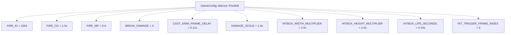
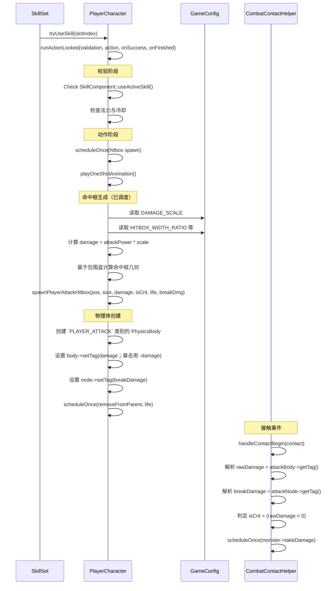
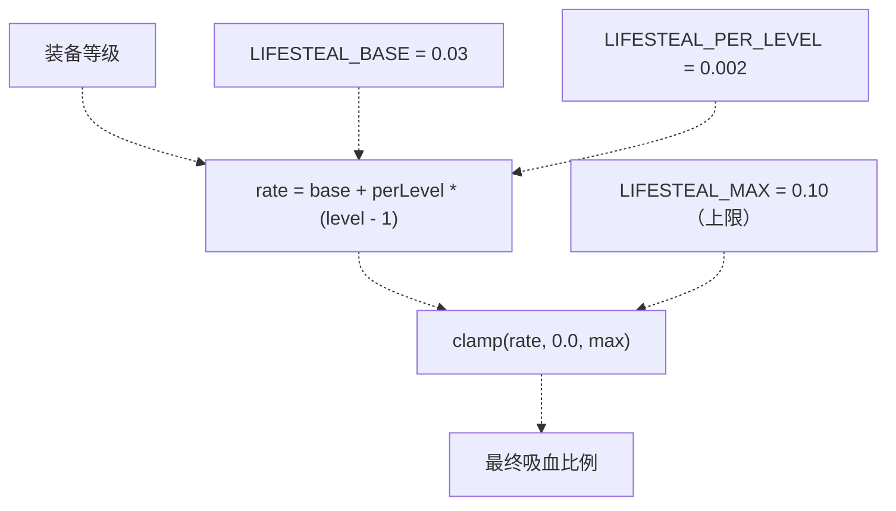
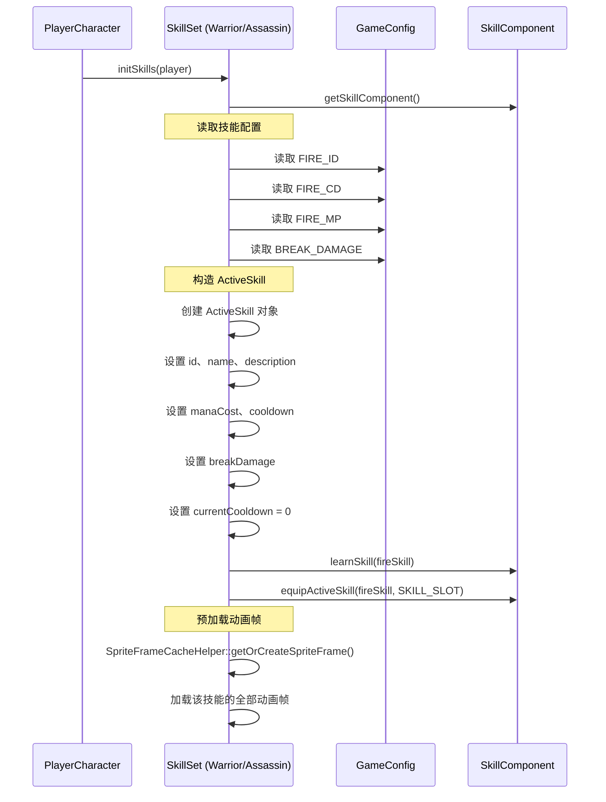
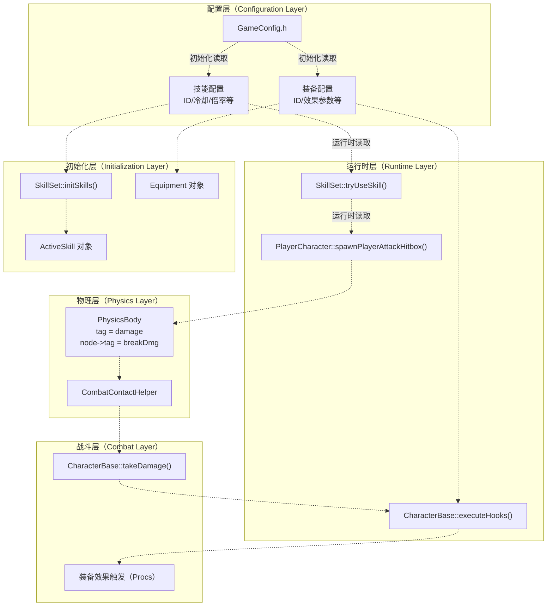

# 技能与装备配置

> **相关源文件**
> * [Adventure-King/Classes/Character/Player/SkillSets/AssassinSkillSet.cpp](https://github.com/lilong555/Adventure-King/blob/60df0f40/Adventure-King/Classes/Character/Player/SkillSets/AssassinSkillSet.cpp)
> * [Adventure-King/Classes/Character/Player/SkillSets/WarriorSkillSet.cpp](https://github.com/lilong555/Adventure-King/blob/60df0f40/Adventure-King/Classes/Character/Player/SkillSets/WarriorSkillSet.cpp)
> * [Adventure-King/Classes/Configs/GameConfig.h](https://github.com/lilong555/Adventure-King/blob/60df0f40/Adventure-King/Classes/Configs/GameConfig.h)
> * [Adventure-King/Classes/Scenes/CombatContactHelper.cpp](https://github.com/lilong555/Adventure-King/blob/60df0f40/Adventure-King/Classes/Scenes/CombatContactHelper.cpp)

## 目的与范围

本页记录 Adventure-King 的技能与装备配置：包括技能 ID、冷却、伤害倍率、装备 ID，以及装备效果参数等。这些配置集中在 `GameConfig.h` 的 `Skill`、`Equipment`、`EquipmentEffect` 命名空间中。

关于玩家/怪物基础属性与升级曲线，请参见 [玩家与怪物配置](<玩家与怪物配置.md>)。关于战斗公式、状态效果与掉落物配置，请参见 [战斗与世界配置](<战斗与世界配置.md>)。

---

## 配置架构概览

```mermaid
flowchart TD

SkillNS["GameConfig::Skill"]
PassiveNS["GameConfig::Skill::Passive"]
PassiveEffectNS["GameConfig::Skill::PassiveEffect"]
EquipNS["GameConfig::Equipment"]
EquipEffectNS["GameConfig::EquipmentEffect"]
BombNS["GameConfig::Bomb"]
FireballNS["GameConfig::Fireball"]
AssassinNS["GameConfig::Assassin"]
WarriorNS["GameConfig::Warrior"]
KleeNS["GameConfig::Klee"]
WarriorSkillSet["WarriorSkillSet"]
AssassinSkillSet["AssassinSkillSet"]
PlayerCharacter["PlayerCharacter"]
SkillComponent["SkillComponent"]
InventoryComponent["InventoryComponent"]
AttributeComponent["AttributeComponent"]
Equipment["Equipment Objects"]
CombatContactHelper["CombatContactHelper"]
CharacterBase["CharacterBase"]

BombNS -.->|"SLASH_ID, ALL_IN_ID, damage scales"| PlayerCharacter
FireballNS -.->|"BOMB_ID, BOMB_CD, BOMB_MP"| PlayerCharacter
WarriorNS -.->|"FIREBALL_ID, DAMAGE_SCALE"| WarriorSkillSet
AssassinNS -.->|"NormalAttack, FireballSkill configs"| AssassinSkillSet
KleeNS -.-> PlayerCharacter
PassiveNS -.-> SkillComponent
PassiveEffectNS -.->|"BLOODTHIRST_LIFESTEAL, proc chances"| AttributeComponent
EquipNS -.->|"STARTER_SWORD, LEATHER_CAP IDs"| InventoryComponent
EquipEffectNS -.-> Equipment
EquipEffectNS -.-> CharacterBase
PlayerCharacter -.-> CombatContactHelper

subgraph subGraph3 ["Combat System"]
    CombatContactHelper
    CharacterBase
end

subgraph subGraph2 ["Equipment System Consumers"]
    InventoryComponent
    AttributeComponent
    Equipment
end

subgraph subGraph1 ["Skill System Consumers"]
    WarriorSkillSet
    AssassinSkillSet
    PlayerCharacter
    SkillComponent
    WarriorSkillSet -.->|"TOUGHNESS, SWIFTNESS, etc IDs"| PlayerCharacter
    AssassinSkillSet -.->|"getReflectRate, getLifestealRate"| PlayerCharacter
end

subgraph subGraph0 ["GameConfig.h Namespaces"]
    SkillNS
    PassiveNS
    PassiveEffectNS
    EquipNS
    EquipEffectNS
    BombNS
    FireballNS
    AssassinNS
    WarriorNS
    KleeNS
    SkillNS -.->|"FIRE_ID, FIRE_CD, HITBOX params"| PassiveNS
    SkillNS -.->|"ThornsArmor, EmergencyMask params"| PassiveEffectNS
end
```



**图：配置命名空间结构与消费关系（Configuration Namespace Structure and Consumption）**

来源： [Classes/Configs/GameConfig.h L28-L154](https://github.com/lilong555/Adventure-King/blob/60df0f40/Classes/Configs/GameConfig.h#L28-L154)

---

## 主动技能配置

### 技能 ID 注册表

主动技能由各职业命名空间中定义的唯一整数 ID 标识。每个技能配置通常包含：技能 ID、冷却、法力消耗、伤害倍率以及战斗相关参数等。

| 技能名 | ID | 冷却 | MP 消耗 | 伤害倍率 | 破韧伤害 | 配置命名空间 |
| --- | --- | --- | --- | --- | --- | --- |
| Bomb | 1001 | 1.0s | 10.0 | 1.0x | 3 | `GameConfig::Bomb` |
| 火球（Fireball） | 1002 | 1.2s | 15.0 | 2.5x | 3 | `GameConfig::Fireball` |
| Slash | 1003 | 0.8s | 0.0 | 1.2x | 每段 1 | `GameConfig::Assassin::SlashSkill` |
| Fire | 1004 | 1.0s | 0.0 | 1.0x | 3 | `GameConfig::Warrior::FireSkill` |
| All In | 1005 | 15.0s | 0.0 | 不适用（增益） | 0 | `GameConfig::Assassin::AllInSkill` |

**表：主动技能 ID 与参数注册表（Active Skill ID and Parameter Registry）**

来源： [Classes/Configs/GameConfig.h L156-L183](https://github.com/lilong555/Adventure-King/blob/60df0f40/Classes/Configs/GameConfig.h#L156-L183)

 [Classes/Configs/GameConfig.h L318-L362](https://github.com/lilong555/Adventure-King/blob/60df0f40/Classes/Configs/GameConfig.h#L318-L362)

 [Classes/Configs/GameConfig.h L364-L396](https://github.com/lilong555/Adventure-King/blob/60df0f40/Classes/Configs/GameConfig.h#L364-L396)

---

### 职业特定技能参数

#### 战士技能（Warrior Skills）

战士职业以近战为主，通过命中框进行伤害投放。配置参数用于控制动画节奏、命中框几何以及伤害缩放等。

**Fire 技能配置（Fire Skill Configuration）：**



**图：战士 Fire 技能参数结构（Warrior Fire Skill Parameter Structure）**

`HIT_TRIGGER_FRAME_INDEX` 用于决定“动画过程中何时结算伤害”。命中框的宽高倍率会基于玩家包围盒按比例缩放，从而形成范围攻击（AoE）。在 `WarriorSkillSet::tryUseSkill` 中，命中框生成算法会调用 `computeBestFireHitboxCenter` 寻找“覆盖敌人数量最多”的最优位置。

来源： [Classes/Configs/GameConfig.h L377-L395](https://github.com/lilong555/Adventure-King/blob/60df0f40/Classes/Configs/GameConfig.h#L377-L395)

 [Classes/Character/Player/SkillSets/WarriorSkillSet.cpp L99-L258](https://github.com/lilong555/Adventure-King/blob/60df0f40/Classes/Character/Player/SkillSets/WarriorSkillSet.cpp#L99-L258)

---

#### 刺客技能（Assassin Skills）

刺客职业的特点是高速多段与增益机制：Slash 每次释放会生成多个命中框；All In 则通过修改“对外伤害倍率”实现爆发增益。

**Slash 技能配置（Slash Skill Configuration）：**

Slash 的配置用于描述一个 4 帧攻击序列：每一帧都会生成一个独立命中框：

* `SLASH_ID = 1003`
* `SLASH_CD = 0.8s`
* `CAST_ANIM_FRAME_DELAY = 0.12s`（总动画时长 0.48s）
* `DAMAGE_SCALE = 1.2x`
* `BREAK_DAMAGE_PER_HIT = 1`（完整释放总计 4 点破韧伤害）
* `HITBOX_LIFE_SECONDS = 0.10s`
* `HITBOX_DELAY_SECONDS = 0.05s`

命中框几何参数以玩家包围盒的比例定义：

* `HITBOX_WIDTH_RATIO = 0.60`
* `HITBOX_HEIGHT_RATIO = 0.70`
* `HITBOX_OFFSET_X_RATIO = 0.35`
* `HITBOX_OFFSET_Y = 6.0f`

**All In 技能配置（All In Skill Configuration）：**

All In 是一个自增益技能：它修改战斗参数（例如伤害倍率），而不是直接造成伤害：

* `ALL_IN_ID = 1005`
* `ALL_IN_DURATION = 15.0s`
* `ALL_IN_CD = 15.0s`
* `DAMAGE_MULTIPLIER = 11.0f`（伤害提高 1000%）
* `MIN_HP_AFTER_CAST = 1.0f`
* `VFX_PLIST = "Particle/par_nap.plist"`
* `KEEP_VFX_PLIST = "Particle/par_nap_keep.plist"`

在 `AssassinSkillSet::tryUseSkill` 中，增益通过 `PlayerCharacter::activateOutgoingDamageMultiplier` 应用；在持续时间内，它会影响所有“对外伤害”的计算。

来源： [Classes/Configs/GameConfig.h L320-L361](https://github.com/lilong555/Adventure-King/blob/60df0f40/Classes/Configs/GameConfig.h#L320-L361)

 [Classes/Character/Player/SkillSets/AssassinSkillSet.cpp L41-L85](https://github.com/lilong555/Adventure-King/blob/60df0f40/Classes/Character/Player/SkillSets/AssassinSkillSet.cpp#L41-L85)

 [Classes/Character/Player/SkillSets/AssassinSkillSet.cpp L160-L215](https://github.com/lilong555/Adventure-King/blob/60df0f40/Classes/Character/Player/SkillSets/AssassinSkillSet.cpp#L160-L215)

---

#### 法师技能（Klee）（Mage Skills (Klee)）

法师实现以投射物为核心，并包含爆炸机制。配置参数主要控制投射物行为、爆炸半径与视觉特效等。

**Fireball 技能配置（Fireball Skill Configuration）：**

```mermaid
flowchart TD

ID["FIREBALL_ID = 1002"]
CD["FIREBALL_CD = 1.2s"]
MP["FIREBALL_MP = 15.0"]
Break["BREAK_DAMAGE = 3"]
Scale["SPRITE_SCALE = 0.5"]
SpeedX["SPEED_X = 650.0"]
ExpRadius["EXPLOSION_RADIUS = 90.0"]
BaseDmg["BASE_DAMAGE = 220.0"]
DmgScale["DAMAGE_SCALE = 2.5x"]
CastDelay["CAST_ANIM_FRAME_DELAY = 0.04s"]
LoopDelay["LOOP_ANIM_DELAY = 0.08s"]
ExpDelay["EXPLOSION_FRAME_DELAY = 0.05s"]
ExpScale["EXPLOSION_FRAME_SCALE = 0.9"]
OffsetXRatio["SPAWN_OFFSET_X_RATIO = 0.40"]
OffsetX["SPAWN_OFFSET_X = 25.0"]
OffsetYRatio["SPAWN_OFFSET_Y_RATIO = 0.20"]
OffsetY["SPAWN_OFFSET_Y = 0.0"]
FireballSkill["GameConfig::Klee::FireballSkill"]

FireballSkill -.-> ID
FireballSkill -.-> CD
FireballSkill -.-> MP
FireballSkill -.-> Break
FireballSkill -.-> Scale
FireballSkill -.-> SpeedX
FireballSkill -.-> ExpRadius
FireballSkill -.-> BaseDmg
FireballSkill -.-> DmgScale
FireballSkill -.-> CastDelay
FireballSkill -.-> LoopDelay
FireballSkill -.-> ExpDelay
FireballSkill -.-> ExpScale
FireballSkill -.-> OffsetXRatio
FireballSkill -.-> OffsetX
FireballSkill -.-> OffsetYRatio
FireballSkill -.-> OffsetY

subgraph subGraph4 ["生成偏移（Spawn Offset）"]
    OffsetXRatio
    OffsetX
    OffsetYRatio
    OffsetY
end

subgraph subGraph3 ["动画配置（Animation Config）"]
    CastDelay
    LoopDelay
    ExpDelay
    ExpScale
end

subgraph subGraph2 ["伤害计算（Damage Calculation）"]
    BaseDmg
    DmgScale
end

subgraph subGraph1 ["投射物物理（Projectile Physics）"]
    Scale
    SpeedX
    ExpRadius
end

subgraph subGraph0 ["核心参数（Core Parameters）"]
    ID
    CD
    MP
    Break
end
```



**图：Klee Fireball 技能配置结构（Klee Fireball Skill Configuration Structure）**

生成偏移（spawn offset）参数用于确定投射物相对玩家包围盒的位置：比例值用于按尺寸做“相对定位”，固定偏移则提供“绝对微调”。`EXPLOSION_RADIUS` 用于定义投射物命中敌人或地形后产生的范围伤害半径。

来源： [Classes/Configs/GameConfig.h L169-L183](https://github.com/lilong555/Adventure-King/blob/60df0f40/Classes/Configs/GameConfig.h#L169-L183)

 [Classes/Configs/GameConfig.h L302-L314](https://github.com/lilong555/Adventure-King/blob/60df0f40/Classes/Configs/GameConfig.h#L302-L314)

---

### 命中框生成模式

所有技能在生成伤害命中框时都遵循一套通用模式：



**图：从技能配置到命中框生成的流程（Skill Configuration to Hitbox Generation Flow）**

物理体的 `tag` 字段用于编码伤害信息：正数代表普通伤害，负数代表暴击伤害。命中框节点的 `tag` 字段用于存放 Boss 破韧机制所需的破韧伤害。通过这套编码，`CombatContactHelper` 可以在物理接触回调中直接解析出完整伤害信息，而无需为每个命中框额外维护数据结构。

来源： [Classes/Character/Player/SkillSets/WarriorSkillSet.cpp L306-L333](https://github.com/lilong555/Adventure-King/blob/60df0f40/Classes/Character/Player/SkillSets/WarriorSkillSet.cpp#L306-L333)

 [Classes/Character/Player/SkillSets/AssassinSkillSet.cpp L251-L289](https://github.com/lilong555/Adventure-King/blob/60df0f40/Classes/Character/Player/SkillSets/AssassinSkillSet.cpp#L251-L289)

 [Classes/Scenes/CombatContactHelper.cpp L163-L212](https://github.com/lilong555/Adventure-King/blob/60df0f40/Classes/Scenes/CombatContactHelper.cpp#L163-L212)

---

## 被动技能配置

### 被动技能 ID 注册表

被动技能使用 2000 段的 ID 进行标识。每个被动都会提供永久属性加成或条件触发的效果。

```mermaid
flowchart TD

Tough["TOUGHNESS = 2001<br>+最大 HP"]
Swift["SWIFTNESS = 2002<br>+移动速度"]
Focus["FOCUS = 2003<br>+暴击率"]
Blood["BLOODTHIRST = 2004<br>命中吸血"]
Ember["EMBER_MARK = 2005<br>命中附加燃烧"]
FullCrit["FULL_HP_CRIT = 2006<br>满血加暴击"]
CritEcho["CRIT_ECHO = 2007<br>暴击减 CD"]
Poison["POISON_TOUCH = 2008<br>命中附加中毒"]
BloodParam["BLOODTHIRST_LIFESTEAL = 0.05"]
BloodMax["LIFESTEAL_TOTAL_MAX = 0.20"]
EmberChance["EMBER_MARK_PROC_CHANCE = 0.20"]
EmberCD["EMBER_MARK_PROC_COOLDOWN = 0.25s"]
CritBonus["FULL_HP_CRIT_BONUS = 0.25"]
EchoReduce["CRIT_ECHO_REDUCE_SECONDS = 0.35s"]
EchoCD["CRIT_ECHO_PROC_COOLDOWN = 0.25s"]
PoisonChance["POISON_TOUCH_PROC_CHANCE = 0.18"]
PoisonCD["POISON_TOUCH_PROC_COOLDOWN = 0.35s"]

Blood -.-> BloodParam
Blood -.-> BloodMax
Ember -.-> EmberChance
Ember -.-> EmberCD
FullCrit -.-> CritBonus
CritEcho -.-> EchoReduce
CritEcho -.-> EchoCD
Poison -.-> PoisonChance
Poison -.-> PoisonCD

subgraph GameConfig::Skill::PassiveEffect ["GameConfig::Skill::PassiveEffect"]
    BloodParam
    BloodMax
    EmberChance
    EmberCD
    CritBonus
    EchoReduce
    EchoCD
    PoisonChance
    PoisonCD
end

subgraph GameConfig::Skill::Passive ["GameConfig::Skill::Passive"]
    Tough
    Swift
    Focus
    Blood
    Ember
    FullCrit
    CritEcho
    Poison
end
```



**图：被动技能 ID 与效果参数映射（Passive Skill ID to Effect Parameter Mapping）**

被动技能 ID 由 `SkillComponent` 用于追踪玩家已学习的被动；而 `PassiveEffect` 命名空间中的效果参数，会在战斗计算中被 `AttributeComponent` 与 `CharacterBase` 消费使用。

来源： [Classes/Configs/GameConfig.h L34-L68](https://github.com/lilong555/Adventure-King/blob/60df0f40/Classes/Configs/GameConfig.h#L34-L68)

---

### 被动效果参数

#### 触发型效果（Proc-Based Effects）

带触发概率（proc chance）的被动效果通常会设置“内部冷却”，以防止触发过于频繁：

| 效果 | 触发概率 | 内部冷却 | 实现位置 |
| --- | --- | --- | --- |
| Ember Mark（余烬印记） | 20% | 0.25s | `AttributeComponent::executeAfterDealDamageHooks` |
| Poison Touch（毒触） | 18% | 0.35s | `AttributeComponent::executeAfterDealDamageHooks` |
| Crit Echo（暴击回响） | 暴击时 100% | 0.25s | `AttributeComponent::executeAfterDealDamageHooks` |

**表：触发型被动效果时序参数（Proc-Based Passive Effect Timing Parameters）**

内部冷却用于避免“高频攻击”或“多段技能”在一秒内反复触发同一个效果。每个效果都会独立记录自己的上次触发时间。

#### 条件属性修正（Conditional Stat Modifiers）

部分被动会在满足条件时临时修正属性：

* **FULL_HP_CRIT**：当当前 HP 等于最大 HP 时，额外增加 `0.25`（25%）暴击率
* **BLOODTHIRST_LIFESTEAL**：按造成伤害的 `0.05`（5%）进行治疗
* **LIFESTEAL_TOTAL_MAX**：将所有来源的总吸血上限限制在 `0.20`（20%）

`LIFESTEAL_TOTAL_MAX` 上限用于防止多来源吸血叠加（被动 + 装备等）导致“近似无敌”的体验。

来源： [Classes/Configs/GameConfig.h L47-L68](https://github.com/lilong555/Adventure-King/blob/60df0f40/Classes/Configs/GameConfig.h#L47-L68)

---

## 装备配置

### 装备 ID 注册表

装备 ID 按槽位类型划分在 5000 段。ID 结构遵循 `50XY` 的模式：`X` 表示槽位类型，`Y` 表示该槽位内的物品序号。

```mermaid
flowchart TD

WeaponNS["武器命名空间（Weapon Namespace）"]
HelmetNS["头盔命名空间（Helmet Namespace）"]
ArmorNS["护甲命名空间（Armor Namespace）"]
BootsNS["鞋子命名空间（Boots Namespace）"]
StarterSword["STARTER_SWORD = 5001"]
TrainingStaff["TRAINING_STAFF = 5002"]
EmberStaff["EMBER_STAFF = 5003"]
BloodPactSword["BLOOD_PACT_SWORD = 5004"]
LeatherCap["LEATHER_CAP = 5101"]
EmergencyMask["EMERGENCY_MASK = 5104"]
LeatherArmor["LEATHER_ARMOR = 5102"]
ThornsArmor["THORNS_ARMOR = 5105"]
LightBoots["LIGHT_BOOTS = 5103"]
HunterBoots["HUNTER_BOOTS = 5106"]

WeaponNS -.-> StarterSword
WeaponNS -.-> TrainingStaff
WeaponNS -.-> EmberStaff
WeaponNS -.-> BloodPactSword
HelmetNS -.-> LeatherCap
HelmetNS -.-> EmergencyMask
ArmorNS -.-> LeatherArmor
ArmorNS -.-> ThornsArmor
BootsNS -.-> LightBoots
BootsNS -.-> HunterBoots

subgraph subGraph4 ["Boots IDs (51X3-51X9)"]
    LightBoots
    HunterBoots
end

subgraph subGraph3 ["Armor IDs (51X2-51X9)"]
    LeatherArmor
    ThornsArmor
end

subgraph subGraph2 ["Helmet IDs (51X1-51X9)"]
    LeatherCap
    EmergencyMask
end

subgraph subGraph1 ["Weapon IDs (50X1-50X9)"]
    StarterSword
    TrainingStaff
    EmberStaff
    BloodPactSword
end

subgraph GameConfig::Equipment ["GameConfig::Equipment"]
    WeaponNS
    HelmetNS
    ArmorNS
    BootsNS
end
```



**图：按槽位类型组织装备 ID（Equipment ID Organization by Slot Type）**

该 ID 结构可以让人从数值上快速判断装备槽位：例如 `5001-5009` 为武器、`5101-5109` 为头盔、`5102` 为护甲（注意：护甲与头盔共享 510X 区间，靠末位数字区分）、`5103` 为鞋子。

来源： [Classes/Configs/GameConfig.h L72-L99](https://github.com/lilong555/Adventure-King/blob/60df0f40/Classes/Configs/GameConfig.h#L72-L99)

---

### 装备效果参数

特殊装备会配套一组“效果参数”，用于定义其独特机制。这些参数统一组织在 `GameConfig::EquipmentEffect` 命名空间中。

#### ThornsArmor（反伤）（Reflect Damage）

Thorns Armor 会把“所受伤害的一部分”反弹给攻击者；反伤比例会随装备等级增长，并采用带上限的增长公式（clamped growth）。

**参数结构（Parameter Structure）：**

```csharp
namespace ThornsArmor {
    inline constexpr float REFLECT_RATE_BASE = 0.15f;      // 基础反伤 15%
    inline constexpr float REFLECT_RATE_PER_LEVEL = 0.01f; // 每级 +1%
    inline constexpr float REFLECT_RATE_MAX = 0.35f;       // 上限 35%
    inline constexpr float PROC_COOLDOWN = 0.50f;          // 内部冷却 0.5s
    
    inline float getReflectRate(int level) {
        level = std::max(1, level);
        float rate = REFLECT_RATE_BASE + REFLECT_RATE_PER_LEVEL * static_cast<float>(level - 1);
        return std::max(0.0f, std::min(rate, REFLECT_RATE_MAX));
    }
}
```

当玩家装备 Thorns Armor 时，`CharacterBase::executeAfterReceiveDamageHooks` 会调用 `getReflectRate` 来获取当前等级的反伤比例。内部冷却用于避免一次多段攻击在短时间内多次触发反伤。

来源： [Classes/Configs/GameConfig.h L104-L118](https://github.com/lilong555/Adventure-King/blob/60df0f40/Classes/Configs/GameConfig.h#L104-L118)

---

#### EmergencyMask（低血保命）（Low HP Rescue）

Emergency Mask 会在 HP 低于阈值时自动治疗；它设置了较长的冷却时间，避免频繁触发。

**参数结构（Parameter Structure）：**

| 参数 | 值 | 说明 |
| --- | --- | --- |
| `TRIGGER_HP_RATIO` | 0.20 | 当 HP < 最大 HP 的 20% 时触发 |
| `HEAL_TARGET_HP_RATIO` | 0.35 | 治疗到最大 HP 的 35% |
| `PROC_COOLDOWN` | 45.0s | 45 秒内不可再次触发 |

治疗量按 `maxHP * HEAL_TARGET_HP_RATIO - currentHP` 计算，确保触发后玩家正好到达 35% HP（而不是“额外加一段固定值”）。

来源： [Classes/Configs/GameConfig.h L120-L125](https://github.com/lilong555/Adventure-King/blob/60df0f40/Classes/Configs/GameConfig.h#L120-L125)

---

#### BloodPactSword（血契剑）：随等级缩放的吸血（Scaling Lifesteal）

Blood Pact Sword 提供“随装备等级缩放”的吸血效果，其缩放方式与 Thorns Armor 的反伤缩放类似。

**缩放公式（Scaling Formula）：**



**图：BloodPactSword 吸血缩放算法（BloodPactSword Lifesteal Scaling Algorithm）**

在 1 级时，该武器提供 3% 吸血；在 10 级时提供 4.8% 吸血；10% 的上限会在 36 级或更高时达到。`getLifestealRate(int level)` 的实现与 `ThornsArmor::getReflectRate` 采用相同的“增长 + clamp”计算模式。

来源： [Classes/Configs/GameConfig.h L139-L152](https://github.com/lilong555/Adventure-King/blob/60df0f40/Classes/Configs/GameConfig.h#L139-L152)

---

#### EmberStaff（余烬法杖）：附加燃烧（Burning Application）

Ember Staff 会在命中时按触发概率附加“燃烧”状态，并带有内部冷却。

**参数结构（Parameter Structure）：**

* `PROC_CHANCE = 0.25f`（每次命中 25% 概率）
* `PROC_COOLDOWN = 0.20f`（内部冷却 0.2s）

燃烧本体的数值参数独立定义在 `GameConfig::StatusEffect::Burning`（见 [战斗与世界配置](<战斗与世界配置.md>)）。Ember Staff 的 proc 参数只控制“附加频率/节奏”，不直接定义燃烧伤害本身。

来源： [Classes/Configs/GameConfig.h L133-L137](https://github.com/lilong555/Adventure-King/blob/60df0f40/Classes/Configs/GameConfig.h#L133-L137)

---

#### HunterBoots（猎手靴）：击杀加速 Buff（Kill Streak Buff）

Hunter Boots 会在击杀敌人后提供一个短时间的移速增益。

**参数结构（Parameter Structure）：**

* `BUFF_DURATION_SECONDS = 2.0f`
* `MOVE_SPEED_BONUS = 60.0f`

该 Buff 通过 `Excited` 状态效果实现（见 `GameConfig::StatusEffect::Excited`）。装备效果触发的是“施加状态效果”，而不是直接修改属性值，从而复用统一的状态效果系统。

来源： [Classes/Configs/GameConfig.h L127-L131](https://github.com/lilong555/Adventure-King/blob/60df0f40/Classes/Configs/GameConfig.h#L127-L131)

---

## 配置消费模式

### SkillSet 初始化模式

职业技能集会在初始化时读取配置参数，并构造 `ActiveSkill` 对象。初始化过程发生在 `SkillSet::initSkills` 中。



**图：从技能配置到 ActiveSkill 对象的流程（Skill Configuration to ActiveSkill Object Flow）**

预加载步骤会在角色初始化阶段解码 PNG 并把纹理上传到 GPU，从而避免“第一次使用技能”时因为实时加载导致掉帧。

来源： [Classes/Character/Player/SkillSets/WarriorSkillSet.cpp L261-L296](https://github.com/lilong555/Adventure-King/blob/60df0f40/Classes/Character/Player/SkillSets/WarriorSkillSet.cpp#L261-L296)

 [Classes/Character/Player/SkillSets/AssassinSkillSet.cpp L41-L85](https://github.com/lilong555/Adventure-King/blob/60df0f40/Classes/Character/Player/SkillSets/AssassinSkillSet.cpp#L41-L85)

---

### 装备效果缩放函数

需要随等级缩放的装备效果，会在 `GameConfig` 中用 inline 函数计算最终数值；这些函数会在战斗计算过程中由 `CharacterBase` 调用。

```javascript
// Example: Thorns Armor reflection calculation in CharacterBase
void CharacterBase::executeAfterReceiveDamageHooks(const DamageInfo& dmg) {
    // ... other hooks ...
    
    if (hasThornsArmor) {
        int armorLevel = getThornsArmorLevel();
        float reflectRate = GameConfig::EquipmentEffect::ThornsArmor::getReflectRate(armorLevel);
        float reflectDmg = dmg.finalAmount * reflectRate;
        
        if (canProcThornsArmor()) { // checks internal cooldown
            dealReflectDamage(dmg.attacker, reflectDmg);
            recordThornsArmorProc();
        }
    }
}
```

等级缩放函数把增长公式与 clamp 逻辑封装在一起，保证所有使用缩放机制的装备效果具有一致的行为（同样的增长方式与上限约束）。

---

### 命中框参数计算

技能实现会从 `GameConfig` 读取比例参数，并把它们应用到角色包围盒上来计算命中框尺寸与偏移。这样无论角色精灵原始尺寸或职业缩放倍率如何变化，命中框都能按比例正确缩放。

**计算模式（Calculation Pattern）：**

```javascript
// From WarriorSkillSet::tryNormalAttack
const Rect box = player.getBoundingBox();
const float w = std::max(10.0f, box.size.width * GameConfig::Warrior::HITBOX_WIDTH_RATIO);
const float h = std::max(10.0f, box.size.height * GameConfig::Warrior::HITBOX_HEIGHT_RATIO);

const float dirX = player.isFlippedX() ? -1.0f : 1.0f;
const float cx = box.getMidX() + dirX * (box.size.width * GameConfig::Warrior::HITBOX_OFFSET_X_RATIO);
const float cy = box.getMidY() + GameConfig::Warrior::HITBOX_OFFSET_Y;
```

`std::max(10.0f, ...)` 用于保证命中框有最小尺寸，即使比例参数非常小也不会变成“几乎不可命中”。`dirX` 用于根据朝向在水平方向翻转偏移，使命中框始终出现在角色面前。

来源： [Classes/Character/Player/SkillSets/WarriorSkillSet.cpp L317-L323](https://github.com/lilong555/Adventure-King/blob/60df0f40/Classes/Character/Player/SkillSets/WarriorSkillSet.cpp#L317-L323)

 [Classes/Character/Player/SkillSets/AssassinSkillSet.cpp L104-L111](https://github.com/lilong555/Adventure-King/blob/60df0f40/Classes/Character/Player/SkillSets/AssassinSkillSet.cpp#L104-L111)

---

## 配置数据流汇总



**图：从 GameConfig 到战斗结算的完整配置数据流（Complete Configuration Data Flow from GameConfig to Combat Resolution）**

配置数据大致走两条路径：**初始化阶段**（学习技能、创建装备）与 **运行时阶段**（伤害计算、效果触发）。初始化读取会创建持久化对象（`ActiveSkill`、`Equipment`），而运行时读取则用于计算逐帧/逐次结算的数值（命中框尺寸、伤害倍率、触发概率等）。

来源： [Classes/Configs/GameConfig.h L28-L154](https://github.com/lilong555/Adventure-King/blob/60df0f40/Classes/Configs/GameConfig.h#L28-L154)

 [Classes/Character/Player/SkillSets/WarriorSkillSet.cpp L261-L468](https://github.com/lilong555/Adventure-King/blob/60df0f40/Classes/Character/Player/SkillSets/WarriorSkillSet.cpp#L261-L468)

 [Classes/Scenes/CombatContactHelper.cpp L163-L212](https://github.com/lilong555/Adventure-King/blob/60df0f40/Classes/Scenes/CombatContactHelper.cpp#L163-L212)
