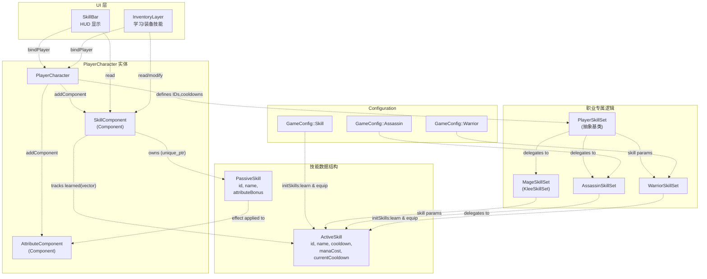
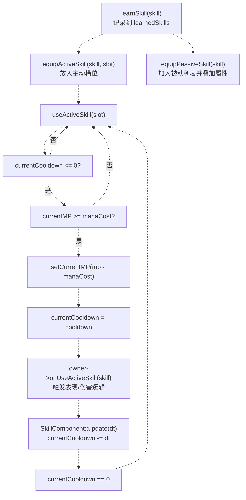
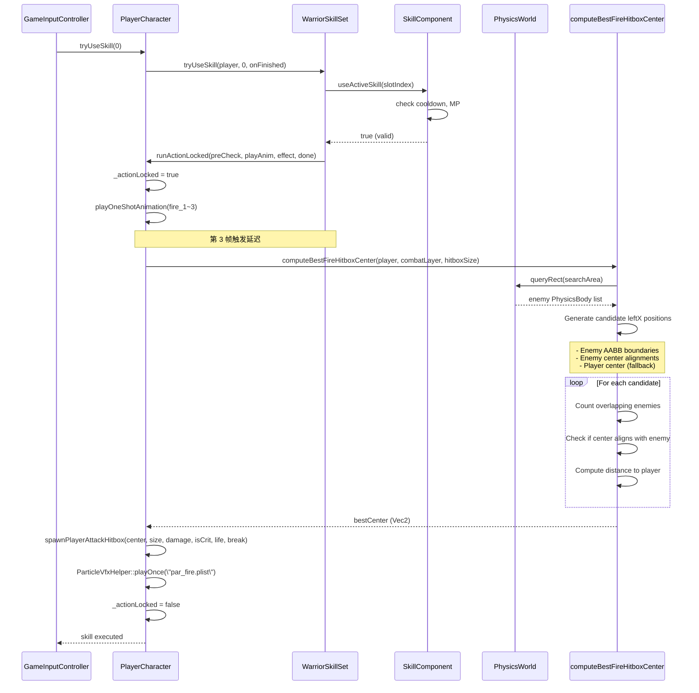
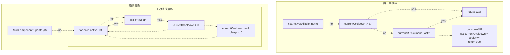
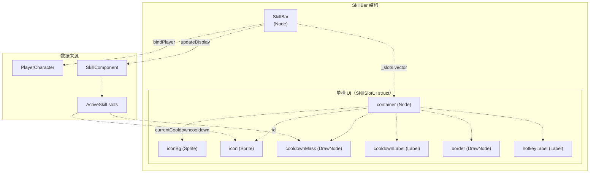
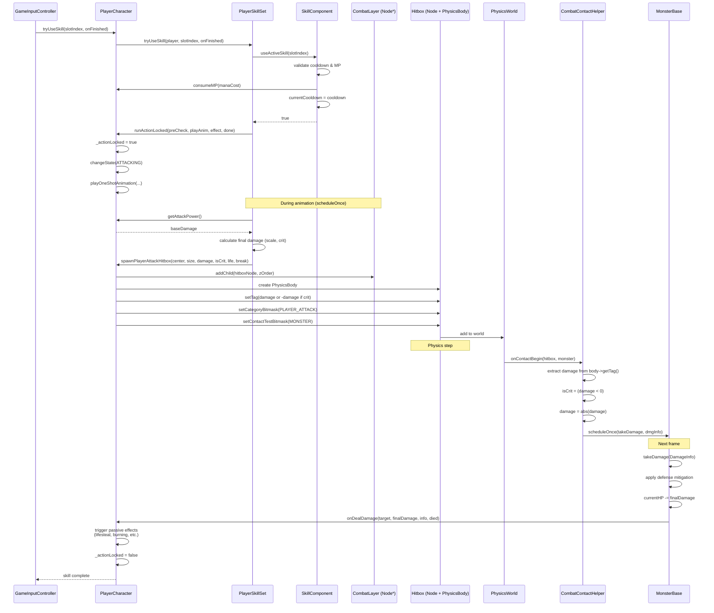

# 技能系统

> **相关源文件**
> * [Adventure-King/Classes/Character/Player/PlayerCharacter.cpp](https://github.com/lilong555/Adventure-King/blob/60df0f40/Adventure-King/Classes/Character/Player/PlayerCharacter.cpp)
> * [Adventure-King/Classes/Character/Player/PlayerCharacter.h](https://github.com/lilong555/Adventure-King/blob/60df0f40/Adventure-King/Classes/Character/Player/PlayerCharacter.h)
> * [Adventure-King/Classes/Character/Player/SkillSets/AssassinSkillSet.cpp](https://github.com/lilong555/Adventure-King/blob/60df0f40/Adventure-King/Classes/Character/Player/SkillSets/AssassinSkillSet.cpp)
> * [Adventure-King/Classes/Character/Player/SkillSets/WarriorSkillSet.cpp](https://github.com/lilong555/Adventure-King/blob/60df0f40/Adventure-King/Classes/Character/Player/SkillSets/WarriorSkillSet.cpp)
> * [Adventure-King/Classes/Configs/GameConfig.h](https://github.com/lilong555/Adventure-King/blob/60df0f40/Adventure-King/Classes/Configs/GameConfig.h)
> * [Adventure-King/Classes/Scenes/CombatContactHelper.cpp](https://github.com/lilong555/Adventure-King/blob/60df0f40/Adventure-King/Classes/Scenes/CombatContactHelper.cpp)
> * [Adventure-King/Classes/UI/InventoryLayer.cpp](https://github.com/lilong555/Adventure-King/blob/60df0f40/Adventure-King/Classes/UI/InventoryLayer.cpp)
> * [Adventure-King/Classes/UI/InventoryLayer.h](https://github.com/lilong555/Adventure-King/blob/60df0f40/Adventure-King/Classes/UI/InventoryLayer.h)
> * [Adventure-King/Classes/UI/SkillBar.cpp](https://github.com/lilong555/Adventure-King/blob/60df0f40/Adventure-King/Classes/UI/SkillBar.cpp)

## 目的与范围

技能系统用于管理玩家的战斗能力，包括带冷却/耗蓝的主动技能，以及提供永久属性加成的被动技能。本文档涵盖技能定义、冷却管理、按职业区分的技能集（skill set），以及技能逻辑与 UI 组件之间的集成方式。

关于会触发战斗机制的装备效果（例如命中吸血、命中燃烧），请参见 [Equipment and Inventory](<装备与背包.md>)。关于触发技能释放的输入处理，请参见 [GameInputController](<游戏输入控制器（GameInputController）.md>)。关于属性加成与属性计算，请参见 [Component Architecture](<组件架构.md>)。

---

## 系统架构

技能系统采用组件化架构，包含三层：数据与通用逻辑（SkillComponent）、职业专属实现（PlayerSkillSet 的各子类）、UI（InventoryLayer 与 SkillBar）。

### 核心组件关系

**来源：** [Adventure-King/Classes/Character/Player/PlayerCharacter.h L1-L352](https://github.com/lilong555/Adventure-King/blob/60df0f40/Adventure-King/Classes/Character/Player/PlayerCharacter.h#L1-L352)

 [Adventure-King/Classes/Character/Player/PlayerCharacter.cpp L264-L269](https://github.com/lilong555/Adventure-King/blob/60df0f40/Adventure-King/Classes/Character/Player/PlayerCharacter.cpp#L264-L269)

 [Adventure-King/Classes/Character/components/SkillComponent.h](https://github.com/lilong555/Adventure-King/blob/60df0f40/Adventure-King/Classes/Character/components/SkillComponent.h)

 [Adventure-King/Classes/UI/InventoryLayer.h L1-L161](https://github.com/lilong555/Adventure-King/blob/60df0f40/Adventure-King/Classes/UI/InventoryLayer.h#L1-L161)

 [Adventure-King/Classes/UI/SkillBar.cpp L1-L412](https://github.com/lilong555/Adventure-King/blob/60df0f40/Adventure-King/Classes/UI/SkillBar.cpp#L1-L412)

---

## 技能类型

技能分为两类：**主动技能**（有冷却/蓝耗/释放逻辑）与 **被动技能**（常驻属性或触发效果）。数据结构定义在 `CharacterData.h`：

### 主动技能（ActiveSkill）

| 字段 | 类型 | 描述 |
| --- | --- | --- |
| `id` | `int` | 技能唯一 ID |
| `name` | `std::string` | 显示名称 |
| `description` | `std::string` | 描述文本 |
| `cooldown` | `float` | 冷却秒数 |
| `manaCost` | `float` | 蓝耗（MP） |
| `breakDamage` | `int` | 对 Boss 破韧条的累计值（无则 0） |
| `currentCooldown` | `float` | 当前剩余冷却（0=可用） |

### 被动技能（PassiveSkill）

| 字段 | 类型 | 描述 |
| --- | --- | --- |
| `id` | `int` | 技能唯一 ID |
| `name` | `std::string` | 显示名称 |
| `description` | `std::string` | 描述文本 |
| `attributeBonus` | `Attributes` | 常驻属性加成（装备后叠加到 `AttributeComponent`） |

部分被动技能属于“触发型”：效果不只来自 `attributeBonus`，还会在 `PlayerCharacter::onDealDamage()` / `onReceiveDamage()` 等战斗回调中触发（例如吸血、暴击后缩减冷却等）。

**来源：** [Adventure-King/Classes/Character/Base/CharacterData.h L146-L182](https://github.com/lilong555/Adventure-King/blob/60df0f40/Adventure-King/Classes/Character/Base/CharacterData.h#L146-L182)

 [Adventure-King/Classes/Character/Player/PlayerCharacter.cpp L451-L512](https://github.com/lilong555/Adventure-King/blob/60df0f40/Adventure-King/Classes/Character/Player/PlayerCharacter.cpp#L451-L512)

---

## 技能管理流程

技能生命周期包含：初始化/学习、装备到槽位、使用前校验、执行、冷却计时。下图展示从技能初始化到执行的完整流程。

### 技能生命周期状态机

**来源：** [Adventure-King/Classes/Character/components/SkillComponent.cpp](https://github.com/lilong555/Adventure-King/blob/60df0f40/Adventure-King/Classes/Character/components/SkillComponent.cpp)

 [Adventure-King/Classes/UI/InventoryLayer.cpp L804-L827](https://github.com/lilong555/Adventure-King/blob/60df0f40/Adventure-King/Classes/UI/InventoryLayer.cpp#L804-L827)

 [Adventure-King/Classes/Character/Player/PlayerCharacter.cpp L200-L207](https://github.com/lilong555/Adventure-King/blob/60df0f40/Adventure-King/Classes/Character/Player/PlayerCharacter.cpp#L200-L207)

---

## 按职业区分的技能集（Role-Specific Skill Sets）

每个职业都会使用一个 `PlayerSkillSet` 子类来实现该职业的技能。技能集会在 `PlayerCharacter::init()` 中创建，并在实体生命周期内与角色绑定。

### 技能集实现

| 类 | 职业 | 主动技能 | 特殊机制 |
| --- | --- | --- | --- |
| `WarriorSkillSet` | Warrior | Fire（近战 AoE） | 命中框最优选点算法 |
| `AssassinSkillSet` | Assassin | Slash（多段）、All In（伤害增益） | 每段独立暴击、出站伤害倍率 |
| `KleeSkillSet` | Mage | Bomb（投掷物）、Fireball（追踪弹） | 投掷物生成、爆炸处理 |

### 战士：Fire 技能

Fire 技能释放火焰爆发，对 AoE 内所有敌人造成伤害。该技能使用一套更复杂的算法来定位命中框中心，以最大化覆盖敌人数量。

**算法细节**（[Adventure-King/Classes/Character/Player/SkillSets/WarriorSkillSet.cpp L99-L258](https://github.com/lilong555/Adventure-King/blob/60df0f40/Adventure-King/Classes/Character/Player/SkillSets/WarriorSkillSet.cpp#L99-L258)）：

1. **空间查询：** 使用 `PhysicsWorld::queryRect()` 在搜索半径内查找怪物（约为命中框尺寸的 3 倍）
2. **候选点生成：** 构造一组候选命中框位置：
   * 怪物 AABB 边界：`[minX - hitboxW, maxX]`
   * 怪物中心对齐：`centerX - hitboxW/2`
   * 玩家中心（兜底）
3. **优化：** 对每个候选点用矩形相交统计可覆盖敌人数量
4. **平局规则：** 优先级依次为：
   * 覆盖敌人最多（主）
   * 命中框中心与某敌人中心对齐（次，1px 容差）
   * 离玩家更近（再次）

**来源：** [Adventure-King/Classes/Character/Player/SkillSets/WarriorSkillSet.cpp L261-L296](https://github.com/lilong555/Adventure-King/blob/60df0f40/Adventure-King/Classes/Character/Player/SkillSets/WarriorSkillSet.cpp#L261-L296)

 [Adventure-King/Classes/Character/Player/SkillSets/WarriorSkillSet.cpp L353-L455](https://github.com/lilong555/Adventure-King/blob/60df0f40/Adventure-King/Classes/Character/Player/SkillSets/WarriorSkillSet.cpp#L353-L455)

 [Adventure-King/Classes/Configs/GameConfig.h L377-L396](https://github.com/lilong555/Adventure-King/blob/60df0f40/Adventure-King/Classes/Configs/GameConfig.h#L377-L396)

### 刺客：Slash 与 All In 技能

刺客的两项技能展示了不同的执行模式：

**Slash 技能**（[Adventure-King/Classes/Character/Player/SkillSets/AssassinSkillSet.cpp L220-L310](https://github.com/lilong555/Adventure-King/blob/60df0f40/Adventure-King/Classes/Character/Player/SkillSets/AssassinSkillSet.cpp#L220-L310)）：

* 多段命中：按帧间隔生成 4 个命中框（`CAST_ANIM_FRAME_DELAY * i`）
* 每段独立暴击：每个命中框都单独进行暴击判定
* 使用 `scheduleOnce()` 将命中框位置绑定到动画期间的玩家实时位置/朝向

**All In 技能**（[Adventure-King/Classes/Character/Player/SkillSets/AssassinSkillSet.cpp L160-L215](https://github.com/lilong555/Adventure-King/blob/60df0f40/Adventure-King/Classes/Character/Player/SkillSets/AssassinSkillSet.cpp#L160-L215)）：

* 非伤害型 buff：设置 `currentHP = 1`
* 伤害倍率：15 秒内出站伤害倍率变为 11 倍
* 无动画：立即执行并播放粒子效果
* 禁止叠加：通过 `getOutgoingDamageMultiplierRemainingSeconds()` 防止重复激活叠层

**来源：** [Adventure-King/Classes/Character/Player/SkillSets/AssassinSkillSet.cpp L41-L85](https://github.com/lilong555/Adventure-King/blob/60df0f40/Adventure-King/Classes/Character/Player/SkillSets/AssassinSkillSet.cpp#L41-L85)

 [Adventure-King/Classes/Configs/GameConfig.h L318-L362](https://github.com/lilong555/Adventure-King/blob/60df0f40/Adventure-King/Classes/Configs/GameConfig.h#L318-L362)

### 法师：投掷物技能

法师（Klee）使用 `KleeSkillSet` 实现投掷物技能。投掷物生成通过 `PlayerCharacter::getProjectileSpawnPosition()` 与 `addToCombatLayer()` 完成。

**Bomb 技能：**

* 抛物线投掷：带重力的弧线轨迹
* 接触爆炸：`Bomb` 类负责碰撞检测与爆炸生成

**Fireball 技能：**

* 直线投掷：水平匀速飞行
* 命中爆炸：`Fireball` 类在接触时生成爆炸命中框

两项技能都使用 `_combatLayer` 指针（由 `GameScene` 设置）在世界空间生成投掷物，确保渲染顺序与物理行为正确。

**来源：** [Adventure-King/Classes/Character/Player/SkillSets/KleeSkillSet.cpp](https://github.com/lilong555/Adventure-King/blob/60df0f40/Adventure-King/Classes/Character/Player/SkillSets/KleeSkillSet.cpp)

 [Adventure-King/Classes/Objects/Projectiles/Bomb.cpp](https://github.com/lilong555/Adventure-King/blob/60df0f40/Adventure-King/Classes/Objects/Projectiles/Bomb.cpp)

 [Adventure-King/Classes/Configs/GameConfig.h L156-L182](https://github.com/lilong555/Adventure-King/blob/60df0f40/Adventure-King/Classes/Configs/GameConfig.h#L156-L182)

---

## 冷却与资源管理

`SkillComponent` 负责所有主动技能的冷却追踪与资源校验。该组件每帧更新冷却，并向 UI 提供查询接口以展示冷却状态。

### 冷却更新流程

### 资源校验逻辑

`useActiveSkill()` 会在允许执行前强制一组前置条件：

1. **槽位有效性：** `slotIndex < activeSlots.size()` 且槽位不为空
2. **冷却就绪：** `skill->currentCooldown <= 0`
3. **魔法足够：** `player->getCurrentMP() >= skill->manaCost`
4. **消耗资源：** 扣除 MP，并设置 `currentCooldown = cooldown`

这种校验把资源与冷却管理从技能具体逻辑中抽离出来，使 `PlayerSkillSet::tryUseSkill()` 更专注于表现与伤害执行，避免重复写校验代码。

**来源：** [Adventure-King/Classes/Character/components/SkillComponent.cpp](https://github.com/lilong555/Adventure-King/blob/60df0f40/Adventure-King/Classes/Character/components/SkillComponent.cpp)

 [Adventure-King/Classes/Character/Player/PlayerCharacter.cpp L200-L207](https://github.com/lilong555/Adventure-King/blob/60df0f40/Adventure-King/Classes/Character/Player/PlayerCharacter.cpp#L200-L207)

---

## 技能配置

所有技能参数集中在 `GameConfig.h` 中，通过命名空间层级组织，便于维护与数值迭代。

### 配置命名空间

| 命名空间 | 作用 | 示例参数 |
| --- | --- | --- |
| `GameConfig::Skill::Passive` | 被动技能 ID | `TOUGHNESS = 2001`, `BLOODTHIRST = 2004` |
| `GameConfig::Player::SkillPoint` | 技能点数分配规则 | `ACTIVE_POINTS_PER_LEVEL = 1`，`PASSIVE_POINTS_PER_LEVEL = 1` |

**来源：** [Adventure-King/Classes/Configs/GameConfig.h L28-L396](https://github.com/lilong555/Adventure-King/blob/60df0f40/Adventure-King/Classes/Configs/GameConfig.h#L28-L396)

 [Adventure-King/Classes/Character/Player/PlayerCharacter.cpp L554-L560](https://github.com/lilong555/Adventure-King/blob/60df0f40/Adventure-King/Classes/Character/Player/PlayerCharacter.cpp#L554-L560)

---

## UI 集成

技能系统通过 `SkillComponent` 与 `PlayerCharacter` 向两类 UI 暴露数据：`InventoryLayer`（技能管理菜单）与 `SkillBar`（HUD 显示）。

### InventoryLayer：技能管理

背包 UI 提供主动技能、被动技能、装备、属性四个 tab。技能相关 tab 允许学习、装备与卸下技能。

**技能模板系统**（[Adventure-King/Classes/UI/InventoryLayer.cpp L607-L742](https://github.com/lilong555/Adventure-King/blob/60df0f40/Adventure-King/Classes/UI/InventoryLayer.cpp#L607-L742)）：

`InventoryLayer` 维护 `_skillTemplates` 向量，并由 `buildSkillTemplates()` 根据玩家职业生成技能定义，从而确保 UI 只展示当前角色可学习的技能。

**关键方法：**

| 方法 | 作用 |
| --- | --- |
| `bindPlayer(PlayerCharacter*)` | 绑定玩家引用，并按职业重建模板 |
| `buildSkillTemplates()` | 生成职业专属技能定义 |
| `refreshSkillPage()` | 展示主动技能槽与可用技能列表 |
| `refreshPassiveSkillPage()` | 展示被动技能槽与可用技能列表 |

**学习/装备流程：**

1. 玩家从模板列表选择技能
2. 检查技能点：`_player->getActiveSkillPoints()` 或 `_player->getPassiveSkillPoints()`
3. 调用 `SkillComponent::learnSkill(skillTemplate)` 加入已学习列表
4. 调用 `SkillComponent::equipActiveSkill(skill, slotIndex)` 装备到槽位
5. 扣除技能点：`_player->setActiveSkillPoints(points - 1)`
6. 触发存档：`SaveManager::getInstance()->requestImmediateSave("技能变更")`

**来源：** [Adventure-King/Classes/UI/InventoryLayer.cpp L413-L424](https://github.com/lilong555/Adventure-King/blob/60df0f40/Adventure-King/Classes/UI/InventoryLayer.cpp#L413-L424)

 [Adventure-King/Classes/UI/InventoryLayer.cpp L815-L827](https://github.com/lilong555/Adventure-King/blob/60df0f40/Adventure-King/Classes/UI/InventoryLayer.cpp#L815-L827)

### SkillBar：HUD 显示

`SkillBar` 展示主动技能槽，并实时可视化冷却。它每帧查询 `SkillComponent`，更新冷却遮罩与文本。

**更新逻辑**（[Adventure-King/Classes/UI/SkillBar.cpp L147-L210](https://github.com/lilong555/Adventure-King/blob/60df0f40/Adventure-King/Classes/UI/SkillBar.cpp#L147-L210)）：

1. **技能变更检测：** 缓存每个槽位的 `skill->id`，用于检测装备/卸下
2. **图标更新：** 当技能 ID 变化时，调用 `getIconPathForSkillId()` 并加载贴图
3. **冷却遮罩：** 以 `currentCooldown / cooldown` 的比例绘制 `DrawNode` 遮罩
4. **冷却文本：** 用文本显示 `currentCooldown`（>=1 秒用 `"%.0f"`，否则 `"%.1f"`）
5. **视觉反馈：** `playUseAnimation()` 在技能释放时缩放槽位并闪烁边框

**来源：** [Adventure-King/Classes/UI/SkillBar.cpp L1-L412](https://github.com/lilong555/Adventure-King/blob/60df0f40/Adventure-King/Classes/UI/SkillBar.cpp#L1-L412)

 [Adventure-King/Classes/UI/SkillBar.h](https://github.com/lilong555/Adventure-King/blob/60df0f40/Adventure-King/Classes/UI/SkillBar.h)

---

## 与战斗系统的集成

技能通过生成命中框、伤害回调与物理接触处理接入战斗系统。下图展示从技能触发到伤害结算的执行链路。

### 从技能执行到伤害结算

**关键集成点：**

1. **命中框 Tag 协议：** 伤害编码在 `PhysicsBody::tag` 中，负数表示暴击（[Adventure-King/Classes/Scenes/CombatContactHelper.cpp L163-L210](https://github.com/lilong555/Adventure-King/blob/60df0f40/Adventure-King/Classes/Scenes/CombatContactHelper.cpp#L163-L210)）
2. **Node Tag 记录破防伤害：** 命中框 `Node::tag` 存放 break damage（用于 Boss 破防机制）（[Adventure-King/Classes/Scenes/CombatContactHelper.cpp L190](https://github.com/lilong555/Adventure-King/blob/60df0f40/Adventure-King/Classes/Scenes/CombatContactHelper.cpp#L190-L190)）
3. **延迟执行：** `CombatContactHelper` 使用 `scheduleOnce()` 避免在物理回调中直接修改场景树（[Adventure-King/Classes/Scenes/CombatContactHelper.cpp L196-L209](https://github.com/lilong555/Adventure-King/blob/60df0f40/Adventure-King/Classes/Scenes/CombatContactHelper.cpp#L196-L209)）
4. **伤害回调：** `PlayerCharacter` 的 `onDealDamage()` 会触发吸血、燃烧等被动效果（[Adventure-King/Classes/Character/Player/PlayerCharacter.cpp L1259-L1358](https://github.com/lilong555/Adventure-King/blob/60df0f40/Adventure-King/Classes/Character/Player/PlayerCharacter.cpp#L1259-L1358)）

**来源：** [Adventure-King/Classes/Character/Player/PlayerCharacter.cpp L1431-L1547](https://github.com/lilong555/Adventure-King/blob/60df0f40/Adventure-King/Classes/Character/Player/PlayerCharacter.cpp#L1431-L1547)

 [Adventure-King/Classes/Scenes/CombatContactHelper.cpp L27-L215](https://github.com/lilong555/Adventure-King/blob/60df0f40/Adventure-King/Classes/Scenes/CombatContactHelper.cpp#L27-L215)

 [Adventure-King/Classes/Character/Player/SkillSets/WarriorSkillSet.cpp L298-L351](https://github.com/lilong555/Adventure-King/blob/60df0f40/Adventure-King/Classes/Character/Player/SkillSets/WarriorSkillSet.cpp#L298-L351)
