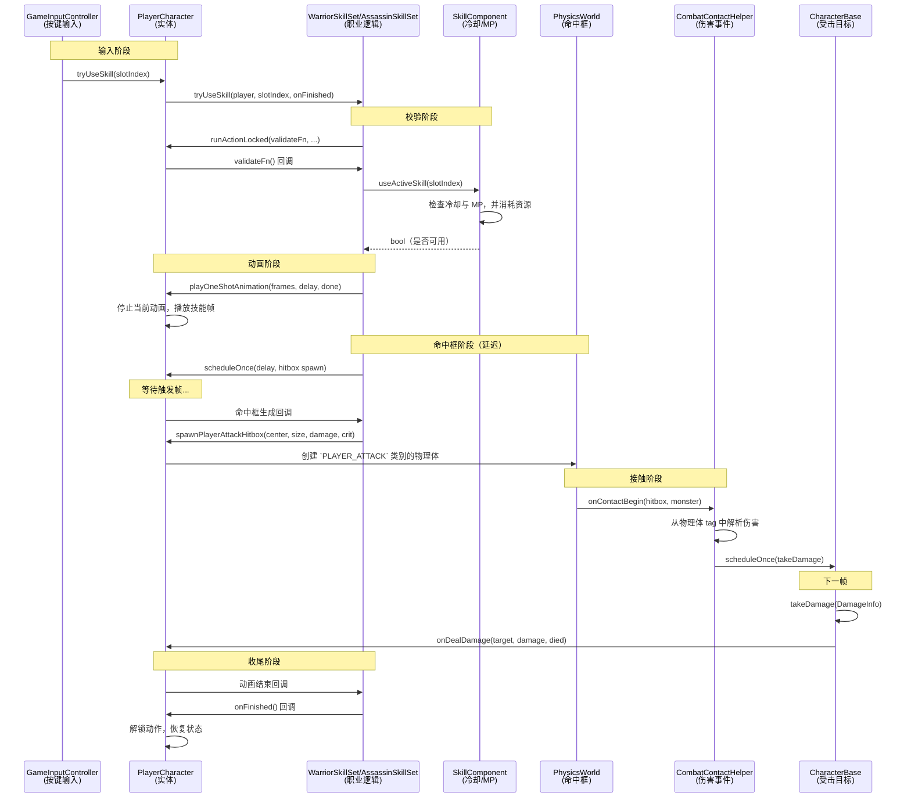
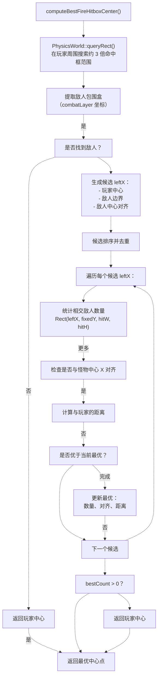
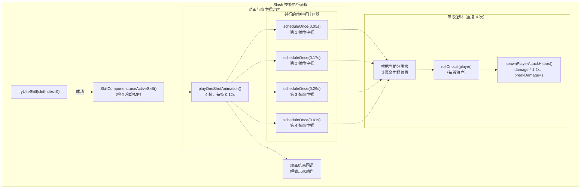
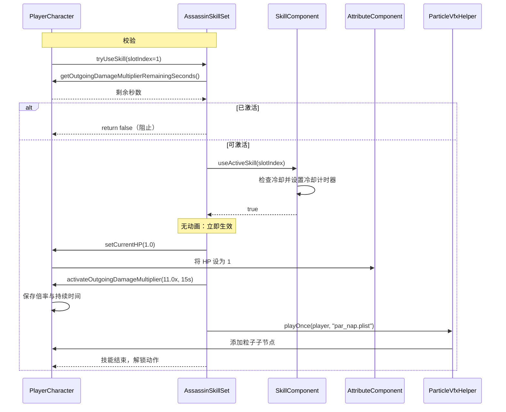
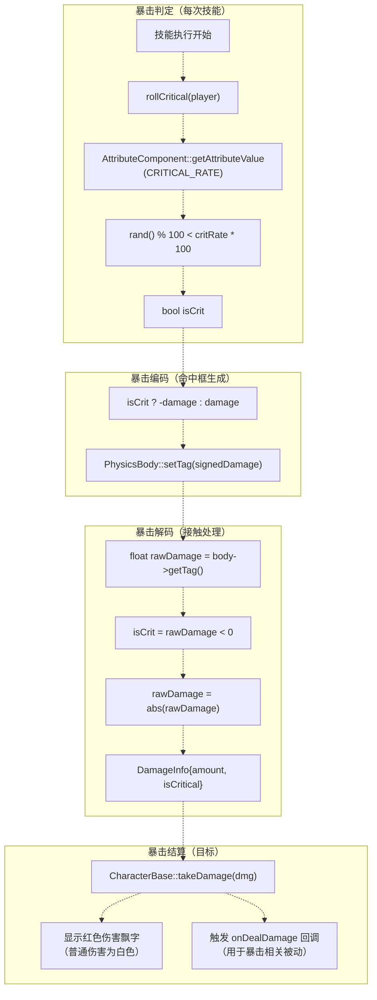
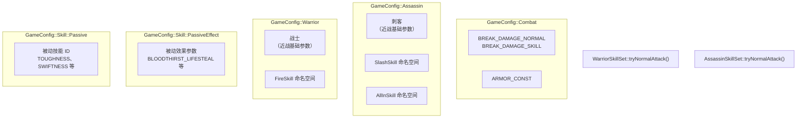

# 技能集实现

> **相关源文件**
> * [Adventure-King/Classes/Character/Player/SkillSets/AssassinSkillSet.cpp](https://github.com/lilong555/Adventure-King/blob/60df0f40/Adventure-King/Classes/Character/Player/SkillSets/AssassinSkillSet.cpp)
> * [Adventure-King/Classes/Character/Player/SkillSets/WarriorSkillSet.cpp](https://github.com/lilong555/Adventure-King/blob/60df0f40/Adventure-King/Classes/Character/Player/SkillSets/WarriorSkillSet.cpp)
> * [Adventure-King/Classes/Configs/GameConfig.h](https://github.com/lilong555/Adventure-King/blob/60df0f40/Adventure-King/Classes/Configs/GameConfig.h)
> * [Adventure-King/Classes/Scenes/CombatContactHelper.cpp](https://github.com/lilong555/Adventure-King/blob/60df0f40/Adventure-King/Classes/Scenes/CombatContactHelper.cpp)

## 目的与范围

本文详细说明玩家角色“职业技能系统”的实现方式。每个职业（Warrior、Assassin、Mage）都有专用的技能集类，用于实现普通攻击与主动技能，并包含各自独特的机制与命中框生成算法。

关于技能系统的整体架构（冷却管理、技能槽位等）请参见 [技能系统](<技能系统.md>)。关于技能参数配置请参见 [技能与装备配置](<技能与装备配置.md>)。关于伤害计算与战斗处理请参见 [伤害系统](<伤害系统.md>)。

---

## 技能集架构

### 概览

每个角色职业都会通过专用的技能集类来实现 `SkillSetInterface` 这套模式：

| 职业（Role） | 类（Class） | 文件（File） | 关键技能（Key Skills） |
| --- | --- | --- | --- |
| Warrior | `WarriorSkillSet` | `Classes/Character/Player/SkillSets/WarriorSkillSet.cpp` | 普攻（近战）、Fire（范围攻击） |
| Assassin | `AssassinSkillSet` | `Classes/Character/Player/SkillSets/AssassinSkillSet.cpp` | 普攻（近战）、Slash（多段）、All-In（增伤 Buff） |
| Mage | `MageSkillSet` | 相关文件未展示 | Bomb、Fireball |

每个技能集类都会提供三个关键方法：

* `initSkills()` - 注册并装备该职业的默认技能
* `tryNormalAttack()` - 执行该职业的普通攻击，并生成命中框
* `tryUseSkill()` - 按槽位索引触发主动技能，并实现职业特定机制

**来源：** [Adventure-King/Classes/Character/Player/SkillSets/WarriorSkillSet.cpp L261-L296](https://github.com/lilong555/Adventure-King/blob/60df0f40/Adventure-King/Classes/Character/Player/SkillSets/WarriorSkillSet.cpp#L261-L296)

 [Adventure-King/Classes/Character/Player/SkillSets/AssassinSkillSet.cpp L41-L85](https://github.com/lilong555/Adventure-King/blob/60df0f40/Adventure-King/Classes/Character/Player/SkillSets/AssassinSkillSet.cpp#L41-L85)

### 技能执行流程



**来源：** [Adventure-King/Classes/Character/Player/SkillSets/WarriorSkillSet.cpp L353-L468](https://github.com/lilong555/Adventure-King/blob/60df0f40/Adventure-King/Classes/Character/Player/SkillSets/WarriorSkillSet.cpp#L353-L468)

 [Adventure-King/Classes/Scenes/CombatContactHelper.cpp L163-L212](https://github.com/lilong555/Adventure-King/blob/60df0f40/Adventure-King/Classes/Scenes/CombatContactHelper.cpp#L163-L212)

---

## 战士技能集（Warrior）

### 普通攻击（近战）

战士的普通攻击会在角色前方生成一个短生命周期的近战命中框。命中框的尺寸与生成位置会根据战士当前的包围盒（bounding box）按比例计算出来。

**实现：** [Adventure-King/Classes/Character/Player/SkillSets/WarriorSkillSet.cpp L298-L351](https://github.com/lilong555/Adventure-King/blob/60df0f40/Adventure-King/Classes/Character/Player/SkillSets/WarriorSkillSet.cpp#L298-L351)

**配置参数：**

| 参数 | 配置键 | 值 | 用途 |
| --- | --- | --- | --- |
| 命中框宽度 | `HITBOX_WIDTH_RATIO` | 0.55 | 角色宽度的比例 |
| 命中框高度 | `HITBOX_HEIGHT_RATIO` | 0.75 | 角色高度的比例 |
| 水平偏移 | `HITBOX_OFFSET_X_RATIO` | 0.55 | 生成在角色前方的距离（按宽度比例） |
| 垂直偏移 | `HITBOX_OFFSET_Y` | 8.0 像素 | 固定向上抬升，用于更贴合挥击位置 |
| 命中框持续时间 | `HITBOX_LIFE_SECONDS` | 0.10s | 防止同一目标在窗口期内被重复命中 |
| 生成延迟 | `HITBOX_DELAY_SECONDS` | 0.05s | 与挥击动画对齐，让命中出现在“出手帧” |

**命中框计算逻辑：**

```javascript
// From WarriorSkillSet.cpp:318-330
const Rect box = player.getBoundingBox();
const float w = max(10.0f, box.width * HITBOX_WIDTH_RATIO);
const float h = max(10.0f, box.height * HITBOX_HEIGHT_RATIO);

const float dirX = player.isFlippedX() ? -1.0f : 1.0f;
const float cx = box.getMidX() + dirX * (box.width * HITBOX_OFFSET_X_RATIO);
const float cy = box.getMidY() + HITBOX_OFFSET_Y;

player.spawnPlayerAttackHitbox(Vec2(cx, cy), Size(w, h), damage, isCrit, 
                               HITBOX_LIFE_SECONDS, BREAK_DAMAGE_NORMAL);
```

**暴击判定：** 战士会在动画开始前先进行一次暴击概率判定 [WarriorSkillSet.cpp L300](https://github.com/lilong555/Adventure-King/blob/60df0f40/WarriorSkillSet.cpp#L300-L300)。

若判定成功，则以 `isCrit = true` 生成命中框；这会让伤害数字以红色显示，并可能触发“基于暴击”的被动效果。

**来源：** [Adventure-King/Classes/Character/Player/SkillSets/WarriorSkillSet.cpp L298-L351](https://github.com/lilong555/Adventure-King/blob/60df0f40/Adventure-King/Classes/Character/Player/SkillSets/WarriorSkillSet.cpp#L298-L351)

 [Adventure-King/Classes/Configs/GameConfig.h L364-L396](https://github.com/lilong555/Adventure-King/blob/60df0f40/Adventure-King/Classes/Configs/GameConfig.h#L364-L396)

### Fire 技能（智能 AoE）

Fire 技能是一个大范围的 AoE 攻击：它会“智能”选择命中框的位置，以尽可能覆盖更多敌人。与普通攻击固定在玩家前方不同，Fire 使用了一套更复杂的目标覆盖算法来决定命中框中心点。

**技能配置：**

| 参数 | 配置键 | 值 | 说明 |
| --- | --- | --- | --- |
| 技能 ID | `FIRE_ID` | 1004 | 唯一技能标识 |
| 冷却 | `FIRE_CD` | 1.0s | 冷却时长 |
| MP 消耗 | `FIRE_MP` | 0.0 | 法力消耗（占位） |
| 伤害倍率 | `DAMAGE_SCALE` | 1.0x | 对攻击力的倍率 |
| 破韧伤害 | `BREAK_DAMAGE` | 3 | 对 Boss 破韧条造成的伤害 |
| 槽位索引 | `SKILL_SLOT` | 0 | 默认绑定到 E/K 槽位 |
| 命中框宽度倍率 | `HITBOX_WIDTH_MULTIPLIER` | 2.0x | 基于角色宽度计算 |
| 命中框高度倍率 | `HITBOX_HEIGHT_MULTIPLIER` | 2.0x | 基于角色高度计算 |
| 命中触发帧 | `HIT_TRIGGER_FRAME_INDEX` | 3 | 在动画的第几帧生成命中框 |

**来源：** [Adventure-King/Classes/Configs/GameConfig.h L378-L395](https://github.com/lilong555/Adventure-King/blob/60df0f40/Adventure-King/Classes/Configs/GameConfig.h#L378-L395)

### Fire 命中框优化算法

Fire 技能会使用一个“一维优化”算法：在 X 轴上搜索/评估候选位置，把命中框放在“能命中最多敌人”的地方。该算法实现于 `computeBestFireHitboxCenter()` [WarriorSkillSet.cpp L99-L258](https://github.com/lilong555/Adventure-King/blob/60df0f40/WarriorSkillSet.cpp#L99-L258)。

**算法概览：**



**算法细节：**

1. **空间查询阶段（Spatial Query Phase）** [WarriorSkillSet.cpp L118-L156](https://github.com/lilong555/Adventure-King/blob/60df0f40/WarriorSkillSet.cpp#L118-L156)
   * 在玩家周围查询一个约为命中框尺寸 3 倍的区域
   * 过滤 `MONSTER` 类别（category）位掩码的物理体
   * 将敌人位置转换到 `combatLayer` 坐标系
   * 以 node 指针去重（同一敌人不会被重复计数）
2. **候选生成阶段（Candidate Generation Phase）** [WarriorSkillSet.cpp L163-L196](https://github.com/lilong555/Adventure-King/blob/60df0f40/WarriorSkillSet.cpp#L163-L196)
   * **基线候选（Baseline）：** 以“玩家中心 - 命中框半宽”为基础位置
   * **边界候选（Boundary）：** 对每个敌人区间 `[minX, maxX]`，加入 `minX - hitboxWidth` 与 `maxX`（覆盖变化发生的关键边界）
   * **对齐候选（Alignment）：** 对每个敌人中心 X，加入 `centerX - hitboxWidth/2`（让命中框中心对齐该敌人）
   * **边缘对齐候选：** `enemyMinX` 与 `enemyMaxX - hitboxWidth`（更直觉的“贴边”位置）
3. **选择阶段（Selection Phase）** [WarriorSkillSet.cpp L206-L250](https://github.com/lilong555/Adventure-King/blob/60df0f40/WarriorSkillSet.cpp#L206-L250)
   * 对每个候选位置统计相交的敌人数
   * **主判据：** 覆盖敌人数最多
   * **平手规则 1：** 优先选择“命中框中心 X 与某个怪物中心 X 对齐”（误差 1.0 像素内）
   * **平手规则 2：** 优先选择离玩家更近的位置（避免命中框“跳”到很远）
4. **坐标系处理（Coordinate System Handling）**
   * 算法在 `combatLayer` 坐标系中运行 [WarriorSkillSet.cpp L111](https://github.com/lilong555/Adventure-King/blob/60df0f40/WarriorSkillSet.cpp#L111-L111)
   * 使用 `getNodeAabbInLayer()` 辅助函数处理相机跟随与节点层级 [WarriorSkillSet.cpp L59-L91](https://github.com/lilong555/Adventure-King/blob/60df0f40/WarriorSkillSet.cpp#L59-L91)
   * 世界空间查询通过 `toWorldAabb()` 做坐标转换 [WarriorSkillSet.cpp L37-L57](https://github.com/lilong555/Adventure-King/blob/60df0f40/WarriorSkillSet.cpp#L37-L57)

**假设与限制：**

该算法将命中框的 Y 坐标固定为玩家的垂直中心 [WarriorSkillSet.cpp L171](https://github.com/lilong555/Adventure-King/blob/60df0f40/WarriorSkillSet.cpp#L171-L171)。

代码注释中明确说明了这样做的理由：

> "当前算法仅在 X 轴上做一维搜索，Y 固定在玩家中心。设计假设是'敌人基本与玩家处于同一高度'，适用于多数近战地面怪物场景。如果后续关卡或怪物设计引入明显的高度差（高台怪物/飞行怪物等），需要重新审视这里的逻辑..."

这段注释的含义是：当前算法只在一维（X 轴）上搜索，Y 固定为玩家中心；设计假设“敌人大多与玩家处于同一高度”，因此适用于多数近战地面怪物场景。若后续关卡出现明显高度差（高台怪物/飞行怪物等），则需要重新审视这里的逻辑。

**特效集成：**

当命中框生成时，会在命中框底部中心播放粒子特效（`Particle/par_fire.plist`）[WarriorSkillSet.cpp L427-L435](https://github.com/lilong555/Adventure-King/blob/60df0f40/WarriorSkillSet.cpp#L427-L435)。

该特效挂载在 `combatLayer` 上，而不是挂在命中框节点本身，以确保即使命中框提前销毁，特效也能完整播放完毕。

**来源：** [Adventure-King/Classes/Character/Player/SkillSets/WarriorSkillSet.cpp L99-L258](https://github.com/lilong555/Adventure-King/blob/60df0f40/Adventure-King/Classes/Character/Player/SkillSets/WarriorSkillSet.cpp#L99-L258)

 [Adventure-King/Classes/Character/Player/SkillSets/WarriorSkillSet.cpp L353-L468](https://github.com/lilong555/Adventure-King/blob/60df0f40/Adventure-King/Classes/Character/Player/SkillSets/WarriorSkillSet.cpp#L353-L468)

---

## 刺客技能集（Assassin）

### 普通攻击（近战）

刺客的普通攻击使用比战士更“紧”的命中框参数，以体现更快、更精准的战斗风格。

**命中框配置：**

| 参数 | 值 | 与战士对比 |
| --- | --- | --- |
| 宽度比例 | 0.45（战士 0.55） | 宽度更窄约 18% |
| 高度比例 | 0.65（战士 0.75） | 高度更短约 13% |
| X 偏移比例 | 0.50（战士 0.55） | 略微更靠近角色本体 |
| 持续时间 | 0.08s（战士 0.10s） | 命中窗口更短约 20% |
| 生成延迟 | 0.03s（战士 0.05s） | 更快生效 |

刺客的普攻伤害也略低一些：`player.getAttackPower() * 0.9f` [AssassinSkillSet.cpp L104](https://github.com/lilong555/Adventure-King/blob/60df0f40/AssassinSkillSet.cpp#L104-L104)。

代码中对应注释为“刺客伤害略低于战士（占位）”，表示这是一个临时/可调的平衡设定。

**来源：** [Adventure-King/Classes/Character/Player/SkillSets/AssassinSkillSet.cpp L17-L39](https://github.com/lilong555/Adventure-King/blob/60df0f40/Adventure-King/Classes/Character/Player/SkillSets/AssassinSkillSet.cpp#L17-L39)

 [Adventure-King/Classes/Character/Player/SkillSets/AssassinSkillSet.cpp L87-L138](https://github.com/lilong555/Adventure-King/blob/60df0f40/Adventure-King/Classes/Character/Player/SkillSets/AssassinSkillSet.cpp#L87-L138)

### Slash 技能（多段顺序命中）

Slash 技能是一段 4 帧的连段：它会在**每一帧**都生成一次命中框，因此总共造成 4 次独立伤害，并且每段伤害都独立进行暴击判定。

**技能配置：**

| 参数 | 配置键 | 值 |
| --- | --- | --- |
| 技能 ID | `SLASH_ID` | 1003 |
| 冷却 | `SLASH_CD` | 0.8s |
| MP 消耗 | `SLASH_MP` | 0.0（无消耗） |
| 伤害倍率 | `DAMAGE_SCALE` | 1.2x |
| 每段破韧伤害 | `BREAK_DAMAGE_PER_HIT` | 1（完整技能总计 4） |
| 帧延迟 | `CAST_ANIM_FRAME_DELAY` | 0.12s |
| 命中框延迟 | `HITBOX_DELAY_SECONDS` | 0.05s |
| 命中框持续时间 | `HITBOX_LIFE_SECONDS` | 0.10s |

**多段命中实现：**



**关键实现细节：**

1. **命中框对齐到动画帧：** 通过 4 个不同延迟的 `scheduleOnce()` 回调来生成 4 次命中框 [AssassinSkillSet.cpp L256-L289](https://github.com/lilong555/Adventure-King/blob/60df0f40/AssassinSkillSet.cpp#L256-L289)。每次回调触发时都会读取玩家“当前”的包围盒，因此即使动画过程中玩家移动/转向，命中框也会跟随当前位置。
2. **每段独立暴击：** 4 段伤害分别进行暴击判定 [AssassinSkillSet.cpp L279](https://github.com/lilong555/Adventure-King/blob/60df0f40/AssassinSkillSet.cpp#L279-L279)：`const bool isCrit = rollCritical(player);`（注释写明“斩击每段都允许暴击：每段独立按暴击率判定”）。
3. **时序计算：** 第 N 段命中延迟 `= HITBOX_DELAY_SECONDS + CAST_ANIM_FRAME_DELAY * (N - 1)`；因此 4 段分别为 0.05s / 0.17s / 0.29s / 0.41s [AssassinSkillSet.cpp L258-L259](https://github.com/lilong555/Adventure-King/blob/60df0f40/AssassinSkillSet.cpp#L258-L259)。
4. **资源加载：** 动画帧路径使用 `{skillDir}/spr_{characterKey}_slash_{1-4}.png` 的模式 [AssassinSkillSet.cpp L234-L237](https://github.com/lilong555/Adventure-King/blob/60df0f40/AssassinSkillSet.cpp#L234-L237)，从而支持按角色 key 做差异化贴图。

**来源：** [Adventure-King/Classes/Character/Player/SkillSets/AssassinSkillSet.cpp L141-L310](https://github.com/lilong555/Adventure-King/blob/60df0f40/Adventure-King/Classes/Character/Player/SkillSets/AssassinSkillSet.cpp#L141-L310)

 [Adventure-King/Classes/Configs/GameConfig.h L318-L362](https://github.com/lilong555/Adventure-King/blob/60df0f40/Adventure-King/Classes/Configs/GameConfig.h#L318-L362)

### All-In 技能（伤害增益）

All-In 技能属于高风险高收益：施放后会牺牲 HP，换取巨额的伤害倍率增益。与多数技能不同，它没有施法动画，主要表现为立即修改属性并播放提示特效。

**技能配置：**

| 参数 | 配置键 | 值 | 效果 |
| --- | --- | --- | --- |
| 技能 ID | `ALL_IN_ID` | 1005 | 唯一标识 |
| 持续时间 | `ALL_IN_DURATION` | 15.0s | Buff 持续时长 |
| 冷却 | `ALL_IN_CD` | 15.0s | 与持续时间一致（不允许叠加） |
| MP 消耗 | `ALL_IN_MP` | 0.0 | 无资源消耗 |
| 伤害倍率 | `DAMAGE_MULTIPLIER` | 11.0x | 伤害提升 1000%（即总计 1100%） |
| 施放后 HP | `MIN_HP_AFTER_CAST` | 1.0 | 施放后强制保留 1 点 HP |
| 破韧伤害 | `BREAK_DAMAGE` | 0 | 不对破韧条造成伤害 |
| 触发特效 | `VFX_PLIST` | `Particle/par_nap.plist` | 施放瞬间特效 |
| 持续特效 | `KEEP_VFX_PLIST` | `Particle/par_nap_keep.plist` | 持续期间特效（当前未使用） |

**执行流程：**



**实现细节：**

1. **禁止重复施放：** 通过检查 `player.getOutgoingDamageMultiplierRemainingSeconds() > 0.0f` 来阻止叠加/刷新 Buff [AssassinSkillSet.cpp L166-L170](https://github.com/lilong555/Adventure-King/blob/60df0f40/AssassinSkillSet.cpp#L166-L170)。若已激活，会打印 `"AssassinSkillSet: all-in already active"` 并直接返回失败。
2. **无动画阶段：** 与多数技能不同，该技能的动作函数会立即调用 `done()` 回调 [AssassinSkillSet.cpp L179-L185](https://github.com/lilong555/Adventure-King/blob/60df0f40/AssassinSkillSet.cpp#L179-L185)，不播放施法动画。
3. **直接改 HP：** 通过直接设置 HP（而不是“造成伤害”）来达到扣血效果，从而避免触发死亡判定与伤害飘字 [AssassinSkillSet.cpp L190](https://github.com/lilong555/Adventure-King/blob/60df0f40/AssassinSkillSet.cpp#L190-L190)。
4. **倍率应用方式：** 倍率保存在 `PlayerCharacter` 的状态中，并在持续时间内自动作用于所有对外造成的伤害（普攻、技能、投射物等）。
5. **粒子特效：** 使用 `PositionType::GROUPED` 且 `useBodyCenter = true` [AssassinSkillSet.cpp L196-L197](https://github.com/lilong555/Adventure-King/blob/60df0f40/AssassinSkillSet.cpp#L196-L197)，把粒子挂在玩家中心位置，特效持续期间会随角色移动。

**来源：** [Adventure-King/Classes/Character/Player/SkillSets/AssassinSkillSet.cpp L160-L214](https://github.com/lilong555/Adventure-King/blob/60df0f40/Adventure-King/Classes/Character/Player/SkillSets/AssassinSkillSet.cpp#L160-L214)

 [Adventure-King/Classes/Configs/GameConfig.h L343-L361](https://github.com/lilong555/Adventure-King/blob/60df0f40/Adventure-King/Classes/Configs/GameConfig.h#L343-L361)

---

## 命中框生成与伤害流程

### 命中框生成模式

所有技能集在生成攻击命中框时遵循一套通用模式：最终都委托给 `PlayerCharacter::spawnPlayerAttackHitbox()` 来创建命中框节点与物理体。

**方法签名：**

```javascript
void spawnPlayerAttackHitbox(const Vec2& worldCenter,
                             const Size& size,
                             float damage,
                             bool isCritical,
                             float lifetimeSeconds,
                             int breakDamage);
```

**命中框属性：**

| 属性 | 编码方式 | 用途 |
| --- | --- | --- |
| 伤害数值 | 物理体 tag | 以正数存普通伤害，以负数存暴击伤害 |
| 暴击标记 | tag 的正负号 | `tag < 0` 表示暴击 |
| 破韧伤害 | 节点 tag | 存在命中框节点自身的 tag 上，由接触回调读取 |
| Category | 位掩码 | `GamePhysicsCategory::PLAYER_ATTACK` |
| Collision Mask | 位掩码 | 只与 `MONSTER` 类别发生碰撞 |
| 生命周期 | 定时删除 | 通过 `scheduleOnce()` 在持续时间后移除节点 |

**编码示例：**

```
// Normal hit: damage = 120.0, critical = false
body->setTag(120);  // Positive tag

// Critical hit: damage = 120.0, critical = true
body->setTag(-120);  // Negative tag

// Break damage stored separately on node
hitboxNode->setTag(breakDamage);  // e.g., 3 for Fire skill
```

**来源：** [Adventure-King/Classes/Scenes/CombatContactHelper.cpp L175-L191](https://github.com/lilong555/Adventure-King/blob/60df0f40/Adventure-King/Classes/Scenes/CombatContactHelper.cpp#L175-L191)

### 接触处理

当玩家攻击命中框与怪物发生碰撞时，`CombatContactHelper::handleContactBegin()` 会解析命中框携带的伤害信息，并把“真正的扣血/结算”延迟到下一帧执行。

**伤害解析：** [CombatContactHelper.cpp L175-L191](https://github.com/lilong555/Adventure-King/blob/60df0f40/CombatContactHelper.cpp#L175-L191)

```javascript
float rawDamage = static_cast<float>(attackBody->getTag());
const bool isCrit = rawDamage < 0.0f;  // Negative = critical
rawDamage = std::fabs(rawDamage);      // Convert to positive

DamageInfo dmg{};
dmg.amount = rawDamage;
dmg.attacker = player;
dmg.isCritical = isCrit;
dmg.breakDamage = std::max(0, attackNode->getTag());  // Node tag = break damage
```

**延迟执行模式：**

伤害不会在物理回调（contact callback）里立刻结算，而是用带唯一 key 的 `scheduleOnce()` 推迟到下一帧执行 [CombatContactHelper.cpp L193-L209](https://github.com/lilong555/Adventure-King/blob/60df0f40/CombatContactHelper.cpp#L193-L209)。

:

```cpp
std::string key = StringUtils::format("defer_player_dmg_%p_%p",
                                      static_cast<void*>(attackBody),
                                      static_cast<void*>(monster));
if (!monster->isScheduled(key))
{
    monster->scheduleOnce(
        [monster, dmg](float)
        {
            if (!monster || monster->isDead()) return;
            monster->takeDamage(dmg);
        },
        0.0f,
        key);
}
```

**原因：** 物理接触回调发生在 `PhysicsWorld::step()` 内部；在这个阶段修改场景树（例如删除节点、切换状态、触发复杂逻辑）有概率导致崩溃。采用“延迟到下一帧”的模式，可以保证所有场景变更都发生在物理 step 之外。

**去重机制：** 通过检查 `!monster->isScheduled(key)`，可以避免同一对碰撞体在短时间内被物理系统多次触发时重复结算伤害 [CombatContactHelper.cpp L108-L121](https://github.com/lilong555/Adventure-King/blob/60df0f40/CombatContactHelper.cpp#L108-L121)。

**来源：** [Adventure-King/Classes/Scenes/CombatContactHelper.cpp L163-L212](https://github.com/lilong555/Adventure-King/blob/60df0f40/Adventure-King/Classes/Scenes/CombatContactHelper.cpp#L163-L212)

### 暴击实现



**辅助函数：** [WarriorSkillSet.cpp L24-L35](https://github.com/lilong555/Adventure-King/blob/60df0f40/WarriorSkillSet.cpp#L24-L35)

 [AssassinSkillSet.cpp L27-L38](https://github.com/lilong555/Adventure-King/blob/60df0f40/AssassinSkillSet.cpp#L27-L38)

```cpp
bool rollCritical(PlayerCharacter& player)
{
    auto attr = player.getAttributeComponent();
    if (!attr) return false;
    
    float critRate = attr->getAttributeValue(AttributeType::CRITICAL_RATE);
    float critPercent = std::max(0.0f, std::min(critRate * 100.0f, 100.0f));
    return (rand() % 100) < static_cast<int>(critPercent);
}
```

**来源：** [Adventure-King/Classes/Character/Player/SkillSets/WarriorSkillSet.cpp L24-L35](https://github.com/lilong555/Adventure-King/blob/60df0f40/Adventure-King/Classes/Character/Player/SkillSets/WarriorSkillSet.cpp#L24-L35)

 [Adventure-King/Classes/Scenes/CombatContactHelper.cpp L175-L191](https://github.com/lilong555/Adventure-King/blob/60df0f40/Adventure-King/Classes/Scenes/CombatContactHelper.cpp#L175-L191)

---

## 配置集成

所有技能参数都集中在 `GameConfig.h` 中管理，从而可以在不改动技能逻辑代码的前提下快速进行数值平衡调整。

### 配置命名空间结构



### 战士配置表

| 分类 | 参数 | 配置路径 | 值 |
| --- | --- | --- | --- |
| **近战基础（Melee Base）** | 宽度比例 | `Warrior::HITBOX_WIDTH_RATIO` | 0.55 |
|  | 高度比例 | `Warrior::HITBOX_HEIGHT_RATIO` | 0.75 |
|  | X 偏移比例 | `Warrior::HITBOX_OFFSET_X_RATIO` | 0.55 |
|  | Y 偏移 | `Warrior::HITBOX_OFFSET_Y` | 8.0 |
|  | 命中框生命周期 | `Warrior::HITBOX_LIFE_SECONDS` | 0.10 |
|  | 生成延迟 | `Warrior::HITBOX_DELAY_SECONDS` | 0.05 |
| **Fire 技能（Fire Skill）** | 技能 ID | `FireSkill::FIRE_ID` | 1004 |
|  | 冷却 | `FireSkill::FIRE_CD` | 1.0s |
|  | MP 消耗 | `FireSkill::FIRE_MP` | 0.0 |
|  | 伤害倍率 | `FireSkill::DAMAGE_SCALE` | 1.0x |
|  | 破韧伤害 | `FireSkill::BREAK_DAMAGE` | 3 |
|  | 宽度倍率 | `FireSkill::HITBOX_WIDTH_MULTIPLIER` | 2.0x |
|  | 高度倍率 | `FireSkill::HITBOX_HEIGHT_MULTIPLIER` | 2.0x |
|  | 触发帧 | `FireSkill::HIT_TRIGGER_FRAME_INDEX` | 3 |
|  | 帧延迟 | `FireSkill::CAST_ANIM_FRAME_DELAY` | 0.12s |

**来源：** [Adventure-King/Classes/Configs/GameConfig.h L364-L396](https://github.com/lilong555/Adventure-King/blob/60df0f40/Adventure-King/Classes/Configs/GameConfig.h#L364-L396)

### 刺客配置表

| 分类 | 参数 | 配置路径 | 值 |
| --- | --- | --- | --- |
| **Slash 技能（Slash Skill）** | 技能 ID | `SlashSkill::SLASH_ID` | 1003 |
|  | 冷却 | `SlashSkill::SLASH_CD` | 0.8s |
|  | MP 消耗 | `SlashSkill::SLASH_MP` | 0.0 |
|  | 伤害倍率 | `SlashSkill::DAMAGE_SCALE` | 1.2x |
|  | 每段破韧 | `SlashSkill::BREAK_DAMAGE_PER_HIT` | 1 |
|  | 帧延迟 | `SlashSkill::CAST_ANIM_FRAME_DELAY` | 0.12s |
|  | 命中框生命周期 | `SlashSkill::HITBOX_LIFE_SECONDS` | 0.10s |
|  | 命中框延迟 | `SlashSkill::HITBOX_DELAY_SECONDS` | 0.05s |
|  | 宽度比例 | `SlashSkill::HITBOX_WIDTH_RATIO` | 0.60 |
|  | 高度比例 | `SlashSkill::HITBOX_HEIGHT_RATIO` | 0.70 |
|  | X 偏移比例 | `SlashSkill::HITBOX_OFFSET_X_RATIO` | 0.35 |
|  | Y 偏移 | `SlashSkill::HITBOX_OFFSET_Y` | 6.0 |
| **All-In 技能（All-In Skill）** | 技能 ID | `AllInSkill::ALL_IN_ID` | 1005 |
|  | 持续时间 | `AllInSkill::ALL_IN_DURATION` | 15.0s |
|  | 冷却 | `AllInSkill::ALL_IN_CD` | 15.0s |
|  | MP 消耗 | `AllInSkill::ALL_IN_MP` | 0.0 |
|  | 伤害倍率 | `AllInSkill::DAMAGE_MULTIPLIER` | 11.0x |
|  | 施放后 HP | `AllInSkill::MIN_HP_AFTER_CAST` | 1.0 |
|  | 破韧伤害 | `AllInSkill::BREAK_DAMAGE` | 0 |
|  | 触发特效 | `AllInSkill::VFX_PLIST` | `Particle/par_nap.plist` |

**来源：** [Adventure-King/Classes/Configs/GameConfig.h L318-L362](https://github.com/lilong555/Adventure-King/blob/60df0f40/Adventure-King/Classes/Configs/GameConfig.h#L318-L362)

---

## 总结

技能集系统体现了若干架构模式与工程实践：

1. **基于职业的多态：** 每个职业实现独立的技能集类，并承载差异化机制（AoE 选点、多段命中、增益 Buff 等）。
2. **配置驱动：** 所有数值参数外置到 `GameConfig.h`，使得平衡迭代不需要改代码。
3. **伤害延迟结算：** 物理接触回调将伤害推迟到下一帧执行，避免在物理模拟过程中修改场景树。
4. **基于 Tag 的编码：** 暴击与破韧伤害用物理体/节点 tag 编码，减少每个命中框需要携带的数据结构。
5. **命中框对齐动画帧：** 多段技能通过与动画帧同步的 `scheduleOnce()` 回调生成命中框，并读取实时位置以支持动画中移动。
6. **空间优化：** Fire 技能的选点算法展示了一维边界枚举与多重判据（含平手规则）的智能命中框放置策略。

**来源：** 汇总自本页上述各节。
