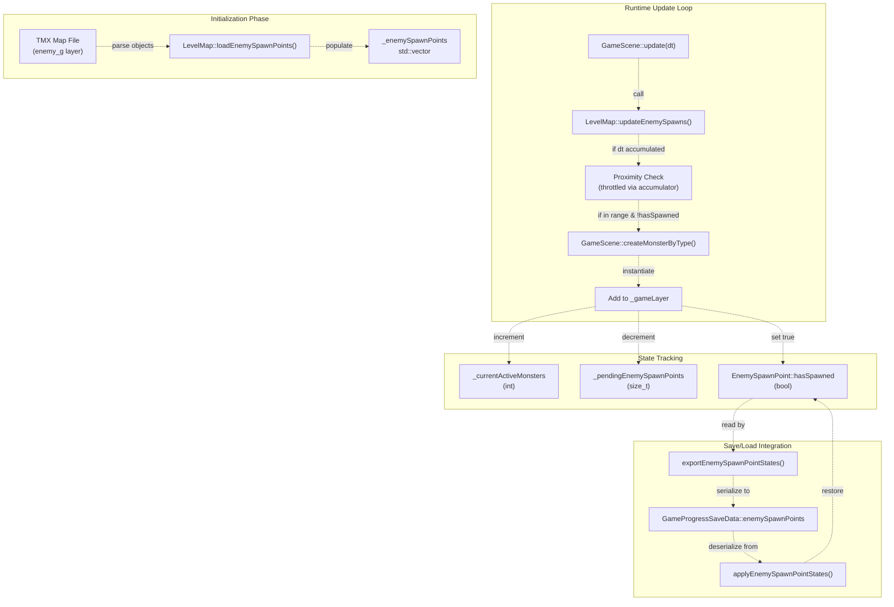
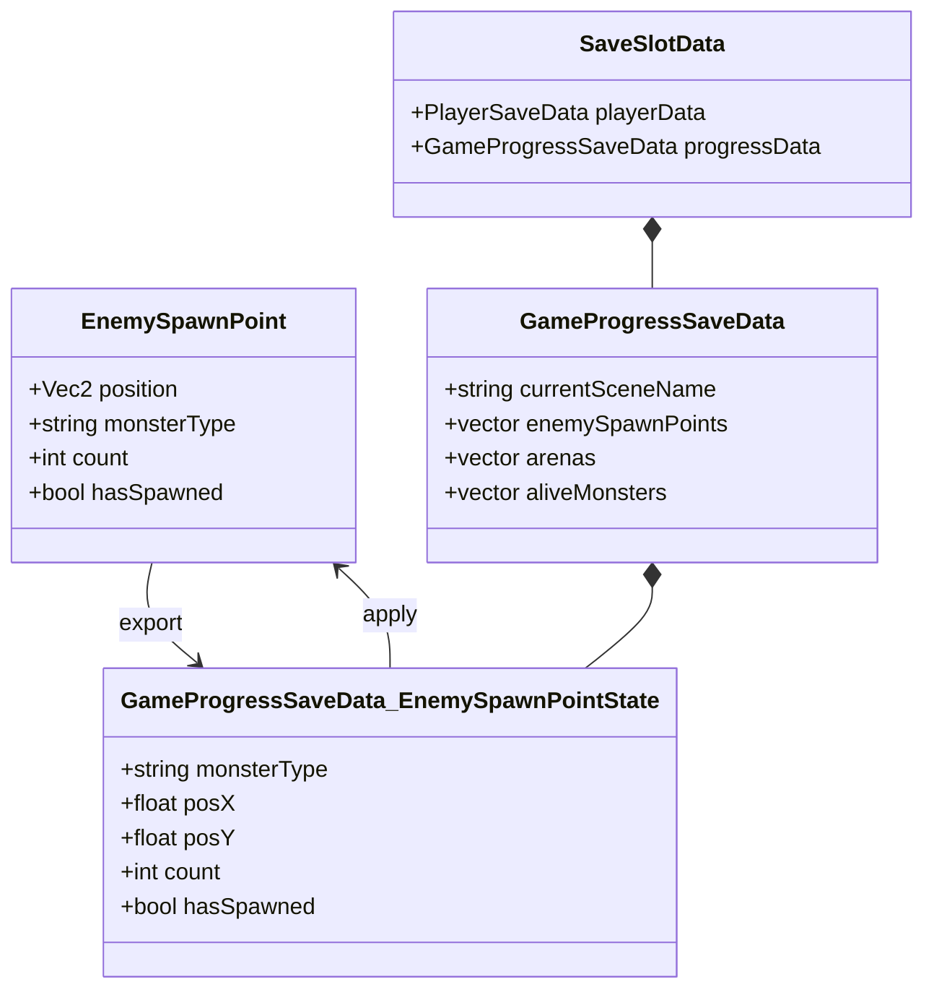

# Enemy Spawn System（敌人生成系统）

> **相关源文件**
> * [Adventure-King/Classes/Save/JsonSerializer.cpp](https://github.com/lilong555/Adventure-King/blob/60df0f40/Adventure-King/Classes/Save/JsonSerializer.cpp)
> * [Adventure-King/Classes/Save/SaveData.h](https://github.com/lilong555/Adventure-King/blob/60df0f40/Adventure-King/Classes/Save/SaveData.h)
> * [Adventure-King/Classes/Save/SaveManager.cpp](https://github.com/lilong555/Adventure-King/blob/60df0f40/Adventure-King/Classes/Save/SaveManager.cpp)
> * [Adventure-King/Classes/Scenes/DebugScene.cpp](https://github.com/lilong555/Adventure-King/blob/60df0f40/Adventure-King/Classes/Scenes/DebugScene.cpp)
> * [Adventure-King/Classes/Scenes/DebugScene.h](https://github.com/lilong555/Adventure-King/blob/60df0f40/Adventure-King/Classes/Scenes/DebugScene.h)
> * [Adventure-King/Classes/Scenes/GameScene.cpp](https://github.com/lilong555/Adventure-King/blob/60df0f40/Adventure-King/Classes/Scenes/GameScene.cpp)
> * [Adventure-King/Classes/Scenes/GameScene.h](https://github.com/lilong555/Adventure-King/blob/60df0f40/Adventure-King/Classes/Scenes/GameScene.h)
> * [Adventure-King/Classes/Scenes/LevelMap.cpp](https://github.com/lilong555/Adventure-King/blob/60df0f40/Adventure-King/Classes/Scenes/LevelMap.cpp)
> * [Adventure-King/Classes/Scenes/LevelMap.h](https://github.com/lilong555/Adventure-King/blob/60df0f40/Adventure-King/Classes/Scenes/LevelMap.h)
> * [Adventure-King/proj.win32/Adventure-King.vcxproj](https://github.com/lilong555/Adventure-King/blob/60df0f40/Adventure-King/proj.win32/Adventure-King.vcxproj)
> * [Adventure-King/proj.win32/Adventure-King.vcxproj.filters](https://github.com/lilong555/Adventure-King/blob/60df0f40/Adventure-King/proj.win32/Adventure-King.vcxproj.filters)

## 目的与范围

本页记录由 `LevelMap` 管理的“敌人生成点系统”。该系统负责从 TMX 地图中预先配置的位置，基于玩家距离生成普通敌人，主要职责包括：

* 从 Tiled 对象层加载生成点定义
* 当玩家靠近生成点时触发怪物创建
* 跟踪哪些生成点已被激活（避免重复生成）
* 在存/读档间持久化生成状态
* 参与关卡完成判定

关于“带关门锁定的竞技场波次生成”，请参见 [Arena Combat System](<竞技场战斗系统.md>)。关于底层 TMX 加载基础设施，请参见 [TMX Loading and Collision](<TMX 加载与碰撞.md>)。

---

## 系统概览

敌人生成系统采用拉取式模型：`GameScene::update()` 每帧调用 `LevelMap::updateEnemySpawns()` 并传入玩家位置；`LevelMap` 内部用 `ENEMY_SPAWN_CHECK_INTERVAL_SECONDS` 定义的间隔做节流检查。当玩家进入某个“尚未生成”的生成点的水平视距内时，`LevelMap` 会调用 `GameScene` 提供的怪物创建回调，实例化对应的 `MonsterBase` 子类，并把它注册到全局怪物计数器中。



**来源**：[Adventure-King/Classes/Scenes/LevelMap.cpp L508-L721](https://github.com/lilong555/Adventure-King/blob/60df0f40/Adventure-King/Classes/Scenes/LevelMap.cpp#L508-L721)

 [Adventure-King/Classes/Scenes/GameScene.cpp L916-L924](https://github.com/l…10848 chars truncated…nemySpawnPoints == 0`)
3. 所有竞技场序列都已完成（参见 [Arena Combat System](<竞技场战斗系统.md>)）

**来源**：[Adventure-King/Classes/Scenes/LevelMap.cpp L449-L468](https://github.com/lilong555/Adventure-King/blob/60df0f40/Adventure-King/Classes/Scenes/LevelMap.cpp#L449-L468)

 [Adventure-King/Classes/Scenes/LevelMap.cpp L470-L507](https://github.com/lilong555/Adventure-King/blob/60df0f40/Adventure-King/Classes/Scenes/LevelMap.cpp#L470-L507)

---

## 存/读档集成

### 状态序列化

`exportEnemySpawnPointStates()` 会捕获生成点状态用于持久化：



### 状态恢复

读档时，`applyEnemySpawnPointStates()` 会基于“坐标匹配”来恢复：

1. 对每一条保存的生成点状态：
   * 在 `_enemySpawnPoints` 里查找 `monsterType` 与位置匹配的点（允许 1px 误差）
   * 若找到，则恢复 `hasSpawned` 标记并调整 `_pendingEnemySpawnPoints` 计数
   * 若找不到，则打印 TMX 与存档不匹配的告警日志

该方式能较好地容忍轻微 TMX 编辑，同时也能检测出较大的地图结构变更。

### 防止初始化时重复生成

在 `GameScene::initWithPhysicsConfig()` 中，状态恢复发生在第一次 `updateEnemySpawns()` 调用之前，用于避免玩家出生点靠近生成点时出现“双重生成”：

```
initLevelMap() → loadEnemySpawnPoints() → ... → [restore state] → updateEnemySpawns()
```

**来源**：[Adventure-King/Classes/Scenes/LevelMap.cpp L723-L782](https://github.com/lilong555/Adventure-King/blob/60df0f40/Adventure-King/Classes/Scenes/LevelMap.cpp#L723-L782)

 [Adventure-King/Classes/Scenes/GameScene.cpp L198-L318](https://github.com/lilong555/Adventure-King/blob/60df0f40/Adventure-King/Classes/Scenes/GameScene.cpp#L198-L318)

 [Adventure-King/Classes/Save/SaveData.h L125-L133](https://github.com/lilong555/Adventure-King/blob/60df0f40/Adventure-King/Classes/Save/SaveData.h#L125-L133)

---

## 性能优化

### 优化策略

| 优化点 | 实现方式 | 影响 |
| --- | --- | --- |
| **节流检查** | Accumulator 模式，`ENEMY_SPAWN_CHECK_INTERVAL_SECONDS = 0.2f` | CPU 下降约 80%（5 次/秒 vs 60 次/秒） |
| **待生成计数器** | `_pendingEnemySpawnPoints` 提前退出 | 当所有生成点已触发时跳过遍历 |
| **hasSpawned 跳过** | 距离计算前先检查标记 | 避免重复的距离计算 |
| **仅水平距离** | `std::fabs(x1 - x2)` 替代 `Vec2::distance()` | 避免 sqrt() 调用 |

### 算法复杂度

* **最坏情况（全部未触发）：** 每次节流检查为 O(n)，n 为生成点总数
* **平均情况（部分已触发）：** 每次检查为 O(m)，m 为剩余未触发点
* **最好情况（全部已触发）：** 通过提前退出达到 O(1)，见行 [Adventure-King/Classes/Scenes/LevelMap.cpp L618-L622](https://github.com/lilong555/Adventure-King/blob/60df0f40/Adventure-King/Classes/Scenes/LevelMap.cpp#L618-L622)

对典型关卡（10-30 个生成点、0.2s 检查间隔）而言，均摊到每帧的成本可忽略（< 0.1ms）。

**来源**：[Adventure-King/Classes/Scenes/LevelMap.cpp L597-L622](https://github.com/lilong555/Adventure-King/blob/60df0f40/Adventure-King/Classes/Scenes/LevelMap.cpp#L597-L622)

 [Adventure-King/Classes/Configs/GameConfig.h](https://github.com/lilong555/Adventure-King/blob/60df0f40/Adventure-King/Classes/Configs/GameConfig.h)

（关于 `ENEMY_SPAWN_CHECK_INTERVAL_SECONDS`）

---

## 相关系统

* 竞技场波次战斗与关门锁定：见 [Arena Combat System](<竞技场战斗系统.md>)
* TMX 结构与碰撞加载：见 [TMX Loading and Collision](<TMX 加载与碰撞.md>)
* 生成后的怪物 AI 与战斗行为：见 [Monster AI and Behavior](<怪物 AI 与行为.md>)
* 存/读档架构：见 [Save and Load Flow](<存取档流程.md>)
