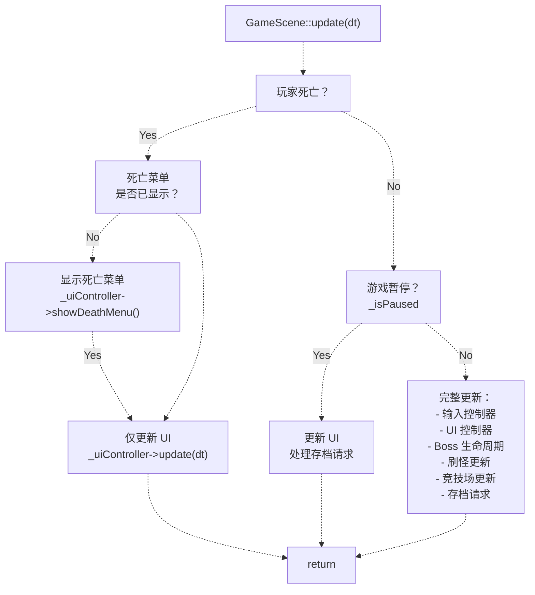
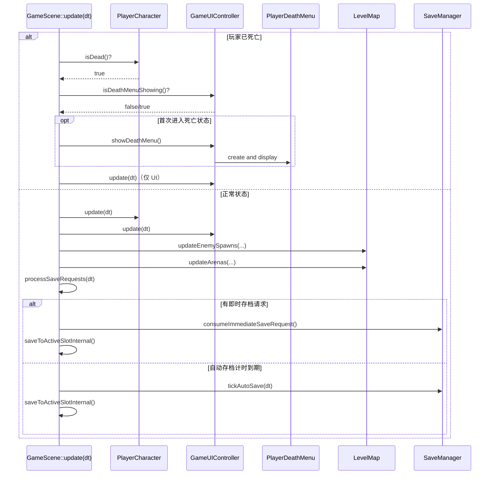
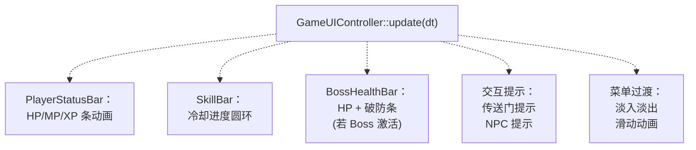
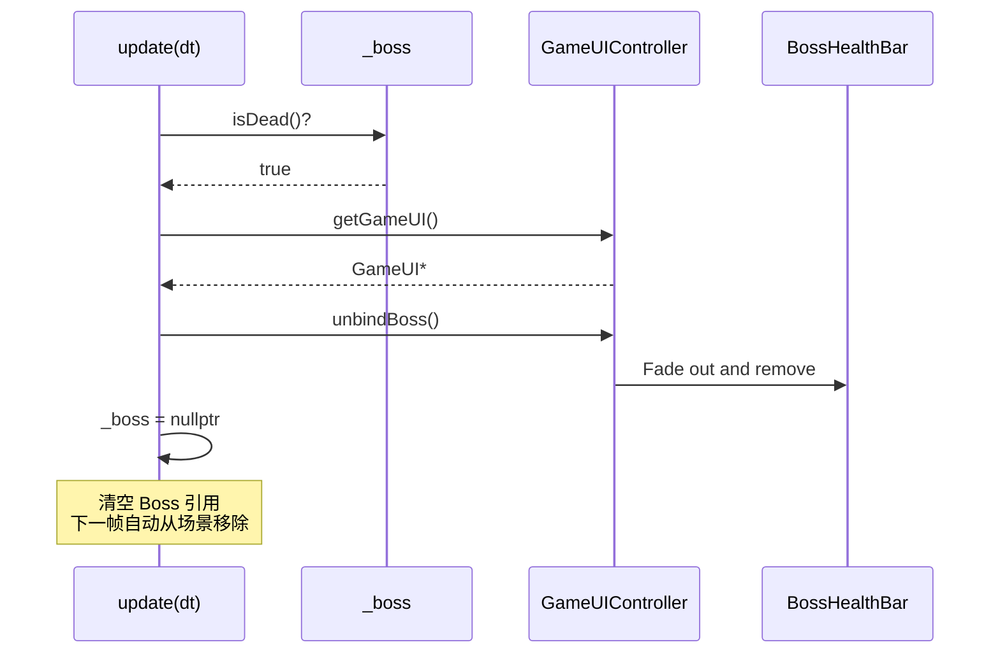
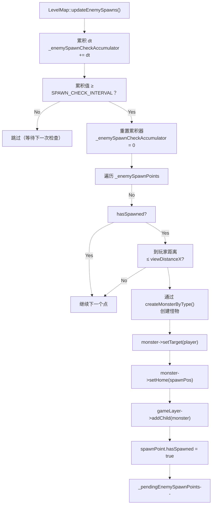
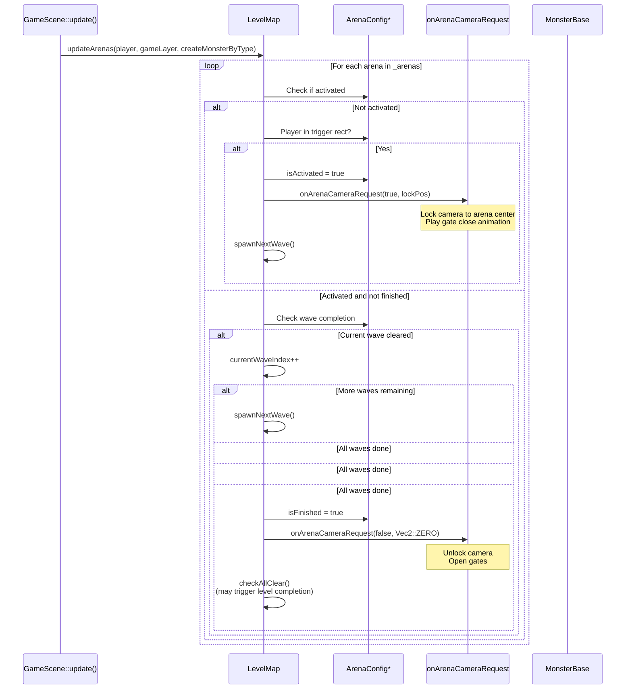
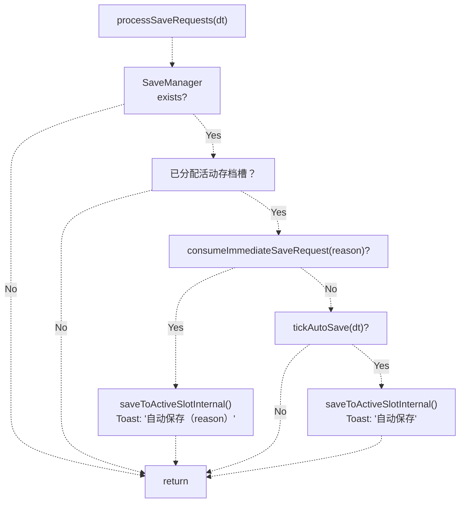
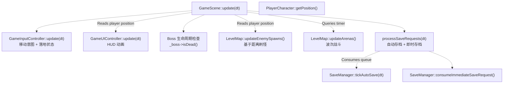

# 更新循环与运行时逻辑（Update Loop and Runtime Logic）

> **相关源文件**
> * [Adventure-King/Classes/Save/JsonSerializer.cpp](https://github.com/lilong555/Adventure-King/blob/60df0f40/Adventure-King/Classes/Save/JsonSerializer.cpp)
> * [Adventure-King/Classes/Save/SaveData.h](https://github.com/lilong555/Adventure-King/blob/60df0f40/Adventure-King/Classes/Save/SaveData.h)
> * [Adventure-King/Classes/Save/SaveManager.cpp](https://github.com/lilong555/Adventure-King/blob/60df0f40/Adventure-King/Classes/Save/SaveManager.cpp)
> * [Adventure-King/Classes/Scenes/DebugScene.cpp](https://github.com/lilong555/Adventure-King/blob/60df0f40/Adventure-King/Classes/Scenes/DebugScene.cpp)
> * [Adventure-King/Classes/Scenes/DebugScene.h](https://github.com/lilong555/Adventure-King/blob/60df0f40/Adventure-King/Classes/Scenes/DebugScene.h)
> * [Adventure-King/Classes/Scenes/GameScene.cpp](https://github.com/lilong555/Adventure-King/blob/60df0f40/Adventure-King/Classes/Scenes/GameScene.cpp)
> * [Adventure-King/Classes/Scenes/GameScene.h](https://github.com/lilong555/Adventure-King/blob/60df0f40/Adventure-King/Classes/Scenes/GameScene.h)
> * [Adventure-King/Classes/Scenes/LevelMap.cpp](https://github.com/lilong555/Adventure-King/blob/60df0f40/Adventure-King/Classes/Scenes/LevelMap.cpp)
> * [Adventure-King/Classes/Scenes/LevelMap.h](https://github.com/lilong555/Adventure-King/blob/60df0f40/Adventure-King/Classes/Scenes/LevelMap.h)
> * [Adventure-King/proj.win32/Adventure-King.vcxproj](https://github.com/lilong555/Adventure-King/blob/60df0f40/Adventure-King/proj.win32/Adventure-King.vcxproj)
> * [Adventure-King/proj.win32/Adventure-King.vcxproj.filters](https://github.com/lilong555/Adventure-King/blob/60df0f40/Adventure-King/proj.win32/Adventure-King.vcxproj.filters)

## 目的与范围

本文解释 `GameScene` 的逐帧更新逻辑，包括按优先级划分的执行分支、子系统协作以及运行时状态管理。内容涵盖核心 `update()` 方法，并说明其如何与刷怪管理、自动存档与 UI 冻结机制集成。

关于进入更新循环前的初始化过程，请参阅 [初始化流水线](<初始化流程.md>)。关于运行时的物理碰撞处理，请参阅 [物理与战斗接触](<物理与战斗接触回调.md>)。

---

## 主更新循环入口

`GameScene::update()` 会在初始化期间通过 `scheduleUpdate()` 注册，并每帧执行一次。它采用“优先级分支结构”：死亡状态优先于暂停状态，暂停优先于正常玩法。

**update 方法结构**

**来源：** [GameScene.cpp L864-L935](https://github.com/lilong555/Adventure-King/blob/60df0f40/GameScene.cpp#L864-L935)

---

## 优先级层级 1：死亡状态处理

当玩家死亡（`_player->isDead()` 返回 true）时，更新循环会冻结所有玩法系统，只更新 UI 层。这保证死亡菜单可交互，同时防止物理模拟与敌人 AI 继续推进玩法状态。

**死亡状态执行路径**

| 条件 | 行为 | 仍在运行的系统 |
| --- | --- | --- |
| `_player->isDead() && !_uiController->isDeathMenuShowing()` | 仅首次显示死亡菜单 | 仅 UI |
| `_player->isDead() && _uiController->isDeathMenuShowing()` | 仅更新 UI | 仅 UI |

死亡菜单（由 `GameUIController` 管理）提供“重开关卡”或“返回地图”的选项。死亡状态下物理世界仍会继续模拟（物理体可能还有速度），但不会再执行新的玩法逻辑。

**实现细节**

> 说明：原文该段中包含生成器截断占位与不完整片段，会导致 Mermaid 渲染报错；已改为等价的可渲染时序概览。

**来源：** [GameScene.cpp L894-L935](https://github.com/lilong555/Adventure-King/blob/60df0f40/GameScene.cpp#L894-L935)

---

## 输入控制器更新

`GameInputController` 每帧处理键盘状态，用于更新玩家移动意图、技能冷却与落地状态。它不会直接移动玩家，而是设置状态标志，让 `PlayerCharacter` 读取并决定行为。

**输入更新职责**

| 组件 | 用途 | 更新频率 |
| --- | --- | --- |
| 移动意图（`moveLeft`/`moveRight`） | 由按键按下/释放设置，由 `PlayerCharacter` 的物理更新消费 | 每帧 |
| 落地状态（`isGrounded`） | 由物理接触回调更新，用于跳跃校验 | 每帧 |
| 动作锁（`isActionLocked`） | 防止同时攻击/施法；动画结束时清除 | 每帧 |
| 技能冷却 | 在 `SkillComponent` 中递减；输入控制器在使用前查询 | 每帧 |

输入控制器通过回调查询外部状态（例如 `setIsPausedGetter()`、`setGateQuery()`），而不是保存副本，从而保证与 `GameScene` 的权威状态一致。

**来源：** [GameScene.cpp L894-L897](https://github.com/lilong555/Adventure-King/blob/60df0f40/GameScene.cpp#L894-L897)

 [GameInputController.h L1-L100](https://github.com/lilong555/Adventure-King/blob/60df0f40/GameInputController.h#L1-L100)

---

## UI 控制器更新

`GameUIController` 更新所有 HUD 元素并管理菜单生命周期。它独立于暂停状态运行，因此即使世界冻结，UI 动画与交互仍可正常进行。

**每帧 UI 更新任务**

UI 控制器不会直接读取玩家状态；它通过初始化时注册的绑定/回调接收更新（例如 `PlayerStatusBar::bindPlayer()`、`SkillBar::bindPlayer()`）。这样可以让 UI 与玩法逻辑解耦，并在暂停期间保持动画。

**来源：** [GameScene.cpp L899-L902](https://github.com/lilong555/Adventure-King/blob/60df0f40/GameScene.cpp#L899-L902)

 [GameUIController.h L1-L150](https://github.com/lilong555/Adventure-King/blob/60df0f40/GameUIController.h#L1-L150)

---

## Boss 生命周期管理

更新循环每帧检查 Boss 是否死亡，并进行清理，避免内存泄漏与 UI 异常。此逻辑是对“单个 Boss 实体”的简化版本（硬编码），区别于普通怪物的通用生命周期管理。

**Boss 死亡清理**

Boss 不会在死亡时自动移除（在 [GameScene.cpp L817](https://github.com/lilong555/Adventure-King/blob/60df0f40/GameScene.cpp#L817-L817)

 中设置 `setAutoRemoveOnDeath(false)`），因此必须显式解绑 UI 并清空引用。普通怪物则由 `LevelMap` 管理，并会自动移除。

**来源：** [GameScene.cpp L904-L914](https://github.com/lilong555/Adventure-King/blob/60df0f40/GameScene.cpp#L904-L914)

---

## 刷怪管理

敌人生成委托给 `LevelMap::updateEnemySpawns()`：它检查玩家与刷怪点的距离，并在触发时创建怪物。更新会被节流为每 0.2 秒执行一次（可通过 `ENEMY_SPAWN_CHECK_INTERVAL_SECONDS` 配置）以降低 CPU 开销。

**刷怪更新流程**

**刷怪点状态恢复**

读档时会通过 `LevelMap::applyEnemySpawnPointStates()` 恢复刷怪点状态以避免重复生成。`hasSpawned` 标志会随存档持久化，确保每个刷怪点在一次通关流程中只触发一次。

**来源：** [GameScene.cpp L916-L924](https://github.com/lilong555/Adventure-King/blob/60df0f40/GameScene.cpp#L916-L924)

 [LevelMap.cpp L508-L646](https://github.com/lilong555/Adventure-King/blob/60df0f40/LevelMap.cpp#L508-L646)

---

## 竞技场战斗管理

竞技场更新由 `LevelMap::updateArenas()` 处理：检查玩家是否进入竞技场触发区，并生成“波次”敌人。与普通刷怪点不同，竞技场可以连续生成多个波次，并在战斗期间锁门。

**竞技场更新顺序**

**竞技场怪物追踪**

每只竞技场怪物会以 `"arena:<arenaID>"` 形式命名（例如 `"arena:arena_01"`），用于与其父竞技场关联。怪物死亡时，`onMonsterKilled()` 回调会减少竞技场的 `activeMonstersCount`，并检查当前波次是否完成。

**来源：** [GameScene.cpp L927-L931](https://github.com/lilong555/Adventure-King/blob/60df0f40/GameScene.cpp#L927-L931)

 [LevelMap.cpp L647-L828](https://github.com/lilong555/Adventure-King/blob/60df0f40/LevelMap.cpp#L647-L828)

---

## 自动存档集成

更新循环通过 `processSaveRequests()` 处理存档请求，它同时处理“即时存档”（由升级、换装等状态变化触发）与“定时自动存档”（默认每 60 秒一次）。

**存档请求处理流程**

**即时存档触发点**

当关键状态变化发生时，不同子系统会通过 `SaveManager::requestImmediateSave(reason)` 排队请求，并在下一帧 `processSaveRequests()` 里被消费。

| 触发事件 | reason 字符串 | 触发方 |
| --- | --- | --- |
| 玩家升级 | "升级" | `PlayerCharacter::addExperience()` |
| 装备变更 | "装备变更" | `InventoryComponent::equipItem()` |
| 学习技能 | "技能学习" | `SkillComponent::learnSkill()` |
| 分配属性 | "属性分配" | `AttributeComponent::allocateAttributePoint()` |

**自动存档计时器**

自动存档计时由 `SaveManager::tickAutoSave(dt)` 管理：累积 dt，在达到间隔（默认 60 秒）时返回 `true`。成功存档后会通过 `SaveManager::resetAutoSaveTimer()` 重置计时器，避免短时间内重复存档。

**来源：** [GameScene.cpp L975-L1011](https://github.com/lilong555/Adventure-King/blob/60df0f40/GameScene.cpp#L975-L1011)

 [SaveManager.cpp L475-L532](https://github.com/lilong555/Adventure-King/blob/60df0f40/SaveManager.cpp#L475-L532)

---

## 更新循环代码实体映射

下表将更新循环中的职责映射到具体代码实体：

| 系统 | 主要类 | 更新方法 | 调用位置 |
| --- | --- | --- | --- |
| 输入处理 | `GameInputController` | `update(dt)` | [GameScene.cpp L894-L897](https://github.com/lilong555/Adventure-King/blob/60df0f40/GameScene.cpp#L894-L897) |
| UI 渲染 | `GameUIController` | `update(dt)` | [GameScene.cpp L899-L902](https://github.com/lilong555/Adventure-King/blob/60df0f40/GameScene.cpp#L899-L902) |
| Boss 生命周期 | `MonsterBase` | `isDead()` 检查 | [GameScene.cpp L904-L914](https://github.com/lilong555/Adventure-King/blob/60df0f40/GameScene.cpp#L904-L914) |
| 刷怪 | `LevelMap` | `updateEnemySpawns()` | [GameScene.cpp L916-L924](https://github.com/lilong555/Adventure-King/blob/60df0f40/GameScene.cpp#L916-L924) |
| 竞技场战斗 | `LevelMap` | `updateArenas()` | [GameScene.cpp L927-L931](https://github.com/lilong555/Adventure-King/blob/60df0f40/GameScene.cpp#L927-L931) |
| 存档管理 | `SaveManager` | `tickAutoSave()` / `consumeImmediateSaveRequest()` | [GameScene.cpp L975-L1011](https://github.com/lilong555/Adventure-King/blob/60df0f40/GameScene.cpp#L975-L1011) |

**更新依赖**

**来源：** [GameScene.cpp L864-L935](https://github.com/lilong555/Adventure-King/blob/60df0f40/GameScene.cpp#L864-L935)

 [GameScene.h L218](https://github.com/lilong555/Adventure-King/blob/60df0f40/GameScene.h#L218-L218)

---

## 运行时状态变量

更新循环行为由 `GameScene` 中的以下状态变量控制：

| 变量 | 类型 | 用途 | 修改者 |
| --- | --- | --- | --- |
| `_isPaused` | `bool` | 冻结玩法但允许 UI 交互 | `setGamePaused()` |
| `_player` | `PlayerCharacter*` | 玩家实例；用于 `isDead()` 检查 | 场景初始化 |
| `_boss` | `MonsterBase*` | Boss 引用；用于生命周期追踪 | `createMonsterByType()` 创建 Boss 时设置 |
| `_cachedPhysicsAutoStep` | `bool` | 暂停前缓存的物理状态 | `setGamePaused()` |
| `_cachedPhysicsSpeed` | `float` | 暂停前缓存的物理速度 | `setGamePaused()` |

**来源：** [GameScene.h L100-L116](https://github.com/lilong555/Adventure-King/blob/60df0f40/GameScene.h#L100-L116)
