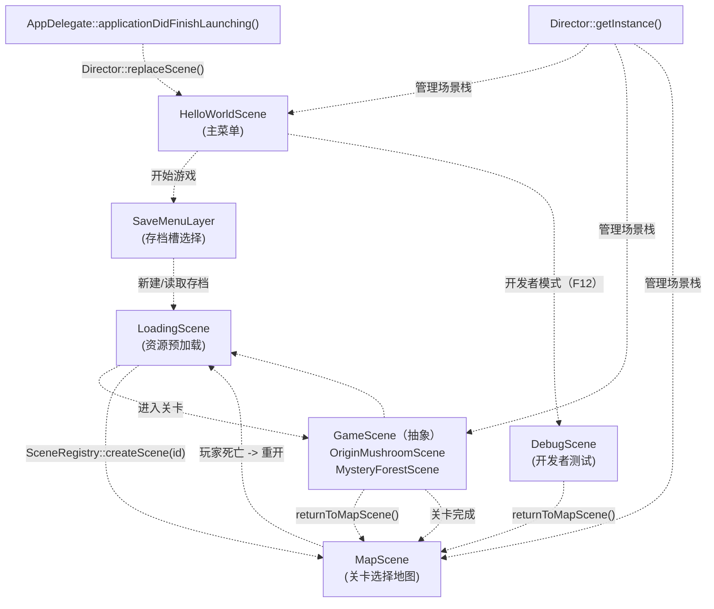
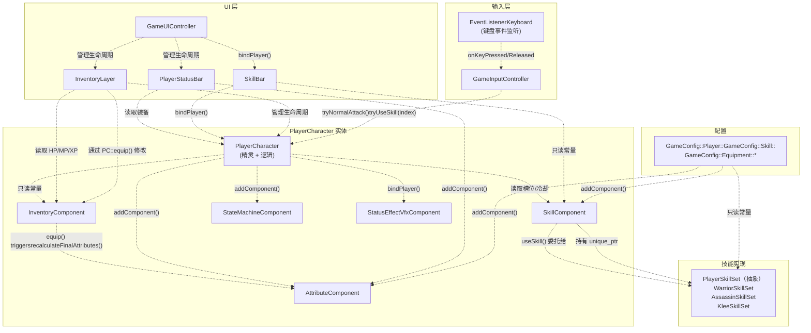
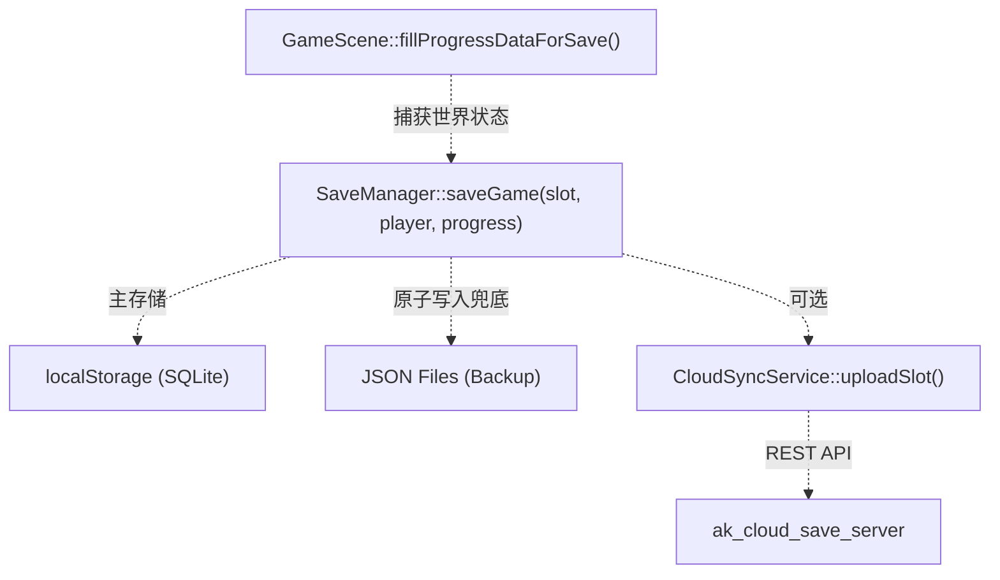
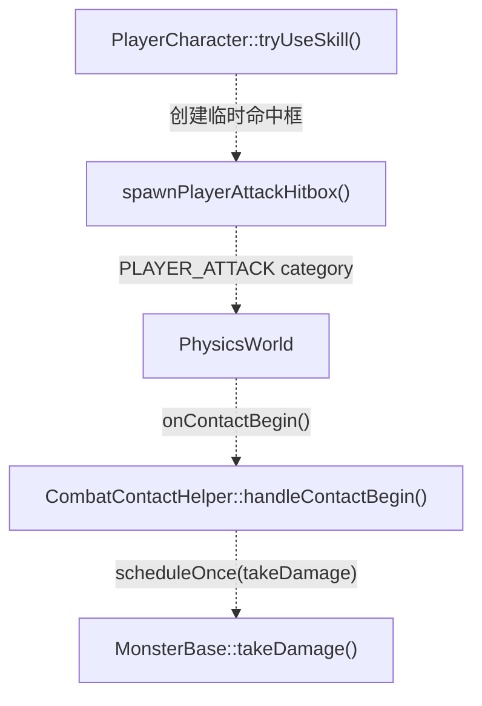

# 概述

> **相关源文件**
> * [Adventure-King/Classes/Character/Player/PlayerCharacter.cpp](https://github.com/lilong555/Adventure-King/blob/60df0f40/Adventure-King/Classes/Character/Player/PlayerCharacter.cpp)
> * [Adventure-King/Classes/Character/Player/PlayerCharacter.h](https://github.com/lilong555/Adventure-King/blob/60df0f40/Adventure-King/Classes/Character/Player/PlayerCharacter.h)
> * [Adventure-King/Classes/Save/SaveManager.h](https://github.com/lilong555/Adventure-King/blob/60df0f40/Adventure-King/Classes/Save/SaveManager.h)
> * [Adventure-King/Classes/Scenes/DebugScene.cpp](https://github.com/lilong555/Adventure-King/blob/60df0f40/Adventure-King/Classes/Scenes/DebugScene.cpp)
> * [Adventure-King/Classes/Scenes/DebugScene.h](https://github.com/lilong555/Adventure-King/blob/60df0f40/Adventure-King/Classes/Scenes/DebugScene.h)
> * [Adventure-King/Classes/Scenes/GameScene.cpp](https://github.com/lilong555/Adventure-King/blob/60df0f40/Adventure-King/Classes/Scenes/GameScene.cpp)
> * [Adventure-King/Classes/Scenes/GameScene.h](https://github.com/lilong555/Adventure-King/blob/60df0f40/Adventure-King/Classes/Scenes/GameScene.h)
> * [Adventure-King/Classes/Scenes/HelloWorldScene.cpp](https://github.com/lilong555/Adventure-King/blob/60df0f40/Adventure-King/Classes/Scenes/HelloWorldScene.cpp)
> * [Adventure-King/Classes/Scenes/HelloWorldScene.h](https://github.com/lilong555/Adventure-King/blob/60df0f40/Adventure-King/Classes/Scenes/HelloWorldScene.h)
> * [Adventure-King/Classes/Scenes/Layers/SaveMenuLayer.cpp](https://github.com/lilong555/Adventure-King/blob/60df0f40/Adventure-King/Classes/Scenes/Layers/SaveMenuLayer.cpp)
> * [Adventure-King/Classes/Scenes/Layers/SaveMenuLayer.h](https://github.com/lilong555/Adventure-King/blob/60df0f40/Adventure-King/Classes/Scenes/Layers/SaveMenuLayer.h)
> * [Adventure-King/Classes/UI/InventoryLayer.cpp](https://github.com/lilong555/Adventure-King/blob/60df0f40/Adventure-King/Classes/UI/InventoryLayer.cpp)
> * [Adventure-King/Classes/UI/InventoryLayer.h](https://github.com/lilong555/Adventure-King/blob/60df0f40/Adventure-King/Classes/UI/InventoryLayer.h)
> * [Adventure-King/Classes/UI/SkillBar.cpp](https://github.com/lilong555/Adventure-King/blob/60df0f40/Adventure-King/Classes/UI/SkillBar.cpp)
> * [Adventure-King/proj.win32/Adventure-King.vcxproj](https://github.com/lilong555/Adventure-King/blob/60df0f40/Adventure-King/proj.win32/Adventure-King.vcxproj)
> * [Adventure-King/proj.win32/Adventure-King.vcxproj.filters](https://github.com/lilong555/Adventure-King/blob/60df0f40/Adventure-King/proj.win32/Adventure-King.vcxproj.filters)

**Adventure-King** 是一款基于 Cocos2d-x 引擎构建的 2D 动作 RPG。代码库实现了基于组件的实体系统，提供多个可玩职业（Warrior、Mage、Assassin），包含以技能为核心的战斗系统、装备机制，以及支持云同步的持久化存档/读档功能。

本文档对代码库架构与主要系统做高层介绍。更详细的系统文档请参阅：

* 场景管理与切换：[第 2 节](<场景系统.md>)
* 角色实体与战斗：[第 3 节](<角色系统.md>)
* 世界与关卡设计：[第 4 节](<世界与关卡系统.md>)
* 用户界面与输入：[第 5 节](<用户界面.md>)
* 持久化与云存档：[第 6 节](<存档与持久化.md>)
* 配置系统：[第 7 节](<配置系统.md>)

---

## 架构模式

代码库遵循一种 **由场景编排（scene-orchestrated）、由组件组合（component-composed）** 的架构：

1. **场景层**（`GameScene`、`HelloWorldScene`、`MapScene`、`LoadingScene`）：编排游戏流程、初始化系统并管理切换
2. **实体层**（`PlayerCharacter`、`MonsterBase`）：使用 Cocos2d-x 组件组合来表示游戏对象
3. **组件层**（`AttributeComponent`、`SkillComponent`、`InventoryComponent`）：封装可复用的实体行为模块
4. **系统层**（`LevelMap`、`SaveManager`、`GameInputController`）：提供无状态/单例式服务
5. **配置层**（`GameConfig.h`）：集中管理所有数值与平衡参数

**来源：** [Adventure-King/Classes/Scenes/GameScene.cpp L1-L130](https://github.com/lilong555/Adventure-King/blob/60df0f40/Adventure-King/Classes/Scenes/GameScene.cpp#L1-L130)

 [Adventure-King/Classes/Character/Player/PlayerCharacter.cpp L1-L277](https://github.com/lilong555/Adventure-King/blob/60df0f40/Adventure-King/Classes/Character/Player/PlayerCharacter.cpp#L1-L277)

---

## 主要系统概览

下表将高层系统映射到其主要代码入口点：

| 系统 | 主要类 | 作用 | 重要性 |
| --- | --- | --- | --- |
| **场景管理** | `GameScene`、`HelloWorldScene`、`LoadingScene`、`MapScene`、`SceneRegistry` | 编排游戏流程、场景切换与资源预加载 | 128.91 |
| **玩家** | `PlayerCharacter`、`AttributeComponent`、`InventoryComponent`、`SkillComponent` | 由组件构成的玩家实体：属性、装备、技能 | 101.62 |
| **怪物/AI** | `MonsterBase`、`GoblinMonster`、`GobluMonster`、`CharacterBase` | 敌方实体：AI、战斗与生命周期管理 | 61.80 |
| **关卡/世界** | `LevelMap`、`EnemySpawnPoint`、`Arena` | TMX 地图加载、碰撞、刷怪点与竞技场战斗 | 44.32 |
| **UI/输入** | `GameUIController`、`GameInputController`、`InventoryLayer`、`SkillBar` | 玩家操作、HUD 元素与菜单系统 | 43.73 |
| **持久化** | `SaveManager`、`SaveData`、`CloudSyncService` | 本地 SQLite 存档、JSON 备份、云同步 | 48.85 |
| **配置** | `GameConfig` 命名空间 | 集中式常量：平衡、物理、技能、装备 | 35.66 |

**来源：** [Adventure-King/proj.win32/Adventure-King.vcxproj L1-L300](https://github.com/lilong555/Adventure-King/blob/60df0f40/Adventure-King/proj.win32/Adventure-King.vcxproj#L1-L300)

 已提供高层示意图

---

## 系统交互：场景流程

下图展示了典型游戏流程中具体场景类之间的交互，并将系统名称映射到实际代码实体：



**关键代码实体：**

* `AppDelegate::applicationDidFinishLaunching()` - [Adventure-King/Classes/AppDelegate.cpp](https://github.com/lilong555/Adventure-King/blob/60df0f40/Adventure-King/Classes/AppDelegate.cpp)
* `HelloWorldScene::createScene()` - [Adventure-King/Classes/Scenes/HelloWorldScene.cpp L25-L28](https://github.com/lilong555/Adventure-King/blob/60df0f40/Adventure-King/Classes/Scenes/HelloWorldScene.cpp#L25-L28)
* `SaveMenuLayer::create()` - [Adventure-King/Classes/Scenes/Layers/SaveMenuLayer.cpp L15-L28](https://github.com/lilong555/Adventure-King/blob/60df0f40/Adventure-King/Classes/Scenes/Layers/SaveMenuLayer.cpp#L15-L28)
* `LoadingScene::createScene(SceneID)` - [Adventure-King/Classes/Scenes/LoadingScene.cpp](https://github.com/lilong555/Adventure-King/blob/60df0f40/Adventure-King/Classes/Scenes/LoadingScene.cpp)
* `SceneRegistry::getInstance()` - [Adventure-King/Classes/Managers/SceneRegistry.cpp](https://github.com/lilong555/Adventure-King/blob/60df0f40/Adventure-King/Classes/Managers/SceneRegistry.cpp)
* `GameScene::returnToMapScene()` - [Adventure-King/Classes/Scenes/GameScene.cpp L745-L767](https://github.com/lilong555/Adventure-King/blob/60df0f40/Adventure-King/Classes/Scenes/GameScene.cpp#L745-L767)
* `DebugScene::createScene()` - [Adventure-King/Classes/Scenes/DebugScene.cpp L54-L57](https://github.com/lilong555/Adventure-King/blob/60df0f40/Adventure-King/Classes/Scenes/DebugScene.cpp#L54-L57)

**来源：** [Adventure-King/Classes/Scenes/GameScene.cpp L745-L767](https://github.com/lilong555/Adventure-King/blob/60df0f40/Adventure-King/Classes/Scenes/GameScene.cpp#L745-L767)

 [Adventure-King/Classes/Scenes/HelloWorldScene.cpp L1-L376](https://github.com/lilong555/Adventure-King/blob/60df0f40/Adventure-King/Classes/Scenes/HelloWorldScene.cpp#L1-L376)

 高层示意图 2

---

## 系统交互：组件架构

下图展示了玩家实体如何由组件构成，以及 UI/输入系统如何与其交互：



**关键代码实体：**

* `PlayerCharacter::init()` - [Adventure-King/Classes/Character/Player/PlayerCharacter.cpp L180-L277](https://github.com/lilong555/Adventure-King/blob/60df0f40/Adventure-King/Classes/Character/Player/PlayerCharacter.cpp#L180-L277)
* `AttributeComponent::recalculateFinalAttributes()` - [Adventure-King/Classes/Character/components/AttributeComponent.cpp](https://github.com/lilong555/Adventure-King/blob/60df0f40/Adventure-King/Classes/Character/components/AttributeComponent.cpp)
* `InventoryComponent::equip()` - [Adventure-King/Classes/Character/components/InventoryComponent.cpp](https://github.com/lilong555/Adventure-King/blob/60df0f40/Adventure-King/Classes/Character/components/InventoryComponent.cpp)
* `SkillComponent::useSkill()` - [Adventure-King/Classes/Character/components/SkillComponent.cpp](https://github.com/lilong555/Adventure-King/blob/60df0f40/Adventure-King/Classes/Character/components/SkillComponent.cpp)
* `GameInputController::tryUseSkill()` - [Adventure-King/Classes/Scenes/GameInputController.cpp](https://github.com/lilong555/Adventure-King/blob/60df0f40/Adventure-King/Classes/Scenes/GameInputController.cpp)
* `GameUIController::init()` - [Adventure-King/Classes/Scenes/GameUIController.cpp](https://github.com/lilong555/Adventure-King/blob/60df0f40/Adventure-King/Classes/Scenes/GameUIController.cpp)
* `InventoryLayer::bindPlayer()` - [Adventure-King/Classes/UI/InventoryLayer.cpp L40](https://github.com/lilong555/Adventure-King/blob/60df0f40/Adventure-King/Classes/UI/InventoryLayer.cpp#L40-L40)
* `GameConfig` 命名空间 - [Adventure-King/Classes/Configs/GameConfig.h](https://github.com/lilong555/Adventure-King/blob/60df0f40/Adventure-King/Classes/Configs/GameConfig.h)

**来源：** [Adventure-King/Classes/Character/Player/PlayerCharacter.cpp L180-L277](https://github.com/lilong555/Adventure-King/blob/60df0f40/Adventure-King/Classes/Character/Player/PlayerCharacter.cpp#L180-L277)

 [Adventure-King/Classes/Scenes/GameScene.cpp L536-L646](https://github.com/lilong555/Adventure-King/blob/60df0f40/Adventure-King/Classes/Scenes/GameScene.cpp#L536-L646)

 高层示意图 3

---

## 核心游戏循环

主循环位于 `GameScene::update()`，每帧按如下顺序执行：

1. **死亡检查**：若玩家死亡，显示死亡菜单并冻结世界
2. **暂停检查**：若处于暂停，仅更新 UI（世界冻结）
3. **输入处理**：`GameInputController::update()` 处理玩家移动/动作
4. **UI 更新**：`GameUIController::update()` 刷新 HUD 元素
5. **Boss 生命周期**：Boss 被击败后移除引用
6. **刷怪管理**：`LevelMap::updateEnemySpawns()` 基于距离触发怪物生成
7. **竞技场逻辑**：`LevelMap::updateArenas()` 管理基于波次的战斗遭遇
8. **存档处理**：`processSaveRequests()` 处理自动存档与即时存档请求

**来源：** [Adventure-King/Classes/Scenes/GameScene.cpp L864-L935](https://github.com/lilong555/Adventure-King/blob/60df0f40/Adventure-King/Classes/Scenes/GameScene.cpp#L864-L935)

---

## 技术栈

| 层级 | 技术 |
| --- | --- |
| **游戏引擎** | Cocos2d-x 3.17+ |
| **物理** | Cocos2d-x 内置（Chipmunk2D wrapper） |
| **图形** | 通过 Cocos2d-x 使用 OpenGL ES 2.0 |
| **音频** | Cocos2d-x AudioEngine |
| **持久化（本地）** | SQLite（通过 `localStorage`）+ JSON 兜底 |
| **持久化（云端）** | 自定义 REST API（`ak_cloud_save_server`，Node.js/Express） |
| **序列化** | RapidJSON（Cocos2d-x 自带） |
| **构建系统** | CMake（Linux/macOS）、Visual Studio 2022（Windows） |
| **语言** | C++20（MSVC）、C++17（GCC/Clang） |

**来源：** [Adventure-King/proj.win32/Adventure-King.vcxproj L1-L157](https://github.com/lilong555/Adventure-King/blob/60df0f40/Adventure-King/proj.win32/Adventure-King.vcxproj#L1-L157)

 [Adventure-King/Classes/Save/SaveManager.h L1-L20](https://github.com/lilong555/Adventure-King/blob/60df0f40/Adventure-King/Classes/Save/SaveManager.h#L1-L20)

---

## 入口点与关键初始化路径

### 应用启动

```yaml
AppDelegate::applicationDidFinishLaunching()
  ├─> Director::getInstance()->setDisplayStats(true)
  ├─> SceneRegistry::setupAllScenes()  // 注册所有场景创建器
  ├─> SaveManager::getInstance()       // 初始化单例
  ├─> HelloWorldScene::createScene()   // 主菜单
  └─> Director::replaceScene()
```

**来源：** [Adventure-King/Classes/AppDelegate.cpp](https://github.com/lilong555/Adventure-King/blob/60df0f40/Adventure-King/Classes/AppDelegate.cpp)

### GameScene 初始化

```sql
GameScene::initWithPhysicsConfig(LevelConfig)
  ├─> Scene::initWithPhysics()                  // 启用物理世界
  ├─> initLevelMap(config)                      // 加载 TMX、碰撞、刷怪点
  ├─> initPlayer(startPos)                      // 创建带组件的 PlayerCharacter
  ├─> initPhysicsContactListener()              // 注册碰撞回调
  ├─> initInputController()                     // 设置键盘输入
  ├─> initCameraFollow(_player)                 // 相机跟随玩家
  ├─> initUIController()                        // 创建 HUD 与菜单
  ├─> applyRuntimeData(SaveManager)             // 若为读档则恢复存档状态
  └─> scheduleUpdate()                          // 启用逐帧更新
```

**来源：** [Adventure-King/Classes/Scenes/GameScene.cpp L130-L326](https://github.com/lilong555/Adventure-King/blob/60df0f40/Adventure-King/Classes/Scenes/GameScene.cpp#L130-L326)

### DebugScene 初始化（开发工具）

```yaml
DebugScene::init()
  ├─> Scene::initWithPhysics()
  ├─> initBackground()                          // 网格与背景
  ├─> initPlatforms()                           // 带物理的静态平台
  ├─> initPlayer()                              // PlayerCharacter（默认 MAGE）
  ├─> initGameUIController()                    // 与 GameScene 相同的 UI
  ├─> initInputController()                     // 与 GameScene 相同的输入
  ├─> initEquipments()                          // 测试用装备配置
  ├─> initPassiveSkills()                       // 测试用技能配置
  ├─> initTestMonsters()                        // 生成测试敌人
  ├─> initDebugUI()                             // 调试控制面板
  └─> scheduleUpdate()
```

**来源：** [Adventure-King/Classes/Scenes/DebugScene.cpp L90-L144](https://github.com/lilong555/Adventure-King/blob/60df0f40/Adventure-King/Classes/Scenes/DebugScene.cpp#L90-L144)

---

## 开发工作流

代码库包含 `DebugScene` 作为专用测试环境，便于在无需完整关卡搭建的情况下快速迭代角色机制、技能、装备与战斗。主要特性：

* **即时角色测试**：通过 UI 按钮直接切换职业、装备与技能
* **战斗验证**：生成可配置数值的测试怪物
* **伤害日志**：在调试控制台实时输出战斗反馈
* **与正式版一致的输入/UI**：使用 `GameInputController` 与 `GameUIController` 以保证一致性

要进入 `DebugScene`，游戏需要以支持调试的方式编译，并通过开发者模式触发（通常为主菜单按 F12，或直接启动对应场景）。

**来源：** [Adventure-King/Classes/Scenes/DebugScene.cpp L1-L16](https://github.com/lilong555/Adventure-King/blob/60df0f40/Adventure-King/Classes/Scenes/DebugScene.cpp#L1-L16)

 [Adventure-King/Classes/Scenes/DebugScene.h L1-L79](https://github.com/lilong555/Adventure-King/blob/60df0f40/Adventure-King/Classes/Scenes/DebugScene.h#L1-L79)

---

## 资源与资产管理

资源按系统组织，并按需加载或通过 `LoadingScene` 进行预加载：

| 资源类型 | 路径模式 | 加载策略 |
| --- | --- | --- |
| **角色贴图** | `Sprites/Characters/{type}/{name}/` | 在角色创建时懒加载 |
| **技能特效** | `Sprites/Characters/{role}/skills/` | 首次使用时缓存到 `AnimationCache` |
| **粒子特效** | `Particle/par_*.plist` | 由 `ParticlePreloadHelper` 预热加载 |
| **TMX 地图** | `Maps/{level_name}.tmx` | 在场景初始化时由 `LevelMap` 加载 |
| **UI 资源** | `Scene/UI/*.png` | 由 `SceneRegistry` 按场景预加载 |
| **音频** | `Scene/MusicOfScene/*.mp3` | 由 `MusicManager` 预加载或流式播放 |

`SceneRegistry` 系统（参见 [第 2.2 节](<场景切换.md>)）集中管理各场景的资源清单，使得 `LoadingScene` 可以展示准确的进度条，并避免首帧卡顿。

**来源：** [Adventure-King/Classes/Managers/SceneRegistry.cpp](https://github.com/lilong555/Adventure-King/blob/60df0f40/Adventure-King/Classes/Managers/SceneRegistry.cpp)

 [Adventure-King/Classes/Scenes/LoadingScene.cpp](https://github.com/lilong555/Adventure-King/blob/60df0f40/Adventure-King/Classes/Scenes/LoadingScene.cpp)

 [Adventure-King/Classes/Scenes/HelloWorldScene.cpp L659-L708](https://github.com/lilong555/Adventure-King/blob/60df0f40/Adventure-King/Classes/Scenes/HelloWorldScene.cpp#L659-L708)

---

## 持久化架构

游戏支持多个存档槽（默认：5），同时提供本地与云端存储：



**关键特性：**

* **自动存档**：每 60 秒一次（可配置）
* **即时存档触发**：升级、装备变更、学习技能
* **运行时缓存**：场景切换零延迟（不做磁盘 I/O）
* **云同步**：以时间戳比较为准的最后写入者获胜（last-write-wins）合并策略

**来源：** [Adventure-King/Classes/Save/SaveManager.h L1-L149](https://github.com/lilong555/Adventure-King/blob/60df0f40/Adventure-King/Classes/Save/SaveManager.h#L1-L149)

 [Adventure-King/Classes/Scenes/GameScene.cpp L937-L1011](https://github.com/lilong555/Adventure-King/blob/60df0f40/Adventure-King/Classes/Scenes/GameScene.cpp#L937-L1011)

 高层示意图 5

---

## 物理与战斗集成

基于物理的战斗使用分类位掩码（category bitmask）进行碰撞过滤，并通过 `PhysicsContact` 事件完成伤害结算：



**伤害编码**：命中框的 `PhysicsBody::tag` 存储伤害值（正数）或暴击标记（负数）。

**延迟执行**：`scheduleOnce()` 避免在物理回调中直接修改场景图（scene graph）。

**来源：** [Adventure-King/Classes/Scenes/CombatContactHelper.cpp](https://github.com/lilong555/Adventure-King/blob/60df0f40/Adventure-King/Classes/Scenes/CombatContactHelper.cpp)

 [Adventure-King/Classes/Scenes/GameScene.cpp L854-L862](https://github.com/lilong555/Adventure-King/blob/60df0f40/Adventure-King/Classes/Scenes/GameScene.cpp#L854-L862)

 高层示意图 4

---

## 配置系统

所有游戏平衡参数都集中在 `GameConfig.h` 中，以命名空间组织为编译期常量：

| 命名空间 | 作用 | 示例常量 |
| --- | --- | --- |
| `GameConfig::Player` | 玩家属性、移动、升级 | `WALKSPEED`、`getRequiredExp(level)` |
| `GameConfig::Monster` | 敌人属性、AI、缩放 | 基础 HP/DMG、`LevelScaling::scaleHP()` |
| `GameConfig::Skill` | 技能 ID、冷却、伤害倍率 | `Warrior::FIRE_SKILL_ID`、`COOLDOWN_SECONDS` |
| `GameConfig::Equipment` | 装备 ID 与效果公式 | `Weapon::EMBER_STAFF`、`ThornsArmor::getReflectRate()` |
| `GameConfig::Combat` | 伤害公式、防御 | `ARMOR_CONST`、破防条公式 |
| `GameConfig::StatusEffect` | DOT 参数 | 燃烧/中毒时长、tick 间隔 |
| `GameConfig::LevelMap` | 刷怪距离、竞技场配置 | `DEFAULT_SPAWN_VIEW_DISTANCE` |

**单向依赖**：所有系统读取 `GameConfig`，但永不写入，从而保证数据流可预测。

**来源：** [Adventure-King/Classes/Configs/GameConfig.h](https://github.com/lilong555/Adventure-King/blob/60df0f40/Adventure-King/Classes/Configs/GameConfig.h)

 高层示意图 7

---

## 下一步

若要更深入理解各个系统，请继续阅读：

* **场景系统**：[第 2 节](<场景系统.md>) - 场景生命周期、切换、SceneRegistry
* **角色系统**：[第 3 节](<角色系统.md>) - PlayerCharacter、MonsterBase、组件细节
* **关卡与世界**：[第 4 节](<世界与关卡系统.md>) - TMX 加载、刷怪点、竞技场战斗
* **UI 与输入**：[第 5 节](<用户界面.md>) - 输入优先级、菜单系统、背包
* **持久化**：[第 6 节](<存档与持久化.md>) - SaveManager 内部、云同步协议
* **配置**：[第 7 节](<配置系统.md>) - GameConfig 结构、平衡调参
* **高级主题**：[第 8 节](<高级主题.md>) - 技能实现、动画缓存、性能优化
