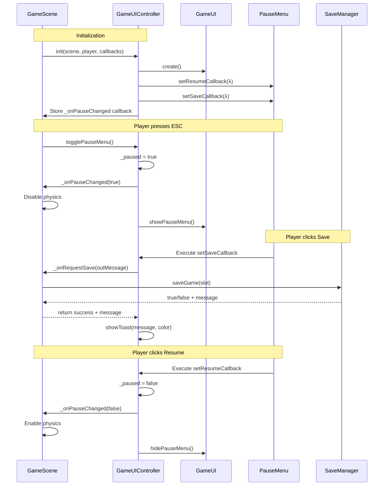

# GameUIController（游戏 UI 控制器）

> **相关源文件**
> * [Adventure-King/Classes/Configs/GameSceneConfig.h](https://github.com/lilong555/Adventure-King/blob/60df0f40/Adventure-King/Classes/Configs/GameSceneConfig.h)
> * [Adventure-King/Classes/GameUI.cpp](https://github.com/lilong555/Adventure-King/blob/60df0f40/Adventure-King/Classes/GameUI.cpp)
> * [Adventure-King/Classes/GameUI.h](https://github.com/lilong555/Adventure-King/blob/60df0f40/Adventure-King/Classes/GameUI.h)
> * [Adventure-King/Classes/Scenes/GameInputController.cpp](https://github.com/lilong555/Adventure-King/blob/60df0f40/Adventure-King/Classes/Scenes/GameInputController.cpp)
> * [Adventure-King/Classes/Scenes/GameInputController.h](https://github.com/lilong555/Adventure-King/blob/60df0f40/Adventure-King/Classes/Scenes/GameInputController.h)
> * [Adventure-King/Classes/Scenes/GameUIController.cpp](https://github.com/lilong555/Adventure-King/blob/60df0f40/Adventure-King/Classes/Scenes/GameUIController.cpp)
> * [Adventure-King/Classes/Scenes/GameUIController.h](https://github.com/lilong555/Adventure-King/blob/60df0f40/Adventure-King/Classes/Scenes/GameUIController.h)
> * [Adventure-King/Resources/Scene/UI/bag.png](https://github.com/lilong555/Adventure-King/blob/60df0f40/Adventure-King/Resources/Scene/UI/bag.png)
> * [Adventure-King/Resources/Scene/UI/bagSelected.png](https://github.com/lilong555/Adventure-King/blob/60df0f40/Adventure-King/Resources/Scene/UI/bagSelected.png)

**GameUIController** 是 `GameScene` 的 UI 状态管理与编排系统。它负责初始化 `GameUI` 容器、管理菜单生命周期、协调暂停状态、处理交互提示，并提供存/读档集成。该控制器与 `GameInputController` 并行工作（见 [GameInputController](游戏输入控制器（GameInputController）.md)），后者负责底层键盘输入处理。

关于 `InventoryLayer`、`SkillBar` 等具体 UI 组件，请参见 [Player UI Components](玩家 UI 组件.md)。

---

## 概览与架构

`GameUIController` 充当 UI 层的状态机协调器。它不直接处理输入事件；而是接收来自 `GameInputController` 的回调，并据此进行 UI 状态切换。控制器维护多种状态标记，用于追踪哪些菜单处于激活状态，并实现优先级层级以防止冲突 UI 状态同时出现。

### 组件层级

```mermaid
flowchart TD

GS["GameScene<br>(Orchestrator)"]
GUIC["GameUIController<br>(State Manager)"]
Paused["_paused<br>bool"]
InvReturn["_inventoryReturnToPauseOnClose<br>bool"]
HintSrc["_hintSource<br>InteractionHintSource"]
Accum["_updateAccumulator<br>float"]
OnReturnMap["_onReturnToMap"]
OnPauseChanged["_onPauseChanged"]
OnRequestSave["_onRequestSave"]
IsAtGate["_isPlayerAtGate"]
IsAtNpc["_isPlayerAtNpc"]
OnLoadSuccess["_onLoadSuccess"]
GUI["GameUI<br>(Node Container)"]
PSB["PlayerStatusBar"]
SB["SkillBar"]
BHB["BossHealthBar"]
Hint["_interactionHint"]
MapBtn["_mapButton"]
InvBtn["_inventoryButton"]
PM["PauseMenu<br>(z=100)"]
IL["InventoryLayer<br>(z=101)"]
DM["PlayerDeathMenu<br>(z=200)"]
BNL["BlessingNpcLayer<br>(z=220)"]

GS -.-> GUIC
GUIC -.-> GUI

subgraph subGraph6 ["GameUI Container"]
    GUI
    GUI -.-> PSB
    GUI -.-> SB
    GUI -.-> BHB
    GUI -.-> Hint
    GUI -.-> MapBtn
    GUI -.-> InvBtn
    GUI -.-> PM
    GUI -.-> IL
    GUI -.-> DM
    GUI -.-> BNL

subgraph subGraph5 ["Modal Menus"]
    PM
    IL
    DM
    BNL
end

subgraph subGraph4 ["HUD Components"]
    PSB
    SB
    BHB
    Hint
    MapBtn
    InvBtn
end
end

subgraph GameUIController ["GameUIController"]
    GUIC
    GUIC -.-> Paused
    GUIC -.-> InvReturn
    GUIC -.-> HintSrc
    GUIC -.-> Accum
    GUIC -.-> OnReturnMap
    GUIC -.-> OnPauseChanged
    GUIC -.-> OnRequestSave
    GUIC -.-> IsAtGate
    GUIC -.-> IsAtNpc
    GUIC -.-> OnLoadSuccess

subgraph Callbacks ["Callbacks"]
    OnReturnMap
    OnPauseChanged
    OnRequestSave
    IsAtGate
    IsAtNpc
    OnLoadSuccess
end

subgraph subGraph1 ["State Flags"]
    Paused
    InvReturn
    HintSrc
    Accum
end
end

subgraph GameScene ["GameScene"]
    GS
end
```



**来源**：[Adventure-King/Classes/Scenes/GameUIController.h L16-L83](https://github.com/lilong555/Adventure-King/blob/60df0f40/Adventure-King/Classes/Scenes/GameUIController.h#L16-L83)

 [Adventure-King/Classes/GameUI.h L32-L270](https://github.com/lilong555/Adventure-King/blob/60df0f40/Adventure-King/Classes/GameUI.h#L32-L270)

### 职责分离

| 组件 | 职责 |
| --- | --- |
| `GameInputController` | 处理原始键盘事件（`EventKeyboard::KeyCode`），更新玩家物理速度，处理落地检测 |
| `GameUIController` | 管理 UI 状态机（暂停、背包、死亡），协调菜单显示/隐藏，对 UI 刷新做节流 |
| `GameUI` | UI 元素容器节点，提供 child UI 的便捷访问与绑定入口 |

> 说明：原文在本节后续存在生成器截断占位（`...15549 chars truncated...`），为保证不遗漏，下方保留原占位内容。

```text
* `GameUI` | Container node for UI elements, provides s…15549 chars truncated…Scene
CheckScene -.->|"false"| End
CheckScene -.-> RemoveOld
RemoveOld -.-> CreateLabel
CreateLabel -.-> Position
Position -.-> AddToScene
AddToScene -.-> AnimSeq
AnimSeq -.-> End
```

**实现：** [GameUIController.cpp L318-L355](https://github.com/lilong555/Adventure-King/blob/60df0f40/GameUIController.cpp#L318-L355)

固定 tag 机制（`TOAST_TAG = 88001`）确保任一时刻仅显示一个 toast，避免由于快速连续存档等用户行为造成信息刷屏。

**常见用途：**

* 存档成功/失败提示（[GameUIController.cpp L124-L131](https://github.com/lilong555/Adventure-King/blob/60df0f40/GameUIController.cpp#L124-L131)）
* 读档过程状态
* 错误提示

**来源**：[Adventure-King/Classes/Scenes/GameUIController.cpp L318-L355](https://github.com/lilong555/Adventure-King/blob/60df0f40/Adventure-King/Classes/Scenes/GameUIController.cpp#L318-L355)

---

## 与 GameScene 的集成

控制器作为“高层场景逻辑”与“底层 UI 组件”之间的桥梁：

### 回调流程图



**来源**：[Adventure-King/Classes/Scenes/GameUIController.cpp L32-L316](https://github.com/lilong555/Adventure-King/blob/60df0f40/Adventure-King/Classes/Scenes/GameUIController.cpp#L32-L316)

 [Adventure-King/Classes/Scenes/GameUIController.cpp L401-L445](https://github.com/lilong555/Adventure-King/blob/60df0f40/Adventure-King/Classes/Scenes/GameUIController.cpp#L401-L445)

### GameScene 集成点

`GameScene` 在其 `init()` 中初始化控制器，并提供如下回调：

| 回调 | GameScene 中的实现 | 用途 |
| --- | --- | --- |
| `onReturnToMap` | 缓存玩家数据，切换到 `MapScene` | 返回关卡选择 |
| `onPauseChanged` | 切换 `_physicsWorld->setSpeed()` 与敌人更新 | 暂停/恢复模拟 |
| `onRequestSave` | 使用当前槽位调用 `SaveManager::saveGame()` | 手动存档 |
| `isPlayerAtGate` | 用玩家位置与 gate rect 进行检测 | 传送门交互提示 |
| `onLoadSuccess` | 恢复玩家/世界状态，替换场景 | 读档操作 |

**来源**：基于高层架构图与回调签名推导

---

## 汇总表

### 关键方法

| 方法 | 触发方式 | 主要职责 |
| --- | --- | --- |
| `init()` | GameScene 初始化 | 绑定回调、创建 GameUI、配置菜单 |
| `update(float)` | 每帧 | 轮询交互提示，对 UI 刷新做节流 |
| `togglePauseMenu()` | ESC 按键 | 上下文敏感的暂停/取消暂停逻辑 |
| `toggleInventory()` | B 按键 | 上下文敏感的背包打开/关闭 |
| `showDeathMenu()` | 玩家 HP 归零 | 显示死亡菜单并强制暂停 |
| `applyPostInventoryCloseState()` | 关闭背包 | 依据上下文标记切换到暂停或玩法状态 |
| `showToast()` | 手动存档、错误等 | 显示短暂的用户反馈信息 |

**来源**：[Adventure-King/Classes/Scenes/GameUIController.h L31-L53](https://github.com/lilong555/Adventure-King/blob/60df0f40/Adventure-King/Classes/Scenes/GameUIController.h#L31-L53)

### 状态切换保证

| 起始状态 | 动作 | 目标状态 | 副作用 |
| --- | --- | --- | --- |
| 玩法（Gameplay） | ESC | 暂停菜单（Pause Menu） | 禁用物理，`_paused = true` |
| 暂停菜单（Pause Menu） | ESC | 玩法（Gameplay） | 启用物理，`_paused = false` |
| 暂停菜单（Pause Menu） | 点击 背包（Inventory） | 背包（Inventory） | `_inventoryReturnToPauseOnClose = true` |
| 玩法（Gameplay） | B | 背包（Inventory） | `_inventoryReturnToPauseOnClose = false` |
| 背包（从暂停进入） | 关闭 | 暂停菜单（Pause Menu） | 保持 `_paused = true` |
| 背包（从玩法进入） | 关闭 | 玩法（Gameplay） | 设置 `_paused = false` |
| 任意状态 | 玩家死亡 | 死亡菜单（Death Menu） | 隐藏其他 UI，阻断输入 |

**来源**：[Adventure-King/Classes/Scenes/GameUIController.cpp L401-L532](https://github.com/lilong555/Adventure-King/blob/60df0f40/Adventure-King/Classes/Scenes/GameUIController.cpp#L401-L532)
