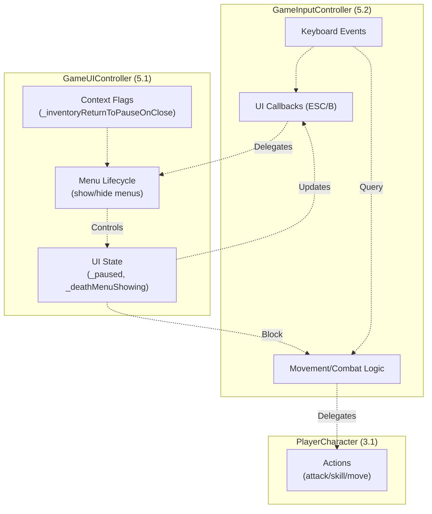

# 游戏输入控制器（GameInputController）

> **相关源文件**
> * [Adventure-King/Classes/Configs/GameSceneConfig.h](https://github.com/lilong555/Adventure-King/blob/60df0f40/Adventure-King/Classes/Configs/GameSceneConfig.h)
> * [Adventure-King/Classes/GameUI.cpp](https://github.com/lilong555/Adventure-King/blob/60df0f40/Adventure-King/Classes/GameUI.cpp)
> * [Adventure-King/Classes/GameUI.h](https://github.com/lilong555/Adventure-King/blob/60df0f40/Adventure-King/Classes/GameUI.h)
> * [Adventure-King/Classes/Scenes/GameInputController.cpp](https://github.com/lilong555/Adventure-King/blob/60df0f40/Adventure-King/Classes/Scenes/GameInputController.cpp)
> * [Adventure-King/Classes/Scenes/GameInputController.h](https://github.com/lilong555/Adventure-King/blob/60df0f40/Adventure-King/Classes/Scenes/GameInputController.h)
> * [Adventure-King/Classes/Scenes/GameUIController.cpp](https://github.com/lilong555/Adventure-King/blob/60df0f40/Adventure-King/Classes/Scenes/GameUIController.cpp)
> * [Adventure-King/Classes/Scenes/GameUIController.h](https://github.com/lilong555/Adventure-King/blob/60df0f40/Adventure-King/Classes/Scenes/GameUIController.h)
> * [Adventure-King/Resources/Scene/UI/bag.png](https://github.com/lilong555/Adventure-King/blob/60df0f40/Adventure-King/Resources/Scene/UI/bag.png)
> * [Adventure-King/Resources/Scene/UI/bagSelected.png](https://github.com/lilong555/Adventure-King/blob/60df0f40/Adventure-King/Resources/Scene/UI/bagSelected.png)

## 目的与范围

`GameInputController` 负责在游戏过程中处理键盘输入，并把它翻译为玩家动作。该控制器处理移动、战斗、跳跃与 UI 指令，同时尊重暂停状态、动作锁与上下文敏感交互。它充当原始键盘事件与 `PlayerCharacter` 实体之间的桥梁：在维护物理驱动移动所需的输入状态的同时，将动作委托给玩家实体执行。

UI 状态管理（暂停/背包/死亡菜单）请参见 [GameUIController](<游戏 UI 控制器（GameUIController）.md>)。输入优先级规则与上下文敏感行为请参见 [Input Priority and Context](<输入优先级与上下文.md>)。

**来源**：[Classes/Scenes/GameInputController.h L1-L78](https://github.com/lilong555/Adventure-King/blob/60df0f40/Classes/Scenes/GameInputController.h#L1-L78)

 [Classes/Scenes/GameInputController.cpp L1-L306](https://github.com/lilong555/Adventure-King/blob/60df0f40/Classes/Scenes/GameInputController.cpp#L1-L306)

---

## 架构概览

下图展示 `GameInputController` 在输入处理管线中的位置：

```mermaid
flowchart TD

KeyEvents["EventKeyboard<br>KEY_PRESSED/KEY_RELEASED"]
OnKeyPressed["onKeyPressed(KeyCode)"]
OnKeyReleased["onKeyReleased(KeyCode)"]
Update["update(float dt)"]
MovingLeft["_movingLeft"]
MovingRight["_movingRight"]
RunPressed["_runPressed"]
Grounded["_grounded"]
GroundContact["_groundContactCount"]
JumpCount["_jumpCount"]
TogglePause["_togglePause()"]
ToggleInventory["_toggleInventory()"]
IsPaused["_isPaused()"]
IsAtGate["_isAtGate()"]
EnterGate["_enterGate()"]
IsAtNpc["_isAtNpc()"]
InteractNpc["_interactNpc()"]
SetMoving["setMoving(bool, bool)"]
TryNormalAttack["tryNormalAttack(callback)"]
TryUseSkill["tryUseSkill(slot, callback)"]
IsActionLocked["isActionLocked()"]
PhysicsBody["PhysicsBody<br>setVelocity()"]
UITogglePause["togglePauseMenu()"]
UIToggleInventory["toggleInventory()"]
UIPaused["isPaused()"]
CheckGate["_isPlayerAtGate()"]
EnterGateScene["_enterGate()"]
CheckNpc["_isPlayerAtNpc()"]
InteractNpcScene["_interactNpc()"]

KeyEvents -.-> OnKeyPressed
KeyEvents -.-> OnKeyReleased
OnKeyPressed -.-> TryNormalAttack
OnKeyPressed -.-> TryUseSkill
Update -.-> PhysicsBody
Update -.-> SetMoving
TogglePause -.-> UITogglePause
ToggleInventory -.-> UIToggleInventory
IsPaused -.-> UIPaused
IsAtGate -.-> CheckGate
EnterGate -.-> EnterGateScene
IsAtNpc -.-> CheckNpc
InteractNpc -.-> InteractNpcScene

subgraph GameScene ["GameScene"]
    CheckGate
    EnterGateScene
    CheckNpc
    InteractNpcScene
end

subgraph GameUIController ["GameUIController"]
    UITogglePause
    UIToggleInventory
    UIPaused
end

subgraph PlayerCharacter ["PlayerCharacter"]
    SetMoving
    TryNormalAttack
    TryUseSkill
    IsActionLocked
    PhysicsBody
    TryNormalAttack -.-> IsActionLocked
    TryUseSkill -.-> IsActionLocked
    SetMoving -.-> IsActionLocked
end

subgraph GameInputController ["GameInputController"]
    OnKeyPressed
    OnKeyReleased
    Update
    OnKeyPressed -.-> MovingLeft
    OnKeyPressed -.-> MovingRight
    OnKeyPressed -.-> RunPressed
    OnKeyPressed -.-> TogglePause
    OnKeyPressed -.-> ToggleInventory
    OnKeyPressed -.-> IsAtGate
    OnKeyPressed -.-> IsAtNpc
    OnKeyReleased -.-> MovingLeft
    OnKeyReleased -.-> MovingRight
    OnKeyReleased -.-> RunPressed
    Update -.-> MovingLeft
    Update -.-> MovingRight
    Update -.-> RunPressed
    Update -.-> Grounded
    Update -.-> GroundContact
    Update -.-> JumpCount
end
```

### 输入状态字段

| 字段 | 类型 | 来源 | 含义 |
| --- | --- | --- | --- |
| `_movingLeft` / `_movingRight` | `bool` | Frame | 是否按住左右移动键 |
| `_runPressed` | `bool` | Frame | 是否按住冲刺键（Shift） |
| `_grounded` | `bool` | Physics | 是否站在地面上 |
| `_groundContactCount` | `int` | Physics | 当前地面接触计数 |
| `_jumpCount` | `int` | Physics | 自上次落地以来的跳跃次数 |

**来源**：[Classes/Scenes/GameInputController.h L59-L67](https://github.com/lilong555/Adventure-King/blob/60df0f40/Classes/Scenes/GameInputController.h#L59-L67)

### 初始化顺序

1. 在 `GameScene` 中实例化 `GameInputController`
2. 调用 `bindPlayer(player)` 绑定玩家实体
3. 调用 `setPauseToggle()`、`setInventoryToggle()` 等绑定回调
4. 挂载键盘事件监听器，调用 `onKeyPressed()` / `onKeyReleased()`
5. 在场景 update 循环中注册 `update(dt)`
6. 在物理接触监听器中注册 `onGroundContactBegin()` / `onGroundContactEnd()`

**来源**：[Classes/Scenes/GameInputController.h L18-L48](https://github.com/lilong555/Adventure-King/blob/60df0f40/Classes/Scenes/GameInputController.h#L18-L48)

---

## 与 GameUIController 的集成

`GameInputController` 与 `GameUIController` 的分工边界清晰：

| 控制器 | 职责 | 关键方法 |
| --- | --- | --- |
| **GameInputController** | 原始输入 → 玩法动作 | `onKeyPressed()`, `update()` |
| **GameUIController** | UI 状态管理 | `togglePauseMenu()`, `showDeathMenu()` |

**图示：控制器职责分离**

输入控制器会**读取** UI 状态（暂停/死亡菜单标记），但**不修改**该状态。所有 UI 状态变化都通过 `GameUIController` 的方法发生。这种单向依赖能避免循环状态变更。

**来源**：[Classes/Scenes/GameUIController.h L16-L83](https://github.com/lilong555/Adventure-King/blob/60df0f40/Classes/Scenes/GameUIController.h#L16-L83)

 [Classes/Scenes/GameInputController.h L15-L78](https://github.com/lilong555/Adventure-King/blob/60df0f40/Classes/Scenes/GameInputController.h#L15-L78)

---

## 配置

### 输入相关常量

移动与跳跃参数定义在 `GameConfig::Player` 中：

| 常量 | 值 | 用途 |
| --- | --- | --- |
| `WALKSPEED` | （见配置） | 基础移动速度 |
| `RUNSPEED` | （见配置） | Shift 修饰后的移动速度 |
| `JUMP_IMPULSE` | （见配置） | 垂直跳跃力度 |
| `MAX_JUMP_COUNT` | （见配置） | 多段跳上限 |
| `GROUND_VELOCITY_THRESHOLD` | （见配置） | 判定落地的 Y 速度阈值 |
| `GROUND_NORMAL_THRESHOLD` | （见配置） | 接触法线过滤阈值（-0.7） |

**来源**：[Classes/Scenes/GameInputController.cpp L13-L16](https://github.com/lilong555/Adventure-King/blob/60df0f40/Classes/Scenes/GameInputController.cpp#L13-L16)

 [Classes/Configs/GameConfig.h](https://github.com/lilong555/Adventure-King/blob/60df0f40/Classes/Configs/GameConfig.h)

---

## 总结

`GameInputController` 实现了一个“有状态”的输入处理器，它：

1. **把键盘事件翻译为动作**：通过委托调用玩家动作接口
2. **维护移动状态**：以支持物理驱动的连续运动
3. **尊重暂停状态**：阻断玩法输入（但不阻断 UI 输入）
4. **跟踪地面接触**：用引用计数处理多接触点场景
5. **提供上下文敏感行为**：通过回调查询交互环境
6. **持续同步动画状态**：在 update 与战斗动作后保持正确状态
7. **职责分离**：UI 状态由 `GameUIController` 管理，输入层只消费状态

该控制器是较薄的“翻译层”：仅做最少逻辑，把验证/执行委托给 `PlayerCharacter` 与回调函数，从而保持输入处理与游戏逻辑、UI 状态管理之间的解耦。

**来源**：[Classes/Scenes/GameInputController.h L1-L78](https://github.com/lilong555/Adventure-King/blob/60df0f40/Classes/Scenes/GameInputController.h#L1-L78)

 [Classes/Scenes/GameInputController.cpp L1-L306](https://github.com/lilong555/Adventure-King/blob/60df0f40/Classes/Scenes/GameInputController.cpp#L1-L306)
