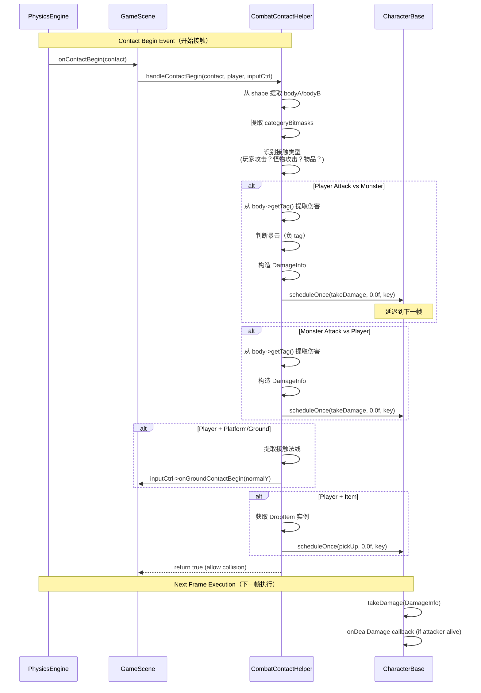
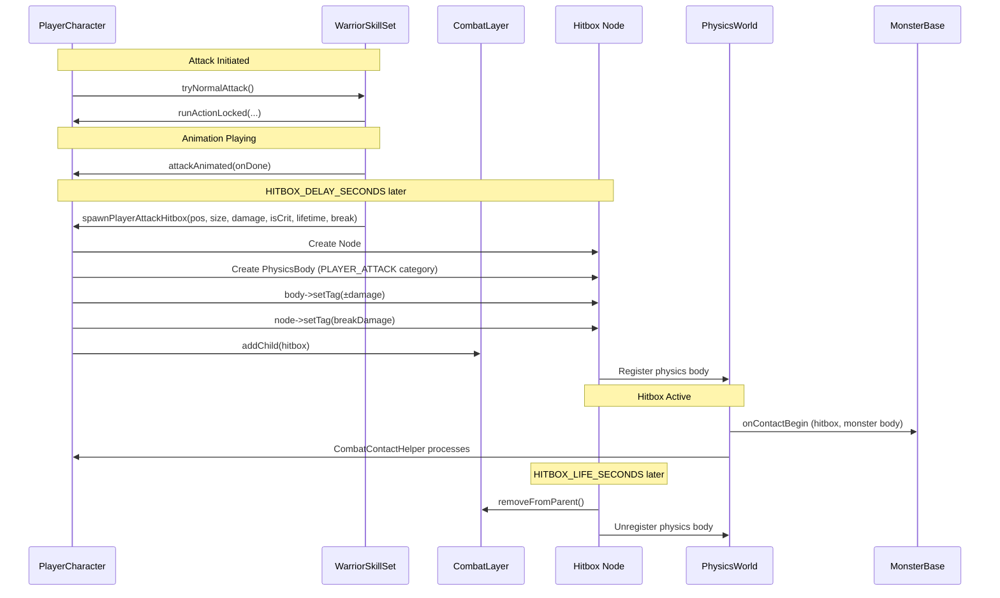
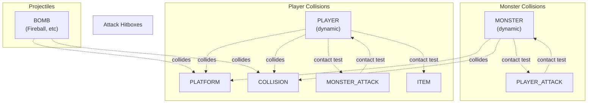
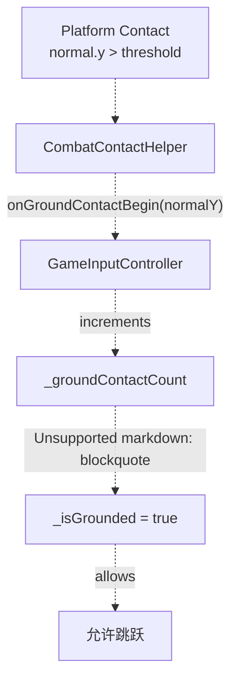
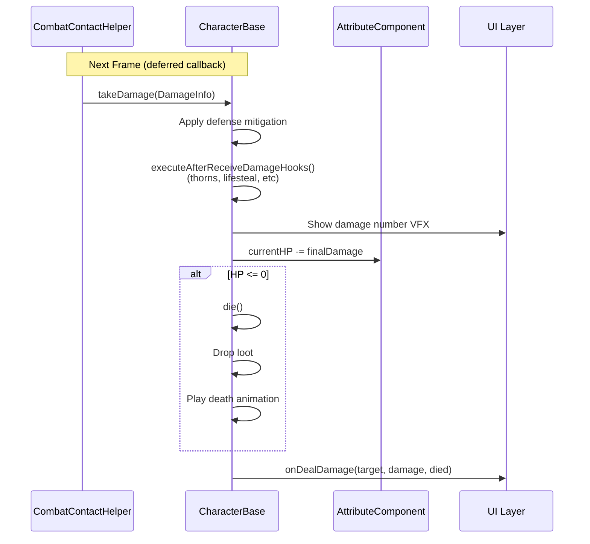

# 物理与战斗接触（Physics and Combat Contact）

> **相关源文件**
> * [Adventure-King/Classes/Character/Player/SkillSets/AssassinSkillSet.cpp](https://github.com/lilong555/Adventure-King/blob/60df0f40/Adventure-King/Classes/Character/Player/SkillSets/AssassinSkillSet.cpp)
> * [Adventure-King/Classes/Character/Player/SkillSets/WarriorSkillSet.cpp](https://github.com/lilong555/Adventure-King/blob/60df0f40/Adventure-King/Classes/Character/Player/SkillSets/WarriorSkillSet.cpp)
> * [Adventure-King/Classes/Configs/GameConfig.h](https://github.com/lilong555/Adventure-King/blob/60df0f40/Adventure-King/Classes/Configs/GameConfig.h)
> * [Adventure-King/Classes/Scenes/CombatContactHelper.cpp](https://github.com/lilong555/Adventure-King/blob/60df0f40/Adventure-King/Classes/Scenes/CombatContactHelper.cpp)
> * [Adventure-King/Classes/Scenes/DebugScene.cpp](https://github.com/lilong555/Adventure-King/blob/60df0f40/Adventure-King/Classes/Scenes/DebugScene.cpp)
> * [Adventure-King/Classes/Scenes/DebugScene.h](https://github.com/lilong555/Adventure-King/blob/60df0f40/Adventure-King/Classes/Scenes/DebugScene.h)
> * [Adventure-King/Classes/Scenes/GameScene.cpp](https://github.com/lilong555/Adventure-King/blob/60df0f40/Adventure-King/Classes/Scenes/GameScene.cpp)
> * [Adventure-King/Classes/Scenes/GameScene.h](https://github.com/lilong555/Adventure-King/blob/60df0f40/Adventure-King/Classes/Scenes/GameScene.h)
> * [Adventure-King/proj.win32/Adventure-King.vcxproj](https://github.com/lilong555/Adventure-King/blob/60df0f40/Adventure-King/proj.win32/Adventure-King.vcxproj)
> * [Adventure-King/proj.win32/Adventure-King.vcxproj.filters](https://github.com/lilong555/Adventure-King/blob/60df0f40/Adventure-King/proj.win32/Adventure-King.vcxproj.filters)

## 目的与范围

本文记录 GameScene 中的物理接触系统与战斗交互处理，内容包括：

* 物理接触监听的初始化与事件路由
* `CombatContactHelper` 作为接触事件的中央处理器
* 不同接触类型（落地检测、战斗伤害、拾取物品）
* 命中框（Hitbox）生成与伤害投递机制
* 用于在物理回调期间安全修改状态的“延迟执行”模式

关于更宏观的 GameScene 初始化流程，请参阅 [初始化流水线](初始化流程.md)。关于包含刷怪管理在内的运行时更新逻辑，请参阅 [更新循环与运行时逻辑](更新循环与运行时逻辑.md)。关于伤害计算公式细节，请参阅 [伤害系统](伤害系统.md)。

---

## 物理接触系统架构

物理接触系统使用 Cocos2d-x 内置物理引擎（Chipmunk）检测碰撞并触发玩法事件。整体采用事件驱动：接触事件被集中处理，然后分发到受影响实体/系统。

### 系统概览示意图

```mermaid
flowchart TD

PhysicsWorld["PhysicsWorld<br>(场景持有)"]
ContactEvents["接触事件<br>Begin/PreSolve/Separate"]
Listener["EventListenerPhysicsContact<br>(在 initPhysicsContactListener 注册)"]
OnBegin["onContactBegin 回调"]
OnPreSolve["onContactPreSolve 回调"]
OnSeparate["onContactSeparate 回调"]
HandleBegin["handleContactBegin<br>(静态方法)"]
HandlePreSolve["handleContactPreSolve<br>(静态方法)"]
HandleSeparate["handleContactSeparate<br>(静态方法)"]
GroundDetect["落地接触<br>(Player + Platform)"]
PlayerAttack["玩家攻击 → 怪物<br>(PLAYER_ATTACK 命中框)"]
MonsterAttack["怪物攻击 → 玩家<br>(MONSTER_ATTACK 命中框)"]
ItemPickup["物品拾取<br>(Player + ITEM)"]
Player["PlayerCharacter"]
Monster["MonsterBase/CharacterBase"]
InputCtrl["GameInputController<br>(落地状态)"]
DropItem["DropItem"]

ContactEvents -.->|"onContactPreSolve"| Listener
OnBegin -.->|"GameScene::onContactBegin"| HandleBegin
OnPreSolve -.-> HandlePreSolve
OnSeparate -.->|"GameScene::onContactSeparate"| HandleSeparate
HandleBegin -.-> GroundDetect
HandleBegin -.->|"scheduleOnce(takeDamage)"| PlayerAttack
HandleBegin -.->|"scheduleOnce(takeDamage)"| MonsterAttack
HandleBegin -.->|"onGroundContactBegin/End"| ItemPickup
HandleSeparate -.->|"scheduleOnce(pickUp)"| GroundDetect
GroundDetect -.-> InputCtrl
PlayerAttack -.-> Monster
MonsterAttack -.-> Player
ItemPickup -.-> DropItem
HandlePreSolve -.->|"adjust friction/restitution"| PhysicsWorld

subgraph subGraph4 ["受影响实体"]
    Player
    Monster
    InputCtrl
    DropItem
end

subgraph subGraph3 ["接触类型处理器"]
    GroundDetect
    PlayerAttack
    MonsterAttack
    ItemPickup
end

subgraph subGraph2 ["CombatContactHelper（中央处理器）"]
    HandleBegin
    HandlePreSolve
    HandleSeparate
end

subgraph subGraph1 ["GameScene 接触路由"]
    Listener
    OnBegin
    OnPreSolve
    OnSeparate
    Listener -.->|"onContactBegin"| OnBegin
    Listener …1533 chars truncated…ne::onContactBegin` → `CombatContactHelper::handleContactBegin` | Detect collision start (damage, pickup, ground contact) |
| `onContactPreSolve` | `CombatContactHelper::handleContactPreSolve` (static) | Adjust physics response before collision resolution |
| `onContactSeparate` | `GameScene::onContactSeparate` → `CombatContactHelper::handleContactSeparate` | Detect collision end (ground state tracking) |
```

> 说明：上方 mermaid 代码块内含一段由生成器截断的占位文本 `…1533 chars truncated…`，为避免遗漏已原样保留。

### GameScene 包装方法

GameScene 提供非常薄的 wrapper：把事件转发给 `CombatContactHelper`，并补齐场景上下文（玩家指针、输入控制器）：

[Classes/Scenes/GameScene.cpp L854-L862](https://github.com/lilong555/Adventure-King/blob/60df0f40/Classes/Scenes/GameScene.cpp#L854-L862)

```
bool GameScene::onContactBegin(PhysicsContact &contact)
{
    return CombatContactHelper::handleContactBegin(contact, _player, _inputController.get());
}

void GameScene::onContactSeparate(PhysicsContact &contact)
{
    CombatContactHelper::handleContactSeparate(contact, _inputController.get());
}
```

**来源：** [Classes/Scenes/GameScene.cpp L524-L535](https://github.com/lilong555/Adventure-King/blob/60df0f40/Classes/Scenes/GameScene.cpp#L524-L535)

 [Classes/Scenes/GameScene.cpp L854-L862](https://github.com/lilong555/Adventure-King/blob/60df0f40/Classes/Scenes/GameScene.cpp#L854-L862)

---

## CombatContactHelper：中央接触处理器

`CombatContactHelper` 是一个无状态工具类，使用静态方法实现全部接触处理逻辑。它把“物理事件处理”从“场景管理”中解耦，使逻辑可以在 `GameScene` 与 `DebugScene` 中复用。

### 类结构

[Classes/Scenes/CombatContactHelper.h](https://github.com/lilong555/Adventure-King/blob/60df0f40/Classes/Scenes/CombatContactHelper.h)

```python
class CombatContactHelper
{
public:
    static bool handleContactBegin(PhysicsContact& contact,
                                  PlayerCharacter* player,
                                  GameInputController* inputController);
    
    static void handleContactSeparate(PhysicsContact& contact,
                                     GameInputController* inputController);
    
    static bool handleContactPreSolve(PhysicsContact& contact,
                                     PhysicsContactPreSolve& solve);
};
```

所有方法均为 static，所需上下文通过参数传入；类本身不保存成员变量。

### 接触处理流程



**来源：** [Classes/Scenes/CombatContactHelper.cpp L27-L215](https://github.com/lilong555/Adventure-King/blob/60df0f40/Classes/Scenes/CombatContactHelper.cpp#L27-L215)

---

## 接触类型与处理器

`CombatContactHelper` 主要处理四类接触事件，通过物理分类位掩码区分。

### 1. 落地接触（Player + Platform）

**目的：** 用于跳跃机制，追踪玩家是否处于“落地”状态。

[Classes/Scenes/CombatContactHelper.cpp L48-L68](https://github.com/lilong555/Adventure-King/blob/60df0f40/Classes/Scenes/CombatContactHelper.cpp#L48-L68)

```javascript
const bool playerIsA = (categoryA & ToMask(GamePhysicsCategory::PLAYER)) != 0;
const bool playerIsB = (categoryB & ToMask(GamePhysicsCategory::PLAYER)) != 0;
const bool platformContact =
    (playerIsA && ((categoryB & ToMask(GamePhysicsCategory::PLATFORM | GamePhysicsCategory::COLLISION)) != 0)) ||
    (playerIsB && ((categoryA & ToMask(GamePhysicsCategory::PLATFORM | GamePhysicsCategory::COLLISION)) != 0));

if (platformContact && inputController)
{
    if (auto contactData = contact.getContactData())
    {
        Vec2 normal = contactData->normal;
        if (playerIsB) { normal = -normal; }
        inputController->onGroundContactBegin(normal.y);
    }
}
```

**Contact Separate 处理：**

[Classes/Scenes/CombatContactHelper.cpp L217-L262](https://github.com/lilong555/Adventure-King/blob/60df0f40/Classes/Scenes/CombatContactHelper.cpp#L217-L262)

当玩家离开平台时，`handleContactSeparate` 会调用 `inputController->onGroundContactEnd(normal.y)` 更新落地状态。

**为什么法线向量重要：** 接触法线的 Y 分量决定这是“地面接触”（法线朝上，`normalY > threshold`）还是墙/顶接触。关于 `GameInputController` 如何使用该值，请参阅 [输入优先级与上下文](输入优先级与上下文.md)。

**来源：** [Classes/Scenes/CombatContactHelper.cpp L48-L68](https://github.com/lilong555/Adventure-King/blob/60df0f40/Classes/Scenes/CombatContactHelper.cpp#L48-L68)

 [Classes/Scenes/CombatContactHelper.cpp L217-L262](https://github.com/lilong555/Adventure-King/blob/60df0f40/Classes/Scenes/CombatContactHelper.cpp#L217-L262)

---

### 2. 怪物攻击 → 玩家

**目的：** 当怪物攻击命中框与玩家接触时应用伤害。

[Classes/Scenes/CombatContactHelper.cpp L70-L123](https://github.com/lilong555/Adventure-King/blob/60df0f40/Classes/Scenes/CombatContactHelper.cpp#L70-L123)

```javascript
const bool monsterAttackVsPlayer =
    ((categoryA & ToMask(GamePhysicsCategory::MONSTER_ATTACK)) != 0 && 
     (categoryB & ToMask(GamePhysicsCategory::PLAYER)) != 0) ||
    ((categoryB & ToMask(GamePhysicsCategory::MONSTER_ATTACK)) != 0 && 
     (categoryA & ToMask(GamePhysicsCategory::PLAYER)) != 0);

if (monsterAttackVsPlayer)
{
    auto attackBody = /* get MONSTER_ATTACK body */;
    auto victim = dynamic_cast<CharacterBase*>(playerNode);
    
    float rawDamage = static_cast<float>(attackBody->getTag());
    if (rawDamage <= 0.0f) { rawDamage = 1.0f; }
    
    DamageInfo dmg{};
    dmg.amount = rawDamage;
    dmg.attacker = dynamic_cast<CharacterBase*>(attackNode->getUserObject());
    dmg.hitWorldPos = getWorldPos(attackNode);
    dmg.hasHitWorldPos = true;
    
    // Deferred execution (next frame)
    std::string key = StringUtils::format("defer_monster_dmg_%p_%p", ...);
    if (!victim->isScheduled(key))
    {
        victim->scheduleOnce(<FileRef file-url="https://github.com/lilong555/Adventure-King/blob/60df0f40/victim, dmg" undefined  file-path="victim, dmg">Hii</FileRef> {
            if (!victim || victim->isDead()) return;
            victim->takeDamage(dmg);
        }, 0.0f, key);
    }
}
```

**伤害编码：** `PhysicsBody::getTag()` 存储原始伤害（整数）。≤0 时作为兜底处理（1 点伤害）。

**攻击者引用：** 攻击命中框把攻击者存入 `Node::getUserObject()`（在怪物生成命中框时设置），以便触发反伤、击杀归属等回调。

**来源：** [Classes/Scenes/CombatContactHelper.cpp L70-L123](https://github.com/lilong555/Adventure-King/blob/60df0f40/Classes/Scenes/CombatContactHelper.cpp#L70-L123)

---

### 3. 玩家攻击 → 怪物

**目的：** 当玩家攻击命中框与怪物接触时应用伤害。

[Classes/Scenes/CombatContactHelper.cpp L159-L213](https://github.com/lilong555/Adventure-King/blob/60df0f40/Classes/Scenes/CombatContactHelper.cpp#L159-L213)

```javascript
const bool playerAttackVsMonster =
    ((categoryA & ToMask(GamePhysicsCategory::PLAYER_ATTACK)) != 0 && 
     (categoryB & ToMask(GamePhysicsCategory::MONSTER)) != 0) ||
    ((categoryB & ToMask(GamePhysicsCategory::PLAYER_ATTACK)) != 0 && 
     (categoryA & ToMask(GamePhysicsCategory::MONSTER)) != 0);

if (playerAttackVsMonster && player)
{
    auto attackBody = /* get PLAYER_ATTACK body */;
    auto monster = dynamic_cast<CharacterBase*>(monsterNode);
    
    float rawDamage = static_cast<float>(attackBody->getTag());
    if (rawDamage != 0.0f)
    {
        const bool isCrit = rawDamage < 0.0f;  // Negative = critical hit
        rawDamage = std::fabs(rawDamage);
        
        DamageInfo dmg{};
        dmg.amount = rawDamage;
        dmg.attacker = player;
        dmg.isCritical = isCrit;
        dmg.breakDamage = std::max(0, attackNode->getTag());  // Node tag stores break damage
        dmg.hitWorldPos = getWorldPos(attackNode);
        dmg.hasHitWorldPos = true;
        
        // Deferred execution
        std::string key = StringUtils::format("defer_player_dmg_%p_%p", ...);
        if (!monster->isScheduled(key))
        {
            monster->scheduleOnce(<FileRef file-url="https://github.com/lilong555/Adventure-King/blob/60df0f40/monster, dmg" undefined  file-path="monster, dmg">Hii</FileRef> {
                if (!monster || monster->isDead()) return;
                monster->takeDamage(dmg);
            }, 0.0f, key);
        }
    }
}
```

**玩家攻击的伤害编码：**

| 数值 | 含义 | 位置 |
| --- | --- | --- |
| 正数 | 普通攻击伤害 | body tag = 伤害值 |
| 负数 | 暴击伤害 | body tag = -(伤害值) |
| 0 | 忽略（原文此处截断：`Igno…1486 chars truncated…`） | （原文被截断，位置未知） |

> 说明：上表最后一行在原文中被截断（`Igno…1486 chars truncated…`），已原样保留以避免遗漏。

**来源：** [Classes/Scenes/CombatContactHelper.cpp L159-L213](https://github.com/lilong555/Adventure-King/blob/60df0f40/Classes/Scenes/CombatContactHelper.cpp#L159-L213)

---

### 4. 玩家 + 物品拾取

**目的：** 玩家接触 `ITEM` 类别时拾取掉落物。

[Classes/Scenes/CombatContactHelper.cpp L125-L157](https://github.com/lilong555/Adventure-King/blob/60df0f40/Classes/Scenes/CombatContactHelper.cpp#L125-L157)

```javascript
// ...（原文略）...
            dropItem->pickUp(player);
            }, 0.0f, key);
        }
    }
}
```

**拾取流程：** `DropItem::pickUp` 会应用 HP/MP 恢复并将自身从场景中移除。

**来源：** [Classes/Scenes/CombatContactHelper.cpp L125-L157](https://github.com/lilong555/Adventure-King/blob/60df0f40/Classes/Scenes/CombatContactHelper.cpp#L125-L157)

---

## 命中框创建与伤害投递

玩家与怪物攻击会生成临时命中框节点，并创建 `PLAYER_ATTACK` 或 `MONSTER_ATTACK` 的物理体。命中框存在时间很短（典型 0.1 秒），用于触发接触事件，然后自毁。

### 玩家命中框生成示例

[Classes/Character/Player/SkillSets/WarriorSkillSet.cpp L298-L334](https://github.com/lilong555/Adventure-King/blob/60df0f40/Classes/Character/Player/SkillSets/WarriorSkillSet.cpp#L298-L334)

```javascript
bool WarriorSkillSet::tryNormalAttack(PlayerCharacter& player, ...)
{
    const bool isCrit = rollCritical(player);
    
    bool ok = player.runActionLocked(
        []() { return true; },
        <FileRef file-url="https://github.com/lilong555/Adventure-King/blob/60df0f40/&player, isCrit" undefined  file-path="&player, isCrit">Hii</FileRef>>& done)
        {
            player.scheduleOnce(
                <FileRef file-url="https://github.com/lilong555/Adventure-King/blob/60df0f40/&player, isCrit" undefined  file-path="&player, isCrit">Hii</FileRef>
                {
                    const float damage = player.getAttackPower();
                    const Rect box = player.getBoundingBox();
                    const float w = box.size.width * GameConfig::Warrior::HITBOX_WIDTH_RATIO;
                    const float h = box.size.height * GameConfig::Warrior::HITBOX_HEIGHT_RATIO;
                    
                    const float dirX = player.isFlippedX() ? -1.0f : 1.0f;
                    const float cx = box.getMidX() + dirX * (box.size.width * OFFSET_X_RATIO);
                    const float cy = box.getMidY() + OFFSET_Y;
                    
                    player.spawnPlayerAttackHitbox(Vec2(cx, cy),
                                                   Size(w, h),
                                                   damage,
                                                   isCrit,
                                                   HITBOX_LIFE_SECONDS,
                                                   BREAK_DAMAGE);
                },
                HITBOX_DELAY_SECONDS,
                "warrior_melee_hitbox");
            
            player.attackAnimated(done);
        },
        ...
    );
}
```

### 命中框生命周期示意



**关键参数：**

| 参数 | 用途 | 编码方式 |
| --- | --- | --- |
| `damage` | 原始伤害值 | 存入 `PhysicsBody::getTag()`（int，暴击为负） |
| `isCrit` | 是否暴击 | 为 true 时把伤害以负数写入 body tag |
| `lifetime` | 命中框存在时长（秒） | 典型 0.08-0.1s，用于避免多段重复命中 |
| `breakDamage` | Boss 破防条伤害 | 存入 `Node::getTag()` |

**来源：** [Classes/Character/Player/SkillSets/WarriorSkillSet.cpp L298-L334](https://github.com/lilong555/Adventure-King/blob/60df0f40/Classes/Character/Player/SkillSets/WarriorSkillSet.cpp#L298-L334)

 [Classes/Character/Player/SkillSets/AssassinSkillSet.cpp L87-L139](https://github.com/lilong555/Adventure-King/blob/60df0f40/Classes/Character/Player/SkillSets/AssassinSkillSet.cpp#L87-L139)

---

### 多段命中防护（Multi-Hit Prevention）

较短的命中框生命周期（0.08-0.1 秒）可防止同一个命中框在同一目标身上触发多次。由于碰撞体可能在多帧重叠，物理引擎可能对同一次重叠触发多次 `onContactBegin`。

**额外兜底：** 延迟执行逻辑还包含“唯一性检查”：

[Classes/Scenes/CombatContactHelper.cpp L196-L209](https://github.com/lilong555/Adventure-King/blob/60df0f40/Classes/Scenes/CombatContactHelper.cpp#L196-L209)

```cpp
std::string key = StringUtils::format("defer_player_dmg_%p_%p",
                                      static_cast<void*>(attackBody),
                                      static_cast<void*>(monster));
if (!monster->isScheduled(key))
{
    monster->scheduleOnce(<FileRef file-url="https://github.com/lilong555/Adventure-King/blob/60df0f40/monster, dmg" undefined  file-path="monster, dmg">Hii</FileRef> { ... }, 0.0f, key);
}
```

如果同一对 `(attackBody, monster)` 在同一帧内触发多次接触，只有第一次会成功安排回调；后续会因为 `isScheduled(key)` 为 true 而跳过。

**来源：** [Classes/Scenes/CombatContactHelper.cpp L196-L209](https://github.com/lilong555/Adventure-King/blob/60df0f40/Classes/Scenes/CombatContactHelper.cpp#L196-L209)

 [Classes/Scenes/CombatContactHelper.cpp L108-L120](https://github.com/lilong555/Adventure-King/blob/60df0f40/Classes/Scenes/CombatContactHelper.cpp#L108-L120)

---

## 延迟执行模式（Deferred Execution Pattern）

所有伤害应用与物品拾取逻辑都通过 `scheduleOnce(..., 0.0f, key)` 延迟执行。这是一个**关键安全模式**，用于避免在物理回调期间修改场景图（scene graph）。

### 为什么必须延迟执行

```mermaid
flowchart TD

B1["PhysicsWorld 正在遍历 contact"]
B2["调用 onContactBegin"]
B3["CombatContactHelper::handleContactBegin"]
B4["victim->scheduleOnce(takeDamage, 0.0f)"]
B5["返回 PhysicsWorld（继续遍历）"]
B6["--- 帧边界 ---"]
B7["下一帧：已安排回调执行"]
B8["Victim->takeDamage()"]
B9["Victim 死亡并 removeFromParent()（安全）"]
A1["PhysicsWorld 正在遍历 contact"]
A2["调用 onContactBegin"]
A3["Victim->takeDamage()"]
A4["Victim 死亡并 removeFromParent()"]
A5["遍历期间注销 PhysicsBody"]
A6["💥 迭代器失效 / 崩溃"]

subgraph subGraph1 ["✅ 安全：延迟执行"]
    B1
    B2
    B3
    B4
    B5
    B6
    B7
    B8
    B9
    B1 -.-> B2
    B2 -.-> B3
    B3 -.-> B4
    B4 -.-> B5
    B5 -.-> B6
    B6 -.-> B7
    B7 -.-> B8
    B8 -.-> B9
end

subgraph subGraph0 ["❌ 不安全：在物理回调内直接执行"]
    A1
    A2
    A3
    A4
    A5
    A6
    A1 -.-> A2
    A2 -.-> A3
    A3 -.-> A4
    A4 -.-> A5
    A5 -.-> A6
end
```



**不延迟会出现的问题：**

1. 物理引擎遍历接触对（contact pairs）
2. 回调中修改场景图（例如移除角色节点）
3. 遍历期间注销 PhysicsBody
4. 迭代器失效 → 崩溃或未定义行为

**延迟执行的解决方式：**

1. 物理回调只安排下一帧任务
2. 物理遍历在无修改的情况下完成
3. 下一帧安全执行任务

**实现：**

[Classes/Scenes/CombatContactHelper.cpp L110-L121](https://github.com/lilong555/Adventure-King/blob/60df0f40/Classes/Scenes/CombatContactHelper.cpp#L110-L121)

```cpp
std::string key = StringUtils::format("defer_monster_dmg_%p_%p",
                                      static_cast<void*>(attackBody),
                                      static_cast<void*>(victim));
if (!victim->isScheduled(key))
{
    victim->scheduleOnce(
        <FileRef file-url="https://github.com/lilong555/Adventure-King/blob/60df0f40/victim, dmg" undefined  file-path="victim, dmg">Hii</FileRef>
        {
            if (!victim || victim->isDead()) return;
            victim->takeDamage(dmg);
        },
        0.0f,  // Execute next frame
        key);
}
```

**唯一性 key：** format string 中嵌入指针地址，确保每一对 `(hitbox, victim)` 都获得唯一 key，从而避免同一帧内重复接触导致重复伤害。

**来源：** [Classes/Scenes/CombatContactHelper.cpp L100-L121](https://github.com/lilong555/Adventure-King/blob/60df0f40/Classes/Scenes/CombatContactHelper.cpp#L100-L121)

 [Classes/Scenes/CombatContactHelper.cpp L139-L155](https://github.com/lilong555/Adventure-King/blob/60df0f40/Classes/Scenes/CombatContactHelper.cpp#L139-L155)

---

## PreSolve：调整物理响应

`handleContactPreSolve` 在物理引擎进行碰撞求解之前修改碰撞响应参数，用于调整玩家移动手感。

[Classes/Scenes/CombatContactHelper.cpp L264-L295](https://github.com/lilong555/Adventure-King/blob/60df0f40/Classes/Scenes/CombatContactHelper.cpp#L264-L295)

```javascript
bool CombatContactHelper::handleContactPreSolve(PhysicsContact& contact, 
                                               PhysicsContactPreSolve& solve)
{
    auto bodyA = contact.getShapeA()->getBody();
    auto bodyB = contact.getShapeB()->getBody();
    // ... null checks ...
    
    int categoryA = bodyA->getCategoryBitmask();
    int categoryB = bodyB->getCategoryBitmask();
    
    const bool playerInvolved = (categoryA & ToMask(GamePhysicsCategory::PLAYER)) || 
                                (categoryB & ToMask(GamePhysicsCategory::PLAYER));
    const bool platformInvolved =
        (categoryA & ToMask(GamePhysicsCategory::PLATFORM | GamePhysicsCategory::COLLISION)) ||
        (categoryB & ToMask(GamePhysicsCategory::PLATFORM | GamePhysicsCategory::COLLISION));
    
    if (playerInvolved && platformInvolved)
    {
        solve.setRestitution(0.0f);  // No bounce
        solve.setFriction(0.0f);     // No sliding friction
    }
    
    return true;
}
```

### 物理参数

| 参数 | 默认值 | 覆盖值 | 原因 |
| --- | --- | --- | --- |
| `restitution` | 材质定义 | `0.0f` | 防止玩家落地弹跳 |
| `friction` | 材质定义 | `0.0f` | 防止摩擦影响水平移动（水平速度由输入系统控制） |

**为什么要覆盖？** 玩家移动系统（见 [输入优先级与上下文](输入优先级与上下文.md)）会根据输入手动控制速度；物理摩擦会干扰这一过程，导致移动迟滞或不可预测。将摩擦设为 0 可以把控制权完全交给移动代码。

**来源：** [Classes/Scenes/CombatContactHelper.cpp L264-L295](https://github.com/lilong555/Adventure-King/blob/60df0f40/Classes/Scenes/CombatContactHelper.cpp#L264-L295)

---

## 物理分类与碰撞过滤

物理分类通过位掩码定义哪些实体可碰撞。每个 `PhysicsBody` 有三种掩码：

| 掩码类型 | 用途 |
| --- | --- |
| `CategoryBitmask` | 该物体所属类别（通常只设置一个 bit） |
| `CollisionBitmask` | 与哪些类别发生实体碰撞 |
| `ContactTestBitmask` | 与哪些类别触发接触回调（即使不发生实体碰撞） |

### 分类定义

[Classes/Configs/GamePhysicsCategory.h](https://github.com/lilong555/Adventure-King/blob/60df0f40/Classes/Configs/GamePhysicsCategory.h)

```python
enum class GamePhysicsCategory : int
{
    PLAYER = 0,
    MONSTER = 1,
    PLATFORM = 2,
    COLLISION = 3,
    PLAYER_ATTACK = 4,
    MONSTER_ATTACK = 5,
    BOMB = 6,
    ITEM = 7,
};

inline int ToMask(GamePhysicsCategory category)
{
    return 1 << static_cast<int>(category);
}
```

### 碰撞矩阵



**关键观察：**

* 攻击命中框（`PLAYER_ATTACK`、`MONSTER_ATTACK`）只做 contact test，不做实体碰撞
* `PLAYER` 与 `MONSTER` 不会彼此实体碰撞（避免互相卡位）
* `ITEM` 类别只做 contact test（拾取不推人）

### 示例：玩家 PhysicsBody 配置

[Classes/Scenes/GameScene.cpp L480-L495](https://github.com/lilong555/Adventure-King/blob/60df0f40/Classes/Scenes/GameScene.cpp#L480-L495)

```yaml
auto physicsBody = PhysicsBody::createBox(Size(boxWidth, boxHeight), PLAYER_PHYSICS_MATERIAL);
physicsBody->setDynamic(true);
physicsBody->setRotationEnable(false);
physicsBody->setMass(1.0f);
physicsBody->setLinearDamping(0.0f);

physicsBody->setCategoryBitmask(ToMask(GamePhysicsCategory::PLAYER));
physicsBody->setCollisionBitmask(ToMask(GamePhysicsCategory::PLATFORM |
                                        GamePhysicsCategory::COLLISION |
                                        GamePhysicsCategory::MONSTER_ATTACK |
                                        GamePhysicsCategory::ITEM));
physicsBody->setContactTestBitmask(ToMask(GamePhysicsCategory::PLATFORM |
                                          GamePhysicsCategory::COLLISION |
                                          GamePhysicsCategory::MONSTER_ATTACK |
                                          GamePhysicsCategory::ITEM));
```

**注：** `MONSTER_ATTACK` 与 `ITEM` 同时出现在两类掩码中，因为希望它们触发 contact 事件（即使 `ITEM` 不产生实体碰撞）。物理引擎通常需要存在“重叠检测”才能触发接触事件；把它们包含进 `CollisionBitmask` 可以确保产生重叠检测。

**来源：** [Classes/Configs/GamePhysicsCategory.h](https://github.com/lilong555/Adventure-King/blob/60df0f40/Classes/Configs/GamePhysicsCategory.h)

 [Classes/Scenes/GameScene.cpp L480-L495](https://github.com/lilong555/Adventure-King/blob/60df0f40/Classes/Scenes/GameScene.cpp#L480-L495)

---

## 与其他系统的集成

### 落地状态追踪

落地接触事件会进入 `GameInputController`，用于启用/禁用跳跃：



完整落地检测算法请参阅 [输入优先级与上下文](输入优先级与上下文.md)。

**来源：** [Classes/Scenes/GameInputController.cpp](https://github.com/lilong555/Adventure-King/blob/60df0f40/Classes/Scenes/GameInputController.cpp)

 [Classes/Scenes/CombatContactHelper.cpp L48-L68](https://github.com/lilong555/Adventure-King/blob/60df0f40/Classes/Scenes/CombatContactHelper.cpp#L48-L68)

---

### 伤害处理链路

延迟执行后，伤害会进入 `CharacterBase::takeDamage`：



完整伤害计算公式（防御、暴击、状态效果等）请参阅 [伤害系统](伤害系统.md)。

**来源：** [Classes/Character/Base/CharacterBase.cpp](https://github.com/lilong555/Adventure-King/blob/60df0f40/Classes/Character/Base/CharacterBase.cpp)

---

## DebugScene 实现

`DebugScene` 使用与 `GameScene` 相同的接触处理模式，这体现了 `CombatContactHelper` 的可复用性：

[Classes/Scenes/DebugScene.cpp L758-L768](https://github.com/lilong555/Adventure-King/blob/60df0f40/Classes/Scenes/DebugScene.cpp#L758-L768)

```sql
void DebugScene::initPhysicsContactListener()
{
    auto contactListener = EventListenerPhysicsContact::create();
    contactListener->onContactBegin = CC_CALLBACK_1(DebugScene::onContactBegin, this);
    contactListener->onContactPreSolve = CombatContactHelper::handleContactPreSolve;
    contactListener->onContactSeparate = CC_CALLBACK_1(DebugScene::onContactSeparate, this);
    _eventDispatcher->addEventListenerWithSceneGraphPriority(contactListener, this);
}

bool DebugScene::onContactBegin(PhysicsContact& contact)
{
    return CombatContactHelper::handleContactBegin(contact, _player, _inputController.get());
}
```

与 `GameScene` 的差异仅在于回调所绑定的“场景实例”不同。

**来源：** [Classes/Scenes/DebugScene.cpp L758-L768](https://github.com/lilong555/Adventure-King/blob/60df0f40/Classes/Scenes/DebugScene.cpp#L758-L768)

 [Classes/Scenes/DebugScene.cpp L770-L773](https://github.com/lilong555/Adventure-King/blob/60df0f40/Classes/Scenes/DebugScene.cpp#L770-L773)

---

## 总结

| 组件 | 职责 | 关键方法 |
| --- | --- | --- |
| `CombatContactHelper` | 中央接触处理器 | `handleContactBegin`、`handleContactPreSolve`、`handleContactSeparate` |
| `GameScene` | 注册监听并提供上下文 | `initPhysicsContactListener`、`onContactBegin`、`onContactSeparate` |
| `PhysicsBody::getTag()` | 存储伤害值 | 在接触处理中读取（负数=暴击） |
| `Node::getTag()` | 存储破防伤害 | 在接触处理中读取（用于 Boss 机制） |
| `scheduleOnce(0.0f)` | 延迟状态修改 | 避免物理遍历期间修改场景图 |
| `PhysicsContactPreSolve` | 调整碰撞响应 | 玩家-平台接触把 restitution/friction 设为 0 |
| 物理分类 | 碰撞过滤 | `PLAYER`、`MONSTER`、`PLAYER_ATTACK` 等 |

物理接触系统为战斗交互、落地检测与拾取物品提供了稳健的事件驱动基础。通过 `CombatContactHelper` 的集中处理与延迟执行模式，它能在保持物理与玩法逻辑解耦的同时，安全地完成状态变更。

**来源：** [Classes/Scenes/GameScene.cpp L524-L535](https://github.com/lilong555/Adventure-King/blob/60df0f40/Classes/Scenes/GameScene.cpp#L524-L535)

 [Classes/Scenes/CombatContactHelper.cpp L1-L296](https://github.com/lilong555/Adventure-King/blob/60df0f40/Classes/Scenes/CombatContactHelper.cpp#L1-L296)

 [Classes/Scenes/DebugScene.cpp L758-L773](https://github.com/lilong555/Adventure-King/blob/60df0f40/Classes/Scenes/DebugScene.cpp#L758-L773)
