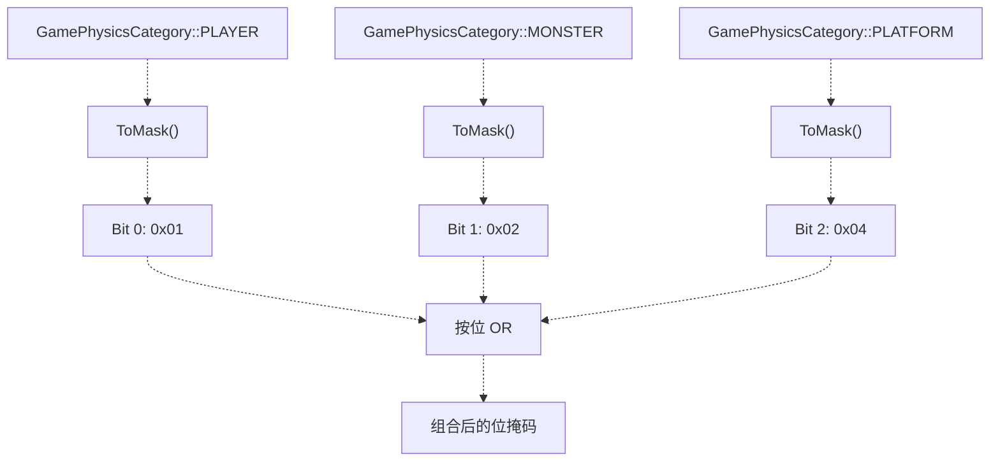
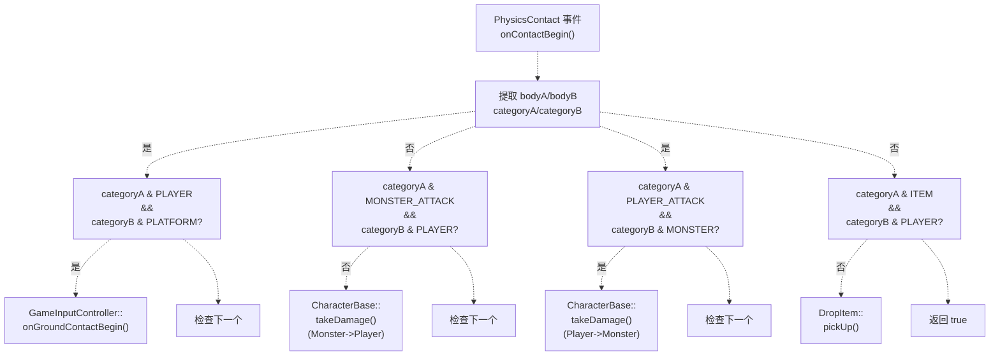

# 物理分类系统

> **相关源文件**
> * [Adventure-King/Classes/Character/Player/SkillSets/AssassinSkillSet.cpp](https://github.com/lilong555/Adventure-King/blob/60df0f40/Adventure-King/Classes/Character/Player/SkillSets/AssassinSkillSet.cpp)
> * [Adventure-King/Classes/Character/Player/SkillSets/WarriorSkillSet.cpp](https://github.com/lilong555/Adventure-King/blob/60df0f40/Adventure-King/Classes/Character/Player/SkillSets/WarriorSkillSet.cpp)
> * [Adventure-King/Classes/Configs/GameConfig.h](https://github.com/lilong555/Adventure-King/blob/60df0f40/Adventure-King/Classes/Configs/GameConfig.h)
> * [Adventure-King/Classes/Scenes/CombatContactHelper.cpp](https://github.com/lilong555/Adventure-King/blob/60df0f40/Adventure-King/Classes/Scenes/CombatContactHelper.cpp)
> * [Adventure-King/Classes/Scenes/DebugScene.cpp](https://github.com/lilong555/Adventure-King/blob/60df0f40/Adventure-King/Classes/Scenes/DebugScene.cpp)
> * [Adventure-King/Classes/Scenes/DebugScene.h](https://github.com/lilong555/Adventure-King/blob/60df0f40/Adventure-King/Classes/Scenes/DebugScene.h)
> * [Adventure-King/Classes/Scenes/GameScene.cpp](https://github.com/lilong555/Adventure-King/blob/60df0f40/Adventure-King/Classes/Scenes/GameScene.cpp)
> * [Adventure-King/Classes/Scenes/GameScene.h](https://github.com/lilong555/Adventure-King/blob/60df0f40/Adventure-King/Classes/Scenes/GameScene.h)
> * [Adventure-King/proj.win32/Adventure-King.vcxproj](https://github.com/lilong555/Adventure-King/blob/60df0f40/Adventure-King/proj.win32/Adventure-King.vcxproj)
> * [Adventure-King/proj.win32/Adventure-King.vcxproj.filters](https://github.com/lilong555/Adventure-King/blob/60df0f40/Adventure-King/proj.win32/Adventure-King.vcxproj.filters)

## 目的与范围

本文解释 Adventure-King 全局使用的物理分类（category）与碰撞过滤系统。该系统定义了哪些游戏实体可以产生物理碰撞（solid collision），以及哪些实体可以在不产生物理碰撞的情况下触发接触事件（contact events）。它构建于 Cocos2d-x 的 `PhysicsBody` 位掩码（bitmask）机制之上。

关于物理引擎的通用配置，请参阅 [初始化流程](<初始化流程.md>)。关于依赖这些分类进行伤害结算的战斗逻辑，请参阅 [战斗接触](<物理与战斗接触回调.md>) 与 [伤害系统](<伤害系统.md>)。

**来源：** [Adventure-King/Classes/Configs/GamePhysicsCategory.h](https://github.com/lilong555/Adventure-King/blob/60df0f40/Adventure-King/Classes/Configs/GamePhysicsCategory.h)

---

## 分类枚举

`GamePhysicsCategory` 枚举定义了游戏中所有可碰撞实体的分类：

| 分类 | 用途 | 常见实体 |
| --- | --- | --- |
| `PLAYER` | 玩家角色本体 | PlayerCharacter 的物理体 |
| `MONSTER` | 敌方角色本体 | MonsterBase、GoblinMonster、GobluMonster |
| `PLATFORM` | 静态地面/平台 | 地面平台、关卡地形 |
| `COLLISION` | 静态障碍物 | 墙体、TMX 导出的碰撞对象 |
| `PLAYER_ATTACK` | 玩家造成伤害的命中框 | 近战攻击盒、技能命中框 |
| `MONSTER_ATTACK` | 怪物造成伤害的命中框 | 敌人攻击命中框 |
| `BOMB` | 投射物本体 | Bomb、Fireball 等投射物 |
| `ITEM` | 可拾取物品 | DropItem 实例 |

该枚举的取值设计用于位掩码运算：每个分类映射到一个唯一 bit 位，以便用按位操作实现过滤。

**来源：** [Adventure-King/Classes/Scenes/GameScene.cpp L486-L494](https://github.com/lilong555/Adventure-King/blob/60df0f40/Adventure-King/Classes/Scenes/GameScene.cpp#L486-L494)

 [Adventure-King/Classes/Scenes/DebugScene.cpp L357-L365](https://github.com/lilong555/Adventure-King/blob/60df0f40/Adventure-King/Classes/Scenes/DebugScene.cpp#L357-L365)

---

## 位掩码转换

### ToMask 函数

`ToMask()` 用于把 `GamePhysicsCategory` 枚举值转换为对应的位掩码表示：

```
inline int ToMask(GamePhysicsCategory category) {
    return 1 << static_cast<int>(category);
}
```

因此可以用按位 OR（bitwise OR）把多个分类组合起来：

```
ToMask(GamePhysicsCategory::PLATFORM | GamePhysicsCategory::COLLISION)
```

**示意图：分类到位掩码的转换**



**来源：** [Adventure-King/Classes/Configs/GamePhysicsCategory.h](https://github.com/lilong555/Adventure-King/blob/60df0f40/Adventure-King/Classes/Configs/GamePhysicsCategory.h)

---

## 三种位掩码

每个 `PhysicsBody` 使用三种不同的位掩码来控制碰撞行为：

### Category Bitmask（类别位掩码）

**函数：** `setCategoryBitmask(int)`
**用途：** 定义该物理体“是什么”。通常一个物理体只属于一个类别。

```
physicsBody->setCategoryBitmask(ToMask(GamePhysicsCategory::PLAYER));
```

### Collision Bitmask（碰撞位掩码）

**函数：** `setCollisionBitmask(int)`
**用途：** 定义该物理体会与哪些类别产生物理碰撞（由物理引擎进行碰撞求解的“实体碰撞”）。

```yaml
physicsBody->setCollisionBitmask(
    ToMask(GamePhysicsCategory::PLATFORM | 
           GamePhysicsCategory::COLLISION |
           GamePhysicsCategory::MONSTER_ATTACK |
           GamePhysicsCategory::ITEM)
);
```

### Contact Test Bitmask（接触测试位掩码）

**函数：** `setContactTestBitmask(int)`
**用途：** 定义哪些类别会触发 `onContactBegin` 回调；不要求发生物理碰撞。

```yaml
physicsBody->setContactTestBitmask(
    ToMask(GamePhysicsCategory::PLATFORM | 
           GamePhysicsCategory::COLLISION |
           GamePhysicsCategory::MONSTER_ATTACK |
           GamePhysicsCategory::ITEM)
);
```

**关键区别：** 通过设置 `contactTestBitmask` 而不设置 `collisionBitmask`，可以在不发生物理碰撞的情况下触发接触回调。这常用于伤害命中框：应当穿过敌人，但仍然触发伤害事件。

**来源：** [Adventure-King/Classes/Scenes/GameScene.cpp L486-L494](https://github.com/lilong555/Adventure-King/blob/60df0f40/Adventure-King/Classes/Scenes/GameScene.cpp#L486-L494)

 [Adventure-King/Classes/Scenes/DebugScene.cpp L357-L365](https://github.com/lilong555/Adventure-King/blob/60df0f40/Adventure-King/Classes/Scenes/DebugScene.cpp#L357-L365)

---

## 常见配置模式

### 玩家 Physics Body

玩家通常需要：

* 走在平台上（collision + contact）
* 被怪物攻击命中（仅 contact，不要实体碰撞）
* 拾取物品（仅 contact）

```yaml
// 来自 GameScene.cpp:486-494
physicsBody->setCategoryBitmask(ToMask(GamePhysicsCategory::PLAYER));

physicsBody->setCollisionBitmask(
    ToMask(GamePhysicsCategory::PLATFORM |
           GamePhysicsCategory::COLLISION |
           GamePhysicsCategory::MONSTER_ATTACK |
           GamePhysicsCategory::ITEM)
);

physicsBody->setContactTestBitmask(
    ToMask(GamePhysicsCategory::PLATFORM |
           GamePhysicsCategory::COLLISION |
           GamePhysicsCategory::MONSTER_ATTACK |
           GamePhysicsCategory::ITEM)
);
```

**注：** `MONSTER_ATTACK` 与 `ITEM` 同时出现在 collision 与 contact 掩码中，但具体交互是否“实体阻挡”由攻击命中框的配置决定。

**来源：** [Adventure-King/Classes/Scenes/GameScene.cpp L480-L496](https://github.com/lilong555/Adventure-King/blob/60df0f40/Adventure-King/Classes/Scenes/GameScene.cpp#L480-L496)

---

### 平台 Physics Body

平台是静态物体，会与所有移动实体发生碰撞：

```yaml
// 来自 DebugScene.cpp:257-263
physicsBody->setDynamic(false);
physicsBody->setCategoryBitmask(ToMask(GamePhysicsCategory::PLATFORM));

physicsBody->setCollisionBitmask(
    ToMask(GamePhysicsCategory::PLAYER |
           GamePhysicsCategory::BOMB |
           GamePhysicsCategory::MONSTER)
);

physicsBody->setContactTestBitmask(
    ToMask(GamePhysicsCategory::PLAYER |
           GamePhysicsCategory::BOMB |
           GamePhysicsCategory::MONSTER)
);
```

**来源：** [Adventure-King/Classes/Scenes/DebugScene.cpp L251-L267](https://github.com/lilong555/Adventure-King/blob/60df0f40/Adventure-King/Classes/Scenes/DebugScene.cpp#L251-L267)

---

### 攻击命中框（幽灵碰撞）

玩家与怪物的攻击命中框通常使用“幽灵碰撞”：触发接触事件但不阻挡移动：

```
// 攻击命中框不设置 collisionBitmask，只设置 contactTestBitmask
physicsBody->setCategoryBitmask(ToMask(GamePhysicsCategory::PLAYER_ATTACK));
physicsBody->setCollisionBitmask(0);  // 不发生实体碰撞
physicsBody->setContactTestBitmask(ToMask(GamePhysicsCategory::MONSTER));
```

这样攻击可以穿过敌人（支持多段命中等场景），同时仍会触发伤害回调。

**来源：** 模式参考 [Adventure-King/Classes/Scenes/CombatContactHelper.cpp L163-L212](https://github.com/lilong555/Adventure-King/blob/60df0f40/Adventure-King/Classes/Scenes/CombatContactHelper.cpp#L163-L212)

---

## 接触事件处理

`CombatContactHelper` 类负责处理物理接触事件，并使用类别位掩码将事件路由到对应逻辑。

**示意图：接触事件处理流程**



**来源：** [Adventure-King/Classes/Scenes/CombatContactHelper.cpp L27-L215](https://github.com/lilong555/Adventure-King/blob/60df0f40/Adventure-King/Classes/Scenes/CombatContactHelper.cpp#L27-L215)

---

### 地面接触检测

玩家的落地检测使用接触法线（contact normal）来判断是否与下方地面接触：

```javascript
// 来自 CombatContactHelper.cpp:51-68
const bool playerIsA = (categoryA & ToMask(GamePhysicsCategory::PLAYER)) != 0;
const bool playerIsB = (categoryB & ToMask(GamePhysicsCategory::PLAYER)) != 0;
const bool platformContact =
    (playerIsA && ((categoryB & ToMask(GamePhysicsCategory::PLATFORM | 
                                       GamePhysicsCategory::COLLISION)) != 0)) ||
    (playerIsB && ((categoryA & ToMask(GamePhysicsCategory::PLATFORM | 
                                       GamePhysicsCategory::COLLISION)) != 0));

if (platformContact && inputController) {
    Vec2 normal = contactData->normal;
    if (playerIsB) {
        normal = -normal;
    }
    inputController->onGroundContactBegin(normal.y);
}
```

在 `GameInputController` 中会检查法线向量的 Y 分量，以判断是否为地面接触（`normal.y > threshold`）。

**来源：** [Adventure-King/Classes/Scenes/CombatContactHelper.cpp L51-L68](https://github.com/lilong555/Adventure-King/blob/60df0f40/Adventure-King/Classes/Scenes/CombatContactHelper.cpp#L51-L68)

---

### 伤害事件路由

伤害事件会根据攻击类别路由：

```javascript
// 来自 CombatContactHelper.cpp:163-212
const bool playerAttackVsMonster =
    ((categoryA & ToMask(GamePhysicsCategory::PLAYER_ATTACK)) != 0 && 
     (categoryB & ToMask(GamePhysicsCategory::MONSTER)) != 0) ||
    ((categoryB & ToMask(GamePhysicsCategory::PLAYER_ATTACK)) != 0 && 
     (categoryA & ToMask(GamePhysicsCategory::MONSTER)) != 0);

if (playerAttackVsMonster && player) {
    auto attackBody = ((categoryA & ToMask(GamePhysicsCategory::PLAYER_ATTACK)) != 0) 
                      ? bodyA : bodyB;
    auto monsterNode = ((categoryA & ToMask(GamePhysicsCategory::MONSTER)) != 0) 
                       ? nodeA : nodeB;
    auto monster = dynamic_cast<CharacterBase*>(monsterNode);
    
    if (monster && !monster->isDead()) {
        // 从 body tag 中提取伤害值，并安排在下一帧应用伤害
        float rawDamage = static_cast<float>(attackBody->getTag());
        bool isCrit = rawDamage < 0.0f;
        // ... schedule takeDamage on next frame
    }
}
```

**延迟执行：** 通过 `scheduleOnce` 应用伤害，避免在物理回调期间修改场景图，否则可能导致崩溃。

**来源：** [Adventure-King/Classes/Scenes/CombatContactHelper.cpp L163-L212](https://github.com/lilong555/Adventure-King/blob/60df0f40/Adventure-King/Classes/Scenes/CombatContactHelper.cpp#L163-L212)

---

### 物品拾取检测

物品也使用同一套接触系统来实现自动拾取：

```javascript
// 来自 CombatContactHelper.cpp:128-157
const bool itemVsPlayer =
    ((categoryA & ToMask(GamePhysicsCategory::ITEM)) != 0 && 
     (categoryB & ToMask(GamePhysicsCategory::PLAYER)) != 0) ||
    ((categoryB & ToMask(GamePhysicsCategory::ITEM)) != 0 && 
     (categoryA & ToMask(GamePhysicsCategory::PLAYER)) != 0);

if (itemVsPlayer && player) {
    auto itemNode = ((categoryA & ToMask(GamePhysicsCategory::ITEM)) != 0) 
                    ? nodeA : nodeB;
    auto dropItem = dynamic_cast<DropItem*>(itemNode);
    if (dropItem) {
        std::string key = StringUtils::format("defer_pickup_%p_%p",
                                              static_cast<void*>(dropItem),
                                              static_cast<void*>(player));
        if (!dropItem->isScheduled(key))
        {
            dropItem->scheduleOnce(
                [dropItem, player](float)
                {
                    if (!dropItem || !player || player->isDead())
                    {
                        return;
                    }
                    dropItem->pickUp(player);
                },
                0.0f,
                key);
        }
    }
}
```

**来源：** [Adventure-King/Classes/Scenes/CombatContactHelper.cpp L128-L157](https://github.com/lilong555/Adventure-King/blob/60df0f40/Adventure-King/Classes/Scenes/CombatContactHelper.cpp#L128-L157)

---

## 与战斗系统的集成

### 生成攻击命中框

玩家与怪物的攻击系统会生成临时命中框节点，并设置为 `PLAYER_ATTACK` 或 `MONSTER_ATTACK` 类别：

```python
// 来自 WarriorSkillSet 与 AssassinSkillSet 的模式
player.spawnPlayerAttackHitbox(
    Vec2(centerX, centerY),
    Size(width, height),
    damage,
    isCritical,
    lifetimeSeconds,
    breakDamage
);
```

`spawnPlayerAttackHitbox` 会创建带物理体的节点，并配置为：

* Category：`PLAYER_ATTACK`
* Collision：`0`（不发生实体碰撞）
* Contact Test：`MONSTER`（触发回调）

该物理体的 `tag` 字段存储伤害值（暴击时为负数）。

**来源：** [Adventure-King/Classes/Character/Player/SkillSets/WarriorSkillSet.cpp L325-L330](https://github.com/lilong555/Adventure-King/blob/60df0f40/Adventure-King/Classes/Character/Player/SkillSets/WarriorSkillSet.cpp#L325-L330)

 [Adventure-King/Classes/Character/Player/SkillSets/AssassinSkillSet.cpp L113-L118](https://github.com/lilong555/Adventure-King/blob/60df0f40/Adventure-King/Classes/Character/Player/SkillSets/AssassinSkillSet.cpp#L113-L118)

---

### 分类矩阵

下表展示了各类别之间通过接触事件（contact events）产生交互的关系：

| 类别 | PLAYER | MONSTER | PLATFORM | PLAYER_ATTACK | MONSTER_ATTACK | ITEM | BOMB |
| --- | --- | --- | --- | --- | --- | --- | --- |
| **PLAYER** | - | 否 | 是 | 否 | 是 | 是 | 否 |
| **MONSTER** | 否 | - | 是 | 是 | 否 | 否 | 否 |
| **PLATFORM** | 是 | 是 | - | 否 | 否 | 否 | 是 |
| **PLAYER_ATTACK** | 否 | 是 | 否 | - | 否 | 否 | 否 |
| **MONSTER_ATTACK** | 是 | 否 | 否 | 否 | - | 否 | 否 |
| **ITEM** | 是 | 否 | 否 | 否 | 否 | - | 否 |
| **BOMB** | 否 | 否 | 是 | 否 | 否 | 否 | - |

**如何解读：** “是”表示这些类别之间会触发接触回调；是否发生实体碰撞取决于 `collisionBitmask` 的配置。

**来源：** 由 [Adventure-King/Classes/Scenes/CombatContactHelper.cpp L27-L215](https://github.com/lilong555/Adventure-King/blob/60df0f40/Adventure-King/Classes/Scenes/CombatContactHelper.cpp#L27-L215) 推导

---

## 调试可视化

启用物理调试绘制（debug draw）后，类别位掩码会以不同颜色的轮廓显示：

```
// 来自 DebugScene.cpp:106
physicsWorld->setDebugDrawMask(PhysicsWorld::DEBUGDRAW_ALL);
```

每个物理体会显示：

* 形状轮廓
* 接触法线向量
* 速度向量
* 类别信息

这有助于在开发过程中验证分类配置是否正确。

**来源：** [Adventure-King/Classes/Scenes/DebugScene.cpp L100-L107](https://github.com/lilong555/Adventure-King/blob/60df0f40/Adventure-King/Classes/Scenes/DebugScene.cpp#L100-L107)

---

## 最佳实践

### 1. 为实体类型使用正确的分类

每个实体应当恰好属于一个类别：

* 玩家角色：`PLAYER`
* 敌方角色：`MONSTER`
* 地形：`PLATFORM` 或 `COLLISION`
* 攻击命中框：`PLAYER_ATTACK` 或 `MONSTER_ATTACK`

### 2. 将实体碰撞与接触事件分离

对于幽灵命中框（攻击穿透目标）：

* `collisionBitmask` 设为 `0`
* `contactTestBitmask` 只设置目标类别

### 3. 始终延迟执行伤害/状态变化

不要在接触回调里直接修改场景图或游戏状态：

```xml
// 错误：直接修改
monster->takeDamage(dmg);

// 正确：延迟执行
monster->scheduleOnce(
    [monster, dmg](float)
    {
        if (!monster || monster->isDead())
        {
            return;
        }
        monster->takeDamage(dmg);
    },
    0.0f,
    "unique_key");
```

### 4. 延迟回调使用唯一 key

通过使用同时编码攻击者与受击者的唯一 key，避免重复伤害事件：

```cpp
std::string key = StringUtils::format("defer_dmg_%p_%p",
                                      static_cast<void*>(attackBody),
                                      static_cast<void*>(victim));
```

**来源：** [Adventure-King/Classes/Scenes/CombatContactHelper.cpp L100-L121](https://github.com/lilong555/Adventure-King/blob/60df0f40/Adventure-King/Classes/Scenes/CombatContactHelper.cpp#L100-L121)

 [Adventure-King/Classes/Scenes/CombatContactHelper.cpp L193-L209](https://github.com/lilong555/Adventure-King/blob/60df0f40/Adventure-King/Classes/Scenes/CombatContactHelper.cpp#L193-L209)

---

## 总结

物理分类系统提供了：

1. **类型明确：** 每个实体都归属到一个定义清晰的类别
2. **灵活过滤：** 三位掩码体系可精细控制“碰撞”与“接触”
3. **幽灵碰撞：** 攻击命中框可检测命中但不阻挡移动
4. **事件路由：** 类别使接触回调的分发更高效

该系统是游戏中战斗、移动与物品拾取机制的基础设施。

**来源：** [Adventure-King/Classes/Configs/GamePhysicsCategory.h](https://github.com/lilong555/Adventure-King/blob/60df0f40/Adventure-King/Classes/Configs/GamePhysicsCategory.h)

 [Adventure-King/Classes/Scenes/CombatContactHelper.cpp](https://github.com/lilong555/Adventure-King/blob/60df0f40/Adventure-King/Classes/Scenes/CombatContactHelper.cpp)

 [Adventure-King/Classes/Scenes/GameScene.cpp L480-L496](https://github.com/lilong555/Adventure-King/blob/60df0f40/Adventure-King/Classes/Scenes/GameScene.cpp#L480-L496)
