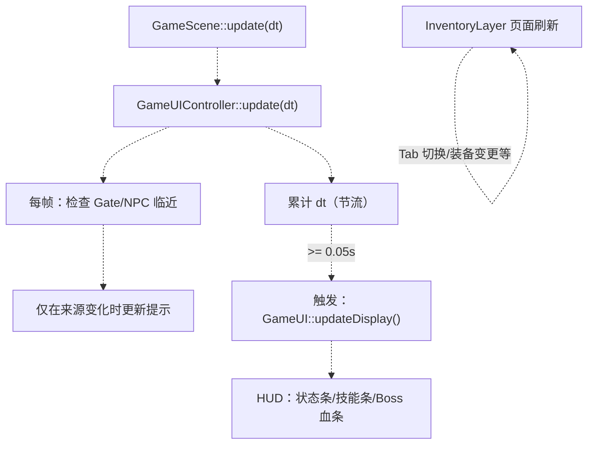
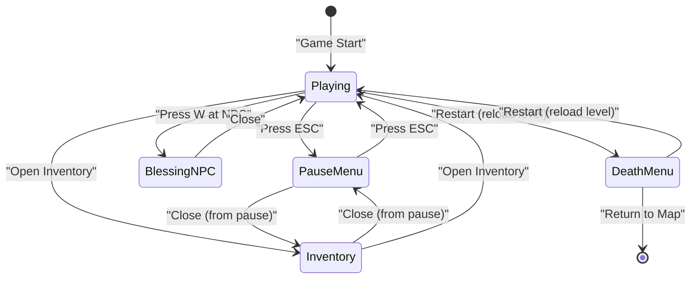
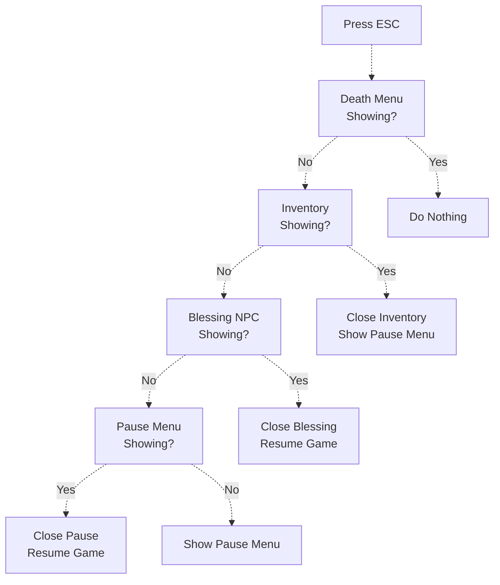

# 玩家 UI 组件

> **相关源文件**
> * [Adventure-King/Classes/Character/Player/PlayerCharacter.cpp](https://github.com/lilong555/Adventure-King/blob/60df0f40/Adventure-King/Classes/Character/Player/PlayerCharacter.cpp)
> * [Adventure-King/Classes/Character/Player/PlayerCharacter.h](https://github.com/lilong555/Adventure-King/blob/60df0f40/Adventure-King/Classes/Character/Player/PlayerCharacter.h)
> * [Adventure-King/Classes/Configs/GameSceneConfig.h](https://github.com/lilong555/Adventure-King/blob/60df0f40/Adventure-King/Classes/Configs/GameSceneConfig.h)
> * [Adventure-King/Classes/GameUI.cpp](https://github.com/lilong555/Adventure-King/blob/60df0f40/Adventure-King/Classes/GameUI.cpp)
> * [Adventure-King/Classes/GameUI.h](https://github.com/lilong555/Adventure-King/blob/60df0f40/Adventure-King/Classes/GameUI.h)
> * [Adventure-King/Classes/Scenes/GameInputController.cpp](https://github.com/lilong555/Adventure-King/blob/60df0f40/Adventure-King/Classes/Scenes/GameInputController.cpp)
> * [Adventure-King/Classes/Scenes/GameInputController.h](https://github.com/lilong555/Adventure-King/blob/60df0f40/Adventure-King/Classes/Scenes/GameInputController.h)
> * [Adventure-King/Classes/Scenes/GameUIController.cpp](https://github.com/lilong555/Adventure-King/blob/60df0f40/Adventure-King/Classes/Scenes/GameUIController.cpp)
> * [Adventure-King/Classes/Scenes/GameUIController.h](https://github.com/lilong555/Adventure-King/blob/60df0f40/Adventure-King/Classes/Scenes/GameUIController.h)
> * [Adventure-King/Classes/UI/InventoryLayer.cpp](https://github.com/lilong555/Adventure-King/blob/60df0f40/Adventure-King/Classes/UI/InventoryLayer.cpp)
> * [Adventure-King/Classes/UI/InventoryLayer.h](https://github.com/lilong555/Adventure-King/blob/60df0f40/Adventure-King/Classes/UI/InventoryLayer.h)
> * [Adventure-King/Classes/UI/SkillBar.cpp](https://github.com/lilong555/Adventure-King/blob/60df0f40/Adventure-King/Classes/UI/SkillBar.cpp)
> * [Adventure-King/Resources/Scene/UI/bag.png](https://github.com/lilong555/Adventure-King/blob/60df0f40/Adventure-King/Resources/Scene/UI/bag.png)
> * [Adventure-King/Resources/Scene/UI/bagSelected.png](https://github.com/lilong555/Adventure-King/blob/60df0f40/Adventure-King/Resources/Scene/UI/bagSelected.png)

## 目的与范围

本页记录 Adventure-King 中用于展示并与玩家状态交互的 UI 组件。这些组件可视化玩家属性（HP/MP/XP）、技能（冷却、槽位）、装备与成长进度。所有玩家 UI 组件遵循一致的绑定模式：持有 `PlayerCharacter` 的引用，并在周期性更新中读取其状态。

关于 UI 状态管理与编排（暂停菜单、可见性控制、模态切换），请参见 [GameUIController](<游戏 UI 控制器（GameUIController）.md>)。关于驱动玩家动作的键盘输入处理，请参见 [GameInputController](<游戏输入控制器（GameInputController）.md>)。关于具体组件的细节实现，请参见 [InventoryLayer](<背包层（InventoryLayer）.md>) 与 [HUD Elements](<HUD 元素.md>)。

## 组件架构

### 组件层级

```mermaid
flowchart TD

GameUI["GameUI<br>(Root Container)"]
PSB["PlayerStatusBar<br>HP/MP/XP Bars"]
SB["SkillBar<br>Skill Slots + Cooldowns"]
BHB["BossHealthBar<br>Boss HP + Break Meter"]
IH["InteractionHint<br>Gate/NPC Prompts"]
LN["LevelNameLabel<br>Current Level Display"]
PM["PauseMenu<br>Pause/Save/Load"]
IL["InventoryLayer<br>Equipment/Skills/Attributes"]
BNL["BlessingNpcLayer<br>NPC Buff Selection"]
DM["PlayerDeathMenu<br>Restart/Return Options"]
MB["MapButton<br>Return to Map"]
IB["InventoryButton<br>Toggle Inventory"]

GameUI -.-> PSB
GameUI -.-> SB
GameUI -.-> BHB
GameUI -.-> IH
GameUI -.-> LN
GameUI -.-> PM
GameUI -.-> IL
GameUI -.-> BNL
GameUI -.-> DM
GameUI -.-> MB
GameUI -.-> IB

subgraph subGraph2 ["Navigation Buttons"]
    MB
    IB
end

subgraph subGraph1 ["Modal Components (Toggle Visibility)"]
    PM
    IL
    BNL
    DM
end

subgraph subGraph0 ["HUD Components (Always Visible)"]
    PSB
    SB
    BHB
    IH
    LN
end
```

**来源**：[Classes/GameUI.cpp L32-L88](https://github.com/lilong555/Adventure-King/blob/60df0f40/Classes/GameUI.cpp#L32-L88)

 [Classes/GameUI.h L32-L270](https://github.com/lilong555/Adventure-King/blob/60df0f40/Classes/GameUI.h#L32-L270)

### 组件初始化顺序

`GameUI` 会在 `init()` 中按固定顺序创建所有 UI 组件，以建立正确的 z-order：

| 组件 | 创建方法 | Z-Order | 用途 |
| --- | --- | --- | --- |
| `PlayerStatusBar` | `createPlayerStatusBar()` | 10 | HP/MP/XP 显示 |
| `SkillBar` | `createSkillBar()` | 10 | 技能槽位与冷却 |
| `BossHealthBar` | `createBossHealthBar()` | 10 | Boss 血条与破韧条 |
| `PauseMenu` | `createPauseMenu()` | 100 | 暂停相关操作 |
| `InventoryLayer` | `createInventoryLayer()` | 101 | 装备/技能/属性管理（模态界面） |
| `PlayerDeathMenu` | `createDeathMenu()` | 200 | 死亡菜单（强制暂停，阻断其它 UI） |
| `BlessingNpcLayer` | `createBlessingNpcLayer()` | 220 | 赐福 NPC 弹窗（覆盖背包/暂停） |
| `InteractionHint` | `createInteractionHint()` | 10 | 门/NPC 交互提示 |
| `LevelNameLabel` | `createLevelNameLabel()` | 10 | 当前关卡名显示 |
| `MapButton` | `createMapButton()` | 10 | 返回地图按钮 |
| `InventoryButton` | `createInventoryButton()` | 10 | HUD 背包按钮（等同按 B） |

### 更新节流与刷新边界

`GameUIController::update(dt)` 每帧运行，但会把“UI 全量刷新”做节流（默认 0.05s 一次），同时单独对交互提示做每帧检查以保证响应性。

**交互提示更新：**

* 每帧检查（不做节流），以确保提示响应及时
* 优先级顺序：`BLESSING_NPC` > `GATE` > `NONE`
* 仅在来源变化时更新提示文本：[Classes/Scenes/GameUIController.cpp L362-L388](https://github.com/lilong555/Adventure-King/blob/60df0f40/Classes/Scenes/GameUIController.cpp#L362-L388)

**来源**：[Classes/Scenes/GameUIController.cpp L357-L399](https://github.com/lilong555/Adventure-King/blob/60df0f40/Classes/Scenes/GameUIController.cpp#L357-L399)

 [Classes/GameUI.cpp L422-L441](https://github.com/lilong555/Adventure-King/blob/60df0f40/Classes/GameUI.cpp#L422-L441)

 [Classes/UI/InventoryLayer.cpp L804-L827](https://github.com/lilong555/Adventure-King/blob/60df0f40/Classes/UI/InventoryLayer.cpp#L804-L827)

## 与 GameUIController 的集成

### 可见性状态管理

`GameUIController` 会编排各模态界面的显示/隐藏，以避免 UI 冲突。优先级层级如下：

1. **死亡菜单**（最高）- 阻断所有输入，仅显示重开/返回选项
2. **祝福 NPC** - 阻断玩法输入，允许 NPC 交互
3. **背包** - 阻断玩法输入，允许背包管理
4. **暂停菜单** - 阻断玩法输入，显示暂停选项
5. **HUD**（常驻）- 状态条、技能条、提示等

**上下文标记：**

| 标记 | 类型 | 用途 |
| --- | --- | --- |
| `_paused` | `bool` | 游戏模拟是否暂停 |
| `_inventoryReturnToPauseOnClose` | `bool` | 从暂停菜单进入背包 → 关闭时返回暂停 |
| `_deathMenuShowing` | `bool`（通过 GameUI） | 死亡菜单激活 → 阻断其他 UI |

**可见性切换流程：**

**ESC 键行为（按优先级顺序）：**

**来源**：[Classes/Scenes/GameUIController.cpp L401-L445](https://github.com/lilong555/Adventure-King/blob/60df0f40/Classes/Scenes/GameUIController.cpp#L401-L445)

 [Classes/Scenes/GameUIController.cpp L447-L481](https://github.com/lilong555/Adventure-King/blob/60df0f40/Classes/Scenes/GameUIController.cpp#L447-L481)

 [Classes/Scenes/GameUIController.h L16-L83](https://github.com/lilong555/Adventure-King/blob/60df0f40/Classes/Scenes/GameUIController.h#L16-L83)

### 组件访问方法

`GameUI` 为 `GameUIController` 提供了一组 accessor 方法，以控制可见性：

| 方法 | 用途 | 模态 Z-Order |
| --- | --- | --- |
| `showPauseMenu()` / `hidePauseMenu()` | 显示/隐藏暂停遮罩 | 100 |
| `showInventory()` / `hideInventory()` | 显示/隐藏装备/技能 UI | 101 |
| `showBlessingNpc()` / `hideBlessingNpc()` | 显示/隐藏 NPC 增益选择 | 220 |
| `showDeathMenu()` / `hideDeathMenu()` | 显示/隐藏死亡界面 | 200 |
| `isPauseMenuShowing()` / `isInventoryShowing()` / 等 | 查询可见性状态 | N/A |

**回调注册：**

* `PauseMenu` 把 `resumeCallback`、`saveCallback`、`loadCallback`、`inventoryCallback` 注册给 `GameUIController`
* `InventoryLayer` 注册 `closeCallback`，用于决定关闭后的返回状态
* `PlayerDeathMenu` 注册 `restartCallback`、`returnToMapCallback`

**来源**：[Classes/GameUI.cpp L303-L364](https://github.com/lilong555/Adventure-King/blob/60df0f40/Classes/GameUI.cpp#L303-L364)

 [Classes/Scenes/GameUIController.cpp L80-L231](https://github.com/lilong555/Adventure-King/blob/60df0f40/Classes/Scenes/GameUIController.cpp#L80-L231)

 [Classes/GameUI.h L88-L149](https://github.com/lilong555/Adventure-King/blob/60df0f40/Classes/GameUI.h#L88-L149)
