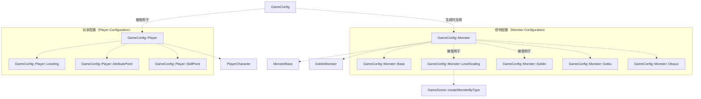
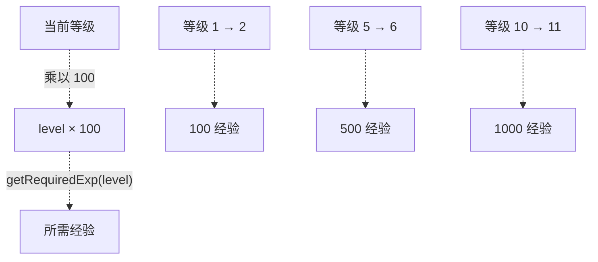
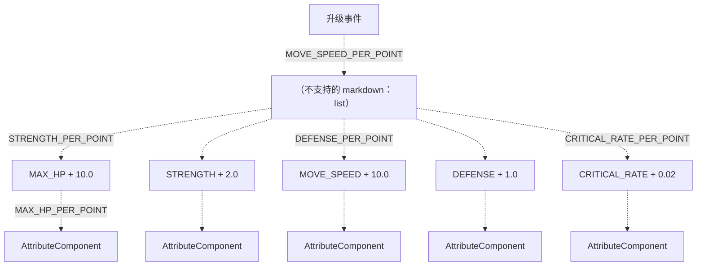
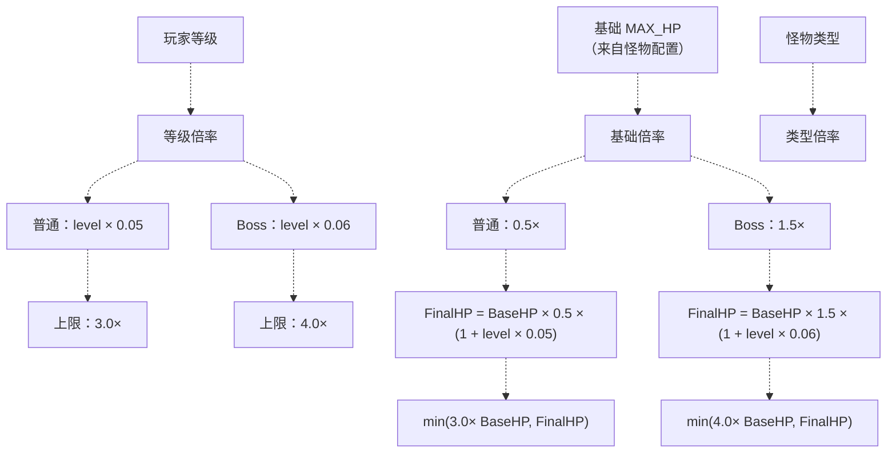
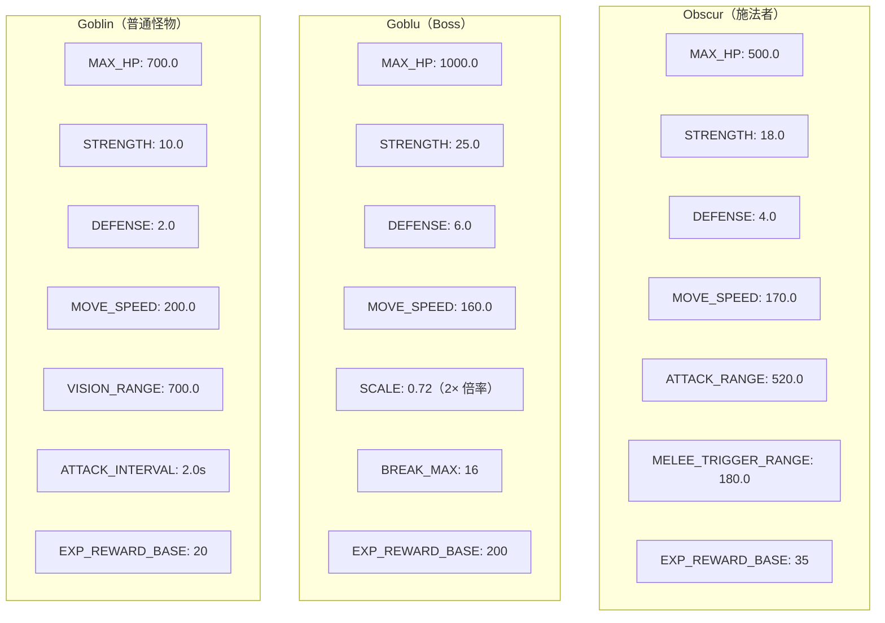
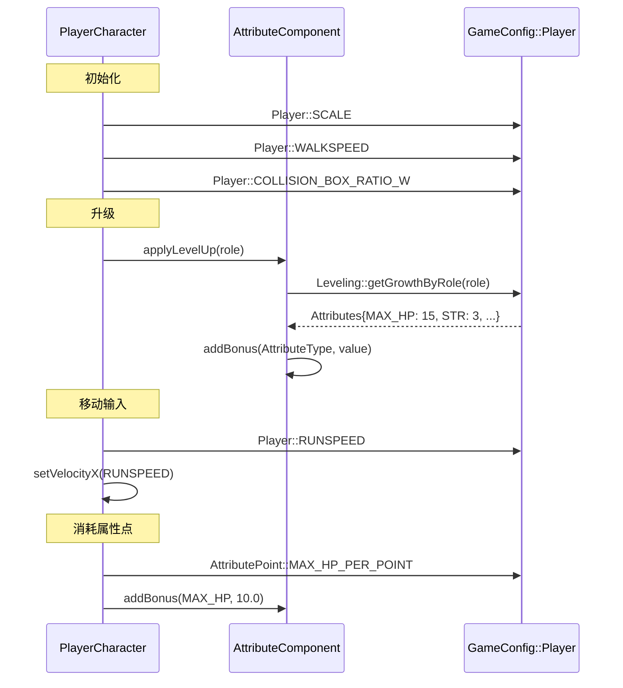
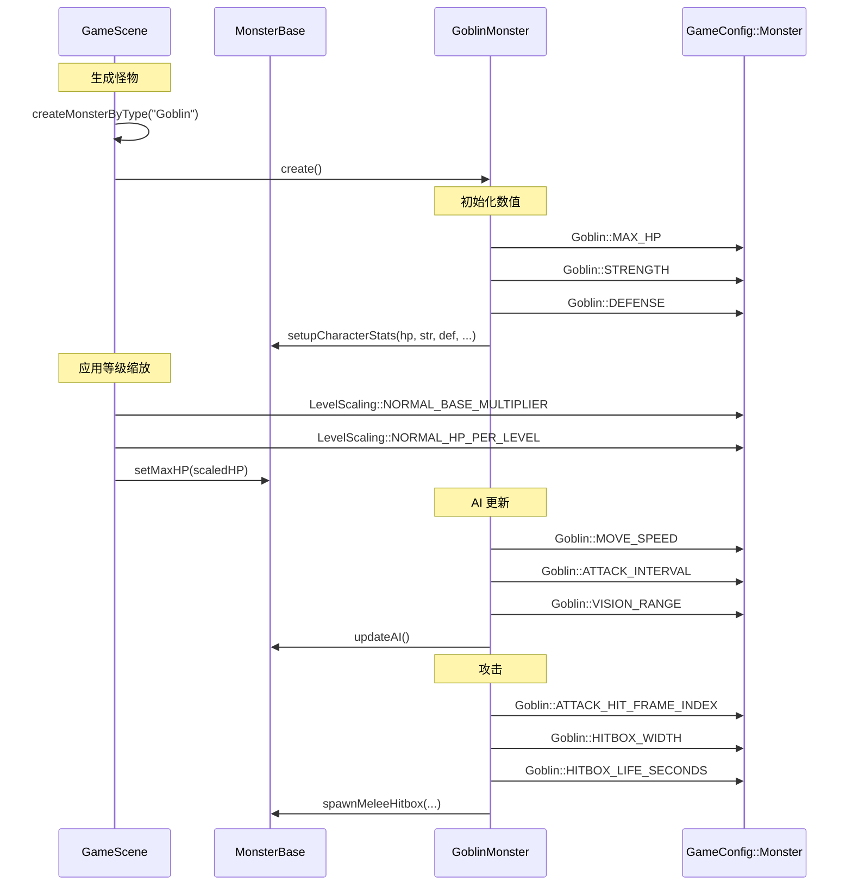
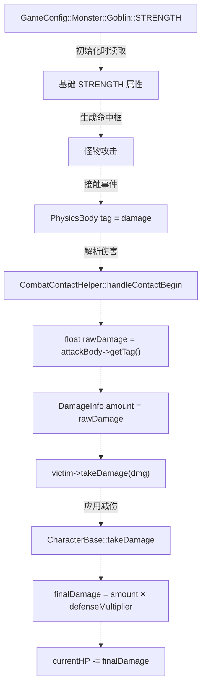

# 玩家与怪物配置（Player and Monster Configuration）

> **相关源文件**
> * [Adventure-King/Classes/Character/Player/SkillSets/AssassinSkillSet.cpp](https://github.com/lilong555/Adventure-King/blob/60df0f40/Adventure-King/Classes/Character/Player/SkillSets/AssassinSkillSet.cpp)
> * [Adventure-King/Classes/Character/Player/SkillSets/WarriorSkillSet.cpp](https://github.com/lilong555/Adventure-King/blob/60df0f40/Adventure-King/Classes/Character/Player/SkillSets/WarriorSkillSet.cpp)
> * [Adventure-King/Classes/Configs/GameConfig.h](https://github.com/lilong555/Adventure-King/blob/60df0f40/Adventure-King/Classes/Configs/GameConfig.h)
> * [Adventure-King/Classes/Scenes/CombatContactHelper.cpp](https://github.com/lilong555/Adventure-King/blob/60df0f40/Adventure-King/Classes/Scenes/CombatContactHelper.cpp)

本页记录 `GameConfig.h` 中的玩家与怪物配置系统：它作为所有“角色相关”数值参数、成长曲线与缩放公式的集中仓库，覆盖玩家移动速度、升级进度、属性点分配、怪物基础属性、AI 参数以及基于等级的难度缩放等。

关于技能相关配置（冷却、伤害倍率、命中框参数）请参见 [技能与装备配置](技能与装备配置.md)。关于战斗公式与状态效果请参见 [战斗与世界配置](战斗与世界配置.md)。关于消费这些配置的运行时系统请参见 [玩家角色（PlayerCharacter）](玩家角色（PlayerCharacter）.md) 与 [怪物基类（MonsterBase）](怪物基类（MonsterBase）.md)。

---

## 配置架构

玩家与怪物配置系统在 `GameConfig.h` 中以嵌套命名空间组织，提供编译期常量与计算函数。所有配置值都是只读的，游戏系统直接访问，不需要在运行时解析或加载。

**配置命名空间层级**

来源： [Adventure-King/Classes/Configs/GameConfig.h L11-L716](https://github.com/lilong555/Adventure-King/blob/60df0f40/Adventure-King/Classes/Configs/GameConfig.h#L11-L716)

---

## 玩家配置

玩家配置命名空间定义了所有与玩家相关的常量：包括移动/物理参数、碰撞盒尺寸、不同职业的精灵缩放差异，以及升级成长系统等。

### 移动与物理参数

玩家移动由一组速度常量与物理参数控制，用于定义行走、奔跑、跳跃等行为表现。

| 参数 | 值 | 用途 |
| --- | --- | --- |
| `WALKSPEED` | 220.0f | 基础步行速度（像素/秒） |
| `RUNSPEED` | 350.0f | 冲刺/奔跑速度 |
| `JUMP_FORCE` | 400.0f | 垂直跳跃冲量 |
| `MAX_JUMP_COUNT` | 2 | 最大连续跳次数（双跳） |
| `JUMP_IMPULSE` | 650.0f | 单次跳跃的速度冲量 |
| `SCALE` | 0.4f | 基础精灵缩放系数 |
| `COLLISION_BOX_RATIO_W` | 0.8f | 碰撞盒宽度占精灵宽度比例 |
| `COLLISION_BOX_RATIO_H` | 0.9f | 碰撞盒高度占精灵高度比例 |

**职业差异化精灵缩放（Role-Specific Sprite Scaling）**

不同职业使用的精灵资源尺寸并不一致，因此通过“精灵缩放倍率”做补偿，以保证在游戏内的视觉尺寸尽量一致：

* **Warrior**：`WARRIOR_SPRITE_SCALE_MULTIPLIER = 1.0f`（基准）
* **Assassin**：`ASSASSIN_SPRITE_SCALE_MULTIPLIER = 1.8f`（基础精灵更小，因此放大）

此外，刺客使用“固定碰撞盒尺寸”，而不是按精灵比例计算，以避免碰撞盒过宽：

* `ASSASSIN_COLLISION_BOX_WIDTH = 137.0f`
* `ASSASSIN_COLLISION_BOX_HEIGHT = 280.0f`

来源： [Adventure-King/Classes/Configs/GameConfig.h L186-L217](https://github.com/lilong555/Adventure-King/blob/60df0f40/Adventure-King/Classes/Configs/GameConfig.h#L186-L217)

### 升级与经验系统

升级系统采用线性经验曲线，并按职业定义每级属性成长幅度。

**经验需求（Experience Requirements）**

`GameConfig::Player::Leveling::getRequiredExp(int level)` 用于实现该计算，并对最小等级做 clamp 处理，以防传入无效等级导致结果异常。

**职业成长曲线（Role-Specific Growth Curves）**

`GameConfig::Player::Leveling::getGrowthByRole(CharacterRole role)` 会返回一个 `Attributes` 对象，定义该职业“每级增加”的属性值：

| 职业（Role） | MAX_HP/level | MAX_MP/level | STRENGTH/level | DEFENSE/level |
| --- | --- | --- | --- | --- |
| WARRIOR | 15.0 | 2.0 | 3.0 | 1.5 |
| MAGE | 8.0 | 10.0 | 1.0 | 0.5 |
| 默认（Default） | 10.0 | 0.0 | 2.0 | 0.0 |

来源： [Adventure-King/Classes/Configs/GameConfig.h L219-L260](https://github.com/lilong555/Adventure-King/blob/60df0f40/Adventure-King/Classes/Configs/GameConfig.h#L219-L260)

### 属性点与技能点系统

玩家每次升级都会获得点数，可用于永久属性提升或解锁技能。

**属性点分配（Attribute Point Allocation）**

每升一级会获得 `POINTS_PER_LEVEL = 1` 点属性点。玩家可以把它分配给五种属性类型之一；每种属性的固定增量由 `GameConfig::Player::AttributePoint` 中的常量定义。

**技能点分配（Skill Point Allocation）**

技能点系统采用“双货币”模型，将主动技能与被动技能的解锁点数分开计算：

* `ACTIVE_POINTS_PER_LEVEL = 1`：用于学习主动技能（Q/E/K 等槽位）
* `PASSIVE_POINTS_PER_LEVEL = 1`：用于学习被动技能（永久增益）

来源： [Adventure-King/Classes/Configs/GameConfig.h L262-L281](https://github.com/lilong555/Adventure-King/blob/60df0f40/Adventure-King/Classes/Configs/GameConfig.h#L262-L281)

---

## 怪物配置

怪物配置按层级组织：包含“共享基础参数”以及“按怪物类型的特化参数”。每种怪物类型都会定义自己的数值、AI 行为、攻击模式与视觉表现参数。

### 怪物基础参数

`GameConfig::Monster::Base` 命名空间提供所有怪物共享的默认值；若具体怪物类型有特化配置，则会覆盖这些默认值：

| 参数 | 值 | 用途 |
| --- | --- | --- |
| `SCALE` | 0.36f | 默认精灵缩放 |
| `PHYSICS_BOX_RATIO_W` | 0.35f | 碰撞盒宽度比例 |
| `PHYSICS_BOX_RATIO_H` | 0.9f | 碰撞盒高度比例 |
| `ACTIVE_UPDATE_DISTANCE_MULTIPLIER` | 1.5f | 进入“活跃更新”的距离倍率 |
| `AI_UPDATE_INTERVAL` | 0.1f | 活跃 AI 决策间隔（秒） |
| `AI_INACTIVE_UPDATE_INTERVAL` | 0.3f | 非活跃/远距离 AI 决策间隔 |
| `MOVE_UPDATE_INTERVAL` | 0.033f | 移动更新间隔 |
| `ATTACK_UPDATE_INTERVAL` | 0.05f | 攻击状态更新间隔 |
| `HP_BAR_WIDTH` | 60.0f | 血条宽度（像素） |
| `HP_BAR_HEIGHT` | 8.0f | 血条高度 |
| `PATROL_REACH_EPSILON` | 8.0f | 判定“到达巡逻点”的距离阈值 |
| `CHASE_DEADZONE_X` | 8.0f | 追击移动的水平死区 |
| `FACE_DEADZONE_X` | 8.0f | 朝向切换的水平死区 |

来源： [Adventure-King/Classes/Configs/GameConfig.h L401-L419](https://github.com/lilong555/Adventure-King/blob/60df0f40/Adventure-King/Classes/Configs/GameConfig.h#L401-L419)

### 怪物等级缩放

等级缩放系统会根据玩家等级对怪物 HP 施加倍率：既避免高等级时战斗变得过于轻松，也避免难度曲线出现“陡增”的体验断层。

**缩放公式示意（Scaling Formula Visualization）**

**等级缩放参数（Level Scaling Parameters）**

| 怪物类型 | 基础倍率 | 每级 HP 增幅 | 最大倍率 |
| --- | --- | --- | --- |
| 普通（Normal） | 0.5× | 每级 +5% | 3.0× |
| Boss（Boss） | 1.5× | 每级 +6% | 4.0× |

**示例计算（普通怪物）（Example Scaling Calculation (Normal Monster)）**

以基础 `MAX_HP = 700.0` 的 Goblin 为例：

* **玩家等级 1**：`700 × 0.5 × (1 + 1 × 0.05) = 367.5 HP`
* **玩家等级 5**：`700 × 0.5 × (1 + 5 × 0.05) = 437.5 HP`
* **玩家等级 10**：`700 × 0.5 × (1 + 10 × 0.05) = 525.0 HP`
* **玩家等级 40+**：`700 × 0.5 × 3.0 = 1050.0 HP`（达到上限）

来源： [Adventure-King/Classes/Configs/GameConfig.h L421-L442](https://github.com/lilong555/Adventure-King/blob/60df0f40/Adventure-King/Classes/Configs/GameConfig.h#L421-L442)

### 具体怪物类型

每种怪物类型都会定义一套完整的配置档案：包含数值属性、AI 行为、攻击参数与动画节奏等。

**怪物配置结构（Monster Configuration Structure）**

**Goblin 配置（普通近战怪物）**

Goblin 作为“普通怪物”的基准样例，采用较为直接的近战战斗方式：

* **战斗数值**：700 HP、10 STR、2 DEF、5% 暴击率
* **移动**：200 px/s，启用巡逻，视野范围 700 px
* **攻击模式**：每 2.0s 一次近战攻击，攻击距离 150 px
* **攻击命中框**：第 3 帧生成，300×20 px，持续 0.1s
* **经验奖励**：基础 20 +（3 × 玩家等级）

**Goblu 配置（Boss 怪物）**

Goblu 属于 Boss 级敌人：数值更高，并具备破韧机制：

* **战斗数值**：1000 HP、25 STR、6 DEF、8% 暴击率
* **缩放**：使用 Boss 倍率（基础 1.5×，上限 4.0×）
* **体型**：2× 缩放倍率（实际 SCALE 0.72），自定义物理盒宽度比例 0.135
* **攻击模式**：间隔 1.5s，攻击距离 220 px，同时具备两种攻击类型（近战/远程）
* **破韧系统**：最大破韧槽 16，倒地/虚弱时间 3s，包含倒地/起身动画
* **经验奖励**：基础 200 +（12 × 玩家等级）

**Obscur 配置（远程施法者）**

Obscur 属于“条件切换”的混合怪：根据距离在近战/远程之间切换：

* **战斗数值**：500 HP、18 STR、4 DEF、6% 暴击率
* **移动**：170 px/s，视野范围 850 px
* **攻击逻辑**：远程冰攻击（范围 520 px）；目标距离小于 180 px 时切换为近战
* **物理特化**：与 Boss 类型类似，使用固定碰撞盒（235×449 px）
* **动画节奏**：attack（0.20s）、useice（0.12s）、ice（0.35s）使用不同的帧延迟
* **经验奖励**：基础 35 +（4 × 玩家等级）

来源： [Adventure-King/Classes/Configs/GameConfig.h L444-L591](https://github.com/lilong555/Adventure-King/blob/60df0f40/Adventure-King/Classes/Configs/GameConfig.h#L444-L591)

---

## 配置使用模式

玩家与怪物配置遵循一致的访问方式：各系统直接从命名空间层级读取常量与计算函数，无需运行时解析。

**玩家配置访问模式（Player Configuration Access Pattern）**

来源： [Adventure-King/Classes/Character/Player/SkillSets/WarriorSkillSet.cpp L318-L323](https://github.com/lilong555/Adventure-King/blob/60df0f40/Adventure-King/Classes/Character/Player/SkillSets/WarriorSkillSet.cpp#L318-L323)

 [Adventure-King/Classes/Character/Player/SkillSets/AssassinSkillSet.cpp L104-L107](https://github.com/lilong555/Adventure-King/blob/60df0f40/Adventure-King/Classes/Character/Player/SkillSets/AssassinSkillSet.cpp#L104-L107)

**怪物配置访问模式（Monster Configuration Access Pattern）**

来源： [Adventure-King/Classes/Scenes/CombatContactHelper.cpp L169-L211](https://github.com/lilong555/Adventure-King/blob/60df0f40/Adventure-King/Classes/Scenes/CombatContactHelper.cpp#L169-L211)

**攻击伤害计算流程（Attack Damage Calculation Flow）**

来源： [Adventure-King/Classes/Scenes/CombatContactHelper.cpp L73-L122](https://github.com/lilong555/Adventure-King/blob/60df0f40/Adventure-King/Classes/Scenes/CombatContactHelper.cpp#L73-L122)

---

## 配置设计动机

该配置系统遵循若干关键设计原则：

**编译期常量：** 所有值均为 `inline constexpr` 或 `const`，便于编译器优化并实现“零成本抽象”；同时避免运行时解析/加载带来的开销。

**命名空间层级：** 相关常量按嵌套命名空间分组（例如 `GameConfig::Monster::Goblin`），结构更清晰，并防止命名冲突。

**计算函数就近放置：** 像 `getRequiredExp(level)`、`getGrowthByRole(role)` 这样的复杂公式，与常量放在同一命名空间中实现，把“数据”与“计算逻辑”集中在一起。

**集中式平衡：** 所有数值调参集中在一个文件中，便于快速迭代平衡，而无需在多个源文件之间查找分散的“写死数值”。

**类型安全：** 直接访问命名空间常量（例如 `GameConfig::Player::WALKSPEED`）具备编译期类型检查，避免基于字符串 key 的易错查表方式。

**等级缩放职责分离：** 怪物等级缩放由 `GameScene` 在生成怪物时应用，而不是放在怪物构造/初始化内部，从而把“实体逻辑”与“难度调参”解耦。

来源： [Adventure-King/Classes/Configs/GameConfig.h L1-L716](https://github.com/lilong555/Adventure-King/blob/60df0f40/Adventure-King/Classes/Configs/GameConfig.h#L1-L716)
