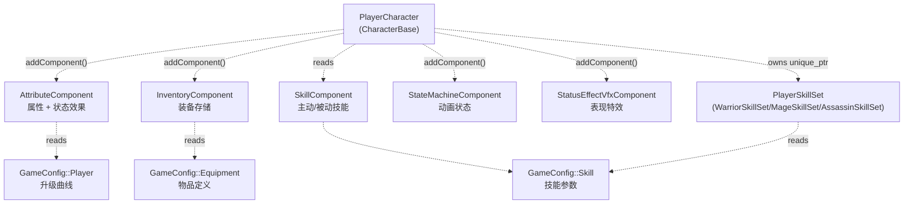
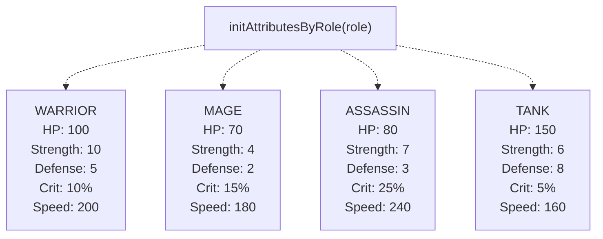
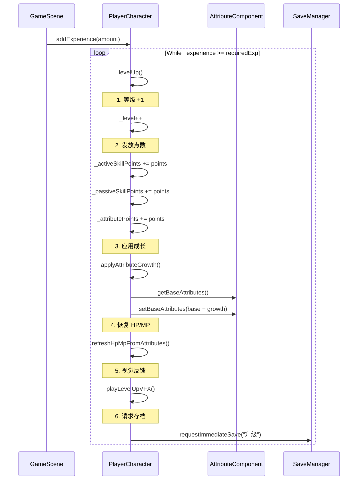
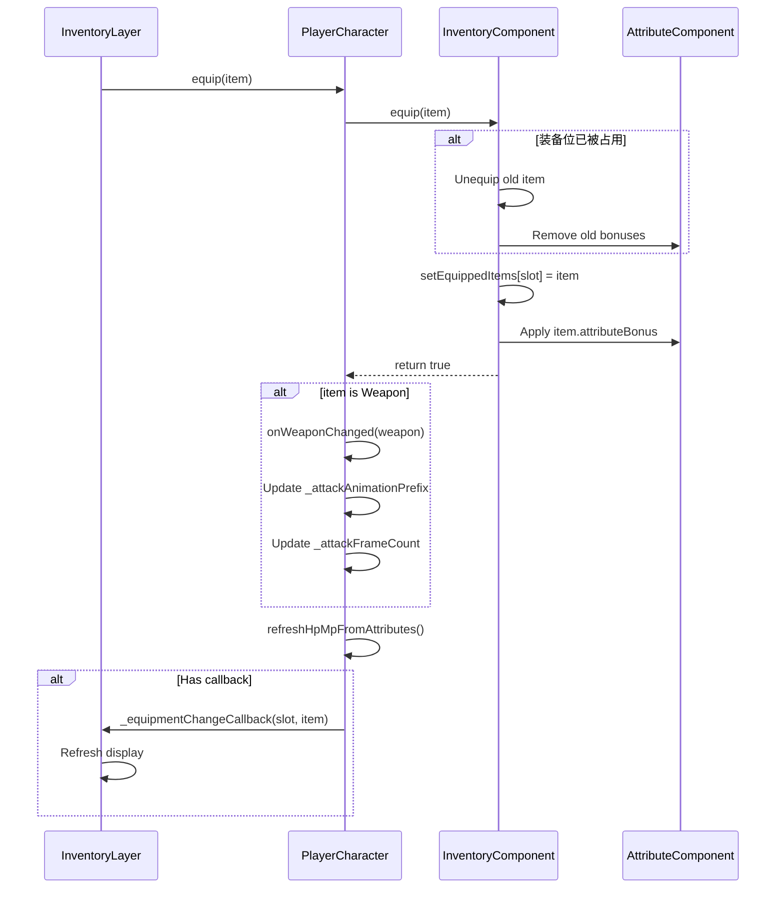
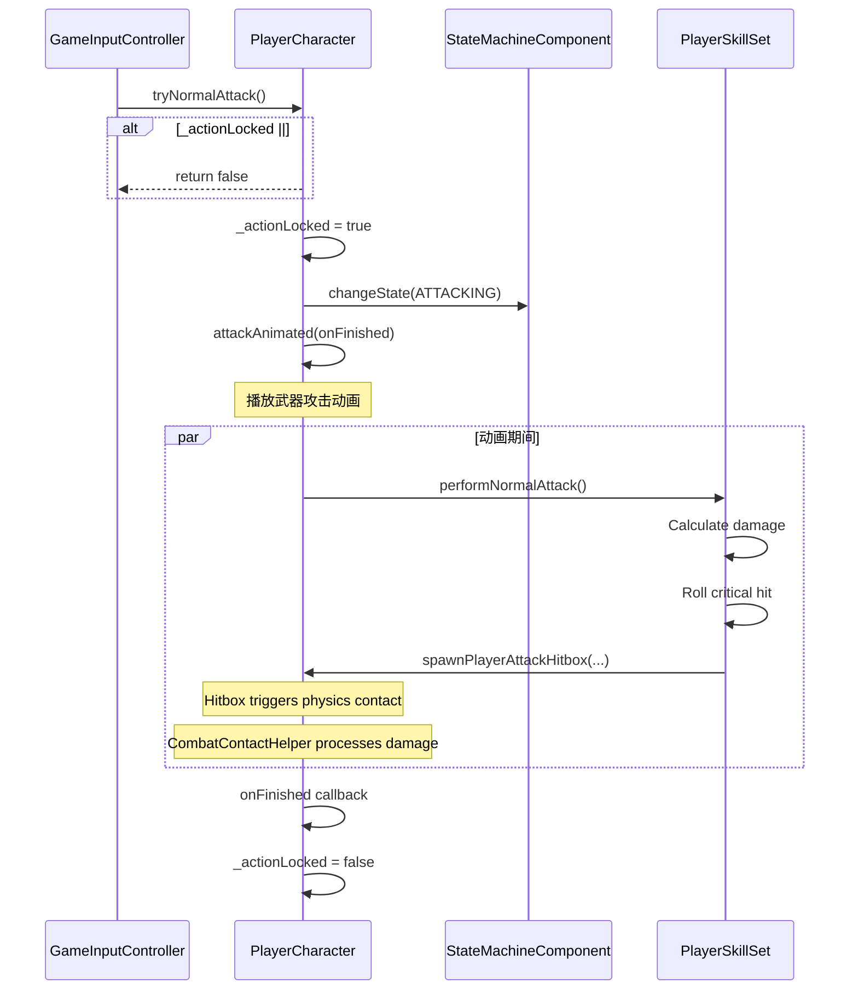
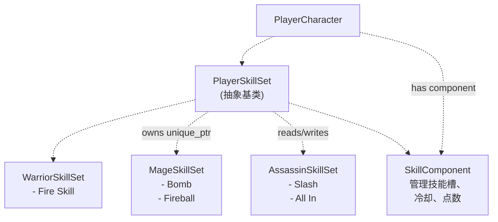
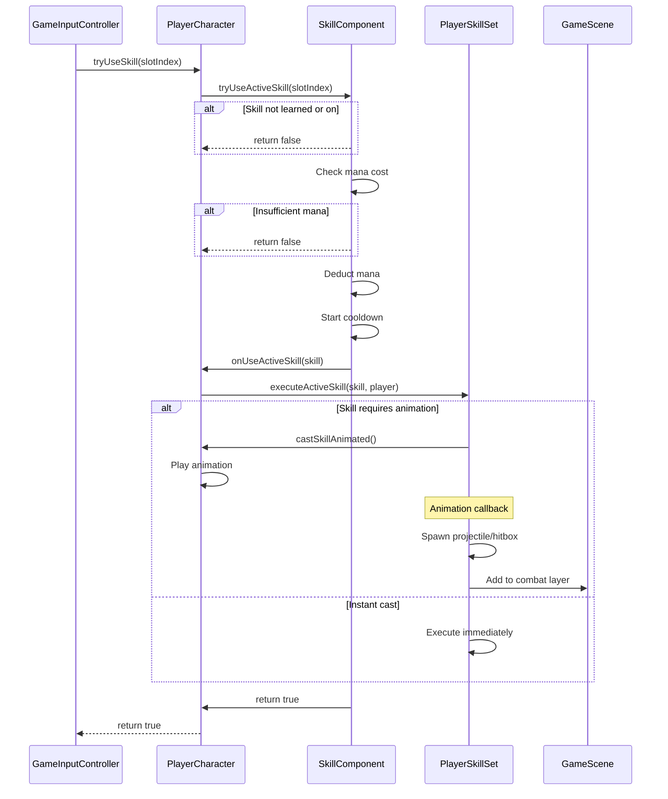
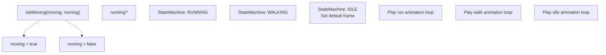
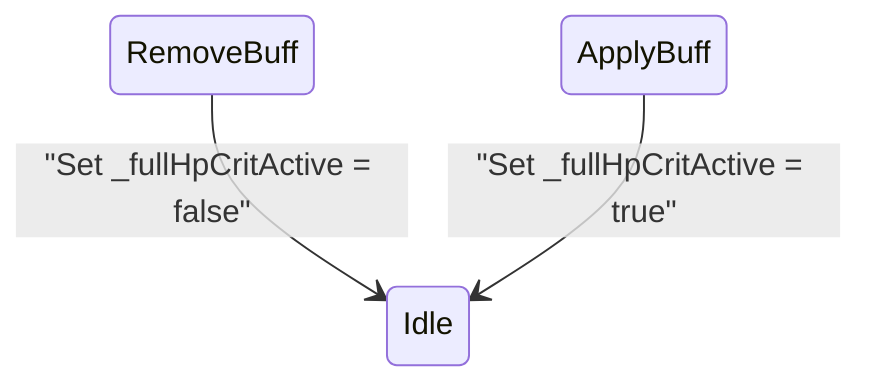
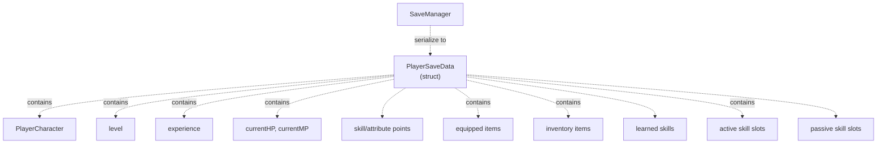

# 玩家角色（PlayerCharacter）

> **相关源文件**
> * [Adventure-King/Classes/Character/Player/PlayerCharacter.cpp](https://github.com/lilong555/Adventure-King/blob/60df0f40/Adventure-King/Classes/Character/Player/PlayerCharacter.cpp)
> * [Adventure-King/Classes/Character/Player/PlayerCharacter.h](https://github.com/lilong555/Adventure-King/blob/60df0f40/Adventure-King/Classes/Character/Player/PlayerCharacter.h)
> * [Adventure-King/Classes/UI/InventoryLayer.cpp](https://github.com/lilong555/Adventure-King/blob/60df0f40/Adventure-King/Classes/UI/InventoryLayer.cpp)
> * [Adventure-King/Classes/UI/InventoryLayer.h](https://github.com/lilong555/Adventure-King/blob/60df0f40/Adventure-King/Classes/UI/InventoryLayer.h)
> * [Adventure-King/Classes/UI/SkillBar.cpp](https://github.com/lilong555/Adventure-King/blob/60df0f40/Adventure-King/Classes/UI/SkillBar.cpp)

## 目的与范围

本文档介绍 `PlayerCharacter` 系统：它是 Adventure-King 的核心玩家实体。该类采用组件化架构，实现可操作角色的属性、装备、技能、升级与战斗等机制。

**相关页面：**

* 怪物/敌人实体请参见 [MonsterBase](怪物基类（MonsterBase）.md)
* 共享角色机制（伤害计算、状态效果）请参见 [CharacterBase](角色基类（CharacterBase）.md)
* 与玩家交互的 UI（技能栏、背包 UI）请参见 [Player UI Components](玩家 UI 组件.md)
* 玩家状态的存档/读档请参见 [SaveManager](存档管理器（SaveManager）.md)

**范围：** 本页聚焦 `PlayerCharacter` 类本身：生命周期、组件组成，以及如何管理玩家状态。单个组件（AttributeComponent、SkillComponent、InventoryComponent）的细节，请参见 [组件架构](组件架构.md)。

---

## 类概览

`PlayerCharacter` 是游戏中代表玩家的主要实体，继承自 `CharacterBase`，并通过多个组件实现关注点分离。

**主要职责：**

* 角色生命周期管理（初始化、更新、销毁）
* 协调组件（属性、背包、技能、动画状态）
* 执行玩家行为（移动、攻击、施放技能）
* 管理成长状态（等级、经验、技能/属性点）
* 处理装备变化并应用其效果
* 为 UI 与输入系统提供接口

**来源：** [Adventure-King/Classes/Character/Player/PlayerCharacter.h L1-L353](https://github.com/lilong555/Adventure-King/blob/60df0f40/Adventure-King/Classes/Character/Player/PlayerCharacter.h#L1-L353)

 [Adventure-King/Classes/Character/Player/PlayerCharacter.cpp L1-L278](https://github.com/lilong555/Adventure-King/blob/60df0f40/Adventure-King/Classes/Character/Player/PlayerCharacter.cpp#L1-L278)

---

## 架构概览

### 组件组合



玩家使用 Cocos2d 的组件系统进行组合：组件通过 `addComponent()` 挂载，并通过 `getComponent()` 或专用访问器（例如 `getAttributeComponent()`、`getSkillComponent()` 等）取回。

**来源：** [Adventure-King/Classes/Character/Player/PlayerCharacter.cpp L228-L276](https://github.com/lilong555/Adventure-King/blob/60df0f40/Adventure-King/Classes/Character/Player/PlayerCharacter.cpp#L228-L276)

---

### 生命周期与初始化

```mermaid
sequenceDiagram
  participant p1 as GameScene
  participant p2 as PlayerCharacter
  participant p3 as AttributeComponent
  participant p4 as InventoryComponent
  participant p5 as SkillComponent
  participant p6 as StateMachineComponent
  participant p7 as PlayerSkillSet

  …1405 chars truncated…sks for PLAYER category
```

> 说明：原文此处包含生成器截断占位 `…1405 chars truncated…`，其余内容按原样保留。

5. **Animation（动画）**：为状态机预缓存动画帧
6. **SkillSet（技能集）**：创建职业技能集（WarriorSkillSet、MageSkillSet、AssassinSkillSet）
7. **Inventory（背包）**：为调试填充默认物品

**来源：** [Adventure-King/Classes/Character/Player/PlayerCharacter.cpp L166-L277](https://github.com/lilong555/Adventure-King/blob/60df0f40/Adventure-King/Classes/Character/Player/PlayerCharacter.cpp#L166-L277)

---

## 核心数据与状态

### 成员变量

`PlayerCharacter` 维护以下核心状态：

| 分类 | 变量 | 类型 | 作用 |
| --- | --- | --- | --- |
| **职业** | `_role` | `CharacterRole` | 玩家职业（Warrior/Mage/Assassin/Tank） |
| **成长** | `_level` | `int` | 当前等级（从 CharacterBase 继承） |
|  | `_experience` | `int` | 当前经验（继承） |
|  | `_activeSkillPoints` | `int` | 未使用的主动技能点 |
|  | `_passiveSkillPoints` | `int` | 未使用的被动技能点 |
|  | `_attributePoints` | `int` | 未使用的属性点 |
| **战斗状态** | `_outgoingDamageMultiplier` | `float` | 伤害倍率（默认 1.0） |
|  | `_outgoingDamageMultiplierRemainingSeconds` | `float` | 伤害倍率 buff 的剩余时间 |
| **移动** | `_isGrounded` | `bool` | 是否在地面上 |
|  | `_jumpCount` | `int` | 已执行的跳跃次数 |
|  | `_actionLocked` | `bool` | 动画期间阻止并发动作 |
| **资源** | `_defaultSpriteDir` | `std::string` | 资源目录路径 |
|  | `_skillSpriteDir` | `std::string` | 技能资源目录路径 |
|  | `_characterKey` | `std::string` | 角色标识字符串 |
|  | `_animationKeyPrefix` | `std::string` | 动画缓存 key 前缀 |
|  | `_stableFrameOriginalSize` | `cocos2d::Size` | 用于稳定帧的参考尺寸 |
| **引用** | `_skillSet` | `std::unique_ptr<PlayerSkillSet>` | 职业技能实现 |
|  | `_inventoryComponent` | `InventoryComponent*` | 背包组件缓存指针 |
|  | `_combatLayer` | `cocos2d::Node*` | 用于投掷物/特效的场景层 |

**HP/MP 状态** 通过 `CharacterBase` 的 `_currentHP` 与 `_currentMP` 继承得到。

**来源：** [Adventure-King/Classes/Character/Player/PlayerCharacter.h L300-L352](https://github.com/lilong555/Adventure-King/blob/60df0f40/Adventure-King/Classes/Character/Player/PlayerCharacter.h#L300-L352)

---

### 按职业初始化

不同职业有不同的初始属性：



这些数值通过 `AttributeComponent::setBaseAttributes()` 写入。

**来源：** [Adventure-King/Classes/Character/Player/PlayerCharacter.cpp L664-L707](https://github.com/lilong555/Adventure-King/blob/60df0f40/Adventure-King/Classes/Character/Player/PlayerCharacter.cpp#L664-L707)

---

## 升级与成长系统

### 经验与升级



**关键机制：**

* **所需经验**：`GameConfig::Player::Leveling::getRequiredExp(_level)`
* **技能点**：升级时发放 `ACTIVE_POINTS_PER_LEVEL` 与 `PASSIVE_POINTS_PER_LEVEL`
* **属性点**：升级时发放 `POINTS_PER_LEVEL`
* **属性成长**：按职业从 `GameConfig::Player::Leveling::getGrowthByRole(_role)` 获取成长率
* **HP/MP 恢复**：升级时会满血满蓝

**来源：** [Adventure-King/Classes/Character/Player/PlayerCharacter.cpp L537-L604](https://github.com/lilong555/Adventure-King/blob/60df0f40/Adventure-King/Classes/Character/Player/PlayerCharacter.cpp#L537-L604)

---

### 属性点消耗

`upgradeAttribute(AttributeType type)` 用于消耗属性点。

**支持升级的属性：**

| 属性类型 | 每次消耗获得 | 配置常量 |
| --- | --- | --- |
| `MAX_HP` | +30 HP | `GameConfig::Player::AttributePoint::MAX_HP_PER_POINT` |
| `STRENGTH` | +1 Strength | `GameConfig::Player::AttributePoint::STRENGTH_PER_POINT` |
| `MOVE_SPEED` | +10 Speed | `GameConfig::Player::AttributePoint::MOVE_SPEED_PER_POINT` |
| `DEFENSE` | +1 Defense | `GameConfig::Player::AttributePoint::DEFENSE_PER_POINT` |
| `CRITICAL_RATE` | +2% Crit | `GameConfig::Player::AttributePoint::CRITICAL_RATE_PER_POINT` |

该方法会：

1. 检查 `_attributePoints > 0`
2. 通过 `AttributeComponent` 修改基础属性
3. `_attributePoints--`
4. 调用 `AttributeComponent::recalculateFinalAttributes()`
5. 立即请求存档

**来源：** [Adventure-King/Classes/Character/Player/PlayerCharacter.cpp L606-L662](https://github.com/lilong555/Adventure-King/blob/60df0f40/Adventure-King/Classes/Character/Player/PlayerCharacter.cpp#L606-L662)

---

## 装备系统

### 装备管理流程



**装备槽位**（由 `EquipmentSlot` 枚举定义）：

* `WEAPON`：影响攻击伤害、攻击范围、攻击速度与动画
* `HELMET`：提供属性加成
* `ARMOR`：提供属性加成
* `BOOTS`：提供属性加成

**背包相关操作：**

| 方法 | 作用 |
| --- | --- |
| `equip(item)` | 装备到对应槽位，如被占用则替换 |
| `unequip(slot)` | 从槽位卸下装备 |
| `getEquippedItems()` | 获取所有已装备物品映射 |
| `getEquippedWeapon()` | 获取武器（返回 `std::shared_ptr<Weapon>`） |
| `addToInventory(item)` | 将物品加入背包 |
| `getInventoryItems()` | 获取背包所有物品 |

所有装备操作由 `InventoryComponent` 执行，`PlayerCharacter` 负责处理副作用（武器动画变化、HP/MP 按上限 clamp、回调通知 UI）。

**来源：** [Adventure-King/Classes/Character/Player/PlayerCharacter.cpp L805-L869](https://github.com/lilong555/Adventure-King/blob/60df0f40/Adventure-King/Classes/Character/Player/PlayerCharacter.cpp#L805-L869)

 [Adventure-King/Classes/Character/Player/PlayerCharacter.cpp L887-L901](https://github.com/lilong555/Adventure-King/blob/60df0f40/Adventure-King/Classes/Character/Player/PlayerCharacter.cpp#L887-L901)

---

### 武器系统

武器是带额外属性的特殊装备类型：

**武器特有数据：**

| 属性 | 类型 | 作用 |
| --- | --- | --- |
| `attackDamage` | `float` | 武器基础伤害 |
| `attackRange` | `float` | 攻击触达距离 |
| `attackSpeed` | `float` | 动画速度倍率 |
| `type` | `WeaponType` | 武器类别（SWORD 等） |
| `attackAnimationPrefix` | `std::string` | 攻击动画帧路径/缓存 key |
| `attackFrameCount` | `int` | 攻击动画帧数 |

装备武器后，`onWeaponChanged()` 会更新：

* `_attackAnimationPrefix`：供 `attackAnimated()` 播放正确的攻击动画
* `_attackFrameCount`：攻击序列的帧数

**攻击力计算：**

```
float getAttackPower() {
    float weaponDamage = DEFAULT_WEAPON_DAMAGE;
    if (auto weapon = getEquippedWeapon()) {
        weaponDamage = weapon->attackDamage;
    }
    
    float strength = attributeComponent->getAttributeValue(STRENGTH);
    float baseAttack = weaponDamage + strength * STRENGTH_DAMAGE_MULTIPLIER;
    return baseAttack * _outgoingDamageMultiplier;
}
```

**来源：** [Adventure-King/Classes/Character/Player/PlayerCharacter.cpp L1078-L1094](https://github.com/lilong555/Adventure-King/blob/60df0f40/Adventure-King/Classes/Character/Player/PlayerCharacter.cpp#L1078-L1094)

---

## 战斗系统

### 攻击执行

玩家主要有两类攻击：

1. **普通攻击**（`tryNormalAttack()`）
2. **技能释放**（`tryUseSkill(slotIndex)`）

两者都使用 `runActionLocked()` 风格的锁定机制，避免并发动作：



**动作锁**（`_actionLocked`）用于防止：

* 同时多次攻击
* 攻击期间释放技能
* 施法期间普通攻击
* 多个技能同时触发

**来源：** [Adventure-King/Classes/Character/Player/PlayerCharacter.cpp L994-L1016](https://github.com/lilong555/Adventure-King/blob/60df0f40/Adventure-King/Classes/Character/Player/PlayerCharacter.cpp#L994-L1016)

 [Adventure-King/Classes/Character/Player/PlayerCharacter.cpp L1019-L1050](https://github.com/lilong555/Adventure-King/blob/60df0f40/Adventure-King/Classes/Character/Player/PlayerCharacter.cpp#L1019-L1050)

---

### 命中框生成（Hitbox）

玩家通过临时 PhysicsBody 检测命中：

**方法签名：**

```javascript
Node* spawnPlayerAttackHitbox(
    const Vec2& centerPosInParentSpace,
    const Size& hitboxSize,
    float damage,
    bool isCritical,
    float lifeSeconds,
    int breakDamage = 0,
    int zOrder = 10
)
```

**命中框属性：**

* **Category**：`GamePhysicsCategory::PLAYER_ATTACK`
* **碰撞掩码（Collision Bitmask）**：`GamePhysicsCategory::MONSTER`
* **接触检测掩码（Contact Test Bitmask）**：`GamePhysicsCategory::MONSTER`
* **Sensor**：`true`（只触发接触、不阻挡）
* **Tag**：编码伤害与暴击标记
  * 正数 tag = 普通伤害
  * 负数 tag = 暴击伤害（绝对值为实际伤害）

命中框会在 `lifeSeconds` 后通过 `scheduleOnce()` 自动移除。

接触处理由 GameScene 中的 `CombatContactHelper` 完成，它会：

1. 从 body tag 解析伤害
2. 通过符号判断是否暴击
3. 在下一帧调度 `CharacterBase::takeDamage()`

**来源：** [Adventure-King/Classes/Character/Player/PlayerCharacter.cpp L1240-L1320](https://github.com/lilong555/Adventure-King/blob/60df0f40/Adventure-King/Classes/Character/Player/PlayerCharacter.cpp#L1240-L1320)

---

### 伤害倍率系统

玩家可通过 `activateOutgoingDamageMultiplier()` 临时提高出站伤害：

**使用示例（刺客 “All In” 技能）：**

```
// Boost damage by 50% for 10 seconds
player->activateOutgoingDamageMultiplier(1.5f, 10.0f);
```

**实现要点：**

* `_outgoingDamageMultiplier`：当前倍率（默认 1.0）
* `_outgoingDamageMultiplierRemainingSeconds`：倒计时
* 到期后自动重置为 1.0
* 视觉反馈：生效期间由 `ensureExpertKeepVfx()` 播放粒子效果

**更新循环：**

```
void updateTriggerEffects(float dt) {
    if (_outgoingDamageMultiplierRemainingSeconds > 0.0f) {
        ensureExpertKeepVfx(this);  // Show buff particle
        _outgoingDamageMultiplierRemainingSeconds -= dt;
        if (_outgoingDamageMultiplierRemainingSeconds <= 0.0f) {
            setOutgoingDamageMultiplier(1.0f);
            removeExpertKeepVfx(this);
        }
    }
}
```

**来源：** [Adventure-King/Classes/Character/Player/PlayerCharacter.cpp L1096-L1119](https://github.com/lilong555/Adventure-King/blob/60df0f40/Adventure-King/Classes/Character/Player/PlayerCharacter.cpp#L1096-L1119)

 [Adventure-King/Classes/Character/Player/PlayerCharacter.cpp L370-L403](https://github.com/lilong555/Adventure-King/blob/60df0f40/Adventure-King/Classes/Character/Player/PlayerCharacter.cpp#L370-L403)

---

## 技能系统

### 技能集架构

每个职业对应一个 `PlayerSkillSet` 子类：



**技能集创建** 在 `createSkillSet()` 中进行：

```cpp
void PlayerCharacter::createSkillSet() {
    switch (_role) {
        case CharacterRole::WARRIOR:
            _skillSet = std::make_unique<WarriorSkillSet>();
            break;
        case CharacterRole::MAGE:
            _skillSet = std::make_unique<MageSkillSet>();
            break;
        case CharacterRole::ASSASSIN:
            _skillSet = std::make_unique<AssassinSkillSet>();
            break;
        // ...
    }
}
```

**来源：** [Adventure-King/Classes/Character/Player/PlayerCharacter.cpp L1436-L1467](https://github.com/lilong555/Adventure-King/blob/60df0f40/Adventure-King/Classes/Character/Player/PlayerCharacter.cpp#L1436-L1467)

---

### 技能执行流程



**关键点：**

* `SkillComponent` 负责通用技能状态（冷却、耗蓝、已学技能）
* `PlayerSkillSet` 实现职业专属逻辑（命中框形状、投掷物生成、伤害计算）
* `PlayerCharacter::onUseActiveSkill()` 是组件与 skill set 之间的桥接点

**来源：** [Adventure-King/Classes/Character/Player/PlayerCharacter.cpp L1476-L1495](https://github.com/lilong555/Adventure-King/blob/60df0f40/Adventure-King/Classes/Character/Player/PlayerCharacter.cpp#L1476-L1495)

---

## 动画系统

### 基于状态的动画

玩家通过 `StateMachineComponent` 管理动画状态。

**角色状态：**

| 状态 | 触发条件 | 动画 key 规则 |
| --- | --- | --- |
| `IDLE` | 不移动且不攻击 | `{prefix}_idle` |
| `WALKING` | 移动（非跑） | `{prefix}_walk` |
| `RUNNING` | 按住跑步键移动 | `{prefix}_run` |
| `ATTACKING` | 攻击/技能动画期间 | 由 action 序列控制 |
| `HURT` | 受到高于阈值的伤害 | `{prefix}_hurt` |

**动画注册：**

```
void init(...) {
    auto sm = getStateMachineComponent();
    sm->registerStateAnimation(CharacterState::IDLE, _animationKeyPrefix + "_idle");
    sm->registerStateAnimation(CharacterState::WALKING, _animationKeyPrefix + "_walk");
    sm->registerStateAnimation(CharacterState::RUNNING, _animationKeyPrefix + "_run");
    sm->registerStateAnimation(CharacterState::HURT, _animationKeyPrefix + "_hurt");
    sm->changeState(CharacterState::IDLE);
}
```

**来源：** [Adventure-King/Classes/Character/Player/PlayerCharacter.cpp L254-L262](https://github.com/lilong555/Adventure-King/blob/60df0f40/Adventure-King/Classes/Character/Player/PlayerCharacter.cpp#L254-L262)

---

### 稳定 SpriteFrame（Stable Sprite Frames）

玩家动画帧源图尺寸可能不同，会导致切帧时 sprite “跳动”（anchor 在中心，但内容尺寸变化）。为解决此问题，玩家使用“稳定帧”。

**问题示意：**

```
Frame 1: 64x64px → anchor at (32, 32) → physics body at offset (0, 0)
Frame 2: 80x64px → anchor at (40, 32) → physics body at offset (-8, 0) ← JUMPED!
```

**解决方案：`getStableSpriteFrame()`**

```javascript
SpriteFrame* getStableSpriteFrame(
    const std::string& framePath,
    bool alignBottom = true,
    bool alignLeft = false
) const
```

该方法会：

1. 初始化时记录 `_stableFrameOriginalSize`（取第一帧的原始尺寸）
2. 后续所有帧都用相同 `originalSize` 创建
3. `alignBottom=true` 用于让脚底锚定在相同的 Y 位置

**结果：** 所有帧的 anchor 一致，不再引起 physics body 漂移。

**来源：** [Adventure-King/Classes/Character/Player/PlayerCharacter.cpp L279-L310](https://github.com/lilong555/Adventure-King/blob/60df0f40/Adventure-King/Classes/Character/Player/PlayerCharacter.cpp#L279-L310)

---

### 一次性动画（One-Shot Animations）

攻击与技能等动作会播放非循环的一次性动画序列。

**方法签名：**

```javascript
void playOneShotAnimation(
    const std::vector<std::string>& paths,
    float delayPerUnit,
    int actionTag,
    const std::function<void()>& onFinished
)
```

**使用示例：**

```cpp
// Play 3-frame attack animation
std::vector<std::string> attackFrames = {
    "player/attack_1.png",
    "player/attack_2.png",
    "player/attack_3.png"
};
playOneShotAnimation(attackFrames, 0.15f, ACTION_TAG_ATTACK_ANIM, <FileRef file-url="https://github.com/lilong555/Adventure-King/blob/60df0f40/this" undefined  file-path="this">Hii</FileRef> {
    // Attack animation finished
    _actionLocked = false;
});
```

**Action tag** 用于防止重复播放：

* `ACTION_TAG_ATTACK_ANIM = 200`：普通攻击
* `ACTION_TAG_SKILL_ANIM = 300`：技能施法
* `ACTION_TAG_HURT_FACING = 400`：受击朝向（内部使用）

**来源：** [Adventure-King/Classes/Character/Player/PlayerCharacter.cpp L965-L992](https://github.com/lilong555/Adventure-King/blob/60df0f40/Adventure-King/Classes/Character/Player/PlayerCharacter.cpp#L965-L992)

---

## 移动与输入系统集成

`PlayerCharacter` 由 `GameInputController` 控制，主要通过这些方法：

### 移动状态控制



**方法签名：**

```
void setMoving(bool moving, bool running = false)
```

**行为：**

* 将 `StateMachineComponent` 切换到对应状态（IDLE/WALKING/RUNNING）
* 状态切换前确保动画已缓存
* 停止移动时回退到稳定的默认 idle 帧

**实际位移**（速度设置）由 `GameInputController` 处理：它读取 `AttributeComponent::MOVE_SPEED` 并应用到物理刚体上。

**来源：** [Adventure-King/Classes/Character/Player/PlayerCharacter.cpp L917-L963](https://github.com/lilong555/Adventure-King/blob/60df0f40/Adventure-King/Classes/Character/Player/PlayerCharacter.cpp#L917-L963)

---

## 状态效果与被动能力

### 触发型机制

玩家支持多种触发型被动效果，会在每帧检查：

**更新循环：**

```
void updateTriggerEffects(float dt) {
    // Cooldown decrements
    _burnProcCooldownRemaining -= dt;
    _poisonProcCooldownRemaining -= dt;
    _critEchoCooldownRemaining -= dt;
    
    // Damage multiplier timer
    if (_outgoingDamageMultiplierRemainingSeconds > 0.0f) {
        // ... handle timer and VFX
    }
    
    // Conditional passive: Full HP Crit
    updateFullHpCritEffect();
}
```

**来源：** [Adventure-King/Classes/Character/Player/PlayerCharacter.cpp L370-L403](https://github.com/lilong555/Adventure-King/blob/60df0f40/Adventure-King/Classes/Character/Player/PlayerCharacter.cpp#L370-L403)

---

### 满血暴击（Full HP Critical）效果

该被动在满血时提供额外暴击率：

**逻辑：**



**实现步骤：**

1. 检查被动是否装备：`hasPassiveEquipped(FULL_HP_CRIT)`
2. 检查 HP：`getCurrentHP() >= maxHp - HP_COMPARISON_EPSILON`
3. 两者满足且未激活：添加带暴击加成的永久状态效果
4. 任一条件不满足且已激活：移除该状态效果

**来源：** [Adventure-King/Classes/Character/Player/PlayerCharacter.cpp L405-L449](https://github.com/lilong555/Adventure-King/blob/60df0f40/Adventure-King/Classes/Character/Player/PlayerCharacter.cpp#L405-L449)

---

### AI Blessing 系统

NPC 交互可通过 “AI Blessing” 系统给玩家施加临时属性加成：

**API：**

```javascript
// Apply or replace blessing
void applyAiBlessingBonus(const Attributes& bonus);

// Remove blessing
void clearAiBlessingBonus();

// Check if active
bool hasAiBlessingBonus() const;

// Get current bonus
Attributes getAiBlessingBonus() const;
```

**实现要点：**

* 使用 `StatusEffectType::AI_BLESSING`
* 在 `AttributeComponent` 中作为永久状态效果保存
* 新的祝福会替换旧的（不是叠加）
* 场景切换时祝福会被清除（除非被保存）

**来源：** [Adventure-King/Classes/Character/Player/PlayerCharacter.cpp L1125-L1183](https://github.com/lilong555/Adventure-King/blob/60df0f40/Adventure-King/Classes/Character/Player/PlayerCharacter.cpp#L1125-L1183)

---

## 与游戏系统的集成

### 存档/读档集成



**会触发存档的操作：**

* 升级
* 消耗属性点
* 装备变化
* 学习/装备技能

这些操作都会调用 `SaveManager::requestImmediateSave(reason)`，在下一帧调度存盘。

**来源：** [Adventure-King/Classes/Character/Player/PlayerCharacter.cpp L574-L577](https://github.com/lilong555/Adventure-King/blob/60df0f40/Adventure-King/Classes/Character/Player/PlayerCharacter.cpp#L574-L577)

 [Adventure-King/Classes/Character/Player/PlayerCharacter.cpp L656-L660](https://github.com/lilong555/Adventure-King/blob/60df0f40/Adventure-King/Classes/Character/Player/PlayerCharacter.cpp#L656-L660)

---

### UI 层集成

玩家通过 getter 与回调向 UI 提供数据，并允许 UI 调用方法改变玩家状态。

**InventoryLayer 集成：**

```javascript
// Bind player to UI
inventoryLayer->bindPlayer(player);

// UI reads player state
auto items = player->getInventoryItems();
auto equipped = player->getEquippedItems();
auto skillComp = player->getSkillComponent();
auto attrComp = player->getAttributeComponent();

// UI modifies player via methods
player->equip(item);
player->unequip(EquipmentSlot::WEAPON);
player->upgradeAttribute(AttributeType::STRENGTH);

// Player notifies UI via callback
player->setEquipmentChangeCallback([](EquipmentSlot slot, const std::shared_ptr<Equipment>& item) {
    // UI refreshes display
});
```

**来源：** [Adventure-King/Classes/UI/InventoryLayer.cpp L413-L424](https://github.com/lilong555/Adventure-King/blob/60df0f40/Adventure-King/Classes/UI/InventoryLayer.cpp#L413-L424)

---

**SkillBar 集成：**

```javascript
// Bind player to skill bar
skillBar->bindPlayer(player);

// Skill bar reads SkillComponent state
auto skillComp = player->getSkillComponent();
const auto& activeSlots = skillComp->getActiveSlots();

// Skill bar displays:
// - Skill icons
// - Cooldown overlays
// - Hotkey labels

// GameInputController triggers skills
player->tryUseSkill(slotIndex);

// SkillBar updates on next frame via updateDisplay()
```

**来源：** [Adventure-King/Classes/UI/SkillBar.cpp L141-L210](https://github.com/lilong555/Adventure-King/blob/60df0f40/Adventure-King/Classes/UI/SkillBar.cpp#L141-L210)

---

## 代码实体索引

### 关键类与文件

| 实体 | 类型 | 文件 | 作用 |
| --- | --- | --- | --- |
| `PlayerCharacter` | Class | [PlayerCharacter.h L17-L352](https://github.com/lilong555/Adventure-King/blob/60df0f40/PlayerCharacter.h#L17-L352) | 玩家主实体 |
| `PlayerSkillSet` | Abstract Class | Referenced | 技能实现基类 |
| `WarriorSkillSet` | Class | [PlayerCharacter.cpp L2](https://github.com/lilong555/Adventure-King/blob/60df0f40/PlayerCharacter.cpp#L2-L2) | 战士技能 |
| `MageSkillSet` | Class | Referenced | 法师技能（Bomb、Fireball） |
| `AssassinSkillSet` | Class | [PlayerCharacter.cpp L4](https://github.com/lilong555/Adventure-King/blob/60df0f40/PlayerCharacter.cpp#L4-L4) | 刺客技能（Slash、All In） |
| `AttributeComponent` | Class | [PlayerCharacter.cpp L6](https://github.com/lilong555/Adventure-King/blob/60df0f40/PlayerCharacter.cpp#L6-L6) | 属性管理组件 |
| `InventoryComponent` | Class | [PlayerCharacter.cpp L7](https://github.com/lilong555/Adventure-King/blob/60df0f40/PlayerCharacter.cpp#L7-L7) | 装备存储组件 |
| `SkillComponent` | Class | [PlayerCharacter.cpp L8](https://github.com/lilong555/Adventure-King/blob/60df0f40/PlayerCharacter.cpp#L8-L8) | 技能管理组件 |
| `StateMachineComponent` | Class | [PlayerCharacter.cpp L9](https://github.com/lilong555/Adventure-King/blob/60df0f40/PlayerCharacter.cpp#L9-L9) | 动画状态管理 |
| `StatusEffectVfxComponent` | Class | [PlayerCharacter.cpp L10](https://github.com/lilong555/Adventure-King/blob/60df0f40/PlayerCharacter.cpp#L10-L10) | 表现特效管理 |

**来源：** [Adventure-King/Classes/Character/Player/PlayerCharacter.h L1-L353](https://github.com/lilong555/Adventure-King/blob/60df0f40/Adventure-King/Classes/Character/Player/PlayerCharacter.h#L1-L353)

 [Adventure-King/Classes/Character/Player/PlayerCharacter.cpp L1-L50](https://github.com/lilong555/Adventure-King/blob/60df0f40/Adventure-King/Classes/Character/Player/PlayerCharacter.cpp#L1-L50)

---

### 关键方法

| 方法 | 返回类型 | 作用 |
| --- | --- | --- |
| `create(role, spriteFrameName)` | `PlayerCharacter*` | 工厂方法 |
| `init(role, spriteFrameName)` | `bool` | 初始化玩家 |
| `update(float dt)` | `void` | 每帧更新 |
| `addExperience(int amount)` | `void` | 增加经验并处理升级 |
| `upgradeAttribute(AttributeType type)` | `bool` | 消耗属性点 |
| `equip(item)` | `void` | 装备物品 |
| `unequip(slot)` | `void` | 卸下装备 |
| `tryNormalAttack()` | `bool` | 尝试普通攻击 |
| `tryUseSkill(slotIndex)` | `bool` | 尝试释放技能 |
| `getAttackPower()` | `float` | 计算当前攻击力 |
| `spawnPlayerAttackHitbox(...)` | `Node*` | 创建攻击碰撞盒 |
| `setMoving(moving, running)` | `void` | 设置移动动画状态 |
| `takeDamage(info)` | `void` | 处理受到的伤害 |
| `die()` | `void` | 处理玩家死亡 |

**来源：** [Adventure-King/Classes/Character/Player/PlayerCharacter.h L19-L230](https://github.com/lilong555/Adventure-King/blob/60df0f40/Adventure-King/Classes/Character/Player/PlayerCharacter.h#L19-L230)

---

## 总结

`PlayerCharacter` 是一个组件化的玩家实体，实现上具有以下特点：

1. 通过 Cocos2d 组件（AttributeComponent、SkillComponent、InventoryComponent 等）实现 **关注点分离**
2. 支持多职业，并为不同职业配置专属技能集与初始属性
3. 通过经验、升级与点数分配实现成长
4. 装备变更会自动触发属性重算，并在更换武器时切换攻击动画
5. 通过生成命中框与伤害倍率体系执行战斗
6. 使用稳定帧避免切帧导致的物理体漂移，从而让动画更平滑
7. 通过 getter/setter 与回调与 UI 集成
8. 在关键状态变化时触发存档以持久化玩家状态

整体架构更偏向“组合而非继承”，便于在不修改 `PlayerCharacter` 核心代码的前提下扩展新组件、新被动效果或新技能实现。
