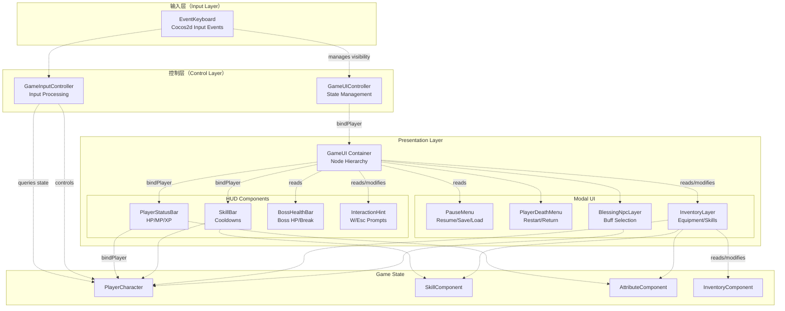
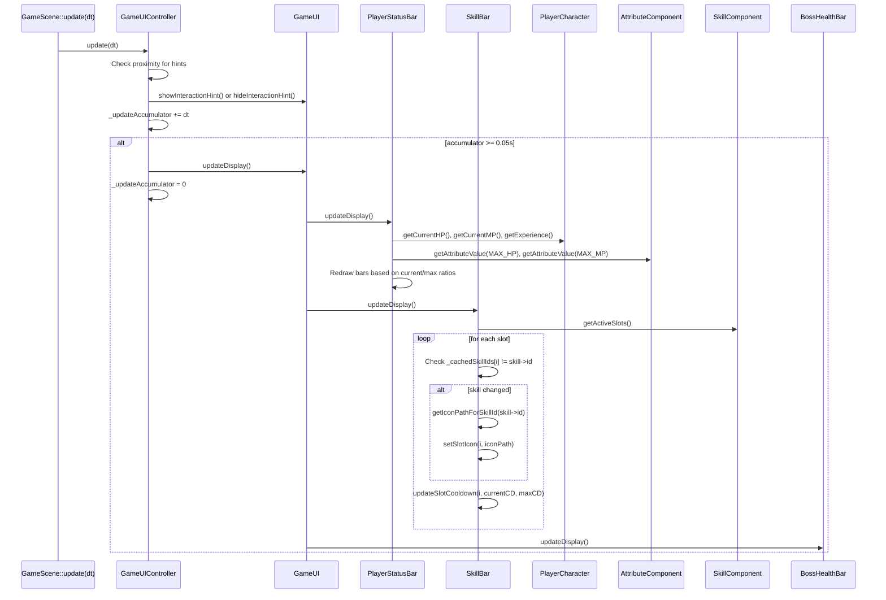
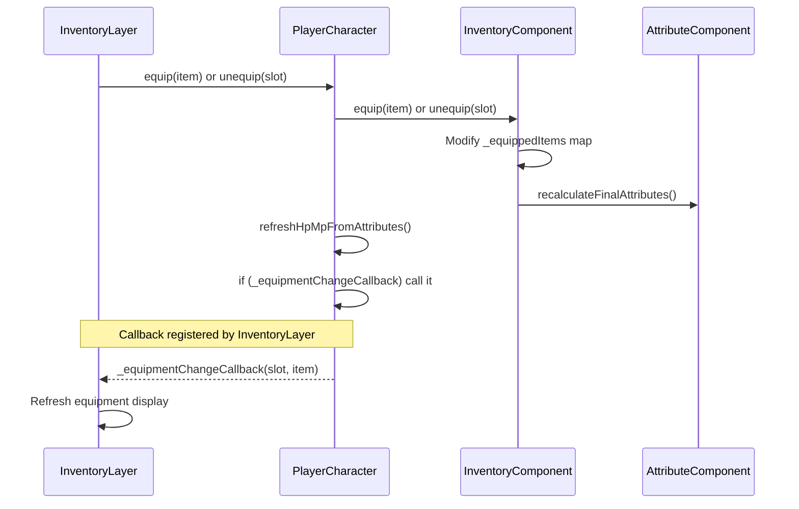

# User Interface（用户界面）

> **相关源文件**
> * [Adventure-King/Classes/Character/Player/PlayerCharacter.cpp](https://github.com/lilong555/Adventure-King/blob/60df0f40/Adventure-King/Classes/Character/Player/PlayerCharacter.cpp)
> * [Adventure-King/Classes/Character/Player/PlayerCharacter.h](https://github.com/lilong555/Adventure-King/blob/60df0f40/Adventure-King/Classes/Character/Player/PlayerCharacter.h)
> * [Adventure-King/Classes/Configs/GameSceneConfig.h](https://github.com/lilong555/Adventure-King/blob/60df0f40/Adventure-King/Classes/Configs/GameSceneConfig.h)
> * [Adventure-King/Classes/GameUI.cpp](https://github.com/lilong555/Adventure-King/blob/60df0f40/Adventure-King/Classes/GameUI.cpp)
> * [Adventure-King/Classes/GameUI.h](https://github.com/lilong555/Adventure-King/blob/60df0f40/Adventure-King/Classes/GameUI.h)
> * [Adventure-King/Classes/Scenes/GameInputController.cpp](https://github.com/lilong555/Adventure-King/blob/60df0f40/Adventure-King/Classes/Scenes/GameInputController.cpp)
> * [Adventure-King/Classes/Scenes/GameInputController.h](https://github.com/lilong555/Adventure-King/blob/60df0f40/Adventure-King/Classes/Scenes/GameInputController.h)
> * [Adventure-King/Classes/Scenes/GameUIController.cpp](https://github.com/lilong555/Adventure-King/blob/60df0f40/Adventure-King/Classes/Scenes/GameUIController.cpp)
> * [Adventure-King/Classes/Scenes/GameUIController.h](https://github.com/lilong555/Adventure-King/blob/60df0f40/Adventure-King/Classes/Scenes/GameUIController.h)
> * [Adventure-King/Classes/UI/InventoryLayer.cpp](https://github.com/lilong555/Adventure-King/blob/60df0f40/Adventure-King/Classes/UI/InventoryLayer.cpp)
> * [Adventure-King/Classes/UI/InventoryLayer.h](https://github.com/lilong555/Adventure-King/blob/60df0f40/Adventure-King/Classes/UI/InventoryLayer.h)
> * [Adventure-King/Classes/UI/SkillBar.cpp](https://github.com/lilong555/Adventure-King/blob/60df0f40/Adventure-King/Classes/UI/SkillBar.cpp)
> * [Adventure-King/Resources/Scene/UI/bag.png](https://github.com/lilong555/Adventure-King/blob/60df0f40/Adventure-King/Resources/Scene/UI/bag.png)
> * [Adventure-King/Resources/Scene/UI/bagSelected.png](https://github.com/lilong555/Adventure-King/blob/60df0f40/Adventure-King/Resources/Scene/UI/bagSelected.png)

用户界面系统负责管理玩法过程中的所有面向玩家的 UI 元素与输入处理：包括血条/技能冷却等 HUD 组件、暂停菜单与背包系统等模态界面，以及把键盘输入转换为玩家动作。系统实现了“基于优先级的状态机”，用于处理 UI 上下文重叠（死亡菜单 > 暂停 > 背包 > 正常玩法）。

关于 UI 覆盖层之外的角色/世界视觉表现，请参见 [System Architecture](<系统架构.md>)。关于初始化 UI 组件的场景级编排，请参见 [GameScene](<GameScene（游戏场景）.md>)。

## 架构概览

UI 系统将关注点拆分为三个主要子系统：

1. **状态管理**（`GameUIController`）- 编排 UI 显隐与暂停状态的切换
2. **输入处理**（`GameInputController`）- 处理键盘事件并转换为玩家命令
3. **UI 组件**（`GameUI` 及其子层）- 绘制 HUD 元素与模态界面

**关键职责分离：**

> 说明：原文在本节中间存在生成器截断占位（`...19745 chars truncated...`），为保证不遗漏，下方保留原占位内容。

* `GameInputController` …（原文此处被截断：`…19745 chars truncated…`）… [Adventure-King/Classes/Scenes/GameUIController.cpp#L234-L308](https://github.com/lilong555/Adventure-King/blob/60df0f40/Adventure-King/Classes/Scenes/GameUIController.cpp#L234-L308)

 [Adventure-King/Classes/Scenes/GameUIController.cpp L509-L537](https://github.com/lilong555/Adventure-King/blob/60df0f40/Adventure-King/Classes/Scenes/GameUIController.cpp#L509-L537)

## 数据流与更新周期

UI 系统采用拉取式模型：UI 组件周期性从游戏状态读取数据，而不是由状态变化主动推送通知。

### 完整更新流程

**节流原因：** UI 以 20 Hz（0.05s 间隔）更新，而不是 60 Hz，以降低 DrawNode 重绘开销。HP/MP 变化与技能冷却在 UI 上不需要逐帧精确。

来源：[Adventure-King/Classes/Scenes/GameUIController.cpp L357-L399](https://github.com/lilong555/Adventure-King/blob/60df0f40/Adventure-King/Classes/Scenes/GameUIController.cpp#L357-L399)

 [Adventure-King/Classes/GameUI.cpp L422-L441](https://github.com/lilong555/Adventure-King/blob/60df0f40/Adventure-King/Classes/GameUI.cpp#L422-L441)

### 玩家与 UI 的绑定

绑定发生在 `GameScene` 初始化期间：

1. `GameUIController::init()` 接收 `PlayerCharacter*` 指针
2. 调用 `_gameUI->bindPlayer(player)`
3. `GameUI::bindPlayer()` 将绑定下发给子组件：
   * `_playerStatusBar->bindPlayer(player)`
   * `_skillBar->bindPlayer(player)`
   * `_inventoryLayer->bindPlayer(player)`
   * `_blessingNpcLayer->bindPlayer(player)`

**不做自动更新：** 绑定只是保存指针，不会注册变化监听。UI 依赖 `updateDisplay()` 的周期性轮询。

来源：[Adventure-King/Classes/GameUI.cpp L237-L263](https://github.com/lilong555/Adventure-King/blob/60df0f40/Adventure-King/Classes/GameUI.cpp#L237-L263)

### 装备变化回调

`InventoryLayer` 是拉取式模型中的例外：当玩家装备或卸下物品时会触发回调：

该回调由背包层在绑定玩家时，通过 `PlayerCharacter::setEquipmentChangeCallback()` 设置。

来源：[Adventure-King/Classes/Character/Player/PlayerCharacter.cpp L805-L859](https://github.com/lilong555/Adventure-King/blob/60df0f40/Adventure-King/Classes/Character/Player/PlayerCharacter.cpp#L805-L859)

 [Adventure-King/Classes/UI/InventoryLayer.cpp L413-L424](https://github.com/lilong555/Adventure-King/blob/60df0f40/Adventure-King/Classes/UI/InventoryLayer.cpp#L413-L424)

## 文件索引映射

下表将 UI 概念映射到主要实现文件：

| 概念 | 主要文件 |
| --- | --- |
| UI 状态管理 | `GameUIController.h`, `GameUIController.cpp` |
| 输入处理 | `GameInputController.h`, `GameInputController.cpp` |
| UI 容器 | `GameUI.h`, `GameUI.cpp` |
| 玩家状态显示 | `PlayerStatusBar.h`, `PlayerStatusBar.cpp` |
| 技能冷却显示 | `SkillBar.h`, `SkillBar.cpp` |
| Boss 血条显示 | `BossHealthBar.h`, `BossHealthBar.cpp` |
| 暂停菜单 | `PauseMenu.h`, `PauseMenu.cpp` |
| 死亡菜单 | `PlayerDeathMenu.h`, `PlayerDeathMenu.cpp` |
| 背包/技能/属性 | `InventoryLayer.h`, `InventoryLayer.cpp` |
| 祝福/增益选择 | `BlessingNpcLayer.h`, `BlessingNpcLayer.cpp` |
| UI 配置 | `GameSceneConfig.h`（lines 51-152） |

来源：上表列出的全部文件
