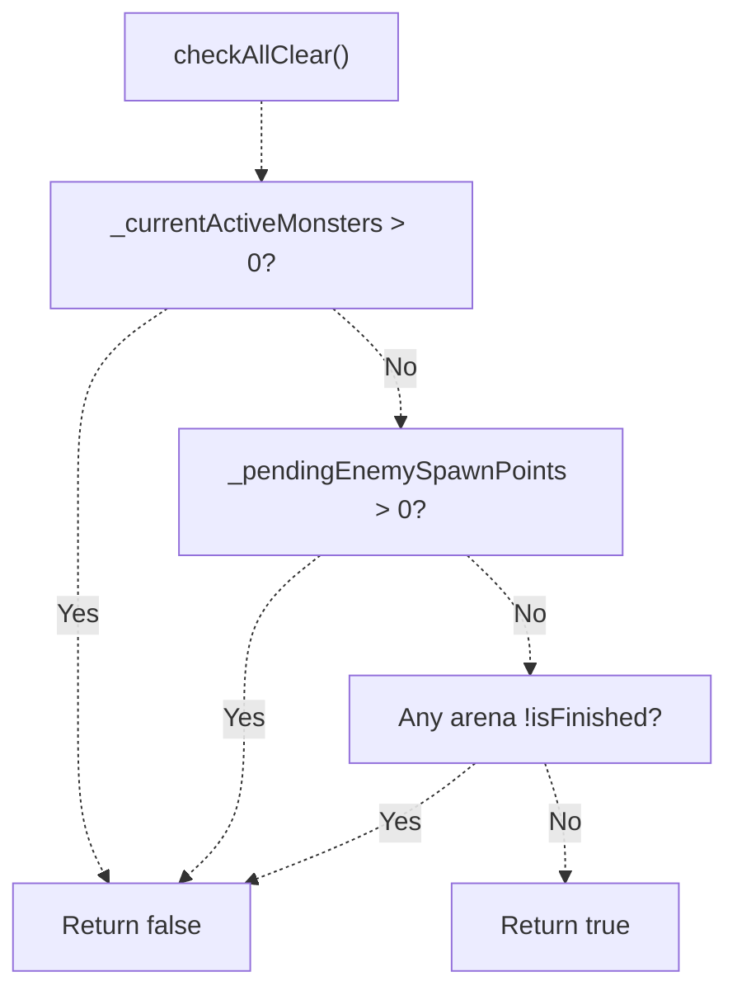
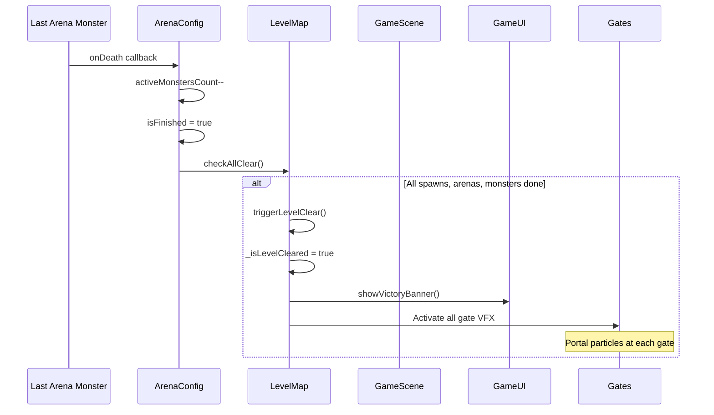

# Arena Combat System（竞技场战斗系统）

> **相关源文件**
> * [Adventure-King/Classes/Save/JsonSerializer.cpp](https://github.com/lilong555/Adventure-King/blob/60df0f40/Adventure-King/Classes/Save/JsonSerializer.cpp)
> * [Adventure-King/Classes/Save/SaveData.h](https://github.com/lilong555/Adventure-King/blob/60df0f40/Adventure-King/Classes/Save/SaveData.h)
> * [Adventure-King/Classes/Save/SaveManager.cpp](https://github.com/lilong555/Adventure-King/blob/60df0f40/Adventure-King/Classes/Save/SaveManager.cpp)
> * [Adventure-King/Classes/Scenes/DebugScene.cpp](https://github.com/lilong555/Adventure-King/blob/60df0f40/Adventure-King/Classes/Scenes/DebugScene.cpp)
> * [Adventure-King/Classes/Scenes/DebugScene.h](https://github.com/lilong555/Adventure-King/blob/60df0f40/Adventure-King/Classes/Scenes/DebugScene.h)
> * [Adventure-King/Classes/Scenes/GameScene.cpp](https://github.com/lilong555/Adventure-King/blob/60df0f40/Adventure-King/Classes/Scenes/GameScene.cpp)
> * [Adventure-King/Classes/Scenes/GameScene.h](https://github.com/lilong555/Adventure-King/blob/60df0f40/Adventure-King/Classes/Scenes/GameScene.h)
> * [Adventure-King/Classes/Scenes/LevelMap.cpp](https://github.com/lilong555/Adventure-King/blob/60df0f40/Adventure-King/Classes/Scenes/LevelMap.cpp)
> * [Adventure-King/Classes/Scenes/LevelMap.h](https://github.com/lilong555/Adventure-King/blob/60df0f40/Adventure-King/Classes/Scenes/LevelMap.h)
> * [Adventure-King/proj.win32/Adventure-King.vcxproj](https://github.com/lilong555/Adventure-King/blob/60df0f40/Adventure-King/proj.win32/Adventure-King.vcxproj)
> * [Adventure-King/proj.win32/Adventure-King.vcxproj.filters](https://github.com/lilong555/Adventure-King/blob/60df0f40/Adventure-King/proj.win32/Adventure-King.vcxproj.filters)

## 目的与范围

本文描述 **竞技场战斗系统（Arena Combat System）**：它在关卡内提供“封闭式、按波次推进”的战斗遭遇。系统由 `LevelMap` 管理，负责触发检测、按波次生成怪物、关门锁定/解锁、相机控制与状态持久化。

关于普通敌人生成点（基于临近触发），请参见 [Enemy Spawn System](<敌人生成系统.md>)。关于整体关卡推进与传送门机制，请参见 [Level Progression](<关卡进度.md>)。

---

## 概览

竞技场战斗系统会创建“封锁战”场景：玩家进入触发区域后，必须击败多波怪物才能继续前进。其关键特性包括：

* **TMX 驱动配置**：竞技场边界、生成点位置与波次构成都由 Tiled 地图编辑器定义
* **关门机制**：竞技场激活时通过对象层生成的物理门禁锁定，完成全部波次后解锁
* **相机控制**：请求相机锁定，使竞技场区域在战斗期间保持可见
* **波次推进**：顺序生成波次，并支持可配置延迟
* **持久化**：竞技场状态（当前波次、是否完成）可被保存/恢复，实现无缝存/读档
* **胜利条件集成**：竞技场完成会计入关卡清理判定（见 [Level Progression](<关卡进度.md>)）

**来源**：[Adventure-King/Classes/Scenes/LevelMap.h L1-L196](https://github.com/lilong555/Adventure-King/blob/60df0f40/Adventure-King/Classes/Scenes/LevelMap.h#L1-L196)

 [Adventure-King/Classes/Scenes/LevelMap.cpp L1-L970](https://github.com/lilong555/Adventure-King/blob/60df0f40/Adventure-King/Classes/Scenes/LevelMap.cpp#L1-L970)

---

## 竞技场配置结构

### ArenaConfig 数据模型

每个竞技场由一个 `ArenaConfig` 结构体表示（被 `LevelMap` 引用）：

| 字段 | 类型 | 用途 |
| --- | --- | --- |
| `arenaID` | `std::string` | 唯一标识（来自 TMX 对象 name） |
| `triggerRect` | `cocos2d::Rect` | 激活区域（检测玩家进入） |
| `lockTargetPos` | `cocos2d::Vec2` | 相机锁定位置（通常是竞技场中心） |
| `gateNodes` | `std::vector<cocos2d::Node*>` | 门禁碰撞体（完成后禁用） |
| `waves` | `std::vector<ArenaWave>` | 波次定义（怪物类型、数量、位置） |
| `currentWaveIndex` | `int` | 当前波次（从 0 开始；清完一波后自增） |
| `activeMonstersCount` | `int` | 当前波次存活怪物数量（怪物死亡时递减） |
| `isActivated` | `bool` | 玩家是否进入触发区（可持久化） |
| `isFinished` | `bool` | 是否完成全部波次（可持久化） |

### 波次定义

每个 `ArenaWave` 包含：

| 字段 | 类型 | 描述 |
| --- | --- | --- |
| `monsterType` | `std::string` | 怪物类型标识（例如 `"goblin"`, `"obscur"`） |
| `spawnPositions` | `std::vector<cocos2d::Vec2>` | 生成点的世界坐标 |
| `delayBeforeSpawn` | `float` | 生成本波前等待的秒数 |

**来源**：[Adventure-King/Classes/Scenes/LevelMap.h L143-L167](https://github.com/lilong555/Adventure-King/blob/60df0f40/Adventure-King/Clas…11470 chars truncated…ration**: `registerRestoredArenaMonster()` increments `activeMonstersCount` and re-attaches death callback

**关键逻辑**：如果某个竞技场 `isActivated` 为 true，但没有任何存活怪物（`activeMonstersCount == 0`），`resumeActiveArenasIfNeeded()` 会生成当前波次，避免关卡软锁（softlock）。

**来源**：

* [Adventure-King/Classes/Scenes/GameScene.cpp L215-L274](https://github.com/lilong555/Adventure-King/blob/60df0f40/Adventure-King/Classes/Scenes/GameScene.cpp#L215-L274)
* [Adventure-King/Classes/Scenes/LevelMap.cpp L1093-L1135](https://github.com/lilong555/Adventure-King/blob/60df0f40/Adventure-King/Classes/Scenes/LevelMap.cpp#L1093-L1135)
* [Adventure-King/Classes/Scenes/LevelMap.cpp L1137-L1173](https://github.com/lilong555/Adventure-King/blob/60df0f40/Adventure-King/Classes/Scenes/LevelMap.cpp#L1137-L1173)

---

## 完成度追踪

### 与关卡清理判定的集成

竞技场会通过 `LevelMap::checkAllClear()` 参与关卡完成判定：

**来源**：[Adventure-King/Classes/Scenes/LevelMap.cpp L458-L468](https://github.com/lilong555/Adventure-King/blob/60df0f40/Adventure-King/Classes/Scenes/LevelMap.cpp#L458-L468)

### 胜利触发流程

**来源**：[Adventure-King/Classes/Scenes/LevelMap.cpp L470-L507](https://github.com/lilong555/Adventure-King/blob/60df0f40/Adventure-King/Classes/Scenes/LevelMap.cpp#L470-L507)

---

## 代码实体索引

### 核心类与方法

| 实体 | 文件 | 用途 |
| --- | --- | --- |
| `LevelMap` | [LevelMap.h L21-L196](https://github.com/lilong555/Adventure-King/blob/60df0f40/LevelMap.h#L21-L196) | 竞技场系统容器 |
| `ArenaConfig` | [ArenaConfig.h](https://github.com/lilong555/Adventure-King/blob/60df0f40/ArenaConfig.h) | 单个竞技场的配置结构体 |
| `loadArenas()` | [LevelMap.cpp L547-L626](https://github.com/lilong555/Adventure-King/blob/60df0f40/LevelMap.cpp#L547-L626) | 从 TMX 加载竞技场 |
| `parseWaves()` | [LevelMap.cpp L628-L696](https://github.com/lilong555/Adventure-King/blob/60df0f40/LevelMap.cpp#L628-L696) | 解析 JSON 波次定义 |
| `updateArenas()` | [LevelMap.cpp L698-L843](https://github.com/lilong555/Adventure-King/blob/60df0f40/LevelMap.cpp#L698-L843) | 每帧的激活/推进逻辑 |
| `spawnNextWave()` | [LevelMap.cpp L845-L925](https://github.com/lilong555/Adventure-King/blob/60df0f40/LevelMap.cpp#L845-L925) | 为当前波次生成怪物 |
| `exportArenaStates()` | [LevelMap.cpp L981-L1005](https://github.com/lilong555/Adventure-King/blob/60df0f40/LevelMap.cpp#L981-L1005) | 序列化竞技场状态 |
| `applyArenaStates()` | [LevelMap.cpp L1007-L1091](https://github.com/lilong555/Adventure-King/blob/60df0f40/LevelMap.cpp#L1007-L1091) | 恢复竞技场状态 |
| `registerRestoredArenaMonster()` | [LevelMap.cpp L1093-L1135](https://github.com/lilong555/Adventure-King/blob/60df0f40/LevelMap.cpp#L1093-L1135) | 重新注册竞技场怪物回调 |
| `resumeActiveArenasIfNeeded()` | [LevelMap.cpp L1137-L1173](https://github.com/lilong555/Adventure-King/blob/60df0f40/LevelMap.cpp#L1137-L1173) | 读档后继续未完成竞技场 |
| `checkAllClear()` | [LevelMap.cpp L458-L468](https://github.com/lilong555/Adventure-King/blob/60df0f40/LevelMap.cpp#L458-L468) | 检查关卡是否完成（包含竞技场） |
| `handleArenaCamera()` | [GameScene.cpp L693-L743](https://github.com/lilong555/Adventure-King/blob/60df0f40/GameScene.cpp#L693-L743) | 竞技场相机锁定/解锁 |

### 存档数据结构

| 结构 | 文件 | 用途 |
| --- | --- | --- |
| `GameProgressSaveData::ArenaState` | [SaveData.h L136-L143](https://github.com/lilong555/Adventure-King/blob/60df0f40/SaveData.h#L136-L143) | 可持久化的竞技场状态 |
| `GameProgressSaveData::MonsterState` | [SaveData.h L148-L158](https://github.com/lilong555/Adventure-King/blob/60df0f40/SaveData.h#L148-L158) | 存活怪物快照（包含 `arenaID`） |

**来源**：以上所有引用
