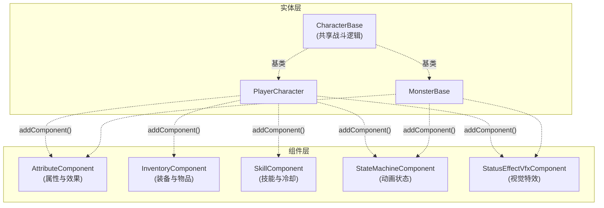
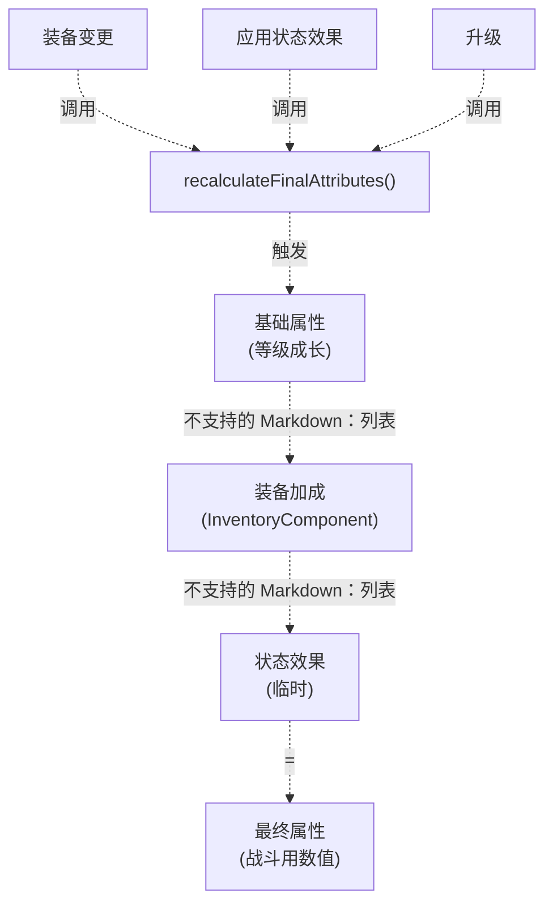
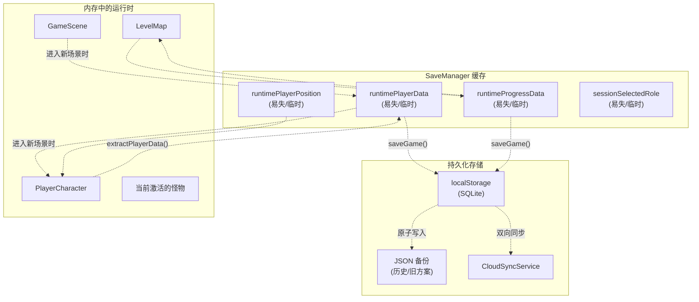
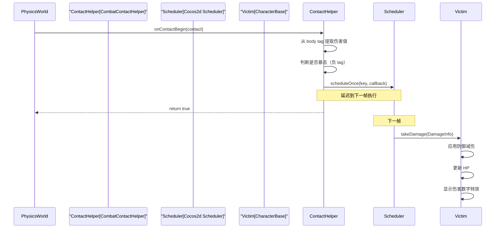
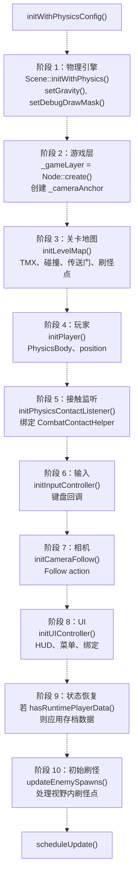
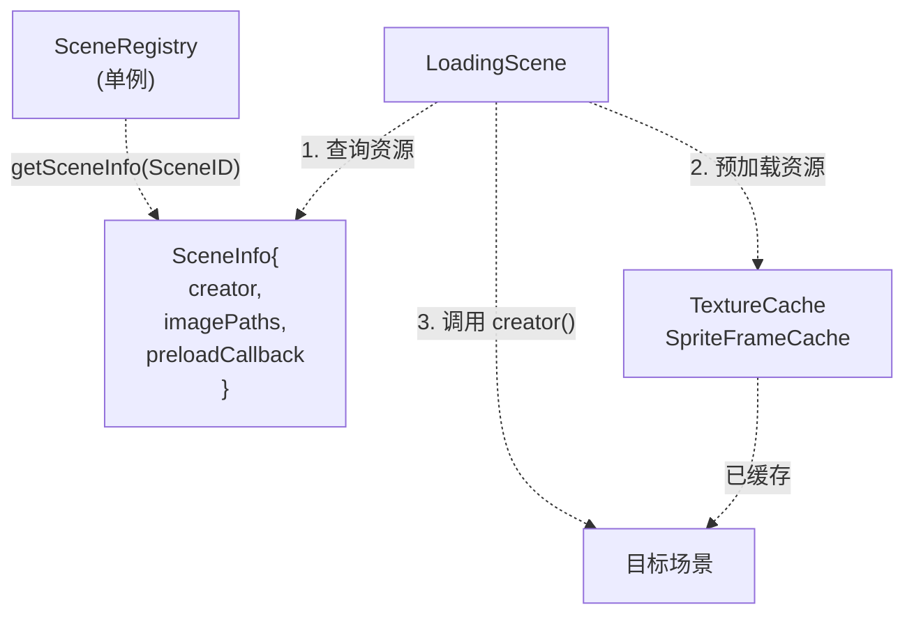
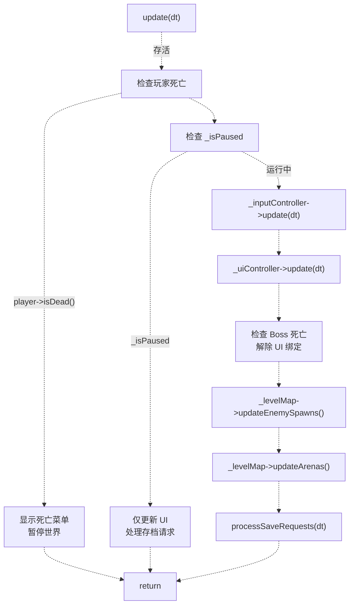
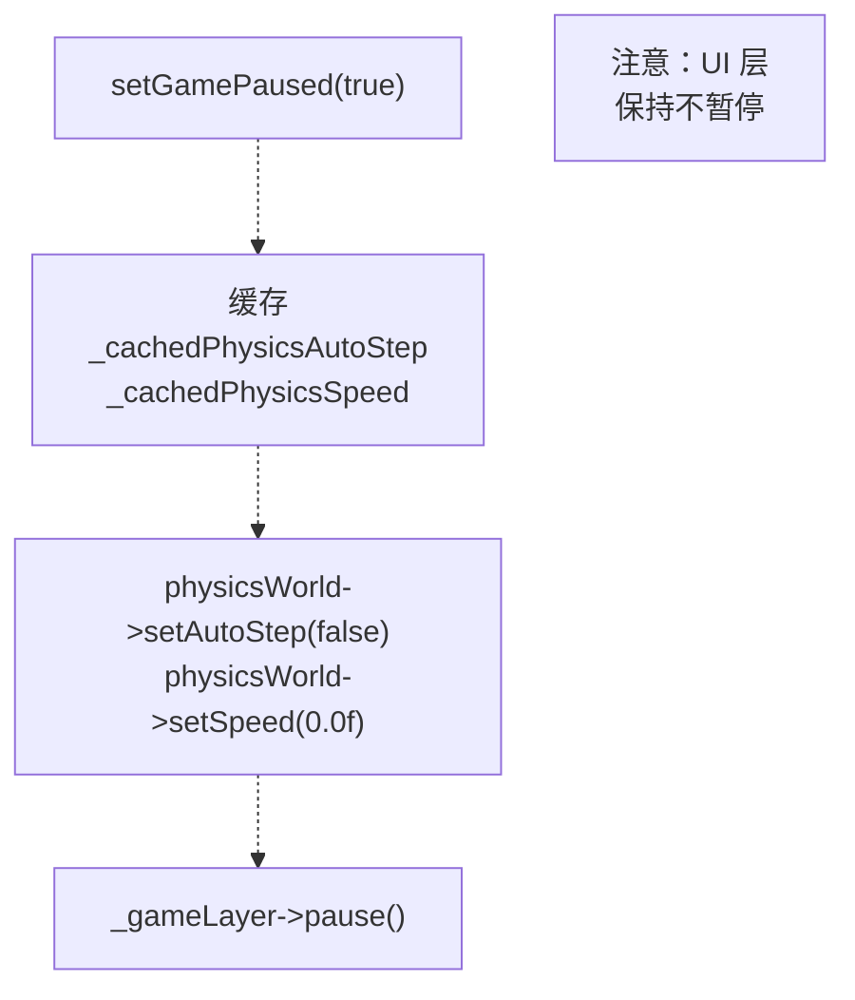
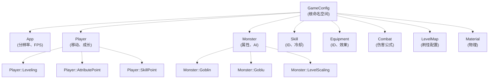

# 系统架构

> **相关源文件**
> * [Adventure-King/Classes/Character/Player/SkillSets/AssassinSkillSet.cpp](https://github.com/lilong555/Adventure-King/blob/60df0f40/Adventure-King/Classes/Character/Player/SkillSets/AssassinSkillSet.cpp)
> * [Adventure-King/Classes/Character/Player/SkillSets/WarriorSkillSet.cpp](https://github.com/lilong555/Adventure-King/blob/60df0f40/Adventure-King/Classes/Character/Player/SkillSets/WarriorSkillSet.cpp)
> * [Adventure-King/Classes/Configs/GameConfig.h](https://github.com/lilong555/Adventure-King/blob/60df0f40/Adventure-King/Classes/Configs/GameConfig.h)
> * [Adventure-King/Classes/Save/JsonSerializer.cpp](https://github.com/lilong555/Adventure-King/blob/60df0f40/Adventure-King/Classes/Save/JsonSerializer.cpp)
> * [Adventure-King/Classes/Save/SaveData.h](https://github.com/lilong555/Adventure-King/blob/60df0f40/Adventure-King/Classes/Save/SaveData.h)
> * [Adventure-King/Classes/Save/SaveManager.cpp](https://github.com/lilong555/Adventure-King/blob/60df0f40/Adventure-King/Classes/Save/SaveManager.cpp)
> * [Adventure-King/Classes/Scenes/CombatContactHelper.cpp](https://github.com/lilong555/Adventure-King/blob/60df0f40/Adventure-King/Classes/Scenes/CombatContactHelper.cpp)
> * [Adventure-King/Classes/Scenes/DebugScene.cpp](https://github.com/lilong555/Adventure-King/blob/60df0f40/Adventure-King/Classes/Scenes/DebugScene.cpp)
> * [Adventure-King/Classes/Scenes/DebugScene.h](https://github.com/lilong555/Adventure-King/blob/60df0f40/Adventure-King/Classes/Scenes/DebugScene.h)
> * [Adventure-King/Classes/Scenes/GameScene.cpp](https://github.com/lilong555/Adventure-King/blob/60df0f40/Adventure-King/Classes/Scenes/GameScene.cpp)
> * [Adventure-King/Classes/Scenes/GameScene.h](https://github.com/lilong555/Adventure-King/blob/60df0f40/Adventure-King/Classes/Scenes/GameScene.h)
> * [Adventure-King/Classes/Scenes/LevelMap.cpp](https://github.com/lilong555/Adventure-King/blob/60df0f40/Adventure-King/Classes/Scenes/LevelMap.cpp)
> * [Adventure-King/Classes/Scenes/LevelMap.h](https://github.com/lilong555/Adventure-King/blob/60df0f40/Adventure-King/Classes/Scenes/LevelMap.h)
> * [Adventure-King/proj.win32/Adventure-King.vcxproj](https://github.com/lilong555/Adventure-King/blob/60df0f40/Adventure-King/proj.win32/Adventure-King.vcxproj)
> * [Adventure-King/proj.win32/Adventure-King.vcxproj.filters](https://github.com/lilong555/Adventure-King/blob/60df0f40/Adventure-King/proj.win32/Adventure-King.vcxproj.filters)

## 目的与范围

本文描述 Adventure-King 的高层架构，重点说明主要系统的结构组织方式、系统间交互，以及数据流模式。内容涵盖应用入口、场景管理、基于组件的实体设计，以及玩法系统的整体编排方式。

如需了解某个子系统的细节，请参阅：

* 场景生命周期与切换：[场景系统](<场景系统.md>)
* 玩家角色实现：[PlayerCharacter](<玩家角色（PlayerCharacter）.md>)
* 怪物 AI 与战斗：[MonsterBase](<怪物基类（MonsterBase）.md>)
* 关卡加载与世界管理：[LevelMap](<关卡地图（LevelMap）.md>)
* UI 与输入处理：[用户界面](<用户界面.md>)
* 存/读档系统：[存档与持久化](<存档与持久化.md>)
* 配置常量：[配置系统](<配置系统.md>)

来源： [Adventure-King/Classes/Scenes/GameScene.h L1-L275](https://github.com/lilong555/Adventure-King/blob/60df0f40/Adventure-King/Classes/Scenes/GameScene.h#L1-L275)

 [Adventure-King/Classes/Scenes/GameScene.cpp L1-L1028](https://github.com/lilong555/Adventure-King/blob/60df0f40/Adventure-King/Classes/Scenes/GameScene.cpp#L1-L1028)

 [Adventure-King/Classes/Scenes/DebugScene.h L1-L264](https://github.com/lilong555/Adventure-King/blob/60df0f40/Adventure-King/Classes/Scenes/DebugScene.h#L1-L264)

---

## 架构概览

Adventure-King 基于 Cocos2d-x 游戏引擎，采用分层架构（layered architecture）。系统被组织为职责边界清晰的多个层次，以保证关注点分离。

**应用入口与引擎集成**

```

```

**层级划分**

架构主要将关注点分离为四层：

| 层级 | 用途 | 关键类 | 生命周期所有者 |
| --- | --- | --- | --- |
| **应用层** | 引擎初始化、全局服务 | `AppDelegate` | OS/Engine |
| **场景层** | 流程控制、系统编排 | `GameScene`、`HelloWorldScene`、`MapScene`、`LoadingScene` | `Director` |
| **实体层** | 游戏对象、角色逻辑 | `PlayerCharacter`、`MonsterBase`、`CharacterBase` | Scene |
| **组件层** | 可复用的实体行为模块 | `AttributeComponent`、`SkillComponent`、`InventoryComponent` | Entity |

来源： [Adventure-King/Classes/Scenes/GameScene.h L38-L275](https://github.com/lilong555/Adventure-King/blob/60df0f40/Adventure-King/Classes/Scenes/GameScene.h#L38-L275)

1. **物理世界（Physics World）** - [GameScene.cpp L131-L148](https://github.com/lilong555/Adventure-King/blob/60df0f40/GameScene.cpp#L131-L148)
2. **游戏层（Game Layer）** - [GameScene.cpp L150-L159](https://github.com/lilong555/Adventure-King/blob/60df0f40/GameScene.cpp#L150-L159)（相机跟随目标）
3. **关卡地图（Level Map）** - [GameScene.cpp L162-L169](https://github.com/lilong555/Adventure-King/blob/60df0f40/GameScene.cpp#L162-L169)（TMX、碰撞、传送门、刷怪点）
4. **玩家角色（Player Character）** - [GameScene.cpp L172-L175](https://github.com/lilong555/Adventure-King/blob/60df0f40/GameScene.cpp#L172-L175)（需要从地图获取出生点）
5. **物理监听器（Physics Listener）** - [GameScene.cpp L178-L180](https://github.com/lilong555/Adventure-King/blob/60df0f40/GameScene.cpp#L178-L180)（接触回调）
6. **输入控制器（Input Controller）** - [GameScene.cpp L181](https://github.com/lilong555/Adventure-King/blob/60df0f40/GameScene.cpp#L181-L181)
7. **相机跟随（Camera Follow）** - [GameScene.cpp L184-L186](https://github.com/lilong555/Adventure-King/blob/60df0f40/GameScene.cpp#L184-L186)
8. **UI 控制器（UI Controller）** - [GameScene.cpp L189-L192](https://github.com/lilong555/Adventure-King/blob/60df0f40/GameScene.cpp#L189-L192)
9. **状态恢复（State Restoration）** - [GameScene.cpp L196-L306](https://github.com/lilong555/Adventure-King/blob/60df0f40/GameScene.cpp#L196-L306)（如存在则读取存档数据）

来源： [Adventure-King/Classes/Scenes/GameScene.cpp L130-L326](https://github.com/lilong555/Adventure-King/blob/60df0f40/Adventure-King/Classes/Scenes/GameScene.cpp#L130-L326)

 [Adventure-King/Classes/Scenes/GameScene.h L136-L248](https://github.com/lilong555/Adventure-King/blob/60df0f40/Adventure-King/Classes/Scenes/GameScene.h#L136-L248)

---

## 基于组件的角色系统

角色实体通过 Cocos2d-x 的组件系统体现“组合优于继承”。`PlayerCharacter` 与 `MonsterBase` 都继承自 `CharacterBase`，而 `CharacterBase` 提供了共享的战斗机制。

**组件挂载架构**



**组件通信模式**

组件通过“所属实体（owning entity）”间接交互，而不是组件之间直接互相引用，从而保持低耦合：

| 模式 | 示例 | 实现 |
| --- | --- | --- |
| **拉取（查询）** | UI 读取玩家属性 | `PlayerStatusBar` → `getAttributeComponent()` → `getAttributeValue()` |
| **推送（回调）** | 装备变化触发属性更新 | `InventoryComponent` → `setEquipmentChangeCallback()` → `recalculateFinalAttributes()` |
| **事件（延迟）** | 技能冷却倒计时 | `SkillComponent::update()` → `currentCooldown -= dt` |

**属性计算流程**

属性采用分层计算模型：基础值会被装备加成与当前生效的效果（状态）进一步修正：



来源： [Adventure-King/Classes/Character/Player/PlayerCharacter.h L1-L300](https://github.com/lilong555/Adventure-King/blob/60df0f40/Adventure-King/Classes/Character/Player/PlayerCharacter.h#L1-L300)

 [Adventure-King/Classes/Character/Base/CharacterBase.h L1-L250](https://github.com/lilong555/Adventure-King/blob/60df0f40/Adventure-King/Classes/Character/Base/CharacterBase.h#L1-L250)

---

## 数据流模式

系统针对不同关注点使用不同的数据流模式，以适配各子系统的特性与性能需求。

**运行时数据 vs 持久化数据**



**场景切换数据流**

场景切换通过 `SaveManager` 作为数据桥接层，避免场景之间直接耦合：

1. **离开场景：** `GameScene::returnToMapScene()` 调用 `SaveManager::cacheRuntimePlayerData()` - [GameScene.cpp L746-L757](https://github.com/lilong555/Adventure-King/blob/60df0f40/GameScene.cpp#L746-L757)
2. **进入场景：** `GameScene::initWithPhysicsConfig()` 检查 `SaveManager::hasRuntimePlayerData()` - [GameScene.cpp L503-L509](https://github.com/lilong555/Adventure-King/blob/60df0f40/GameScene.cpp#L503-L509)
3. **清空缓存：** 新场景完成恢复后调用 `SaveManager::clearRuntimePlayerData()`

**战斗事件流**

战斗逻辑使用“延迟执行”模式，以避免在物理回调期间直接修改场景状态：



这样可以避免在物理迭代过程中修改场景图（scene graph），否则可能造成崩溃或未定义行为。

来源： [Adventure-King/Classes/Scenes/CombatContactHelper.cpp L27-L238](https://github.com/lilong555/Adventure-King/blob/60df0f40/Adventure-King/Classes/Scenes/CombatContactHelper.cpp#L27-L238)

 [Adventure-King/Classes/Save/SaveManager.cpp L84-L189](https://github.com/lilong555/Adventure-King/blob/60df0f40/Adventure-King/Classes/Save/SaveManager.cpp#L84-L189)

---

## 初始化流程

每个场景都遵循多阶段初始化流程，并且阶段之间存在明确的依赖顺序。

**GameScene 初始化阶段**



**关键依赖链**

初始化顺序保证每个阶段在执行时拥有其所需依赖：

| 阶段 | 依赖 | 产出 |
| --- | --- | --- |
| 物理 | 引擎 | `PhysicsWorld`、重力 |
| 游戏层 | Scene | 相机目标、节点容器 |
| 关卡地图 | 游戏层、`PhysicsWorld` | 碰撞体、刷怪点、传送门区域 |
| 玩家 | 关卡地图 | 玩家出生位置、`PhysicsBody` |
| 接触监听 | `PhysicsWorld`、玩家 | 伤害回调、落地检测 |
| 输入 | 玩家 | 移动控制、技能触发 |
| 相机 | 玩家、游戏层 | 跟随动作 |
| UI | 玩家、场景 | 状态条、菜单、输入路由 |
| 状态恢复 | 玩家、关卡地图 | 恢复 HP/装备/世界状态 |

**LoadingScene 的资源预加载**

`LoadingScene` 通过 `SceneRegistry` 将资源加载与场景初始化解耦：



来源： [Adventure-King/Classes/Scenes/GameScene.cpp L130-L326](https://github.com/lilong555/Adventure-King/blob/60df0f40/GameScene.cpp#L130-L326)

 [Adventure-King/Classes/Scenes/DebugScene.cpp L90-L144](https://github.com/lilong555/Adventure-King/blob/60df0f40/Adventure-King/Classes/Scenes/DebugScene.cpp#L90-L144)

 [Adventure-King/Classes/Managers/SceneRegistry.h L1-L100](https://github.com/lilong555/Adventure-King/blob/60df0f40/Adventure-King/Classes/Managers/SceneRegistry.h#L1-L100)

---

## 更新循环架构

更新循环采用“按优先级排序”的执行模型：UI 输入优先于世界模拟。

**每帧执行顺序**



**不同状态下的执行差异**

更新循环会根据游戏状态调整行为：

| 状态 | 输入 | 世界 | UI | 存档 |
| --- | --- | --- | --- | --- |
| **进行中** | ✓ 处理 | ✓ 更新 | ✓ 更新 | ✓ 自动存档 |
| **暂停** | ✗ 忽略 | ✗ 冻结 | ✓ 更新 | ✓ 允许手动 |
| **死亡** | ✗ 忽略 | ✗ 冻结 | ✓ 死亡菜单 | ✗ 阻止 |

**暂停实现**

暂停通过操作 `PhysicsWorld` 与 `_gameLayer` 来冻结世界但不影响 UI：



暂停机制由 `GamePauseHelper::setWorldPaused()` 实现 - [GameScene.cpp L778-L787](https://github.com/lilong555/Adventure-King/blob/60df0f40/GameScene.cpp#L778-L787)

来源： [Adventure-King/Classes/Scenes/GameScene.cpp L864-L936](https://github.com/lilong555/Adventure-King/blob/60df0f40/Adventure-King/Classes/Scenes/GameScene.cpp#L864-L936)

 [Adventure-King/Classes/Scenes/DebugScene.cpp L717-L844](https://github.com/lilong555/Adventure-King/blob/60df0f40/Adventure-King/Classes/Scenes/DebugScene.cpp#L717-L844)

---

## 关键设计模式

该架构使用多种设计模式来维持模块化与可扩展性。

**模板方法（场景生命周期）**

`GameScene` 定义初始化算法，而子类提供场景特定数据：

```javascript
// GameScene.h - 抽象接口
virtual std::string getLevelName() const = 0;
virtual LevelConfig getLevelConfig() const { return LevelConfig(); }

// 具体实现
class OriginMushroomScene : public GameScene {
    std::string getLevelName() const override { return "起源之菇"; }
    LevelConfig getLevelConfig() const override { /* ... */ }
};
```

**策略（技能集）**

玩家能力被封装在按职业区分的技能集类中：

```

```

**单例（全局服务）**

多个管理类使用单例模式以便全局访问：

* `SaveManager` - [SaveManager.cpp L28-L46](https://github.com/lilong555/Adventure-King/blob/60df0f40/SaveManager.cpp#L28-L46)
* `SceneRegistry` - 场景创建与资源清单
* `MusicManager` - 音频播放

**观察者（装备回调）**

装备变化通过回调通知依赖系统：

```cpp
// 示例：DebugScene 中给玩家绑定“装备变更回调”
_player->setEquipmentChangeCallback(
    [this](EquipmentSlot slot, const std::shared_ptr<Equipment> &equipment)
    {
        this->onEquipmentChanged(slot, equipment);
    });
```

**享元（配置）**

`GameConfig.h` 将所有游戏常量集中在编译期命名空间中：

```csharp
namespace GameConfig::Player {
    inline constexpr float WALKSPEED = 220.0f;
    inline constexpr float JUMP_FORCE = 400.0f;
}

namespace GameConfig::Monster::Goblin {
    inline constexpr float MAX_HP = 700.0f;
    inline constexpr float MOVE_SPEED = 200.0f;
}
```

这样可以消除重复字面量，并为所有可调参数提供单一事实来源（single source of truth）。

来源： [Adventure-King/Classes/Configs/GameConfig.h L1-L700](https://github.com/lilong555/Adventure-King/blob/60df0f40/Adventure-King/Classes/Configs/GameConfig.h#L1-L700)

 [Adventure-King/Classes/Character/Player/SkillSets/WarriorSkillSet.cpp L1-L400](https://github.com/lilong555/Adventure-King/blob/60df0f40/Adventure-King/Classes/Character/Player/SkillSets/WarriorSkillSet.cpp#L1-L400)

 [Adventure-King/Classes/Save/SaveManager.cpp L28-L80](https://github.com/lilong555/Adventure-King/blob/60df0f40/Adventure-King/Classes/Save/SaveManager.cpp#L28-L80)

---

## 配置驱动设计

整款游戏的参数都通过 `GameConfig.h` 来配置，常量按逻辑命名空间组织。

**配置命名空间结构**



**配置读取模式**

所有系统只从 `GameConfig` 读取数据，但不写入，从而建立单向数据流：

| 系统 | 使用的命名空间 | 示例用法 |
| --- | --- | --- |
| `PlayerCharacter` | `GameConfig::Player` | `WALKSPEED`、`JUMP_FORCE`、`Leveling::getRequiredExp()` |
| `MonsterBase` | `GameConfig::Monster::Base` | `SCALE`、`AI_UPDATE_INTERVAL` |
| `GoblinMonster` | `GameConfig::Monster::Goblin` | `MAX_HP`、`MOVE_SPEED`、`ATTACK_RANGE` |
| `SkillComponent` | `GameConfig::Skill` | `Bomb::BOMB_CD`、`Fireball::FIREBALL_MP` |
| `LevelMap` | `GameConfig::LevelMap` | `SPAWN_INTERVAL_SECONDS`、`DEFAULT_GATE_INTERACT_DISTANCE` |

**内联计算函数**

复杂公式会被封装为配置命名空间内的 inline 函数：

```csharp
// 装备效果按等级缩放
namespace GameConfig::EquipmentEffect::ThornsArmor {
    inline float getReflectRate(int level) {
        level = std::max(1, level);
        float rate = REFLECT_RATE_BASE + REFLECT_RATE_PER_LEVEL * (level - 1);
        return std::clamp(rate, 0.0f, REFLECT_RATE_MAX);
    }
}

// 按等级计算经验需求
namespace GameConfig::Player::Leveling {
    inline int getRequiredExp(int level) {
        return std::max(1, level) * REQUIRED_EXP_PER_LEVEL;
    }
}
```

这种做法把平衡调参集中管理，同时让公式紧贴对应常量，降低维护成本。

来源： [Adventure-King/Classes/Configs/GameConfig.h L1-L700](https://github.com/lilong555/Adventure-King/blob/60df0f40/Adventure-King/Classes/Configs/GameConfig.h#L1-L700)
