# 组件架构（Component Architecture）

> **相关源文件**
> * [Adventure-King/Classes/Character/Base/CharacterBase.cpp](https://github.com/lilong555/Adventure-King/blob/60df0f40/Adventure-King/Classes/Character/Base/CharacterBase.cpp)
> * [Adventure-King/Classes/Character/Base/CharacterBase.h](https://github.com/lilong555/Adventure-King/blob/60df0f40/Adventure-King/Classes/Character/Base/CharacterBase.h)
> * [Adventure-King/Classes/Character/Monster/Monsters/GobluMonster.cpp](https://github.com/lilong555/Adventure-King/blob/60df0f40/Adventure-King/Classes/Character/Monster/Monsters/GobluMonster.cpp)
> * [Adventure-King/Classes/Character/Monster/Monsters/GobluMonster.h](https://github.com/lilong555/Adventure-King/blob/60df0f40/Adventure-King/Classes/Character/Monster/Monsters/GobluMonster.h)
> * [Adventure-King/Classes/Character/Player/PlayerCharacter.cpp](https://github.com/lilong555/Adventure-King/blob/60df0f40/Adventure-King/Classes/Character/Player/PlayerCharacter.cpp)
> * [Adventure-King/Classes/Character/Player/PlayerCharacter.h](https://github.com/lilong555/Adventure-King/blob/60df0f40/Adventure-King/Classes/Character/Player/PlayerCharacter.h)
> * [Adventure-King/Classes/UI/BossHealthBar.cpp](https://github.com/lilong555/Adventure-King/blob/60df0f40/Adventure-King/Classes/UI/BossHealthBar.cpp)
> * [Adventure-King/Classes/UI/BossHealthBar.h](https://github.com/lilong555/Adventure-King/blob/60df0f40/Adventure-King/Classes/UI/BossHealthBar.h)
> * [Adventure-King/Classes/UI/InventoryLayer.cpp](https://github.com/lilong555/Adventure-King/blob/60df0f40/Adventure-King/Classes/UI/InventoryLayer.cpp)
> * [Adventure-King/Classes/UI/InventoryLayer.h](https://github.com/lilong555/Adventure-King/blob/60df0f40/Adventure-King/Classes/UI/InventoryLayer.h)
> * [Adventure-King/Classes/UI/SkillBar.cpp](https://github.com/lilong555/Adventure-King/blob/60df0f40/Adventure-King/Classes/UI/SkillBar.cpp)

## 目的与范围

本文档描述 `PlayerCharacter` 所使用的组件化架构：通过组件组合的方式拼装玩法功能。`PlayerCharacter` 使用 Cocos2d-x 的组件系统挂载模块化子系统（属性、背包、技能、动画状态、表现特效等），从而实现关注点分离，并使不同角色类型之间能复用同一套机制。

关于玩家角色生命周期与初始化流程，请参见 [3.1](<玩家角色（PlayerCharacter）.md>)。关于装备机制，请参见 [3.1.2](<装备与背包.md>)。关于技能机制，请参见 [3.1.3](<技能系统.md>)。关于升级成长，请参见 [3.1.4](<升级与成长.md>)。

---

## 组件系统概览

`PlayerCharacter` 继承自 `CharacterBase`，而 `CharacterBase` 继承自 `cocos2d::Sprite`。Cocos2d-x 引擎提供了内建组件系统：组件通过 `Node::addComponent()` 挂到节点上，并会在无需手动调用的情况下自动收到每帧 `update(dt)` 回调。

**关键特性：**

| 方面 | 实现 |
| --- | --- |
| 挂载 | 在 `init()` 期间调用 `Node::addComponent(Component*)` |
| 存储 | 引擎管理的组件列表（不是手动指针数组） |
| 更新循环 | 引擎会自动调用 `Component::update(dt)` |
| 获取 | `Node::getComponent(const std::string& name)` |
| 所有权 | 组件由引擎引用计数管理 |

### 组件挂载模式

```yaml
PlayerCharacter::init()
  └─> addComponent(AttributeComponent)
  └─> addComponent(InventoryComponent)
  └─> addComponent(SkillComponent)
  └─> addComponent(StateMachineComponent)
  └─> addComponent(StatusEffectVfxComponent)
```

**来源：** [Adventure-King/Classes/Character/Player/PlayerCharacter.cpp L222-L234](https://github.com/lilong555/Adventure-King/blob/60df0f40/Adventure-King/Classes/Character/Player/PlayerCharacter.cpp#L222-L234)

 [Adventure-King/Classes/Character/Base/CharacterBase.cpp L31-L62](https://github.com/lilong555/Adventure-King/blob/60df0f40/Adventure-King/Classes/Character/Base/CharacterBase.cpp#L31-L62)

---

## 核心组件

### 组件挂载与生命周期

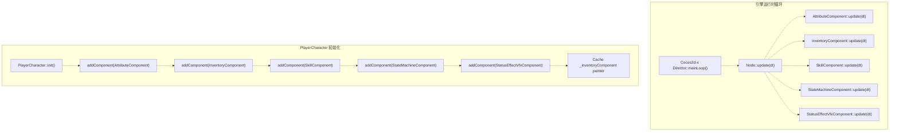

**来源：** [Adventure-King/Classes/Character/Player/PlayerCharacter.cpp L222-L276](https://github.com/lilong555/Adventure-King/blob/60df0f40/Adventure-King/Classes/Character/Player/PlayerCharacter.cpp#L222-L276)

 [Adventure-King/Classes/Character/Base/CharacterBase.cpp L130-L145](https://github.com/lilong555/Adventure-King/blob/60df0f40/Adventure-King/Classes/Character/Base/CharacterBase.cpp#L130-L145)

---

### AttributeComponent（属性组件）

用于管理角色属性、状态效果与属性计算：在基础属性、装备加成、当前状态效果叠加后，提供最终计算值。

**职责：**

* 存储并计算 `Attributes`（MAX_HP、STRENGTH、DEFENSE、CRITICAL_RATE 等）
* 应用来自 `InventoryComponent` 的装备属性加成
* 管理 `StatusEffect` 列表（燃烧、中毒、增益、减益等）
* 提供 `recalculateFinalAttributes()` 重新计算总属性
* 执行装备效果相关的伤害钩子（反伤、吸血等）

**关键方法：**

| 方法 | 作用 |
| --- | --- |
| `getAttributeValue(AttributeType)` | 返回最终计算后的属性值 |
| `setBaseAttributes(Attributes)` | 设置角色基础属性 |
| `recalculateFinalAttributes()` | 重新计算：基础 + 装备 + 状态效果 |
| `addStatusEffect(StatusEffect)` | 添加 DOT/增益/减益（含持续时间） |
| `removeStatusEffect(StatusEffectType)` | 移除指定类型效果 |
| `executeAfterDealDamageHooks()` | 触发吸血/命中后效果 |
| `executeAfterReceiveDamageHooks()` | 触发反伤/紧急救援等 |

**集成点：**

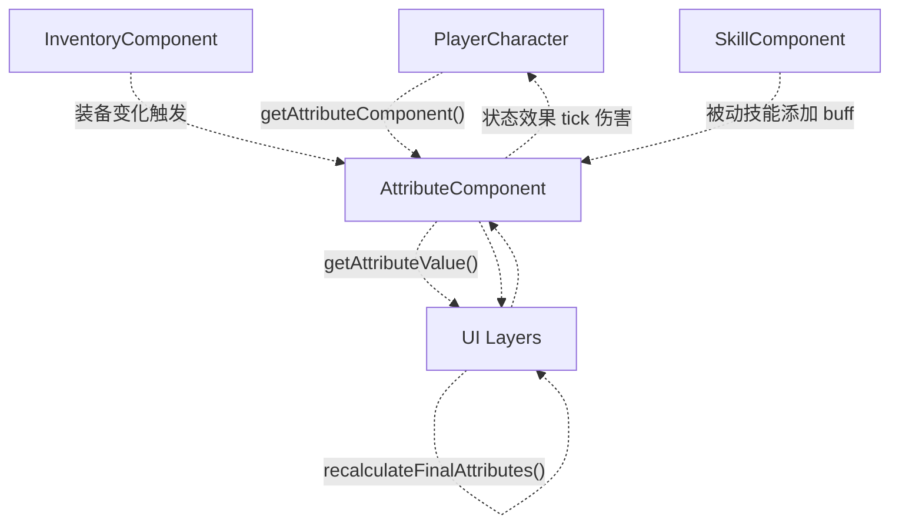

**属性重算流程：**

1. 玩家装备/卸下物品 → `InventoryComponent::equip()` → `AttributeComponent::recalculateFinalAttributes()`
2. 玩家升级 → `PlayerCharacter::levelUp()` → `applyAttributeGrowth()` → `AttributeComponent::setBaseAttributes()`
3. 玩家学习被动技能 → `SkillComponent::equipPassiveSkill()` → `AttributeComponent::addStatusEffect(permanent=true)`
4. 状态效果到期 → `AttributeComponent::update(dt)` → 自动移除 → 触发重算

**来源：** [Adventure-King/Classes/Character/Player/PlayerCharacter.cpp L229](https://github.com/lilong555/Adventure-King/blob/60df0f40/Adventure-King/Classes/Character/Player/PlayerCharacter.cpp#L229-L229)

 [Adventure-King/Classes/Character/Base/CharacterBase.cpp L31-L40](https://github.com/lilong555/Adventure-King/blob/60df0f40/Adventure-King/Classes/Character/Base/CharacterBase.cpp#L31-L40)

 [Adventure-King/Classes/UI/InventoryLayer.cpp L8-L9](https://github.com/lilong555/Adventure-King/blob/60df0f40/Adventure-King/Classes/UI/InventoryLayer.cpp#L8-L9)

---

### InventoryComponent（背包组件）

用于管理装备槽位与背包物品：负责装备/卸下，并把装备属性加成应用到 `AttributeComponent`。

**数据结构：**

```cpp
// From context in InventoryLayer and PlayerCharacter
std::map<EquipmentSlot, std::shared_ptr<Equipment>> _equippedItems;
std::vector<std::shared_ptr<Equipment>> _inventoryItems;
```

**装备槽位：**

| 槽位 | 类型 | 作用 |
| --- | --- | --- |
| `WEAPON` | Weapon | 攻击伤害、攻速、动画前缀 |
| `HELMET` | Equipment | 属性加成、特殊效果 |
| `ARMOR` | Equipment | 防御加成、特殊效果 |
| `BOOTS` | Equipment | 移速加成、特殊效果 |

**关键方法：**

| 方法 | 作用 |
| --- | --- |
| `equip(Equipment)` | 装备到槽位；如槽位已有则先卸下旧物品 |
| `unequip(EquipmentSlot)` | 从槽位卸下装备 |
| `getEquippedItems()` | 返回所有已装备物品映射 |
| `getInventoryItems()` | 返回背包内所有物品列表 |
| `addToInventory(Equipment)` | 添加物品到背包（按 ID 去重） |
| `getEquippedWeapon()` | 返回武器（`std::shared_ptr<Weapon>`） |

**装备效果集成：**

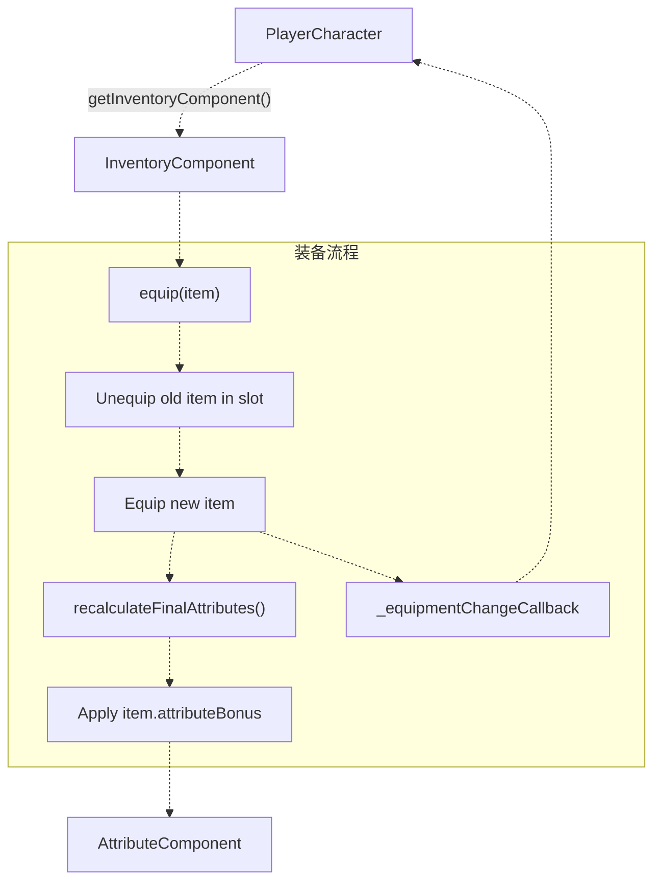

**组件缓存模式：**

`PlayerCharacter` 会缓存指向 `InventoryComponent` 的指针，避免频繁执行 `getComponent()` + `dynamic_cast`：

```
// PlayerCharacter.cpp:236
_inventoryComponent = dynamic_cast<InventoryComponent*>(getComponent("InventoryComponent"));
```

缓存后可在不使用 `const_cast` 的情况下提供 const-correct 访问：

```
// PlayerCharacter.cpp:738-741
InventoryComponent* PlayerCharacter::getInventoryComponent() const
{
    return _inventoryComponent;
}
```

**来源：** [Adventure-King/Classes/Character/Player/PlayerCharacter.cpp L236-L240](https://github.com/lilong555/Adventure-King/blob/60df0f40/Adventure-King/Classes/Character/Player/PlayerCharacter.cpp#L236-L240)

 [Adventure-King/Classes/Character/Player/PlayerCharacter.h L75-L110](https://github.com/lilong555/Adventure-King/blob/60df0f40/Adventure-King/Classes/Character/Player/PlayerCharacter.h#L75-L110)

 [Adventure-King/Classes/UI/InventoryLayer.cpp L762-L773](https://github.com/lilong555/Adventure-King/blob/60df0f40/Adventure-King/Classes/UI/InventoryLayer.cpp#L762-L773)

---

### SkillComponent（技能组件）

用于管理主动/被动技能槽、冷却与技能点分配，并与 UI（技能栏显示）与背包（技能配置）集成。

**数据结构：**

```cpp
// Active skills: equipped to slots with cooldowns
std::vector<std::shared_ptr<ActiveSkill>> _activeSlots;

// Passive skills: equipped for permanent attribute bonuses
std::vector<std::shared_ptr<PassiveSkill>> _passiveSlots;

// Available skills (learned but not equipped)
std::vector<std::shared_ptr<ActiveSkill>> _availableActiveSkills;
std::vector<std::shared_ptr<PassiveSkill>> _availablePassiveSkills;
```

**技能类型：**

| 类型 | 特性 | 存储位置 |
| --- | --- | --- |
| ActiveSkill | 冷却、耗蓝、触发动画 | 装备到技能槽（Q、E 等） |
| PassiveSkill | 永久属性加成或触发型效果 | 装备到被动槽 |

**关键方法：**

| 方法 | 作用 |
| --- | --- |
| `getActiveSlots()` | 返回已装备的主动技能 |
| `getPassiveSlots()` | 返回已装备的被动技能 |
| `equipActiveSkill(slot, skillId)` | 装备主动技能到指定槽 |
| `unequipActiveSkill(slot)` | 从槽位移除主动技能 |
| `equipPassiveSkill(slot, skillId)` | 装备被动技能 |
| `isPassiveSkillEquipped(skillId)` | 检查指定被动是否已生效 |
| `useActiveSkill(slot)` | 若冷却就绪且 MP 足够则触发 |
| `reduceCooldown(slot, seconds)` | 减少技能冷却（用于 crit echo 等） |

**冷却管理：**

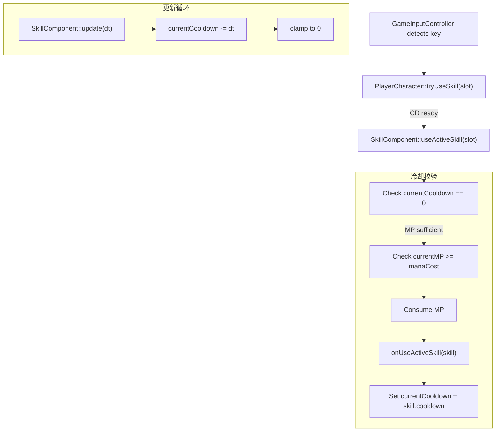

**被动技能集成：**

被动技能会在 `AttributeComponent` 上添加永久 `StatusEffect`：

```sql
// When passive skill is equipped:
auto effect = StatusEffect::create();
effect->type = StatusEffectType::PASSIVE_SKILL;
effect->isPermanent = true;
effect->setAttributeBonus(passiveSkill->attributeBonus);
attributeComponent->addStatusEffect(effect);
```

**UI 集成：**

* `SkillBar` 调用 `getActiveSlots()` 用于显示冷却
* `InventoryLayer` 在玩家调整配置时调用 `equipActiveSkill()` / `equipPassiveSkill()`

**来源：** [Adventure-King/Classes/Character/Player/PlayerCharacter.cpp L231](https://github.com/lilong555/Adventure-King/blob/60df0f40/Adventure-King/Classes/Character/Player/PlayerCharacter.cpp#L231-L231)

 [Adventure-King/Classes/UI/SkillBar.cpp L142-L210](https://github.com/lilong555/Adventure-King/blob/60df0f40/Adventure-King/Classes/UI/SkillBar.cpp#L142-L210)

 [Adventure-King/Classes/UI/InventoryLayer.cpp L8](https://github.com/lilong555/Adventure-King/blob/60df0f40/Adventure-King/Classes/UI/InventoryLayer.cpp#L8-L8)

---

### StateMachineComponent（状态机组件）

用于管理角色动画状态切换：把 `CharacterState` 枚举映射到缓存动画 key，并按状态驱动动画播放。

**角色状态：**

| 状态 | 作用 | 是否循环 |
| --- | --- | --- |
| `IDLE` | 站立 | 是（1 帧） |
| `WALKING` | 走路 | 是（循环） |
| `RUNNING` | 跑步 | 是（循环） |
| `ATTACKING` | 攻击/技能 | 否（一次性） |
| `HURT` | 受击 | 否（一次性） |
| `DEAD` | 死亡 | 否（一次性，停留最后一帧） |

**关键方法：**

| 方法 | 作用 |
| --- | --- |
| `registerStateAnimation(CharacterState, animKey)` | 注册：状态 → 动画缓存 key |
| `changeState(CharacterState)` | 切换到新状态并播放动画 |
| `getCurrentState()` | 获取当前状态 |

**状态切换流程：**

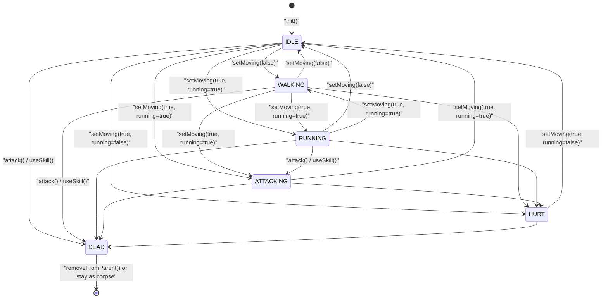

**动画注册：**

```
// PlayerCharacter.cpp:254-262
if (auto sm = getStateMachineComponent())
{
    sm->registerStateAnimation(CharacterState::IDLE, _animationKeyPrefix + "_idle");
    sm->registerStateAnimation(CharacterState::WALKING, _animationKeyPrefix + "_walk");
    sm->registerStateAnimation(CharacterState::RUNNING, _animationKeyPrefix + "_run");
    sm->registerStateAnimation(CharacterState::HURT, _animationKeyPrefix + "_hurt");
    sm->changeState(CharacterState::IDLE);
}
```

**来源：** [Adventure-King/Classes/Character/Player/PlayerCharacter.cpp L232-L262](https://github.com/lilong555/Adventure-King/blob/60df0f40/Adventure-King/Classes/Character/Player/PlayerCharacter.cpp#L232-L262)

 [Adventure-King/Classes/Character/Base/CharacterBase.cpp L42-L51](https://github.com/lilong555/Adventure-King/blob/60df0f40/Adventure-King/Classes/Character/Base/CharacterBase.cpp#L42-L51)

 [Adventure-King/Classes/Character/Base/CharacterBase.h L5-L6](https://github.com/lilong555/Adventure-King/blob/60df0f40/Adventure-King/Classes/Character/Base/CharacterBase.h#L5-L6)

---

### StatusEffectVfxComponent（状态效果特效组件）

用于管理状态效果的表现特效（燃烧、中毒、增益等）：根据 `AttributeComponent` 的状态效果列表生成/移除粒子系统。

**职责：**

* 每帧轮询 `AttributeComponent::getStatusEffects()`
* 检测到新增效果时生成粒子特效
* 效果到期时移除粒子特效
* 基于 physics body 边界，将粒子定位在角色中心

**带 VFX 的状态效果类型：**

| 效果类型 | 表现 | 持续时间来源 |
| --- | --- | --- |
| `BURNING` | 火焰粒子（红/橙） | `StatusEffect::duration` |
| `POISONED` | 毒素粒子（绿） | `StatusEffect::duration` |
| `EXCITED` | 速度线（黄） | `StatusEffect::duration` |
| `FULL_HP_CRIT` | 发光效果（白） | 条件触发（无 duration） |

**VFX 生命周期：**

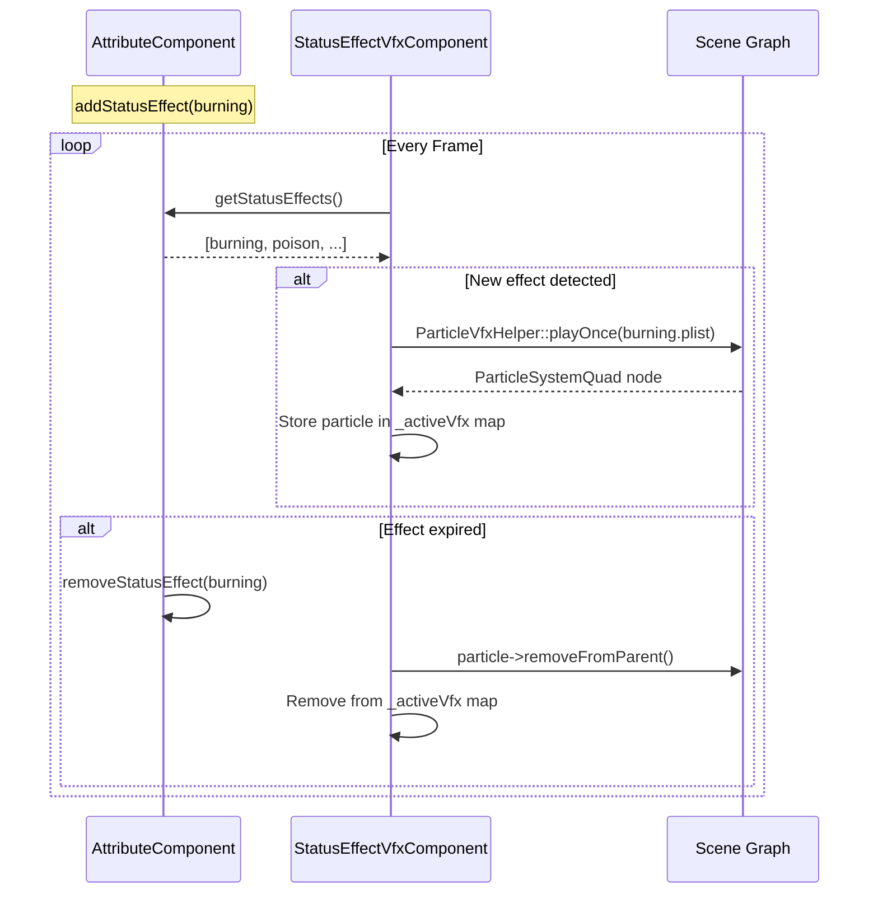

**来源：** [Adventure-King/Classes/Character/Player/PlayerCharacter.cpp L233](https://github.com/lilong555/Adventure-King/blob/60df0f40/Adventure-King/Classes/Character/Player/PlayerCharacter.cpp#L233-L233)

 [Adventure-King/Classes/Character/Base/CharacterBase.cpp L6-L7](https://github.com/lilong555/Adventure-King/blob/60df0f40/Adventure-King/Classes/Character/Base/CharacterBase.cpp#L6-L7)

---

## 组件通信模式

### 直接访问模式

组件经常需要读/写其它组件的数据。引擎提供 `getComponent(name)` 以便检索。

**常见访问路径：**

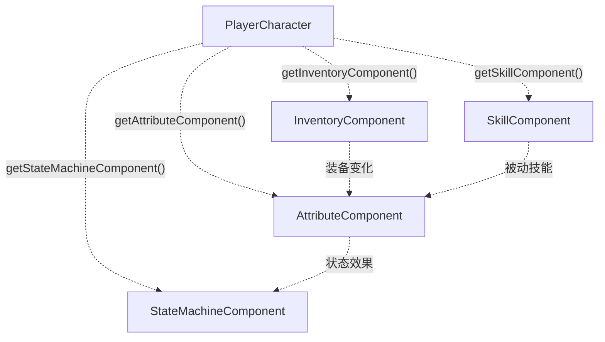

**组件 Getter 实现：**

```
// CharacterBase.cpp:31-40
AttributeComponent* CharacterBase::getAttributeComponent()
{
    return static_cast<AttributeComponent*>(this->getComponent("AttributeComponent"));
}

AttributeComponent* CharacterBase::getAttributeComponent() const
{
    return const_cast<CharacterBase*>(this)->getAttributeComponent();
}
```

**来源：** [Adventure-King/Classes/Character/Base/CharacterBase.cpp L31-L62](https://github.com/lilong555/Adventure-King/blob/60df0f40/Adventure-King/Classes/Character/Base/CharacterBase.cpp#L31-L62)

---

### 回调模式

`PlayerCharacter` 提供一些回调 hook，组件或外部系统可以在状态变化时触发。

**装备变化回调：**

```javascript
// PlayerCharacter.h:107-109
using EquipmentChangeCallback = std::function<void(EquipmentSlot, const std::shared_ptr<Equipment>&)>;
void setEquipmentChangeCallback(const EquipmentChangeCallback& callback);
```

用法：`InventoryLayer` 会绑定该回调，在装备变化时刷新 UI：

```
// When player equips/unequips:
if (_equipmentChangeCallback)
{
    _equipmentChangeCallback(slot, item);
}
```

**技能使用回调：**

```javascript
// CharacterBase.h:122
virtual void onUseActiveSkill(const ActiveSkill& skill) {}
```

`SkillComponent` 在技能成功使用时调用该回调，让 `PlayerCharacter` 能播放动画、生成命中框或触发其它副作用。

**来源：** [Adventure-King/Classes/Character/Player/PlayerCharacter.h L107-L109](https://github.com/lilong555/Adventure-King/blob/60df0f40/Adventure-King/Classes/Character/Player/PlayerCharacter.h#L107-L109)

 [Adventure-King/Classes/Character/Player/PlayerCharacter.cpp L832-L836](https://github.com/lilong555/Adventure-King/blob/60df0f40/Adventure-King/Classes/Character/Player/PlayerCharacter.cpp#L832-L836)

 [Adventure-King/Classes/Character/Base/CharacterBase.h L122](https://github.com/lilong555/Adventure-King/blob/60df0f40/Adventure-King/Classes/Character/Base/CharacterBase.h#L122-L122)

---

### 事件驱动的状态效果（DOT）

状态效果的跳伤（tick）由 `AttributeComponent::update(dt)` 驱动。这种模式让 DOT 伤害与攻击者生命周期解耦。

**DOT Tick 流程：**

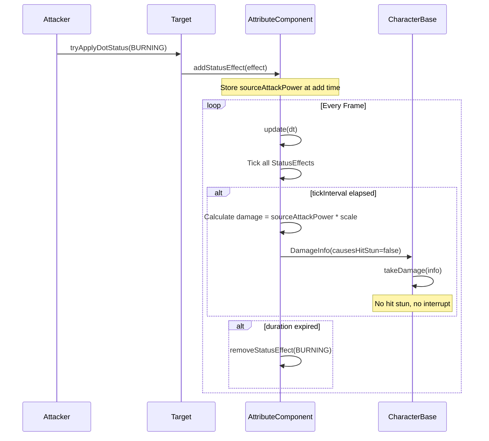

**关键特性：**

* `StatusEffect` 在创建时会保存 `sourceAttackPower`，用于快照化攻击者伤害
* DOT 伤害设置 `causesHitStun=false`，避免持续打断/刷受击
* `AttributeComponent` 独立于攻击者存在来 tick DOT

**来源：** [Adventure-King/Classes/Character/Player/PlayerCharacter.cpp L474-L512](https://github.com/lilong555/Adventure-King/blob/60df0f40/Adventure-King/Classes/Character/Player/PlayerCharacter.cpp#L474-L512)

 [Adventure-King/Classes/Character/Base/CharacterBase.cpp L148-L248](https://github.com/lilong555/Adventure-King/blob/60df0f40/Adventure-King/Classes/Character/Base/CharacterBase.cpp#L148-L248)

---

## 组件初始化顺序

### 初始化顺序图

```mermaid
flowchart TD

Start["PlayerCharacter::init()"]
InitSprite["initWithSpriteFrameName()"]
SetAnchor["setAnchorPoint(MIDDLE)"]
SetScale["setScale(visualScale)"]
InitAssetPaths["initAssetPaths()"]
UnscheduleUpdate["unscheduleUpdate() before each add"]
AddAttr["addComponent(AttributeComponent)"]
AddInv["addComponent(InventoryComponent)"]
AddSkill["addComponent(SkillComponent)"]
AddSM["addComponent(StateMachineComponent)"]
AddVfx["addComponent(StatusEffectVfxComponent)"]
CacheInv["_inventoryComponent = getComponent()"]
InitAttributes["initAttributesByRole()"]
RefreshHP["refreshHpMpFromAttributes()"]
SetupPhysics["helperSetupPhysicsBody()"]
EnsureMove["ensureMoveAnimations()"]
EnsureState["ensureStateAnimations()"]
RegisterStates["sm->registerStateAnimation()"]
CreateSkillSet["createSkillSet()"]
InitSkills["_skillSet->initSkills()"]
DefaultInventory["ensureDefaultInventory()"]
ScheduleUpdate["scheduleUpdateWithPriority(1)"]

Start -.-> InitSprite
InitAssetPaths -.-> UnscheduleUpdate
CacheInv -.-> InitAttributes
RefreshHP -.-> SetupPhysics
SetupPhysics -.-> EnsureMove
RegisterStates -.-> CreateSkillSet
InitSkills -.-> DefaultInventory

subgraph Finalize ["Finalize"]
    DefaultInventory
    ScheduleUpdate
    DefaultInventory -.-> ScheduleUpdate
end

subgraph subGraph5 ["Skill Setup"]
    CreateSkillSet
    InitSkills
    CreateSkillSet -.-> InitSkills
end

subgraph subGraph4 ["Animation Setup"]
    EnsureMove
    EnsureState
    RegisterStates
    EnsureMove -.-> EnsureState
    EnsureState -.-> RegisterStates
end

subgraph subGraph3 ["Physics Setup"]
    SetupPhysics
end

subgraph subGraph2 ["Data Initialization"]
    InitAttributes
    RefreshHP
    InitAttributes -.-> RefreshHP
end

subgraph subGraph1 ["Component Attachment"]
    UnscheduleUpdate
    AddAttr
    AddInv
    AddSkill
    AddSM
    AddVfx
    CacheInv
    UnscheduleUpdate -.-> AddAttr
    AddAttr -.-> AddInv
    AddInv -.-> AddSkill
    AddSkill -.-> AddSM
    AddSM -.-> AddVfx
    AddVfx -.-> CacheInv
end

subgraph subGraph0 ["Visual Setup"]
    InitSprite
    SetAnchor
    SetScale
    InitAssetPaths
    InitSprite -.-> SetAnchor
    SetAnchor -.-> SetScale
    SetScale -.-> InitAssetPaths
end
```

**Unschedule 模式：**

为了避免在添加多个组件时触发 Cocos2d-x 关于重复 `scheduleUpdate()` 的警告，代码会在每次 `addComponent()` 前先 `unscheduleUpdate()`：

```xml
// PlayerCharacter.cpp:222-226
auto addComponentNoUpdateWarning = <FileRef file-url="https://github.com/lilong555/Adventure-King/blob/60df0f40/this" undefined  file-path="this">Hii</FileRef> {
    if (!component) return false;
    this->unscheduleUpdate();
    return this->addComponent(component);
};
```

该 lambda 会在每次添加组件前取消 update 调度，然后在第 275 行以 priority=1 重新调度。

**来源：** [Adventure-King/Classes/Character/Player/PlayerCharacter.cpp L180-L277](https://github.com/lilong555/Adventure-King/blob/60df0f40/Adventure-King/Classes/Character/Player/PlayerCharacter.cpp#L180-L277)

---

## 数据流图

### 装备变化流程

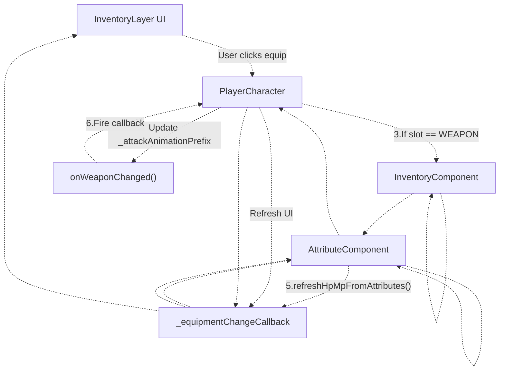

**来源：** [Adventure-King/Classes/Character/Player/PlayerCharacter.cpp L805-L859](https://github.com/lilong555/Adventure-King/blob/60df0f40/Adventure-King/Classes/Character/Player/PlayerCharacter.cpp#L805-L859)

 [Adventure-King/Classes/UI/InventoryLayer.cpp L762-L773](https://github.com/lilong555/Adventure-King/blob/60df0f40/Adventure-King/Classes/UI/InventoryLayer.cpp#L762-L773)

---

### 技能使用流程

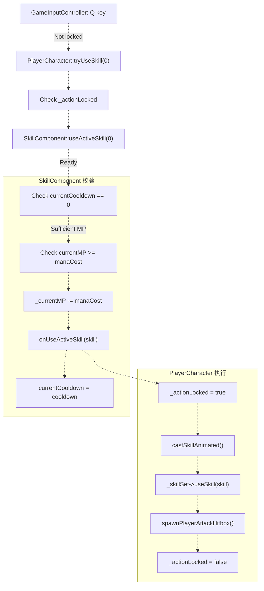

**来源：** [Adventure-King/Classes/Character/Player/PlayerCharacter.cpp L994-L1016](https://github.com/lilong555/Adventure-King/blob/60df0f40/Adventure-King/Classes/Character/Player/PlayerCharacter.cpp#L994-L1016)

 [Adventure-King/Classes/UI/GameInputController.cpp](https://github.com/lilong555/Adventure-King/blob/60df0f40/Adventure-King/Classes/UI/GameInputController.cpp)

（已被引用，但未在本文档中提供）

---

### 升级与属性成长流程

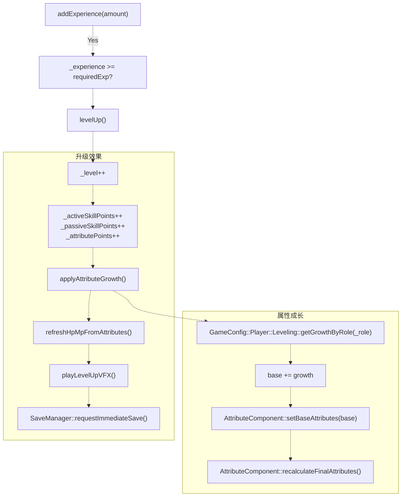

**成长配置：**

```
// GameConfig::Player::Leveling::getGrowthByRole(CharacterRole) returns Attributes
// Example: Warrior gains +5 HP, +0.5 STRENGTH per level
```

**来源：** [Adventure-King/Classes/Character/Player/PlayerCharacter.cpp L537-L605](https://github.com/lilong555/Adventure-King/blob/60df0f40/Adventure-King/Classes/Character/Player/PlayerCharacter.cpp#L537-L605)

---

## 组件化复用

组件架构让不同角色类型之间可以复用逻辑：`PlayerCharacter` 与 `MonsterBase` 都使用同一套组件系统。

### 共享组件使用

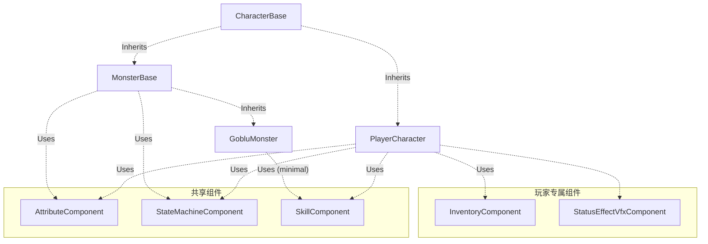

**怪物 vs 玩家组件使用：**

| 组件 | PlayerCharacter | MonsterBase | 说明 |
| --- | --- | --- | --- |
| AttributeComponent | ✅ Full | ✅ Full | 统一的属性系统 |
| StateMachineComponent | ✅ Full | ✅ Full | 统一的动画状态 |
| SkillComponent | ✅ Full | ⚠️ Partial | 怪物很少有技能 |
| InventoryComponent | ✅ Required | ❌ None | 玩家专属 |
| StatusEffectVfxComponent | ✅ Full | ❌ None | 玩家专属的表现增强 |

**Boss 专属扩展：**

`GobluMonster`（Boss）在 `MonsterBase` 基础上扩展破防条机制，但仍使用标准 `AttributeComponent` 管理 HP/属性：

```javascript
// GobluMonster.h:25-26
virtual int getBreakMeter() const override { return _breakMeter; }
virtual int getBreakMax() const override { return GameConfig::Monster::Goblu::BREAK_MAX; }
```

**来源：** [Adventure-King/Classes/Character/Base/CharacterBase.h L1-L201](https://github.com/lilong555/Adventure-King/blob/60df0f40/Adventure-King/Classes/Character/Base/CharacterBase.h#L1-L201)

 [Adventure-King/Classes/Character/Monster/Monsters/GobluMonster.h L8-L69](https://github.com/lilong555/Adventure-King/blob/60df0f40/Adventure-King/Classes/Character/Monster/Monsters/GobluMonster.h#L8-L69)

 [Adventure-King/Classes/Character/Monster/Monsters/GobluMonster.cpp L249-L265](https://github.com/lilong555/Adventure-King/blob/60df0f40/Adventure-King/Classes/Character/Monster/Monsters/GobluMonster.cpp#L249-L265)

---

## 汇总表：组件职责

| 组件 | 主要职责 | 关键数据 | 更新频率 |
| --- | --- | --- | --- |
| **AttributeComponent** | 属性、状态效果、战斗计算 | `Attributes`, `std::vector<StatusEffect>` | 每帧（DOT tick） |
| **InventoryComponent** | 装备槽位、背包列表 | `std::map<EquipmentSlot, Equipment>`, `std::vector<Equipment>` | 按需（装备/卸下） |
| **SkillComponent** | 技能槽、冷却、技能点 | `std::vector<ActiveSkill>`, `std::vector<PassiveSkill>` | 每帧（冷却 tick） |
| **StateMachineComponent** | 动画状态切换 | `CharacterState _currentState` | 状态变化时 |
| **StatusEffectVfxComponent** | 状态效果表现 | `std::map<StatusEffectType, ParticleSystemQuad*>` | 每帧（与 AttributeComponent 同步） |

**来源：** [Adventure-King/Classes/Character/Player/PlayerCharacter.cpp L6-L234](https://github.com/lilong555/Adventure-King/blob/60df0f40/Adventure-King/Classes/Character/Player/PlayerCharacter.cpp#L6-L234)
