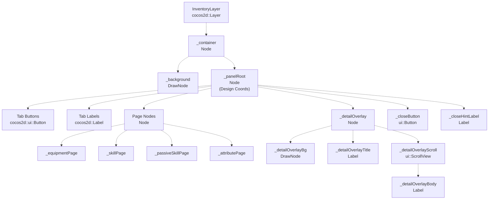
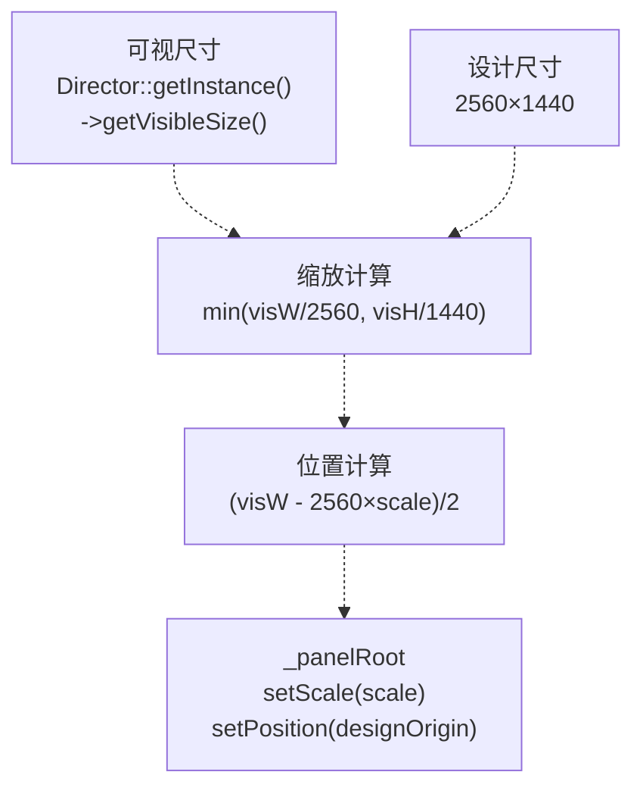
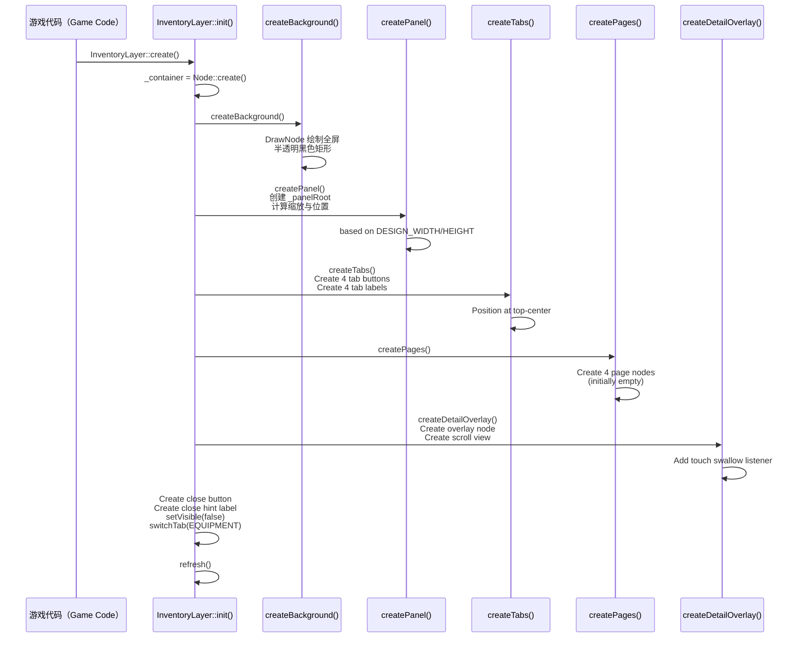

# 背包层（InventoryLayer）

> **相关源文件**
> * [Adventure-King/Classes/Character/Player/PlayerCharacter.cpp](https://github.com/lilong555/Adventure-King/blob/60df0f40/Adventure-King/Classes/Character/Player/PlayerCharacter.cpp)
> * [Adventure-King/Classes/Character/Player/PlayerCharacter.h](https://github.com/lilong555/Adventure-King/blob/60df0f40/Adventure-King/Classes/Character/Player/PlayerCharacter.h)
> * [Adventure-King/Classes/UI/InventoryLayer.cpp](https://github.com/lilong555/Adventure-King/blob/60df0f40/Adventure-King/Classes/UI/InventoryLayer.cpp)
> * [Adventure-King/Classes/UI/InventoryLayer.h](https://github.com/lilong555/Adventure-King/blob/60df0f40/Adventure-King/Classes/UI/InventoryLayer.h)
> * [Adventure-King/Classes/UI/SkillBar.cpp](https://github.com/lilong555/Adventure-King/blob/60df0f40/Adventure-King/Classes/UI/SkillBar.cpp)

## 目的与范围

`InventoryLayer` 是一个模态 UI 组件，为玩家提供完整界面用于管理装备、技能（主动与被动）以及角色属性。它以全屏覆盖层的形式运行，允许玩家查看、装备、卸下、学习与升级各类角色成长系统。

本文覆盖背包 UI 的结构、布局系统与功能。关于底层数据结构（装备、技能、属性）请参见 [PlayerCharacter](<玩家角色（PlayerCharacter）.md>)。关于 UI 状态编排请参见 [GameUIController](<游戏 UI 控制器（GameUIController）.md>)。关于 HUD 上技能冷却显示请参见 [HUD Elements](<HUD 元素.md>)。

**来源**：[Adventure-King/Classes/UI/InventoryLayer.h L1-L161](https://github.com/lilong555/Adventure-King/blob/60df0f40/Adventure-King/Classes/UI/InventoryLayer.h#L1-L161)

 [Adventure-King/Classes/UI/InventoryLayer.cpp L1-L100](https://github.com/lilong555/Adventure-King/blob/60df0f40/Adventure-King/Classes/UI/InventoryLayer.cpp#L1-L100)

---

## 架构概览

`InventoryLayer` 采用分 Tab 的界面结构：包含四个主要页面、用于展示扩展信息的详情覆盖层，以及一套“基于设计坐标”的布局系统，可适配不同分辨率。

### 组件层级



**来源**：[Adventure-King/Classes/UI/InventoryLayer.cpp L365-L411](https://github.com/lilong555/Adventure-King/blob/60df0f40/Adventure-King/Classes/UI/InventoryLayer.cpp#L365-L411)

 [Adventure-King/Classes/UI/InventoryLayer.h L104-L160](https://github.com/lilong555/Adventure-King/blob/60df0f40/Adventure-King/Classes/UI/InventoryLayer.h#L104-L160)

---

## 布局与缩放系统

`InventoryLayer` 使用固定分辨率（2560×1440）的设计坐标系，然后根据实际窗口大小进行缩放以适配。该方法可以保证不同分辨率下布局一致。

### 设计常量

| 常量 | 值 | 用途 |
| --- | --- | --- |
| `DESIGN_WIDTH` | 2560.0f | 所有布局计算的参考宽度 |
| `DESIGN_HEIGHT` | 1440.0f | 所有布局计算的参考高度 |
| `SAFE_MARGIN_X` | 120.0f | 距屏幕边缘的水平安全边距 |
| `SAFE_MARGIN_Y` | 100.0f | 距屏幕边缘的垂直安全边距 |
| `DETAIL_PANEL_W` | 720.0f | 详情覆盖面板宽度 |
| `DETAIL_PANEL_H` | 360.0f | 详情覆盖面板高度 |

### 缩放变换



缩放逻辑会保持纵横比并把面板居中：

```cpp
const float scaleX = visibleSize.width / DESIGN_WIDTH;
const float scaleY = visibleSize.height / DESIGN_HEIGHT;
const float scale = std::min(scaleX, scaleY);

const Vec2 designOrigin(
    origin.x + (visibleSize.width - DESIGN_WIDTH * scale) * 0.5f,
    origin.y + (visibleSize.height - DESIGN_HEIGHT * scale) * 0.5f);

_panelRoot->setScale(scale);
_panelRoot->setPosition(designOrigin);
```

**来源：** [Adventure-King/Classes/UI/InventoryLayer.cpp L20-L48](https://github.com/lilong555/Adventure-King/blob/60df0f40/Adventure-King/Classes/UI/InventoryLayer.cpp#L20-L48)

 [Adventure-King/Classes/UI/InventoryLayer.cpp L474-L498](https://github.com/lilong555/Adventure-King/blob/60df0f40/Adventure-King/Classes/UI/InventoryLayer.cpp#L474-L498)



### 刷新流程

调用 `refresh()`（例如绑定玩家后或切换 Tab 后）时：

1. 检查 `_currentTab` 判断需要刷新哪个页面
2. 调用对应刷新方法：
   * `refreshEquipmentPage()`
   * `refreshSkillPage()`
   * `refreshPassiveSkillPage()`
   * `refreshAttributePage()`
3. 每个刷新方法的共性：
   * 清空页面节点（`removeAllChildren()`）
   * 从 `_player` 及其组件读取数据
   * 创建新的 UI 元素（Label、Button、ScrollView 等）
   * 按设计坐标摆放元素
   * 注册点击处理，用于更新选择状态

### 图标按钮创建

所有可点击项目（装备、技能、Tab）都使用辅助函数 `createIconButton()`：

* 输入目标尺寸、回调与 tint 颜色
* 使用占位图标创建 `cocos2d::ui::Button`
* 将图标缩放到目标尺寸
* 注册点击监听
* 返回按钮用于定位

**来源**：[Adventure-King/Classes/UI/InventoryLayer.cpp L365-L411](https://github.com/lilong555/Adventure-King/blob/60df0f40/Adventure-King/Classes/UI/InventoryLayer.cpp#L365-L411)

 [Adventure-King/Classes/UI/InventoryLayer.cpp L461-L498](https://github.com/lilong555/Adventure-King/blob/60df0f40/Adventure-King/Classes/UI/InventoryLayer.cpp#L461-L498)

 [Adventure-King/Classes/UI/InventoryLayer.cpp L804-L827](https://github.com/lilong555/Adventure-King/blob/60df0f40/Adventure-King/Classes/UI/InventoryLayer.cpp#L804-L827)

 [Adventure-King/Classes/UI/InventoryLayer.cpp L847-L873](https://github.com/lilong555/Adventure-King/blob/60df0f40/Adventure-King/Classes/UI/InventoryLayer.cpp#L847-L873)

---

## 与游戏系统的集成

`InventoryLayer` 与多个系统集成，以提供完整的背包管理体验：

### 与 GameUIController 的集成

`GameUIController` 持有 `InventoryLayer` 实例，并管理其可见性生命周期：

* 玩家按下背包键（B）时调用 `show()`
* 玩家按下 ESC 或点击关闭按钮时调用 `hide()`
* 通过 `setCloseCallback()` 设置关闭回调，用于处理“返回暂停菜单”与“返回玩法”的逻辑分支

暂停/背包上下文标记系统详见 [GameUIController](<游戏 UI 控制器（GameUIController）.md>)。

### 与 SaveManager 的集成

当 UI 修改了玩家状态（装备物品、升级属性、学习技能）后，会触发：

```
SaveManager::getInstance()->requestImmediateSave(reason);
```

这会标记存档系统在下一次自动存档 tick 或玩家离开关卡时立即持久化。

延迟存档系统详见 [SaveManager](<存档管理器（SaveManager）.md>)。

### 与 GameConfig 的集成

所有数值参数（属性增量、技能冷却、特殊效果数值）都从 `GameConfig` 命名空间读取，例如：

* `GameConfig::Player::AttributePoint::MAX_HP_PER_POINT`
* `GameConfig::Skill::Passive::BLOODTHIRST`（技能 ID）
* `GameConfig::Equipment::Weapon::EMBER_STAFF`（物品 ID）
* `GameConfig::EquipmentEffect::BloodPactSword::getLifestealRate(level)`
* `GameConfig::StatusEffect::Burning::DURATION_SECONDS`

这让策划可以通过修改单一配置文件来平衡游戏，而不需要改动 UI 代码。

完整配置命名空间列表请参见 [Configuration System](<配置系统.md>)。

**来源**：[Adventure-King/Classes/UI/InventoryLayer.cpp L13-L17](https://github.com/lilong555/Adventure-King/blob/60df0f40/Adventure-King/Classes/UI/InventoryLayer.cpp#L13-L17)

 [Adventure-King/Classes/UI/InventoryLayer.cpp L253-L302](https://github.com/lilong555/Adventure-King/blob/60df0f40/Adventure-King/Classes/UI/InventoryLayer.cpp#L253-L302)

 [Adventure-King/Classes/Character/Player/PlayerCharacter.cpp L622-L649](https://github.com/lilong555/Adventure-King/blob/60df0f40/Adventure-King/Classes/Character/Player/PlayerCharacter.cpp#L622-L649)
