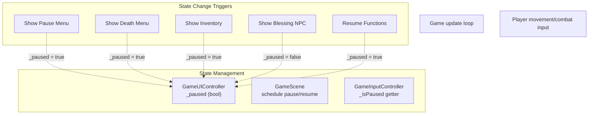

# 菜单系统

> **相关源文件**
> * [Adventure-King/Classes/Configs/GameSceneConfig.h](https://github.com/lilong555/Adventure-King/blob/60df0f40/Adventure-King/Classes/Configs/GameSceneConfig.h)
> * [Adventure-King/Classes/GameUI.cpp](https://github.com/lilong555/Adventure-King/blob/60df0f40/Adventure-King/Classes/GameUI.cpp)
> * [Adventure-King/Classes/GameUI.h](https://github.com/lilong555/Adventure-King/blob/60df0f40/Adventure-King/Classes/GameUI.h)
> * [Adventure-King/Classes/Scenes/GameInputController.cpp](https://github.com/lilong555/Adventure-King/blob/60df0f40/Adventure-King/Classes/Scenes/GameInputController.cpp)
> * [Adventure-King/Classes/Scenes/GameInputController.h](https://github.com/lilong555/Adventure-King/blob/60df0f40/Adventure-King/Classes/Scenes/GameInputController.h)
> * [Adventure-King/Classes/Scenes/GameUIController.cpp](https://github.com/lilong555/Adventure-King/blob/60df0f40/Adventure-King/Classes/Scenes/GameUIController.cpp)
> * [Adventure-King/Classes/Scenes/GameUIController.h](https://github.com/lilong555/Adventure-King/blob/60df0f40/Adventure-King/Classes/Scenes/GameUIController.h)
> * [Adventure-King/Resources/Scene/UI/bag.png](https://github.com/lilong555/Adventure-King/blob/60df0f40/Adventure-King/Resources/Scene/UI/bag.png)
> * [Adventure-King/Resources/Scene/UI/bagSelected.png](https://github.com/lilong555/Adventure-King/blob/60df0f40/Adventure-King/Resources/Scene/UI/bagSelected.png)

## 目的与范围

菜单系统负责管理 Adventure-King 玩法场景中的所有模态/覆盖类 UI：包括暂停菜单、死亡界面、背包管理、以及 NPC 交互对话等。本页记录菜单组件架构、状态管理、优先级层级，以及交互流程。

通用 UI 状态管理与编排请参见 [UI State Management](<UI 状态管理.md>)。触发菜单动作的输入处理请参见 [GameInputController](<游戏输入控制器（GameInputController）.md>)。状态条与技能条等 HUD 组件请参见 [HUD Elements](<HUD 元素.md>)。

---

## 菜单组件概览

菜单系统由多层 UI 组成，它们可以独立显示/隐藏，并通过特定优先级规则防止界面重叠冲突。所有菜单组件由 `GameUI` 创建并持有，由 `GameUIController` 负责编排。

| 菜单组件 | 类 | Z-Order | 用途 | 父级/创建位置 |
| --- | --- | --- | --- | --- |
| **暂停菜单** | `PauseMenu` | 100 | 暂停选项（继续、存档、读档、背包、主菜单） | [GameUI.cpp L127-L134](https://github.com/lilong555/Adventure-King/blob/60df0f40/GameUI.cpp#L127-L134) |
| **死亡菜单** | `PlayerDeathMenu` | 200 | 死亡界面（重开/返回） | [GameUI.cpp L136-L144](https://github.com/lilong555/Adventure-King/blob/60df0f40/GameUI.cpp#L136-L144) |
| **背包层** | `InventoryLayer` | 101 | 装备与技能管理 | [GameUI.cpp L146-L153](https://github.com/lilong555/Adventure-King/blob/60df0f40/GameUI.cpp#L146-L153) |
| **祝福 NPC 层** | `BlessingNpcLayer` | 220 | 用于角色升级的 NPC 交互对话 | [GameUI.cpp L155-L163](https://github.com/lilong555/Adventure-King/blob/60df0f40/GameUI.cpp#L155-L163) |
| **存档菜单层** | `SaveMenuLayer` | UI_Z_ORDER + 1 | 读档时的存档槽选择界面 | [GameUIController.cpp L147-L186](https://github.com/lilong555/Adventure-King/blob/60df0f40/GameUIController.cpp#L147-L186) |

**来源**：[GameUI.cpp L127-L163](https://github.com/lilong555/Adventure-King/blob/60df0f40/GameUI.cpp#L127-L163)

 [GameUIController.cpp L147-L186](https://github.com/lilong555/Adventure-King/blob/60df0f40/GameUIController.cpp#L147-L186)

 [GameSceneConfig.h L109-L111](https://github.com/lilong555/Adventure-King/blob/60df0f40/GameSceneConfig.h#L109-L111)

---

## 菜单组件架构

```mermaid
flowchart TD

PM["PauseMenu<br>_pauseMenu<br>Z: 100"]
DM["PlayerDeathMenu<br>_deathMenu<br>Z: 200"]
IL["InventoryLayer<br>_inventoryLayer<br>Z: 101"]
BNL["BlessingNpcLayer<br>_blessingNpcLayer<br>Z: 220"]
PM_Show["showPauseMenu()"]
PM_Hide["hidePauseMenu()"]
PM_Query["isPauseMenuShowing()"]
DM_Show["showDeathMenu()"]
DM_Hide["hideDeathMenu()"]
DM_Query["isDeathMenuShowing()"]
IL_Show["showInventory()"]
IL_Hide["hideInventory()"]
IL_Query["isInventoryShowing()"]
BNL_Show["showBlessingNpc()"]
BNL_Hide["hideBlessingNpc()"]
BNL_Query["isBlessingNpcShowing()"]
TglPause["togglePauseMenu()<br>(ESC key handler)"]
TglInv["toggleInventory()<br>(B key handler)"]
ShowDeath["showDeathMenu()"]
StateFlags["State Flags:<br>_paused<br>_inventoryReturnToPauseOnClose"]
SML["SaveMenuLayer<br>(created on-demand)<br>Z: UI_Z_ORDER + 1"]

TglPause -.->|"Load callback"| PM_Query
TglPause -.-> IL_Query
TglPause -.-> BNL_Query
TglPause -.-> DM_Query
TglPause -.-> PM_Show
TglPause -.-> PM_Hide
```

这会把控制器层的逻辑（场景切换、存档管理、状态协调）注入到菜单按钮的动作中。

**来源：** [GameUIController.cpp L32-L316](https://github.com/lilong555/Adventure-King/blob/60df0f40/GameUIController.cpp#L32-L316)

---

## 菜单状态同步

`_paused` 标记与 `_onPauseChanged` 回调用于保证系统内状态一致：

**图示：各组件间暂停状态同步**

任意菜单操作变更 `_paused` 后，`_onPauseChanged` 会把状态传递给 `GameScene`，由其负责调度器的 pause/resume。`GameInputController` 通过自身的 `_isPaused` getter 查询该状态，以在阻断玩法输入的同时允许 UI 输入。

**来源：** [GameUIController.h L63-L78](https://github.com/lilong555/Adventure-King/blob/60df0f40/GameUIController.h#L63-L78)

 [GameInputController.cpp L47-L48](https://github.com/lilong555/Adventure-King/blob/60df0f40/GameInputController.cpp#L47-L48)

 [GameInputController.cpp L179-L180](https://github.com/lilong555/Adventure-King/blob/60df0f40/GameInputController.cpp#L179-L180)

---

## 关键实现细节汇总

| 方面 | 实现 | 位置 |
| --- | --- | --- |
| **菜单创建** | 所有菜单在 `GameUI::init()` 中创建，并保存为成员指针 | [GameUI.cpp L32-L88](https://github.com/lilong555/Adventure-King/blob/60df0f40/GameUI.cpp#L32-L88) |
| **菜单 Z 序** | Death（200）> Blessing（220）> Inventory（101）> Pause（100） | [GameUI.cpp L127-L163](https://github.com/lilong555/Adventure-King/blob/60df0f40/GameUI.cpp#L127-L163) |
| **ESC 优先级** | Death > Inventory > Blessing > Pause toggle | [GameUIController.cpp L401-L445](https://github.com/lilong555/Adventure-King/blob/60df0f40/GameUIController.cpp#L401-L445) |
| **B 键优先级** | Death > Blessing > Inventory toggle | [GameUIController.cpp L447-L481](https://github.com/lilong555/Adventure-King/blob/60df0f40/GameUIController.cpp#L447-L481) |
| **上下文标记** | `_inventoryReturnToPauseOnClose` 控制关闭背包后的返回行为 | [GameUIController.h L65](https://github.com/lilong555/Adventure-King/blob/60df0f40/GameUIController.h#L65-L65) |
| **暂停传播** | `_onPauseChanged` 回调用于更新 `GameScene` 的 scheduler | [GameUIController.h L78](https://github.com/lilong555/Adventure-King/blob/60df0f40/GameUIController.h#L78-L78) |
| **死亡恢复** | 重开/返回前把 HP/MP 恢复至最大，避免立刻再次死亡 | [GameUIController.cpp L249-L254](https://github.com/lilong555/Adventure-King/blob/60df0f40/GameUIController.cpp#L249-L254) |
| **Toast 显示** | 固定 tag（88001）防止消息重叠 | [GameUIController.cpp L326](https://github.com/lilong555/Adventure-King/blob/60df0f40/GameUIController.cpp#L326-L326) |

**来源：** [GameUIController.cpp L1-L538](https://github.com/lilong555/Adventure-King/blob/60df0f40/GameUIController.cpp#L1-L538)

 [GameUI.cpp L1-L449](https://github.com/lilong555/Adventure-King/blob/60df0f40/GameUI.cpp#L1-L449)

 [GameUIController.h L1-L84](https://github.com/lilong555/Adventure-King/blob/60df0f40/GameUIController.h#L1-L84)

 [GameUI.h L1-L273](https://github.com/lilong555/Adventure-King/blob/60df0f40/GameUI.h#L1-L273)
